# Advanced Data Structure and Algorithm Analysis  
  
## Lecture 1 : AVL Tree,Splay Tree and Amortized Analysis  
  
### AVL Tree  
  
[Target]Speed up searching    
Problem: worst case complexity of BST may be O(N)    
[Definition]T是非空二叉树（空树的高度:=-1），T是高度平衡的，如果    
(1)左右子树是高度平衡的    
(2)左右子树的高度差|h<sub>L</sub>-h<sub>R</sub>|<=1    
定义BF(node) = h<sub>L</sub>-h<sub>R</sub> 为某个节点的平衡因子，如果T是高度平衡的，则BF(node) = -1,0,1    
Rotation：    
(1)single rotation:LL & RR    
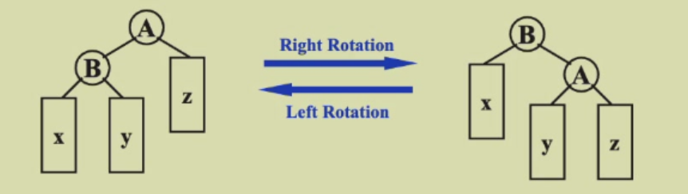    
保留了左小右大的顺序    
具体执行规则：    
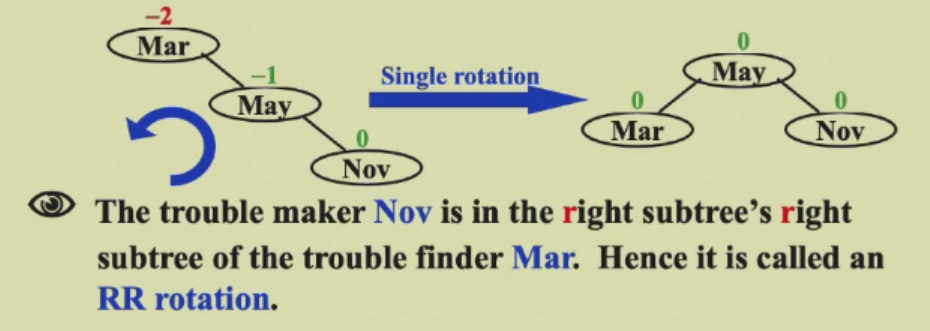    
RR（插入位置，是平衡因子超过1的节点的右儿子的右子树） rotation:找到第一个平衡因子超过1的父节点，旋转父节点的右儿子 Left single     
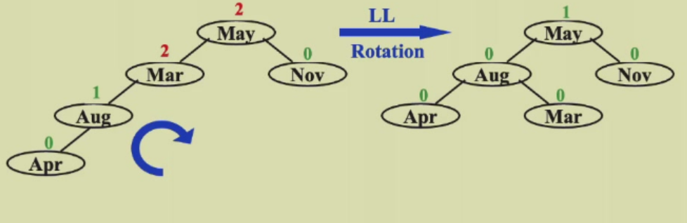    
LL rotation:找到第一个平衡因子超过1的父节点，旋转父节点的左儿子 Right single  
上例中旋转Mar也成立，思考:构造一个case，使得旋转Mar不成立    
    
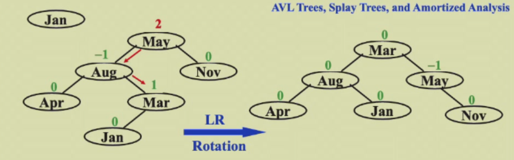    
LR rotation:找到第一个平衡因子超过1的父节点，将其左儿子的右儿子先左旋再右旋 double rotation    
RL rotation:找到第一个平衡因子超过1的父节点，将其右儿子的左儿子先右旋再左旋 double rotation    
具体代码实现：    
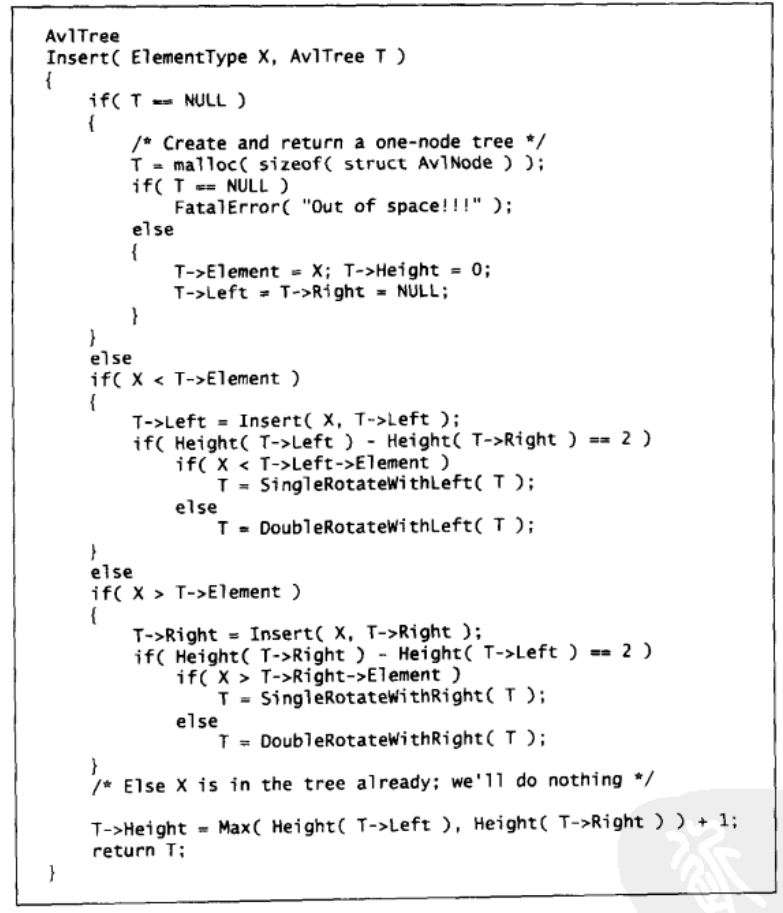  
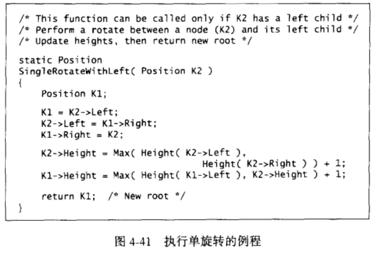  
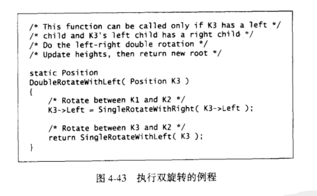  
    
时间复杂度：    
T = O(h)    
h与n关系的证明：    
n<sub>h</sub>是高度为h的AVL树的最少节点数，    
**n<sub>h</sub> = n<sub>h-1</sub> + n<sub>h-2</sub> + 1**    
n<sub>h</sub> = F<sub>h+3</sub> - 1,F为Fibonacci数    
    
### Splay Tree    
[Target]从空树开始的任意连续M个操作最多花费O(MlogN)time    
摊还时间复杂度：Worst time complexity may be O(N) but Amortized time complexity O(logN)    
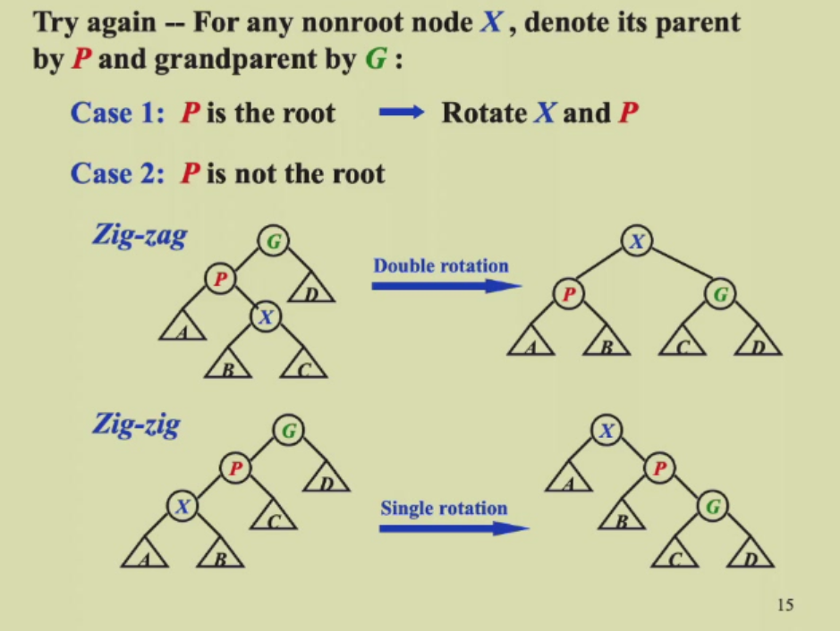    
Zig-zag double rotation,两次旋转X（LR rotation）    
Zig-zig 两次single rotation，先右旋P，再右旋X    
目的：将要查询的节点旋转到根节点的同时将树高降低至少一半    
Deletion：    
(1)Find X(X will be the root)    
(2)Delete X    
(3)FindMax(T<sub>L</sub>)(T<sub>L</sub> will be the root，树没有右子树)     
(4)Make T<sub>R</sub> the right child of the root of T<sub>L</sub>    
    
### Amortized Analysis     
    
worst-case >= amortized bound >= average-case    
(摊还成本是平均成本的上界，后续保证任意时刻ΣC<sub>i</sub> >= Σc<sub>i</sub>的原因)    
amortized analysis:多次操作的平均值 与概率无关    
  
- Aggregate analysis 聚合法：n次操作，worst time T(n)，amortized cost T(n)/n    
【example】MultiPop Stack:    
worst time bound:认为最差的操作就是一次 MultiPop n 个元素，因此得到连续 n 次操作最差时间为 O(n<sup>2</sup>)    
Amortized bound:只考虑可能序列遇到的最差情况，排除掉最差情况分析臆想的不可能的序列。    
于是我们开始思考这一支持 MultiPop 操作的栈，在从空栈开始的连续 n 次操作中，最差的情况是什么：实际上就是先 Push n−1 个然后最后一次操作一次性 Multipop 出所有元素。    
解释：因为 n 次操作是固定的，所以我们的目标是，固定 n 的情况使得下总的代价最大，普通的 Push 和 Pop 都是 1 次操作对应1 个单位代价，所以我们必须寄希望于序列中 MultiPop 代价最大，那代价最大的情况就是只 MultiPop一次，且就在最后一次，因为如果只 MultiPop 一次，不在最后一次，显然这次 MultiPop 代价比 n − 1小；如果 MultiPop 多次，那么 Push 操作的个数少了，所以 MultiPop 能弹出的比 n − 1 少，所以代价也少。    
综上，从空栈开始的连续 n 次操作中，最差的操作代价是 2n − 2，因此摊还分析复杂度为 O(1)    
- Accounting method 核算法：将时间长的操作成本摊到时间短的操作上    
  amortized cost C<sub>i</sub>,actual cost c<sub>i</sub>,任意时刻ΣC<sub>i</sub> >= Σc<sub>i</sub>,credits:存款    
  credits = C<sub>i</sub> - c<sub>i</sub>    
【example】MultiPop Stack：    
c<sub>i</sub> for push:1,pop1,multipop:k    
C<sub>i</sub> for push:2,pop:0,multipop:0    
credits push:+1,pop:-1,multipop:-1 for each +1    
检查：Credits >= 0 for every n    
全是push:O(n)= ΣC<sub>i</sub> >= Σc<sub>i</sub>    
=> T<sub>amortized</sub> = O(n)/n = O(1)    
    
- Potential method 势能法：(蓄力放大招打伤害)    
  C<sub>i</sub> - c<sub>i</sub> = Credit<sub>i</sub>(可正可负) = Φ(D<sub>i</sub>)- Φ(D<sub>i-1</sub>)（Potential function）用一个统一函数表达credit    
  => ΣC<sub>i</sub> = Σc<sub>i</sub> + Φ(D<sub>n</sub>) - Φ(D<sub>0</sub>)    
  此时ΣC<sub>i</sub> >= Σc<sub>i</sub> <=> Φ(D<sub>n</sub>) > Φ(D<sub>0</sub>),这只需要Φ(D<sub>0</sub>) = 0即可    
【example】MultiPop Stack：    
Φ(D<sub>i</sub>) = The number of objects in the stack D<sub>i</sub>    
检查：Φ(D<sub>i</sub>) >= 0 = Φ(D<sub>0</sub>)    
为便于理解，计算push,pop,multipop的credits（实际操作时只需直接求和即可）    
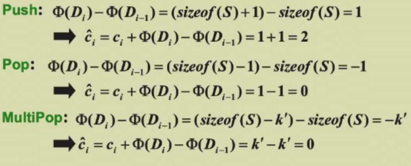    
ΣC<sub>i</sub> = ΣO(1) = O(n)    
    
potential function的要求:    
Φ(D<sub>n</sub>) > Φ(D<sub>0</sub>)    
对任意操作，Φ(D<sub>i</sub>) - Φ(D<sub>i-1</sub>) 尽可能小（常数）    
  
!!! danger "选择正确的potential function:计算不同操作的C<sub>i</sub> = c<sub>i</sub> + Φ(D<sub>i</sub>) - Φ(D<sub>i-1</sub>)，选择最小的(通常要求都为常数)"  
  
**用Amortized analysis 分析Splay tree**    
尝试：    
Φ(D<sub>i</sub>) = 节点的深度    
深度变化的节点过多，无法计算    
Φ(D<sub>i</sub>) = 节点的子树的节点数     
发生变化的是G,P,X,但X成倍增加，P成倍缩减，Φ(D<sub>i</sub>) - Φ(D<sub>i-1</sub>) 不够小    
解决：对节点的后代数量取对数    
**Φ(D<sub>i</sub>) = ΣlogS(i) 其中S(i)是i为根节点的子树的节点个数（包括i）**    
logS(i)：rank of the tree    
引理：a + b <= c,log a + log b <= 2 log c - 2    
R(X)表示节点X的rank，R<sub>1</sub>，R<sub>2</sub>分别表示操作前后的rank    
zig:C<sub>i</sub> = 1（实际代价） + R<sub>2</sub>(X) - R<sub>1</sub>(X) + R<sub>2</sub>(P) - R<sub>1</sub>(P) <= 1 + R<sub>2</sub>(X) - R<sub>1</sub>(X)（放缩）    
zig-zag:C<sub>i</sub> = 2（实际代价） + R<sub>2</sub>(X) - R<sub>1</sub>(X) + R<sub>2</sub>(P) - R<sub>1</sub>(P) + R<sub>2</sub>(G) - R<sub>1</sub>(G)     
R<sub>2</sub>(X) = R<sub>1</sub>(G)     
C<sub>i</sub> < 2 + 2(R<sub>2</sub>(X) - R<sub>1</sub>(X)) 但不知道zig-zag操作要执行几次，因此不知道常数2会乘以几倍，从而无法计算    
利用引理有：C<sub>i</sub> <= 2(R<sub>2</sub>(X) - R<sub>1</sub>(X))    
zig-zig:C<sub>i</sub> = 2（实际代价） + R<sub>2</sub>(X) - R<sub>1</sub>(X) + R<sub>2</sub>(P) - R<sub>1</sub>(P) + R<sub>2</sub>(G) - R<sub>1</sub>(G) = 2 + R<sub>1</sub>(X) + R<sub>2</sub>(G) + R<sub>2</sub>(P) - R<sub>1</sub>(P) - 2R<sub>1</sub>(X) < 2 + 2R<sub>2</sub>(X) - 2 + R<sub>2</sub>(X) - R<sub>1</sub>(X) - 2R<sub>1</sub>(X) = 3(R<sub>2</sub>(X) - R<sub>1</sub>(X))     
    
求和：    
zig：至多1次 1 + R<sub>2</sub>(X) - R<sub>1</sub>(X) < 1 + 3(R<sub>2</sub>(X) - R<sub>1</sub>(X))    
zig-zag:2(R<sub>2</sub>(X) - R<sub>1</sub>(X)) < 3(R<sub>2</sub>(X) - R<sub>1</sub>(X))    
zig-zig:3(R<sub>2</sub>(X) - R<sub>1</sub>(X))    
Σ = 3(R<sub>n</sub>(X) - R<sub>1</sub>(X)) + 1 + 3(R<sub>n+1</sub>(X) - R<sub>n</sub>(X)) = 3(R<sub>n+1</sub>(X)- R<sub>1</sub>(X)) + 1    
C<sub>i</sub> <= 3(R<sub>n+1</sub>(X)- R<sub>1</sub>(X)) + 1 = 3(R(T)- R(X)) + 1 = O(logN)    
  
## Lecture 2 :Red-Black Tree and B+ Tree  
  
### Red-Black Tree    
[Target]balanced BST(parent color key left right)    
[Definition]    
(1)颜色红或黑（这是可能被破坏的，在删除中会有所体现）    
(2)根节点为黑    
(3)NIL为黑（虚节点，或称哨兵节点（外部节点），所有叶节点与根节点的parent指向的节点）    
(4)红节点的孩子全为黑    
(5)从任意节点出发到叶的黑色节点数相同    
[Definition]Black-height:bh(x)是从x到叶子走过的黑色节点的数量（不包含x）    
bh(T) = bh(root)    
引理:N个内部节点的红黑树高度上界为$\lceil2log(N+1)\rceil$(空树高度为0)    
    
插入：按BST方法插入，默认插入节点色为红（除根）（维护性质5），此时违反性质4按以下方法解决，其中唯一需要迭代的是case1，时间复杂度O(logN),case2和3为O(1)    
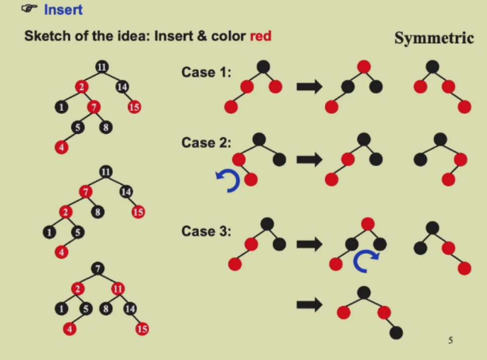    
    
思考题：红黑树插入的代码实现；算法导论对红黑树插入的证明（循环不变式）    
    
删除：先按照BST方法删除，    
  
- 两个孩子:一步交换后变为以下两种情况    
- 只有左孩子或只有右孩子,一定黑父红子,用子的键值替代父并将父亲变黑即可    
- 没有孩子:    
(1)删除红节点:不需要额外操作    
(2)删除黑节点:为要删除的节点增加一重黑色变为双黑NULL节点,目标就变为将双黑变为单黑    
    
case1:兄弟是黑色    
case1.1:兄弟至少有一个红孩子    
根据parent(p),sibling(s),sibling_red_child(r)为LL,RR,LR,RL型    
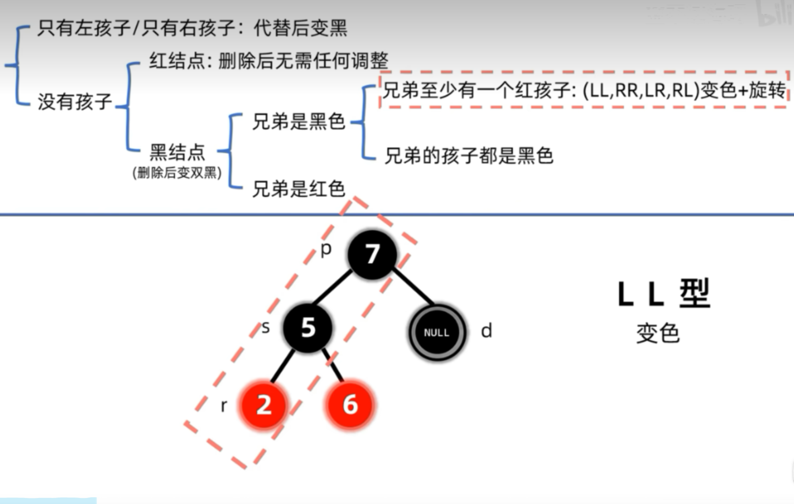    
LL:r变s,s变p,p变黑,右旋p,双黑变单黑    
RR:r变s,s变p,p变黑,左旋p,双黑变单黑    
LR:r变p,p变黑,左旋s,右旋p,双黑变单黑    
RL:r变p,p变黑,右旋s,左旋p,双黑变单黑    
case1.2:兄弟孩子全为黑(NULL)    
兄弟变红,双黑上移    
case1.2.1:父亲为黑,考察新兄弟及其孩子的情况,执行对应操作    
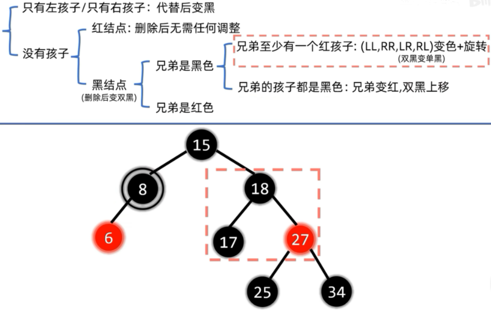    
case1.2.2:父亲为红,红变黑即可    
case1.2.3:父亲为黑根,直接去除多出的黑即可    
case2:兄弟是红色    
s,p换色,p向双黑节点方向旋转,再考察新兄弟及其孩子的情况,执行对应操作    
  
红黑树删除动画：BV16m421u7Tb    
    
思考题：先进入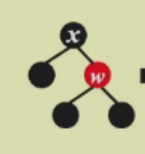后进入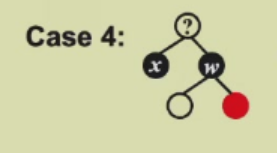    
    
!!! conclusion "经验结论：最多O(1)次rotation O(logN)次recolor"  
  
### B+ Tree  
[Target]reduce the times of accessing the disk(relevant to the height of the tree)    
[Definition]A B+ Tree of order M(阶数:包含最多的叶子节点的个数):    
(1)The root is either a leaf or has between 2 and M children    
(2)All nonleaf nodes(except the root)have between $\lceil\frac{M}{2}\rceil$ and M children    
推论：All nonleaf nodes(except the root)have between $\lceil\frac{M}{2}\rceil$-1 and M - 1 keys    
(3)All leaves are at the same depth    
(4)Each interior node contains M pointers to the children    
(5)根节点的data是其右子树中最小叶节点的data    
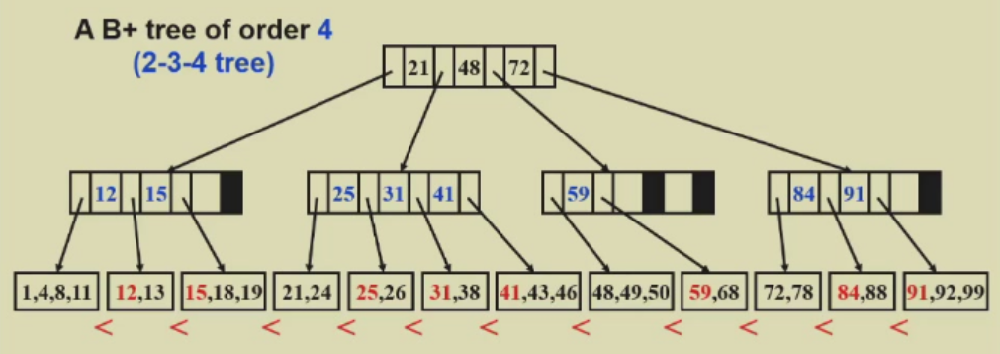    
2-3-4 tree/2-3 tree :每个节点可能含有的子节点个数(The best choice of M is 3 or 4)    
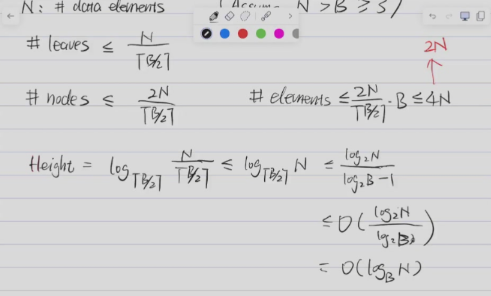    
Find:树高*每层时间    
树高:O($log_{\lceil\frac{M}{2}\rceil}N$)    
每层采用二分查找:O(log<sub>2</sub>M)    
T = O($log_{\lceil\frac{M}{2}\rceil}N$ * log<sub>2</sub>M) = O(logN) (换底公式)    
Insert:找到插入的位置，然后插入看结点是否放得下，放不下就分裂，如果分裂后子结点个数也过多则继续向上一层分裂，直到根结点孩子爆满则将根结点分裂并生成新的根结点  
注意:即使不分裂,可能也需要更新上层节点    
插入时也可以往有空位的兄弟节点推(避免分裂),但不能一直推,否则时间复杂度挡不住,使用兄弟指针或终止于父亲节点(不到叔叔节点)    
树高:O($log_{\lceil\frac{M}{2}\rceil}N$)    
每层操作:O(M)(修改O(M)个键指,修改O(M)个父子指针)    
T = O(M * $log_{\lceil\frac{M}{2}\rceil}N$)    
Delete:先试图借兄弟节点的键值,不够则合并孩子数量少的节点,时间复杂度同插入    
    
## Lecture 3 :Inverted File Index    
  
[Target]搜索引擎  
邻接表(倒排表):记录每个词在哪些文档中出现了  
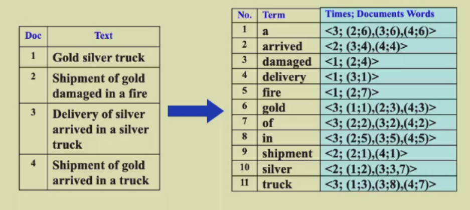  
why record frequency:过滤,频率过高不考虑;加速取交集(从小到大)  
构建索引:  
read a term:word stemming(词干分析 不考虑词转);stop words(a,the,it)  
access a term:search tree(B+)O(logN);hashing(倒排表的索引)O(1)(expensive range search in return)  
not enough memory:write to disk  
distribute index:(Each node contains index of a subset of collection)  
- term-partitioned(单个词效率更高,总和时间差别不大,但服务器出错时会无结果返回)  
- document-partitioned(便于爬虫插入)  
    
更新dynamic indexing:  
insert:add to dictionary  
delete:main index ∩ auxiliary index -> search results  
其实并没有删除,只是加入了一个过时的标记  
倒排表优化compression:  
stop words(搜索时过滤);存储字符索引的差值(避免编号过长);  
Thresholding   
- document   
  only retrieve the top *x* documents according to weight  
  not feasible for Boolean queries  
  miss some relevant documents  
- query  
  sort by frequency in ascending order;search according to percentage  
  
评价指标:  
the answer set:搜索得到的结果集  
relevancy of the answer set  
(1)准确率(Precision)(不要错)P = R<sub>R</sub>/(R<sub>R</sub>+I<sub>R</sub>)  
(2)召回率(Recall)(不要少)R = R<sub>R</sub>/(R<sub>R</sub>+R<sub>N</sub>)  
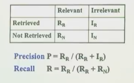  
二者通常成反比（但不代表二者是完全的反比关系）  
relevancy of the answer set(答案集之间的相关性)与 data retrieval performance无关，召回率关注的是系统能检索到多少相关文档，而不关心这些文档的具体相关性等级。例如，假设一个查询有 10 个相关文档，检索系统能够找到其中 7 个相关文档，那么召回率是 70%。但这 7 个文档可能是完全相关的，也可能只是部分相关的。  
  
召回率的高低只与系统能检索到多少相关文档有关，而与它检索到的相关文档的质量（即相关性）没有直接关系。  
相关性则反映了答案集的每个元素的质量，即检索到的每个文档与查询的匹配程度。  
  
## Lecture 4 :Leftist Heaps and Skewed Heaps  
  
### Leftist Heaps  
  
Review:完全二叉树,最大最小堆,percolate up/down  
  
Target:Speed up merging from O(N)(in normal heap,merge = rebuild) to O(logN)  
  
[Definition]Null Path Length,Npl(X),is the length of the shortest path from X to a node without two children(assume every leaf has two children NULL),Npl(NULL) = -1  
  
Npl(X) = min{Npl(the children of X)} + 1  
  
[Definition]Leftist heap(the same order property,but an unbalanced binary tree):  
the Npl of the left child is at least as large as that of the right child.(左重右轻)  
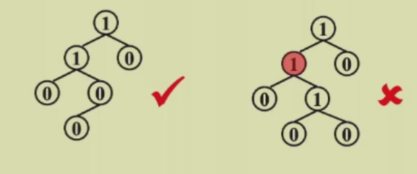  
  
[Lemma]A leftist heap with r nodes on the right path must have at least 2<sup>r</sup>-1 nodes.  
证明:利用数学归纳法  
[Theorem]The leftist tree of N nodes has a right path containing at most log(N+1) nodes.  
=> We can perform all the work on the right path,which is guaranteed to be short if we can restore the heap to the leftist(which is easy)  
  
Insert:special case of merge  
  
DeleteMin:Delete the root,merge the left tree and right tree   
  
**Merge:(recursive)**  
比较两左式堆的根的key，小的为H1，大的为H2  
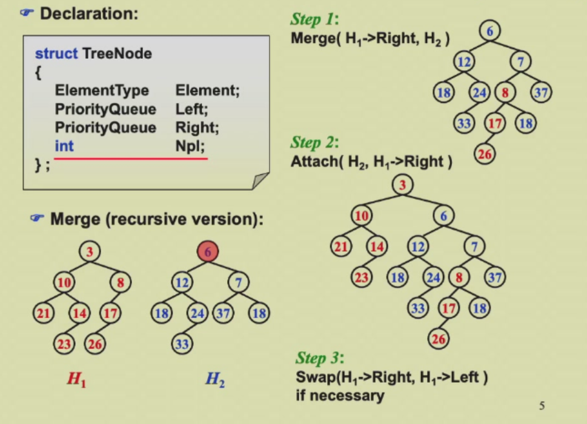  
remember to update npl(H1),otherwise the npl of every node is 0  
  
level of recursive:r1+r2(length of right path of H1/H2)  
time per level:O(1)  
$T = O(r1 + r2) = O(logN1 + logN2) = O(log \sqrt{N1N2} )= O(log(N1 + N2))$  
  
*Delete:Only the npl of the ancestors of the node to be deleted(u<sub>0</sub>) will be changed  
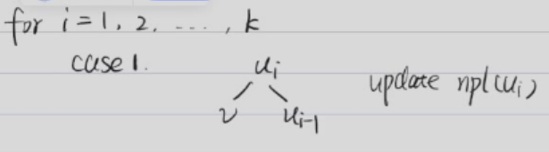  
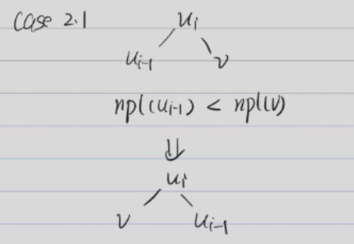  
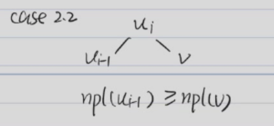  
对case2.2,什么都不用做,甚至其祖先也不需要修复,停止即可  
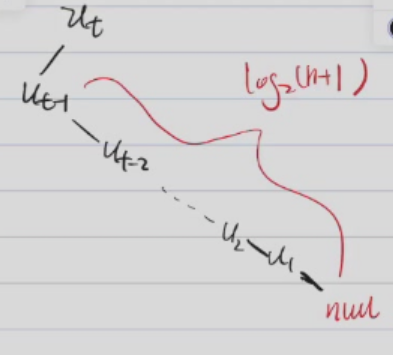  
T = O(logN)  
  
Decrease Key:扣出  
T = O(logN)  
  
BuildHeap:建一个传统堆即可,传统堆就是一个左式堆  
T = O(N)  
  
Merge:(iterative)  
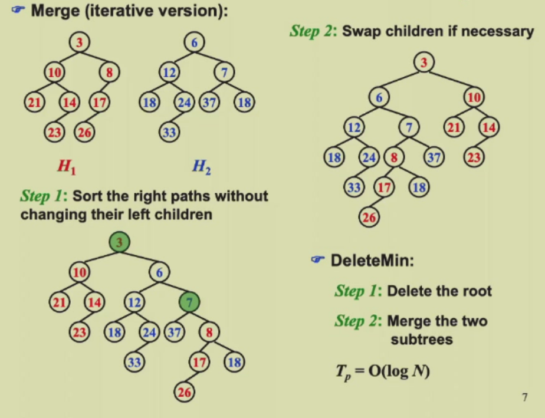  
  
### Skewed Heaps  
  
Target:Any M consecutive operations take at most O(MlogN) time   
  
[Definition]Merge:除了两棵树右路径上的最大结点之外(交换了就只有右儿子没有左儿子)都必须交换其左右孩子，一路上都要交换  
```C  
Merge(H1->Right,H2)  
Attach(H2,H1->Right)  
Swap(H1->Right,H1->Left) #always  
```  
!!! note "H 与 null 连接，必须看 H 的右路径，要求 H 右路径上除了最大结点之外都必须交换其左右孩子。"
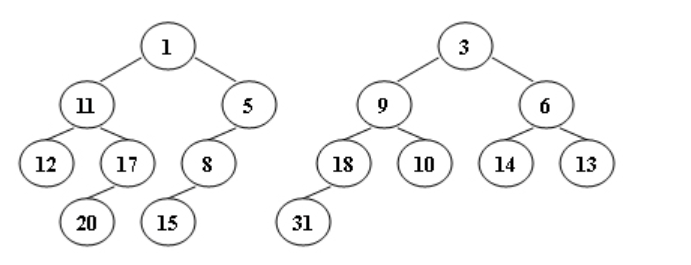  
上面两个堆在合并时，注意6-14-13这个堆与null连接时，要交换6的左右孩子(14&13)  
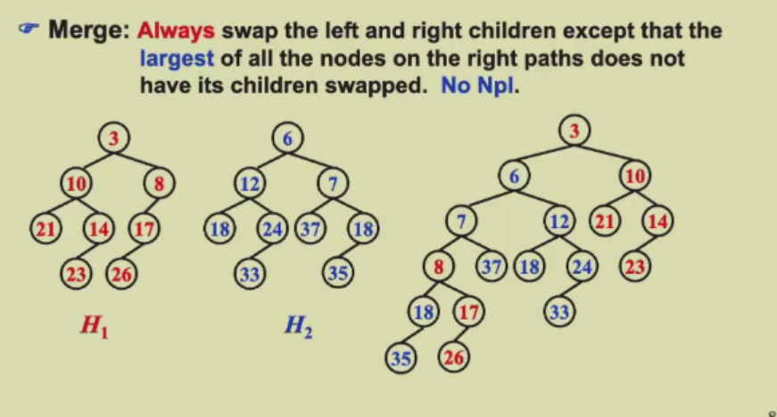  
Delete/Decreasekey:not support  
  
Insert:merge one node  
Merge/Insert/Deletemin:T<sub>amortized</sub> = O(logN)   
  
Potential function:  
尝试：  
节点个数:不会下降  
右路径长度:求不出  
右儿子个数:Φ(H)下降，当且仅当H没有左儿子，但斜堆中不存在只有右儿子没有左儿子的节点  
npl:难算  
简化npl(不到更短路径):左右子树节点个数的差    
[Definition]u is heavy if size(right subtree of u)>=size(left subtree of u),else u is light  
[Lemma]对于右路径上有 l 个轻结点的斜堆，整个斜堆至少有 2<sup>l</sup> − 1 个结点，这意味着一个 n 个结点的斜堆右路径上的轻结点个数为 O(log n)  
证明类似Leftist Heaps的引理  
[Theorem]Merge H1&H2 T<sub>amortized</sub> = O(log(n1 + n2))   
**Φ(H) = the number of heavy nodes in H**  
只有最初在右路径上的节点，轻重状态会发生改变  
H<sub>i</sub> = l<sub>i</sub> + h<sub>i</sub>(右路径)  
T<sub>worst</sub> = l<sub>1</sub> + h<sub>1</sub> + l<sub>2</sub> + h<sub>2</sub>  
Before:Φ(i) = h<sub>1</sub>(右路径) + h<sub>2</sub>(右路径) + h(非右路径)  
After:  
重节点一定变成轻节点  
插入元素可能轻节点变为重节点（估算）  
取上界，所有轻节点变成重节点  
Φ(i+1) <= l<sub>1</sub> + l<sub>2</sub> + h  
T<sub>amortized</sub> = T<sub>worst</sub> + Φ(i+1) - Φ(i) <= 2(l<sub>1</sub> + l<sub>2</sub>)  
l = O(logN) => T<sub>amortized</sub> = O(logN)   
  
## Lecture 5 :Binomial Queue  
  
[Target]T<sub>amortized</sub> = O(1) for BuildHeap/Insert  
[Definition] a collection of heap-ordered trees,known as a forest,each tree is a binomial tree  
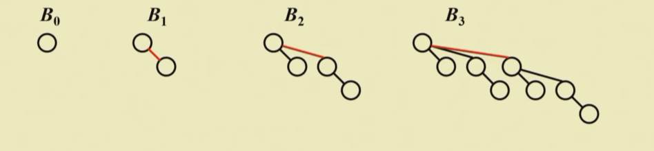  
用一系列binomial tree表示任意大小的队列  
深度d处的节点数 = 二项式系数  
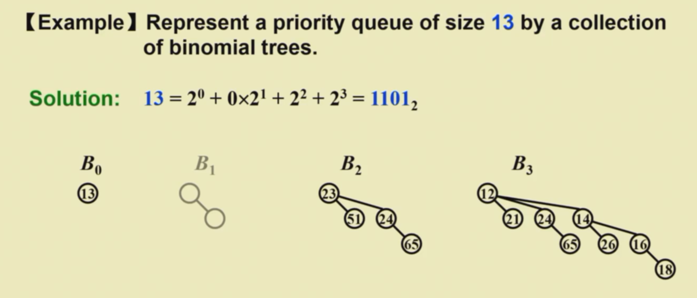  
**FindMin**  
the minimum key is one of the roots,at most logN roots  
T<sub>p</sub> = O(logN)  
记住minimum位置时进行维护,时间复杂度O(1) => 可以做到在O(1)时间内FindMin  
**Merge**  
整数的二进制加法(sorted by height 从低位开始加)  
T<sub>p</sub> = O(logN)  
**Insert**  
worst case for N insertions:O(N)  
T<sub>amortized</sub> = O(1)  
[Proof1 Aggregate]  
Total steps = N   
Total links = N(1/4 + 2 * 1/8 + 3 * 1/16 + ...) = O(N)  
[Lemma] (n/2)(1) + (n/4)(2) + (n/8)(3) + ... <= 2n  
T<sub>amortized</sub> = O(1)  
[Proof2 Potential function]  
c<sub>i</sub> = cost of the ith insertion(number of trees merged + 1)  
Φ<sub>i</sub> = number of trees after the ith insertion  
c<sub>i</sub> + (Φ<sub>i</sub> - Φ<sub>i-1</sub>) = 2  
Σc<sub>i</sub> + Φ<sub>N</sub> - Φ<sub>0</sub> = 2N  
T<sub>amortized</sub> = 2  
  
worst case for single insertion:O(logN) not O(N)!  
**Deletemin:FindMin + Merge**  
T<sub>p</sub> = O(logN)  
Decreasekey:repeatedly exchange it with its parent  
T<sub>p</sub> = O(logN)  
  
all the trees be accessed quickly => Left-child-next-sibling with linked lists  
link the subtrees in **decreasing** sizes  
  
!!! danger "实际存储方式与常规画图方式不同"
  
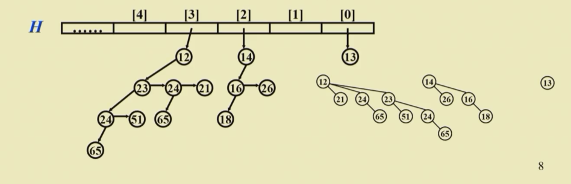  
```C  
typedef struct BinNode *Position;  
typedef struct collection *BinQueue;  
typedef struct BinNode *BinTree;  
struct BinNode{  
  ElementType Element;  
  Position LeftChild;  
  Position NextSibiling;  
};  
struct collection{  
  int CurrentSize;  
  BinTree TheTrees[MaxTrees]  
}  
CombineTrees(BinTree T1,BinTree T2)  
{  
  if(T1->Element < T2->Element)  
  {  
    T2->NextSibiling = T1->LeftChild;  
    T1->LeftChild = T2;  
    return T1;  
  }  
  else{return CombineTrees(T2,T1);}  
}  
Merge{   
H1->CurrentSize += H2-> CurrentSize;  
	for ( i=0, j=1; j<= H1->CurrentSize; i++, j*=2 ) {  
	    T1 = H1->TheTrees[i]; T2 = H2->TheTrees[i]; /*current trees */  
	    switch( 4*!!Carry + 2*!!T2 + !!T1 ) {   
		case 0: /* 000 */  
	 	case 1: /* 001 */  break;	  
		case 2: /* 010 */  H1->TheTrees[i] = T2; H2->TheTrees[i] = NULL; break;  
		case 4: /* 100 */  H1->TheTrees[i] = Carry; Carry = NULL; break;  
		case 3: /* 011 */  Carry = CombineTrees( T1, T2 );  
			            H1->TheTrees[i] = H2->TheTrees[i] = NULL; break;  
		case 5: /* 101 */  Carry = CombineTrees( T1, Carry );  
			            H1->TheTrees[i] = NULL; break;  
		case 6: /* 110 */  Carry = CombineTrees( T2, Carry );  
			            H2->TheTrees[i] = NULL; break;  
		case 7: /* 111 */  H1->TheTrees[i] = Carry;   
			            Carry = CombineTrees( T1, T2 );   
			            H2->TheTrees[i] = NULL; break;  
	    } /* end switch */  
	} /* end for-loop */  
	return H1;  
}  
DeleteMin  
```  
!!! note "程序填空"   
  
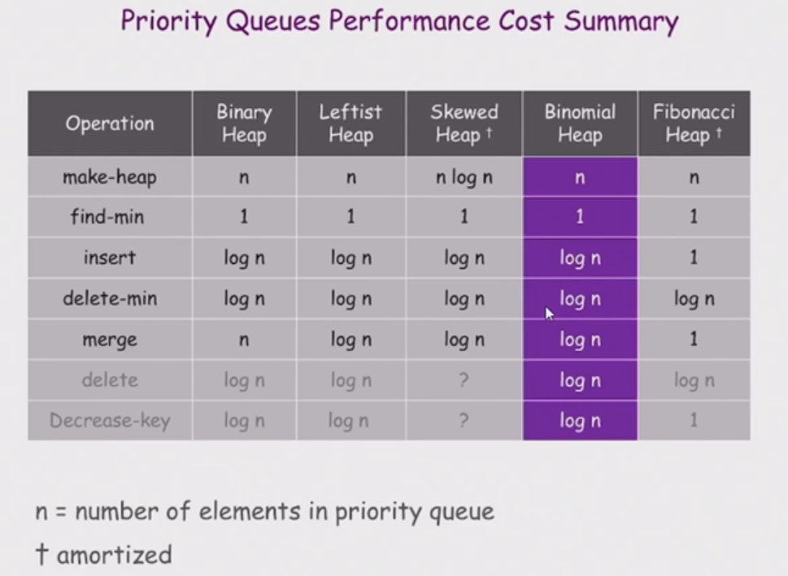  
Skewed heap:worst case for insert/deletemin/merge:O(N)  
  
练习：  
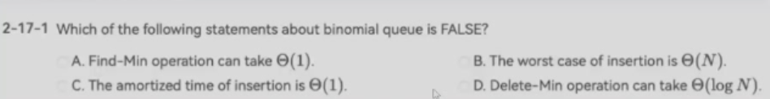  
answer:B  
  
## Lecture 6 :Backtracking  
  
pruning剪枝:eliminate the explicit examination of a large subset of the candidates  
  
### 八皇后问题  
建树(深度优先与广度优先取决于问题)  
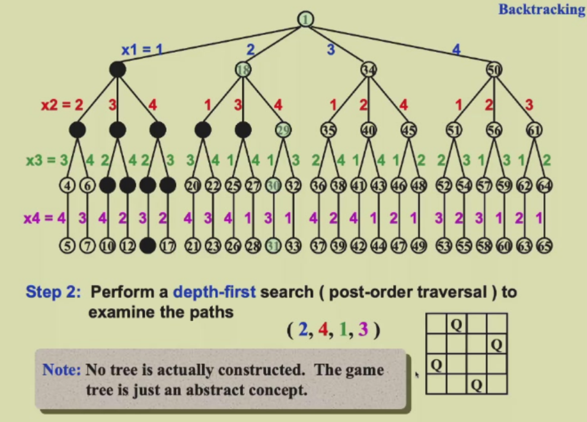  
- 枚举过程  
  **Smaller** Si first 方便一剪梅  
- 剪枝  
  预判 忽略部分约束，判断理想情况下是否可能有解  
  
### 收费公路问题 The Turnpike Reconstruction Problem  
[Problem]N points on the x-axis x1 < x2 < ... < xN,assume x1 = 0. There are N(N-1)/2 distances between every pair of points  
[Example]D = {1,2,2,2,3,3,3,4,5,5,5,6,7,8,10}  
Step1: N(N-1)/2 = 15 => N = 6  
Step2:x1 = 0 and x6 = 10  
Step3:find the next larget distance and check  
```C  
    x5 = 8 or x2 = 2  
      if x5 = 8 then x4 = 7 or x2 = 3  
                    if x4 = 7 then x3 = 6 or x2 = 4  
                                  if x3 = 6 // two 1. wrong! backtrack  
                                  if x2 = 4 // two 4. wrong!  
                    if x2 = 3 then x3 = 4 or x4 = 6  
                                  if x3 = 4  
                                  if x4 = 6 then x3 = 5 //true  
solution:(0,3,5,6,8,10)  
```  
  
### Stick problem  
  
[Problem]put stick sections back,find the minimum possible length of the original sticks  
sample input:  
```  
9  
5 2 1 5 2 1 5 2 1  
```  
sample output:  
```  
6  
```  
确定长木棍的长度，try 6,try 8,try 12  
try 6:4 sticks in total  
已知每根长度为6，枚举每根小木棍的位置  
搜索树：已经拼接的木棍   
pruning:  

- 超过总长  
- 考察剩余最长的小木棍是否可放 => 改变搜索顺序 先放置长的小木棍(smaller Si)  
  
有解 return  
无解 try 8  
  
### Backtracking问题的解决通式  
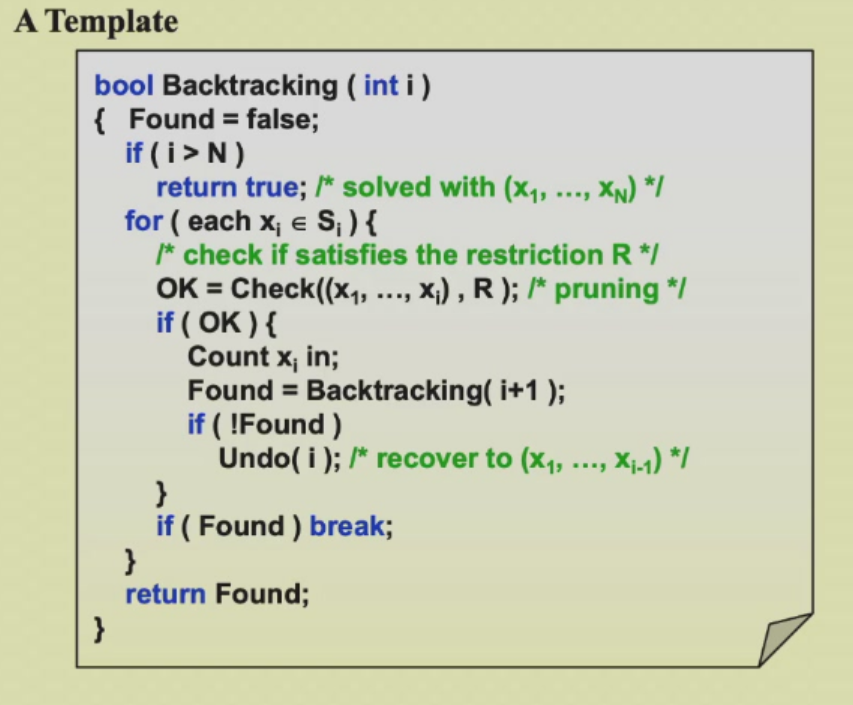  
  
### 博弈  
  
#### Tic-tac-toe:Minimax Strategy  
the "goodness" of a position.估价函数  
f(P) = W<sub>Computer</sub> - W<sub>Human</sub>  
where W is the number of potential wins at position P.  
如果对方在当前情况下挂机，自己的赢法数量  
(如果对方挂机了都赢不了对方=>剪枝)  
量化当前棋局谁占优势  
The human is trying to minimize the value of the position P,while the computer is trying to maximize it.  
  
#### α - β pruning  
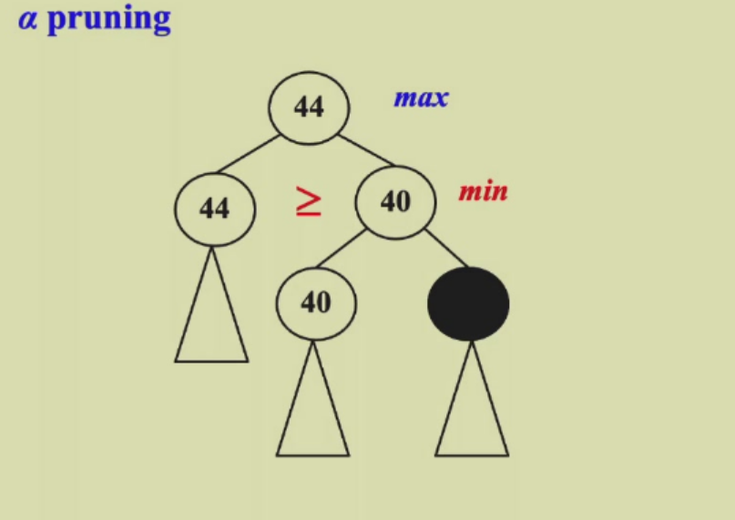  
α pruning：computer  
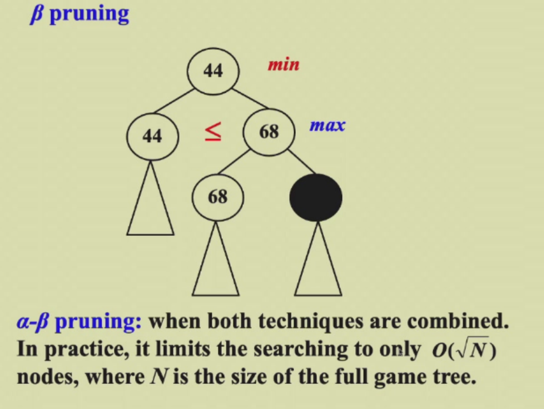  
β pruning：human  
black node is the node get cut  
  
!!! danger "prunning bottom up (bottom prunned first)"
  
#### 华容道 Eight Digits:The minimum number of moves  
搜索树：挪动棋子的方案  
prunning  

- 去重 => 动态规划  
- 步数超过当前已有的最优解  
  预判：  
- 当前空格到目标空格的最短步数 + 当前步数 > 最优解  
- 当前棋盘数字达到目标状态的步数 + 当前步数 > 最优解  
  
## Lecture 7 :Divide and Conquer  
  
### General recurrence:  
$T(N) = aT(N/b) + f(N)$  
a:子问题数量  
b:每个子问题内的元素数量  
f(N):合并所需要的时间  
  
#### The maximum subsequence sum -O(NlogN)  
-1 [10 2 -1 5] -2 1 -1  
-1 10 2 -1    ||     5 -2 1 -1  
    12       <-->    5  
    向左枚举O(N)向右枚举O(N)  
       11           5  
  
#### Tree traversals -O(N)  
  
后序DEBFCA  
中序DBEACF  
  
     A  
   /   \   
 DBE   CF  
  
后序DEB      后序FC  
中序DBE      中序CF  
     B        C  
    / \        \  
   D   E        F   
combine  
  
#### Mergesort and quicksort -O(NlogN)  
  
### Closest points problem  
[Problem]Given N points in a plane.Find the closest pair of points  
Check N(N-1)/2 pairs.T = O(N²)  
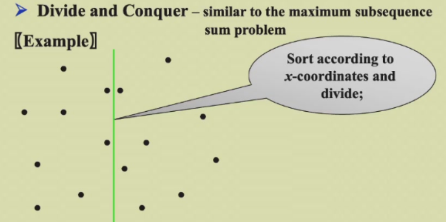  

$$  
T(N) = 2T(N/2) + cN  
     = ... = 2^{k}T(N/2^{k}) +kcN = N + cNlogN = O(NlogN)  
$$  
$$  
T(N) = 2T(N/2) + cN^{2} = O(N^{2})  
$$  
优化横跨点对的算法：prunning  
小于两边已算出的最短点对  
到中界线的距离小于两边已算出的最短点对  
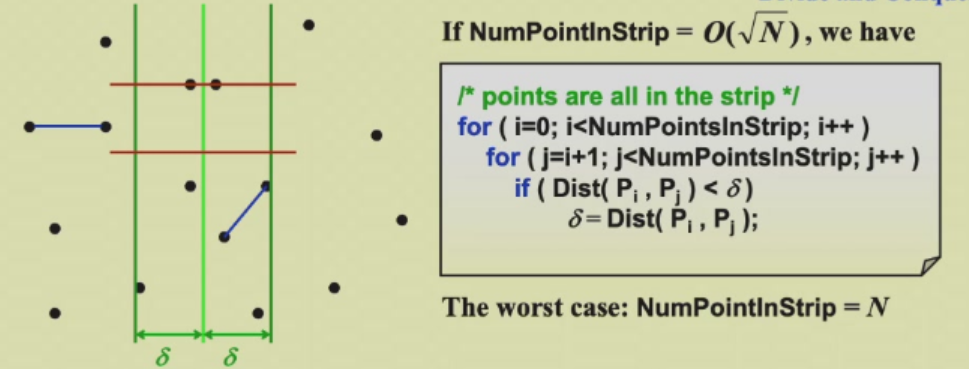  
  
方框中最多可能的点  
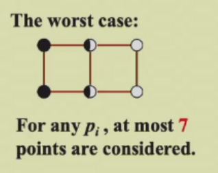  
实现上的困难：既按x轴排序又按y轴排序  
  
### Recurrences solving  
$  
T(N) = aT(N/b) + f(N)  
$  
Assume:  
- N/b is an integer  
- O(1) for small n  
    
#### Fundamental method - iterative unfolding  
  
#### Substitution method - guess,then prove by induction  
$  
\begin{align*}  
  \begin{aligned}  
T(N) &= 2T(N/2) + N \\  
Guess:&T(N) = O(NlogN) \\  
T(N/2) &\leq c(N/2)log(N/2) \\  
T(N) &= 2T(N/2) + N \\ &\leq 2c(N/2)log(N/2) + N \\&\leq cN(logN-log2) + N \\  
&\leq cNlogN  
  \end{aligned}  
\end{align*}  
$  
wrong for N = 1,只需找到一个N,对任意n>N,上式成立即可  
对低于NlogN的量，直接丢弃(见HW7-4.A)  
$   
\begin{align*}  
&Wrong Guess:T(N) = O(N) \\   
&T(N) \leq cN + N \neq O(N)  
\end{align*}  
$  
#### Recursion-tree method  
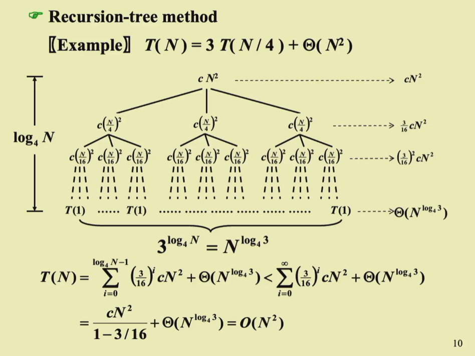  
再用代入法证明即可  
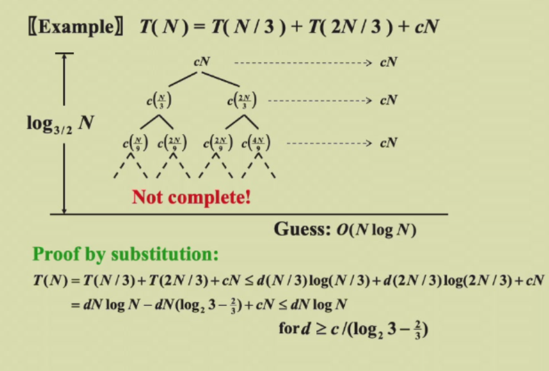  
  
#### Master method  
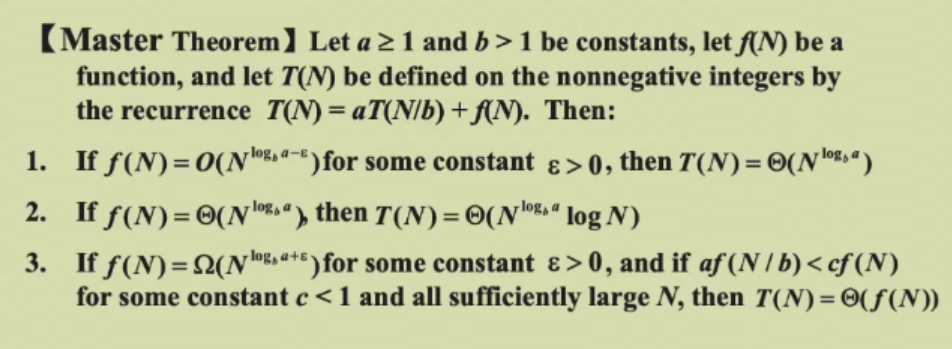  
巨多叶 每层平均 巨大根  
比较合并的开销与叶子的开销，看谁决定了整体的时间  
正则条件：根的时间开销>第一次划分的时间开销 => 根dominate了整棵树  
注意N<sup>ε</sup>>logN  
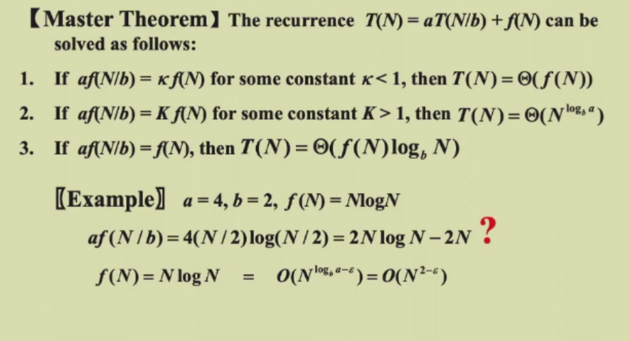  
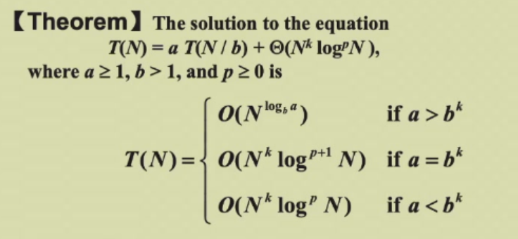  
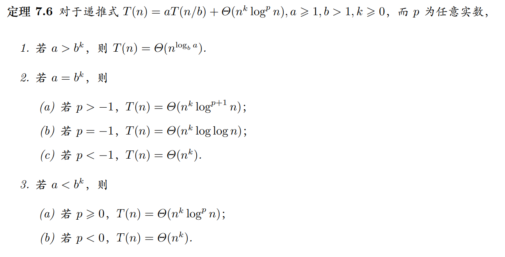  
  
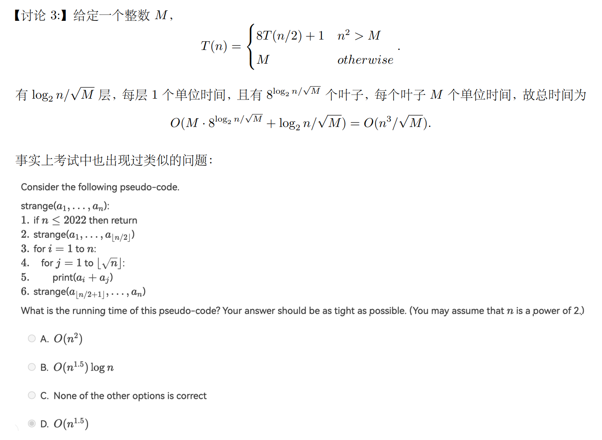  
主定理就完事儿了~~  
  
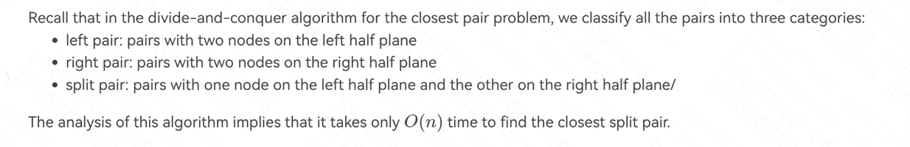  
F  
  
## Lecture 8 :Dynamic Programming(DP)  
  
### Fundamental problem  
  
#### Fibonacci  
  
F(N) = F(N-1) + F(N-2) ......状态转移方程  
         ^        ^  
         |        |  
       子问题   子问题   
T(N) >= F(N)  
  
"记忆化" T(N) = O(N)  
动态规划的条件：重叠子问题  
(M1M2)(M3M4M5)  
((M1M2)M3)(M4M5)  
M1M2为重叠子问题  
  
**General problem**  
一个问题，它的最优解可以表达为一些合适的子问题的最优解的递推关系，则我们称这一问题具有最优子结构性质（因为大问题的最优解可以直接依赖于小问题的最优解）。然后我们求解这一递推式，通过设置好 base case（这里我们也用 base case 指代最简单的情况，但注意这时不是递归了），然后通过记忆化的方法，使用迭代算法而非费时的递归算法避免冗余计算，得到一个时间复杂度令人满意的算法  
  
动态规划的一般范式：  
动态规划方法通常用来求解最优化问题（optimization problem）。这类问题可以有很多可行解，每个解都有一个值，我们希望寻找具有最优值（最小值或最大值）的解。我们称这样的解为问题的一个最优解（an optimal solution），而不是最优解（the optimal solution），因为可能有多个解都达到最优值。  
1. 刻画一个最优解的结构特征；  
2. 递归地定义最优解的值；  
3. 计算最优解的值，通常采用自底向上的方法；  
4. 利用计算出的信息构造一个最优解。  
     
事实上动态规划就是为一个具有所谓最优子结构性质（即原问题最优解可以由子问题最优解递推得到）的**最优化问题**寻找一个子问题到原问题的**递推式**，然后用**记忆化方法**求解，最后有时我们需要**构造**出这一最优解  
  
### Ordering Matrix Multiplications  
M<sub>[10x20]</sub> * M<sub>[20x50]</sub>  
T = 10 * 20 * 50  
**Problem**  
M<sub>[10x20]</sub> * M<sub>[20x50]</sub> * M<sub>[50x1]</sub> * M<sub>[1x100]</sub>  
  
M<sub>[10x20]</sub> * (M<sub>[20x50]</sub> * (M<sub>[50x1]</sub> * M<sub>[1x100]</sub>))  
T = 125000  
(M<sub>[10x20]</sub> * (M<sub>[20x50]</sub> * M<sub>[50x1]</sub>)) * M<sub>[1x100]</sub>  
T = 2200  
Question:Which order?  
[Backtracking]  
O(N) for M<sub>x</sub> * M<sub>x+1</sub>  
O(N-1) for one subtree  
...  
  
prunning  
- current minimum T  
- record the state that has been calculated 记忆化搜索  
  
**动态规划的关键：记忆性**  
  
Let b<sub>n</sub> be the ways of computing M<sub>1</sub>M<sub>2</sub>...M<sub>n</sub>  
$  
b_{n} = O(\frac{4^n}{n\sqrt{n}})  
$  
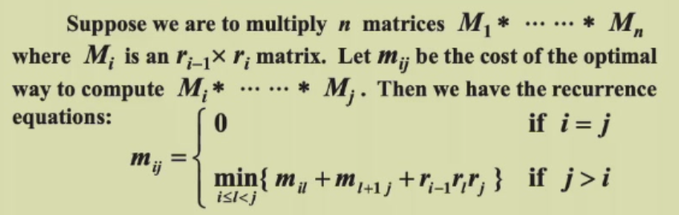  
O(N²) values of M<sub>ij</sub>  
枚举l,O(N)  
T = O(N<sup>3</sup>)  
一个问题的最优解只和这个问题子问题的最优解（最优子结构）（而与次优解第三优解无关）  
检查（证明）：  
次优解与最优解能否替换（可能两个子问题最优解不能同时存在）  
替换后最后解是否会变差  
  
注意，不能从1开始枚举i，因为这样计算m<sub>ij</sub>会遇到没算出来的子问题  
所以对M<sub>ki</sub>，从1开始枚举k，表示从i开始，向后乘k个矩阵的子问题  
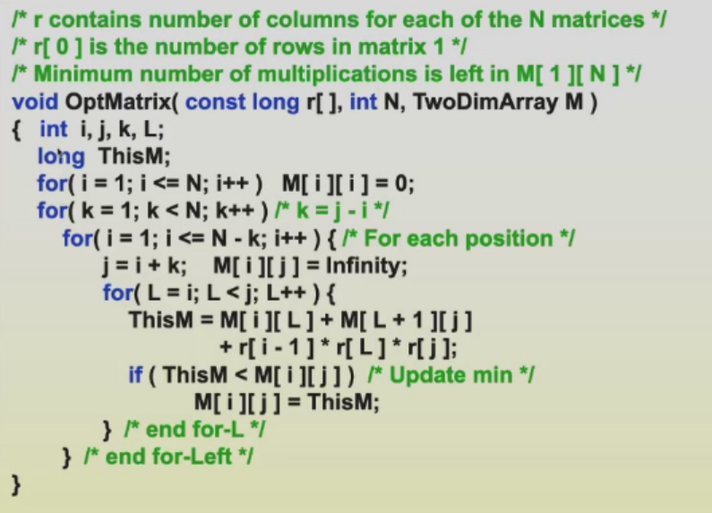  
递归实现，判断是否计算过M[i][j]，如果没有计算过，递归计算即可  
  
从而，我们可以存储子问题的最优解  
  
### Optimal BST  
[Problem]Given N words w<sub>1</sub> < ... < w<sub>N</sub>,and the probability of searching w<sub>i</sub> is p<sub>i</sub>.Arrange these words in a BST in a way that minimize the expected total time.T(N) = Σp<sub>i</sub>(1+d<sub>i</sub>)  
  
贪心法：根节点为出现概率最高的词，从而左右子树包含的值确定（按字典序排列），再从左子树中寻找概率最高的词，...  
缺点：浪费浅层节点  
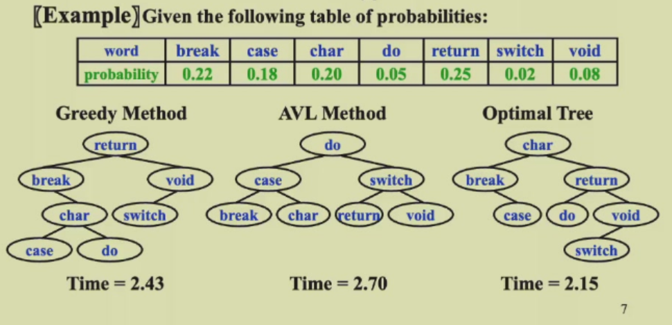  
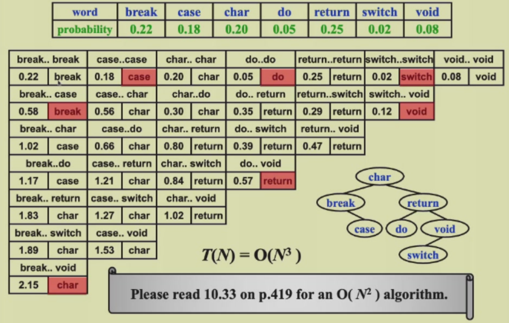  
  
### All-Pairs Shortest Path  
[Problem]For all pairs v<sub>i</sub> and v<sub>j</sub>,find the shortest path between  
[Method 1]use single-source algorithm(dijkstra algorithm) for |V| times.  
T = O(|V<sup>3</sup>|) —— works fast on sparse graph.  
[Method 2]Define D<sup>k</sup>[i][j] = min{length of path i -> {l<=k} -> j}  
Answer:D<sup>N-1</sup>[i][j]  
扩展可用的中间节点 for(k=0;k<N;K++)  
- k !∈ the shortest path i -> j => D<sup>k</sup> = D<sup>k-1</sup>  
- k ∈ the shortest path i -> j => D<sup>k</sup>[i][j] = D<sup>k-1</sup>[i][k] + D<sup>k-1</sup>[k][j]   
    
D<sup>k</sup>[i][j] = min{D<sup>k-1</sup>[i][j],D<sup>k-1</sup>[i][k] + D<sup>k-1</sup>[k][j]}  
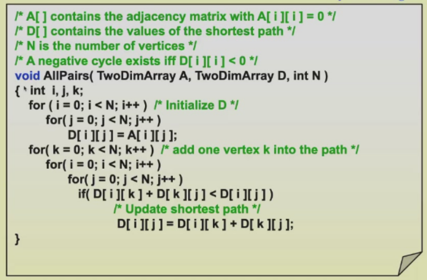  
T = O(N<sup>3</sup>)  
  
When can't we apply dynamic programming:history-dependency  
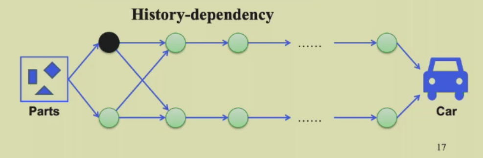  
  
dynamic programming != polynomial time solve(Knapsack 伪多项式时间复杂度)  
  
## Lecture 9 :Greedy Algorithms  
  
### The greedy method  
Optimization problems:an optimization function with constraints  
feasible solution:meet the constraints  
optimal solution:best possible value  
works only if the local optimum = global optimum  
if not,optimal solutions are not guaranteed,but close in value to the optimal(heuristics启发式)（剪枝对比的对象）  
  
### Activity Selection Problem  
S = {a<sub>1</sub>,a<sub>2</sub>,...,a<sub>n</sub>},time interval[s<sub>i</sub>,f<sub>i</sub>)  
find the maximum number of activities  
  
DP solution  
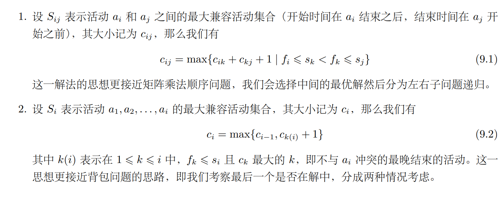  
  
Greedy Rule1:Select the interval which starts earliest  
Greedy Rule2:Select the interval which is shortest  
Greedy Rule3:Select the interval with the fewest conflicts  
Greedy Rule4:Select the interval which ends first[correct]  
  
Correctness:  
- Algorithm gives non-overlapping intervals(valid result) apparently  
- The result is optimal  
  Step 1:Prove the optimal solution consists of the first choice  
  Step 2:Satisfy the optimal substructure(可替换 解不变差)  
    
贪心会给出一组最优解，但不代表最优解唯一  
  
### Huffman Codes  
  
trie tree  
  
The Huffman code is one kind of optimal prefix codes.   
For a given alphabet and its characters' frequencies,  
the Huffman codes may not be unique,   
the Huffman code length of each character may not unique,  
but the length of the overall code is unique.   
  
N characters 2N-1 nodes  
T = O(NlogN)  
  
## Lecture 10: NP-Completeness  
  
### Recall  
Euler circuit  
Hamilton circuit  
Single-source unweighted shortest-path problem  
Single-source unweighted longest-path problem  
  
polynomial time:O(n<sup>x</sup>),O(nlogn)  
not polynomial:O(n!),O(2<sup>n</sup>)  
The easiest:O(N)-since we have to read inputs at least once  
The hardest:undecidable不可判定问题（已知答案无法确认正误）  
  
Halting problem:Is it possible to have a C compiler detect all infinite loops?  
  No,proof by self-detecting.  
  
!!! note "difficulty:P <= NP <= NPC < undeciable"
  
### The Class NP  
  
Deterministic Turing Machine确定型图灵机（下一步是确定的）（可认为是求解）  
Nondeterministric Turing Machine非确定型图灵机(可认为是判断)  
All NP problems can be solved in polynomial time in a non-deterministic machine.  
Unless P=NP, NP problems cannot be solved in polynomial time in a deterministic machine.  
NP:Nondeterministric polynomial-time  
The problem(abstract) is NP if we can prove any solution(实例) is true in polynomial time  
e.g. Hamilton cycle problem:NP  
e.g. A graph does not have a Hamiltonian cycle:not NP  
  
P:we can prove any solution is true and find the solution in polynomial time  
  
!!! note "P:解决 NP:判定"
**The most difficult NP problems:NP-complete problem(NPC)**  
an NPC problem has the property that any problem in NP can be polynomially reduced to NPC  
If we can solve **any** NPC problem in polynomial time ,then we can solve all the problems in NP  
  
规约：  
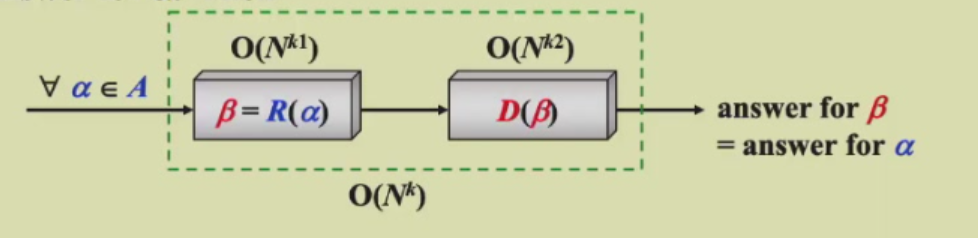  
B 难于 A，因为如果将A规约成B，A至少有一个B时间复杂度的解，但不代表A没有更快的算法  
多项式时间复杂度是一样简单的  
规约具有传递性  
e.g.Suppose that the Hamiltonian cycle problem is NPC,prove the traveling salesman problem is NPC as well  
A is an NPC problem,if A can be reduced to B,then B is an NPC problem  
Travelling salesman problem:Given a **complete** graph G,with edge costs, and an integer K,is there a simple cycle that visits all vertices and has total cost<=K  
Proof:TSP is NP  
  and for any Hamiltonian cycle problem,we can construct an example that is a TSP problem  
  and the solution to the Hamiltonian cycle is the solmution to the TSP problem  
  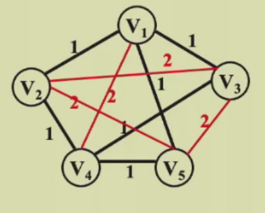  
  规约是单向的  
  
The first proven NPC problem was the Satisfiability problem(SAT)  
  
A Formal-language Framework  
Q:abstract problem  
I:instances  
S:solutions  
Q是I到S的一个映射  
优化问题都可以转化为判定问题(将优化问题的解作为判定问题的条件即可)，判定问题的输出是0或1，这便于判断两个不同类型的问题的解是不是一样的(recall answer for β = answer for α)  
接下来只讨论判定问题：  
  
!!! note "language也包括不可判定问题"
  
Formal-language Theory  
- An alphabet is a finite set of symbols{0,1}  
- A language L over the alphabet is any set of strings made up of symbols from the alphabet  
- Algorithm A accepts a string x∈{0,1} if A(x) = 1;rejects if A(x) = 0  
- A language L is decided by an algorithm A if it can accept and reject every binary string(算法能够判定一个解是否为真)  
    
L∈NP -> L的补集∈NP ？  
co-NP:所有NP问题的补问题，如果L是NP，则L的补集是co-NP  
co-NP problem:problem L and its complement are both NP  
co-NP与NP关系未知：可能相等 可能相交  
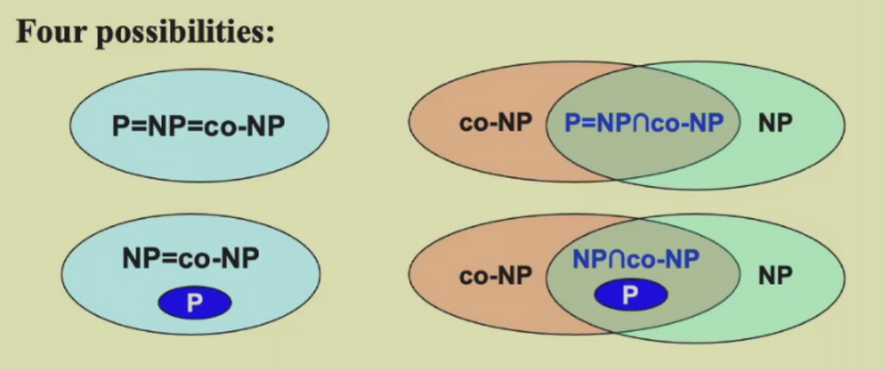  
规约符号：L<sub>1</sub><=<sub>p</sub>L<sub>2</sub>  
L<sub>1</sub>可以规约到L<sub>2</sub>（此处的<=可以认为是难度对比）  
  
e.g.Suppose that clique problem(最大团问题)is NPC ,prove that vertex cover problem is NPC too.  
Proof.利用补图  
  
NP-hard(NP困难问题)：所有NP都可在多项式时间归约到的问题 NP <=<sub>p</sub>NP-hard  
NP-hard∩NP = NPC  
  
Lecture 11-13的任务是：对于一个不能在多项式时间复杂度找到最优解的问题，在多项式时间复杂度内找到一个近似最优解(近似算法），或以较高的概率在多项式时间复杂度内（小概率超过多项式时间复杂度）找到最优解(随机算法)  
  
## Lecture 11: Approximation  
  
### Dealing with hard problems  
  
1.small N,O(2<sup>N</sup>) is acceptable  
2.important special cases in polynomial time  
3.**near**-optimal solutions in polynomial time  
  
[Definition] Approximation Ratio  
$  
max(\frac{C}{C^*},\frac{C^*}{C})<=ρ(n)  
$  
C*is the cost of an optimal solution  
ρ(n)-approximation alogrithm  
  
[Definition] An approximation scheme (1+ε)-approximation algorithm  
An approximation scheme is a polynomial-time approximation scheme(PTAS) if for any fixed ε,the scheme runs in time polynomial in the size n:O(n<sup>2/ε</sup>)  
fully polynomial-time approximation scheme(FPTAS):with the decreasing of ε(追求更高精度),the time complexity will drop polynomially:O((1/ε)<sup>2</sup>n<sup>3</sup>)   
  
!!! note "只要是n的多项式级别，无论ε 都是PTAS  </br> 如果1/ε也是多项式级别，则是FPTAS"
  
### Approximate Bin Packing  
  
N items of sizes S1,...,SN,such that 0 < Si <= 1  
Pack these items in the fewest number of bins(capacity of bins is 1)  
  
Approximation1:NextFit  
read item one by one   
create new bin if can't be placed  
T = O(N)  
ρ = 2  
  
Approximation2:FirstFit  
scan for the first bin that is large enough for item  
  
can be implemented in O(NlogN)  
ρ = 1.7  
  
Remove an item may cause the solution to increase  
  
Approximation3:BestFit  
place a new item in the tightest spot among all bins  
T = O(NlogN)  
ρ = 1.7  
  
!!! note "special case is meaningless in the worst case"
  
Order is important!  
  
On-line Algorithm:place an item before processing the next one,and can NOT change decision(no backtracking)  
No on-line algorithm can always give an optimal solution  
the lowest ρ of the on-line algorithms is 5/3  
  
Proof.根据不同的分歧，构造邪恶的输入数据 使得近似比尽可能大  
  
Off-line Algorithm:view the entire item list before producing an answer  
Trouble maker:large items  
sort the items in decreasing orfer then apply first/best fit(simple greedy)  
ρ = 11/9  
  
### The Knapsack Problem —— fractional version 背包问题  
capacity M,N items of weight wi and profit pi  
xi is the percentage of the item i being packed,packed profit pixi  
  
piwi < M , pixi max  
  
Each time pack one item into the knapsack  
  
be greedy on:  
1.max profit X  
2.min weight X  
3.max profit density pi/wi(性价比)  
  Proof. 替换法  
  
### The Knapsack Problem —— 0-1 version NP-hard(NPC)  
xi is either 1 or 0  
  
be greedy on profit density or max profit X  
be greddy both on profit density and max profit,choose the best one  
  
ρ = 2   
  
Proof.   
p<sub>max</sub> <= P<sub>opt</sub> <= P<sub>frac</sub>  
p<sub>max</sub> <= P<sub>greedy</sub>  
  
P<sub>opt</sub> <= P<sub>greedy</sub> + p<sub>max</sub>  
  
In fractional version,we will cut at most one item in greedy method.  
Among all the items packed into the knapsack,only the one with the lowest profit density will be cut.  
This item has the profit <= p<sub>max</sub>  
Therefore,P<sub>opt</sub> <= P<sub>greedy</sub> + p<sub>max</sub>  
  
P<sub>opt</sub> / P<sub>greedy</sub> <= 1 + p<sub>max</sub> / P<sub>greedy</sub> <= 2  
  
#### A dynamic programming solution  
  
计算i个物体达到价值p需要的最小容量W<sub>i,p</sub>  
W<sub>i,p</sub> = inf         &nbsp;&nbsp;&nbsp;&nbsp;&nbsp;&nbsp;&nbsp;&nbsp;&nbsp;&nbsp;&nbsp;&nbsp;&nbsp;&nbsp;&nbsp;&nbsp;&nbsp;&nbsp;&nbsp;&nbsp;&nbsp;&nbsp;,i = 0  
                  W<sub>i-1,p</sub> &nbsp;&nbsp;&nbsp;&nbsp;&nbsp;&nbsp;&nbsp;&nbsp;&nbsp;&nbsp;&nbsp;&nbsp;&nbsp;&nbsp;&nbsp;&nbsp;&nbsp;&nbsp;&nbsp;&nbsp;&nbsp;&nbsp;&nbsp;&nbsp;&nbsp;&nbsp;&nbsp;,pi > p  
                  min{W<sub>i-1,p</sub>,w<sub>i</sub>+W<sub>i-1,p-pi</sub>}&nbsp;,otherwise  
  
T = O(n<sup>2</sup>p<sub>max</sub>) not polynomial because   
input size:n & the bytes used to store the profits(2<sup>p</sup>),伪多项式时间复杂度  
  
dp cannot work if p<sub>max</sub> is LARGE  
事实上，通过缩小p<sub>max</sub>我们可以得到多项式时间复杂度的，近似比任意接近1的近似算法  
  
一个简单的想法是对于大的p<sub>max</sub>，我们同除它们最小公倍数就可以在不改变结果的情况下降低p<sub>max</sub>，但实际操作时不能保证所有p<sub>max</sub>都有良好的最小公倍数，因此我们只能做出一些妥协  
  
1.给定希望达到的近似比率ε(假定1/ε是一个整数)，令放缩比率$b=\frac{\epsilon p_{max}}{n}$  
2.将所有价值放缩为$\lceil\frac{p_{i}}{b}\rceil$,dp得到最优解p  
3.将所有价值放大$p_{i}' = \lceil\frac{p_{i}}{b}\rceil b$得到近似最优解bp  
T = O($\frac{n^{2}p_{max}}{b}$) = O($\frac{n^{3}}{\epsilon}$)是FPTAS  
ρ = 1 + ε  
证明见讲义或myc老师课上  
  
### The K-centre problem  
  
n sites s1,...,sn  
dist(欧氏距离)  
  
find a set of centres C that minimize r(C)  
  
**A Greedy Solution**   
  
Put the first centre at the best possible location for a single centre,then keep adding centers to reduce the covering radius each time by as much as possible(常用 but arbitarily bad)  
  
假定已经知道最佳半径 r(C*)(后续可以通过二分查找找到这个值)  
我们选定某一个site为圆心以半径2r(C*)画圆，再选择没有被覆盖的site为圆心继续画圆，知道所有site都被覆盖  
下证该算法不会选择超过K centres  
反证：假设我们通过这种算法得到了超过K个centers，说明则一定至少有K+1个点两两距离超过2r(C*)，此时我们如果只要求覆盖这K+1个sites，我们选取两两的中点为最优半径的圆心，K个圆心也无法覆盖这K+1个sites  
直观的例子是k=1两个site的情况下，如果取某一个点为圆心半径2r(C*)画圆无法覆盖另一个点，则此时的r(C*)一定比实际的最优解小，因为如果取两个site中点，最优解为两个site距离的1/2，那么以某一个点为圆心2倍最优解画圆一定能覆盖另一个点  
这意味着我们的r(C*)猜小了  
事实上，如果我们得到小于K个centers就意味着我们的r(C*)猜大了  
在这种启发思路下，通过二分查找我们可以猜到一个r(C*)，当以2r(C*)画圆时能恰好覆盖所有sites，此时我们得到了最优解r(C*)，和2r(C*)覆盖所有sites的一种方案  
这是一个2-approximation算法   
  
  
**Kcentre**——be far away(不需要花时间猜测r(C*)以尝试求解)  
寻找与圆心距离最远的点作为新的圆心  
  
ρ = 2   
  
上限结论：Unless P = NP,there is no ρ-approximation for any ρ < 2(规约法证明)  
  
补充：  
A<=<sub>p</sub>B，B有近似比ρ不一定能得出A也有近似比ρ，因为二者对cost的标准不同  
  
## Lecture 12: Local Search  
  
[Definition]Solve problems approximately——aims at a local optimum  
[Target]Find the global Minimum of a function f  
Guess -> Neighbourhood -> Global Minimum  
Local Search is an **approximation** algorithm for it cannot ensure an optimal solution is found(maybe an extreme)  
  
Local  
- Define neighbourhoods in a feasible set  
- A local optimum is a best solution in a neighbourhood  
  
Search  
- Start with a feasible solution and search a better one in the neighbourhood(greedy algorithm)  
- A local optimum is achieved if no improvement is possible  
    
may not stop in finite steps  
each step in searching in neighbourhood may not in polynomial time  
    
```  
SolutionType Gradient_descent(){  
  Start from a feasible solution S;  
  MinCost = cost(S);  
  while(1){  
    S' = Search(N(S));  
    CurrentCost = cost(S');  
    if(CurrentCost < MinCost){  
      MinCost = CurrentCost;  
      S = S';  
    }  
    else break;  
  }  
  return S;  
}  
```  
  
### The Vertex Cover Problem  
Given an undirected graph G = (V,E) ,find a minimum vertex set S,so that for every edge (u,v),at least one vertex(u or v) is in S  
  
Feasible solution set *FS*:all the vertex covers.  
Neighbourhood:*FS* - 1  
  
Case 0:no edge —— only one extreme  
Case 1:a centre:global optimal is not guaranteed —— two extreme  
Case 2:Line —— many extremes  
  
#### Try to improve...  
For Case 1:cannot jump out when reached an extreme  
Metropolis Algorithm  
```  
  Define constants k and T;//超参  
  
  while(1){  
    S' = Randomly chosen from N(S);  
    if(CurrentCost = cost(S')){  
    CurrentCost = cost(S');  
    }  
    else{  
      With a probability e^{-Δcost/(kT)},let S = S';  
      //Δcost ++ ,probability --  
      else break;//设置一定的迭代数，达到迭代数便停止  
    }  
  }  
  
  return S;  
```  
Unless P=NP,no 2-ε approximation algorithm exists  
  
Simulated Annealing模拟退火  
large jump probability at first,then getting smaller  
Cooling schedule T = {T1,T2,...} kT ++, probability --  
  
### Hopfield Neural Networks  
Graph G = (V,E) with integer edge weight w(positive or negative)  
If w < 0,e = (u,v),then u and v want to have the same state(1 or -1)  
If w > 0,u and v have different states  
The absolute value |w| indicates the strength of the requirement  
  
output:a configuration S of the network respects the requirements of all the edges  
  
Find a configuration that is sufficiently good  
  
In a configuration S,edge e = (u,v) is good if ws<sub>u</sub>s<sub>v</sub> < 0,otherwise it's bad  
a node u is satisfied if the weight of incident good edges >= weight of incident bad edges(Σws<sub>u</sub>s<sub>v</sub> <= 0)  
A configuration is stable if all the nodes are satisfied  
Try to find a network that all the nodes are satisfied  
Does a stable configuration always exist? Yes,we can find it in finite steps.  
Find a solution by applying local search   
  
Start from a random configuration  
Define neighbourhood by Changing the state of one node  
```  
ConfigType State_flipping(){  
  Start from an arbitrary configuration S;  
  while(!IsStable(S)){  
    u = GetUnsatisfied(S);  
    //no better solution is guaranteed   
    su = -su;  
  }  
  return S;  
}  
```  
Will it always terminate?  
  
Claim:The state-flipping algorithm terminates at a stable configuration after at most **W = Σ|w|** iterations  
总能在有限步收敛到稳定解，但不一定是全局最优解（最小能量状态）  
Proof:  
the measure of progress Φ(S) = Σ<sub>e is good</sub> |w<sub>e</sub>|  
When u flips state Φ(S') = Φ(S) - Σ<sub>e is bad</sub> |w<sub>e</sub>| + Σ<sub>e is good</sub> |w<sub>e</sub>|  
Φ(S') > Φ(S)  
  
[Target]maximize Φ  
Time complexity:O(eW) fake polynomial time algorithm  
  
### The Maximum Cut Problem  
Given an undirected graph G = (V,E) of positive integer edge weight,find a node partition (A,B) such that the total weight of edges crossing the cut is maximized(不同颜色点之间边的边权和)  
w(A,B) = Σ<sub>u∈A,v∈B</sub>w<sub>uv</sub>  
  
Related to Local Search  
Feasible solution set *FS*:any partition(A,B)  
Neighbourhood:moving one node from A to B(or B to A)  
  
!!! note "a special case of Hopfield Neural Network - with w all being positive"
  
`u = GetUnsatisfiled(S)`   
  
!!! note "Hopfield Neural Network is to find a valid solution </br>but now we want to find an optimal solution"
  
Claim:Let(A,B)be a local optimal partition and let (A*,B*) be a glocal optimal partition.Then w(A,B) >= 1/2w(A*,B*) ρ = 2  
Proof:  
(A,B) is a local optimal partition,for any u∈A，Σ<sub>v∈A</sub>w<sub>uv</sub> <= Σ<sub>v∈B</sub>w<sub>uv</sub>  
2Σ<sub>{u,v}∈A</sub>w<sub>uv</sub> = Σ<sub>u∈A</sub>Σ<sub>v∈A</sub>w<sub>uv</sub> <= Σ<sub>u∈A</sub>Σ<sub>v∈B</sub>w<sub>uv</sub> = w(A,B)  
  
w(A*,B*) <= Σ<sub>{u,v}∈A</sub>w<sub>uv</sub> + Σ<sub>{u,v}∈B</sub>w<sub>uv</sub> + w(A,B) <= 2w(A,B)  
  
**Another problem:fake polynomial time**  
solution:stop the algorithm when there are no "big enough"solution  
Big-improvement-flip:Only choose a node which,when flipped,increases the cut value by at least $\frac{2ε}{V}*w(A,B)$  
ρ = 2+ε  
terminate at most $O(\frac{n}{ε}logW)$flips  
Proof by (1+1/x)^x >= 2 for any x >= 1  
  
**another solution:a better local**  
the neighbourhood should be rich enough but not too large(increase the step length)  
k-flips -> T = O(n<sup>k</sup>)  
  
Improvement:(greedy)  
[Kernighan-Lin]K-L heuristic(find neighbourhood)  
step-1:make 1-flip as good as we can —— O(N)  
step-k:make 1-flip of an unmarked node as good as we can —— O(N-k+1)  
step-n:(A<sub>n</sub>,B<sub>n</sub>) = (B,A)  
  
e.g.火影忍者选人  
T = O(n<sup>2</sup>)  
1/ρ = 63%  
  
Unless P=NP,no 17/16 approximation algorithm exists  
  
## Lecture 13: Randomized Algorithms  
  
[Definition]  
The world behaves randomly - randomly generated input solved by traditional algorithm -> Average-case Analysis  
  
The algorithm behaves randomly - make random decisions as the algorithm processes the worst-case input(the worst-case input are more difficult to be created) -> Randomized Algorithms  
  
Efficient randomized algorithms that only need to yield the correct answer with high probability  
Randomized algorithms that are **always correct**,and run efficiently in expectation  
  
Pr[A]:= probability of A  
E[X]:= expectation  
  
### The Hiring Problem  
Interview a different applicant per day for N days  
Interviewing Cost = C<sub>i</sub> << Hiring Cost = C<sub>h</sub>  
Assume M people hired,total cost:O(NC<sub>i</sub>+MC<sub>h</sub>)  
  
**Naive Solution**  
Once Qi > BestQ,update bestQ and hire i  
worst case:O(N(C<sub>i</sub>+C<sub>h</sub>))  
Assume candidates arrive in random order  
X = number of hires  
X<sub>i</sub> = 1 if hired else 0  
E[X<sub>i</sub>]=Pr[candidate i is hired] = 1/i  
E[X] = ΣE[X<sub>i</sub>] = Σ1/i = lnN + O(1)  
O(C<sub>h</sub>lnN + NC<sub>i</sub>)  
  
**RandomizedHiring**  
randomly permute the list of candidates(random factor)  
  
**Randomized Permutation Algorithm**  
**Idea1**  
[Target]Permute array A[]  
Assign each element A[i] a random priority P[i] and sort  
Let A[i].P = 1 + rand()%(N<sup>3</sup>)  
makes it more likely that all priorities are unique  
  
Pr(出现重复的priority) <= $\sum_{i,j}\frac{1}{n^{3}} = \frac{1}{n}$  
If this happen,assign priority again  
  
**Idea2**:Random Shuffle(洗牌)  
```  
for i = n to 1  
  j = random(1,i)  
  exchange a[i] with a[j]  
```  
  
### Online Hiring Algorithm - hire only once  
Select the first k out of N and find the best  
if any i > k,hire i  
  
Q1:What is the probability we hire the best for any given k  
S<sub>i</sub>:= the ith applicant is the best  
Pr(S<sub>i</sub>) = Pr(the best one is at position i) * Pr(no one at position k+1 ~ i-1 are hired) = 1/N * k/(i-1)  
Pr(S) = ΣPr(S<sub>i</sub>) = $\frac{k}{N}\sum_{i=k}^{N-1}\frac{1}{i}$  
$  
\frac{k}{N}ln(\frac{N}{k}) <= Pr[S] <= \frac{k}{N}ln(\frac{N-1}{k-1})  
$  
  
注意：最后一人被雇佣的概率要加上最好的在前k个的概率   
  
Q2:What is the best value of k  
  
$\frac{d\frac{k}{N}ln(\frac{N}{k})}{dk} = 0$  
  
$k = \frac{N}{e}$  
  
### 3SAT  
n variables and k clauses  
(x1 | ~x2 | x3) & (~x1 | x2 | x4) & ...  
x1随机取T or F(各1/2概率)(Monte Carlo)  
Y:=clauses being satisfied  
E[Y] = $\frac{7}{8}k$  
Claim:一定存在一种assignment满足至少$\frac{7}{8}k$个clause,即Pr(Y>=$\frac{7}{8}k$)>0  
反证：if Pr(Y>=$\frac{7}{8}k$)=0  
E[Y] = $\sum_{i<\frac{7}{8}k}$i * Pr(Y=i) < $\frac{7}{8}k\sum_{i<\frac{7}{8}k}$Pr(Y=i) = $\frac{7}{8}k$ 矛盾  
  
下求Pr(Y>=$\frac{7}{8}k$)  
k' = $\lfloor\frac{7}{8}k\rfloor$  
$\frac{7}{8}k$ = E[Y] = $\sum_{i=0}^{k}i*Pr(Y=i)$   
= $\sum_{i=0}^{k'}i*Pr(Y=i)$ + $\sum_{i=k'+1}^{k}i*Pr(Y=i)$  
<= k'$\sum_{i=0}^{k'}Pr(Y=i)$ + k$\sum_{i=k'+1}^{k}Pr(Y=i)$  
= k'Pr(Y<$\frac{7}{8}k$) + kPr(Y>=$\frac{7}{8}k$)  
<= k' + kPr(Y>=$\frac{7}{8}k$)  
  
kPr(Y>=$\frac{7}{8}k$) >= $\frac{7}{8}k$-k' >= $\frac{1}{8}$  
Pr(Y>=$\frac{7}{8}k$) >= $\frac{1}{8k}$  
从而重复8k次我们可以期望满足$\frac{7}{8}k$clauses (Las Vegas)  
  
继续降低失败的概率：重复8klnk次  
Pr(fail)<=$(1-\frac{1}{8k})^{8klnk}$ <= $(e^{-1})^{lnk}$ <= $\frac{1}{k}$  
从而重复8klnk次，Pr(success) = $1-\frac{1}{k}$  
  
### Quicksort  
  
Central splitter:= the pivot that divides the set so that each side contains at least n/4  
Modified Quicksort := always select a central splitter before recursions  
  
Claim:The expectation of iterations needed until we find a central splitter is at most 2.  
Recall:Recursion-tree method in divide and conquer  
Type j:The subproblem S is of Type j if   
$  
N(\frac{3}{4})^{j+1} <= |S| <= N(\frac{3}{4})^{j}(递归树的层数)  
$  
At most $(\frac{3}{4})^{j+1}$ ( = $\frac{N}{|S|_{min}}$) subproblems of type j.  
$  
E[T_{type j}] = O(N(\frac{3}{4})^{j})(数量上界) * (\frac{4}{3})^{j+1}(规模上界) = O(N)  
$  
Number of different types = log<sub>4/3</sub>N = O(logN)  
T = O(NlogN)(期望时间复杂度)  
  
**Idea2**:random choose a pivot and use it anyway  
O(nlogn) in expectation  
  
total running time = O(total comparisons)  
A = {a1,a2,...,ai,...,aj,...,an} **in increasing order**(if not,the probability is wrong)  
x<sub>ij</sub> = 1 if ai,aj are compared and 0 otherwise  
E[X] = $\sum_{i}\sum_{j>i}E[X_{ij}]$  
ai,aj is compared if   
1. ai or aj is choosed as a pivot  
2. ai and aj is in the same group(no element between ai and aj is choosed as a pivot before)  
Pr(comparison ai,aj) = Pr(ai or aj was the first pivot among ai,...,aj) = $\frac{2}{j-i+1}$  
E[X] = O(nlogn)  
  
## Lecture 14: Parallel Algorithms  
  
### Parallel Random Access Machine(PRAM)  
processors:P<sub>1</sub>,...,P<sub>n</sub> and a shared memory  
for P<sub>i</sub>,1 <= i <= n pardo A(i):=B(i)  
T = O(n/n) = O(1)  
  
**resolve access conflicts**  
- Exclusive-Read Exclusive-Write(EREW)  
- Concurrent-Read Exclusive-Write(CREW)  
- Concurrent-Read Concurrent-Write(CRCW)  
  Arbitrary rule  
  Priority rule  
  Common rule  
  
#### The summation problem  
Input:A(1),...,A(n)  
Output:A(1) + ... + A(n)  
  
Let n = 8 P(i)=A(i)  
A(1)=A(1)+A(2),A(3),A(5),A(7)  
A(1)=A(1)+A(3),A(5)  
A(1)=A(1)+A(5)  
T = O(logn)  
  
**PRAM model处理器固定模型**  
```  
for Pi,1<=i<=n pardo  
  B(0,i):=A(i)  
  for(h=1 to logn)do  
    if(i<=n/(2^h))  
      B(h,i):=B(h-1,2i-1)+B(h-1,2i)  
    else stay idle(but cannot go to other programme)  
output:B(logn,1)  
```  
Therefore,the number of operations for any time is p.  
Waste of resources  
  
**Work-Depth(WD)presentation工作流程模型**  
```  
for Pi,1<=i<=n pardo  
  B(0,i):=A(i)  
for(h=1 to logn)do  
  for Pi,1<=i<=n/(2^h) pardo  
    B(h,i):=B(h-1,2i-1)+B(h-1,2i)  
for i=1 pardo  
  output B(logn,1)  
```  
Release processors right after finishing the operations  
T(n) = logn + 2  
W(n) = n + n/2 + n/4 + ... + 1 + 1 = 2n = T<sub>no-parallel</sub>(n)  
  
##### Performance measurement  
- Work load - total number of operations:W(n)  
- Worst-case running time:T(n)  
  W(n) operations and T(n) time  
  100块砖在10秒内搬完  
  P(n)=W(n)/T(n) processors and T(n) time(on a PRAM)  
  10个人一共搬了10秒 -> 100块砖  
  W(n)/p time using any number of p <= W(n)/T(n) processors(on a PRAM)  
  真正搬砖人数2，T=50s(p较小 处理器有限 由W(n)dominate)  
  W(n)/p+T(n) time using any number of p processors(on a PRAM)  
  真正搬砖人数50，但手套数量为10，T=T(n)(处理器无限，受限于并行上限 由T(n)dominate)  
    All asymptotically equivalent  
  
When applying parallel algorithm,compared to serial algorithm,the running time usually decreases and the work load remains the same(or even increase)  
  
#### Prefix Sums  
Input:A(1),...,A(n)  
Output:A(1),A(1) + A(2),...,A(1) + ... + A(n)  
Consider balanced binary trees  
每个节点记录一个C值C(h,i)为从第一个元素到以该节点为根的子树的最右边的叶节点rightmost descendant leaf的和   
  
if(i == 1) C(h,i):=B(h,i)  
if(i%2 == 0) C(h,i):=C(h+1,i/2)  
if(i%2 == 1 && i!=1)   
  C(h,i):=C(h,i-1)(conflict here) + B(h,i)  
         =C(h+1,(i-1)/2)(conflict here) + B(h,i)  
  
```  
for Pi,1<=i<=n pardo  
  B(0,i):=A(i)  
for(h=1 to logn)do  
  for Pi,1<=i<=n/(2^h) pardo  
    B(h,i):=B(h-1,2i-1)+B(h-1,2i)  
for(h=logn to 0)do  
  for i even,1 <=i<= n/2^h pardo  
  for i == 1 pardo  
  for i odd,3 <=i<= n/2^h pardo  
for Pi,1<=i<=n pardo  
  output C(0,i)  
  
T(n) = O(logn) W(n) = O(n) = T(no parallel)  
```  
B从低到高，C从高到低  
  
#### Merging - merge two non-decreasing arrays A[n] and B[m] into C[n+m]  
  
Technique:Partitioning - partition the input into a large number p of independent small jobs,so the size of the largest small job is n/p(no recursion,different from divide and conquer)  
  
Ranking for B[j]  
RANK(j,A) = i,if A[i] < B[j] < A[i+1] for 1 <= i < n  
RANK(j,A) = 0,if B[j] < A[1]  
RANK(j,A) = n,if B[j] > A[n]  
  
**If already ranked**  
```  
for Pi, i<=i<=n pardo  
  C[i+RANK(i,B)] := A[i]  
for Pi, i<=i<=n pardo  
  C[i+RANK(i,A)] := B[i]  
  
T = O(1) W = O(n + m)  
```  
  
**Calculate RANK**  
Binary Search + parallel  
```  
for Pi, i<=i<=n pardo  
  RANK(i,B):=BS(A[i],B)  
  RANK(i,A):=BS(B[i],A)  
  
T = O(logn) W = O(nlogn)  
```  
Serial Ranking  
```  
i=j=0  
while(i<=n ||j<=m){  
  if(A[i+1]<B[j+1]>)  
    RANK(++i,B)=j;  
  else RANK(++j,A)=i;  
}  
  
T = W = O(n + m)  
```  
Parallel Ranking  
Assume n = m and A[n+1] = B[n+1] = ∞  
1.Partitioning p = n/logn  
  A_select[i] = A[1+(i-1)logn]  
  B_select[i] = B[1+(i-1)logn]  
  compute RANK for each selected element  
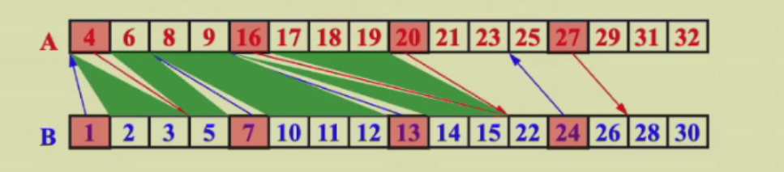  
  
2.Actual Ranking  
At most 2p smaller sized (O(logn)) problems  
T = O(logn) W = O(plogn) = O(n)  
  
#### Maximum Finding  
in binary search tree,replace "+" by "max" in the summation algorithm  
T(n) = O(logn),W(n) = O(n)  
大蛇丸算法之两两厮杀  
Compare all pairs  
T(n) = O(1)   
W(n) = O(n²)  
  
**A Doubly-logarithmic paradigm**  
h = loglogn is an integer  
Partition by $\sqrt{n}$ and do in parallel recursively(namely a divide and conquer)  
M<sub>i</sub> ~ T($\sqrt{n}$),W($\sqrt{n}$) 1 <= i <= $\sqrt{n}$  
For M<sub>1</sub> to M<sub>$\sqrt{n}$</sub>   
并行大蛇丸算法 => A<sub>max</sub> ~ T = O(1),W = O(n)  
T(n) <= T($\sqrt{n}$) + c  
W(n) <= $\sqrt{n}$W($\sqrt{n}$) + c   
T(n) = O(loglogn)  
W(n) = O(nloglogn)  
  
[Target]modify W(n) to O(n)  
Partition by h = loglogn and only one parallel  
M<sub>i</sub> ~ O($h$)  
For M<sub>1</sub> to M<sub>n/h</sub> 上述分治法=> A<sub>max</sub>  
T(n) = O(h + loglog(n/h)) = O(loglogn)  
W(n) = O(h x (n/h) + (n/h)loglog(n/h)) = O(n)  
  
[Target]modify T(n) to O(1)  
Random Sampling - T(n) = O(1),W(n) = O(n) with very high probability on an arbitary CRCW PRAM  
  
1.randomly select n<sup>7/8</sup> elements from A into B(对B的每个元素位置扔色子取A中的元素)  
T = O(1),W = O(n<sup>7/8</sup>)  
2.Separate into n<sup>3/4</sup> blocks of size n<sup>1/8</sup>  
并行大蛇丸算法 => M<sub>i</sub>  T(n) = O(1) W(n) = O(n<sup>1/4</sup>)  
3.Separate into n<sup>1/2</sup> blocks of size n<sup>1/4</sup>  
并行大蛇丸算法 T(n) = O(1) W(n) = O(n<sup>1/2</sup>)  
M(n<sup>7/8</sup>) ~ T = O(1),W = O(n)  
  
```  
while(there is an element larger than M){  
  for(each element larger than M)  
    Throw it into a random place in a new B;  
  Compute a new M;  
}  
```  
  
## Lecture 15: External Sorting  
  
To get a[i] on  
- internal memory - O(1)  
- hard disk  
  1.find the track;//磁道  
  2.find the sector;//扇区  
  3.find a[i] and transmit  
  
To simplify,we consider a tape where the data can be only accessed sequentially,not in random 磁头只能顺序移动  
Can use at least 3 tape drives  
  
Tool:Mergesort  
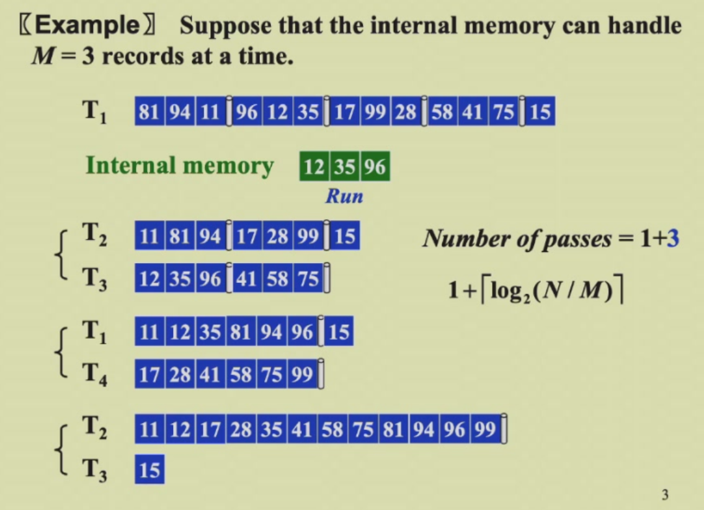  
pass:从尾向头移动读写头的次数  
N:数据总数 M:memory可以容纳的数据数  
N/M = number of runs  
  
[Concerns]  
1.Seek time —— O(number of passes)  
2.Time to read or write one block of records  
3.Time to internally sort M records  
4.Time to merge N records from input buffers to the output buffer  
  
[Targets]  
1.Reduction of the number of passes  
2.Run merging  
3.Buffer handling for parallel operation  
4.Run generation  
  
### Reduce the number of passes  
Use a k-way(k < M) merge by applying a min-heap  
  
Number of passes = $1 + \lceil log_k(N/M)\rceil$  
**2k tapes are needed**  
  
### Reduce the number of tapes —— Polyphase  
A 2-way merge using only 3 tapes  
{  
T2,T3 -> T1  
1/2T1 -> T2 //more passes are needed  
T1,T2 -> T3  
}loop  
  
A smarter way - split unevenly  
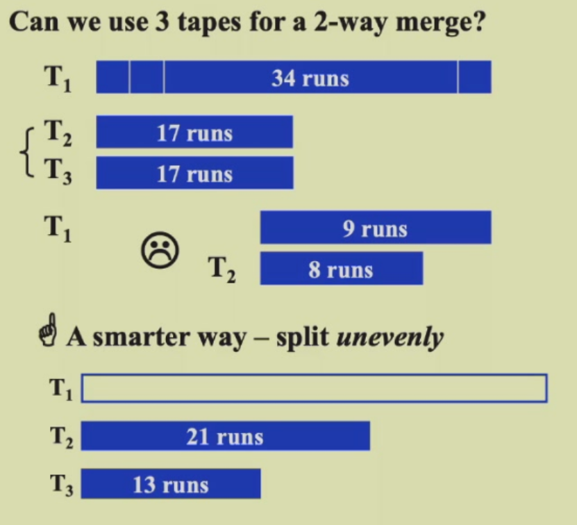  
Claim:If the number of runs is a Fibonacci number F<sub>N</sub> then the best way to distribute them is to split them into F<sub>N-1</sub> and F<sub>N-2</sub>  
For a k-way merge,F<sub>N</sub><sup>(k)</sup> = F<sub>N-1</sub><sup>(k)</sup>+...+F<sub>N-k</sub><sup>(k)</sup> where F<sub>N</sub><sup>(k)</sup> = 0(0 <= N <= k-2),F<sub>k-1</sub><sup>(k)</sup> = 1  
三阶：0,0,1,1,2,4,7,13,24,44,...  
k + 1 tapes only  
  
If the initial number of runs in NOT a Fibonacci number,we can add some empty runs to make it be a Fibonacci number  
  
### Parallel Operation缓存并行处理  
I/O与CPU的并行  
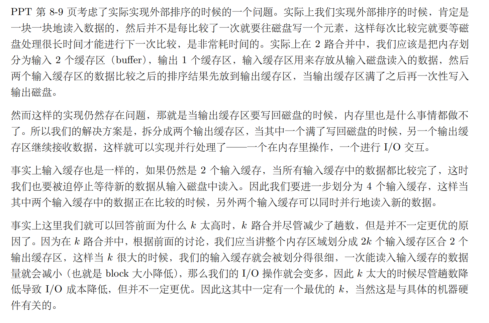  
2k input & 2 output  
  
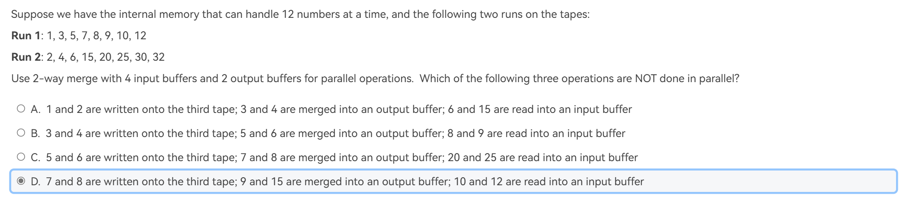  
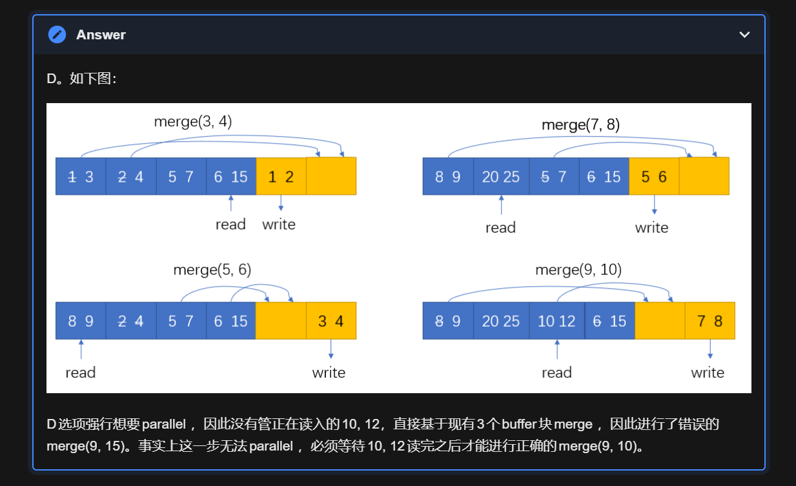  
  
!!! note "只有在读入的数据不影响排序结果的情况下才可以parallel地读入与合并"
  
### Generate a longer run —— Replacement Selection  
  
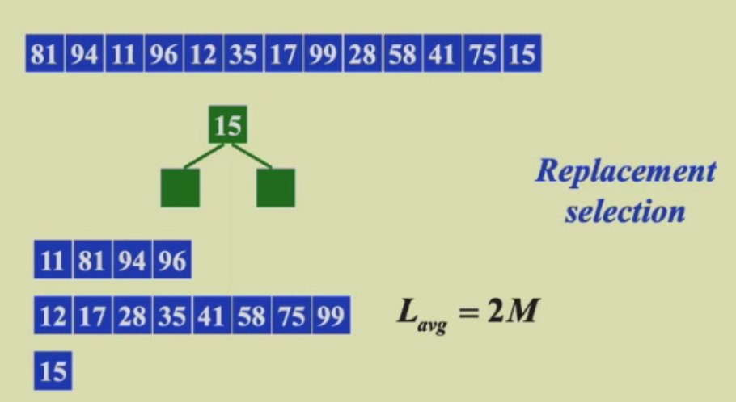  
  
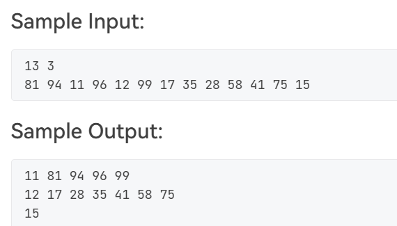  
  
### Minimize the merge time  
e.g. 2-way merge,4 runs of length 2,4,5,15,how to minimize the merge time  
  
线性合并: 2+4+6+5+11+15  
  
Huffman Tree(greedy)  
Total merge time = O(the weighted external path length)  
  
## Appendix  
  <table>  
  	<tr>  
  		<th>Problem</th>  
  		<th>Approximation ratio</th>  
  	</tr>  
  	<tr>  
  		<th>Travelling salesperson </th>  
  		<th>∞</th>  
  	</tr>  
  	<tr>  
  		<th>Bin Packing</th>  
  		<th>online:5/3</br>offline:11/9  
  	</tr>  
  	<tr>  
  		<th>Knapsack problem(0-1 version)</th>  
  		<th>1+ε ε->0  
  	</tr>  
  	<tr>  
  		<th>Graph coloring problem</th>  
  		<th>maxdegree + 1  
  	</tr>  
    	<tr>  
  		<th>Set cover problem</th>  
  		<th>lnn  
  	</tr>  
    	<tr>  
  		<th>Hamiltonian Cycle problem</th>  
  		<th>∞  
  	</tr>  
    	<tr>  
  		<th>3-SAT</th>  
  		<th>∞  
  	</tr>  
    	<tr>  
  		<th>Vertex Cover problem</th>  
  		<th>2  
  	</tr>  
    	<tr>  
  		<th>Clique problem</th>  
  		<th>∞  
  	</tr>  
    	</tr>  
    	<tr>  
  		<th>Partition problem</th>  
  		<th>∞  
  	</tr>  
    	</tr>  
    	<tr>  
  		<th>Maximum Cut problem</th>  
  		<th>17/16  
  	</tr>  
    	</tr>  
    	<tr>  
  		<th>Scheduling Job</th>  
  		<th>2  
  	</tr>  
    	</tr>  
    	<tr>  
  		<th>Load Balancing</th>  
  		<th>1.95  
  	</tr>  
    	</tr>  
    	<tr>  
  		<th>K-center</th>  
  		<th>2  
  	</tr>  
  </table>  
表1——常见NPC问题及最优近似比  