# 计算机系统II
## 硬件 Week1 - 6

### Review Week1
Why not single-cycle?  

- longest delay determines clock period  
- waste of area(e.g. mul need to use ALU repeatedly)  

  
Why not multi-cycle?  

- even longer time (longer than single-cycle)  
- a new perspective:finer-grained  


ISA:stack,accumulator,register(register-memory),register(load-store)
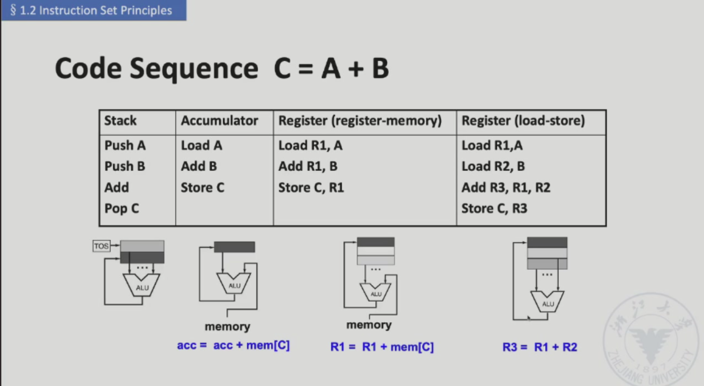

practice:D = A * B - (A + C * B)

```asm
//stack:
push A
push B
mul
push A
push C
push B 
mul
add
sub   //这是正确的 栈顶指针指向的元素是第二操作数
pop D


//accumulator:
load A 
mul B 
store E
load C 
mul B 
add A 
store F
load E 
sub F  //第一操作数是寄存器 第二操作数是内存变量
store D

//优化：
load B
mul C
add A
store D
load A
mul B
sub D
store D

```
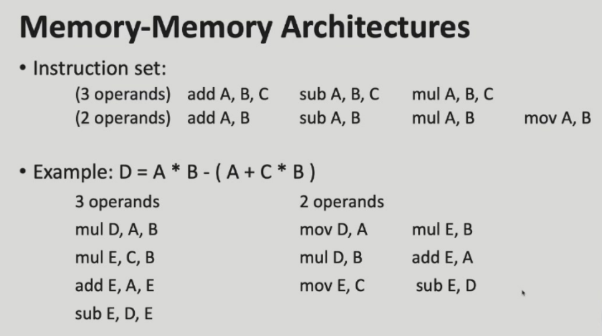
不同操作数的数目意味着不同的指令数

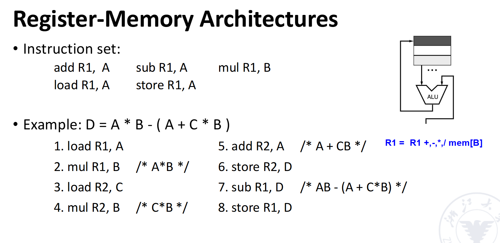

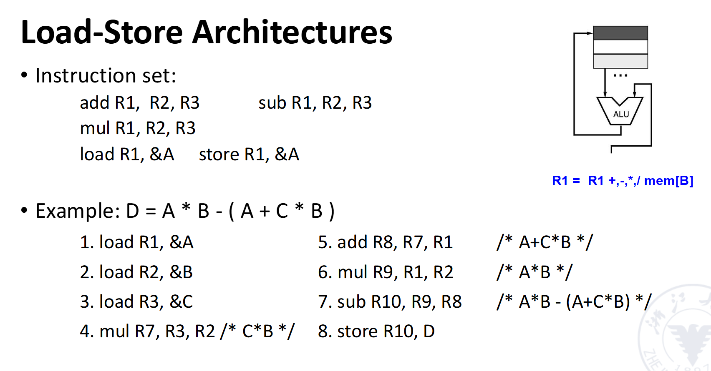

优化CPU：  
减少指令条数（CISC一条指令蕴含操作更多）  
  
使用带累加器的GPR：更快更便捷  
取址模式：立即数寻址、寄存器寻址、基于偏移的内存寻址  
内存寻址：排列（小端序RISC-V，大端序）、对齐（不对齐可能需要多次访存操作）  
  
```asm
2000 jal x1,procedureoffset
2004 add ...
...
3000 proc sub ...
     ret
```
x1存的地址应该是2004，确保跳转后的指令是没有执行过的  
  
jalr x3(效果同jal的x1),x1(基地址 编码空间 jal只能跳转32-5-7=20位，x1用于跳转到更大的范围),offset
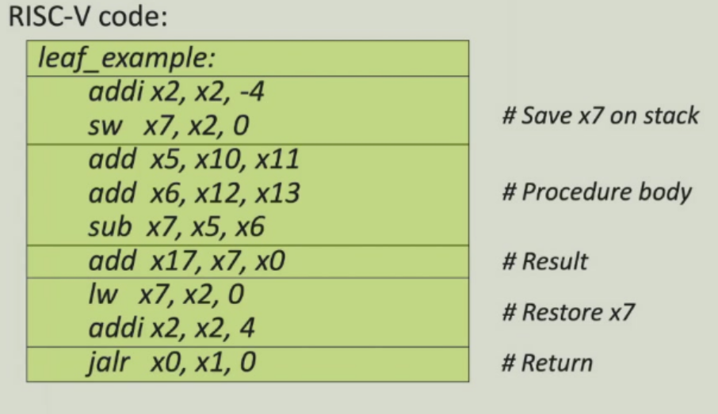
执行前有要保证x7的值不变，以免外部程序调用时出错  
为了状态保存，有两种寄存器保存方法：caller saving(可能需要保存所有寄存器)/callee saving(从函数的声明可知所需的寄存器)  
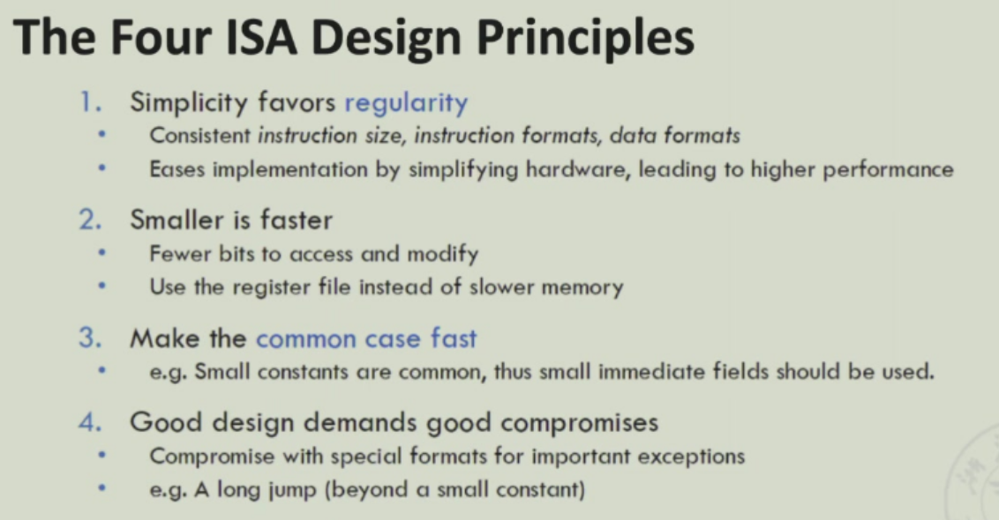

### 流水线 Week2 - 6

#### 流水线基础 Week2 - 3

1.流水线：co-use dependent function areas  
average:faster  
individual:slower for queueing  
  
IF ID EX(ALU)  
sequential execution:IF<sub>K</sub> ID<sub>K</sub> EX<sub>K</sub> IF<sub>K+1</sub> ID<sub>K+1</sub> EX<sub>K+1</sub>  
优点：容易实现，器件更少(不会发生冲突)  
overlapping execution:  
t<sub>IF</sub> = t<sub>ID</sub> = t<sub>EX</sub> = Δt  
execute time for n instructions:  
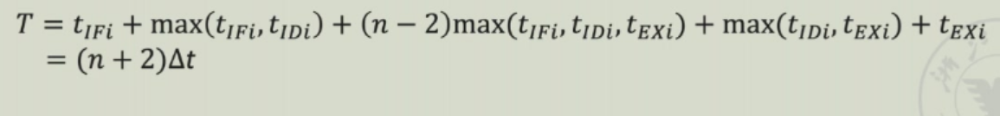
优点：快，器件利用率提高

单重叠（执行第k条指令的同时fetch第k+1条）：T = (2n+1)Δt  
优点：节省1/3的时间；提高利用率  
缺点：添加寄存器，控制硬件与逻辑更复杂

双重叠：T = (n+2)Δt  
优点：节省2/3的时间；提高利用率  
缺点：硬件进一步增加；必须将fetch,decode,execute完全分开

假设：IF + ID = EX  
单重叠: T = (n+1)Δt  
=> 阶段划分的合理性(非RISC-V)(RISC-V中，IF很慢，因为需要访问寄存器)

流水线：基于重叠执行的扩展（冒险）  
子过程：stages/segments  
深度depth：the number of segments（指令执行的条数）  
space-time图  
多周期的实际执行时间＞单周期，但其实现思路可以借鉴到pipelining  
性质：  
(1)划分子过程，每个阶段有对应的功能模块实现  
(2)每个阶段的时长要尽可能相等以确保效率，瓶颈bottleneck：最长的阶段，决定时钟周期  
(3)每个阶段的功能块需要一个buffer register（缓存寄存器/流水线的阶段间寄存器）在下一个时钟周期来临前存储这一阶段数据  
(4)适用范围：大量重新执行过程；充满  
(5)pass time:进入时间（从开始到充满） empty time:排空时间（从充满到全部执行完）  
分类：  
(1)单功能与多功能（功能：加减乘除与或非）
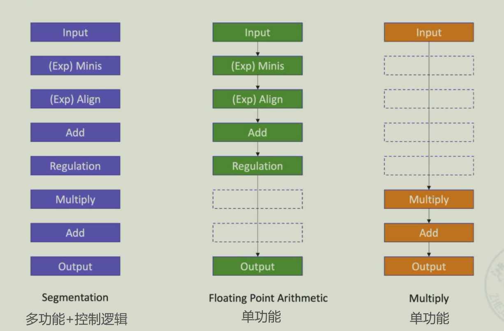
(2)静态流水线与动态流水线（都是多功能流水线）  
静态：单一时间只能完成一个功能  
动态：前一功能未执行完就可  以执行另一功能的操作  
灵活，效率高；但冲突，控制逻辑复杂  
(3)算术逻辑操作层流水component level，指令层流水processor level，跨处理器流水inter processor level  
(4)线性与非线性：feedback loop 指令执行过程中，数据流动是否存在回环（器件重复利用）  
非线性流水线需要调度以避免冲突/调度表  
(5)循序与乱序：指令结束的顺序是否与进入的顺序相同  
(6)标量处理器与矢量处理器：处理器是否包含矢量表征与矢量指令，e.g.GPU  
  
2.流水线的实现:  
IF,ID,EX,MEM,WB
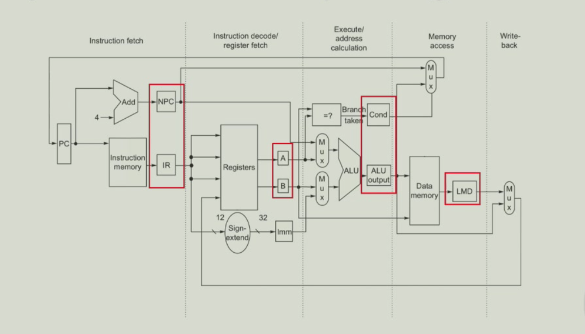
IR:取出的指令  
NPC：PC + 4（后续阶段使用）PC的分支跳转（提前）  
A,B:寄存器操作数  
=?:ALU_0SEL  
ALUoutput:数据/地址  
Cond：控制信号  
LMD：取址结果  

3.流水线的效率：绝对性能——时间、相对性能——对比单周期CPU  
时钟周期：单周期（最长指令）、流水线（最长阶段）  
n条指令的执行时间  
量化指标：  
(1)Throughput吞吐量:单位时间执行的指令条数  

$TP = \frac{n}{T} < TP_{max}$

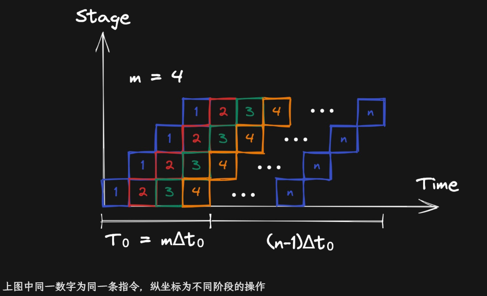

$T = (m+n-1)*Δt_0$  

$TP = \frac{n}{(m+n-1)*Δt_0}$  

$TP_{max} = \frac{1}{Δt_0} = TP(n → ∞)$  

实际情况需要考虑瓶颈
e.g.  
m = 4, s1,s3,s4:Δt, s2:3Δt  

$TP = \frac{n}{(3n+3)*Δt}$

$TP_{max} = \frac{1}{3Δt} = TP(n → ∞)$

$TP = \frac{n}{(m-1)Δt + nmax(Δt_1,Δt_2,...,Δt_m)}$  

提高吞吐量/解决瓶颈：  

- subdivision:divide s2 into s2a,s2b,s2c  
- repetition:s2:s2a,s2b,s2c  
  e.g.译码，一次可在寄存器取两个操作数rs1,rs2  

(2)Speedup加速比>1：  

$Sp = \frac{ExecutionTime_{non-pipelined}}{ExecutionTime_{pipelined}}$

$ExecutionTime_{pipelined} ≈ \frac{ExecutionTime_{non-pipelined}}{NumberOfStages}$

$Sp = \frac{n*m*Δt_0}{(m+n-1)*Δt_0} = \frac{n*m}{m+n-1} = m (n >> m)$

与流水线的时钟周期长度无关，只与流水线的深度和条数有关  
(3)效率η

$η = \frac{Sp}{m} = 1 (n >> m)$

理解:时空图中格子占时间*空间面积的比值  
why pipelining:  

- decrease CPU time  
- improve TP  
- improve effiency for resources  
  
ideal speedup = number of pipeline stages  
too many stages:  

- lots of complications  
- should take care of possible dependecies among in-flight instructions  
- huge control logic  

what affects the efficiency of multi-functional pipeline  

- segment in idle time for certain function  
- idle segments when establishing  
- clock cycle depends on the bottleneck segment  
- needs emptied when switch  
- output of last operation is the input of the next  
- register delay & overhead of clock skew(由布线长度和负载导致的顺序相邻寄存器的时钟信号到达时间之间的差异)  

4.流水线实现的困难：  
阶段执行时间不同造成时间浪费（尽量让各阶段时间长度相同）  
冯诺依曼架构在内存访问时的冲突，MEM和IF阶段访问同一块memory  
解决：哈佛架构/cache/instruction buffer（缓存）  

#### 流水线冒险 Week3 - 5

流水化设计：  
回环：跳转地址（控制冲突）、写回（数据冲突）  
加入阶段间寄存器共用基础组件  

**(1)结构冒险(Structural Hazard):a required resource(硬件) is busy**

冯诺依曼架构下，a single memory，data access & instruction fetch在同一时钟周期同时访问内存  
problem:two or more instructions compete for access to a single physical resource  
solution1:stall(nop instruction(addi x0,x0,0))  
solution2:add more hardware(can always solve structual hazard)  

**(2)数据冒险(Data Hazard):data dependency between instructions**
```asm
add x1,x2,x3 IF-ID-EX-WB(write x1)  
sub x4,x1,x5    IF-ID(read x1)-EX-WB  
```
problem:instruction depends on the result from the previous  
**solution1:stall(severely)**  
**solution2:forwarding(旁路:ALU output->input of EX)**  
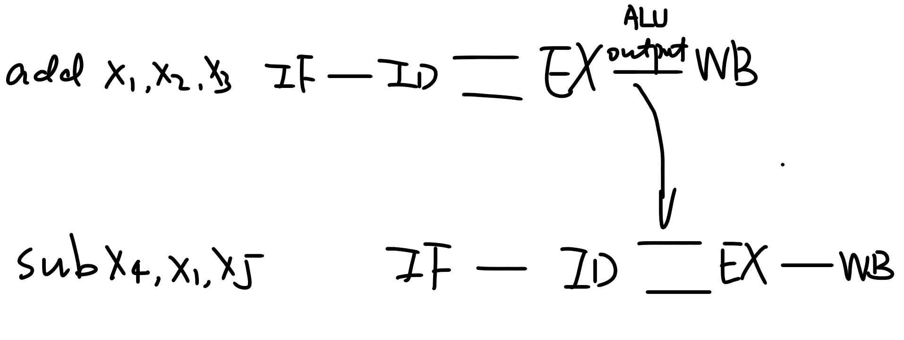
could not solve all the situation:  
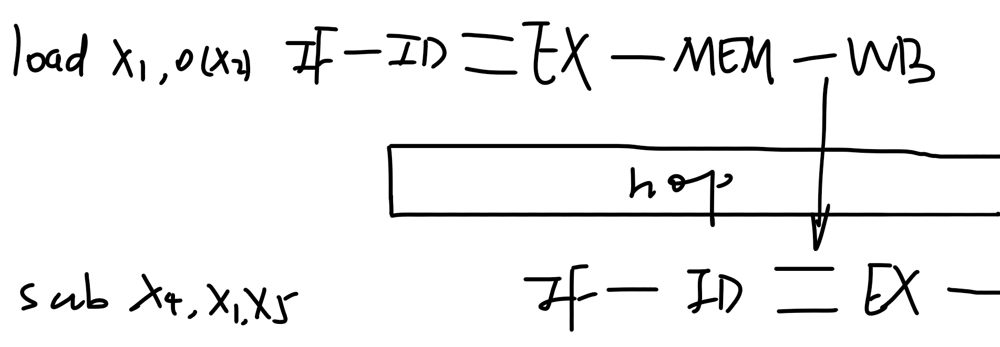
通过多路选择器引入<-多路选择器的控制信号<-冲突发生的条件  
条件：  
(1)前两条操作的目的操作数 = 后两条操作的源操作数  
(2)EX/MEM.RegWrite == 1：即前一条指令写入了寄存器  
(3)EX/MEM.Rd != 0：即前一条指令写入的不是 x0（如果是 x0 则不会发生任何变化）  
硬件实现:增加Forwarding unit  
input rs1,rs2,rd,EX_MEM_rd,MEM_WB_rd  
output ForwardA,ForwardB to Mux_ALU  
**双重冒险double hazard**
```asm
add [x1],x1,x2
add [x1],[x1],x3
add x1,[x1],x4
```
revise forwarding condition:  
MEM hazard  

- if(MEM/WB.RegWrite and (MEM/WB.Rd != 0))  
  and not(EX hazard)  
  and (MEM/WB.Rd == ID/EX.Rs1)  
  ForwardA = 01  

**Load-Use**
```asm
ld x2,20(x1)
and x4,x2,x5 //时序倒置 need one cycle to stall
or x8,x2,x6
add x9,x4,x2
```  
探测：check when using instruction is decoded in ID  
建议在ID阶段进行，因为在EX阶段进行会需要和Forwarding unit前后进行，降低极限频率，不能交换Forwarding和hazard detection，因为二者有依赖关系  
Load-Use hazard when ID/EX.MemRead and ((ID/EX.Rd == IF/ID.Rs1) or (ID/EX.Rd) == (IF/ID.Rs2))  
then stall and insert bubble  
硬件实现:增加Hazard detection unit  
force ID_EX_control.signal = 0  
prevent the update of PC and IF_ID_register  

**solution3:reorder code**  

**(3)控制冒险(Control Hazard):flow of execution depends on previous instruction 执行流，取哪条址由前一指令确定(b-type/j-type(地址还未计算))**  
**solution1:将分支判断提前到 ID 阶段，再暂停**  
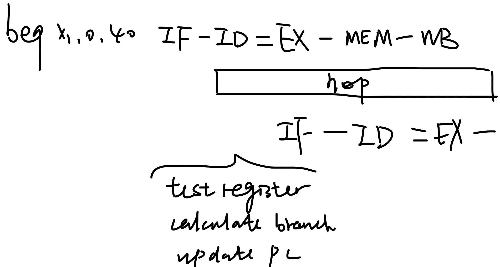

reduce stall  

- compare registers & compute target  
- add hardware in ID  
  why ID：no data in IF  
  产生了新的冲突  
  ```asm
  add x1,x2,x3
  add x4,x5,x6
  beq stalled
  beq x1,x4,disp
  ```
  ```asm
  lw x1,addr
  beq stalled
  beq stalled
  beq x1,x0,disp
  ```
  can solve by using forwarding (& stall)  
  branch still causes a stall  
  现代CPU：10-15阶 stall penalty:5 time cycle  
- compute the branch target address  
- judge if the branch process  
- target address adder  
- register comparator  

**solution2:prediction**  
贪心，预测不发生，继续取址  
发生时：强制置0（变为nop，惩罚）  
改进：predicts that some conditional branches will be untaken  
经验总结/动态调整（历史记录）：  

- branch prediction buffer(history table)  
- indexed by recent instruction address  
- outcome(taken or not)  

**solution3:dalayed decision**  
delay slot  
b-type指令后空出一个指令放入不影响分支的指令  

#### 非线性流水线调度  
线性与非线性流水线：是否存在回环  
Task:->S1->S2->S3->S4->S2->S3->S4->S3->EXIT  
调度:determine when to introduce a new task to the pipelining,so that the tasks will not conflict with each other  
非线性流水线的规范表示：Reservation table  
  <table>
  	<tr>
  		<th></th>
  		<th>1</th>
      <th>2</th>
      <th>3</th>
      <th>4</th>
      <th>5</th>
      <th>6</th>
      <th>7</th>
  	</tr>
  	<tr>
  		<th>S1</th>
  		<th>1</th>
      <th></th>
      <th></th>
  		<th>1</th>
      <th></th>
      <th></th>
      <th>1</th>
  	</tr>
  	<tr>
  		<th>S2</th>
  		<th></th>
      <th>1</th>
      <th></th>
  		<th></th>
      <th>1</th>
      <th></th>
      <th></th>
  	</tr>
      	<tr>
  		<th>S3</th>
  		<th></th>
      <th>1</th>
      <th></th>
  		<th></th>
      <th></th>
      <th>1</th>
      <th></th>
  	</tr>
      	<tr>
  		<th>S4</th>
  		<th></th>
      <th></th>
      <th>1</th>
  		<th></th>
      <th></th>
      <th></th>
      <th></th>
  	</tr>
  </table>
调度算法：  
initial conflict vector -> update conflict vector -> state transition graph -> circular queue(回环) -> shortest average interval  
禁止集(prohibit sets)：如果经过m个时钟周期进入指令会产生冲突，则m∈禁止集F  
  <table>
  	<tr>
  		<th></th>
  		<th>1</th>
      <th>2</th>
      <th>3</th>
      <th>4</th>
      <th>5</th>
      <th>6</th>
      <th>7</th>
      <th>8</th>
      <th>9</th>
  	</tr>
  	<tr>
  		<th>S1</th>
  		<th>1</th>
      <th></th>
      <th></th>
  		<th></th>
      <th></th>
      <th></th>
      <th></th>
      <th></th>
      <th>1</th>
  	</tr>
  	<tr>
  		<th>S2</th>
  		<th></th>
      <th>1</th>
      <th>1</th>
  		<th></th>
      <th></th>
      <th></th>
      <th></th>
      <th>1</th>
      <th></th>
  	</tr>
      	<tr>
  		<th>S3</th>
  		<th></th>
      <th></th>
      <th></th>
  		<th>1</th>
      <th></th>
      <th></th>
      <th></th>
      <th></th>
      <th></th>
  	</tr>
      	<tr>
  		<th>S4</th>
  		<th></th>
      <th></th>
      <th></th>
  		<th></th>
      <th>1</th>
      <th>1</th>
      <th></th>
      <th></th>
      <th></th>
  	</tr>
      	<tr>
  		<th>S5</th>
  		<th></th>
      <th></th>
      <th></th>
  		<th></th>
      <th></th>
      <th></th>
      <th>1</th>
      <th>1</th>
      <th></th>
  	</tr>
  </table>
由表可知禁止集F = {1,5,6,8}

初始冲突向量C<sub>0</sub> = (10110001)(由低到高的位对应禁止集中的数)

更新冲突向量 (C<sub>N-1</sub>C<sub>N-2</sub>...C<sub>i</sub>...C<sub>2</sub>C<sub>1</sub>)

CCV = current conflict vector
<table>
<tr>
<th>Interval</th><th>Initial</th><th>2</th><th>2</th><th>7</th>
</tr>
<tr>
<th>CCV</th><th>10110001</th><th>10111101(00101100 | 10110001)</th><th>10111111(以下三个或)</th><th>10110001</th>
</tr>
<tr>
<th>1-></th><th>10110001</th><th>00101100(10110001 >> 2)</th><th>00001011</th><th>00000000</th>
</tr>
<tr>
<th>2-></th><th></th><th>10110001</th><th>00101100</th><th>00000000</th>
</tr>
<tr>
<th>3-></th><th></th><th></th><th>10110001</th><th>00000001</th>
</tr>
<tr>
<th>4-></th><th></th><th></th><th></th><th>10110001</th>
</tr>
</table>

**state transition graph**


寻找回环（不一定回到初始状态，只要子图里有回环即可）
计算平均间隔：将circular queue相加除以指令个数

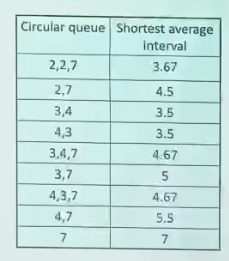

挑选平均间隔最短的即为最优调度方案

#### 多发射 Multiple issue
同一个时钟周期内发射多条指令  
Instruction-Level Parallelism(ILP)  

- Deeper pipeline  
  Less work per stage -> shorter clock cycle  
- Multiple issue  
  Replicate pipeline stages -> multiple pipelines  
  start multiple instructions per clock cycle  
  CPI < 1,so use instructions per cycle(IPC)  
  E.g. 4GHz 4-way multiple-issue 16BIPS,peak CPI = 0.25,peak IPC = 4  
- dependencies reduce this in practice  
  
使用场景：操作系统下的多任务执行（例：网易云音乐 & 微信 无信息传输）

- static multiple issue  
  *compiler* groups instructions to be issued together,packaging them into issue slots  
  静态指令调度 compiler detects and avoid hazards  
  e.g. the following instructions cannot be put into an issue slot  
```asm
add x1,x2,x3
add x1,x1,x2
add x5,x1,x2
```
- dynamic multiple issue  
  *CPU* examines instruction stream and chooses instructions to issue  
  compiler can help by reordering (软硬协同)  
  CPU resolves hazards by using advanced techniques at runtime(运行时调节)  

"Guess":start operation A.S.A.P;check whether the guess is right  
branch:roll back if path taken is different  
load:roll back if location is updated(miss in cache)  

speculation  
- compiler  
  reorder  
  "fix-up" instruction to recover wrong guess  
- hardware  
  buffer results until it determines they are actually needed  
  flush buffers on incorrect speculations  
  
two types of multiple-issue processor  
- superscalar(general computing)  
  the number of instructions issued is not fixed(1-8,with upper limit)  
  the processor is called n-issue if the upper limit is n  
- VLIW(Very Long Instruction Word)(digital signal processing/multimedia)  
  the number of instructions issued is fixed(4-16),constituting(拼接) a long instruction or an instruction packet  
  scheduling can be only done statically  

super-pipeline  

- subdivide each pipeline stage  
- time cycle doesn't change,an instruction is issued every 1/n time cycle  
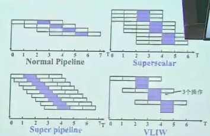

hazard detection in static scheduling  

- hazard detection in outgoing package and select  
- check conflicts during execution  
1 integer instruction(load store branch) + 1 floating-point operation instruction(fp)  
- fetch 2 instructions from memory  
- determine hazard  
- send  
  
hazard in dual-issue  
EX data hazard
```
add x10,x0,x1
ld x2,0(x10)
```
forwarding -> split into 2 packets  
load-use hazard  
split into 2 not adjacent packets  

e.g.  
```asm
Loop:ld   x31,0(x20)
     add  x31,x31,x21
     sd   x31,0(x20)
     addi x20,x20,-8
     blt  x22,x20,Loop
```

<table>

<tr>
<th></th><th>ALU/branch</th><th>Load/Store</th><th>cycle</th>
</tr>
<tr>
<th>Loop:</th><th>nop</th><th>ld </th><th>1</th>
</tr>
<tr>
<th></th><th>addi x20,x20,-8 </th><th>nop</th><th>2</th>
</tr>
<tr>
<th></th><th>add  x31,x31,x21</th><th>nop</th><th>3</th>
</tr>
<tr>
<th></th><th>blt  x22,x20,Loop</th><th>sd   x31,8(x20)</th><th>4</th>
</tr>
</table>  
IPC = 1.25(peak IPC = 2)  

increase IPC,hazard mitigation:loop unrolling  

- replicate loop body to expose more parallelism  
- use different registers(register renaming)  

limitation:  

- Instruction-level parallelism inherent in the program  
- difficulties in hardware implementation  
- technical limitation  

static -> dynamic  
superscalar : transparent to the programmer(硬件兜底)  
running time effect will be caused greatly by compiler's optimization  
solution:  

- execute instructions out of order but commit results to registers in order(buffer)  
  
#### 中断与OS基础  
解决冲突： 

- save PC  
- supervision exception cause register(SCAUSE)  
- jump  

handler actions:  

- read cause and transfer to relevant handler  
- determine action required  
- restartable   
  take correct action  
  use SEPC(used for saving PC) to return   
- otherwise  
  terminate  
  report error  

in pipeline:  

- control hazard  
- mispredicted branch  

multiple exceptions:deal with the earliest instruction  
  
trap(soft interrupt):软件产生，运行时错误/用户显式中断  
OS is interrupt-driven  
special interrupt:计时器中断 kernal介入管理  
  
I/O处理:  
用户：系统调用system call  
操作系统：MMIO(Memory Mapping I/O)  
同步I/O：进行 I/O 的时候 block 掉当前请求 I/O 的程序，等待 I/O 结束（可能会调度运行另一个程序）(常用)  
异步I/O：即使 I/O 没有完成，仍然继续运行原程序，当 I/O 完成时，执行用户态定义的 callback 回调函数(高效)  
  
DMA(Direct Memory Access):搬运数据，完成后通过中断告诉CPU，让CPU从无意义工作中解放，xPU(GPU MPU TPU)访问内存都算DMA  
UMA：统一内存架构  
  
两模式操作：  

- user mode  
- kernel mode  
  
system call  

- 通过trap转到内核态  
- 在kernel执行指定操作  
- 返回用户态  
  
## OS Week7 - 15

### Introduction Week7

set up memory  
Moore's law：ineffective due to heat emission    
SMP system:symmetric multi processors  
[Definition]resource abstractor and resource allocator  
BIG for drivers  
LibOS:只负责resource allocator  
Multi-programming:allow multiple jobs to reside in memory simultaneously  
Time-sharing:Multi-programming with rapid *context-switching*  
f<sub>CPU</sub>=400f<sub>memory</sub>=400000f<sub>disk</sub>  
The kernel is NOT a running programme,but executed when some event occurs/requested  
kernel size:some memory size spent (10M)  

- lean nothing-more  
- mean single-minded  

hardware -> protected inst -> OS  
non-hardware -> unprotected inst -> OS/app  
OS  -> kernel mode  
app -> user mode  
determine inst when decoding,raise trap is privileged inst and mode == user  
start in kernel mode  
bootstrap program (bootloader)stored in Read Only Memory(ROM)  
RISC-V modes  

- 00 user/app   U  
- 01 supervisor S  
- 10 reserved  
- 11 machine    M  

Event:an "unusual" change in control flow  
stop execution -> change mode -> change context  
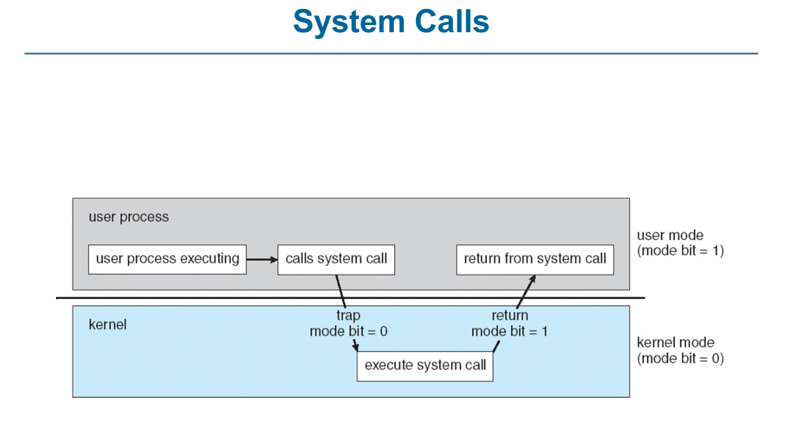
a handler for each event type:  
interrupts(hardware) & exceptions(traps)(software) "processEvent()"  
  
**system call**  
[Definition]a special kind of trap when a user program need to do something privileged  
svc(supervisor call) hvc(hypervisor call) smc(secure monitor call)  

**timers**  
The timer interrupts the computer regularly  
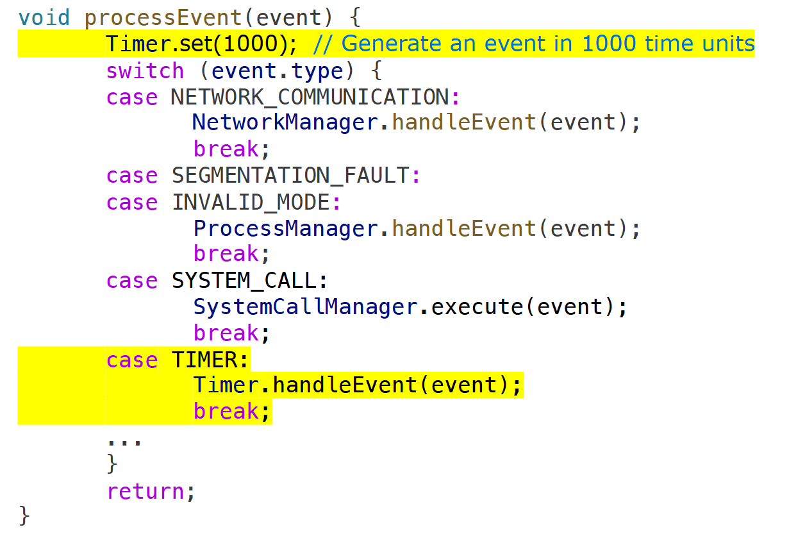

OS services  

- process management  
- memory management  
- storage management  
- I/O management  
- protection and security  
  
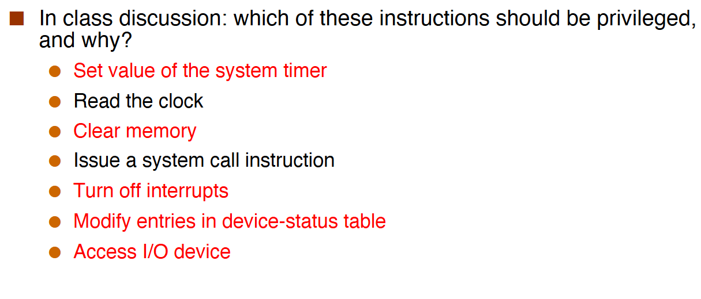

### OS Structures Week8 - 9

OS features:  
helpful for users  

- program execution  
- I/O operation  
- file systems  
- communication  
- error detection  

operation and protection  

- resource allocation  
- accounting  
- protection and security  
  
interface  
- GUI  
- command line interface(CLI)  
- Touchscreen  
  
**system call**  
Application programming interface(API)  
syscall -> kernel space  

1) kernel_entry:save register data  
2) write  
3) ret to user  

syscall table(array):index = syscall No.  
System-call interface  
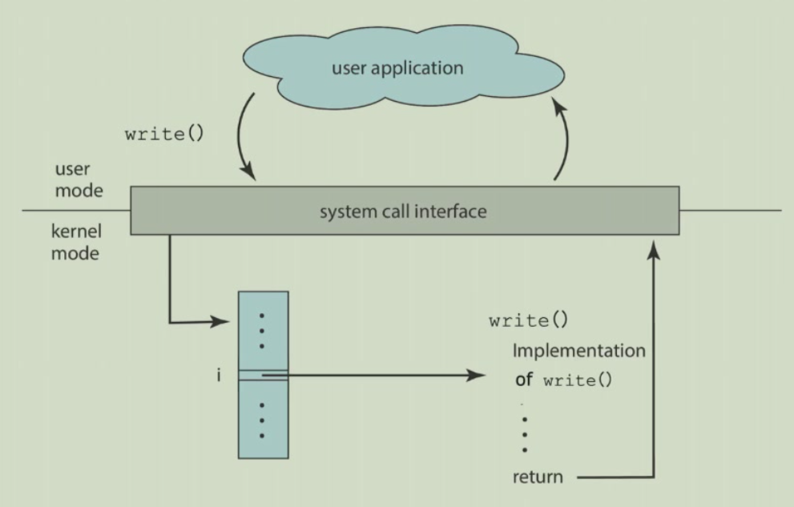
printf is a privileged instruction(link to device) => syscall  
  
`cp a b`  
open and read  
open and write  
0 -> stdin  
1 -> stdout  
2 -> stderr  
  
183 for small file  
for large file more reads and writes since single read can only reach 130KB  
种类一样，数量变多  
parameter passing:register(like C)  
  
syscall type  

- process control(分配内存资源)  
- file management  
- device management  
- information maintenance  
- communications  
  
**system service**  
**linkers and loaders**  
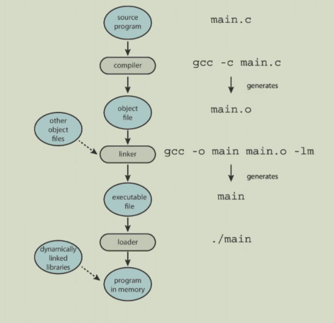
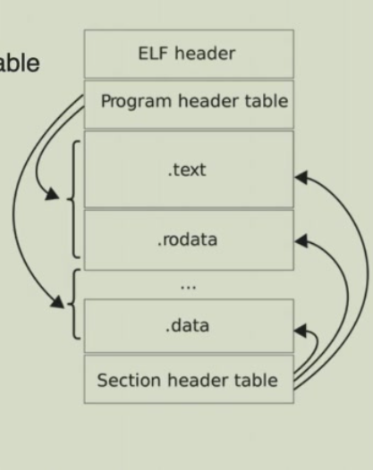  
static variable -> .data(int a=5;)初始化  
static const -> .rodata(read only)  
int b; -> .bss未初始化 filled with 0  
.text executable  
  
static linking  

- big file(x100 of dynamic linking)  
- independent of the environment(less syscalls)  
- no .interp section(loader-path)  
- no memory mapping segment(dynamic libraries e.g./libc)  
  
dynamic linking  

- small file  
- need loader resolve library calls  
- can't execute without proper loader  
  
Who setups ELF file mapping  
Kernel  
  exec syscall  
    load_elf_binary  
  
Who setups stack and heap  
Kernel  
  exec syscall  
  
Who setups libraries  
Loader  
  ld-xxx  
  
after `./a.out`  
entry point address->_start(static) loader(dynamic)  
`call<_libc_start_main>`  
**statically-linked elf**  
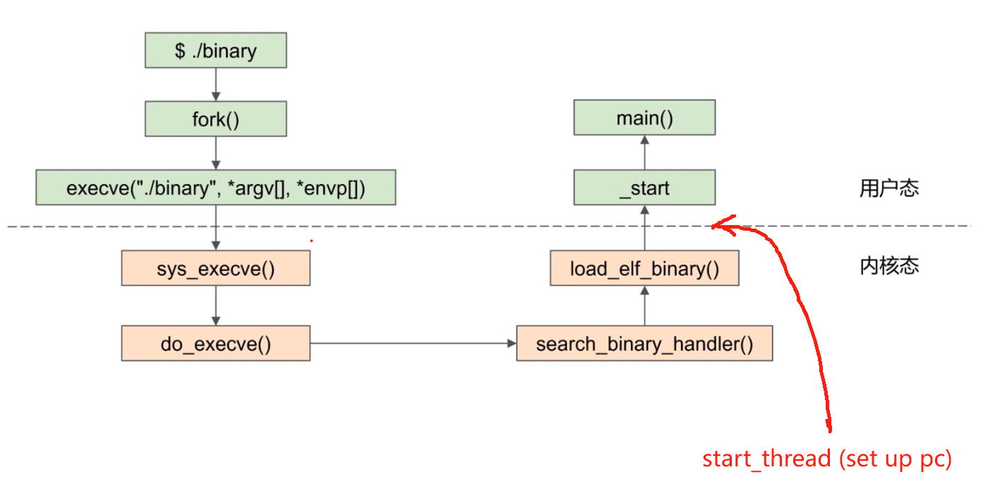
  
DYN:loader -> interp_elf_ex -> e_entry  
STA:a.out_elf -> e_entry  
  
**dynamically-linked elf**  
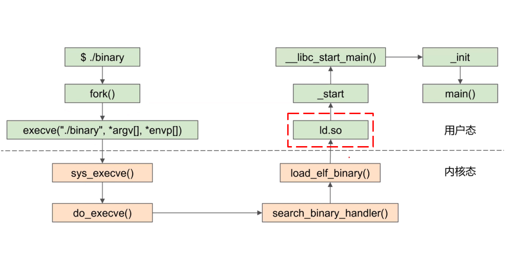
  
Policy:What will be done?  
Mechanism:How to do it?  
**Separation of policy from mechanism**  
  
DOS:disk OS  
LKM:loadable kernel module  
  
Layered approach  
  
**Microkernels**  
  
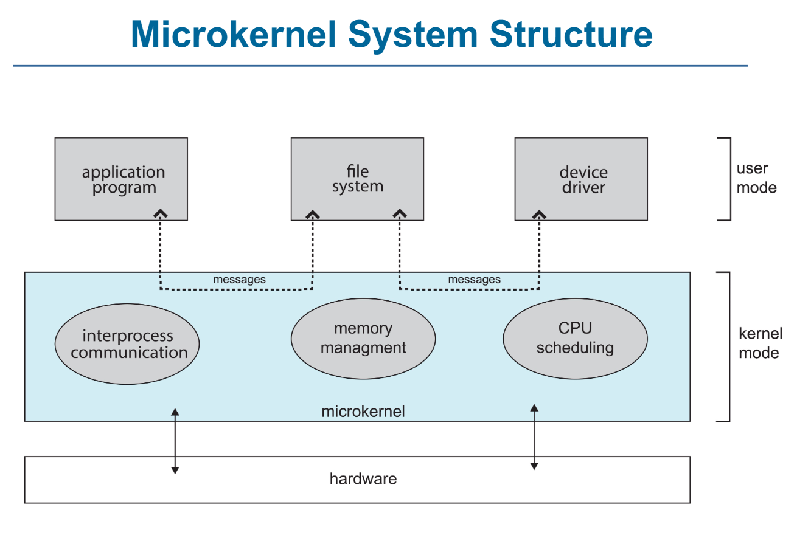  
  
- benefits:  
  easier to extend  
  easier to port OS to new structure  
  more reliable(less code running in kernel)  
  more secure  
- detriments:  
  performance overhead of user space to kernel space   communication  
  
Hybrid systems 混合系统  
  
!!! danger "read hello-lkm"
  
### Processes Week10 - 11  
[Definition]a unit of resource allocation and protection
Process = code(text) + data section + program counter + registers + stack + heap  
a unit of **resource allocation and protection**  
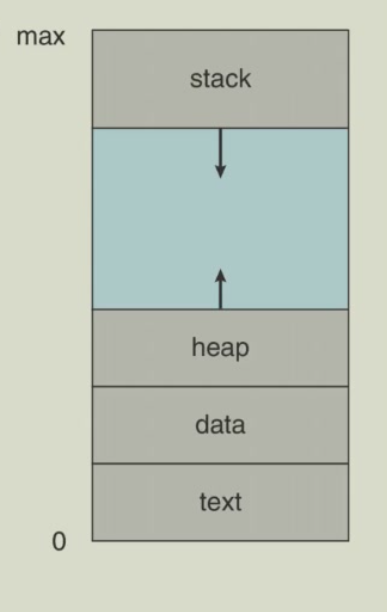

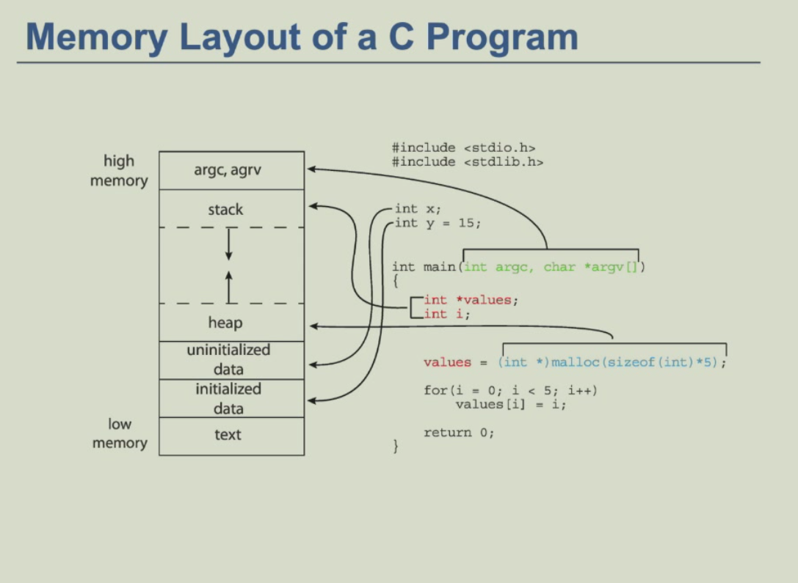  
  
Single- and Multi-Tasking  
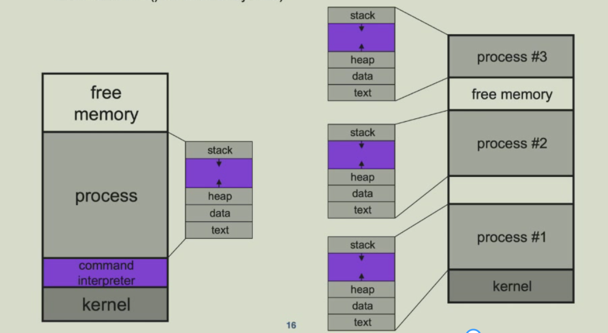  
  
Process Control Block(PCB)数组  
```C
task_struct{
Process state(new running waiting ready terminated)
Process number(PID)
Process counter
registers
memory limits
list of open files
...
}
```
  
!!! Note "填空"  
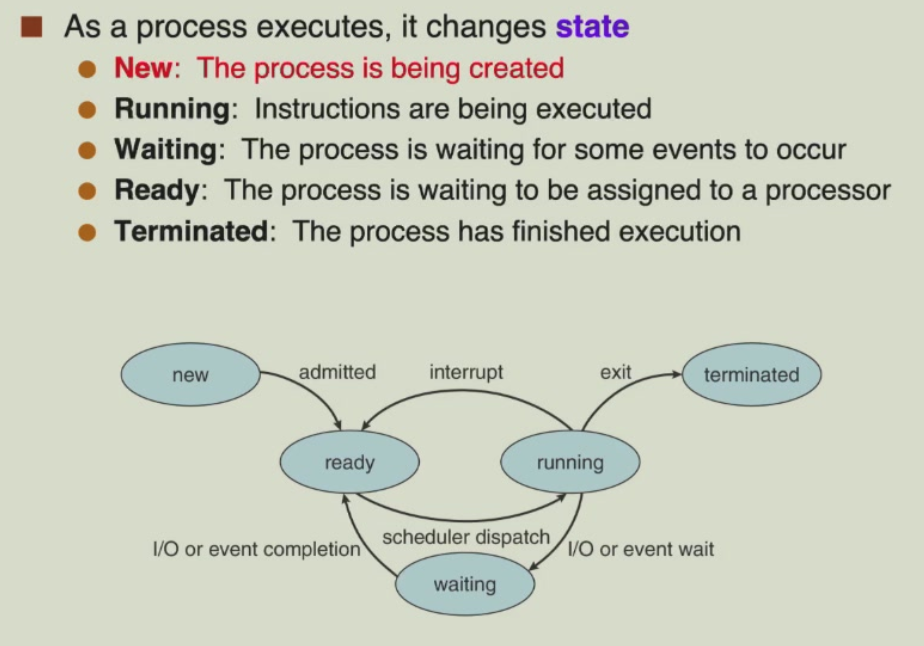  
  
create -> pid = 0:swapper/idle  
fork -> pid = 1:systemd -> all other processes  
The child can be either a clone of its parent or a new one  
  
#### new  
**fork()**  
child is a copy of the parent but a different pid and its resource utilization set to 0  
returns the child's pid to the parent and 0 to the child  
e.g.  
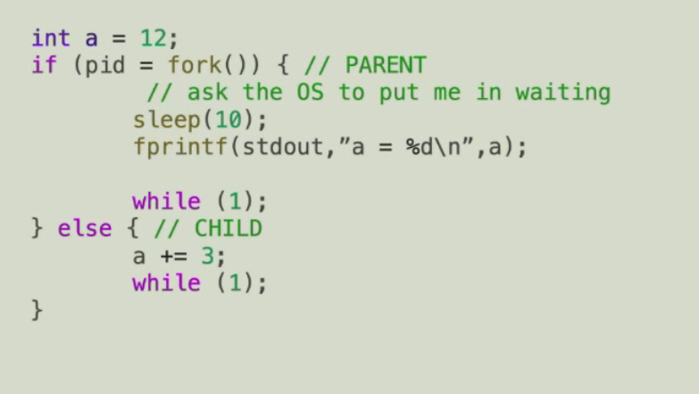
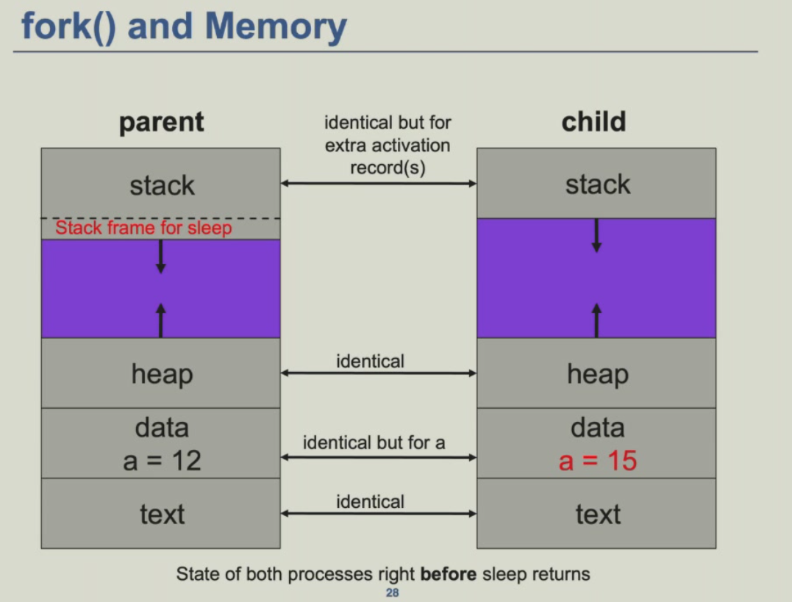
  
```C
pid1 = fork();//1 -> 2
printf("hello\n");//2 hello
pid2 = fork();//2 -> 4
printf("hello\n");//4 hello
//total 6 hello
```

```C
int main{
  fork();//2
  if(fork()){//parent 4
    fork();//6
  }
  fork();//12
  //no thread
}
```
  
!!! Note "数数量"

**execve()(execute argv[](命令行参数) envp[](环境变量))**  
after a fork() replace the memory space with a new program  
will not return unless an error occur  
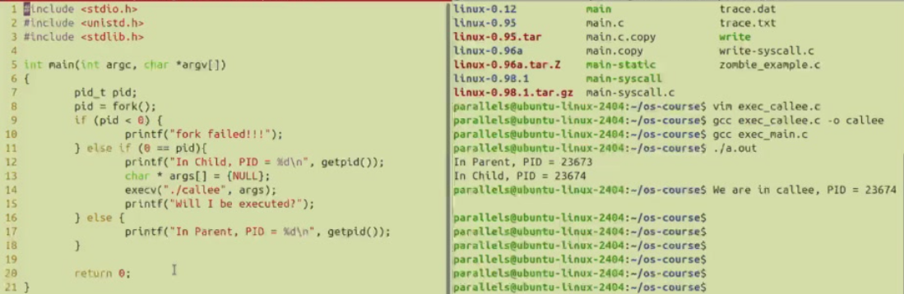
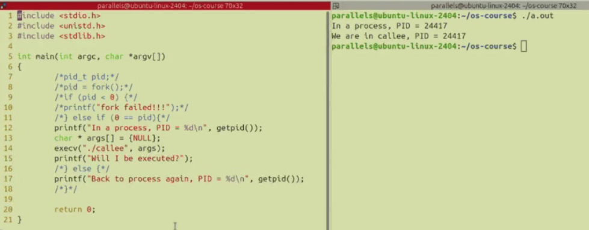

!!! Note "no_fork"

ASLR:地址随机化  
exec会抹去当前进程的内容（无论是子进程还是父进程）  
  
#### terminate  
**exit()**  
SIGINT can be handled  
signal(SIGINT,my_handler)  
SIGKILL & SIGSTOP:cannot be handled for safety  
zombie:不占CPU，但仍使用内存，PCB cannot be deallocated except for the help of its parent  
a zombie lingers on until:  

- its parent calls wait()  
- its parent dies  
- a handler to SIGCHLD  
  
orphan：adopted by systemd(pid = 1/1763)  
no zombie orphan exists  
  
#### ready running waiting  
Ready queue and wait queues(list)  
a queue for every waiting object  
```C
struct list_head{
  struct list_head *next,*prev;
}
unsigned long tg_offset = offsetof(struct(task_struct),thread_node);
curr_thread = (struct task_struct *)(((unsigned long)curr_thread -> thread_node.next) - tg_offset);
```
  
context:registers represented in the PCB  
context switch:state saving  

- time is overhead;the system does no useful work while switching  
  the more complex the OS and the PCB is, the longer the context switch  
- time-dependent on hardware support  
  
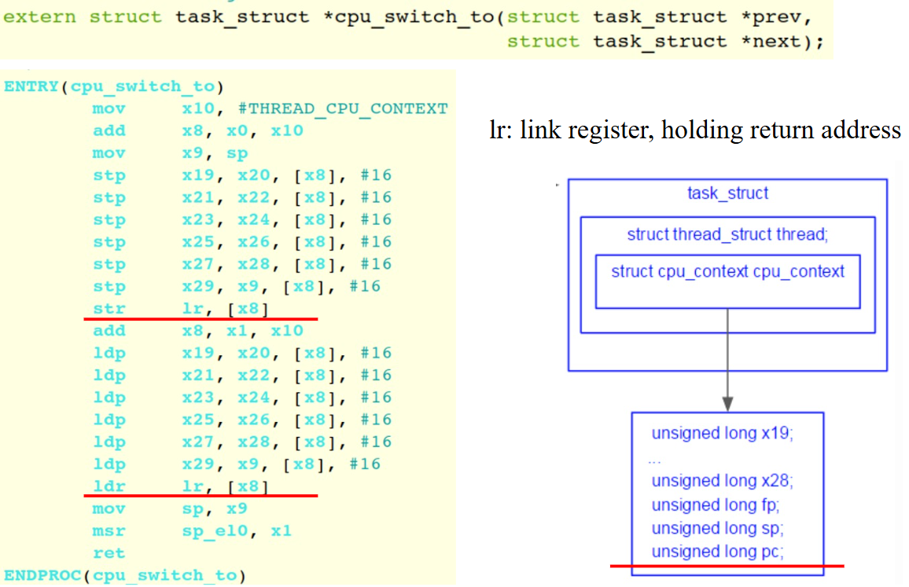
  
stp = store pair  
x29 = fp  
x9 = sp  
x30 = lr = ra (pc = lr after ret)  
\#16 = x8 + 16  
x0 = switch_caller_pcb_pointer  
x1 = switch_callee_pcb_pointer  
`add x8,x0,x10(offset)`  
x8 = cpu_context  
  
stack switch  
```asm
mov x9,sp
...
mov sp,x9
```
  
code switch  
  
`str lr,[x8]` `ldr lr,[x8]`中的lr分别是什么  
lr -> pc0  
pc1 -> lr  

`str lr,[x8]`中的lr什么时候再被使用  
```C
P1_f(){
  cpu_switch_to(current,P0)
}
```
  
C code is not permitted because of overhead or optimization(lean & mean)  

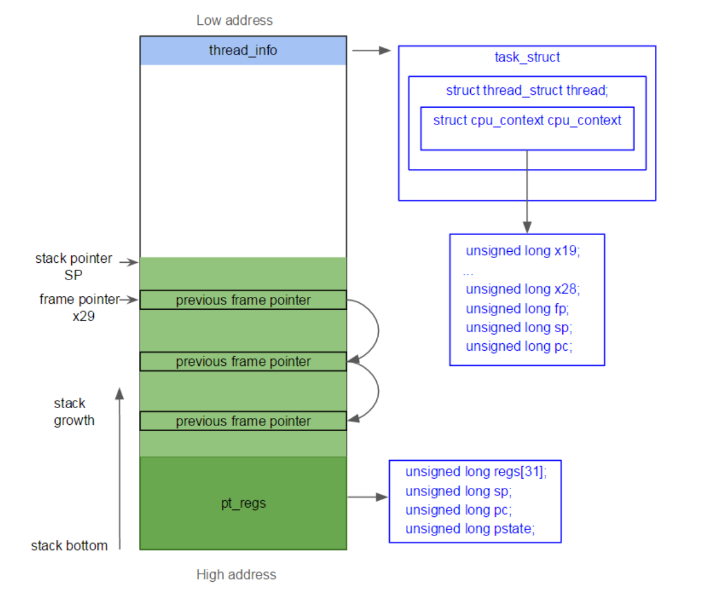  
`msr sp_e10,x1`for safety(thread_info -> cred -> uid)(x1:task_struct)  
  
When and where are the kernel context been saved?  

- when:cpu_switch_to  
- where:cpu_context in PCB  
    
When and where are the user context been saved?(before (kernel)context switch)  
context switch in kernel mode  

- when:kernel_entry  
- pt(process trees)_regs in per_thread kernel stack  

kernel_space_context in PCB  
user_space_context in pt_regs  
  
user process -> call system call(kernel_entry)-> execute system call(kernel_exit)-> return  

why fork() can return two values?  
x0 store return_value in arm64  
  
two x0 after clone  
  
When does child process start to run and from where?  
When forked, child is READY -> context switch to RUN  
After context switch, run from ret_to_fork  
ret_from_fork -> ret_to_user -> kernel_exit who restores the pt_regs  
  
### Scheduling Week11 - 12  
[Definition] The decisions made by the OS to figure out which ready processes/threads should run and for how long  
  
The **policy** is the scheduling strategy  
The **mechanism** is the dispatcher  
  
CPU-I/O burst cycle  

- I/O bound  
- CPU bound  
  
non-preemptive scheduling:a process holds the CPU until it is willing  to give it up  
preemptive scheduling:a process can be preempted(抢占) before end of execution  
  
scheduling decision points:  

1. RUNNING - WAITING  
2. RUNNING - READY  
3. WAITING - READY  
4. RUNNING - TERMINATED  
5. NEW - READY  
6. READY - WAITING  

non-preemptive:1,3,4,5  
preemptive:1,2,3,4,5  
  
scheduling queue:  

- Ready Queue:processes in ready state  
- Device Queue:processes waiting for particular device  

**dispatch latency**:time it takes for the dispatcher to stop one process and start another to run  
  
criteria:  

- CPU utilization  
- throughput  
- turnaround time  
- waiting time  
- response time  
  
#### scheduling algorithm  
**First-Come,First-Served(FCFS)**  
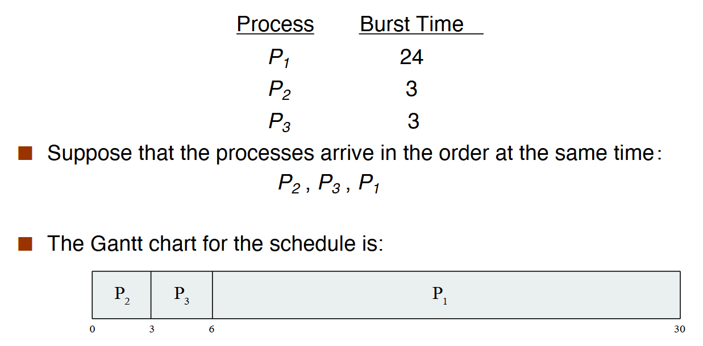
  
arrival time = 0.0  
  
Waiting time = start time - arrival time  
P1 = 6,P2 = 0,P3 = 3  
average waiting time = (6 + 0 + 3)/3 = 3  
  
Turnaround time = finish time - arrival time  
P1 = 30,P2 = 3,P3 = 6  
average turnaround time = (30 + 3 + 6)/3 = 13  
  
Suppose the process arrive in the order:P1,P2,P3  
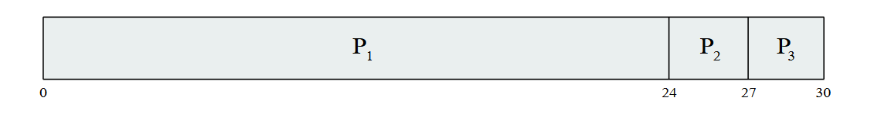  
average waiting time = (0 + 24 + 27)/3 = 17  
average turnaround time = (24 + 27 + 30) = 27  
  
Convoy Effect:short process behind long process  
  
**Shortest-Job-First(SJF)**  
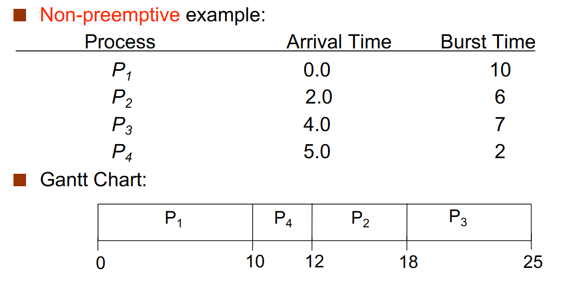
  
average waiting time = (10 + (12 - 2) + (18 - 4) + (10 - 5))/4 = 7.25  
average turnaround time = (10 + (18 - 2) + (25 - 4) + (12 - 5))/4 = 13.5  

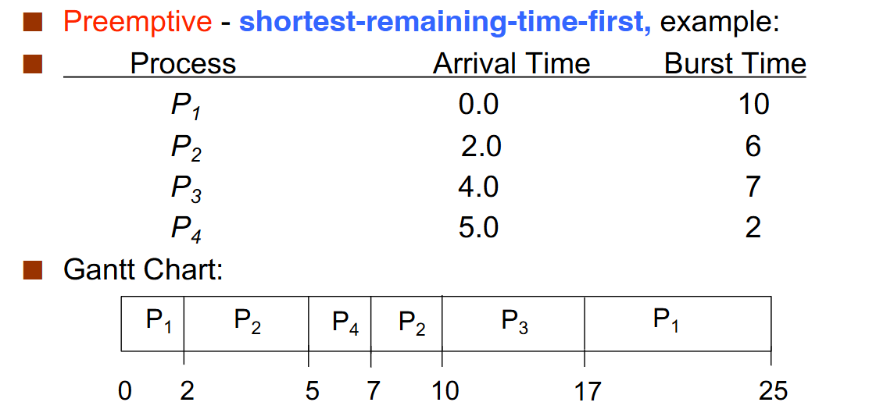

!!! note "Be sure you can draw the Gantt Chart"

average waiting time = ((17 - 2) + (7 - 5) + (10 - 4))/4 = 5.75  
average turnaround time = (25 + (10 - 2) + (17 - 4) + (7 - 5))/4 = 12  

SJF is optimal for average wait time  
problem:we cannot know the burst duration beforehand  

**CPU burst duration prediction**  
base on previous CPU bursts  
  

**Round-Robin scheduling**  
preemptive  
a time quantum:a fixed time interval(10-100ms)  
  
Unless a process is the only READY process, it never runs for longer than a time quantum before giving control to another ready process
  
 It may run for less than the time quantum if its CPU burst is smaller than the time quantum  

Scheduling:  

1.Pick the first process from the ready queue  
2.Set a timer to interrupt the process after 1 quantum  
3.Dispatch the process  

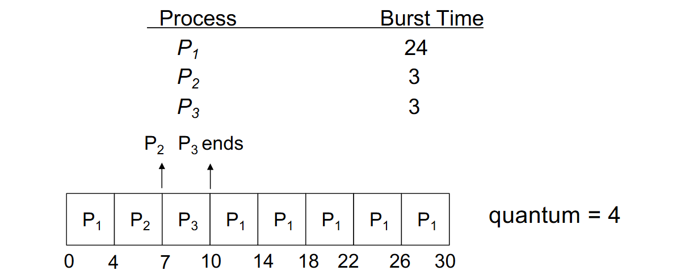  

average waiting time worse than SJF,but better response time
no starvation,average waiting time is bounded  

The right quantum:  
short quantum:great response/interactivity but high overhead e.g.Mobile
(quick response for users)  
long quantum:poor response but low overhead e.g.Server(process heavy load)  
  
context-switching time:10μs  

**Priority scheduling**  
  
small priority first in Linux,big first in Windows  

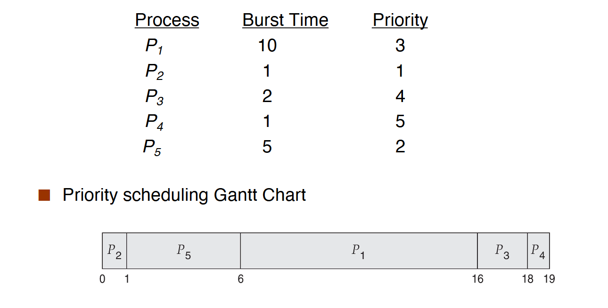  

average waiting time = (0 + 1 + 6 + 16 + 18)/5 = 8.2  

**Priority scheduling / Round-Robin**  
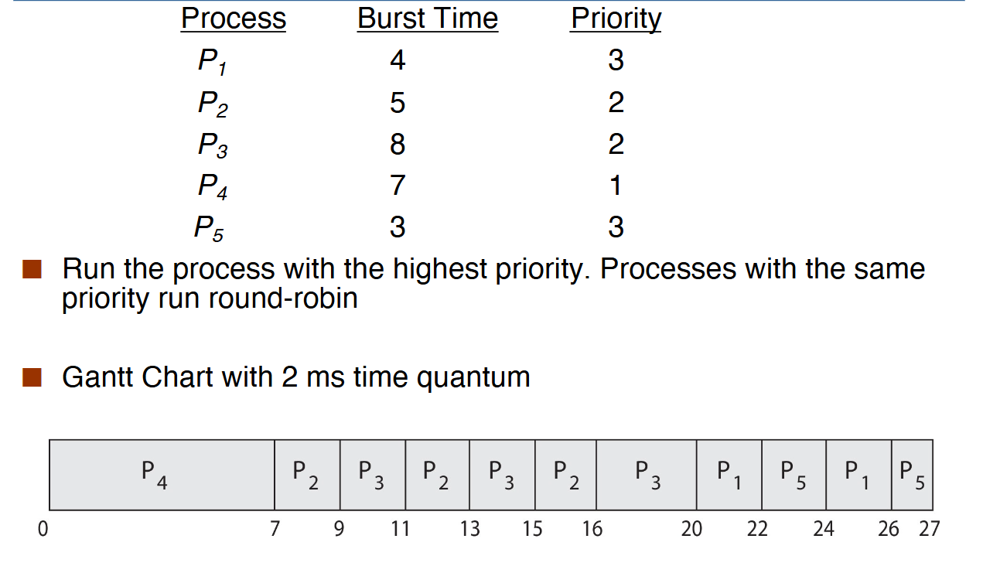  
  
High priority finish before low priority start  
Round-robin in the processes of the same priority  
  
problem:low-priority process will not ever run —— starvation  
  
solution:priority aging——increase the priority of a process as it ages  

**Multilevel Queue Scheduling**  
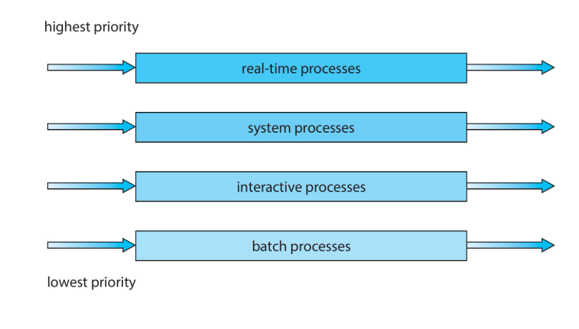  
  
different scheduling algorithms applied in different queues  
high-priority could be RR,low-priority could be FCFS  
scheduling between the queues:  

- preemptive priority scheduling  
- time-slicing among queues  
  
process can move among the queues  
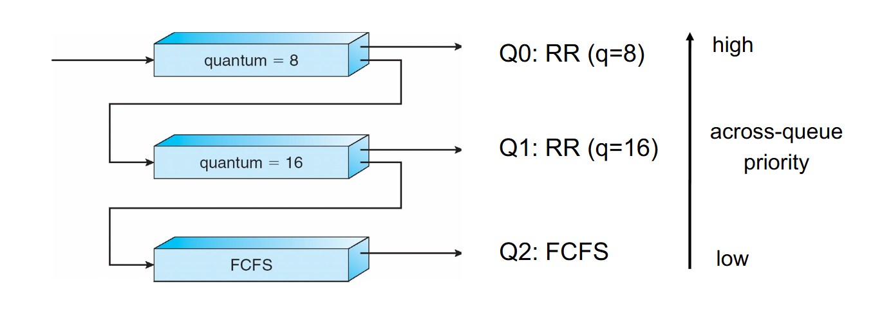  
  
Multilevel Feedback queues  

**What's a good scheduling algorithm**  

1.analytical/theoretical results  
2.simulation  
3.implementation  

**Multiple-Processor scheduling**  
Multi-core CPUs  
Multi-threaded cores  

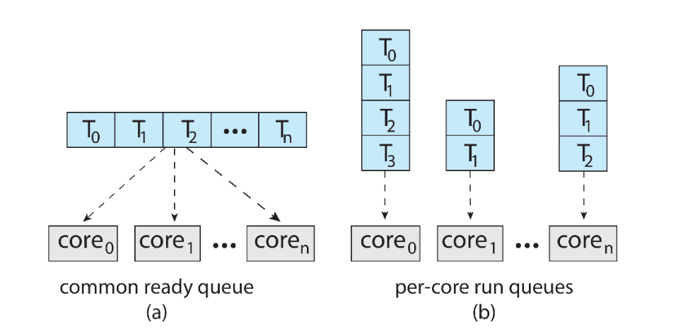  

hyperthreading:if one thread has a memory stall,switch to another thread
4-physical core -> 8-logical core  

```C
nice -10 ./a.out
//priority number = 19 - nice
```
  
通过提升时间片counter提升优先级priority  
O(1)scheduling:  
active task array & expired task array  
  
bitmap set to 1 when a task of given priority becomes ready  
find the highest priority for which there is a ready task becomes simple 
disadvantage:we cannot change the scheduling algorithm  
  
different scheduling for desktop & server:different target —— solidity & response   

### Inter-Process Communication(IPCs) Week13  

cooperating processes  

- information sharing  
- computation speedup  
- modularity  
- convenience  
  
multiprocess architecture —— browser  
  
Models of IPC  

- Shared memory  
- Message passing  
- Signal  
- Pipe  
- Socket  

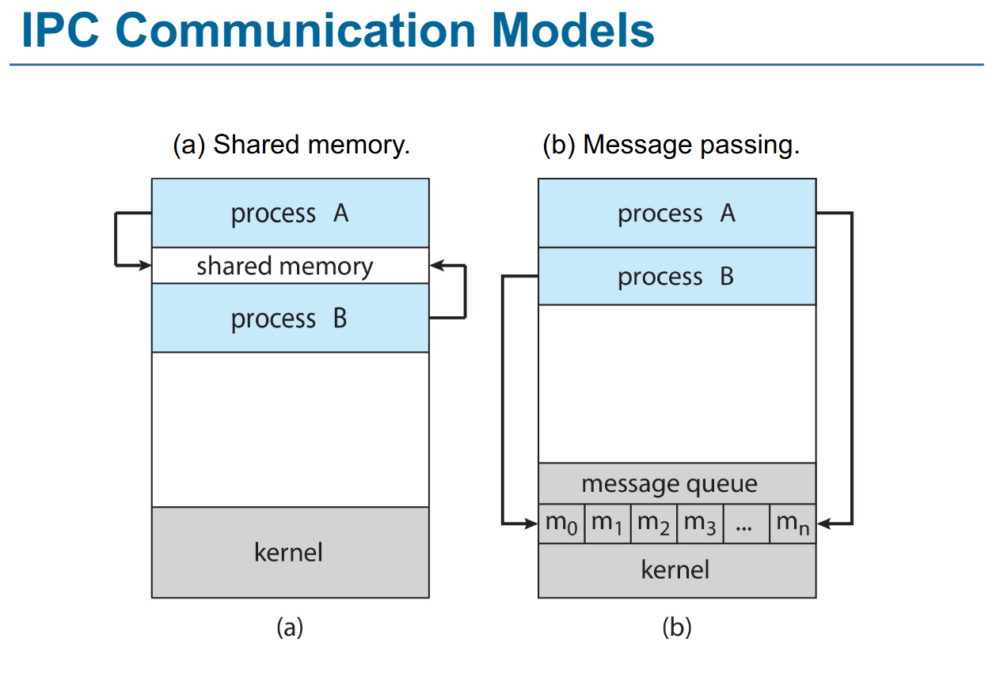

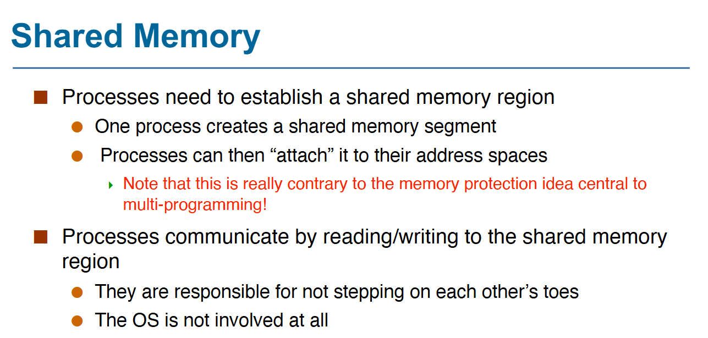

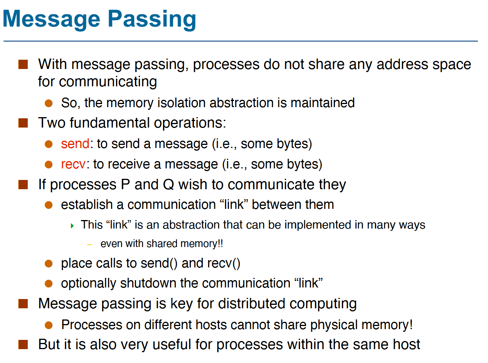

Implementation of message passing  

- Shared memory  
- Hardware bus  
- Network  
- Direct/Indirect  
- Synchronous/Asynchronous  
- Automatic/explicit buffering  
  
**Signal**  
High-level software interrupt:^C  
  
**Pipes**  
Ordinary pipes(anonymous)  
cannot be accessed from outside the process that created it.A parent process creates a pipe and uses it to communicate with a child process that it created.  

- undirectional  
- producers write to one end,consumers read from the other  
  
Named pipes  

- bidirectional  
- no parent-child relationship  
  
UNIX pipes  
- mono-directional(单向)  

```bash
ls | grep pipe
// |单向pipe 从前往后流
```

Client-Server Communication  

- Socket = ip address + port  
- RPC:client stub  
- Java RMI:RPC in Java  
  
### Threads Week13  
[Definition]Multiple execution units(执行单元) within a process
process:资源分配与保护单元  

!!! note "process is a resource allocator and protection"  

threads in a process share address space(data,heap,files and signals) & code,but not share pc,registers and stack(variables,function stack)  
  
Advantages  

- Creating a thread is cheap  
- Context-switching is cheap  
- share memory(dont need IPC)  
- having concurrent activities in the same address space  
- more responsive  
- scalability on a multi-core machine  
  
Drawbacks  

- Weak isolation(process fails if one thread fails)  

**Many-to-one model**  
multi-threading:efficient and low-overhead  
cannot take advantage of multi-core  
fails if one thread fails  
  
**One-to-One model**  
drain memory(easy to manage and cheap)  
commonly used  
  
**Many-to-Many model**  
too complex  
  
**Two-Level Model**  
One-to-One + Many-to-Many  
more complex   
  
pthreads join threads  
  
```
C code
#pragma omp parallel
主动添加并行

Java
class MyThread extend Thread{

}
```

fork()  

- duplicate 当前线程  
- duplicate 所有线程作为一个进程  

exec()  

- 替代所有线程  
  
fork() then exec()  

- only duplicate current thread(变成一个)  

Signal  
多线程异步信号发送的几种选择：  

1.发送到信号产生的线程  
2.发送到当前进程中的所有线程  
3.发送到当前进程中的某一个或某几个特定的线程  
4.发送到进程中指定接收所有信号的一个特定线程  
  
终止  
Cancellation point  
立即终止（asynchronous cancellation）  

- 如果目标线程执行到了关键部分（critical section）时可能会造成访问资源的紊乱  
  
延迟终止（deferred cancellation）  

- 允许线程周期性检查自己是否可以结束  
- should I die?should I die?should I die?  
  
process-contention-thread  
system-contention-thread(Linux)  
  
In Linux,thread is called a lightweight process(LWP)  
```C
int clone(int (*fn)(void *), void *child_stack, int flags, void *arg);
//flag指定是否share(CLONE_VM share memory space)
//a complex fork()
```
  
Linux does not distinguish PCB and TCB  
no process task_struct  
the info of process is in the first thread's task_struct  
PID is the PID of the leading thread  
5 threads in a process at most(?)  
  
user thread to kernel thread mapping  
one user thread maps to one kernel thread(actually the same thread because of same task_struct)  

- user code e.g.printf  
- user space stack  
- user space context -> pt_regs  
- kernel code e.g.write  
- kernel space stack(4pages 16KB limited)  

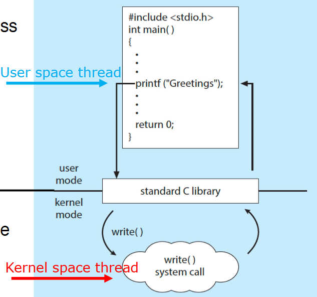  

### Sychronization Week13 - 15  
[Motivation]concurrent access to shared data may result in data inconsistency  
  
Race condition:竞态  
several processes or threads access and manipulate the same data concurrently and the outcome depends on the particular order  
e.g.Race in kernel:same pid of different processes if both call fork()  
  
`pthread_mutex_unlock(&pmutex)`  
  
[Definition]Critical Section:the text that cannot be done in parallel  
```C
while(true){
  entry section
    critical section
  exit section
    remainder section
}
```
At most one process in critical section  
ask permission in entry section  
release in exit section  
  
single-core system:prevent interrupts  
multiple-processor:prevent interrupts is not feasible  
  preemptive:allows preemption of process when running in kernel mode
  non-preemptive:runs until exits kernel mode,blocks,or voluntarily yields CPU  
  
**Solution requirements**  

- Mutual Exclusion(互斥 MS):only one process can execute in CS  
- Progress(空闲让进 不卡死):当没有线程在执行临界区代码时，必须在申请进入临界区的线程中选择一个线程，允许其执行临界区代码，保证程序执行的进展  
- Bounded waiting(有限等待):从一个进程申请进入 CS ，必须在有限的时间内获得许可，不能无限等待(prevent starvation)  
  
**Peterson's solution:solves two-threads synchronization**  

- Assume LOAD and STORE are atomic(原子性：不可打断)  
- Two processes share two variables   
  boolean flag[2]:whether a process is ready to enter CS  
  int turn:current process in the CS  

```C
Process 0:
do {
    flag[0] = true;
    turn = 1;
    while (flag[1] && turn == 1);
    // critical section
    flag[0] = false;
    // remainder section
} while (true);
Process 1:
do {
    flag[1] = true;
    turn = 0;
    while (flag[0] && turn == 0);
    // critical section
    flag[1] = false;
    // remainder section
} while (true);
```
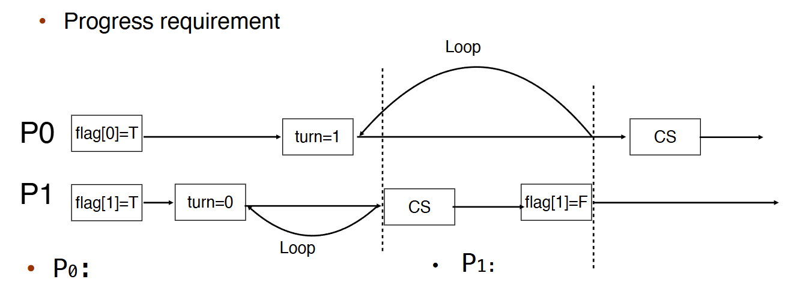  
  
Problem:  

- only avaliable for two threads  
- assume LOAD and STORE are atomic  
- Instruction reorder is not allowed(commonly happends nowadays)  

```C
flag = False;
Thread 1
  while(!flag);
  print(x);
Thread 2
  x = 100;
  flag = True

expected output:100
reorder thread 2 -> output:0
```
  
**Hardware support**  
Uniprocessors(单处理器):disable interrupts  
Problem:code execute without preemption;inefficient  
Solution  

- Memory Barriers  
- Hardware Instructions  
- Atomic Variables  
  
**Memory Barriers**  

- Strongly ordered:a memory modification of one process is immediately visible to other processors(stable but complex,lower performance)  
- Weakly ordered(high efficiency)  
  
A memory barrier is an instruction that forces any change in memory to be made visible to all the processors.  
  
```C
flag = False;
Thread 1
  while(!flag);
  memory_barrier();//Ensure the value of x is not read prior to seeing the change of flag.
  print(x);
Thread 2
  x = 100;
  memory_barrier();//Ensure that the new value of x is visible to other processors prior to the change offlag.
  flag = True
```
  
**Hardware Instructions**  
1.Test-and-set  
```C
bool test_set(bool *target)
{
  bool rv = *target;
  *target = TRUE;
  return rv;
  //set and return old value
}

example:
bool lock = FALSE;
do{
  while(test_set(&lock));//busy wait
  critical section
  lock = FALSE;
  remainder section
}while(TRUE);
```

For single-core:close interrupt before test_set and open it after  
For multi-core:lock the bus(总线)  
  
Bounded waiting  
```C
do{
  waiting[i] = true;
  while(waiting[i] && test_and_set(&lock));
  waiting[i] = false;

  critical section

  j = (i + 1) % n;
  while((j != i) && !waiting[j])
    j = (j + 1) % n;
  if(j == i)
    lock = false;
  else
    waiting[j] = false;

  remainder section
}while(true);
```
  
2.Compare-and-swap
```C
int compare_and_swap(int *value, int expected, int new_value)
{
  int temp = *value;
  if(*value == expected)
    *value = new_value;
  return temp;
}

Solution:(given by Intel x86 cmpxchg(lock the bus))
while(true)
{
  while(compare_and_swap(&lock, 0, 1) !=0);
  /* do nothing */
  /* critical section */
  lock =0;
  /* remainder section */
}
```
  
ARM64:LDXR&SDXR(load-exclusive&store-exclusive)  
  
**Atomic Variables**  
```C
void increment(atomic int *v) {
    int temp;
    do {
        temp = *v;
    } while (temp != compare_and_swap(v, temp, temp + 1));
}
```
  
**Mutex Locks互斥锁 Semaphore**  
```C
while(true){
  acquire lock
  critical section
  release lock
  remainder section
}

//Definition
//atomically implemented
acquire(){
  while(compare_and_swap(&locked, false, true));//busy waiting
}

release(){
  lock = false;
}
```  
busy waiting:忙等待 spinlock
T0 acquires lock -> INTERRUPT->T1 runs, spin, spin spin... -> INTERRUPT->T0 runs -> INTERRUPT->T1 runs, spin, spin spin...INTERRUPT-> T0 runs, release locks ->INTERRUPT->T1 runs, enters CS  
T1 busy waits all its CPU time until T0 releases lock  
T0 holds the lock,but does not get CPU  
  
Reduce busy waiting - just yield(moving from running to sleeping)  
```C
void init() {
  flag = 0;
}
void lock() {
  while(test_set(&flag, 1) == 1) 
  yield();// give up the CPU
}
void unlock() {flag = 0;}

apply waiting-queue(semaphore(by Dijkstra)(lock-queue))
wait(S){
  while(S <= 0) ; //busy wait
  S --;
}
signal(S){
  S ++;
}
```

semaphore  

- binary semaphore  
- counting semaphore  
  
```C
typedef struct{
  int value;//空闲资源数
  struct list_head *waiting_queue;
}semaphore;

wait(semaphore *S){
  S -> value --;//MS is needed
  while(S -> value < 0) {
    add this process to S -> list;
    block();
  }
}
signal(semaphore *S){
  S -> value ++;
  if(S -> value <= 0){
    remove a proc.P from S->list;
    wakeup(P);
  }
}
  
//atomic wait and signal  
```

No busy waiting on critical section:they are sleeping for waiting ——save CPU time  

!!! danger "final exam"  

choose between Mutex(spinlock) & semaphore:**context switch** time overhead  

Mutex/spinlock  

- no blocking  
- waste CPU on looping  
- good for short CS  
  
Semaphore  

- no looping  
- context switch is time-consuming  
- good for long CS  
  
Question:How to make wait and signal be atomic?  
use spinlock  

```C
Semaphore sem;
do {
  wait(sem);//busy waiting
  critical section//no busy waiting
  signal(sem);//busy waiting
  remainder section
}while(TRUE);

//busy waiting is much shorter
```

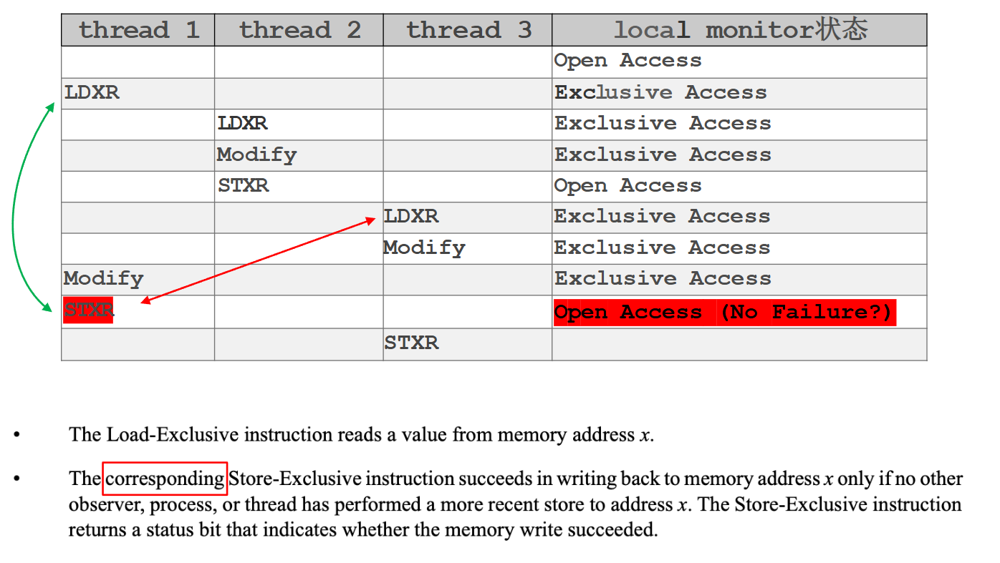  
LOAD in thread 3 will prohibit STORE in thread 1,causing thread 1 to wait(回滚)  

!!! danger "final exam"  
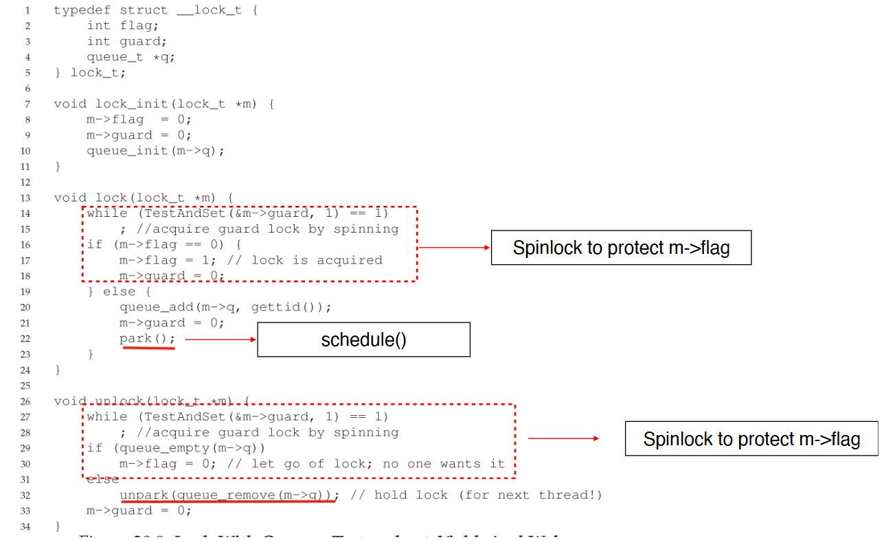  
Question1:18和21行的作用：保护mutex(14-15行spinlock)  
Question2:21和22行能否交换：不能，否则会拿着锁sleep导致其他线程busy waiting  
Question3:一个线程拿着锁sleep，其他线程会停在什么地方：14行，因而是busy waiting而不是sleep(14到18行也是个critical section)  
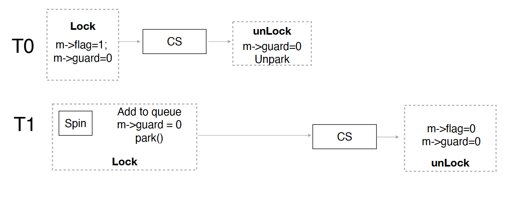  
**Deadlock and Starvation**  
Deadlock:two or more processes are waiting indefinitely for an event that can be caused by only one of the waiting processes  
```C
P0:
wait(S);
//time interrupt here
wait(Q);

P1:
wait(Q);
//time interrupt
wait(S);
```
Starvation:indefinite blocking(doesn't necessarily mean deadlock,other threads can operate correctly)  
  
Priority inversion:a higher priority process is indirectly preempted by a lower priority task  
e.g.three processes,P<sub>L</sub>,P<sub>M</sub>,P<sub>H</sub>  
P<sub>L</sub> holds a lock that was requested by P<sub>H</sub>,P<sub>H</sub> is blocked  
P<sub>M</sub> ready and preempted P<sub>L</sub>  
P<sub>M</sub> and P<sub>H</sub> inverted  
  
Solution:priority inheritance  
temporily assign the highest priority of P<sub>H</sub> to the process holding the block (P<sub>L</sub>)  
  
实现：比较新进入的进程的priority与持锁进程的priority  
  
In Linux,down() = wait,up() = signal  
```C
void down(struct semaphore *sem)
{
  unsigned long flags;

  raw_spin_lock_irqsave(&sem->lock,flags);
  if(likely(sem->count > 0))
    sem->count --;
  else
    __down(sem);
  raw_spin_unlock_irqrestore(&sem->lock,flags);
}
```
__down(sem) -> __down_common() -> ___down_common() -> unlock,schedule_timeout  
no sleep while holding spinlock  
  
POSIX Named Semaphores:another process can access the semaphore by referring to its name  
  
**Condition Variables**(仅作了解)  
```C
while(x != 10) sleep(5);
```
while checking is not atomic and cannot support multi-threading
```
wait(condition,lock)
signal(condition,lock)
broadcast(condition,lock):wake up all waiting threads
```
  
**Classical synchronization problems**  
!!! danger "必考(考研题)"

- bounded-buffer problem(consumer-producer problem)

```C
//Definition
n buffer
semaphore mutex = 1;
int full_slots = 0,empty_slots = N;
The producer process:
do{
//produce an item
  ...
  wait(empty_slots);
  wait(mutex);
    //调换顺序发生deadlock
  //add the item to the buffer
  ...
  signal(mutex);
  signal(full_slots);
}while(TRUE);

The consumer process:
do{
  wait(full_slots);
    //wake up by signal(full_slots) but not operate immediately until scheduling
    //move consumer from full_slots_waiting_queue -> ready_queue 
  wait(mutex);
    //timer interrupt here:producer stops at wait(mutex)
  //remove an item from the buffer
  ...
  signal(mutex);
  signal(empty_slots)
  //consume the item
  ...
}while(TRUE);

start from empty_slots,
```

- readers-writers problem  
  allow multiple readers to read at the same time  
  only one single writer can access the shared time  
  reader and writer cannot coexist  

```C
//Definition
semaphore mutex = 1;(protect readcount)
semaphore write = 1;
int readcount = 0;
The writer process:
do{
  wait(write);
  //write the shared data
  ...
  signal(write)
}while(TRUE);

The reader process:
do{
  wait(mutex);
  readcount ++;
  if(readcount == 1)
    wait(write);
  //else no writer exist,no need to wait because readers can coexist
  signal(mutex); //why signal here
  //reading data
  ...
  wait(mutex);
  readcount --;
  if(readcount == 0)
    signal(write);
  signal(mutex);
}while(TRUE);
```
Reader first  
  continuous readers come causes writer to starve  
Writer first  

- *dining-philosophers problem  
multi-resource synchronization  
semaphore chopstick[5] initialized to 1  

```C
Philosopher i:
do{
  wait(chopstick[i]);
  wait(chopstick[(i+1)%5]);
  eat
  signal(chopstick[i]);
  signal(chopstick[(i+1)%5]);
  thick
}
causing deadlock
```
do nothing -> mutex for each chopstick -> asymmetrical(odd pickup left first,even pickup right first)  
  
### Deadlocks Week15  
Compare to starvation:deadlock means **all** the threads cannot process(starvation:**some**)  
[Definition]a set of blocked processes each holding a resource and waiting to acquire a resource held by another process in the set  
  
Four conditions of deadlock occurence  

- mutual exclusion:a resource cannot be shared  
- hold and wait  
- no preemption  
- circular wait  
  
**Resource-Allocation Graph**  
nodes:  
P = {P<sub>1</sub>,...,P<sub>n</sub>} set of processes  
R = {R<sub>1</sub>,...,R<sub>m</sub>} set of resource type  
edges:  
request edge P<sub>i</sub> -> R<sub>j</sub>  
assignment edge R<sub>j</sub> -> P<sub>i</sub>  
  
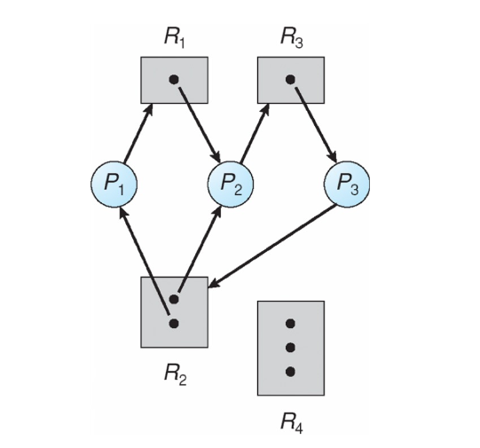  
an example of deadlock , no process can move any longer  

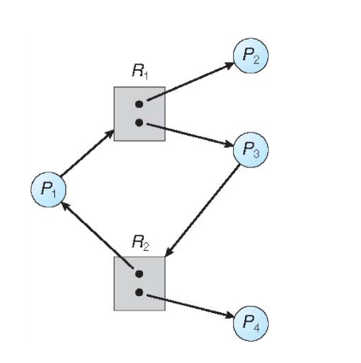  
no deadlock here  

- no cycles -> no deadlock  
- only one instance per resource type -> deadlock  
- several instances per resource type -> possiblility of deadlock  
  
**Handle deadlock**  

- Prevention:break one of the four conditions  
- Avoidance:calculate the safe states  
- Deadlock detection and recovery  
  
#### Prevention  

- mutual exclusion  
  cannot prevent if resources are non-sharable  
- hold and wait  
  Require process to request **all** its resources before it begins execution -> starvation  
- no preemption  
  Preempted resources are added to the list of resources it waits for -> starvation  
- circular wait  
  order the resources  
  require each process to request resources in increasing order  
  not avaliable for dynamic requirements and dynamic acquired lock  
  
#### Avoidance  
Each process declares a max number of resources it may need(not practical)  
Deadlock-avoidance algorithm ensure there can never be a circular-wait condition  
  
[Definition]Safe state:processes are guaranteed to be completed without a deadlock  
A safe state ensures no deadlock  
Safe sequence  
avaliable resources = resources avaliable + resources released by the finished processes  
  
Resources:12  
Avaliable is 3  
<table>
<tr>
<th></th><th>Max need</th><th>Current have</th><th>Extra need</th>
</tr>
<tr>
<th>P0</th><th>10</th><th>5</th><th>5</th>
</tr>
<tr>
<th>P1</th><th>4</th><th>2</th><th>2</th>
</tr>
<tr>
<th>P2</th><th>9</th><th>2</th><th>7</th>
</tr>
</table> 
Safe sequence:P1 P0 P2    

Single instance -> resource-allocation  

- claim edge:converts to request edge when a process requests a resource
  The request can be granted if converting the request edge to an assignment edge does not result in the formation of a cycle

Multiple instance -> banker's algorithm  
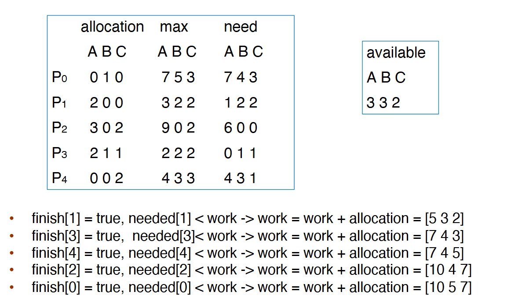  

#### Deadlock detection  
**Single instance**  
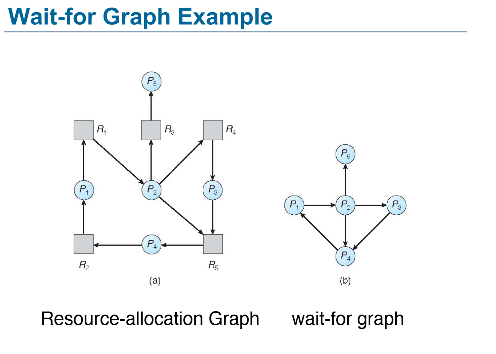
  
**Multiple instance**  
Applying Banker's algorithm while operation
  
#### Deadlock recovery  
**Option 1**  
kill one process at a time until the deadlock cycle is eliminated
kill/abort order:  

- priority  
- how long has computed  
- resources the process has used  
- resources needed  
- how many processes will need to be terminated  
- interactive or batch  
  
**Option 2**  
Resource preemption  

- select a victim  
- rollback  
- starvation  
  
## Final Review Week16  
  
### 硬件  
  
#### Instruction set principles  
internal storage(e.g.C = A + B)  

- stack  
  Push A  
  Push B  
  Add  
  Pop C  
- accumulator  
  Load A  
  Add B  
  Store C  
- register-memory  
  Load R1,A  
  Add R3,R1,B  
  Store R3,C  
- Load-Store  
  Load R1,A  
  Load R2,B  
  Add R3,R1,R2  
  Store R3,C  
  
#### RISC-V ISA  
Address mode  
operand  
memory operand:byte addressed,words ...  
六种指令类型R I S B J U  
  
#### Pipelining  
[Definition]stage/segment depth(number of segments)  
  
[Charactistic]  
Bottleneck:longest section -> 设定时钟周期的长度  
buffer-register  
pass-time  
empty-time  
  
[Classes]  
Single/Multi function:是否进行多种运算  
  
Static/Dynamic (Multi function):单一时间是否只能只能执行一个功能  
  
Linear/Nonlinear:是否有回环feedback loop,nonlinear一定有调度  
  
[Implementation]  
  
#### Performance evaluation  
Increase the instruction throughput  
  
Throughput(TP)(注意单位)  
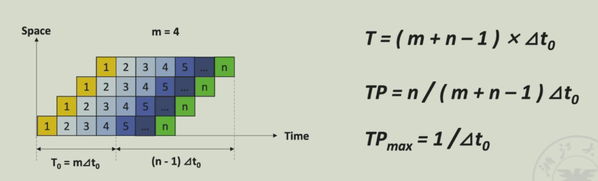  
  
Speedup(Sp):与对应单周期CPU做对比  
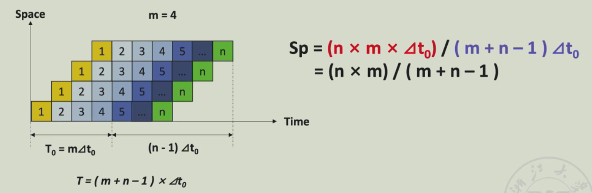  
Sp = m(n >> m) 理想加速比等于切割段数  
  
Efficiency(η)(注意百分号)  
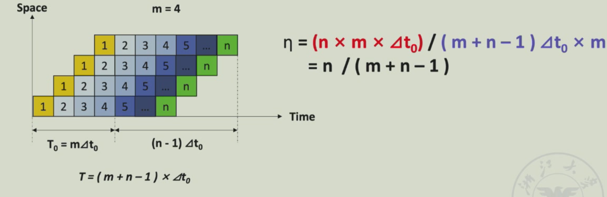  
η -> 1(n -> ∞)  
  
#### DataPath/Graphically Represent/Control  
  
#### Hazard  
**Structural Hazard**  
在同一时钟周期内竞争性访问同一物理资源  
Solution1:stall(nop)  
Solution2:Add more hardware  
  
**Data Hazard**  
  
!!! danger "重点考察"  
数据依赖  
Solution:Forwarding  
  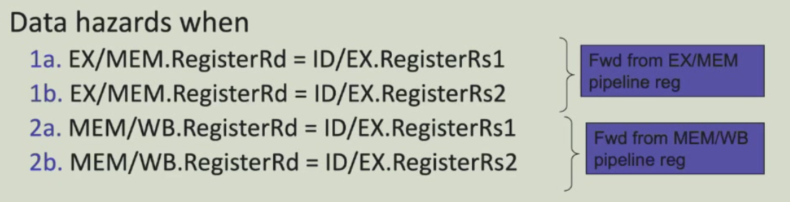
  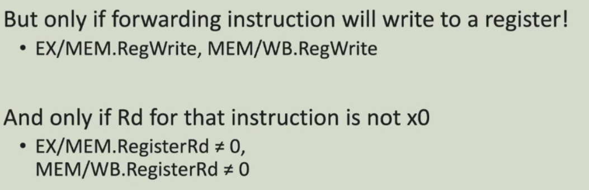
  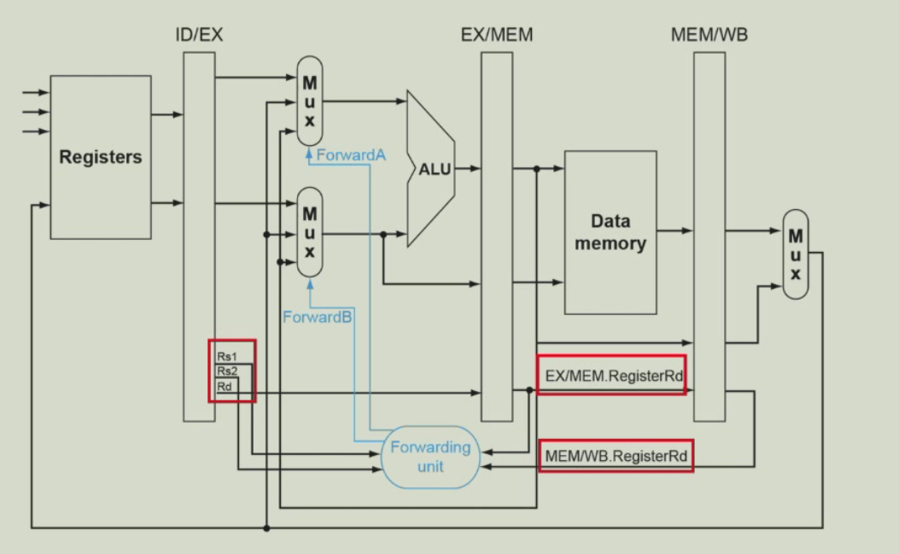
Double data hazard  
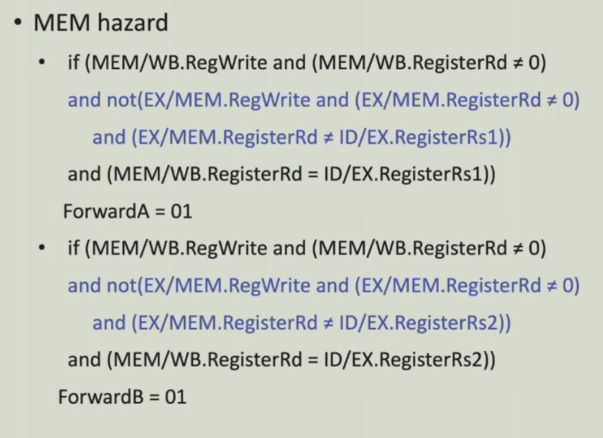  
Load-Use:need to stall for one cycle despite forwarding  
force control values in ID_EX to 0  
prevent update of PC and IF_ID  
  
#### Schedule of nonlinear pipeline  
Initial conflict vector -> conflict vector -> state transition graph -> circular queue -> shortest average interval  
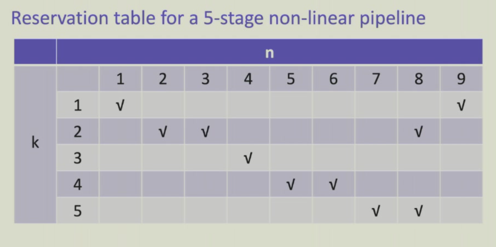  
禁止集F = {1,5,6,8}  
初始冲突向量C = 10110001  
取0位，并集更新冲突向量  
调度表与状态转移图  
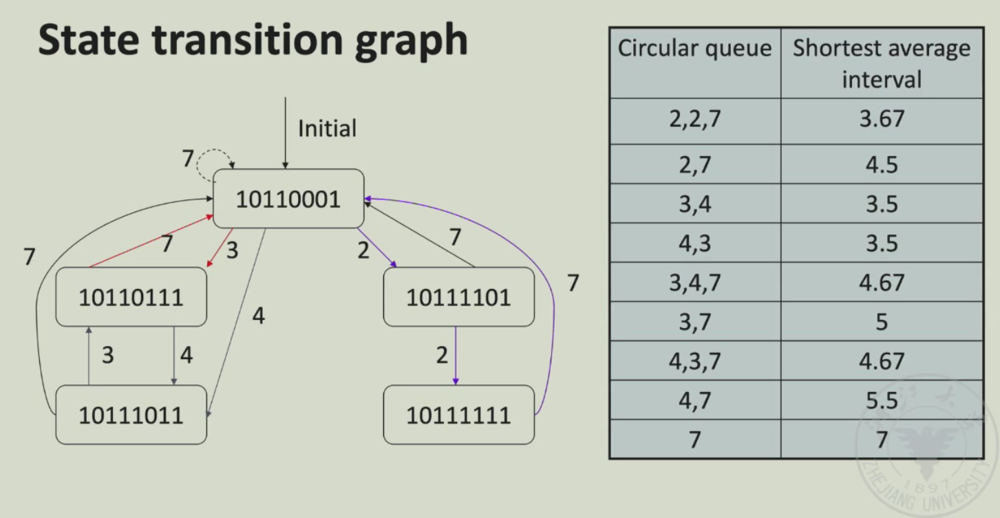  
寻找回环（不一定回到初始冲突向量）  
计算shortest average interval  
  
#### Multiple Issue  
同一个时钟周期内发射多条指令increase Instruction-Level Parallelism(ILP)
evaluation:IPC  
Static(Compiler)/Dynamic(CPU,编译器仍参与,CPU辅助兜底)  
调度类型  
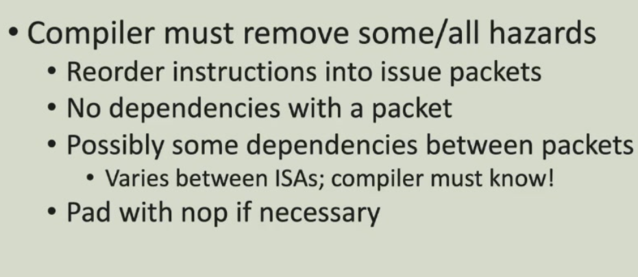
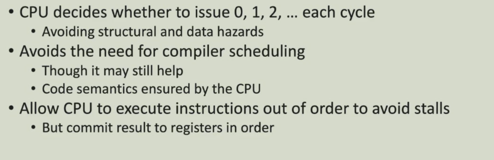  
调度方式:Superscalar(动态) VLIW(静态固定数量) Superpipeline(子时钟)
注意Superscalar VLIW的区别  
VLIW对某一指令同时取值译码，只在EX阶段分开  
  
  
#### Exceptions and interrupts  
Exception:arise from CPU  
Interrupt:from external I/O  
  
Exception -> control hazard/mispredicted branch  
  
#### Software-Hardware Interface  
软硬协同  
Solution for hazards  
Code reordering  
  
Application software  
System software - OS  
Hardware  
  
### 软件  
  
#### Computer architecture  
  
Von-Neumann  
Data stored in memory:only bits,no data type  
  
Why Memory Hierarchy work  
Temporal/Spatial locality  
  
#### Introduction  
[Definition]resource abstractor and resource allocator  
  
How an OS start?  
first program:bootloader,then locates and loads the OS kernel into memory  
  
wait for event:syscall interrupt exception  
  
Interrupt:I/O timer  
  
OS operates on privileged instructions  
A subset of instructions of every CPU is restricted in usage: only the OS can execute them  
  
User mode & kernel mode  
OS(狭义):kernel(Linux)  
OS(广义)：user + kernel(Android)  
Browser is not a part of an OS  
  
RISCV modes:三个半  
  
void ProcessEvent(event)  
  
##### Syscall  
[Definition]a special kind of trap when a user program need to do something privileged(interface of user and kernel mode)  
syscall is not a privileged instruction  
  
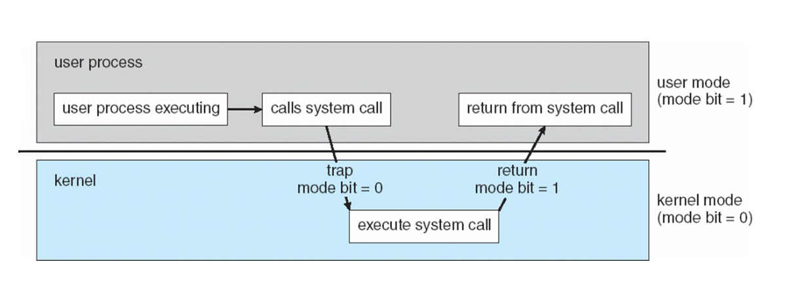  
context_switch when mode change  
pt_regs in per-thread(one-to-one) kernelstack  
kernelstack：PCB & thread-info  
  
5 OS services  
  
#### Structure  
##### Syscall  
syscall number:syscall table index  
kernel_entry saves the context  
kernel_exit restores   
  
##### Linkers and loaders  
static linking  

- big file(x100 of dynamic linking)  
- independent of the environment(less syscalls)  
- no .interp section(loader-path)  
- no memory mapping segment(dynamic libraries e.g./libc)  
  
dynamic linking  

- small file  
- need loader resolve library calls  
- can't execute without proper loader  
    
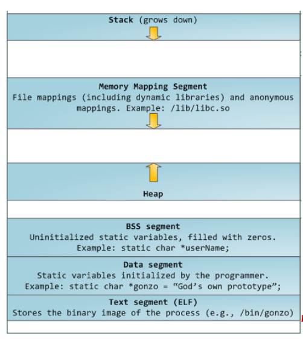  
static variable -> .data(int a=5;)初始化  
static const -> .rodata(read only)  
int b; -> .bss未初始化 filled with 0  
.text executable  
*stack:per thread(threads have different return addr)  
*heap:per process  
  
Who setups ELF file mapping  
Kernel  
  exec syscall   
    load_elf_binary  
  
Who setups stack and heap  
Kernel  
  exec syscall  
  
Who setups libraries  
Loader(user process)  
  ld-xxx  
  
Linux:monolithic  
  
#### Processes  
[Definition]a unit of resource allocation and protection  
  
PCB(process control block):register content,pid,pc,state,scheduling info(priority),...  
  
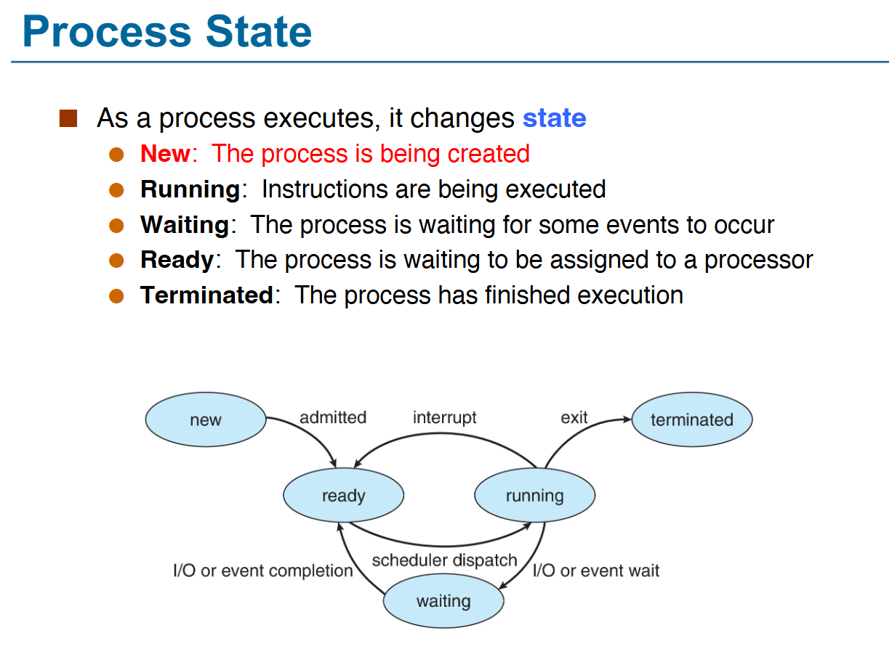  
  
new:fork/execve  
数进程数量  
Why fork() return two values?  
it copys two user space context(pt_regs)  
child改变值不影响parent  
  
exec会抹去当前进程的内容（无论是子进程还是父进程）  
  
terminate:exit wait waitpid SIGNAL -> zombie orphan  
PCB must be deallocated by its parent  
  
ready queue & waiting queues(wait对象的数量)  
  
context switch  
  
*1.switch stack(sp)  
*2.switch pc(ret lr)  
  
must happen in kernel mode:change pc(CPU)  
  
When and where are the kernel context been saved?  

- when:cpu_switch_to  
- where:cpu_context in PCB  
    
When and where are the user context been saved?(before (kernel)context switch)  
context switch in kernel mode  

- when:kernel_entry  
- pt(process trees)_regs in per_thread kernel stack  
  
#### Scheduling  
FCFS,SJF(preemptive & nonpreemptive不实用),RR,priority  
  
Gantt chart  
average waiting time/turnaround time  
  
!!! danger "抢占情况下如何计算average waiting time 大题"
  
#### IPC  
shared memory   
message passing  
各自优缺点  
  
#### Threads  
[Definition]Multiple execution units(执行单元) within a process  
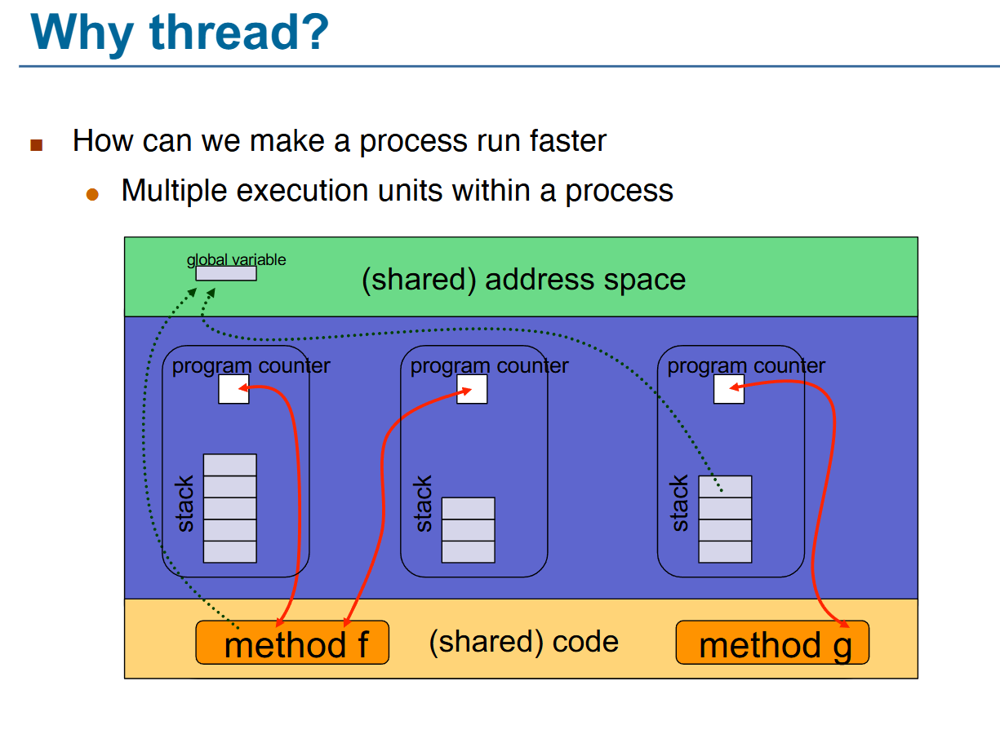  
threads in a process share address space(data,heap,files and signals) & code,but not share pc,registers and stack(variables,function stack)  
  
Advantages  

- Creating a thread is cheap  
- Context-switching is cheap  
- share memory(dont need IPC)  
- having concurrent activities in the same address space  
- more responsive  
- scalability on a multi-core machine  
  
Drawbacks  

- Weak isolation(process fails if one thread fails)  
  
One-to-one model  
large overhead  
  
fork,execve,SIGNAL,cancellation  
multiprocess:pid = leader thread pid  
  
#### Sychronization  
**Solution requirements**  

- Mutual Exclusion(互斥 MS):only one process can execute in CS  
- Progress(空闲让进 不卡死):当没有线程在执行临界区代码时，必须在申请进入临界区的线程中选择一个线程，允许其执行临界区代码，保证程序执行的进展  
- Bounded waiting(有限等待):从一个进程做出进入 CS 的请求，直到该请求允许为止，其他进程允许进入其 CS 的次数有上限(prevent starvation)  
  
Peterson's solution  
  
**Hardware support**  
Uniprocessors(单处理器):disable interrupts  
Problem:code execute without preemption;inefficient  
Solution  

- *Memory Barriers  
- Hardware Instructions(!!!)  
- Atomic Variables  
  
**Hardware Instructions**  
1.Test-and-set  
2.Compare-and-swap (x86 lock the bus)  
  
##### Mutex lock/spinlock semaphore  
busy waiting wastes CPU  
  
!!! danger "多少进程跑多少进程sleep"

Mutex/spinlock  

- no blocking  
- waste CPU on looping  
- good for short CS  
    
Semaphore  

- no looping  
- context switch is time-consuming  
- good for long CS  
    
  
Question1:18和21行的作用：保护mutex(14-15行spinlock)  
Question2:21和22行能否交换：不能，否则会拿着锁sleep导致其他线程busy waiting  
Question3:一个线程拿着锁sleep，其他线程会停在什么地方：14行，因而是busy waiting而不是sleep(14到18行也是个critical section)  
  
Priority inversion  
  
##### synchronization examples  
考研题练习  
  
#### Deadlock  
Four conditions of deadlock occurence  

- mutual exclusion:a resource cannot be shared  
- hold and wait  
- no preemption  
- circular wait  
  
prevention:打破条件  
avoidance:计算safe state/resource allocation graph/Banker's algorithm  
detection:find circle/Banker's  
recovery:kill/preemption  