# 计算机视觉导论(Introdution to Computer Vision)  
### Lecture 1:Introduction  
## Basics
### Review of Linear Algebra
通过齐次坐标（增加一维）表示平移变换  
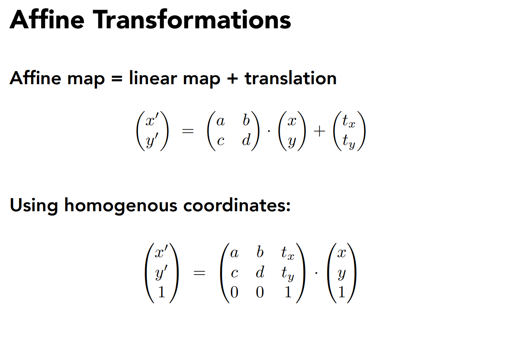  
### Lecture 2:Image Formation
#### Camera and lens
Idea1:put a piece of film in front of an object -> not one-to-one  
Idea2:Aperture(光圈，小孔) -> pinhole camera  
aperture size:small aperture -> less light,diffraction effects(衍射)  
Idea3:Lens  
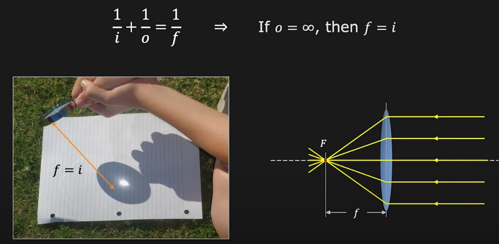  
magnification:$m=\frac{h_i}{h_o}$ -> changing focal length  
Field of View(FOV):focal length -> angle of view,sensor size    
  
F-number:$N=\frac{f}{D}$,D:lens diameter,一般给出可调范围  
lens-defocus失焦，脱焦:形成blur circle模糊圆  
  
focusing:移动光圈  
理论上只有一个平面是精准对焦的，但实际只需要blur size不太大也可以实现充分对焦  
Depth of Field(DoF)井深:range of object distances that the image is sufficiently focused(blur circle size b < pixel像素 size)  
DoF与f呈反比，与物距o呈正比，与F数呈正比  
背景虚化（人像）：大光圈，长焦距，贴近人，远离背景  
#### Geometric image formation
$$
P=\begin{bmatrix}
x\\ y\\ z
\end{bmatrix}
\rightarrow
p=\begin{bmatrix}
u \\ v
\end{bmatrix}
=\begin{bmatrix}
\frac{fx}{z} \\ \frac{fy}{z}
\end{bmatrix}
$$
not a linear transformation  
Perspective Projection in Homogeneous coordinates透视投影  
齐次变换：引入一个新的坐标，用4维坐标表示3维空间中的点  
$$
\begin{bmatrix}
f & 0 & 0& 0 \\ 0 & f& 0&0\\0&0&1&0
\end{bmatrix}
\begin{bmatrix}
x\\y\\z\\1
\end{bmatrix}=
\begin{bmatrix}
fx\\fy\\z
\end{bmatrix}
\widetilde{=}\begin{bmatrix}
\frac{fx}{z} \\ \frac{fy}{z} \\1
\end{bmatrix}
$$
**Visualization**  
  
abandon the depth info,the corresponding possible shape number is infinite  
[Properties] straight lines are still straight;length,angles are lost  
##### vanishing point
平行线投影到像平面产生的交点  
  
[Properties] 任何两条平行线交于同一个vanishing point;camera centre C与vanishing point v的连线平行于地面上的平行线;v可能在画面外也可能无穷远  
不同的平行线会交于不同的vanishing point,vanishing point的连线称为vanishing line  
vanishing line的角度表示平面相对于相机的朝向  
##### perspective distortion
透视投影本身造成的畸变    
converging verticals  
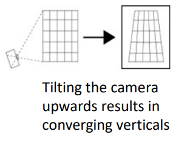  
*solution:view camera轴移相机  
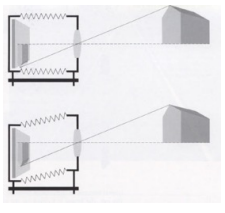  
##### radial distortion
由镜头造成的畸变  
  
$r^2=x_n'^2+y_n'^2 \\ x_d'=x'_n(1+\kappa_1r^2+\kappa_2r^4) \\ y_d'=y'_n(1+\kappa_1r^2+\kappa_2r^4)$  
correcting radial distortion by solving $\kappa$  
##### *orthographic projection
特殊的透视投影  
$$
\begin{bmatrix}
1 & 0 & 0& 0 \\ 0 & 1& 0&0\\0&0&0&1
\end{bmatrix}
\begin{bmatrix}
x\\y\\z\\1
\end{bmatrix}=\begin{bmatrix}
x\\y\\1
\end{bmatrix}\Rightarrow (x,y) 
$$
#### Photometric image formation
shutter：快门  
  
shutter speed controls exposure time  
$pixel\ value = \int_{exposure\ time} intensity$  
长快门，小光圈（避免过曝）  
**rolling shutter effect**滚动快门：扫描光棒逐行记录->顶部与底部错位->提高快门速度，稳定相机  
##### color sensoring
color spaces:RGB,取值0-255（8比特）  
HSV(Hue色调,Saturation饱和度,Value强度)  
  
##### Bayer filter 
滤光片阵列记录颜色:50%绿滤光片，25%红，25%蓝  
##### *shading
反射光由材质决定，Material=BRDF  
### Lecture 3:Image Processing 
#### Image processing basics
##### increase contrast
  
##### convolution
$(f*g)(x)=\int_{-\infty}^{\infty}f(y)g(x-y)dy$  
f:filter,g:input  
Padding:zero values,edge values,symmetric  
blur:均值滤波  
Gaussian blur:$f(i,j)=\frac{1}{2\pi\sigma^2}e^{-\frac{i^2+j^2}{2\sigma^2}}$  
  
sharpen image:  
$$
\begin{bmatrix}
0 & -1 & 0 \\ -1 & 5& -1 \\0&-1&0
\end{bmatrix}
$$
high frequencies in image I=I-blur(I)  
sharpened image = I + (I-blur(I))  
gradient detection filter  
$$
\begin{bmatrix}
-1 & 0 & 1 \\ -2 & 0 & 2 \\-1&0&1
\end{bmatrix}
$$
exact vertical edges：检测亮度变化大的边缘  
*Bilateral filter去噪/磨皮
G():gaussian filter,f():influence of support region -> Gxf:filter weights of pixel  
  
#### Image sampling
change image size/resolution  
pixel dimension,document size  
resolution = pixel dimension/document size  
reducing image size -> down-sampling -> Aliasing走样：Moire pattern/wagon wheel illusion  
**reason:signals are changing too fast but sampled too slow**  
for cosine signal $cos2\pi fx$,high frequency needs more samples  
##### *Fourier Transformation
represent a function as a weighted sum of sines and cosines  
频谱:the histogram of energy-frequency  
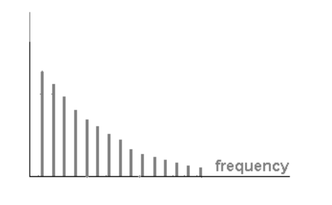  
[Convolution Theorem] Convolution on spatial domain is equivalent to multiplication on frequency domain,and multiplication on spatial domain is equivalent to convolution on frequency domain  
窗口越宽，对应低频频域越窄  
sampling the signal = multiply the signal by a Dirac comb function  
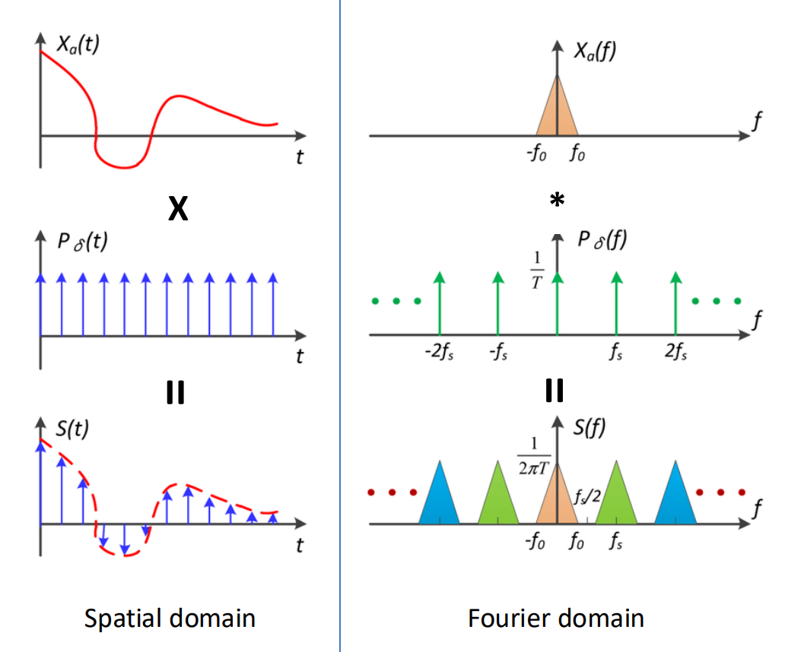  
aliasing = mixed frequency content(sparse sampling)  
#### Reduce Aliasing
[Option 1] Increase sampling rate  
sampling rate $> 2f_0$(Nyquist-Shannon Theorem)  
[Option 2] Anti-Aliasing:filtering out high freq before sampling  
convolve the image with low-pass filters(like Gaussian)  
then sample it with a Nyquist rate  
#### Image Magnification
inverse of down-sampling using interpolation(插值)  
nearest neighbour:not continuous,not smooth  
linear:continuous but not smooth  
cubic(三次多项式）（每段是不同的函数）  
bilinear  
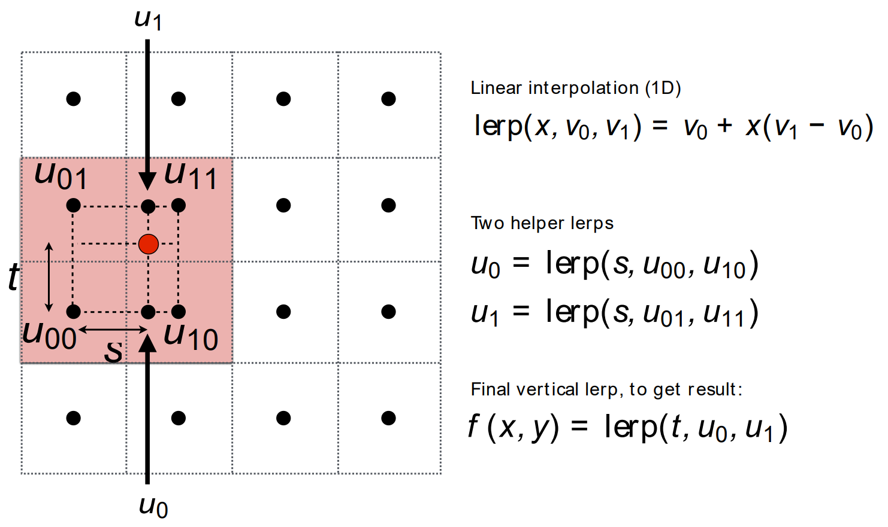  
bicubic  
super-resolution by applying neural network  
##### change aspect ratio长宽比
Seam Carving(content-aware resizing)  
remove unimportant pixels by finding edges(compute gradient)  
applying dynamic programming  
enlarge:find seams then interpolation pixels  
### Lecture 4:Model fitting and optimization  
#### Optimization
Image deblurring:$min_X||Y-F*X||^2$,Y:Blurred image,F:Blur kernel,X:Sharp image  
#### Numerical Methods
Gradient descent  
Newton method  
Gauss-Newton method(using the gradient of the residue to estimate the Hessian)  
Levenberg-Marquardt(Regularization $\lambda I$)  
(see Optimization)  
#### Robust Estimation
handling outliers by using robust loss functions to replace MSE  
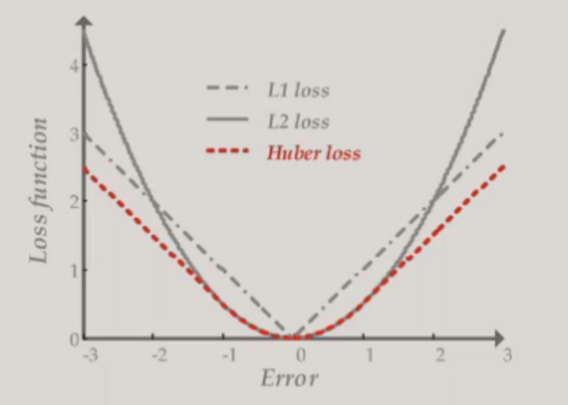  
RANSAC:Random Sample Concensus  
key idea:distribution of inliers is similar while outliers differ a lot  
use data point pairs to vote  
randomly choose 2 points and draw a line,find the line with most votes(points near it)  
  
"fine-tune" the line by using the points voting it  
RANSAC may fail(very slow) in high dimension  
overfitting & underfitting  
ill-posed problem:nonunique solution to an optimization problem $min_x ||Ax-b||^2$(when $\# equations < \# variables$)  
This means the hypothetical model is too complex(having too many parameters)  
The number of parameters needed is difficult to determine beforehand  
[Solution] LASSO:regularization(add constraints)  
L2 regularization:$min_x ||Ax-b||_2^2,s.t.||x||_2\le 1$  
L1 regularization:$min_x ||Ax-b||_2^2,s.t.||x||_1\le 1$  
make $x$ sparse(many parameters = 0)  

## Reconstruction
### Lecture 5:Feature matching and motion estimation  
#### Image matching
[Definition] feature matching:point-to-point correspondences between 2 images  
Application:Image stitching拼接,object recognition,3D reconstruction  
1.detection:find interest points/feature points  
2.description:extract vector feature surrounding each interest point  
3.matching:determine correspondences  
##### Detection
main target:uniqueness  
consider a small window of pixels,we say a point is unique,if we slightly move the window toward all the directions and always get a different window   
measure uniqueness:look at the distribution of gradients  
Principal component analysis:  
1st principal component:highest variance  
2nd principal component:highest variance orthogonal to 1st component  
###### corner detection  
1.compute the convariance matrix at each point  
$H=\sum_{(u,v)}w(u,v)\begin{bmatrix}I_x^2 & I_xI_y \\ I_xI_y & I_y^2\end{bmatrix},I_x=\frac{\partial f}{\partial x},I_y=\frac{\partial f}{\partial y},w:Gaussian\ weights$  
2.compute eigenvalues  
$H=\begin{bmatrix}a & b \\ c & d\end{bmatrix},\lambda_{\pm}=\frac{1}{2}(a+d\pm\sqrt{4bc+(a-d)^2})$  
3.classify points  
$\lambda_1,\lambda_2 small \rightarrow flat$  
$\lambda_1 >>/<<\lambda_2 \rightarrow edge$  
$\lambda_1,\lambda_2 large \rightarrow corner$  
To avoid setting threshold,using Harris operator  
$f=\frac{\lambda_1\lambda_2}{\lambda_1+\lambda_2}=\frac{det(H)}{trace(H)}$,f is called corner response  
nonmaximum suppression:find local maxima of response function  
[Problem] Is Harris detector repeatable?(invariance to image transformation)  
photometric:intensity change  
$I'=aI+b,f'=af$,partially invariant（对亮度偏移不变，对亮度缩放改变）  
geometric:  
translation:invariant  
rotation:variance doesn't change,eigenvalues remains the same,invariant  
scale缩放:variant,solve by finding the correct scale  
[Problem] How to find the correct scale?  
try different window size on a same point and we get different $f$  
$f$ has a maxima,then the relevant size of window is called 角点的尺度  
Implementation:we fix the window size and scale the original image(image pyramid)  
###### blob(斑点) detection  
the centre of a blob is a good feature,but it is not a corner  
Using a blob as a convolution kernel  
Laplacian of Gaussian(LoG) filter:  
To avoid the sensitivity to noise of the Laplacian,we usually first convolve $f$ with $g$  
$\nabla^2(f * g)=f * \nabla^2 g$,where $g$ is 2D Gaussian function  
also use image pyramid for scale selection  
An easier implementation:Difference-of-Gaussian(DoG)  
$\nabla^2G_{\sigma}\approx G_{\sigma_1}-G_{\sigma_2}$  
##### Descriptor
[Problem] How to match the interest points?  
extract a descriptor for each point and find similar descriptors between 2 images  
Scale Invariant Feature Transform(SIFT)  
histogram of oriented gradients  
  
SIFT is not invariant to rotation but we can solve it by orientation normalization(start from the most gradients' direction)  
SIFT is **not** invariant to scale,but we can combine it with the window size chosen in detection  
##### matching
feature distance:  
L2 distance:$\|f_1-f_2\|$  
[Problem] incorrect matches because of repetition(ambiguity)  
ratio score(ratio-test)$=\|f_1-f_2\|/\|f_1-f_2'\|$  
$f_2$:best match of $f_1$,$f_2'$:second best match of $f_1$,large ratio means ambiguous matches  
mutual nearest neighbor:$f_2$ is the nearest neighbor of $f_1$ in $I_2$ and $f_1$ is the nearest neighbor of $f_2$ in $I_1$  
###### *deep-learning based matching
#### Motion Estimation
Feature tracking:track interest points over multiple frames(sparse)  
Optical flow:recover image motion at each pixel(dense)  
[Solution] Lucas-Kanade method  
[Assumptions]  
1.small motion  
2.brightness consistency:$I(x,y,t)=I(x+u,y+v,t+1)$  
Taylor expansion:$I(x+u,y+v,t+1)=I(x,y,t)+I_x\cdot u+I_y\cdot v+I_t\Rightarrow I_x\cdot u+I_y\cdot v+I_t=0\Rightarrow\nabla I\cdot[u\ v]^T+I_t=0$,$I_x,I_y$:image derivative,$I_t$:difference over frames    
3.spatial coherence:points move like their neighbors  
Assume we use a window of $5*5$,then
$$
\begin{bmatrix}I_x(p_1) & I_y(p_1) \\I_x(p_2) & I_y(p_2)\\I_x(p_{25}) & I_y(p_{25})\end{bmatrix}\begin{bmatrix}u\\v\end{bmatrix}=-\begin{bmatrix}I_t(p_1)\\I_t(p_2)\\I_t(p_{25})\end{bmatrix}
$$
$$
A_{25*2}\cdot d_{2*1}=b_{25*1}
$$
Convert to an optimization problem:$min_d\|Ad-b\|^2$  
close solution:$(A^TA)d=A^Tb$  
unique solution if and only if $A^TA$ is invertible(eigenvalues are not too small)  
aperture problem:the component of the motion parallel to the edge cannot be measured  
[Problem] not small enough motion  
[Solution] reduce the resolution 
Coarse-to-fine optical flow estimation using pyramid and run L-K iteratively  
  
flow quality evaluation using color encoding of flow vectors  

### Lecture 6:Image alignment and stitching  
#### Image Warping
[Definition] image filtering:change intensity of image,image warping:change shape of image  
parametric(global) warping:$p'=T(p)$,e.g.translation,rotation,aspect  
recall:homogenous coordinates(Affine,仿射变换):  
$\begin{pmatrix}x'\\ y' \\1\end{pmatrix}=\begin{pmatrix}a & b& t_x\\ c & d & t_y  \\0 & 0 &1\end{pmatrix}\cdot \begin{pmatrix}x\\ y \\1\end{pmatrix}$  
Projective transformation(homography,单应变换):
$\begin{pmatrix}x_i'\\ y_i' \\1\end{pmatrix}\widetilde{=}\begin{pmatrix}h_{00} & h_{01}& h_{02}\\ h_{10} & h_{11} & h_{12}  \\h_{20} & h_{21} &h_{22}\end{pmatrix}\cdot \begin{pmatrix}x_i\\ y_i \\1\end{pmatrix}$  
length of $[h_{00}\ h_{01}\ ...\ h_{22}]=1$,degree of freedom is 8  
condition:the same centre of projection(camera rotated with its centre unmoved;camera centre moved but the scene is a plane)  
forward warping:sending each pixel $f(x)$ to $(x',y')=T(x,y)$ in $g(x',y')$  
[Problem] pixel may land between pixels(non-integer transformation)  
[Solution] Inverse warping $(x,y)=T^{-1}(x,y)$ in $f(x,y)$  
If it lands on a non-integer point,use interpolation(插值)  
#### Image Stitching
##### Affine transformation  
$$
\begin{bmatrix}x'\\ y' \\1\end{bmatrix}=\begin{bmatrix}a & b& c\\ d & e & f  \\0 & 0 &1\end{bmatrix}\cdot \begin{bmatrix}x\\ y \\1\end{bmatrix}=\begin{bmatrix}ax+by+c\\ dx+ey+f \\1\end{bmatrix}
$$
$$
\begin{bmatrix}x'\\ y'\end{bmatrix}=\begin{bmatrix}x & y & 1 & 0 & 0 & 0 \\ 0& 0 & 0 & x & y & 1\end{bmatrix}\begin{bmatrix}a \\ b \\ c \\ d \\ e\\ f\end{bmatrix}
$$
For n matches,  
$$
\begin{bmatrix}x_1 & y_1 & 1 & 0 & 0 & 0\\0 & 0 & 0& x_1 & y_1 & 1\\x_2 & y_2 & 1 & 0 & 0 & 0\\0 & 0 & 0& x_2 & y_2 & 1\\...\\x_n & y_n & 1 & 0 & 0 & 0\\0 & 0 & 0& x_n& y_n & 1\end{bmatrix}\begin{bmatrix}a \\ b \\ c \\ d \\ e\\ f\end{bmatrix}=\begin{bmatrix}x_1'\\y_1'\\x_2'\\y_2'\\...\\x_n'\\y_n'\end{bmatrix}
$$
$$
A_{2n*6}\cdot t_{6*1}=b_{2n*1}
$$
$t=(A^TA)^{-1}A^Tb$ (remember it is the solution for optimization problem)  
##### Projective transformation  
$$\begin{pmatrix}x_i'\\ y_i' \\1\end{pmatrix}\widetilde{=}\begin{pmatrix}h_{00} & h_{01}& h_{02}\\ h_{10} & h_{11} & h_{12}  \\h_{20} & h_{21} &h_{22}\end{pmatrix}\cdot \begin{pmatrix}x_i\\ y_i \\1\end{pmatrix}$$  
$$
\begin{bmatrix}x_i&y_i&1&0&0&0&-x_i'x_i&-x_i'y_i&-x_i'\\0&0&0&x_i&y_i&1&-y_i'x_i&-y_i'y_i&-y_i'\end{bmatrix}\begin{bmatrix}h_{00}\\h_{01}\\h_{02}\\h_{10}\\h_{11}\\h_{12}\\h_{20}\\h_{21}\\h_{22}\end{bmatrix}=\begin{bmatrix}0\\0\end{bmatrix}
$$
$$A_{2n*9}\cdot h_9= 0_{2n}$$  
$min\|Ah-0\|^2$  
Constraints:unit vector $\hat{h}$  
solution:$\hat{h}=eigenvectors \ of \ A^TA \ with \ smallest \ eigenvalue$ (svd)  
##### outliers
RANSAC for Translation:select matches at random and count inliers,output the translation with the highest number of inliers  
vote:compare the distance between the predicted point and the actual point  
##### stitching process
1.input image  
2.feature matching  
3.compute transition matrix with RANSAC  
4.fix image 1 and warp image 2  
panoramas全景图：warp all images to a reference image and merge  
full panoramas(360°):cylindrical projection  
$$
\begin{cases}x'=rtan^{-1}(\frac{x}{f}) \\ y'=\frac{rf}{\sqrt{x^2+f^2}}\end{cases}
$$
cylindrical image stitching:A rotation of camera is a translation of the cylinder  
[Problem] drift漂移:small vertical errors accumulate over time  
[Solution] Apply correction s.t. sum = 0 for 360° pan.
### Lecture 7:Structure from motion(SfM)
[Definition] Recover camera poses and 3D structure(point cloud) of a scene from its images  
[Application] Multi-view stereo,visual localization(where is a picture taken),SLAM(Simultaneous localization and mapping)  
#### Camera model
[Problem] How the camera maps 3D points onto its image plane?  
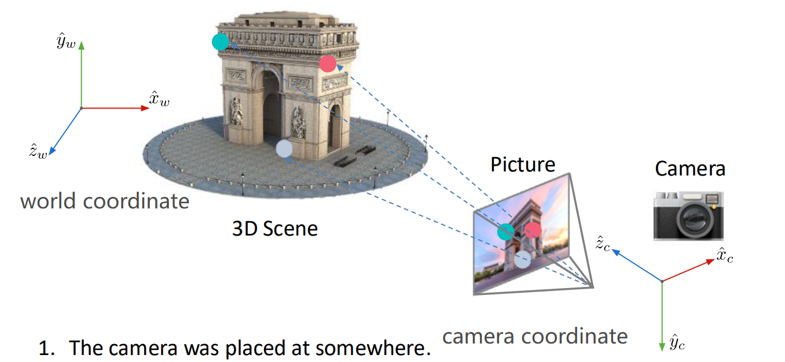  
steps:  
1.coordinate transformation(world & camera):Extrinsic matrix(外参矩阵,位置,朝向)  
2.perspective projection:Intrinsic matrix(焦距,分辨率)  
3.image plane(2D) to image sensor(pixel) mapping:Intrinsic matrix  
##### Coordinate Transformation
$\bold{x_w}=\begin{bmatrix}x_w\\y_w\\z_w\end{bmatrix}\Rightarrow \bold{x_c}=\begin{bmatrix}x_c\\y_c\\z_c\end{bmatrix}$  
Position $c_w$ and orientation $R$ of the camera in world coordinate $W$ are the camera's extrinsic parameters  
$R=\begin{bmatrix}r_{11}&r_{12}&r_{13}\\r_{21}&r_{22}&r_{23}\\r_{31}&r_{32}&r_{33}\end{bmatrix}$,where Row $i$ represents the direction of $\hat{x_c}/\hat{y_c}/\hat{z_c}$ in $W,i=1,2,3$  
Position $P$ with world coordinate $\bold{x_w}$ in camera-centric location is $\bold{x_c}=R(\bold{x_w}-\bold{c_w})=R\bold{x_w + t,t}=-R\bold{c_w}$  
$\bold{x_c}=\begin{bmatrix}x_c\\y_c\\z_c\end{bmatrix}=
\begin{bmatrix}r_{11}&r_{12}&r_{13}\\r_{21}&r_{22}&r_{23}\\r_{31}&r_{32}&r_{33}\end{bmatrix}\begin{bmatrix}x_w\\x_w\\x_w\end{bmatrix}+\begin{bmatrix}t_x\\t_y\\t_z\end{bmatrix}$  
homogenous coordinates:  
${\bold{\tilde{x}_c}}=\begin{bmatrix}x_c\\y_c\\z_c\\1\end{bmatrix}=
\begin{bmatrix}r_{11}&r_{12}&r_{13}&t_x\\r_{21}&r_{22}&r_{23}&t_y\\r_{31}&r_{32}&r_{33}&t_z\\0&0&0&1\end{bmatrix}\begin{bmatrix}x_w\\x_w\\x_w\\1\end{bmatrix}$  
Extrinsic Matrix:$M_{ext}=\begin{bmatrix}r_{11}&r_{12}&r_{13}&t_x\\r_{21}&r_{22}&r_{23}&t_y\\r_{31}&r_{32}&r_{33}&t_z\\0&0&0&1\end{bmatrix}$  
##### Perspective projection
$\bold{x_c}=\begin{bmatrix}x_c\\y_c\\z_c\end{bmatrix}\Rightarrow \bold{x_i}=\bold{f}\cdot\begin{bmatrix}x_c/z_c\\y_c/z_c\\1\end{bmatrix}$  
##### Image plane to image sensor mapping 
Assume $m_x,m_y$ are the pixel densities(pixels/mm) in $x$ and $y$,then pixel coordinates are:$u=m_xx_i=m_xf\frac{x_c}{z_c},v=m_yy_i=m_yf\frac{y_c}{z_c}$  
Remember if the origin point(原点) in image plane in at the centre and the $(0,0)$ pixel is on the left-top corner in image sensor,an extra translation transformation is needed.  
$u=m_xf\frac{x_c}{z_c}+c_x,v=m_yf\frac{y_c}{z_c}+c_y$,where $c_x,c_y$ is the pixel coordinate at the centre of the image  
$\begin{bmatrix}u\\v\\1\end{bmatrix}\tilde{=}\begin{bmatrix}f_x&0&c_x&0\\0&f_y&c_y&0\\0&0&1&0\end{bmatrix}\begin{bmatrix}x_c\\y_c\\z_c\\1\end{bmatrix},f_x=m_xf,f_y=m_yf$  
Intrinsic Matrix:$M_{int}=\begin{bmatrix}f_x&0&c_x&0\\0&f_y&c_y&0\\0&0&1&0\end{bmatrix}$  
Combine all the above,  
$\tilde{u}=M_{int}M_{ext}\tilde{\bold{x}}_w=P\tilde{\bold{x}}_w$  
#### Camera calibration标定  
[Problem] How to compute the position and orientation of the camera?  
1.capture an image of an object with known geometry,e.g.a calibration board(chess board)  
2.identify correspondences between 3D scene points and image points    
  
3.for each corresponding point $i$ in scene and image,applying the matrix:$u^{(i)}=Px_w^{(i)}$ to compute $P$  
4.rearrange the terms  
5.solve for $p$  
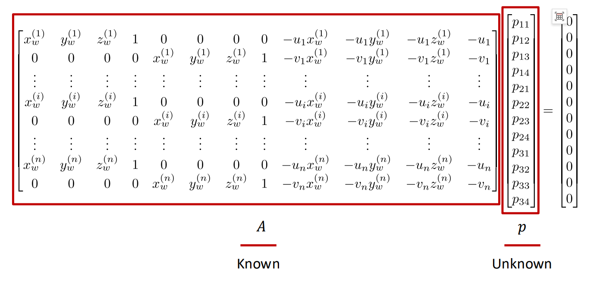  
note that the solution $p$ is up to a scale(scale-invariant)  
scale it by $\|p\|^2=1$,optimization problem:$min_p\|Ap\|^2,s.t.\|p\|^2=1$  
The solution is the smallest eigenvalue $\lambda$ of $A^TA$  
Decompose $P_{3*4}=M_{int}*M_{ext}$  
QR factorization:$\begin{bmatrix}p_{11}&p_{12}&p_{13}\\p_{21}&p_{22}&p_{23}\\p_{31}&p_{32}&p_{33}\end{bmatrix}=P_{3*3}=KR$,where $K$ is an upper right triangular matrix($M_{int}$) and $R$ is an orthonormal matrix($M_{ext}$)   
$\bold{t}=K^{-1}\begin{bmatrix}p_{14}\\p_{24}\\p_{34}\end{bmatrix}$
##### Visual Localization Problem
Often,we already know $M_{int}$ and we want to compute $M_{ext}$  
We use feature matching to map a known 3D scene and a picture  
This problem is also called PnP(Perspective-n-Point problem)  
[Solution1] Direct Linear Transform(DLT)  
pretend we don't know $M_{int}$  
Too many variables!  
we have 6 unknowns,3 for rotation,3 for translation(6DoF pose estimation)  
3 pairs of data should be enough  
[Solution2] P3P
Given $Oa,Ob,Oc,AB,BC,AC$,solve $OA,OB,OC$  
  
The derivation is omitted  
Actually,this equation has 4 possible answers(not unique),we need an extra pair of data(all in all,4 pairs) to determine the unique solution  
[Solution3] Optimization for PnP  
$min_{R,t}\sum_i\|p_i-K(RP_i+t)\|^2$,where $p_i$ is the given 2D points,$RP_i+t$ is the 3D points projected to 2D,where $K$ is the given $M_{int}$  
The target function is called reprojection error  
In reality,we initialize a close solution(starting point) using P3P,then we apply Gauss-Newton for optimization  
Can also be done using RANSAC  
#### Structure from motion
[Problem] How to reconstruct the unknown 3D structure from images?  
compute 3D structure of the scene and camera poses from multiple views  
instrinsics are known for both views/cameras,extrinsics are unknown  
1.instrinsic matrix $K$ is known  
2.find a few reliable corresponding points  
3.find relative camera position $t$ and orientation $R$  
4.find 3D position of scene points  
Epipolar Geometry对极几何:finding the geometric relation between corresponding feature points  
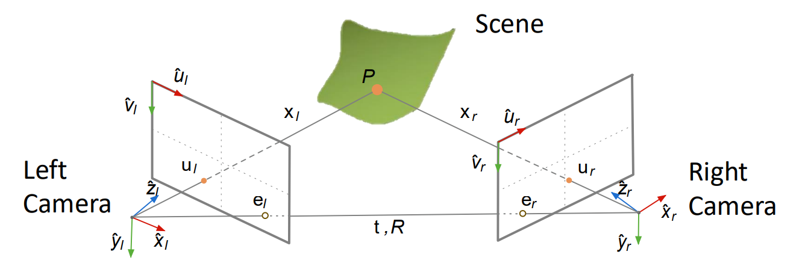  
Epipolar geometry describes $u_l$ and $u_r$ and tell us how to solve $t$ and $R$  
Epipole:$e_l,e_r$,image point of origin/pinhole of one camera as viewed by the other camera  
Epipolar plane:the plane formed by camera origins,epipoles and scene point  
normal vector:$\bold{n=t\times x_l}$  
$\bold{x_l\cdot(t\times x_l)}=\begin{bmatrix}x_l&y_l&z_l\end{bmatrix}\begin{bmatrix}t_yz_l-t_zy_l\\t_zx_l-t_xz_l\\t_xy_l-t_yx_l\end{bmatrix}=\begin{bmatrix}x_l&y_l&z_l\end{bmatrix}\begin{bmatrix}0&-t_z&t_y\\t_z&0&-t_x\\-t_y&t_x&0\end{bmatrix}\begin{bmatrix}x_l\\y_l\\z_l\end{bmatrix}=0\\T_{\times}=\begin{bmatrix}0&-t_z&t_y\\t_z&0&-t_x\\-t_y&t_x&0\end{bmatrix}$  
we know $\bold{x_l}=R\bold{x_r+t}$,substituting $\begin{bmatrix}x_l\\y_l\\z_l\end{bmatrix}$,we have $\begin{bmatrix}x_l&y_l&z_l\end{bmatrix} E_{3*3} \begin{bmatrix}x_r\\y_r\\z_r\end{bmatrix}=0,E=T_{\times}R$ is called essential matrix and this formula is called epipolar constraint  
Given $E$,we can decompose it into $T_{\times}$ and $R$ using singular value decomposition  
To find $E$,we want to use $\bold{x}_l^TE\bold{x}_r=0$,but we don't know $\bold{x}_l,\bold{x}_r$,but we know $u_l,u_r$  
For left camera,$\bold{x}_l^T=\begin{bmatrix}u_l&v_l&1\end{bmatrix}z_lK_l^{-1^T}$,similarly,for right camera,$\bold{x}_r=K_r^{-1}z_r\begin{bmatrix}u_l\\v_l\\1\end{bmatrix}$  
Substituting $\bold{x}_l,\bold{x}_r$ and eliminate $z_l,z_r$,we get:$\begin{bmatrix}u_l&v_l&1\end{bmatrix}K_l^{-1^T} E K_r^{-1}\begin{bmatrix}u_l\\v_l\\1\end{bmatrix}=\begin{bmatrix}u_l&v_l&1\end{bmatrix}F\begin{bmatrix}u_l\\v_l\\1\end{bmatrix}=0,F$ is called fundamental matrix $E=K_l^TFK_r$,also we usually add a scale constraint $\|f\|=1$  
##### Relative Camera Pose Estimation
1.find a set of corresponding features(at least 8) using SIFT  
2.for each correspendence $i$,we have an equation  
3.solving $F$,similar to solving $p$ in camera calibration  
4.solving $E$ using intrinsic matrices  
5.extract $R$ and $\bold{t}$  
##### Triangulation
Find the scene point $P$  
The intersection of the ray $u_l,u_r$ is the point $P$  
$\bold{u}_l=P_l\bold{x}_r,\bold{u}_r=M_{int}\bold{x}_r$  
rearrange:$A\bold{x}_r=b$,$\bold{x}_r=(A^TA)^{-1}A^Tb$  
optimization problem:$min\ cost(P)=\|u_l-\hat{u_l}\|^2+\|u_r-\hat{u_r}\|^2$  
##### Multi-frame/sequential structure from motion
1.Initialize camera motion and scene structure  
2.For each additional view:  
2.1determine projection matrix of new camera using all the known 3D points  
2.2compute new 3D points,reoptimize existing points  
3.bundle adjustment  
##### Bundle adjustment
refining 3D points and camera parameters by minimizing reprojection error over all frames  
reprojection error:$E(P_{proj},\bold{P})=\sum_i\sum_j\|u_j^{(i)}-P_{proj}^{(i)}\bold{P}_j\|^2$  
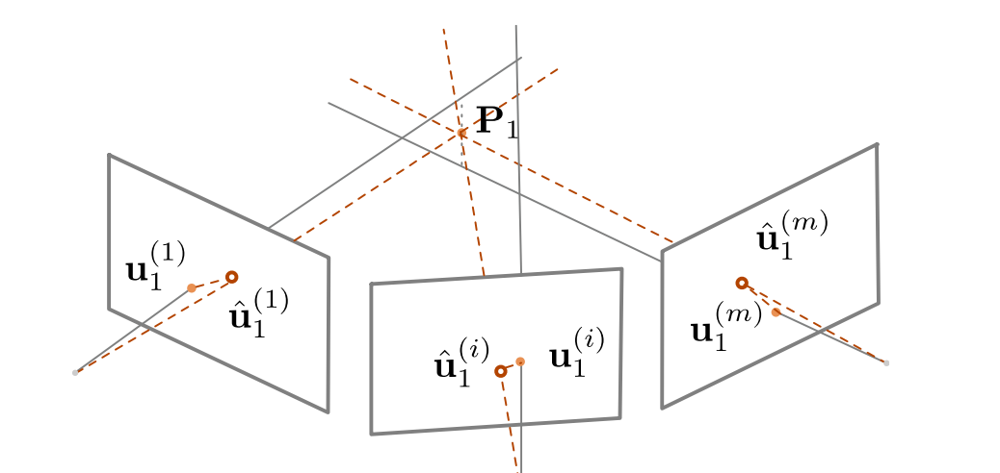  
### Lecture 8:3D reconstruction
#### Depth Estimation
depth sensoring:compute depth maps  
active depth sensoring:emitter and receiver(LiDAR based on time of flight ToF,Light Detection And Ranging)  
passive depth sensoring:two cameras(eyes) for the same points  
#### Stereo matching
##### passive
stereo vision:given the relative camera pose,how to compute the depth of each point?  
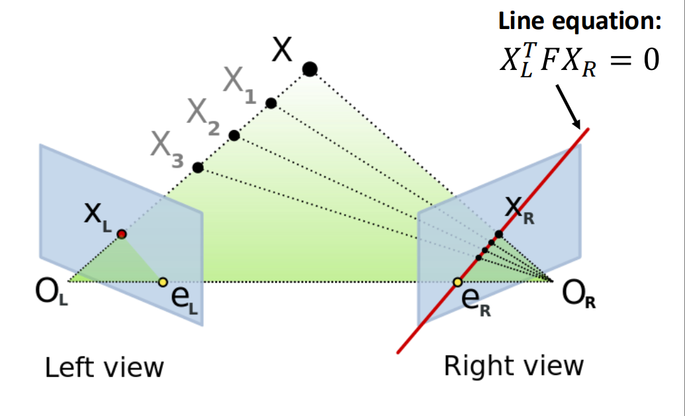  
Given $X_L$,its match in the other image $X_R$ must lie on the epipolar line:$X_L^TFX_R=0$  
For each pixel,find the corresponding epipolar line in the other image,then search along the line and pick the best match  
Simplest case:epipolar lines are horizontal,parallel images  
Image planes are parallel to each other and camera centers are at the same height,focal length are the same  
$(x_1,y_1)\rightarrow(x_2,y_1),disparity=x_2-x_1=\frac{B\cdot f}{z},depth=z$
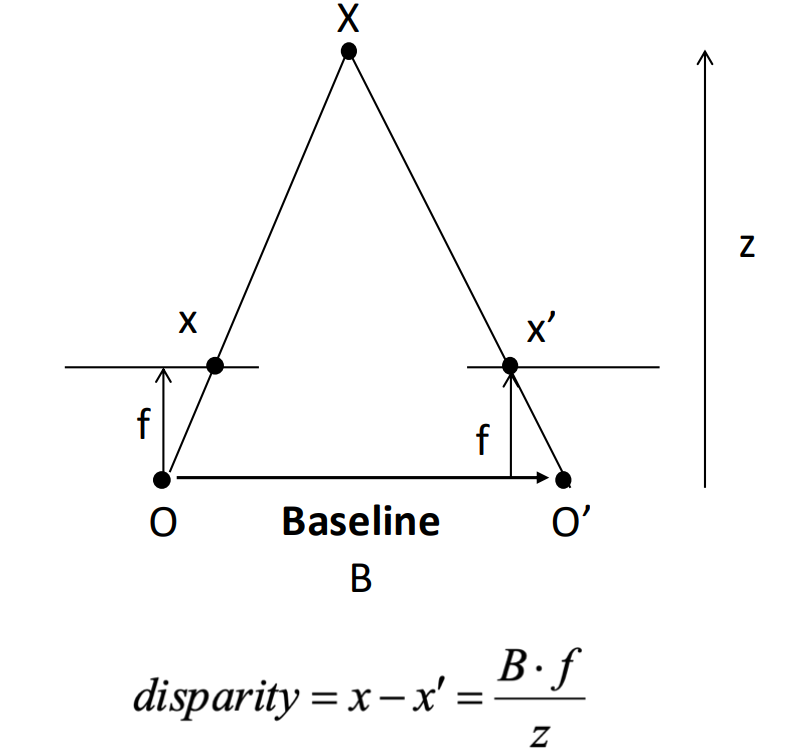  
More complicated case:image rectification矫正   
reproject image planes onto a common plane  
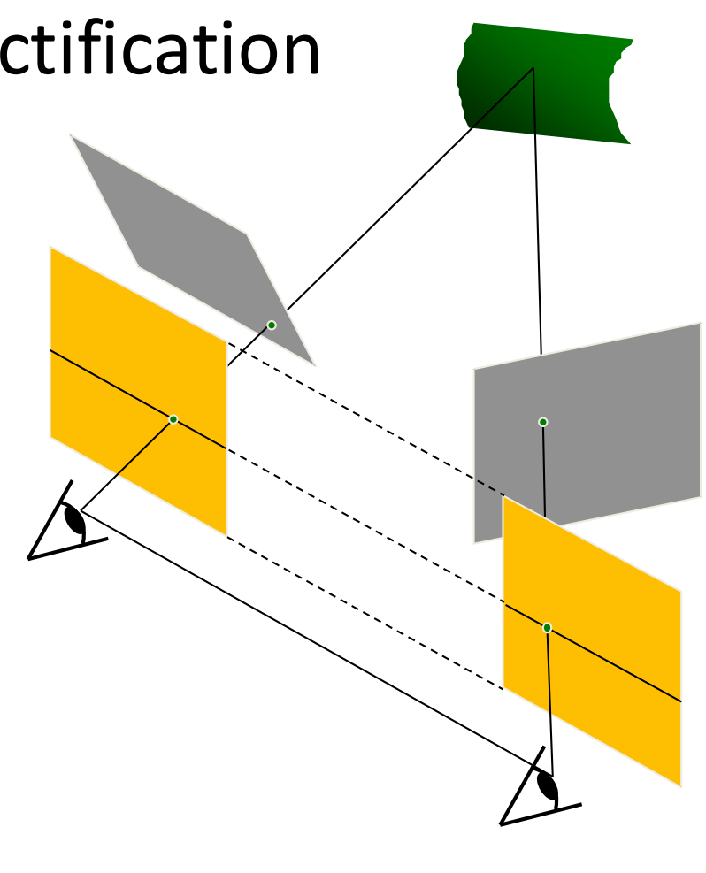  
*matching algorithms:dissimilarity(Sum of Squared Differences(SSD),SAD,ZNCC,...)  
window size,graph-cuts  
$E(d)=E_d(d)+\lambda E_s(d),d=disparity,E_d$:each pixel to find a good match in the other image,$E_s$:adjacent pixels are usually move about the same amount  
**Summary**  
1.calibrate cameras  
2.rectify images  
3.compute disparity  
4.depth estimation  
baseline:large is better but difficult in searching if too large,small->large depth error    
##### active
using structured light(infrared light patterns from a projector),two cameras->a camera and a projector  
#### Multi-view stereo(MVS)
Find the depth of a reference image using a lot of neighbour images  
Basic idea:compute the error for each depth value for each point in the reference image and select the depth value with the smallest error  
**PatchMatch**:solving correspondence problems  
assumption:large number of random sampling will yield good guess;neighbours have similar offsets  
1.random initialization  
2.propagation:adopt neighbor's patch offset if it is a better matching(one pixel matched,all its neighbour adopt his offset)  
3.local search  
#### 3D reconstruction
##### 3D representations
point cloud,volume体塑(occupancy,signed distance),mesh三角网格  
occupancy $V_{ijk}=\begin{cases}1,if\ occupied\\0,if\ empty\end{cases}$  
SDF:the distance of a point to the shape boundary(inside<0,outside>0,boundary=0)  
##### 3D surface reconstruction
1.poisson reconstruction:from depth maps to occupancy volume  
convert depth map to point cloud  
get normal vector for each point based on PCA  
represent surface by indicator(occupancy) function  
  
oriented points vector field $\vec{V}$,find the $min_\Chi\|\nabla_\Chi-\vec{V}\|$  
2.marching cubes:from occupancy volume to mesh  
2D:one vertex on each grid edge with a sign change,connect vertices by lines,determine location of the vertex by linear interpolation  

3D:connect vertices by triangles  
  
##### *Texture mapping
## Understanding
### Lecture 9:Deep learning 
See Machine Learning  
### Lecture 10:Recognition
#### Introduction
classification:find the label of the image by using NN  
semantic segmentation:categorize each pixel into different types  
However,semantic segmentation will not distinguish each object of the same type  
We use object detection then instance segmentation to find each pixel belongs to which object  
  
#### Semantic segmentation
sliding window:very very slow and limited receptive fields(感受野)  
both large and small window size will lead to inaccurate result  
Fully Convolutional network:make predictions all at once  
loss function:per-pixel cross-entropy  
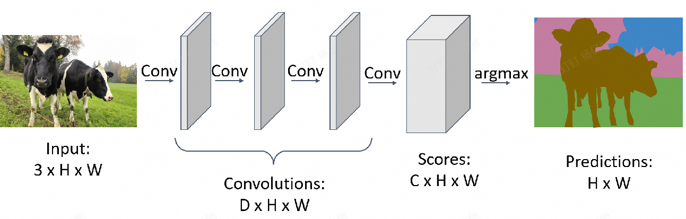  
Receptive field is linear in number of conv layers  
Convolution on high resolution is expensive  
[Solution] Pooling,strided conv(downsampling)  
[Problem] We need restore the image to the original size(upsampling)  
Unpooling:Bed of Nails(add 0),Nearest Neighbor,Bilinear Interpolation,Bicubic Interpolation  
Followed by Transposed convolution  
U-Net:skip-connection(similar to ResNet) for dense-prediction  
skip-connection:avoid information loss  
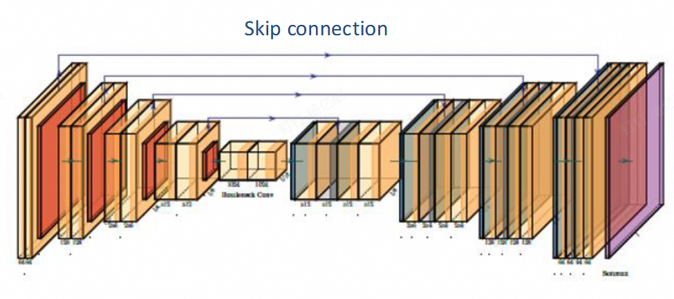  
Deeplab:FCN+CRF(Conditional Random Field)  
Atrous convolution:introduce vacancy to increase the receptive field  
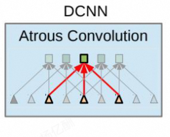  
Transformer:global receptive field  
*CRF:optimization that near pixels predict almost the same  
Segment Anything Model(SAM):Meta AI  
Evaluation Metric:IoU(per-pixel Intersection-over-Union)
$$\frac{ground\ truth \cap prediction}{ground\ truth\cup prediction}$$  
#### Object detection
output:a set of bounding boxes  
```c
struct bounding_box{
    Type label;
    Tuple Location;//(x,y)
    Size size;//(w,h)
}
```
The number of bounding box is unknown  
Detecting a single object,output:class score,box coordinates  
sliding window:too many boxes  
[Solution] Region Proposals:heuristics by over-segmentation  
R-CNN(Region-Convolutional Neural Network):the first object detector based on NN  
1. Find Regions of Interest(RoI) from a proposal method  
2. Resize each region and run through CNN  
3. Output class scores and bbox  

Evaluation Metric:IoU  
[Problem] Object detector often outputs many overlapping regions  
[Solution] Non-max suppression  
1. Select the highest-scoring box  
2. Compute the IoU of each pair of boxes  
3. Eliminate lower-scoring boxes with IoU > threshold  

[Problem] Each proposal needs to go a NN  
Fast R-CNN  
1. Run whole image through ConvNet(backbone:ResNet,VCG,AlexNet,etc.) -> features  
2. Get the features of proposed regions  
3. Pass each feature through a small CNN  

Faster R-CNN:reduce proposal number  
Use CNN to select proposals  
Region Proposal Network(RPN) instead of pre-segmentation method  
anchor box:fixed size box at each point in the feature map  
predict whether the K anchor boxes is an object and a transforms  
  
Faster R-CNN is a two-stage object detector:  
- stage 1:backbone network + RPN  
- stage 2:crop feature + prediction(class & offset)  

Single-stage object detector:directly classify each anchor as one of the categories  
YOLO(You-Only-Look-Once):most commonly-used  

#### Instance segmentation
Detect all objects and identify the pixels belong to each object  
Perform object detection then a segmentation mask for each object  
Faster R-CNN+additional head(mask prediction)=Mask R-CNN  
Panoptic segmentation全景分割:label all the pixels including the background  
Dataset:Microsoft COCO  
#### Human pose estimation
represent the pose of a human by locating a set of keypoints(17)  
depth sensors:Microsoft Kinect(random forest)  
directly predict joint locations(17*2 vector)  
represent joint location as heatmap(easy for CNN)  
multiple humans:  
- top-down:detect humans and detect keypoints in each bbox(Mask R-CNN)  
accurate for single human  
slow and difficult for dense people(two people dancing)  
- bottom-up:detect keypoints and group them to form humans(OpenPose)  
fast,especially for multiple humans  

OpenPose:Part Confidence Map + Part Affinity Field部位关键场  

#### *Other Tasks
optical flow:displacement field F between two images of near frames $l_t$ and $l_{t+1}$  
FlowNet:Instead of simply concat two images,estimate the flow from the cost volume  
RAFT:SOTA,coarse-to-fine cost volume(Best paper in ECCV,2020)  
Video Classification:3D CNN  
Action Localization:identify frames to corresponding actions    
Spatial-Temporal detection:classify human activities in a video  
Multi-object Tracking:object detection,feature matching,optical flow  

### *Lecture 11:3D deep learning
#### reconstruction
##### feature matching
SfM:feature matching -> camera parameters(colmap)  
problem of deep learning:insufficient precision(like human brain),lack of generalization  
[Idea] deep learning for feature matching  
Traditional feature extractor and descriptor is handcrafted(DoG,SIFT,...)  
[Problem] no semantics and cannot handle poor texture  
Superpoint:  
  
detectors:  
heatmap for interest points  
dataset:synthetic shapes for corner detection training  
data augmentation:warping the image  
descriptors:  
K+1 dimensional vector for K layers  
metric learning:sufficient large distance for not matching feature,as close as possible for matching features(triplet loss)  
dataset:synthetic data,MVS  
##### object pose estimation
[Goal] Estimate the 3D location and orientation of an object relative to the camera frame  
1. Find 3D-2D correspondences  
2. Solve $R$ and $t$ by PnP algorithm  

Feature-matching-based methods:  
1. reconstruct SfM model by multi-view iamges  
2. obtain 2D-3D correspondences by lifting 2D-2D matches to 3D  
3. solve object pose of query image by PnP  

Direct pose regression methods:directly regressing object pose using a NN(low precision)  
Keypoint detection methods:CNN for detecting pre-defined keypoints(feature matching),then PnP  
##### human pose estimation
Mark MoCap(markers) & Markerless MoCap(RGB images)  
Monocular(single-camera) 3D pose estimation  
SMPL(parameterized human pose regression:camera parameters,shape and pose)  
##### dense reconstruction
Traditional method:MVS(depth estimation),poisson reconstruction,marching cubes,texture mapping  
depth estimation:compute the error for each depth value for each point in the reference image and find the depth with minimum error  
[Problem] Textureless area(low error for all the spaces),reflection/transparency,repetitive patterns  
[Solution] MVSNet  
1. feature map for cost volume  
2. compute depth based on cost volume using a NN  

optimization:  
[Idea] comparing the rendered images with the input images  
[Problem] non-differentiable,mesh representation not good for optimization  
3D representations:volume,point cloud,mesh(discrete)  
[Solution] implicit function  
occupancy,signed distance  
MLP(Multi-Layer Perceptron)  
NeRF(Neural Radiance Fields):radiance = density + color  
$(x,y,z,\theta,\phi)\rightarrow F_{\Omega}\rightarrow(r,g,b,\sigma)$  
$F_{\Omega}:$fully-connected neural network   
volume rendering体渲染(differentiable):sum/integral of weighted volume color along the camera ray  
optimization:minimizing rendering loss  
[Problem] NeRF is not an accurate representation of object surface
[Solution] NeuS(Neural Implicit Surface):replacing density field by SDF(signed distance field)  
SDF is non-differential but it can be changed to S-density  
3DGS(3D Gaussian Splatting):faster because no network  
explicit radiance field representation:assume each light source is a Gaussian spheroid  
[Problem] Similar to NeRF,there's no accurate surface representation  
[Solution] 2DGS
###### Single image to 3D
using network to guess depth from single image  
monoculer depth estimation:unknown scale  
loss function:scale-invariant depth error  
Depth Anything:SOTA  
Single-view shape estimation  
3D generation(diffusion model):Hunyuan,SAM 3D  
#### understanding
##### Multi-view CNN for classification
1. Given an input shape  
2. Render with multiple virtual cameras  
3. Pass the rendered images through CNNs -> predictions  

##### 3D volumetric data:occupancy  
3D ConvNets:$O(N^3)$  
Sparse ConvNets:Octree for surface signal storation  
sparse convolution:compute inner product only at active sites  
##### Point Clouds
point clouds are not rasterized and cannot be convolved  
PointNet:  
Input:N orderless points,each represented by a D dim vector  
mlp:multi-layer perceptron(fully connected)  
  
[Challenge1] orderless point set  
[Solution] permutation & max-pooling  
[Challenge2] the output should be invariant to rigid transformation  
[Solution] T-Net for transformation estimation  
[Limitation] No local context for each point  
[Solution] PointNet++:multi-scale PointNet,sampling,grouping and apply PointNet for each neighbourhood  
3D object detection:Point RCNN  
3D instance segmentation  
Top down:Run 3D detection,segmentation in each 3D bbox  
Bottom up:clustering  

## Synthesis
### Lecture 12:Image synthesis I
[Definition] Computational Photography:arbitrary computation to the final image  
#### High Dynamic Range Imaging(HDR)
[Definition] Exposure:Gain * Irradiance * Time  
shutter speed,aperture,ISO  
High ISO is to increase camera flexibility(in the dark) in the sake of image quality(noises)  
Dynamic range(对比度):the ratio between the largest and smallest values of certain quantity(e.g. brightness)  
[Idea] capture multiple LDR(low dynamic range) images at different exposures and merging  
merging process:  
1. find valid pixels in each image  
2. weight the pixels appropriately  
3. from a new pixel as the weighted average  
#### Deblurring
blurring:subject not in the depth of view,moving subjects or unstable camera  
[Solution] Accurate focus,fast shutter speed(large aperture,high ISO),hardware(tripod,optical image stabilization,IMU惯性传感器)  
photoshop:deconvolution  
##### Non-blind(known convolution kernel) image deconvolution (NBID):$G=F\otimes H$  
$G$:The captured image,$F$:Image to be solved,$H$:convolution kernel  
$FFT(G)=FFT(F\otimes H)=FFT(F)\times FFT(H)$  
$F=IFFT(FFT(G)\div FFT(H))$  
Large noise for Gaussian inverse filtering(divide 0)  
Weiner filter:  
$$
W(u,v)=\frac{H^*(u,v)}{|H(u,v)|^2+K(u,v)}
$$
$K=0$ for low freq,large $K$ for high freq  
optimization:  
$$G = F\otimes H+N$$  
$$
MSE=\|G-F\otimes H\|_2^2=\sum_{ij}(G_{ij}-[F\otimes H]_{ij})^2
$$
illed-optimization problem:no unique solution  
We hope our solution is smooth(gradient map is sparse)  
L1 regularization:$\|\nabla F\|_1$  
$$
min_F\|G-F\otimes H\|_2^2+\|\nabla F\|_1
$$
##### Blind Image Deconvolution(BID)
$$
min_{F,H}\|G-F\otimes H\|_2^2+\lambda_1\|\nabla F\|_1+\lambda_2\|H\|_1,s.t.H\ge 0
$$
#### *Colorization
##### sample-based
Given a colored source image,for target image,find the best matching point in the sample and assign the color of the matching point to the pixel(often neural network)  
##### interactive
gray image with brush:For two adjacent pixels, if the brightness is similar, then the color should also remain similar  
$$
J(U)=\sum_r(U(r)-\sum_{s\in N(r)}w_{rs}U(s))^2
$$
video colorization:learning loss function(GAN,see Machine Learning)  
#### *More Image Synthesis Tasks
super-resolution using GAN  
image-to-image translation:style-transfer,text-to-photo,dehazing,garment transfer  
head-reenactment:数字人  
AIGC  
Diffusion models:  
Denoising networks  
conditional DMs:text-to-image,latent diffusion,stable diffusion,text-to-video(SORA)  
### *Lecture 13:Novel View Synthesis
omitted


