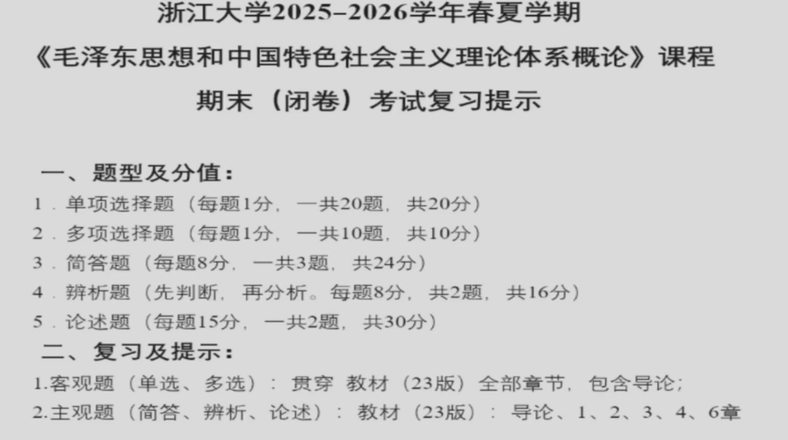

# 毛泽东思想和中国特色社会主义理论体系概论（H）  3.0 学分
## 授课教师
傅夏仙

### 认定
思政军体课

### 课程教材
**不要太老的**毛泽东思想和中国特色社会主义理论体系概论

### 分数构成
- 平时成绩 60%
  - 小组任务（组内分配）：  
    - 专题思考题（平均每人两次）  
    - 经典研读  
    - 实践调研（调研+论文+ppt+汇报）  
  - 个人成绩：  
    - 两次点名（扫码）  
    - 两次线上小测  
    - 线上课观看  
- 期末考试 40%

### 学习建议
平时任务其实非常少，个人部分不要忘记，期末考前参考王晓梅等老师复习课（注意教材的版本），然后发挥本心即可。  