# 机器学习(Machine Learning)
## Lecture 1
Machine learning is the study of computer systems that improve their performance through **experience**  

- supervised:regression/classification  
  input -> specific label output  
- unsupervised:clustering  
  input -> ?  
- reinforcement:react to an environment  
  input -> reward maximization  

### Supervised learning
Goal:learn a mapping from inputs **x** to outputs y  
training data:a labeled set of input-output pairs  

classification:y is a (discrete) categorical var  
regression:y is real-valued  

### Unsupervised learning
Goal:only given inputs and find "interesting patterns"  

clustering:discover clusters  
latent factors discovery:dimensionality reduction,matrix factorization(分解),topic modeling  

### Reinforcement
labels exist,learn how to act when given occasional reward or punishment signals  

final reward:win or lose  
credit assignment to a series of actions  

## Lecture 2
### Supervised Learning Procedure
Learning from experience(training data), and build model to predict the future  
Collect training samples(x,y) -> step 1:define features(f,y) -> step 2:design & train model -> make prediction  
end-to-end learning:training samples -> Representation Learning(automatically get features) & train -> output  
general classification difficulty:intra-class variability & inter-class similarity  
good representation/feature:low intra-class variability & low inter-class similarity  
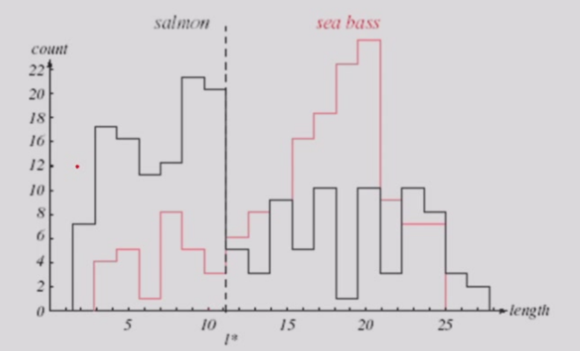  
classifier:t*  
two-dimensional feature space:linear decision boundary  
complex decision bounary:overfitting  
  

!!! danger "在机器学习过程中，不断调整训练集的拟合程度在测试集上测试，直到达到在测试集上error最低❌，不可以根据测试集调参"  

测试集只能在所有决策完成之后做唯一的一次，测试集表现不佳只能在新的测试集上测试（e.g.高考与复读）  
### Linear Methods for Regression
learn a mapping from inputs **x** to outputs y,y is real-valued  
sample:$\boldsymbol{x}=[x_1,...,x_d]^\top$,finds a linear function  $\boldsymbol{w}=[w_1,...,w_d]^\top$,$f(\boldsymbol{x})=\boldsymbol{w^\top x}+b$  
Polynomial Curve Fitting:$f(x,\boldsymbol{w})=w_0+w_1x+w_2x^2+...+w_Mx^M$  
$\boldsymbol{x}=[1,x,x^2,...,x^M]^\top,\boldsymbol{w}=[w_0,w_1,w_2,...,w_M]^\top,f(\boldsymbol{x},\boldsymbol{w})=\boldsymbol{w}^\top\boldsymbol{x}$  
Sum-of-Square Error Function,$MSE(\boldsymbol{w})=\frac{1}{n}\sum_{i=1}^n(y_i-f(x_i,\boldsymbol{w}))^2$

## Lecture 3
$J_n=(\boldsymbol{y}-X^\top\boldsymbol{w})^\top(\boldsymbol{y}-X^\top\boldsymbol{w})$  
$\nabla J_n=-2X(\boldsymbol{y}-X^\top\boldsymbol{w}) = 0$  
$XX^\top\boldsymbol{w}=X\boldsymbol{y}$  
$\boldsymbol{w} = (XX^\top)^{-1}X\boldsymbol{y}$  
note that $XX^\top$ have to be non-singular(非奇异，可逆)  
$\hat{y}=X^\top\boldsymbol{a}=X^\top(XX^\top)^{-1}X\boldsymbol{y}$  
### Statistical model of regression —— MLE
$y=f(\boldsymbol{x},\boldsymbol{w})+\epsilon,\epsilon$~$N(0,\sigma^2)$  
...  
$-(logL)' = -l' = RSS(f)=\sum_{i=1}^n(y_i-f(\boldsymbol{x}_i))^2 = MSE$  
Linear regression is equivalent to MLE of generative model with Gaussian random noise  
### Regularization/Ridge Regression 岭回归
[Target] control the size of the coefficients  
$\boldsymbol{w}^*=argmin\sum_{i=1}^n(y_i-\boldsymbol{x}_i^\top\boldsymbol{w})^2+\lambda\sum_{i=1}^pw_j^2$  
$\boldsymbol{w}^* = (XX^\top + \lambda\boldsymbol{I})^{-1}X\boldsymbol{y}$  
note $\boldsymbol{w}^*$ must be non-singular  
$\lambda=0,ln\lambda=-\infty \rightarrow linear\ regression$  
$ln\lambda=0 \rightarrow underfitting$  
### LASSO:sparse model
LASSO:Least Absolute Selection and Shrinkage Operator  
$\boldsymbol{w}^*=argmin\frac{1}{2n}\sum_{i=1}^n(y_i-\boldsymbol{x}_i^\top\boldsymbol{w})^2$subject to$\sum_{j=1}^p|w_j|\le t$  
sparse:some parameters can be 0,efficient in calculation  
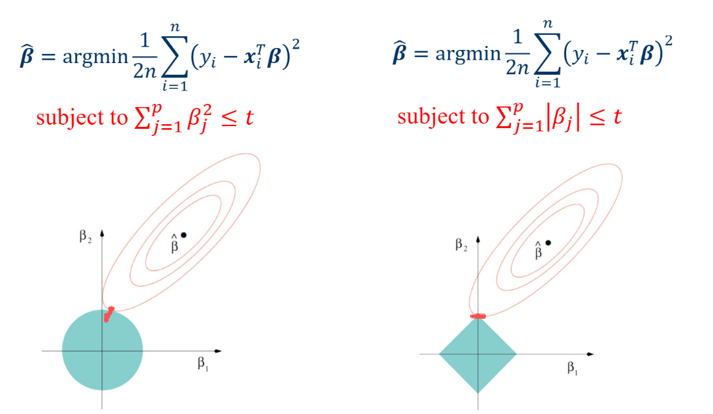  

## Lecture 4
### Bias & Variance Decomposition
Loss:$L(y,f(\boldsymbol{x}))$  
Expected loss:$E(L)=\int\int L(y,f(\boldsymbol{x}))p(\boldsymbol{x},y)d\boldsymbol{x}dy$  
Squared loss:$L(y,f(\boldsymbol{x}))=(y-f(\boldsymbol{x}))^2$  
Expected Prediction Error:$EPE(f)=\int\int (y-f(\boldsymbol{x}))^2p(\boldsymbol{x},y)d\boldsymbol{x}dy$  
Find $f(\boldsymbol{x^*})$  
$(y-f(\boldsymbol{x})^2=(y-E(y|\boldsymbol{x})+E(y|\boldsymbol{x})-f(\boldsymbol{x}))^2= \\(y-E(y|\boldsymbol{x}))^2+(E(y|\boldsymbol{x})-f(\boldsymbol{x}))^2+2(y-E(y|\boldsymbol{x}))(E(y|\boldsymbol{x})-f(\boldsymbol{x}))$  
$EPE(f)=\int (f(\boldsymbol{x})-E(y|\boldsymbol{x}))^2p(\boldsymbol{x})d\boldsymbol{x}+\int var(y|\boldsymbol{x})p(\boldsymbol{x})d\boldsymbol{x}$(noise)  
In reality,we can never know the exact $f(\boldsymbol{x})$  
$EPE(f)=\int (f(\boldsymbol{x};D)-E(y|\boldsymbol{x}))^2p(\boldsymbol{x})d\boldsymbol{x}+\int var(y|\boldsymbol{x})p(\boldsymbol{x})d\boldsymbol{x}$  
$(f(\boldsymbol{x};D)-E(y|\boldsymbol{x}))^2=[f(\boldsymbol{x};D)-E_D(f(\boldsymbol{x};D))+E_D(f(\boldsymbol{x};D))-E(y|\boldsymbol{x})]^2$  
$EPE(f)=\int (E_D(f(\boldsymbol{x};D))-E(y|\boldsymbol{x}))^2p(\boldsymbol{x})d\boldsymbol{x}+\int E_D((f(\boldsymbol{x};D))-E_D(f(\boldsymbol{x};D)))^2)p(\boldsymbol{x})d\boldsymbol{x}+\int var(y|\boldsymbol{x})p(\boldsymbol{x})d\boldsymbol{x}=(bias)^2+variance+noise$  
variance:$E_D((f(\boldsymbol{x};D))-E_D(f(\boldsymbol{x};D)))^2)$ caused by different datasets  
bias²:$(E_D(f(\boldsymbol{x};D))-E(y|\boldsymbol{x}))^2$ difference between the calculated distribution and the ground truth  
noise:$var(y|\boldsymbol{x})p(\boldsymbol{x})d\boldsymbol{x}$ caused by the real distribution(e.g. an x corresponds to many y),irreducible   
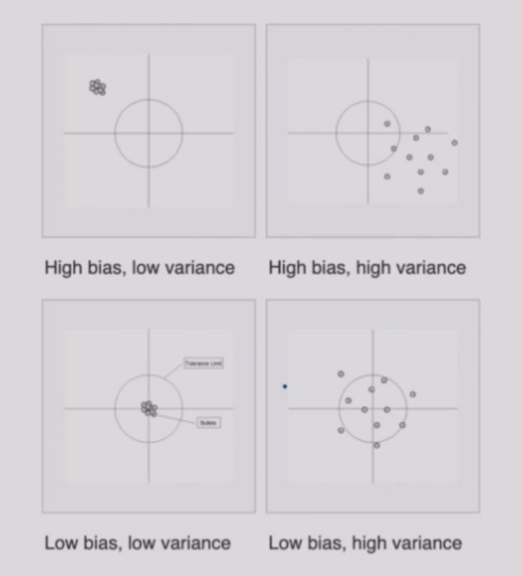  
  
variance:sensitivity to dataset  
#### The Bias-Variance Trade-off   
large $\lambda$ -> over-regularized -> high bias  
small $\lambda$ -> under-regularized -> high variance  
  
### Cross-Validation
K-fold Cross-Validation + average/vote,leave-one-out validation  
### Classification  
discriminant function:$g_i(\boldsymbol{x})$,classifier assign a feature vector $\boldsymbol{x}$ to class $\omega_i$ if $g_i(\boldsymbol{x}) > g_j(\boldsymbol{x}),\forall j \neq i$  
#### Binary Classifier to Multi-class Classifier  

- One vs Rest:依据多个one分类器（如猫分类器，狗分类器，鸟分类器）的结果与置信度判断    
- One vs One:每两个类别作为一个分类器（如猫狗分类器，猫鸟分类器，狗鸟分类器），将每个的结果与置信度判断  
- ECOC(Error-Correcting Output Codes):多分类问题转化为多个二分类问题  

#### Regression to Classification
Linear regression:$f(\boldsymbol{x})=\boldsymbol{w}^\top\boldsymbol{x}\in(-\infty,+\infty)$  
classfication:Estimate $P(\omega|x)\in\left\{0,1,-1\right\}$  
sigmoid function/logistic function:$\sigma(t)=\frac{1}{1+e^{-t}}$,$\sigma:\mathbb{R}\rightarrow(0,1)$  
Logistic Regression:a classification model using sigmoid function  
$P(y_i=\pm 1|\boldsymbol{x}_i,\boldsymbol{a})=\sigma(y_i\boldsymbol{a}^\top\boldsymbol{x}_i)=\frac{1}{1+e^{-y_i\boldsymbol{a}^\top\boldsymbol{x}_i}}$  
MLE:$P(D)=\Pi\sigma(y_i\boldsymbol{a}^\top\boldsymbol{x}_i)$  
$l(P(D))=-\sum\log(1+e^{-y_i\boldsymbol{a}^\top\boldsymbol{x}_i})$  
$E(\boldsymbol{a})=\sum\log(1+e^{-y_i\boldsymbol{a}^\top\boldsymbol{x}_i})$,target of minimum optimization  
Using **Gradient Descent**  

## Lecture 5
### Gradient Descent
first-order iterative optimization -> local minimum  
$J(w)$ is defined and differentiable in a neighbourhood of $a$,let $b=a-\gamma\nabla J(a)$,for$\gamma$ small enough,$J(a)\ge J(b)$  
$w_{n+1}=w_n-\gamma \nabla J(w_n),n\ge 0$,hopefully the sequence $w_n$ converges to the desired local minimum  
Zig-zagging nature  
Newton's Method(second-order):Minimize $E'(a)\Delta a+E''(a)\frac{\Delta a^2}{2!}$  

!!! note "more details in Introductory Lectures on Optimization"  

### Support Vector Machine
#### Geometrical margin
two-category linearly separable case:$w^\top x>0\rightarrow positive \ class,<0 \rightarrow negative$  
$w$:separating vector  
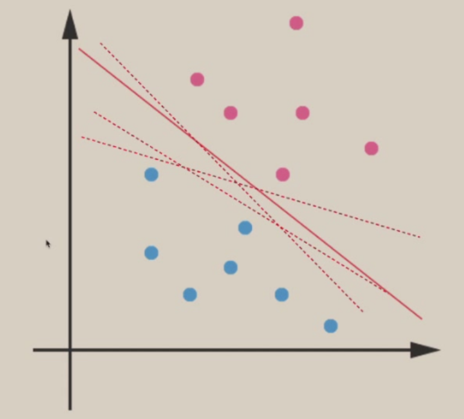  
non-uniqueness hyperplane classifier,which one is better?  
linear model:$f(x)=w^\top x + b = 0$  
distance of point $x$ to hyperplane  
$f(x_p)=w^\top(x-r\frac{w}{||w||})+b=0$  
$f(x)=w^\top x+b=r||w||$  
$r=\frac{f(x)}{||w||}$  
$\gamma = y\cdot r,y=-1 \ if \ r<0$ make it non-negative  
$\gamma$ is called geometrical margin  
$\gamma = y\frac{w^\top x+b}{||w||}$,if the hyperplane moves a little,points with small $\gamma$ is likely to be affected    
#### Maximum Margin Classifier
margin of a dataset:minimum margin for each data point  
[goal] find the hyperplane with the largest margin  
$max_{w,b}\gamma=max_{w,b}\frac{y(w^\top x+b)}{||w||},s.t.\gamma_i\ge\gamma$  
fixing $y(w^\top x+b) = 1$ to avoid making it arbitrarily large  
$max_{w,b}\frac{y(w^\top x+b)}{||w||}=max_{w,b}\frac{1}{||w||}=min_{w,b}||w||\iff min_{w,b}\frac{1}{2}||w||^2 \\ s.t.,\gamma_i=\frac{y_i(w^\top x_i+b)}{||w||}\ge \gamma \iff y_i(w^\top x_i+b)\ge\gamma||w||=1\iff y_i(w^\top x_i+b)\ge1$  
[Definition] loss function of MMC:$min_{w,b}\frac{1}{2}||w||^2,s.t.,y_i(w^\top x_i+b)\ge1$  
$y_i\in\left\{1,-1\right\}$  
#### Support Vector
[Definition] the points on the margin supporting the hyperplane  
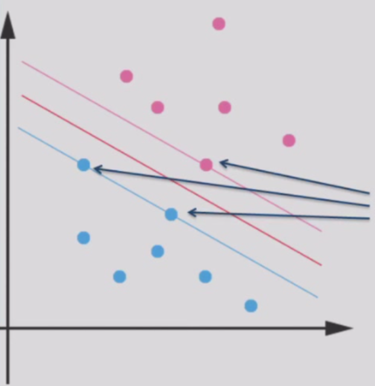  
weakness:outlier pushes the hyperplane away from the original place(**overfitting**)  
slack variables$\xi$:allow the point to deviate the correct margin(even be classified wrongly) by distance $\xi$  
  
new objective function:$min_{w,b,\xi}\frac{1}{2}||w||^2+c\sum_{i=1}^n\xi_i,s.t.,y_i(w^\top x_i+b)\ge1-\xi_i,\xi_i\ge0$  
$c$表示违背约束的惩罚系数，很大时($\xi$很小时)退化为传统MMC  
## Lecture 6
### Lagrange Multipliers and the Karush-Kuhn-Tucker conditions
#### Unconstrained Optimization
1.$f$ has zero gradient at $x^*$:$\nabla_xf(x^*)=0$  
2.The Hessian of $f$ at $x^*$ is positive semi-definite:  
$$
\nabla^2f(x)=\begin{pmatrix}
\frac{\partial^2f(x)}{\partial x_1^2} & ... & \frac{\partial^2f(x)}{\partial x_1\partial x_n} \\ ... & ...& ... \\\frac{\partial^2f(x)}{\partial x_n\partial x_1}&...&\frac{\partial^2f(x)}{\partial x_n^2}
\end{pmatrix}
$$  
#### Constrained Optimization:Equality Constraints
$min f(x),s.t.h(x)=0$  
$e.g.minf(x)=x_1+x_2,s.t.h(x)=x_1^2+x_2^2-2=0$  
  
Given a feasible point $x_F$ on the constraint surface  
Find $\delta x,s.t.h(x_F+\alpha\delta x)=0 and f(x_F+\alpha\delta x)<f(x_F)$  
At any point $\tilde{x}$,the direction of the steepest descent of the cost function $f(x)$ is given by $-\nabla_x f(\tilde{x})$  
Therefore,to move $\delta x$ from $x$ such that $f(x+\delta x)<f(x)$ must have $\delta x\cdot(-\nabla_x f(x))>0$   
  
Also,to move a small $\delta x$ from $x$ and remain on the constraint surface fastest,we have to move orthogonal to $\nabla_x h(x)$  
**When $\nabla_x f(x_F)=\mu\nabla_x h(x_F)$,then $\delta x\cdot(-\nabla_x f(x))=\delta x\cdot \mu\nabla_x h(x_F)=0$,then we reach the local optimum**  
#### Lagrange Multiplier
$min f(x),s.t.h(x)=0$  
Lagrangian:$\mathcal{L}(x,\mu)=f(x)+\mu h(x)$  
$\mathcal{L}(x^*,\mu^*)=f(x^*)$  
$x^*$ is a local minimum $\iff$ there exists a unique $\mu^*$ s.t.   
1.$\nabla_x\mathcal{L}(x^*,\mu^*)=0(\nabla_x f(x^*)=\mu^*\nabla_x h(x^*))$  
2.$\nabla_\mu\mathcal{L}(x^*,\mu^*)=0(h(x^*)=0)$  
3.$y^\top(\nabla_{xx}\mathcal{L}(x^*,\mu^*))y\ge0,\forall y,s.t.\nabla_x h(x^*)^\top y =0$  
multiple equality constraints:$\mathcal{L}(x,\mu)=f(x)+\sum_i\mu_i h_i(x)$  
#### Constrained Optimization:Inequality Constraints
$min f(x)=x_1^2+x_2^2,s.t.g(x)=x_1^2+x_2^2-1\le0$  
case1(inactive constraint):unconstrained minimum of $f$ lies in the feasible region  
case2(active constraint):$min f(x)=(x_1-1.1)^2+(x_2-1.1)^2,s.t.g(x)=x_1^2+x_2^2-1\le0$  
  
The constrained local minimum occurs on the surface of the constraint surface $g(x)=0$  
**$-\nabla_x f(x)=\lambda\nabla_x g(x),\lambda >0$**,pointing the central of the feasible region  
Remember,$y^\top\nabla_{xx}\mathcal{L}(x^*)y\ge0,\forall y,s.t.\nabla_x g(x^*)^\top y =0$  
#### *KKT conditions
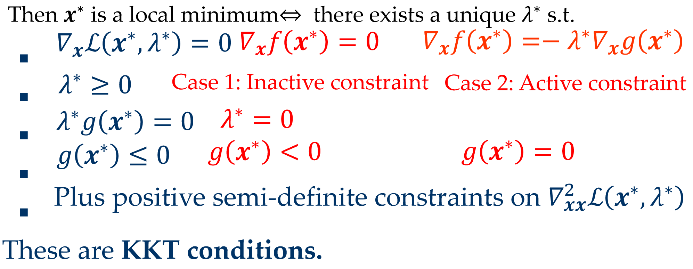  
### Python Basic
## Lecture 7
### Generalized Linear Function
[Problem] Circles are difficult to separate by a hyperplane  
[Solution] Add a dimension(feature)  
$(x_1,x_2)\rightarrow(x_1,x_2,x_1^2+x_2^2)$  
$g(x)=\sum_{i=1}^d w_ix_i+w_0$  
generalized linear discriminant:$[x_1,x_2,x_3]\rightarrow[x_1,x_2,x_3,x_1x_2,x_1x_3,x_2x_3,x_1x_2x_3]$  
$y_i(x)$:polynomial discriminant functions  
$y=[y_1(x),...,y_d(x)]^t$:augmented feature vector  
The mapping $y$ is called the phi function $x\rightarrow \phi(x)$  
non-practical explicit form,curse of dimensionality维数灾难  
### Kernel Method
[Idea] Use kernel functions to compute inner products implicitly,thereby preventing the curse of dimensionality  
$k(x,x')\rightarrow \phi(x)^\top\phi(x')$  
kernel function $k,k(x,x')=k(x',x)$,similarity measurement:$k(x,x')\ge 0,x,x'\in\mathcal{X}$(Mercer定理)  
Dual representation:ridge regression  
primal and dual(原始问题与对偶问题)  
$J(w)=\frac{1}{2}\sum_{i=1}^N(w^\top x_i-t_i)^2+\frac{\lambda}{2}w^\top w$  
$\frac{\partial J}{\partial w} = 0 \Rightarrow w = \sum_{i=1}^Na_i\phi(x_i)=\Phi^\top a$  
$\Phi=[\phi(x_1),...,\phi(x_N)]^\top$  
$b=[w^\top\phi(x_1),...,w^\top\phi(x_N)]^\top,t=[t_1,...,t_N]^\top$  
$J(w)=\frac{1}{2}(b-t)^\top(b-t)+\frac{\lambda}{2}w^\top w$  
$b^\top=a^\top \Phi\Phi^\top$  
$J(a)=\frac{1}{2}a^\top\Phi\Phi^\top\Phi\Phi^\top a-a^\top\Phi\Phi^\top t+\frac{1}{2}t^\top t+\frac{\lambda}{2}a^\top\Phi\Phi^\top a$  
Gram matrix:$K = \Phi\Phi^\top,K_{nm}=k(x_n,x_m)$  
$a^*=(K+\lambda I)^{-1}t$  
$y(x)=w^\top\phi(x)=k(x)^\top(K+\lambda I)^{-1}t$  
即当满足Mercer定理时，新特征$\phi(x)$总是能由对应的核函数(某种内积)来表达，从而简便计算避免升维  
事实上，给定满足条件的核函数后，我们就不需要关心特征函数的形式  
#### Maximum Margin Classifier
$\mathcal{L}(w,b,a)=\frac{1}{2}||w||^2-\sum_{i=1}^Na_i(y_i(w^\top \phi(x_i)+b)-1)$  
$w=\sum_{i=1}^Na_iy_i\phi(x_i)$  
$\mathcal{L}(a)=\frac{1}{2}\sum_{i=1}^N\sum_{j=1}^Na_ia_jy_iy_j\phi^\top(x_i)\phi(x_j)+\sum_{i=1}^Na_i,\sum_{i=1}^Na_iy_i=0$  
hyperplane:$f(x)=w^\top\phi(x)+b=\sum_{i=1}^Na_iy_i\phi(x_i)^\top\phi(x)+b$  
#### Common Kernel Functions
Linear:$k(x,x')=x^\top x'$  
Polynomial:$k(x,x')=(x^\top x'+1)^d$  
RBF:$k(x,x')=exp(-\frac{||x-x'||^2}{2\sigma^2})$(likely get overfitting)  
### Decision Tree
[Definition] A hierarchical data structure that represents data by implementing a divide and conquer strategy  
  
## Lecture 8
How many trees we can build? $n!$  
Some trees are better than others? A small tree is better  
A smaller tree is faster to search while better at generalization  
$EPE(f)=(bias)^2+variance+noise$  
The deeper the tree is,the more likely it will be overfitting  
However,finding the minimal decision tree consistent with the data is NP-hard  
### Picking the best feature
$<A=0,B=0>-:50 \\ <A=0,B=1>-:50 \\<A=1,B=0>-:0 \\<A=1,B=1>+:100$  
spliting on A:purely labeled  
$<A=0,B=0>-:50 \\ <A=0,B=1>-:50 \\<A=1,B=0>-:3 \\<A=1,B=1>+:100$  
first spliting on which is better?  
ID3:we want attributes that split the examples to sets are relatively pure in one label;this way we are closer to a leaf node  
  
entropy:$Entropy(S)=-P_+\log P_+-P_-\log P_-$  
$P_+=1(P_-=1),Entropy=0$  
$P_+=P_-=0.5,Entropy=1$  
multi-classification:$Entropy(S)=-\sum_{i=1}^cP_i\log P_i$  
Entropy measures the level of uncertainty  
we can pick the feature that the resulting data partition has low entropy  
Information Gain:$Gain(S,n)=Entropy(S)-\sum_{v\in values(a)}\frac{|S_v|}{|S|}Entropy(S_v)$,经过决策树选择后熵的差值  
partitions of low entropy leads to high gain  
[Example] PlayTennis?  
9+,5- $Entropy(S)=-\frac{9}{14}\log\frac{9}{14}-\frac{5}{14}\log\frac{5}{14}=0.94$  
$a\in\left\{humidity,wind\right\}$  
  
avoid overfitting:prepruning(stop growing at some point),postpruning(remove nodes without sufficient evidence,too small information gain)  
### CART(Classification and Regression Trees)
ID3 can be only used for classification and the features must be discrete  
solution:partition the input space into several regions,and let each region output the same constant  
note that a feature can be used more than once  
  
$f(x)=\sum_{\tau=1}^M c_{\tau}I(x\in \mathcal{R}_{\tau})$  
$c_{\tau}=\frac{1}{N_{\tau}}\sum_{x_i\in\mathcal{R}_{\tau}}y_i$  
$Q_{\tau}(T)=\sum_{x_i\in\mathcal{R}}(y_i-c_{\tau})^2$  
build the tree:greedy solution  
how to pick the feature and threshold?  
pick feature $x^{(j)}$ and $s$ as the spliting point,we have two regions:$\mathcal{R}_1(j,s)=\left\{\bold{x}|x^{(j)}\leq s\right\},\mathcal{R}_2(j,s)=\left\{\bold{x}|x^{(j)}> s\right\}$  
$\underset{j,s}{min}[\underset{c_1}{min}\sum_{x_i\in\mathcal{R}_1(j,s)}(y_i-c_1)^2+\underset{c_2}{min}\sum_{x_i\in\mathcal{R}_2(j,s)}(y_i-c_2)^2]$  
## Lecture 9
#### when to stop?  
the reduction in residual error falls below some threshold  
none of the avaliable splits produces a significant reduction in error  
#### how to prune?  
pruning criterion:$C(T)=\sum_{T=1}^{|T|}Q_{\tau}(T)+\lambda |T|$  
$\lambda$ determines the trade-off between the overall residual sum-of-squares error and the complexity of the model($|T|$ represents the number of leaf nodes),the value is chosen by cross-validation  
#### CART for classification
use entropy or Gini index instead of residual sum-of-squares  
$Q_{\tau}(T)=\sum_{k=1}^Kp_{\tau k}\log p_{\tau k}$  
### Artificial Neural Network & Deep Learning
we move further than perceptron,define feature is no longer reliable  
SIFT -> ImageNet competition(top-5 error:predict 5 labels,any one of the 5 labels is correct,then the prediction is correct) -> AlexNet  
Neural Network,NN;Artificial Neural Network,ANN  
Linear model(classifier):$f(x)=w^Tx+b$  
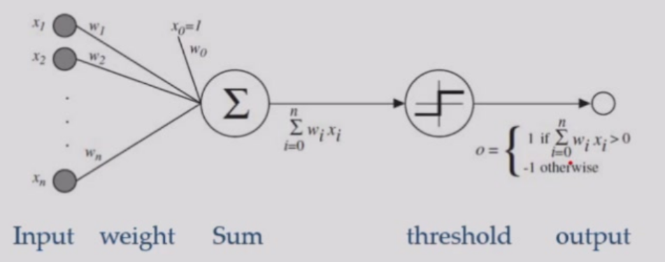  
#### perceptron  
If model predict $x$ correct,do nothing  
else,multiply $x$ by its label,let $w_t=w_{t-1}+xy$  
because if $w$ is a solution,for any $x$ in training set,$w^Txy>0$  
drawback:only capable of learning linearly separable functions  
e.g.Logical OR gate:input$(x_1,x_2)$,weight $w_0=0.5$ for $x_0$,$f(x)=x_1+x_2+0.5$  
Logical AND gate:$f(x)=x_1+x_2-1.5$  
XOR gate is impossible to be solved by a perceptron  
"The first AI winter"(1969)  
[Solution] multi-layer perceptrons(hidden layer)  
define a criterion function(loss function),then optimize the function  
If the model predicts wrongly,put the penalty $r=\frac{f(x)}{||w||},J(w)=-\sum_{i\in I_M}w^Tx_iy_i$,proportional to the sum of distances from misclassified samples to the decision boundary  
gradient descent:$\nabla J=\sum_{i\in I_M}-x_iy_i$  
start from $w=0$,$w(k+1)=w(k)+\eta(k)\sum_{i\in I^k_M}x_iy_i$,where $\eta$ is the learning rate  
## Lecture 10
batch learning:all samples are avaliable  
online learning/mini-batch learning:see samples one by one,faster and lower memory cost  
### Backpropagation
compute the weight  
  
forward:$z_k=f(\sum_j w_{kj}f(\sum_i w_{ji}x_i+w_{j0})+w_{k0})$  
penalty:$J$  
backward:$\Delta w=-\eta\nabla J=-\eta\frac{\partial J}{\partial w},\eta:learning\ rate$  
$w^{(t+1)}=w^{(t)}+\Delta w^{(t)}$  
$J=\frac{1}{2}\sum_{i=1}^c(t_k-z_k)^2$  
$net_j=\sum_{j=0}^dx_iw_{ji},net_k=\sum_{j=0}^{n_H}y_jw_{kj}$  
$\frac{\partial J}{\partial w_{kj}}=\frac{\partial J}{\partial z_k}\cdot\frac{\partial z_k}{\partial net_k}\cdot\frac{\partial net_k}{\partial w_{kj}}=(z_k-t_k)\cdot f'(net_k)\cdot y_j \\ \frac{\partial J}{\partial w_{ji}}=(\sum_{k=1}^c(z_k-t_k)\cdot f'(net_k)\cdot y_j)\cdot f'(net_j)\cdot x_i$  
$n_H$:number of hidden units,more complicated nonlinear functions  
[Kolmogorov] Any continuous function can be implemented in a three-layer net with sufficient number of $n_H$,proper nonlinearities(activation function) and weights  
$n_H=2n+1$ 
### Neural Net models
Net topology,Node(processor) characteristic,optimization rules  
"The second AI winter"(1997):SVM > neural network  
CIFAR  
why not go deeper?  
vanishing gradient,expensive computation,no need(SVM,MNIST:0.56%)  
2006:pre-train  
2007:GPU  
2009:ImageNet  
Because the nueral networks are too expressive,the more training data you feed,the less prone to overfitting the neural network will be.  
### Activation Function
If no $f$,the neural network degrade to one-level,$f$ must be some nonlinear operation  
## Lecture 11
Lab(numpy)  
## Lecture 12
### quiz  
  
$f$ must be non-linear and saturate(have max/min bound),activation function and its derivative must be continuous and smooth;optimally monotonic  

- sigmoid:$\sigma(x)=\frac{1}{1+e^{-x}}$  
- tanh:$t(x)=\frac{e^x-e^{-x}}{e^x+e^{-x}}=2\sigma(2x)-1$,rescaled and shifted sigmoid for better gradient performance  

**vanishing gradient**:$f'(net_4)*f'(net_3)*f'(net_2)*f'(net_1)\rightarrow 0,f'(net_i)<1$  
[Solution] RevoLUtion/Rectified Linear Unit:$ReLU(x)=max(0,x)$  
Spare representation:half of neurons are silence  
[Problem] overfitting  
[Solution] dropout:in every iteration,every neuron has a chance $p$ to be ignored,acting as if it is dead or does not exist.And during the test phase,all nodes all activated    
## Lecture 13
### Net topology & CNN
images -> too many parameters  
e.g. using a fully connected network to solve 200 * 200 images,40000 units in first hidden layer,we need $200^4=1.6\ billion$ parameters  
[Solution] Convolutional Neural Network(CNN)  
hidden units are only connected to local receptive field(convolution kernel)  
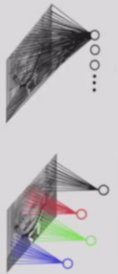  
Convolution:more in Introduction to Computer Vision  
weight share:the parameters in the kernel are same when scanning the whole picture  
e.g.32 * 32 * 3 image using 5 * 5 * 3 filter,we get a 28 * 28 * 1 activation map  
we use 6 such filters,we get 28 * 28 * 6 map  
ConvNet is a sequence of convolutional layers,interspersed with activation functions  
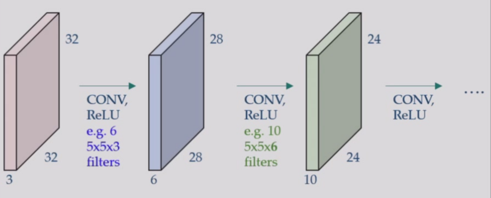  
Because weight is shared,gradient is shared too  
stride:step size  
Receptive field感受野:a pixel containes the information of how many pixels in input  
e.g.3 * 3kernel,the receptive field is 3 * 3,then apply another 3 * 3kernel,the receptive field becomes 5 * 5  
large receptive field can be achieved by deeper layer,convolution with larger stride and pooling layers  
layer close to input:small receptive fields,simple  
layer close to output:large receptive fields,complex feature,more semantic information  
FC layer:3D tensor -> vector  
pooling:max pool,average pool  
pooling layer makes the representations smaller and more manageable,operates over each activation map independently  
LeNet-5:the first successful application of CNN(for check validation)  
AlexNet:The first work that popularized CNN in the field of CV with 60M parameters  
softmax:normalization  
ZFNet:using deconvnet to reconstruct an approximate version of the convnet features from the layer beneath  
VGGNet(VGG-16/19):deeper layers  
Inception/GoogLeNet:filter concatenation(combining many convolution operations and pooling operations)  
ResNet:a stack of many residual blocks,deal with vanishing and exploding gradient problems,a deep learning model can be actually deeeeeeeeep  
  
## Lecture 14
Lab(pytorch)  
## Lecture 15
### Natural Language Processing
Varying size input(`nn.linear(fixed_size)`) and order  
sequence modelling:  
Language Modelling(LM) is the task of predicting what the word comes next  
$P(x^{(t+1)}|x^{(t)},...,x^{(1)})$  
#### Recurrent Neural Networks(RNN)
递归/循环神经网络  
[Problem] The ability of receiving many many tokens are relatively weak(compared to Transformers in Lecture 16)  
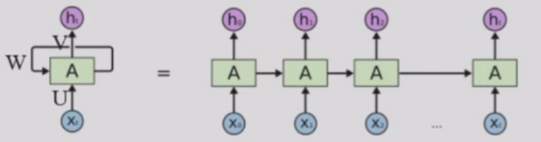  
$A_t=tanh(Ux_t+wA_{t-1})\\h_t=softmax(VA_t)$  
softmax:output layer -> probability(for sampling),$softmax=\frac{e^{z_i}}{\sum_{j=1}^Ke^{z_j}}$  
RNN can process any length input;in theory it can use the info from many steps back;model size doesn't change for longer input;same weights applied on every timestep  
RNN cannot work in parallel and in practice,it's difficult to access info many steps back  
Backpropagation Through Time(BPTT)  
loss:$E_t(y_t,\hat{y_t})=-y_t\log \hat{y_t}$  
$E_{all}(y,\hat{y})=\sum_tE_t(y_t,\hat{y_t})$  
$\frac{\partial E_{all}}{\partial W}=\sum_t\frac{\partial E_t}{\partial W}$  
$\frac{dE_3}{dW}=\sum_{k=0}^3\frac{\partial E_3}{\partial \hat{y_3}}\frac{\partial \hat{y_3}}{\partial s_3}\frac{\partial s_3}{\partial s_k}\frac{\partial s_k}{\partial W}$  
vanishing gradient at the first layer  
solution:a better initialization;ReLU(exploding);LSTM  
## Lecture 16
### LSTM
LSTM(Long Short-Term Memory):a separate cell memory with gates(forget is allowed)  
Gated Recurrent unit  
A LSTM unit in composed of a cell state,a hidden state and three control gates(input,output and forget gate).The cell stores long-term info and LSTM can erase,write and read info from cell  
  
forget gate:$f_t=\sigma(W_f\cdot[h_{t-1},x_t]+b_f)\in[0,1]$  
  
- input:previous hidden state $h_{t-1}+$current token $x_t$ 
- output$f_t=0\rightarrow$ erase some info  

forget gate controls the memory of previous info  
input gate:
$$
\begin{aligned}
i_t&=\sigma(W_i\cdot[h_{t-1},x_t]+b_i)\\\tilde{C_t}&=tanh(W_C\cdot[h_{t-1},x_t]+b_C)
\end{aligned}
$$  
$i_t$ controls which part of $\tilde{C_t}$ is added to $C_t$  
input gate controls the inclusion of input token  

Integration:$C_t=f_t*C_{t-1}+i_t*\tilde{C_t}$  
output gate:  
$$
\begin{aligned}
o_t&=\sigma(W_o\cdot[h_{t-1},x_t]+b_o)\\
h_t&=o_t*tanh(C_t)
\end{aligned}
$$

output gate forms the new hidden layer $h_t$  
LSTM architecture makes it easier for RNN to preserve info over many timesteps(e.g.forget gate=1,input gate=0)  
LSTM does not guarantee that there's no vanishing/exploding gradient,but it provides an easier way for the model to learn long-distance dependencies  

### RNN types
one-to-one:MLP(Multi-Layer Perceptron)  
one-to-many:article generation  
many-to-one:emotion analysis,article classification  
many-to-many(input length$\neq$output length):machine translation  
many-to-many(input length$=$output length):Name Entity Recognition(NER)人名,书名,地名识别  
many-to-many RNN:encoder(input)-decoder(output)  
### Attention Mechanism
sequence-to-sequence(seq-to-seq) model:encoder -> context vector -> decoder  
[problem] easy to forget the first part when the sequence is long(information bottleneck)  
[solution] attention scores:dot product of output token & current read input  
  
an attention function can be described as mapping a query and a set of key-value pairs to an output  
$Attention(Q,K,V)=softmax(\frac{QK^T}{\sqrt{d_k}})V$  
$K$:index,$V$:content,$\sqrt{d_k}$:dividing the dimension to make the variance = 1     
### Transformer
originally used for translation  
Transformer is another encoder-decoder model based solely on attention mechanisms that dispense with RNN entirely  
self-attention(for understanding)encoding:$Attention(V,V,V)$ replaces the recursion(no order,can work in parallel)  
position encoding using sine/cosine/ROPE  
residual connection between layers(idea from ResNet)  
encoder-decoder attention(cross attention):$Attention(Q,V,V)$  
multi-head attention:each head specializes on different fields  
  

## Lecture 17
Encoder does not exist in today's GPT,QWEN,...  
MFU:model flops utilization，GPU算力的利用程度  
### BERT
BERT(Bidirectional Encoder Representations from Transformers) is a pre-trained language model based on Transformer  
MLM(Masked Language Model pretraining task):mask 15\% of the words and predict  
BERT can tackle a broad set of NLP tasks(general purpose) by applying a pre-training and fine-tuning(only learn the last layer) approach  
BERT proves that transformer can scale.Scaling can achieve AGI.(Artificial General Intelligence)  
downstream tasks solved by BERT:  
MNLI(Multi-Genre Natural Language Inference):判断前提和假设的逻辑关系  
NER(Named Entity Recognition)  
SQuAD(Stanford Question Answering Dataset):完型填空  
...  
### Batch Normalization
ICML:Test of Time Award(2025.7)  
Batch normalization is a special layer that can alleviate exploding gradient and vanishing gradient(by controlling the output range of each layer)  
a basic building block of neural networks consists:Conv -> BN -> ReLU  
With the help of BN,gradients distribute more concentrated  
normalize:  
$$
\hat{x}^{(k)}=\frac{x^{(k)}-E[x^{(k)}]}{\sqrt{Var[x^{(k)}]}}
$$
The normalization constrain the expressiveness of DNN,but if we amplify $w$ with $\gamma$,increase $b$ with $\beta$,normalization of $y$ stays the same($\gamma,\beta$ is learned by DNN)  
$$
\hat{x}^{(k)}=\gamma \times \frac{x^{(k)}-E[x^{(k)}]}{\sqrt{Var[x^{(k)}]}}+\beta
$$
How to compute E and Var:sample a batch of images for each iteration,then adopt exponentially decaying to make E and Var stable during training  
$$
\hat{E}[x^{(k)}]_{iter+1}=0.9 \times \hat{E}[x^{(k)}]_{iter}+0.1\times \frac{1}{m}\sum_{i=1}^mx^{(k)}_i
$$
### Data Augmentation
Data Augmentation is a common way to enlarge dataset and avoid overfitting  
common methods:crop(裁剪) and resize,flipping,saturation(饱和度),rotate,luminosity(亮度)  
The label does not change  
### Neural Network Pruning
deploying CNNs on resources-restricted mobile devices is challenging  
pruning:delete unimportant components in nerual networks -> less parameters and less computations  
universal pipeline:get a (pre)trained model -> prune unimportant components -> fine-tune the model  

- weight-level pruning:  
  - set unimportant weights to 0  
  - cut down parameters directly  
- filter-level pruning:  
  - pruning unimportant filters(feature maps)  
  - cut down parameters and computations directly  
- layer-level pruning:  
  - pruning redundant layers(blocks)  
  - cut down parameters and computations directly  

#### weight-level
set (often) small weights to 0 -> sparse matrix -> Huffman coding for easy compression,cuSPARSE for faster computing  
#### filter-level
filters with small $l_p$ norm are unimportant  
feature maps with small mean activation values are unimportant  
filters expressing similar information(linear corrrelation,cosine similarity) are unimportant  
#### layer-level/block-level
prune unimportant blocks  
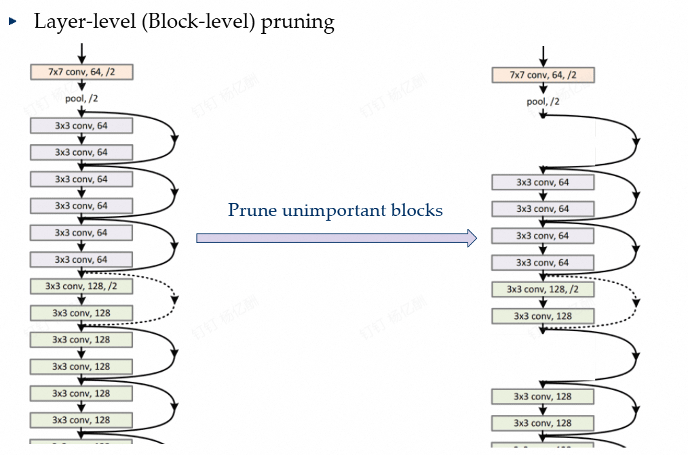  

### Generative Adversarial Networks(GAN)
Given data $\left\{x_i\right\}_{i\in I}$ sampled from real distribution $p(x)$  
We want to sample new data $x\sim p(x)$  
building a sampler:understand the underlying distribution of data points:output samples similar but not the same as training data samples,representative of the underlying factors of variation in the training distribution  
sample $z$ from a fixed noise prior distribution(uniform or Gaussian)  
Pass the noise $z$ through a generator $G$ and output $G(z)$  
GAN idea:use another network D,called the discriminator to classify the generated data and the real data  
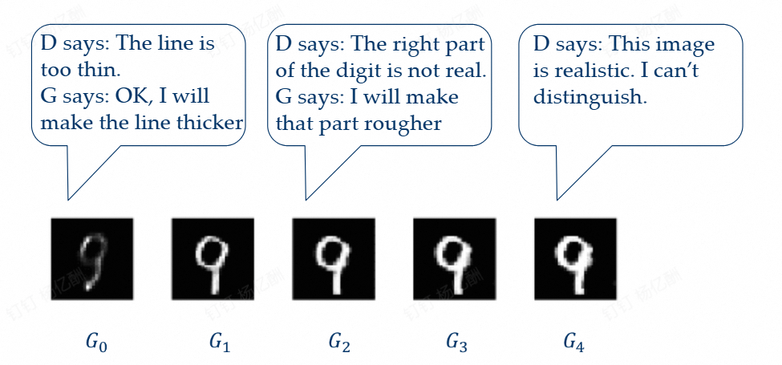  
Finally,D is deprecated(the output of any input is 0.5)  
In real GAN,the suggestion of D is actually the gradient of the generated sample  
D and G converges at a Nash Equilibrium  
training process:A minimax game between G and D  
objective function of G:
$$
min_Gmax_D\mathbb{E}_{x\sim p_{data}}[\log D(x)]+\mathbb{E}_{z\sim p_z}[\log (1-D(G(z)))]
$$
$D(x)\in[0,1]$:confidence,$p_{data}$:real data distribution,$p_z$:prior distribution of noise(often Gaussian)  
D tries to maximize the log-likelihood for the binary classification(output $1$ for real data and output $0$ for generated data)  
G tries to minimize the log-probability of its samples being classified as "fake" by D  
cheat:G gets the gradient from D and uses the opposite of the gradient for training  
BigGANs(2019):采样$z_1,z_2$，线性插值，输入空间的线性操作->语义空间的平滑转化(流形结构)  

### *Diffusion
forward:add noise  
backward:eliminate the noise  
generate images from a complete random noise  
stable training process  

## Lecture 18
### Adversial Attacks and Defense
Adding a small shift onto the input image can completely change the prediction of DNN on purpose  
$x + v = x'$  
$x'$:adversial samples  
#### attack
[Target] finding $v$  
find $v=\Delta x$ that makes the prediction wrong,$\iff v=\Delta x$ increases the loss $l$  
attack algorithm:  
training process:$\Delta\theta=-lr\times\frac{\partial l}{\partial \theta},lr:learning\ rate$  
$v=\Delta x=\epsilon\times\frac{\partial l}{\partial x},x:input$  
Threat model:visible parameters $\theta$  
However,the attacking $x'$ computed on network A can be transferred to B even if we don't know the parameters of B  
White-Box attack:full access to the entire model  
Black-Box attack:no access to target model B,only have access to model A  
#### defense 
correctly classify $x'\rightarrow$ train with $x'$  
Adversial training  
Repeat:  
1. in each iteration of training,we first attack the model to get $x'$  
$$
x'=x+\epsilon\times\frac{\partial l}{\partial x}
$$
2. compute loss value given $x'$:  
$$
L'=CrossEntropy(\theta,x',y)
$$
3. minimize $L'$  
$$
\Delta\theta=-lr\times\frac{\partial L'}{\partial\theta}
$$
### Neural Network Architecture Search(NAS)
For manually designed blocks,they are often empirical or even random choices,but the question is,are they good enough?  
NAS:a NN = a directed acyclic graph(densely connected),edges represents operations like ReLU,conv;nodes represents input and output,and we want to determine the best operation between each two nodes  
candidate operations:3x3 conv,5x5 conv,pooling,etc.  
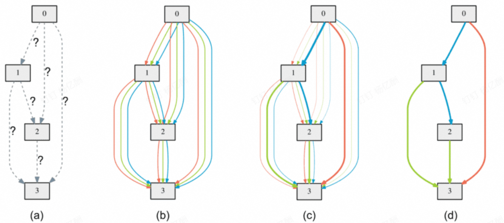  

### Combining Models(Ensemble Methods)
#### Bagging(Bootstrap Aggregating)
1.re-sample N samples from dataset D uniformly with replacement(放回采样)  
2.aggregating:voting for classification/average for regression  
large performance when the base learner is unstable(large variance)  
The base learner should be aware of the small shifts,overfitting is allowed  
Bagging effectively reduces the higher-order components while not affecting the linear components.Bagging is better applied with highly nonlinear learners.  
**Decision Tree** is a good choice:non-linear,easy to use and easy to overfit  
#### Random Forest
use decision tree as a basic unit in bagging  
1. Bootstrap sampling:random sampling with replacement  
2. create T new training sets  
3. get T models  

increase the variation of each tree:double randomization  
1.random sampling  
2.randomized feature selection(subset $f$ out of $F$) at each split step  
Construction:no pruning,stop until validation error never decrease  
parallel ensemble
#### Boosting
sequential ensemble method:modify the weight of different training samples and generate a model on the modified training set  
boosting process:increase the weight of misclassified samples per step  
##### AdaBoost
1. Initialize the weight coefficient $w$ by setting $w_n^{(i)}=1/N$  
2. For $m=1,...,M$:
(a) Fit a classifier $y^{(m)}(x)$ to the training data by minimizing the weighted error function  
$$
J_m=\sum_{n=1}^Nw_n^{(m)}I(y^{(m)}(x_n)\neq t_n)
$$
(b) Evaluate the Error-rate:  
$$
\epsilon_m=\frac{\sum_{n=1}^Nw_n^{(m)}I(y^{(m)}(x_n)\neq t_n)}{\sum_{n=1}^Nw_n^{(m)}}
$$
$$
\alpha_m=\ln\frac{1-\epsilon_m}{\epsilon_m}
$$
$\alpha_m$:log odds,smaller the error rate,bigger the value  
(c) Update weight coefficients:($t_n\in\left\{1,-1\right\}$)  
$$
\begin{aligned}
w_n^{m+1}&=w_n^{(m)}\exp\left\{\alpha_mI(y^{(m)}(x_n)\neq t_n)\right\}=\begin{cases}w_n^{(m)}\frac{1-\epsilon_m}{\epsilon_m},if\ y^{(m)}\ makes\ error\\w_n^{(m)},otherwise\end{cases}\\
w_n^{m+1}&=w_n^{(m)}\exp\left\{-\frac{1}{2}\alpha_mt_ny^{(m)}(x_n)\right\}
\end{aligned}
$$
3. Make predictions using the final model  
$$
Y_M(x)=sign(\sum_{m=1}^M\alpha_my^{(m)}(x))
$$
weight coefficient $\alpha_m$ gives weight to more accurate classifiers  

[Insights] In each round,the algorithm tries to get a **different base learner**  
If $g_m=minJ_m$ is not good for $w^{(m+1)}\Rightarrow g_{m+1}=minJ_{m+1}$ diverse from $g_m$  
[Idea] construct $w^{(m+1)}$ to make $g_m$ random-like:  
$\frac{\sum_{n=1}^Nw_n^{(m+1)}I(y_n^{(m)})\neq t_n}{\sum_{n=1}^Nw_n^{(m+1)}}=\frac 1 2\Rightarrow w_n^{(m+1)}=w_n^{(m)}\frac{1-\epsilon_m}{\epsilon_m},if\ wrong$  
[Insights] Adaboost can be seen as a sequential optimization process of an additive model under exponential error  
#### Gradient Boosting Decision Tree(GBDT)
CART(regression tree):$(j,s)$ pair for region splitting  
GBDT:each time predict the remaining data and summation all the models  
Initialize:$f_0(x)=0$  
For $m=1,2,...,M$
  - Compute the residual:$r_{mi}=y_i-f_{m-1}(x_i)$  
  - Treat $r_{mi}$ as $y_i$ and learn a regression tree $h_m(x)$  
  - Update $f_m(x)=f_{m-1}(x)+h_m(x)$  

Final model:$f_M(x)=\sum_{m=1}^Mh_m(x)$  

*useful extensions:XGBoost,LightGBM  

## Lecture 19
### K-Nearest Neighbor Classifier(KNN)
require three things:  
- stored records  
- Distance Metric  
- The value of k  

classify:  
- compute distance  
- identify k nearest neighbor
- majority voting  

no parameters in KNN(k is not learnt,k is a hyperparameter):lazy-classifier/no training  
Effective number of parameters:N/k  

*distance that is difficult to compute:social network -> K-medoids中心点算法  

### Metric Learning
object comparison:not all features are equally important  
[Definition] learn a metric M that better distinguishes different classes given the real data  
$$
\rho_M(x,y)=\sqrt{(x-y)^TM(x-y)}
$$
new inner product  
Optimization problem:similar set S,dissimilar set D  
$$
large\ \rho\ for\ D \\
small\ \rho\ for\ S 
$$
minimize loss function:  
$$
L(M)=\sum_{(x,x')\in S}\rho_M^2(x,x')-\lambda\sum_{(x,x')\in D}\rho_M^2(x,x')
$$
#### MMC(Mahalanobis Metric for Clustering)
Find the best metric M for clustering based on optimization  
$$
min_{M\in\mathbb{R}^{d\times d}}\sum_{(x_i,x_j)\in S}\rho_M^2(x_i,x_j),s.t.\sum_{(x_i,x_j)\in D}\rho_M(x_i,x_j)\ge 1,M\succeq 0
$$
(1) Why positive semi-definite of M?  
$\rho_M(x,y)$ non-negative  
(2) Why $\sum_{(x_i,x_j)\in D}\rho_M(x_i,x_j)\ge 1$ instead of $\rho_M^2(x_i,x_j)$  
Rayleigh-quotient will reduce the problem to single dimension(Derivation is omitted)  
Application:无监督表征学习，对比学习  
### AKNN Search
high-dimensional sample:$O(N)$ for each test data(Brute-force search)  
Text-search:inverted-file index  
Image:SIFT,HoG,GIST  
CNN  
CLIP:对比学习pre-training  
Given a dataset D consists of n d-dim data points  
finding the nearest neighbor of a query:$O(nd+n)$  
finding the k nearest neighbor:$O(nd+klogn)$  
$\epsilon$-approximate nearest neighbor(ANN) search  
#### KD-tree
Spatial partition and recursive hyperplane decomposition  
  
Worst:$O(n)$,Best:$O(logn)$  
*flann  
Locality Sensitive Hashing(LSH)  
$$
h(x)=sgn(w^Tx-b)
$$
Quantization based(FAISS in Facebook)  
Graph based:neighbor's neighbor is likely the neighbor  
weighted KNN  
density distance:Gaussian kernel $d=exp((x_1-x_2)^2/\sigma^2)$  
## Lecture 20
### quiz
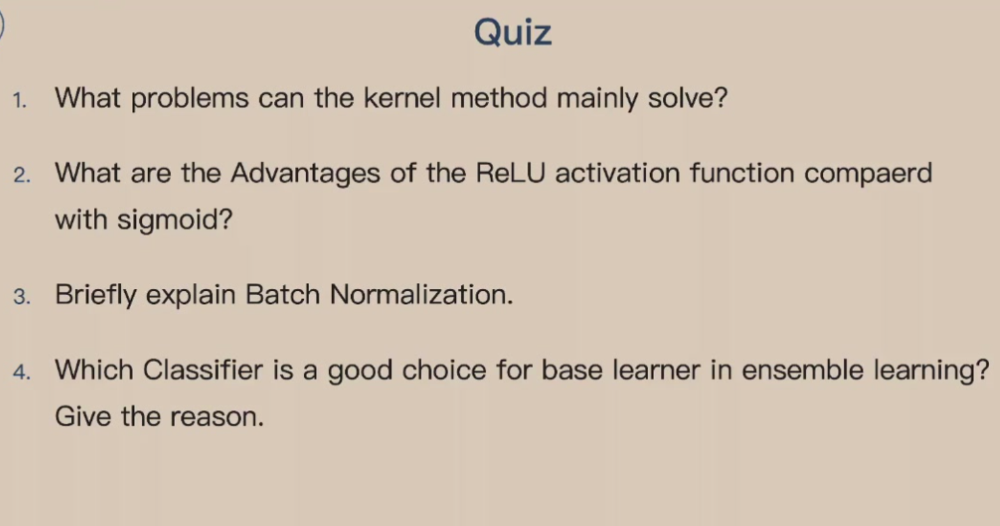  
Lab(Transformer)  

## Lecture 21 
### Reinforcement Learning
AlphaGo(2016)by Google Deepmind,GPT-o1(2024)by Openai  
agent-environment interaction:action:$A_t$,reward:$R_t$,state:$S_t$  
agent:learner and decision-maker  
environment:interact with  
reward:special numerical values the agent try to maximize  
state:any useful information for making action  
action:can be discrete(Go) or continuous(VLA,Vision-Language-Action model),a $softmax$ is needed  
training data:State-Action-Reward:(S,A,R)  
problem:number of training samples,it may be too hard to get a reward R  
[goal] optimal policy for maximizing long-term reward  
[feature] multistage decisionmaking process(Markovian);learn by trial-and-error;delayed effect  
elements:policy $\pi(s)$(map from state to action,may be stochastic);reward function;value function $v_{\pi}(s)$(total expected reward for a state or state-action pair)  
model:prediction of the environment(state change)(model-free and model-based)  
[Solution] value iteration and policy iteration(dynamic programming);Q-learning  
#### Markov Decision Process(MDP)
policy:$\pi(a|s)$:the probability that $A_t=a,if\ S_t=s$  
reward hypothesis:the goal is to maximization of the expected value of the cumulative sum of reward(optimal policy corresponds to the max reward)  
returns:$G_t$:cumulative sum of reward  
episodic task:after some special states the interaction should stop,$G_t=R_{t+1}+R_{t+2}+...+R_T,T$ is the time of the final state  
continuous task:$G_t=\sum_{k=0}^{\infty}\gamma^kR_{t+k+1},0\le\gamma<1,\gamma:$discount rate  
[Property] Markov(finite):interaction history $\left\{S_0,A_0,R_1,...,S_{t-1},A_{t-1},R_t,S_t,A_t\right\}$  
the probability of next state is $s'$ and next reward $r$:  
$$
Pr\left\{S_{t+1}=s',R_{t+1}=r|S_0,A_0,R_1,...,S_{t-1},A_{t-1},R_t,S_t,A_t\right\}
$$
The state has the Markov property if $\forall history,s',r$,we have:  
$$
\begin{aligned}
&Pr\left\{S_{t+1}=s',R_{t+1}=r|S_0,A_0,R_1,...,S_{t-1},A_{t-1},R_t,S_t,A_t\right\}=\\
&Pr\left\{S_{t+1}=s',R_{t+1}=r|S_t,A_t\right\}
\end{aligned}
$$
dynamics:$p(s',r|s,a)=Pr\left\{S_{t+1}=s',R_{t+1}=r|S_t,A_t\right\}$  
expected reward for state-action pairs:  
$$
r(s,a)=\mathbb{E}[R_{t+1}|S_t=s,A_t=a]=\sum_rr\sum_{s'}p(s',r|s,a)
$$
state-transition probabilities:  
$$
p(s'|s,a)=Pr\left\{S_{t+1}=s',R_{t+1}=r|S_t,A_t\right\}=\sum_rp(s',r|s,a)
$$
state value function for policy $\pi$:  
$$
v_{\pi}(s)=\mathbb{E}_{\pi}[G_t|S_t=s]=\mathbb{E}_{\pi}[\sum_{k=1}^{\infty}\gamma^kR_{t+k+1}|S_t=s]
$$
action(state-action) value function for policy $\pi$:  
$$
\begin{aligned}
q_{\pi}(s,a)&=\mathbb{E}_{\pi}[G_t|S_t=s,A_t=a]\\
&=\mathbb{E}_{\pi}[\sum_{k=1}^{\infty}\gamma^kR_{t+k+1}|S_t=s,A_t=a]
\end{aligned}
$$
## Lecture 22
1. massive rollouts for data collection  
2. estimate $v$ and $q$ using the neural network  
3. map them to the policy $\pi$  

Bellman equation(relationship of $v$ and $q$):   
$$
\begin{aligned}
v_{\pi}(s)&=\mathbb{E}_{\pi}[q_{\pi}(s,A_t)|S_t=s]=\sum_a\pi(a|s)q_{\pi}(s,a)\\
q_{\pi}(s,a)&=\mathbb{E}_{\pi}[R_{t+1}+\gamma v_{\pi}(S_{t+1})|S_t=s,A_t=a]\\
&=\sum_{s',r}p(s',r|s,a)(r+\gamma v_{\pi}(s'))\\
v_{\pi}(s)&=\sum_a(\pi(a|s)\sum_{s',r}p(s',r|s,a)(r+\gamma v_{\pi}(s')))
\end{aligned}
$$
optimal value/action function:optimal policy($\pi_*$ always exists)  
查S-A表(dynamic programming)  
e.g.The Grid World  
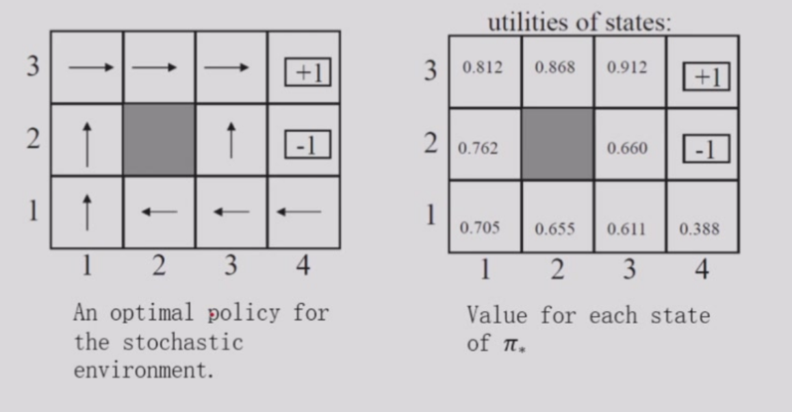  
$P=0.8$ in the direction you want to go,$P=0.2$ in perpendicular($0.1$ left,$0.1$ right),$-0.04$ each step,$\gamma=1$(default)  
start from $(1,3)$:  
$$
\begin{aligned}
v_{\pi}(s)&=\sum_a\pi(a|s)\sum_{s',r}p(s',r|s,a)(r+\gamma v_{\pi}(s'))\\
&=0.8*1*(-0.04+1*0.868)+0.1*1*(-0.04+1*0.812)+0.1*1*(-0.04+1*0.868)
\end{aligned}
$$
### Dynamic Programming
[Assumption] finite MDP,existing probabilities $p(s',r|s,a)$  
  
$v(s_t)=\mathbb{E}_{\pi}[R_{t+1}+\gamma v(s_{t+1})]$  
policy evaluation:iterative policy evaluation  
$$
v_{k+1}(s)=\sum_a(\pi(a|s)\sum_{s',r}p(s',r|s,a)(r+\gamma v_k(s')))
$$
Get the sequence of $\left\{v_k(s)\right\}$ using the Bellman equation until it converges to $\left\{v_{\pi}(s)\right\}$(it must converge if $k$ sufficiently large)  
policy improvement:For any pair of deterministic policies,$q_{\pi}(s,\pi'(s))\ge v_{\pi}(s)\iff v_{\pi'}(s)>v_{\pi}(s)$  
$\pi'(s)=argmax_a\sum_{s',r}p(s',r|s,a)[r+\gamma v_{\pi}(s')]$:greedy method  
Policy Iteration:  
(1) random initialization  
loop:  
(2) policy evaluation  
(3) policy improvement  

  
Value iteration(find the optimal $v_*(s)$ directly)  
$$
v_{k+1}(s)=max_a\sum_{s',r}p(s',r|s,a)(r+\gamma v_k(s'))
$$

### Monte Carlo Method
[Problem] the dynamics of the environment $p(s',r|s,a)$ is unclear  
[Solution] treat the unknown as expectation and estimate by sampling and averaging,$q_{\pi}(s,a)=\mathbb{E}[G_t]$,update value function by sampling return:  
$$
v(s_t)\leftarrow v(s_t)+\alpha(G_t-v(s_t))
$$
sufficient exploration is needed  
**exploring starts**:first state-action pair sampled from a distribution that every state-action has a non-zero probability  
evaluation:Monte Carlo for stable Q,then policy improvement and Monte Carlo estimation for new policy and so on ...  
how to treat return list $Returns(s,a)$ after policy improvement?  
constant-$\alpha$ MC:  
$$
Q(S_i,A_i)\leftarrow Q(S_i,A_i)+\alpha[G-Q(S_i,A_i)]
$$
$\alpha$ is a small constant number(often 0.1)  
## Lecture 23
### Temporal-Difference Learning
update the value function in only one step(no need to get return)  
$$
v(s_t)\leftarrow v(s_t)+\alpha[R_{t+1}+\gamma v(s_{t+1})-v(s_t)]
$$
biased,but converge much faster,sensitive to initial value  
TD error:$\delta_t=R_{t+1}+\gamma v(s_{t+1})-v(s_t)$  
Monte Carlo error can be written as a sum of TD errors  
TD is an online fashion:policy evaluation and improvement can be implemented together(evaluation one step then improvement then evaluation one step then improvement...) because it need not to wait until the end of an episode  
TD also better compatible with continuing tasks  
TD control methods:Sarsa and Q-learning  
### Sarsa
$\epsilon$-greedy policy:$1-\epsilon$ probability to $\pi(s)$,$\epsilon$ probability to all actions  
$$
Q(S_t,A_t)\leftarrow Q(S_t,A_t)+\alpha[R_{t+1}+\gamma Q(S_{t+1},A_{t+1})-Q(S_t,A_t)]
$$
on-policy:$\epsilon$-greedy for evaluation and improvement  
### Q-Learning
Ensure sufficient exploration without harming the optimality(错误的探索会被记住)  
off-policy:use another stochastic policy for training data generation  
exploitation is always fully-greedy:$\pi(s)=argmax_a Q(s,a)$  
$$
Q(S_t,A_t)\leftarrow Q(S_t,A_t)+\alpha[R_{t+1}+\gamma max_{a'}Q(S_{t+1},A_{t+1})-Q(S_t,A_t)]
$$
exploration vs exploitation:tradeoff  
note:DP is model-based,MC and TD are model-free  
### Deep Q-Learning
Beyond finite MDP
$$
Q(S_t,A_t)\leftarrow Q(S_t,A_t)+\alpha[U_t-Q(S_t,A_t)]
$$
$U_t$ is an approximation of $q_{\pi}(S_t,A_t)$  
$$
min_{\theta}\frac 1 2[U_t-\hat{q}(S_t,A_t,\theta)]^2
$$
Then use a NN,this is deep Q-Learning  
Experience replay:a memory pool of tuple $(s_t,a_t,r_t,s_{t+1})$ for the agent  
The batch size of SGD is only one(灾难性遗忘)  
### Double Q-Learning

## Lecture 24
### Policy Gradient Methods
The previous methods are frequently applied to gaming  
In real world,state information is not enough,Markov property does not hold  
The optimal policy may not be deterministic  
e.g. short corridor with switched actions  
If the agent can only choose to always move left or right,the reward is $-\infty$  
$$
\pi(a|s,\theta)=Pr\left\{A_t=a|S_t=s,\theta\right\}
$$
use state-action function $q$ as the objective function  
use gradient ascend $\nabla_{\theta}$ to optimize policy  
$$
\nabla v_{\pi}(s)=\sum_{k=0}^{\infty}\gamma^k\mathbb{E}[G_{t+k}\nabla\log\pi(A_{t+k}|S_{t+k})|S_t=s]
$$
REINFORCE(algorithm):   
```python
initialize 
repeat forever:
  generate an episode S_0,A_0,R_1,...,A_{T-1},R_T,S_T using \pi(a|s,\theta)
  set gradient g=0
  for k = 0,1,...,T-1:
    G_k = R_{k+1} + \gamma R_{k+2} + ... + \gamma^{T-k-1} R_T
    g = g + \gamma^kG_k\nabla_{\theta}\log\pi(A_k|S_k)
  \theta = \theta + \alpha *g
```
REINFORCE with baseline:  
baseline function:$b(s)$,a human perceived weight for each state gradient  
Actor-Critic methods:  
estimate policy gradient in TD style,use $R_{t+k}+\gamma\hat{v}(S_{t+k+1},w)$ to estimate $q$,use $\hat{v}(S_{t+k},w)$ as baseline  

### Dimensionality Reduction
feature engineering:a mapping from input $x$ to feature space $z$,where $dim(z)<dim(x)$  
$F(x)=\left\{f_1(x),...,f_d(x)\right\}=z$  
If $f$ is linear,$A^Tx=z$  
if $f$ is nonlinear,embedding function  
feature selection:best subset  
$A^Tx=z,where\ A\in[0,1]^{p\times d}$
feature extraction:given $x$,extract $z$  
unsupervised:PCA  
supervised:LDA  
semi-supervised:SDA  
non-linear:kernel method;manifold learning  
#### PCA
Principal Component Analysis(unsupervised)  
The new variables(principal component,PC) are uncorrelated  
[Definition] the first PC is $z_i^{(1)}=a_1^Tx_i,s.t.max\ var(z^{(1)})$  
$var(z^{(1)})=a_1^TSa_1,S=\frac 1 n \sum_{i=1}^n (x_i-\overline{x})(x_i-\overline{x})^T,S$ is the covariance matrix  
$max_{a_1} a_1^TSa_1,s.t.a_1^Ta_1=1$  
$L=a_1^TSa_1-\lambda(a_1^Ta_1-1)$  
$\frac{\partial L}{\partial a_1}=0\Rightarrow Sa_1=\lambda a_1$  
$a_1$ is the eigenvector of S corresponding to the largest eigenvalue $\lambda=\lambda_1$  
The second PC:$max_{a_2}a_2^TSa_2,s.t.a_2^Ta_2=1,cov(z^{(2)},z^{(1)})=0\Rightarrow \lambda_2$  
The kth PC is the kth largest eigenvalue of S:$\lambda^{(k)}$  
1. form the covariance matrix S
2. compute eigenvectors $\left\{a_i\right\}_{i=1}^p$  
3. use the first $d$ eigenvectors to form PCs  
4. $A=[a_1,...,a_d]$  

## Lecture 25
preprocess(normalization):$x'=\frac{x-\overline{x}}{\sigma}$  
optimality property:$min_A \|X-AA^TX\|_F^2,s.t.A^TA=I_d,\|X-\hat{X}\|_F^2$  
### Linear Discriminant Analysis(LDA)  
two classes:Rayleigh quotient,$S_W$:类内散度矩阵，$S_B$:类间散度矩阵  
$$
J(a)=\frac{a^TS_Ba}{a^TS_Wa}\iff S_W^{-1}S_B
$$
max eigenvalue of $S_W^{-1}S_B$ 
1. form the scatter matrices $S_B$ and $S_W$  
2. compute eigenvectors corresponding to non-zero eigenvalues of $S_Ba=\lambda S_Wa$ or $S_Ba=\lambda S_Ta$   
3. the transformation $A=[a_1,...,a_{c-1}]$  

!!! note "无论是PCA还是LDA，投影都必须与去中心化后的样本做内积"  

*Locality Preserving Projections(LPP)  
Regularization on LDA & LPP  
### Manifold Learning
[Definition] Manifold:topological space that locally resembles Euclidean space near each point  
Each point has a neighborhood that is homeomorphic(同胚) to the Euclidean space  
Multi-Dimensional Scaling(MDS):keep the data distance in the dimension-reduced space  
$Z=[z_1,z_2,...,z_n],B=Z^TZ$  
Given $B$,one possible $Z$ can be obtained through eigen-decomposition of $B$  

1. Input:Distance Matrix $D$  
2. Algorithm:
(1) compute $d_{i:}^2,d_{:j}^2,d_{::}^2$  
(2) compute inner product B
(3) eigen-decomposition on B
(4) select k biggest eigenvalues and obtain $\Lambda^{\frac 1 2}_*U^T_*$  
3. Output:k-dim data matrix Z  
#### ISOMAP
KNN graph -> distance between two points:shortest path distance on the graph  
1. define graph G,connect neighbor(closer $\epsilon$ or k nearest) points and define dege length = Euclidean distance  
2. compute shortest paths $d(x_i,x_j)$ on G  
3. Apply MDS on $d$ to find lower-dim embedding  
#### Locally Linear Embedding(LLE)
reconstruct neighbor with linear weights  
$J(W)=\sum_{i=1}^n\|x_i-\sum_jw_{ij}x_j\|^2,s.t.\sum_jw_{ij}=1$  
#### Robust PCA
PCA:$min\|X-L_0\|^2,subject\ to\ rank(L_0)\le k$  
$X=L_0 + S_0,S_0:$noise(sparse)  
Robust PCA:$minrank(L)+\lambda\|S\|_0,subject\ to\ L+S=X$(NP-hard)  
PCP surrogate error:$min\|L\|_*+\lambda \|S\|_1,subject\ to\ L+S=X$  
#### AutoEncoder
unsupervised NN(x -> z -> x')  
embedding:low-dim vector to represent an object  
word2vec:  
one-hot:(0,0,...,1,0,...,0)  
[idea] meaning is given by the words appear close-by  
Loglikelihood:  
$$ 
\log L(\theta)=\log \frac 1 T \Pi_{t=1}^T\Pi_{-m\le j\le m,j\neq 0}P(w_{t+j}|w_t;\theta)
$$

## Lecture 26
### Clustering
unsupervised learning task  
簇内相似度高，簇间相似度低  
external index:compare clustering result with reference model  
$a=|SS|,b=|SD|,c=|DS|,d=|DD|,S:$same,$D:$different  
$a+b+c+d=m(m-1)/2$  
Jaccard:$JC=\frac{a}{a+b+c}$  
FM:$FMI=\sqrt{\frac{a}{a+b}\cdot\frac{a}{a+c}}$  
validity index/internal index:DB,Dunn just base on cluster result  
distance:$dist_{mk}(x_i,x_j)=(\sum_{u=1}^n|x_{iu}-x_{ju}|^p)^{\frac 1 p}$    

- 原型聚类：K-means,LVQ,GMC  
- 密度聚类：样本分布紧密程度确定聚类结构  
- 层次聚类：不同层次数据集划分形成树形聚类结构  

#### 原型聚类
##### k-means
1. random select k samples as center  
loop:  
2. compute dist and cluster the data into k clusters  
3. update mean vector of each cluster and find new cluster centre  
4. stop until no cluster centre changes  

Q1:better random k samples selection:  
K-means++:choose the centers with large distance  
multiple-times K-means  
choose a centre,then choose the farthest,until we get k samples  
Q2:how to select k?  
draw SSE with multiple k,select the k with the lowest SSE  

##### Learning Vector Quantization,LVQ
labelled clustering  
modify center p:$p'=p_{i*}+(y_j==t_{i*}?1:-1)\eta\cdot(x_j-p_{i*})$  
##### Gaussian Mixture Clustering,GMC
Assume each cluster is a Gaussian distribution  
$p_M(x)=\sum_{i=1}^k\alpha_i\cdotp(x|\mu_i,\Sigma_i)$  
Then learn the parameters based on maximum likelihood  
EM algorithm:  
E. compute post-probability $\gamma_{ji}=p_M(z_j=i|x_j)$  
M. update model parameters $\left\{(\alpha_i,\mu_i,\Sigma_i)|1\le i\le k\right\}$  

#### 密度聚类
##### DBSCAN
核心对象:$x_j$的$\epsilon$-邻域包含样本足够多  
密度直达，密度可达，密度相连  
  

#### 层次聚类
##### AGNES(AGglomerative NESting)

1. 每个样本一个簇  
2. 合并最近的两个簇  
3. 直到所有样本都属于一个簇  
output: tree hierarchy  

### feature selection
search candidate subset -> evaluation -> next candidate  
search:前向搜索（逐步添加），后向搜索（逐步删除），双向搜索  
evaluation:entropy(similar to ID3)  
#### 过滤式选择
Relief(Relevant feature):a relevant statistics for each feature to measure its importance  
near-hit:同类样本最近邻$x_{i,nh}$  
near-miss:异类样本最近邻$x_{i,nm}$  
relevant statistics:$\delta^j=\sum_i-diff(x_i^j,x_{i,nh}^j)^2+diff(x_i^j,x_{i,nm}^j)^2$,near-hit比near-miss越近，属性$j$越有用   
#### 包裹式选择
将学习器性能作为特征子集的评价准则  
LVW(Las Vegas Wrapper)：随机子集搜索 -> RL  
#### 嵌入式选择
训练过程自动选择特征（LASSO）  

### sparse encoding
dictionary learning:find a code mapping from dense representation to sparse representation  
dictionary:$B$,sparse representation:$\alpha_i\in\mathbb{R}^k$  
where $k$ is the token number in the dictionary  
$$
min_{B,\alpha_i}\sum_{i=1}^m\|x_i-B\alpha_i\|_2^2+\lambda\sum_{i=1}^m\|\alpha_i\|_1
$$
*VQVAE  
#### compressive sensing  
[Goal] reconstruct original signal from compressive data  
$y=\Phi x,y$ of length $n,x$ of length $m,n<<m$  
$\exists \Psi\in \mathbb{R}^{m\times m},x=\Psi s,y=\Phi\Psi s=As$  
restore $x\iff min_s\|s\|_0,s.t.y=As$  
transformation to L1 norm problem then apply LASSO:  
$min_s\|s\|_1,s.t.y=As$  
矩阵补全:$min_Xrank(X),s.t.(X)_{ij}=(A)_{ij},(i,j)\in\Omega$,where $A$ is the original matrix(to be restored),$\Omega$ is the index of observed elements  
## Lecture 27
### Semi-supervised learning
labeled sample $D_l$ and unlabeled samples $D_u$ both exist $l<<u$  
聚类假设：数据存在簇结构，同一簇属于同一类别  
流形假设：数据分布在流形上，邻近样本输出相似  
active learning:first train on labeled samples and get confidence;then find important unlabeled samples and label them manually     
纯半监督学习，直推学习（pseudo label）  
#### 生成式方法
假设样本由高斯混合模型生成，每个类别对应一个高斯混合成分 $p(x)=\sum_{i=1}^N\alpha_i\cdot p(x|\mu_i,\Sigma_i)$  
利用极大似然估计高斯混合模型的参数  
solution:EM algorithm  
#### 半监督SVM
S<sup>3</sup>VM:tries to separate the labeled samples and cross the low-density data area  
TSVM:find the largest margin classfier by regarding each of all the unlabeled samples as positive or negative    
#### 图半监督学习
样本对应节点，边表示相似度  
能量函数$minE(f)=\frac 1 2 \sum_i\sum_j(W)_{ij}(f(x_i)-f(x_j))^2=f^T(D-W)f,D_{ii}=\sum_jW_{ij},f=(f_l^Tf_u^T)^T,D-W:$拉普拉斯矩阵，图结构的平滑性  
$\nabla f=0\Rightarrow f_u=(D_{uu}-W_{uu})^{-1}W_{ul}f_l$  
样本在$W$上越接近，预测结果$f$要尽可能接近  
概率转移矩阵$P=D^{-1}W$  
#### 基于分歧disagreement的方法
属性集，视图  
相容性：不同视图输出信息一致  
1. 在每个视图上基于有标签的样本分类分类器  
2. 在每个视图挑选最有把握的未标记样本标记作为另一个视图的学习样本  
3. 互相学习、共同进步  

#### 半监督聚类 
must-link set M,cannot-link set C to constrain k-means  
## Lecture 28
### 概率图模型
#### 隐马尔可夫模型(HMM)
概率模型：描述框架，将学习任务归结为概率计算  
关系变量Y,可观测变量O，其他变量R，生成式模型考虑$P(Y,R,O)$,判别式模型考虑$P(Y,R|O)$，推断$P(Y|O)$  
状态变量/隐变量，观测变量  
例：$P(Rainy)=0.6,P(Sunny)=0.4,P(Rainy|Rainy)=0.7,P(Sunny|Rainy)=0.3,P(Rainy|Sunny)=0.4,P(Sunny|Sunny)=0.6,P(walk|Rainy)=0.1,P(shop|Rainy)=0.4,P(clean|Rainy)=0.5,P(walk|Sunny)=0.6,P(shop|Sunny)=0.3,P(clean|Sunny)=0.1$  
[Problem] Given the activity the person does,predict the weather  
概率图模型：变量关系图，节点表示随机变量，边表示概率关系  
有向无环图：贝叶斯网，无向图：马尔可夫网  
马尔可夫链：现在决定未来（马尔可夫性）  
$$
P(x_1,y_1,...,x_n,y_n)=P(y_1)P(x_1|y_1)\Pi_{i=2}^nP(y_i|y_{i-1})P(x_i|y_i)
$$
状态转移概率$A=[a_{ij}]_{N\times N},a_{ij}=P(y_{t+1}=s_j|y_t=s_i$  
输出现测概率$B=[b_{ij}]_{N\times M},b_{ij}=P(x_t=o_j|y_t=s_i)$  
初始状态概率$\bold{\pi}$  
维特比算法:  
1. 初始化：$\delta_1(i)$  
2. 递推：逐步计算每个$t$时刻最大概率$\delta_t(j)$,记录路径$\psi_t(j)$  
$$
\delta_t(j)=max_{1\le i\le n}[\delta_{t-1}(i)a_{ij}]b_j(x_t)
$$
$$
\psi_t(j)=argmax_{1\le i\le n}[\delta_{t-1}(i)a_{ij}]
$$
3. 终止  
$$
y_n=argmax_{1\le i\le n}\delta_n(i)
$$
$$
P^*=max_{1\le i\le n}\delta_n(i)
$$
4. 回溯
$$
y_t=\psi_{t+1}(y_{t+1})
$$
#### 马尔可夫随机场(MRF)
无向图+势函数/因子（定义概率分布函数）  
$\psi_{AC}(x_A,x_C)=\begin{cases}1.5,if\ x_B=x_C\\0.1,otherwise\end{cases}$  
势函数常用指数定义$\psi_Q(x_Q)=e^{-H_Q(x_Q)},H_Q(x_Q)=\sum_{u,v\in Q,u\neq v}\alpha_{uv}x_ux_v+\sum_{v\in Q}\beta_vx_v$  
团，极大团定义同fds  
多个变量的联合概率分布为所有极大团势函数的乘积的归一化  
$P(x)=\frac 1 Z\Pi_{Q\in\mathcal{C}}\psi_Q(x_Q)$  
分离集：两个结点集A,B，A到B必须经过集合C，则A和B被C分离  
全局马尔可夫性：给定两个变量子集的分离集，两个子集条件独立  
#### 条件随机场(CRF)
给定观测值后的条件概率建模，e.g.词性标注，语法分析  
条件随机场：图G满足马尔可夫性$P(y_v|x,y_{V\backslash\left\{v\right\}}=P(y_v|x,y_{n(v)},n(v):$neighbor of $v$  
条件概率，转移特征，状态转移类似MRF与HMM的结合  
#### 学习与推断
变量消去：$P(x_5)=\sum_{x_4}\sum_{x_3}\sum_{x_2}\sum_{x_1}P(x_1,x_2,x_3,x_4,x_5)\stackrel{Markov\ property}{=}\sum_{x_4}\sum_{x_3}\sum_{x_2}\sum_{x_1}P(x_1)P(x_2|x_1)P(x_3|x_2)P(x_4|x_3)P(x_5|x_3)=\sum_{x_3}P(x_5|x_3)\sum_{x_4}P(x_4|x_3)...=...=m_{35}(x_5):$message from 3 to 5    
无向图：概率由势函数表示  
#### 近似推断
##### MCMC采样
$$E_p[f]=\int f(x)p(x)dx$$
$$\hat{f}=\frac 1 N \sum_{i=1}^N f(x_i)$$
纯蒙特卡洛采样在高维空间可能很难采出有效样本  
马尔科夫链蒙特卡洛：通过转移函数变换采样空间  
平稳过程（停止采样）：$p(x^t)T(x^{t-1}|x^t)=p(x^{t-1})T(x^t|x^{t-1})$
Metropolis-Hasting,MH：  
先验转移概率$Q(x^* |x^{t-1})$,接受采样概率$A(x^* |x^{t-1})$
##### 变分推断（variational inference)
对$p(x|\Theta)=\Pi_{i=1}^N \sum_x p(x_i,x|\Theta)$做似然估计  
$ln p(x)=L(q)+KL(q || p)$  

## Final Review
10 multiple choices(2' * 10) + 7 Q&A(10' * 2 + 12' * 5)  
topics:  
1. ML basic/evaluation metrics  
2. bayesian(见作业2，注意贝叶斯分类器是生成式模型)  
3. MLE  
4. linear regression/classification  
5. NN  
6. Decision Tree  
7. bagging & boosting  
8. KNN(no A-KNN)  
9. clustering:k-means  
10. dimensional reduction:PCA,LDA  
11. RL  

