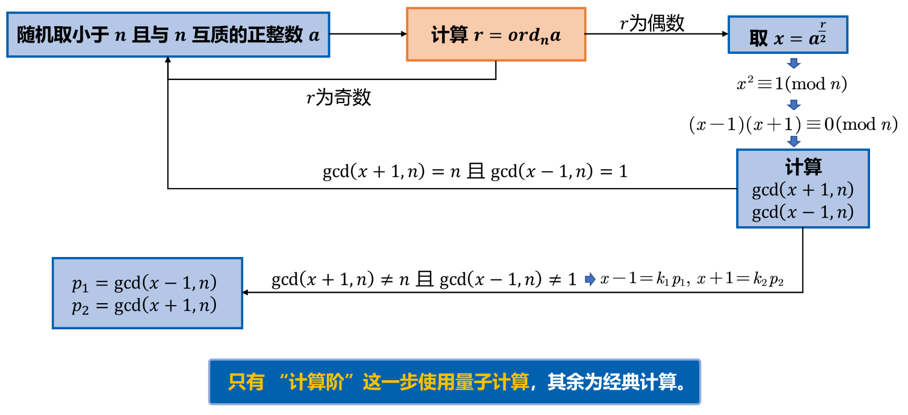
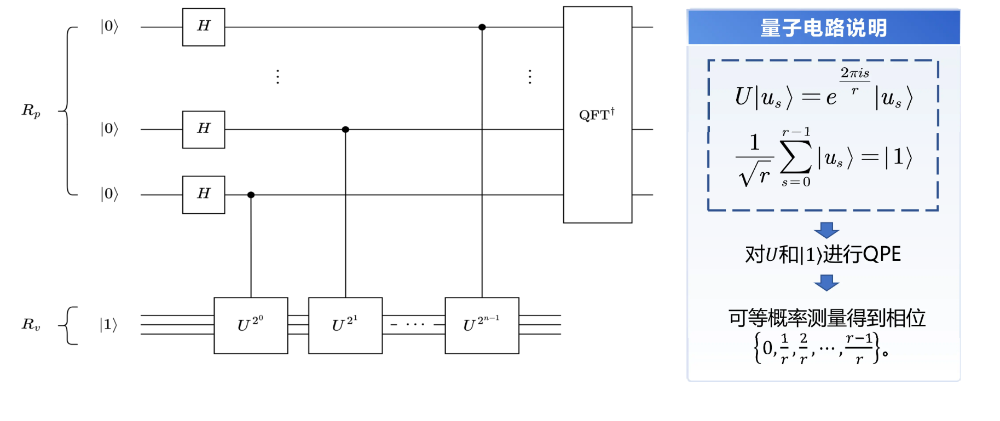

# 量子计算理论基础与软件系统
## Lecture 1:Introduction
## Lecture 2:Physics Basics
## Lecture 3:量子信息基础（一）：量子态与量子门
酉矩阵$A\overline{A^T}=I$,厄米矩阵$H=\overline{H^T}$  
$\ket{\psi}=\alpha\ket{0} + \beta\ket{1}$  
$\alpha,\beta$ can be complex number  
$\ket{+}=\frac{1}{\sqrt{2}}(\ket{0}+\ket{1}),\ket{-}=\frac{1}{\sqrt{2}}(\ket{0}-\ket{1})$是一组单位正交基，可以作为量子态的基矢态  
表示为向量形式:$\ket{+}=\frac{1}{\sqrt{2}}\begin{bmatrix}1 \\ 1\end{bmatrix},\ket{-}=\frac{1}{\sqrt{2}}\begin{bmatrix}1 \\ -1\end{bmatrix}$  
$\ket{\psi}=\begin{bmatrix} \alpha \\ \beta \end{bmatrix}$  
量子态矢内积：$\bra{\psi}$是$\ket{\psi}$的共轭转置  
$\bra{\psi}\ket{\psi}=\braket{\psi|\psi}=\alpha^*\alpha+\beta^*\beta=1$  
欧几里得范数：$||\ket{v}||=\sqrt{\braket{v|v}}$
归一化条件：$|\alpha|^2+|\beta|^2=1$(量子态向量必须满足的条件)  

!!! danger "取模取模取模"  

Bloch球:$\ket{\psi}=cos(\theta/2)\ket{0}+e^{i\phi}sin(\theta/2)\ket{1}$，只能描述单个量子比特的状态  
球坐标:$(r,\theta,\phi),r=1$  
蕴涵无限的信息，但需要指数增长的测量次数才能提高精度  
多量子比特：$\ket{\psi}=\alpha_{00}\ket{00}+\alpha_{01}\ket{01}+\alpha_{10}\ket{10}+\alpha_{11}\ket{11}$  
$\sum_{x}|a_x|^2=1$  
如果测量第一个比特得到$0$,量子比特塌缩为$\ket{\psi'}=\frac{\alpha_{00}\ket{00}+\alpha_{01}\ket{01}}{\sqrt{|\alpha_{00}|^2+|\alpha_{01}|^2}}$,仍然满足归一化条件  
张量积:$\begin{bmatrix}1 & 2\end{bmatrix}\otimes\begin{bmatrix}1 & 2 \\ 3 & 4 \end{bmatrix}=\begin{bmatrix}1 & 2 & 2 & 4 \\ 3 & 4 & 6 & 8 \end{bmatrix}$  
例1:单位向量   
$\ket{00}=\ket{0}\otimes\ket{0}=\begin{bmatrix}1 \\ 0\end{bmatrix}\begin{bmatrix}1 \\ 0\end{bmatrix}=\begin{bmatrix}1 \\ 0 \\ 0 \\ 0\end{bmatrix}$  
纠缠态$\ket{\psi}=\alpha_{00}\ket{00}+\alpha_{11}\ket{11}$  
非纠缠态$\ket{\psi}=\alpha\ket{0}(\ket{0}+\ket{1})$  
张量积$\ket{0}\otimes\ket{1}=\ket{01}$确定性非叠加纠缠态（两只鞋）  
$(\alpha\ket{0}+\beta\ket{1})\otimes(\gamma\ket{0}+\delta\ket{1})$  
$=\alpha\gamma\ket{00}+\alpha\delta\ket{01}+\beta\gamma\ket{10}+\beta\delta\ket{11}$
贝尔态：$\left\{\ket{\phi^+}=\frac{1}{\sqrt{2}}\ket{00}+\frac{1}{\sqrt{2}}\ket{11},\ket{\phi^-}=\frac{1}{\sqrt{2}}\ket{00}-\frac{1}{\sqrt{2}}\ket{11},\ket{\psi^+}=\frac{1}{\sqrt{2}}\ket{01}+\frac{1}{\sqrt{2}}\ket{10},\ket{\psi^-}=\frac{1}{\sqrt{2}}\ket{01}-\frac{1}{\sqrt{2}}\ket{10}\right\}$  
Hadamard门$H=\frac{1}{\sqrt{2}}\begin{bmatrix}1 & 1 \\ 1 & -1\end{bmatrix}$  
作用：创造叠加态$H\ket{0}=\frac{1}{\sqrt{2}}(\ket{0}+\ket{1}),H\ket{1}=\frac{1}{\sqrt{2}}(\ket{0}-\ket{1})$,它们两也构成一组基，成为Hadamard基  
Pauli矩阵$\sigma_x=\begin{bmatrix}0 & 1 \\ 1 & 0\end{bmatrix},\sigma_y=\begin{bmatrix}0 & -i \\ i & 0\end{bmatrix},\sigma_z=\begin{bmatrix}1 & 0 \\ 0 & -1\end{bmatrix}$对应量子X,Y,Z门,分别表示沿着x,y,z轴旋转$\pi$角度  
只有酉矩阵（正交矩阵$UU^\top=U^\top U=I$）可以表示一个量子门  
厄米矩阵（自伴矩阵$A=A^\top$）：本征值是实数，本征向量正交->物理量可观测  
酉矩阵：满足归一化条件  
相位旋转门：P,T,S  
单量子比特操作分解：$U=e^{i\alpha}\begin{bmatrix}e^{-i\beta/2} & 0 \\ 0 & e^{i\beta/2}\end{bmatrix}\begin{bmatrix}cos\frac{\gamma}{2} & -sin\frac{\gamma}{2} \\ sin\frac{\gamma}{2} & cos\frac{\gamma}{2}\end{bmatrix}\begin{bmatrix}e^{-i\delta/2} & 0 \\ 0 & e^{i\delta/2}\end{bmatrix}$  
$U=e^{i\alpha}(cos\frac{\theta}{2}I-isin\frac{\theta}{2}(n_xX+n_yY+n_zZ))$  
$R_X(\theta)=cos\frac{\theta}{2}I-isin\frac{\theta}{2}X;
Y,Z$同理  
例2:纠缠判定  
如果一个多量子比特可以分解为多个单量子比特的张量积，则这个系统被称为无关的、可分的，如$\frac{1}{2}\ket{00}+\frac{i}{2}\ket{01}-\frac{1}{2}\ket{10}-\frac{i}{2}\ket{11}=(\frac{1}{\sqrt{2}}\ket{0}-\frac{1}{\sqrt{2}}\ket{1})\otimes(\frac{1}{\sqrt{2}}\ket{0}+\frac{i}{2}\ket{1})$  
反之，该系统是不可分的、**纠缠的**，如$\frac{1}{\sqrt{2}}\ket{00}+\frac{1}{\sqrt{2}}\ket{11}$  
例3:复合系统  
$X\otimes Z=\begin{bmatrix}0 & 1 \\ 1 & 0\end{bmatrix}\otimes\begin{bmatrix}1 & 0 \\ 0 & -1\end{bmatrix}=\begin{bmatrix}0 & 0 & 1 & 0 \\ 0 & 0 & 0 & -1 \\ 1 & 0 &0 & 0 \\ 0 & -1 &0 &0\end{bmatrix}$  
$X\otimes Z\ket{00}=\begin{bmatrix}0 & 0 & 1 & 0 \\ 0 & 0 & 0 & -1 \\ 1 & 0 &0 & 0 \\ 0 & -1 &0 &0\end{bmatrix}\begin{bmatrix}1 \\ 0 \\ 0 \\ 0\end{bmatrix} = \begin{bmatrix}0 \\ 0 \\ 1 \\ 0\end{bmatrix} = \ket{10}$  
双比特门(CNOT)/量子XOR门：$output = \begin{cases}reverseInputA,if \ B=1\\ InputA,otherwise\end{cases}$  
其中B为控制比特，A为受控比特  
$CNOT=\begin{bmatrix}1 & 0 & 0 & 0\\0 & 1 & 0 & 0\\0 & 0 & 0 & 1\\0 & 0 & 1 & 0\end{bmatrix}$  
应用:制备纠缠态  
$q_0$为控制比特，$q_1$为受控比特
$\ket{00}\stackrel{H \ gate \ on\ q_0}\rightarrow\frac{1}{\sqrt{2}}(\ket{0}+\ket{1})\otimes\ket{0}=\frac{1}{\sqrt{2}}(\ket{00}+\ket{10})\stackrel{CNOT}\rightarrow\frac{1}{\sqrt{2}}(\ket{00}+\ket{11})$  
不可克隆原理：不存在线性算符$U$，可以将$\ket{\psi}$映射到$\ket{\psi}\ket{\psi}$  
## Lecture 4:量子信息基础（二）：量子隐形传态与Deutsch算法
量子隐形传态：量子纠缠超距作用与信息速度不超过光速不矛盾  
$\ket{\phi_{AB}}=\frac{1}{\sqrt{2}}\ket{00}+\frac{1}{\sqrt{2}}\ket{11}$  
Alice:$\ket{\psi}=\alpha\ket{0}+\beta\ket{1}$  
$\ket{\psi_0}=\frac{1}{\sqrt{2}}[\alpha\ket{0}(\ket{00}+\ket{11})+\beta\ket{1}(\ket{00}+\ket{11})]$  
Alice qubit pass CNOT:$\ket{\psi_1}=\frac{1}{\sqrt{2}}[\alpha\ket{0}(\ket{00}+\ket{11})+\beta\ket{1}(\ket{10}+\ket{01})]$  
Alice qubit pass H:$\ket{\psi_2}=\frac{1}{2}[\alpha(\ket{0}+\ket{1})(\ket{00}+\ket{11})+\beta(\ket{0}-\ket{1})(\ket{10}+\ket{01})] \\ =\frac{1}{2}[\ket{00}(\alpha\ket{0}+\beta\ket{1})+\ket{01}(\alpha\ket{1}+\beta\ket{0})+\ket{10}(\alpha\ket{0}-\beta\ket{1})+\ket{11}(\alpha\ket{1}-\beta\ket{0})$  
Alice:$\ket{00}$,then Bob qubit $\rightarrow \alpha\ket{0}+\beta\ket{1}$  
$\ket{01}$,Bob use X door  
$\ket{10}$,Bob use Z door  
$\ket{11}$,Bob use X door,then Z door  
Alice需要经典信号传输自己的结果  
SWAP门:$SWAP=\begin{bmatrix}1 & 0 & 0 & 0 \\ 0 & 0 & 1 & 0 \\ 0 & 1 & 0 & 0 \\ 0 & 0 & 0 & 1\end{bmatrix}$,交换两比特状态  
增加控制位，CSWAP门  
两控制CCNOT门(Toffoli门)：只有在两个控制比特都为1时才反转第三个比特  
量子计算的并行性:对由两个qubit构成的函数输入，分别施加H门$x=(\frac{\ket{0}+\ket{1}}{\sqrt{2}})(\frac{\ket{0}+\ket{1}}{\sqrt{2}})=\frac{\ket{00}+\ket{01}+\ket{10}+\ket{11}}{2}$均匀叠加态，则电路同时计算4种取值的函数值  
Deutsch算法：$f:\left\{0,1\right\}^n\rightarrow\left\{0,1\right\}$,常数函数:$f(x)=0,\forall x$ or $f(x)=1,\forall x$,平衡函数:$f(x)=0与数量与f(x)=1的数量一致$  
问题：尝试最少的次数，判断$f$是常数函数还是平衡函数  
经典方法：worst case一半多一次，$O(2^n)$  
量子方法：1次  
$\ket{0},\ket{1}$分别经过H门:$\ket{\psi_1}=\frac{1}{2}(\ket{00}-\ket{01}+\ket{10}-\ket{11})$  
异或：$\ket{x}\ket{y}\rightarrow\ket{x}\ket{y\oplus f(x)}=\ket{x}(-1)^{f(x)}\ket{y}$  
$\ket{x}=[\frac{\ket{0}+\ket{1}}{\sqrt{2}}],\ket{\psi_2}=\frac{\ket{0}(-1)^{f(0)}+\ket{1}(-1)^{f(1)}}{\sqrt{2}}\ket{y}$  
$\ket{\psi_2}=\begin{cases}\pm[\frac{\ket{0}+\ket{1}}{\sqrt{2}}][\frac{\ket{0}-\ket{1}}{\sqrt{2}}] ,f(0)=f(1)\\ \pm[\frac{\ket{0}-\ket{1}}{\sqrt{2}}][\frac{\ket{0}-\ket{1}}{\sqrt{2}}],f(0)\neq  f(1)\end{cases}$  
对第一个qubit施加H门，$\ket{\psi_3}=\begin{cases}\pm\ket{0}[\frac{\ket{0}-\ket{1}}{\sqrt{2}}] ,f(0)=f(1)\\ \pm\ket{1}[\frac{\ket{0}-\ket{1}}{\sqrt{2}}],f(0)\neq  f(1)\end{cases}$   
两比特Deutsch算法：$\pm (f(0)\oplus f(1))[\frac{\ket{0}-\ket{1}}{\sqrt{2}}]$  
测量第一个比特，为$\ket{0}$则为常数函数，反之为平衡函数  
Oracle:黑盒，我们知道他的行为，但是不知道怎么实现  
$U_f:\ket{x}\ket{y}\rightarrow\ket{x}\ket{y\oplus f(x)}$  
Truth table作函数功能解释  
$H^2=I,HXH=Z$  
$(H\otimes H)CNOT_{low}(H\otimes H)=CNOT_{high}$  
## Lecture 5:Lab visit
## Lecture 6:状态空间演化与量子测量 量子图灵机
#### 量子态演化
波函数:$\psi(x)=Ae^{i(\frac{p}{t})x}$  
哈密顿量H：系统的能量算符，由动能项和势能项组成$\hat{H}=-\frac{\hbar^2}{2m}\nabla^2+V(\vec{r})$  
本征值：能量可能取值，特征向量：状态向量  
量子态演化：薛定谔方程  
若$H$与时间独立，$\ket{\psi(t)}=e^{\frac{-iH\Delta t}{\hbar}}\ket{\psi(0)}=U\ket{\psi(0)}$  
其中$U$是幺正的时间演化算子  
量子态演化过程：线性演化（酉矩阵变换），非线性的塌缩过程（测量）  
#### 量子测量
特征值$Av=\lambda v$  
特征值分解:$A=Q\Sigma Q^{-1}$  
谱分解：特征向量$V=\begin{bmatrix}v_1 & v_2 & ... & v_n\end{bmatrix}$  
$A=V\begin{bmatrix}\lambda_1 & ... & 0 \\ ... & ... & ... \\ 0 & ... &\lambda_n\end{bmatrix}V^{-1}$  
谱是特征值的集合  
厄密矩阵可以对角化，可分解为$A=\sum_{i=1}^n \lambda_i\ket{e_i}\bra{e_i}$，其中$e_i$为标准正交基  
完备性:$\sum_{i=1}^n\ket{e_i}\bra{e_i}=I$  
投影算子：将$\ket{v}$投影到$\ket{e_k}$方向，投影算子：$P_k=\ket{e_k}\bra{e_k}$  
例:两个基向量$e_1=\frac{1}{\sqrt{2}}\begin{bmatrix}1 \\ 1 \end{bmatrix},e_2=\frac{1}{\sqrt{2}}\begin{bmatrix}1 \\ -1 \end{bmatrix}$  
投影算子:$P_1=\frac{1}{2}\begin{bmatrix}1 & 1 \\ 1 & 1 \end{bmatrix},P_2=\frac{1}{2}\begin{bmatrix}1 & -1 \\ -1 & 1 \end{bmatrix}$  
投影算子构成一组正交基$\sum_k P_k=I,P_1P_2=\bold{0}$  
利用投影算子，谱分解$A=\sum_{i=1}^n \lambda_i\ket{e_i}\bra{e_i}=\sum_i\lambda_i P_i$  
投影测量：对状态$\ket{\psi}$测量后，得到结果$i$的概率$p_i=p(\lambda=\lambda_i)=\braket{\psi|P_i|\psi}$  
测量后态塌缩:$\frac{P_i\ket{\psi}}{\sqrt{p_i}}$  
观测平均值$E(A)=\braket{\psi|A|\psi}$  
投影算子$P^\dagger_mP_m=P_m^2=P_m$  
$p_\alpha = |\braket{\psi|\alpha}|^2$  
例:单比特测量  
投影算子：$P_0=\begin{bmatrix}1 & 0 \\ 0 & 0\end{bmatrix},P_1=\begin{bmatrix}0 & 0 \\ 0 & 1\end{bmatrix}$  
作用$P_0$,$p(0)=\braket{\psi|P_0|\psi}=\begin{bmatrix}\alpha & \beta\end{bmatrix}\begin{bmatrix}1 & 0 \\ 0 & 0\end{bmatrix}\begin{bmatrix}\alpha \\ \beta\end{bmatrix}=|\alpha|^2$  
测量后塌缩:$\frac{P_0\ket{\psi}}{\sqrt{p_0}}=\frac{\alpha}{|\alpha|}\ket{0}$  
例：双比特测量  
系统复合量子态$\ket{00}$,t1时刻，两个比特分别经过H和X门，t2时刻，经过CNOT门  
经过t1,t2，演化为$\psi=\frac{1}{\sqrt{2}}(\ket{10}+\ket{11})$  
(1)整体测量:(t3时刻测量整体)  
$p(\ket{10})=\braket{\psi|M_{10}| \psi}=\frac{1}{2}$  
$\psi'=\frac{M_{10}\ket{\psi}}{\sqrt{p(\ket{10})}}=\ket{10}$
(2)部分测量:  
t3时刻只对低比特位测量  
$M_0^{q_0}=\sum_{i\in\left\{0,1\right\}}M_{0i}=\begin{bmatrix}1 & 0 & 0 & 0 \\ 0 & 1 & 0 & 0\\ 0&0&0&0\\0&0&0&0\end{bmatrix}$  
$M_1^{q_0}=\begin{bmatrix}0 & 0 & 0 & 0 \\ 0 & 0 & 0 & 0\\ 0&0&1&0\\0&0&0&1\end{bmatrix}$  
$P_{q_0}(\ket{0})=\braket{\psi|M_0^{q_0}|\psi}=0$  
$P_{q_0}(\ket{1})=\braket{\psi|M_1^{q_0}|\psi}=1$  
测量后，系统塌缩:$\ket{\psi'}=\frac{M_1^{q_0}\ket{\psi}}{\sqrt{P_{q_0}(\ket{1})}}=\frac{1}{\sqrt{2}}(\ket{10}+\ket{11}),c_0=1$  
t3时刻只对高比特位测量  
$M_0^{q_1}=\begin{bmatrix}1 & 0 & 0 & 0 \\ 0 & 0 & 0 & 0\\ 0&0&1&0\\0&0&0&0\end{bmatrix}$  
$M_1^{q_1}=\begin{bmatrix}0 & 0 & 0 & 0 \\ 0 & 1 & 0 & 0\\ 0&0&0&0\\0&0&0&1\end{bmatrix}$  
$P_{q_1}(\ket{0})=\frac{1}{2}$  
$\ket{\psi'}=\frac{M_0^{q_1}\ket{\psi}}{\sqrt{P_{q_1}(\ket{0})}}=\ket{10},c_1=0$  
应用：区分量子态  
如果量子态是正交的，可以确定性区分，否则某个测量结果概率介于0，1之间，无法确定区分  
#### 通用量子门
能够实现任意操作的universal gate set，如{单量子比特门，CNOT门}；{H门、相位门、CNOT门、$\pi/8$门}，{H门，相位门，CNOT门，Toffoli门}  
门分解：目标酉矩阵的门矩阵乘积分解，逼近方法  
#### 量子图灵机
每一台量子图灵机都可以用量子电路模拟  
与经典图灵机类似，但纸带字符与寄存状态为叠加态  
### Lecture 7:常用量子算法
#### 量子傅里叶变换QFT
离散傅里叶变换DFT:$y_k=\frac{1}{\sqrt{N}}\sum_{j=0}^{N-1}x_je^{\frac{2\pi i}{N}\cdot jk}$,逆变换IDFT  
量子傅里叶变换QFT:$QFT\ket{j}=\frac{1}{\sqrt{N}}\sum_{k=0}^{N-1}e^{\frac{2\pi i}{N}\cdot jk}\ket{k}$  
张量积形式：$QFT\ket{\overline{j_1j_2...j_n}}=\frac{1}{\sqrt{2^n}}(\ket{0}+e^{2\pi i\overline{0.j_n}}\ket{1})(\ket{0}+e^{2\pi i\overline{0.j_{n-1}j_n}}\ket{1})(\ket{0}+e^{2\pi i\overline{0.j_1j_2...j_n}}\ket{1})$  
Proof.  
1.二进制展开$j=\overline{j_1...j_n}=j_12^{n-1}+...+j_n2^0$  
$$
QFT\ket{j}=\frac{1}{\sqrt{2^n}}\sum_{k=0}^{N-1}e^{\frac{2\pi i}{N}\cdot jk}\ket{k} \\ =\frac{1}{\sqrt{2^n}}\sum_{k_1=0}^1...\sum_{k_n=0}^1e^{\frac{2\pi i}{2^n}\cdot j\sum_{l=1}^nk_l2^{n-l}}\ket{k_1...k_n}\\ =\frac{1}{\sqrt{2^n}}\sum_{k_1=0}^1...\sum_{k_n=0}^1e^{2\pi i j\sum_{l=1}^nk_l2^{-l}}\ket{k_1...k_n} 
$$
2.指数求和转换为张量积  
$$
=\frac{1}{\sqrt{2^n}}\sum_{k_1=0}^1...\sum_{k_n=0}^1\otimes_{l=1}^ne^{2\pi i jk_l2^{-l}}\ket{k_l} 
$$
3.交换次序  
$$
=\frac{1}{\sqrt{2^n}}\otimes_{l=1}^n\sum_{k_l=0}^1e^{2\pi i jk_l2^{-l}}\ket{k_l} 
$$
4.展开$k_l$求和  
$$
=\frac{1}{\sqrt{2^n}}\otimes_{l=1}^n(\ket{0}+e^{2\pi ij2^{-l}}\ket{1})
$$
5.$e^{2\pi i}=1,j\cdot 2^{-l}=(j_12^{n-1-l}+...+j_{n-l}2^0)+j_{n-l+1}2^{-1}...+j_n2^{-(n-l)}$,整数部分对1没有相位贡献，小数部分为$0.j_{n-l+1}...j_n$  
$$
=\frac{1}{\sqrt{2^n}}(\ket{0}+e^{2\pi i\overline{0.j_n}}\ket{1})(\ket{0}+e^{2\pi i\overline{0.j_{n-1}j_n}}\ket{1})...(\ket{0}+e^{2\pi i\overline{0.j_1j_2...j_n}}\ket{1})
$$
单比特系统：对$\ket{\psi}=\alpha\ket{0}+\beta\ket{1}$执行QFT(代入定义式)  
$y_0=\frac{1}{\sqrt{2}}(\alpha exp(2\pi i\frac{0\times0}{2})+\beta exp(2\pi i\frac{1\times 0}{2}))=\frac{1}{\sqrt{2}}(\alpha+\beta)$  
$y_1=\frac{1}{\sqrt{2}}(\alpha-\beta)$  
单比特QFT与H门等价  
双比特系统：$\ket{\psi}=\ket{2}=\ket{10}$  

$U_{QFT}\ket{\psi}=U_{QFT}\ket{10}\\=\frac{1}{\sqrt{4}}(\ket{0}+e^{2\pi i*2/2}\ket{1})(\ket{0}+e^{2\pi i * 2/4}\ket{1})\\=\frac{1}{2}(\ket{00}-\ket{01}+\ket{10}-\ket{11})$  
代入张量积形式，$U_{QFT}\ket{\psi}=\frac{1}{2}(\ket{0}+\ket{1})\otimes(\ket{0}-\ket{1})$  
note:二进制中0.1=1/2，0.01=1/4  
量子电路：定义$R_k=\begin{bmatrix}1&0\\0&e^{\frac{2\pi i}{2^k}}\end{bmatrix}$  
note:$R_2=\begin{bmatrix}1&0\\0&i\end{bmatrix}$，则受控旋转门$CR_2=\begin{bmatrix}1&0&0&0\\0&1&0&0\\0&0&1&0\\0&0&0&i\end{bmatrix}$
  
执行第一个$H$门，$\frac{1}{\sqrt{2}}(\ket{0}+e^{2\pi i\overline{0.j_1}}\ket{1})\ket{\overline{j_2...j_n}}$  
再经过一个$R_2$门，$\frac{1}{\sqrt{2}}(\ket{0}+e^{2\pi i\overline{0.j_1j_2}}\ket{1})\ket{\overline{j_2...j_n}}$  
执行所有针对第一个量子态的量子门，$\frac{1}{\sqrt{2}}(\ket{0}+e^{2\pi i\overline{0.j_1j_2...j_n}}\ket{1})\ket{\overline{j_2...j_n}}$  
门电路复杂度$O(n^2)$  
必要时通过swap门交换最终结果  
#### 量子相位估计QPE
[Goal] 给定一个酉矩阵$U$，已知其特征向量$\ket{\mu}$，特征值为$e^{2\pi i \varphi}$，QPE估计$\varphi$的值，$\varphi\in[0,1)$  
量子电路：($2^j$表示连续U门的数量)  
  
作用H门，$\frac{1}{\sqrt{2^n}}(\ket{0}+\ket{1})^{\otimes n}\ket{\mu}$  
受控U门，对通过H门后的每个量子态$\ket{j_i},i=1,2,...,n,\ket{j_i}\ket{\mu}\stackrel{CU^{2^{i-1}}}{\rightarrow}\ket{j_i}U^{j_i^{2^{i-1}}}\ket{\mu}$  
由特征值的性质$U\ket{\mu}=e^{2\pi i\varphi}\ket{\mu},\ket{j_i}U^{j_i^{2^{i-1}}}\ket{\mu}=\frac{1}{\sqrt{2}}(\ket{0}+e^{2\pi i2^{i-1}\varphi}\ket{1})\ket{\mu}$  
于是第一阶段的结果为$\frac{1}{\sqrt{2}^n}(\ket{0}+e^{2\pi i2^{n-1}\varphi}\ket{1})(\ket{0}+e^{2\pi i2^{n-2}\varphi}\ket{1})...(\ket{0}+e^{2\pi i2^{0}\varphi}\ket{1})\ket{\mu}$  
最后在第二阶段通过逆QFT就可以得到$\varphi=\overline{0.\varphi_1\varphi_2...\varphi_n}$  
如果角度不能很好地被二进制表示，则精度取决于辅助比特的数量，且结果为叠加态  
例子：精确解  
给定酉矩阵$U=P(\frac{\pi}{4})=\begin{bmatrix}1&0\\0&e^{\frac{\pi i}{4}}\end{bmatrix}$  
则运行结果为$\varphi = (0.001)_2=\frac{1}{8}$  
这恰好是$\ket{1}$态本征态的相位，因为$e^{2\pi i\varphi}=e^{i\frac{\pi}{4}}=e^{i\phi}$  
相位旋转门改变量子态的相对相位，但不改变概率分布  
例子：非精确解  
$\phi=\frac{2\pi}{3}$  
则测量结果高概率为$011$,其次为$010,100$，其余小概率  
事实上，$(011)_2=\frac{3}{8}$最接近$\varphi=\frac{1}{3}$  
n个qubit可以估计相位到$\frac{1}{2^n}$精度  
如果将特征向量的叠加态输入则可以得到各特征向量对应相位的输出，输出概率即为特征值系数  
#### Shor算法
RSA：发送方通过公钥加密，接收方制作公钥和私钥解密  
1.获取两个大质数$p_1,p_2$  
2.令$n=p_1p_2$则$\varphi(n)=\varphi(p_1)(p_2)=(p_1-1)(p_2-1)$($\varphi(n)$是欧拉函数，表示与$n$互质且小于$n$的整数个数，具有可积性)  
3.取$\varphi(n)$互质的正整数$e,s.t.gcd(e,\varphi(n))=1,e\neq p_1,p_2$  
4.求$e$模$\varphi(n)$的逆元$d,s.t.ed\equiv 1(mod\ n)$  
则$n,e$为公钥，$d$为私钥  
例：$p_1=5,p_2=11,n=55,\varphi(n)=40,e=7,d=23$  
Alice加密$a=33$,发送$C=a^emod\ n=33^7mod\ 55=22$  
Bob利用私钥$d$解密$a=C^dmod\ n=22^{23} mod\ 55 =33$  
传统破解方法：质因数分解，时间复杂度$O(\sqrt{n})$  
阶：a模n的阶是使$a^r\equiv 1(mod\ n)$的最小正整数，记为$ord_na$  
Shor算法：  
  

!!! danger "Shor算法推导"  

定义酉变换：$U\ket{y}=\ket{ay(mod\ n)}$,易得$U\ket{y}=\ket{ay(mod\ n)}$  
定义量子态：$\ket{u_s}=\frac{1}{\sqrt{r}}\sum_{k=0}^{r-1}e^{-\frac{2\pi isk}{r}}\ket{a^k(mod\ N)}$,以$\frac{1}{r}$为系数均匀叠加    
性质1：$U\ket{u_s}=e^{\frac{2\pi is}{r}}\ket{u_s}$  
Proof. $U\ket{u_s}=\frac{1}{\sqrt{r}}\sum_{k=0}^{r-1}e^{-\frac{2\pi isk}{r}}\ket{a^{k+1}(modN)}=e^{\frac{2\pi is}{r}}\ket{u_s}$  
这个性质说明$\ket{u_s}$是$U$得特征向量  
性质2：$\frac{1}{\sqrt{r}}\sum_{s=0}^{r-1}\ket{u_s}=\ket{1}$  
证明较复杂，此处略过  
这个性质说明$\ket{1}$是$\ket{u_s}_{s=0}^{r-1}$等概率的叠加态，从而我们可以规避$\ket{u_s}$的制备  
量子电路：  
  
例子：$U\ket{y}=\ket{7y(mod\ 15)},r=4(7^4\equiv 1(mod\ 15))$
则电路应该均匀输出$0,0.25,0.5,0.75$,但已知输出相位推断$r$是有些困难的，问题可以转化为已知$\frac{1}{r},\frac{2}{r},...,\frac{r-1}{r}$的小数形式寻找小数对应分数的最小公倍数，但如果测量的相位有误差，则$r$的推断会更为困难  
U算子的构造方法：穷举所有可能的$x$，计算$f(x)=a^x\ modN$,$U=\sum_{x=0}^{N-1}\ket{f(x)}\bra{x}$  
#### Grover算法
[goal] 寻找一个数的所有因子，时间复杂度为$O(\sqrt{N})$  
几何解释：将所有错解设置为一个叠加态，将所有正解设置为另一个，通过旋转初始量子态使其逼近正解叠加态  
Oracle可以检验某个解是否正确  
电路实现：$O(\sqrt{N})$个旋转G门  
## Lecture 8:量子纠错  
### 经典纠错
冗余编码$101\rightarrow 111$  
量子系统难点：量子态无法克隆，否则会导致测量破坏，误差类型不只01反转，还会有相位的连续扰动  
### 常见错误
X错误(比特翻转):$\ket{0}\leftrightarrow\ket{1}$  
Z错误(相位反转):$\ket{0}\leftrightarrow\ket{0},\ket{1}\leftrightarrow -\ket{1}$  
任何单比特误差都可以用Pauli基底(I,X,Y=XZ,Z)展开  
错误投影：将辅助比特与数据比特叠加，测量辅助比特将叠加误差塌缩成Pauli错误，而不破坏数据比特的信息  
$\ket{e_0}\ket{0}\rightarrow\ket{e_1}\ket{0}+\ket{e_2}\ket{1}\\\ket{e_0}\ket{1}\rightarrow\ket{e_3}\ket{0}+\ket{e_4}\ket{1}\\\ket{e_{0-4}}$:环境变量  
$\braket{e_2|e_2},\braket{e_3|e_3}<<1$  
投影算符：$P_0\ket{\psi}=\ket{0}\braket{0|\psi}\rightarrow P_0=\frac{I+Z}{2}\\P_1\ket{\psi}=\ket{1}\braket{1|\psi}\rightarrow P_1=\frac{I-Z}{2}$  
$\ket{e_0}\ket{\psi}\rightarrow[\ket{e_1}I+\ket{e_2}X]P_0\ket{\psi}+[\ket{e_3}X+\ket{e_4}I]P_1\ket{\psi},P_0\ket{\psi}=\alpha\ket{0},P_1\ket{\psi}=\beta\ket{1},\alpha\ket{1}=XP_0\ket{\psi}$  
$\ket{e_0}\ket{\psi}=[\frac{\ket{e_1}+\ket{e_4}}{2}I+\frac{\ket{e_1}-\ket{e_4}}{2}Z+\frac{\ket{e_3}+\ket{e_2}}{2}X+\frac{\ket{e_3}-\ket{e_2}}{2}Y]\ket{\psi}\equiv(\ket{d}I+\ket{a}X+\ket{b}Y+\ket{c}Z)\ket{\psi},\ket{d}\approx\ket{e_0}$  
$X,Y,Z$分别对应三种Pauli错误  
n比特编码的单笔特错误可以由单比特编码错误求和得到  
### 基础三比特纠错码
#### 比特翻转
$\ket{\psi}\equiv\alpha\ket{000}+\beta\ket{111}$,通过$\alpha\ket{000}+\beta\ket{100}$分别经过第二第三比特的控制X门(CNOT)得到    
$\ket{\psi_1}=X_1\ket{\psi}=\alpha\ket{100}\beta\ket{011},\ket{\psi_2},\ket{\psi_3}$同理,只考虑一个比特出错的概率  
错误检测电路：  
  
如第一个控制X门为第一个比特控制第四个比特，如果第一个比特为1则翻转第四个比特，否则不变  
无错误：  
$1.(\alpha\ket{000}\beta\ket{111})\ket{00}\\2.(\alpha\ket{0000}\beta\ket{1111})\ket{0}\\3.(\alpha\ket{0000}\beta\ket{1110})\ket{0}\\4.\alpha\ket{00000}\beta\ket{11101}\\5.(\alpha\ket{000}\beta\ket{111})\ket{00}\\\ket{x}=\ket{0},\ket{y}=\ket{0}$  
数据比特1发生X错误，初始态变为$\alpha\ket{100}\beta\ket{011}$$\ket{x}=\ket{1},\ket{y}=\ket{0}$  
数据比特2发生X错误，$\ket{x}=\ket{1},\ket{y}=\ket{1}$  
数据比特3发生X错误，$\ket{x}=\ket{0},\ket{y}=\ket{1}$  
错误纠正电路：  
  
最后一步多控门，只有两个辅助比特都为$\ket{1}$才执行三个X门  
#### 相位翻转
相位反转本质是另一种基地的比特翻转  
$\alpha\ket{0}+\beta\ket{1}\rightarrow\alpha\ket{0}-\beta\ket{1}\iff\ket{+}\rightarrow\ket{-},\ket{-}\rightarrow\ket{+}$  
因此只需要先比特翻转码的电路上加上一层H门即可  
$\alpha\ket{000}+\beta\ket{111}\rightarrow\alpha\ket{+++}+\beta\ket{---}$  
#### Shor码
同时发生比特翻转和相位翻转  
使用九个比特，嵌套比特翻转码和相位翻转码  
$\ket{0}\rightarrow\frac{(\ket{000}+\ket{111})(\ket{000}+\ket{111})(\ket{000}+\ket{111})}{2\sqrt{2}}\\\ket{1}\rightarrow\frac{(\ket{000}-\ket{111})(\ket{000}-\ket{111})(\ket{000}-\ket{111})}{2\sqrt{2}}$  
## Mid-term Exam
## 量子计算编程与量子计算应用