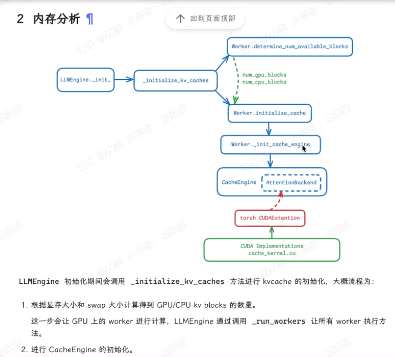

# SGLang
## 3/22 基本信息
解决CPU调度overhead 和vLLM互相借鉴(import vllm)
提供DSL语言供用户编写程序(替代LangChain)

RadixAttention:树型结构维护kvcache，利用多轮会话共享部分运行时自动重复使用kvcache
FastConstrainedDecoding:一次decode生成多个token，lookahead投机采样
API Speculative Execution：
推测解码 并行预测多个 Token
推理优化 预加载与缓存
前缀缓存 分支预测（打字中途）

提供的API
1. 运行时管理
Runtime: 创建并返回运行时实例，用于启动和管理后端服务器
set_default_backend: 设置默认后端执行引擎（如TensorFlow/PyTorch）
flush_cache: 刷新后端缓存，清理临时数据
get_server_args: 获取当前后端服务器的配置参数

2. 文本生成控制
gen: 核心生成API，支持温度/top-p/top-k等多种采样参数，支持正则表达式约束和选项选择
gen_int: 生成并强制返回整数类型结果
gen_string: 生成并强制返回字符串类型结果
select: 从预定义选项列表中选择结果，支持基于token长度的归一化采样

3. 多模态处理
image: 处理图像输入，构建图像处理表达式
video: 处理视频输入，指定视频路径和帧数

4. 对话角色管理
system/user/assistant: 自动包裹系统消息、用户输入和助手回复的角色标记
*_begin/ *_end系列（如system_begin）: 手动控制对话角色的开始和结束标记

5. 函数装饰器
function: 将普通Python函数转换为SGLang可执行函数，支持API规范令牌数量配置
```python
from sglang import function, gen, gen_string, image, video, system, user, assistant, Runtime

# 定义带装饰器的对话函数
@function
def multi_modal_chat():
    # 系统角色设定
    yield system("你是一个多模态AI助手，可以分析用户提供的图片和视频")

    # 第一轮用户交互（文本+图片）
    yield user(
        image("描述这张图片内容：", "path/to/image.jpg") + 
        "并推荐一个相关短视频"
    )
    yield assistant(
        "这张图片展示了... 我推荐以下视频：" + 
        video("path/to/video.mp4", num_frames=24) + 
        gen_string(max_tokens=50, temperature=0.7)
    )

    # 第二轮用户交互（视频分析）
    yield user(
        "分析这个视频的前10帧：" + 
        video("path/to/surveillance.mp4", num_frames=10)
    )
    yield assistant(
        "视频分析结果：运动轨迹..." + 
        gen(
            stop="。", 
            return_logprob=True,
            regex=r"\d{2}:\d{2} [AP]M"  # 用正则约束时间格式
        )
    )

    # 结构化数据生成
    yield user("生成会议纪要JSON，包含时间和议题")
    yield assistant(
        gen(
            name="meeting_minutes",
            dtype=dict,
            max_tokens=200,
            temperature=0.0
        )
    )

# 启动运行时
runtime = Runtime()
runtime.set_default_backend("vllm")

# 执行对话
response = multi_modal_chat.run()
print(f"最终输出：{response['meeting_minutes']}")

# 清理资源
runtime.flush_cache()
```
## 3/23 模型部署
sglang cve
没搜到？
`import vllm`
本地部署sglang,vllm

sglang加载模型/执行模型的code

## 3/24 25 vllm CVE

CVE-2025-29783:Remote Code Execution via *Mooncake Integration*
Mooncake ZMQ/TCP暴露管道 
`recv_tensor()` calls `_recv_impl` which passes the raw network bytes to `pickle.loads()`.反序列化任意代码执行
Solution:`pickle.loads()` -> `safetensors`

CVE-2025-29770:vLLM denial of service via `outlines unbounded cache` on disk
`wvllm/model_executor/guided_decoding/outlines_logits_processors.py`无条件使用缓存，导致文件系统空间不足

CVE-2025-25183:`hash()`

CVE-2025-24357:malicious model RCE by `torch.load` in `hf_model_weights_iterator`
`VLLM/model_executor/weight_utils.py``torch.load` 加载恶意 pickle 数据时，在解封期间执行任意代码
Solution:`Set weights_only=True`

CVE-2024-9053: AsyncEngineRPCServer Remote Code Execution
`AsyncEngineRPCServer()`核心功能`run_server_loop()` 调用函数 `_make_handler_coro()`对收到信息`cloudpickle.loads()`

CVE-2024-9052:RCE via distributed training API
`vllm.distributed.GroupCoordinator.recv_object()` calls `pickle_loads()`

SGLang中是否有使用pickle_loads()
```python
def broadcast_recv_input(
    data: Any, rank: int, dist_group: torch.distributed.ProcessGroup
):
    """Broadcast inputs from rank=0 to all other ranks with torch.dist backend."""

    if rank == 0:
        if len(data) == 0:
            tensor_size = torch.tensor([0], dtype=torch.long)
            dist.broadcast(tensor_size, src=0, group=dist_group)
        else:
            serialized_data = pickle.dumps(data)                 # dump
            size = len(serialized_data)
            tensor_data = torch.ByteTensor(list(serialized_data))
            tensor_size = torch.tensor([size], dtype=torch.long)

            dist.broadcast(tensor_size, src=0, group=dist_group)
            dist.broadcast(tensor_data, src=0, group=dist_group)
    else:
        tensor_size = torch.tensor([0], dtype=torch.long)
        dist.broadcast(tensor_size, src=0, group=dist_group)
        size = tensor_size.item()

        if size == 0:
            return []

        tensor_data = torch.empty(size, dtype=torch.uint8)
        dist.broadcast(tensor_data, src=0, group=dist_group)

        serialized_data = bytes(tensor_data.tolist())
        data = pickle.loads(serialized_data)                      # load
        return data
```


## 内存管理
模型部署框架crash
Tensorflow恶意攻击
- Model Stealing:通过黑盒查询（API调用）窃取模型的参数或结构。
- 训练阶段植入后门代码（如恶意TensorFlow算子）
- 通过恶意序列化的TensorFlow模型（如.pb文件）触发远程代码执行（RCE）    
  

诱导LLM产生某一输出并据此eval代码攻击



桂：image 
迅：性能测试 漏洞数据库
淦：加载model 静态分析llama.cpp

vllm,sglang,lightllm,deepspeed,ollama,llama.cpp框架的异同


rf 陈 load_model  
王 model_context_协议 (MCP)
jx 针对aisecurity幻觉的数据库构建自动化的framework       
桂 多模态

