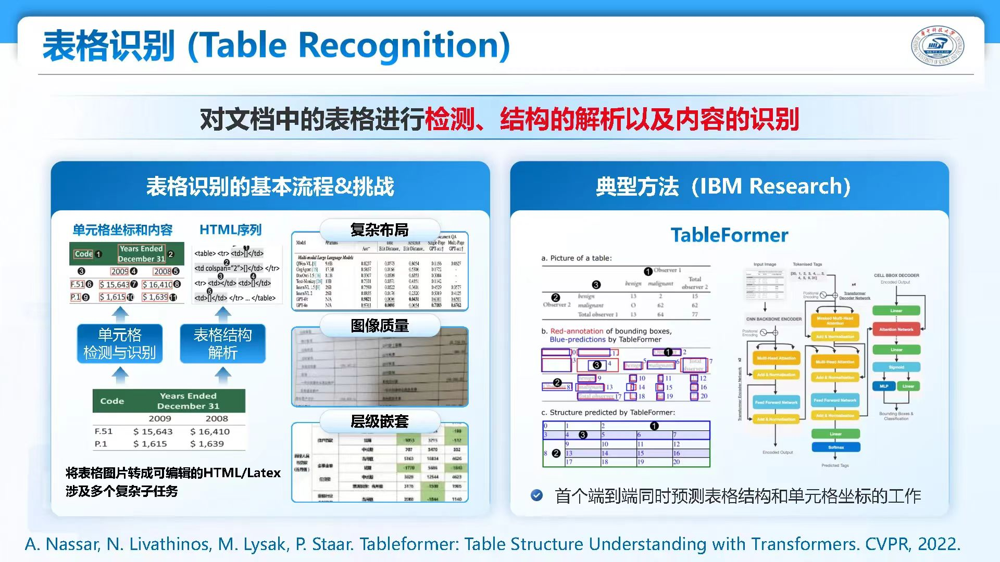

[综述](review.md)

## 目标
低质量数据靶点：什么是低质量的，有哪些（类别），如何识别，如何增强  
  
调研方向：数值类型数据  
数值类型的数据集（结构化的表格类型）：质量是如何评估的（传统数据评估的算法，缺失值，错误值）；传感器/分类器：目前数据修正的方法  
传感器数据做预测/regression，kaggle上找一些数据集（天然有缺陷）  

## Quality Evaluation(**以下按相关性排序**)
### *Data Quality Evaluation of Numeric Data for Classification Tasks
非常完整的综述  
ML basic:pipeline,performance measurement,types of data errors(missing values,duplicates,obsolete废弃的 or irrelevant,inconsistencies,mislabels,domain value violations,violations of integrity constraints,syntactic and semantic constraint violations,miscodings,outliers,noise,representation bias)  
data quality:  

- subjective:timeliness,trust  
- objective:acc,validity(context dependence)  

data repair:  

- metadata:denial constraints(HoloClean),knowledge base(Katara)  
- ...  

### A review on evaluation metrics for data classification evaluations
evaluation metrics:acc,err,sn,sp,p,r,FM,GM,...  
MSE,AUC,hybrid  

### The challenges of data quality and data quality assessment in the big data era

- diversity of sources  
- tremendous volumes  
- fast change (short timeliness)  
- no unified quality standards  
  
  

### Tabular Data: Deep Learning is Not All You Need
an ensemble of deep models and XGBoost performs better  
对比树模型与深度学习  

## Data cleaning(detection & repairment)
### Data Cleaning: Overview and Emerging Challenges
framework:ML for data cleaning efficiency and accuracy improving, effect evaluation(database query) using statisical analysis  
aspects:new abstractions,interfaces,approaches of scalability, and crowdsourcing techniques.  
define data error  

- quantitative(outlier detection):abnormal behaviours and errors  
- **qualitative**:constraints,rules(Integrity Constraints) and patterns  

#### qualitative error detection  

challenges:scalability,user engagement,semi-structured and unstructured data,new applications for streaming data,privacy & security  

### *Automatic Data Repair: Are We Ready to Deploy?(ZJU)
12 mainstream data repair algorithms,an effective and unified repair optimization strategy  

[Problem] 是否做到了动态的修复

### *Activeclean: Interactive data cleaning for statistical modeling
在每次迭代中，ActiveClean会根据数据对模型的价值以及数据实际上是脏数据的可能性，建议要清理的数据样本。分析师可以对样本应用值转换和过滤操作。ActiveClean将安全地增量更新当前模型（而不是完全重新训练）  

### Transformers for Tabular Data

!!! warning "TODO:Learning transformer for data analysis ..."  

#### NeurIPS-2021 Revisiting Deep Learning Models for Tabular Data
Transformer架构处理综述  
tabtransformer处理表格数据  

#### CVPR-2022 Table Structure Understanding with Transformers
  

## LLM for data analytics  
### MLE-Dojo: Interactive Environments for Empowering LLM Agents in Machine Learning Engineering
## Datasets
数值类型的有缺陷数据集
(from kaggle)  
[Cafe Sales - Dirty Data for Cleaning Training](https://www.kaggle.com/datasets/ahmedmohamed2003/cafe-sales-dirty-data-for-cleaning-training)  
[Retail Store Sales: Dirty for Data Cleaning](https://www.kaggle.com/datasets/ahmedmohamed2003/retail-store-sales-dirty-for-data-cleaning)  
[World Development Indicators](https://www.kaggle.com/datasets/kaggle/world-development-indicators/data)缺失值，数据对齐问题  
[FIFA 21 messy, raw dataset for cleaning/ exploring](https://www.kaggle.com/datasets/yagunnersya/fifa-21-messy-raw-dataset-for-cleaning-exploring)

(from UCL)  
[Air Quality](https://archive.ics.uci.edu/dataset/360/air+quality)多传感器冲突值、负值异常  

## Comments
**标注错误**  
Cleanlab  
**异常值**   
Isolation forest  
过滤（Z-score，IQR），ai编辑  
**缺失值**  
Missingno矩阵  
统计填充，模型填充KNN，生成填充GAN   
**重复**  
特征哈希+Jaccard相似度  
**不一致**  
scaling,normalization  
**偏差数据**  
SMOTE算法 MOLRL框架 对抗网络  
标准化去偏  
平均模型预测率：动态测试集   
**噪声**  
PCA  

统计理论？  

### 关于数据靶点对象（低质量数据）的思考
*define* data error:    
低性能数据：影响预测准确率（偏移）  
**低质量数据：明确为异常值、噪声、缺失、标注错误等**  
低性能数据包含特殊情况，是提高泛化能力的重要保障，不是治疗的对象  
需要治疗的可能是特征构建，训练，验证的整个过程（数据变化可能引起特征变化）→重点上下游性能表现的整体提升  

### 数据靶点关键思考
1.关键数据（痛点）识别（如何量化评估/精准定位关键数据，而不是逐条尝试）  
2.针对性增强（选用何种方法（Automatic Data Repair提到了12种方法），如何高效确定最优方法）  
----------------------------   
3.对各种类型数据的针对性调整（文本，多模态）  
4.自动化过程  

## Other
数据质量评估维度  
- 完整性：缺失值比例、数据覆盖度  
- 准确性：值域检查、业务规则验证  
- 一致性：跨系统一致性、时间序列一致性  
- 时效性：数据新鲜度、更新频率  
- 唯一性：重复数据检测  
  
常见缺陷类型及修正方法  
- 缺失值处理：  
  删除法  
  均值/中位数/众数填补  
  模型预测填补(如KNN、回归)  
  多重插补法  
- 异常值处理：  
  统计方法(3σ原则、IQR)  
  基于距离的方法  
  基于密度的方法(LOF)  
  基于聚类的方法  
  基于机器学习的方法(隔离森林、One-Class SVM)  
- 不一致数据：  
  数据标准化(归一化、标准化)  
  单位统一化  
  业务规则验证与修正  
- 噪声数据：  
  平滑技术(移动平均、指数平滑)  
  分箱技术  
  回归分析  
