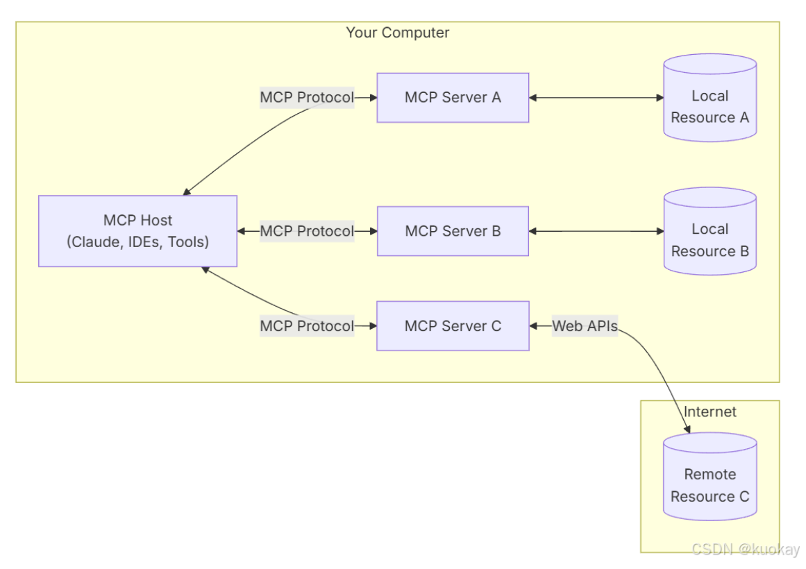
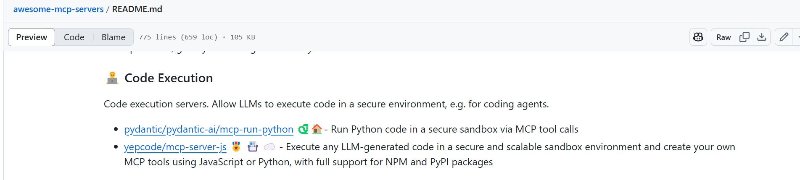

‌MCP（Model Context Protocol，模型上下文协议）‌是由Anthropic开发的开源协议，旨在实现**大型语言模型（LLM）与外部数据源和工具的标准化交互**。
client-server架构
  
MCP client 首先从 MCP server 获取可用的工具列表。
将用户的查询连同工具描述通过 function calling 一起发送给 LLM。
LLM 决定是否需要使用工具以及使用哪些工具。
如果需要使用工具，MCP client 会通过 MCP server 执行相应的工具调用。
工具调用的结果会被发送回 LLM。
LLM 基于所有信息生成自然语言响应。
最后将响应展示给用户。

协议的服务器端，负责：

暴露客户端可以发现和执行的工具
管理基于URI的资源访问模式
提供提示模板并处理提示请求
支持与客户端的能力协商
实现服务器端协议操作
管理并发客户端连接
提供结构化日志和通知

SQLite的例子 连接数据库

1. 上下文数据泄露
MCP依赖于大量的上下文数据来提高模型的性能，然而这些数据可能涉及到敏感信息（例如位置、个人行为、健康数据等）。如果没有严格的隐私保护措施，可能会导致隐私泄露。

解决方案：加密上下文数据，确保数据传输过程中不被窃取。采用 同态加密 或 差分隐私 等技术来保护敏感数据。

2. 模型滥用
通过MCP传递的上下文信息可以被攻击者利用来“欺骗”模型，尤其是当攻击者能够操控某些上下文输入时。例如，某些恶意用户可能会输入虚假的上下文数据来导致模型做出错误决策。

解决方案：增强模型的鲁棒性，使用 对抗训练 和 输入验证 技术来减少此类风险。

3. 上下文数据的伪造
如果MCP的上下文信息是由多个来源提供的，可能会有某些信息源被攻击或篡改。攻击者可以伪造上下文数据，导致模型错误推断。

解决方案：确保上下文数据来源的真实性与可靠性，可以使用 区块链 等技术确保数据的不可篡改性。

4. 数据和模型的隐私问题
在多任务系统中，模型的上下文数据不仅仅来自单一来源，可能跨多个组织或设备。如何在保证隐私的同时共享数据，是当前的一个挑战。

解决方案：采用 联合学习（Federated Learning） 等隐私保护技术，在不共享原始数据的前提下进行模型训练。

[Evaluation Report on MCP Servers] MCPBench
**Red Teaming(RT)**红队演练被用于评估AI模型的安全性和可靠性。​专家通过模拟攻击，测试AI系统在面对恶意输入时的反应，识别可能的偏见、错误信息或有害内容。这种方法有助于确保AI系统的安全性、伦理性和与业务价值的对齐。
[Enterprise-Grade Security for the Model Context Protocol (MCP): Frameworks and Mitigation Strategies]
[MCP Safety Audit: LLMs with the Model Context Protocol Allow Major Security Exploits]
[MCP:Landscape,Security Threats,and Future Research Directions]

防：instead of sandbox,what can we do?文件白/黑名单 沙箱规则配置  
比**docker**隔离更弱的configure
**shadow stack**

符合情景的通用白名单  
攻击投毒(TPA):通过prompt（注释）恶意执行

**A2A**
模式匹配检测，黑名单白名单，
trust厂商url

gguf_load

