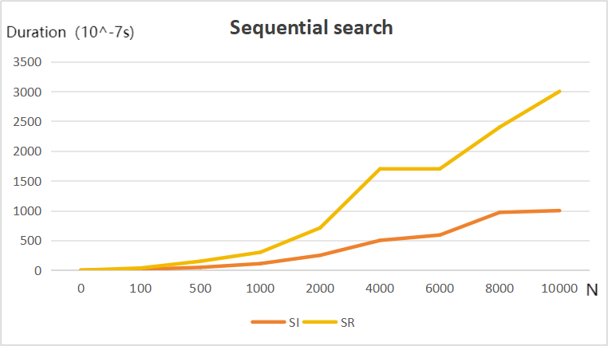
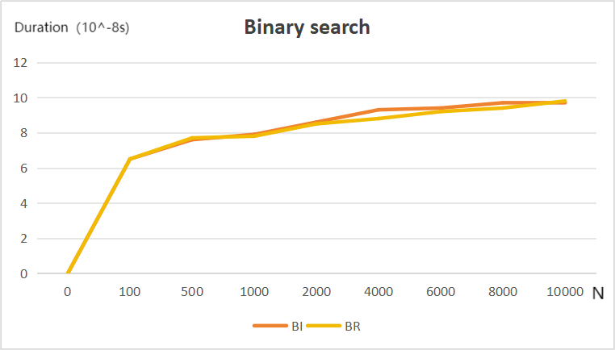

## 			                       Performance Measurement(Search)

杨亿酬 3230105697

2024-3-9

#### Chapter 1 Introduction

​	The project aims at learning about the time complexity of the four different methods for searching a number in a list of integers.

​	In order to test the overall effect of the four searching methods,the programme is designed to test the worst time complexity of the four methods. To make the time complexity worst,we can create a list of integers from 0 to N-1 and trying to find N in the list.

​	The four searching methods are Sequential Search(iterative version),Sequential Search(recursive version),Binary Search(iterative version) and Binary Search(recursive version) respectively,where sequential search scans through the list from left to right and binary search repeatedly divides the search interval in half to narrow down the interval until it becomes small enough to determine if the search key is present or not. Binary search starts with an interval covering the whole array and if the value of the search key is less than the item in the middle of the interval, the algorithm continues on the lower half;otherwise, it continues on the upper half. 

​	We choose to search N in a list of integers from 0 to N-1 because it takes the four functions the most time to operate and give the result that N is not found. As for the sequential search,to find N,the programme must compare N with all the number in the list so that the total time spent is no smaller than any other number that is going to be found. For the binary search,the programme has to divide the list into half for many times until the interval remains only one integer and by comparing the integer with N,the programme gives out the answer that N is not found.

​	Though the searching method is almost the same,different version of the methods spends different time,which will be explained in Chapter 4 detailedly.

#### Chapter 2 Algorithm Specification

​	To achieve the target mentioned in Chapter 1,I finished the following work:

- Including <time.h> to record the time running the functions. By calling the function 'start=clock()','stop=clock()' and defining 'double duration=stop-start',the time starts to be recorded once the function starts and stops to be recorded once the function stops.

- Repeating the function K times so as to make the duration large enough for reducing errors. In order to make the elapsed ticks meet the requirement of at least 10,the programme is set to stop repeating until duration is larger than 10. However,due to the fact that when testing binary search methods,the executing time is far shorter than that of sequential time,and that without enough repeating times,the duration difference won't be apparent enough to show the slight different between the two adjacent N, the duration limit is changed to 1000 for more accurate time records.

- <main.h> is written for storing the 4 functions to be tested in the project. When executing ,main.c calls <main.h> and automatically runs the function that isn't commented out, and prints out the repetition times K as well as the duration.

  

​	The following is the pseudo code of the 4 functions for searching:
​	Function iterative_sequential(a[], N)
​      For i from 0 to N-1
​          If i equals N
​              Return 1
​      Return 0
  End Function

Function recursive_sequential(a[], N, n)
    If a[N] equals 0 and n does not equal a[N]
        Return 0
    If n does not equal a[N-1]
        Return recursive_sequential(a, N-1, n)
    If n equals a[N-1]
        Return 1
End Function

Function iterative_binary(a[], N)
    low = a[0]
    high = a[N-1]
    mid = (low + high) / 2
    While mid does not equal high and mid does not equal low
        If a[mid] equals N
            Return 1
        If a[mid] is less than N
            low = mid
            mid = (low + high) / 2
        If a[mid] is greater than N
            high = mid
            mid = (low + high) / 2
    Return 0
End Function

Function recursive_binary(low, high, N)
    mid = (low + high) / 2
    If low equals mid or mid equals high
        Return 0
    If mid equals N
        Return 1
    If mid is less than N
        Return recursive_binary(mid, high, N)
    If mid is greater than N
        Return recursive_binary(low, mid, N)
End Function

​	The main data structure used in the programme is an array of integers a[],which is used to create a list of integers from 0 to N-1.Meanwhile,integer low=a[0] and high=a[N-1],which changes while executing the functions of binary search.

 

#### Chapter 3 Testing Results

​	The table below displays the results of the worst case performances of the above four functions for *N* = 100, 500, 1000, 2000, 4000, 6000, 8000, 10000.

​	According to the table,we can use a coordinate system to show the relation between N and duration under different methods clearly. The graph is drawn below:

SI=Sequential search(interative version)
SR=Sequential search(recursive version)
BI=Binary search(interative version)
BR=Binary search(recursive version)

​	It can be easily seen from the chart that the lines of sequential search is closest to y=kx,meaning that the time complexity of sequential search is O(N);the lines of binary search is closest to y=logx,meaning that the time complexity of binary search is O(logN).

​	Meanwhile,recursive version is slower than the iterative version under sequential search for the usage of stacks but under binary search, the difference isn't apparent enough because stacks need for binary search aren't as many as those need for sequential search.

#### Chapter 4: Analysis and Comments 

Time complexity:

​	The sequential search is to compare N with i,who travels from 0 to N-1,hence the time complexity of this searching method is O(N);

​	The binary search method is to cut the searching area by half and compare the result to be found with the mid of the area. For a list whose length is N,under the worst case,it should be cut by n times making the area consists only one element,and by comparing the single element with N,finding that N is not in the list. Therefore,the time complexity of the binary search method is O(logN); 

​	Through the experiments,we can obtain the roughly changing of time spent relevant to N and the results are not much different from the theory.

Space complexity:

​	Both the iterative versions use only one unit of the space,hence the space complexity is O(1).

​	The recursive version of sequential search uses as many as N stacks,for each call of the function use one unit of space,hence the space complexity is O(N).

​	The recursive version of binary search uses logN stacks,for each call of the function use one unit of space and the call times is logN,hence the space complexity is O(logN).

​	The recursive version of sequential search use much space and each call of stacks takes some time,thus the total duration is obviously larger than the iterative version according to the chart.

​	Errors occur due to the different environment the computer is under when running the programme and the number of N and K.

​	Therefore,further research on the choice of K and the error of the duration(especially the error of duration that affects the comparison between the iterative version and recursive version of binary search) is needed to show the run time-N relation more clearly.

​	In addition,the code only covers the occasion of finding N in a list of integers from 0 to N-1,which is not enough for more complicated practice in real life.

​	Hope the project can give us a rough but more intuitive understanding of the time complexity of different codes solving the same problem.

#### Declaration 
I hereby declare that all the work done in this project titled 
"Performance Measurement(Search)" is of my independent effort.