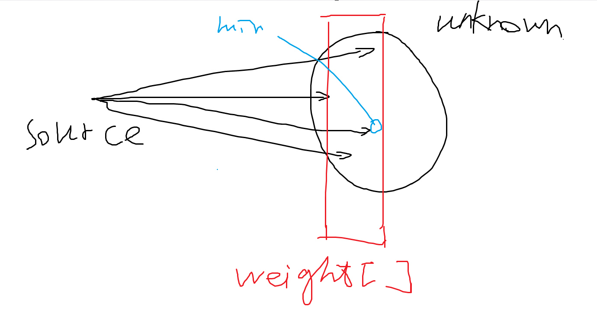
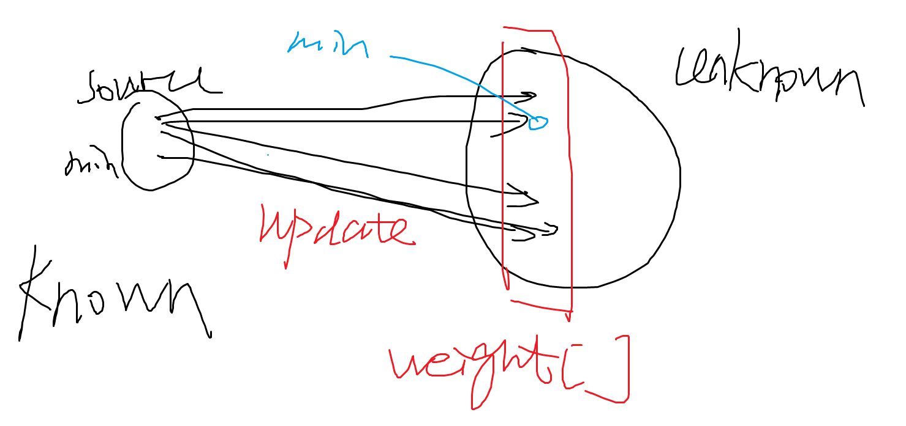
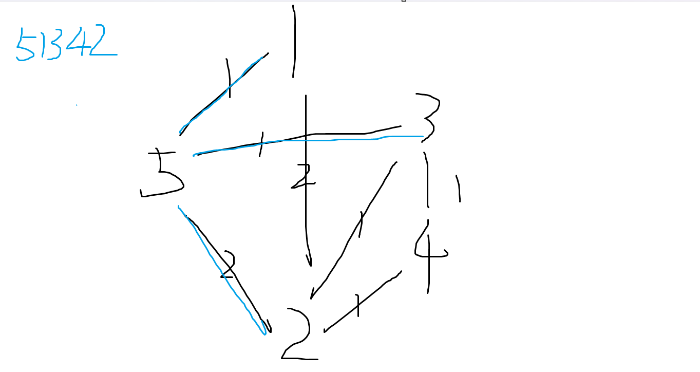
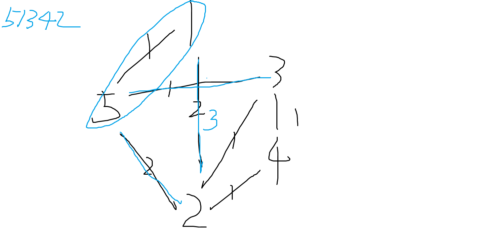
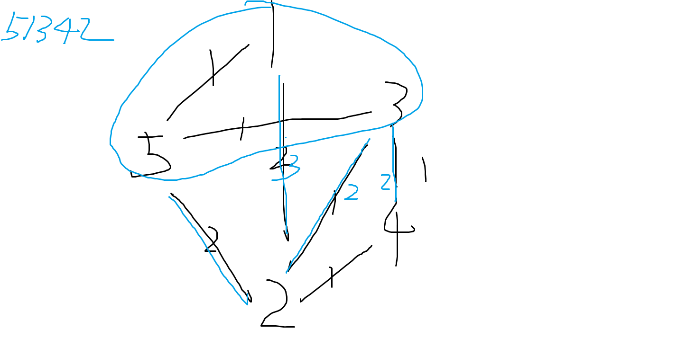
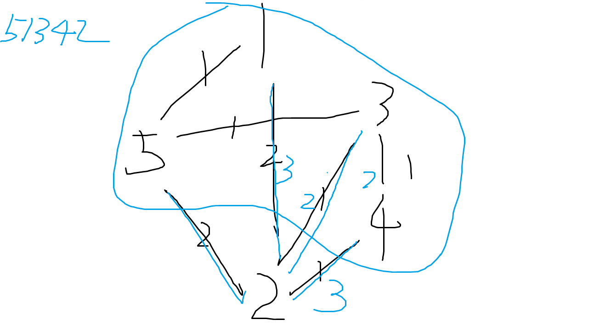

<br/><br/><br/><br/><br/><br/><br/><br/><br/><br/><br/><br/><br/><br/><br/>
<div align=center>
    <font size=6 face=Times>
Dijkstra Sequence
    </font>
    <font size=5 face=楷体>
<br/>
杨亿酬 3230105697
2024-5-12
    </font>
</div>
<div STYLE="page-break-after: always;"></div>

## Chapter 1 Introduction
&nbsp;&nbsp;&nbsp;&nbsp;The shortest path problem is a classic computational problem that deals with finding the shortest paths between vertices in a graph. It has wide applications in areas such as transportation, logistics, communications, and network routing.<br>
&nbsp;&nbsp;&nbsp;&nbsp;Dijkstra’s algorithm is a popular greedy algorithm for finding the shortest path between nodes in a graph. It was conceived by computer scientist Edsger W. Dijkstra in 1956. The algorithm operates by building a set of nodes that have minimum distance from the source,which is efficient for sparse graphs.<br>
&nbsp;&nbsp;&nbsp;&nbsp;Our job is find whether a given sequence is a dijkstra sequence,namely,whether the sequence covers all the vertices of a graph and is a shortest path from the source.If is does,we call it a dijkstra sequence.<br>
&nbsp;&nbsp;&nbsp;&nbsp;To do this,we first input a graph by inputting the number of vertices and edges and the vertices connected by the edges,as well as the weight of the edges.Then we input several sequences,and we output yes if the given sequence is a dijkstra sequence,while output no otherwise.

<div STYLE="page-break-after: always;"></div>

## Chapter 2 Algorithm Specification
- Dijkstra Algorithm<br>
Initialization: The function starts by initializing an array weight that will store the shortest distance from the already visited vertices to the remaining vertices in the graph.<br>
First Vertex Processing: It then processes the first vertex in the sequence, updating the weight array for all vertices adjacent to this first vertex.<br>
Sequence Processing: The function enters a loop that iterates over the rest of the vertices in the sequence. For each vertex, it checks if the shortest distance to the already visited vertices is equal to the shortest distance to the next vertex in the sequence. If not, it returns false, indicating that the sequence is not a valid Dijkstra sequence.<br>
Vertex Inclusion: If the shortest distances match, the function includes the vertex in the set of already visited vertices and updates the weight array accordingly for all vertices adjacent to this newly included vertex.<br>
Result: If the function successfully processes all vertices in the sequence without returning false, it returns true at the end, indicating that the sequence is a valid Dijkstra sequence.<br>

The following is a diagram analysis of the algorithm:<br>
Initialization:


Add the 'min' to Known and update the edges and weight[]:


Repeat until an the vertices are Known.

The following is an example used for explaining how to update the edges:
Initialization:


Add '1' to Known and update the edges:


Add '3' to Known and update the edges:


Add '4' to Known and update the edges:


Add '2' to Known and end the algorithm.

The following is the pseudocode of function IsDijkSeq:
```
FUNCTION IsDijkSeq(G, Seq)
    DECLARE i, j
    DECLARE weight ARRAY OF SIZE G->Nv+1
    weight[0] = -1
    FOR i FROM 1 TO G->Nv+1 DO
        weight[i] = MaxWeight
    END FOR
    DECLARE TempEdge = G->G[Seq[0]].FirstEdge
    weight[Seq[0]] = MaxWeight+1
    WHILE TempEdge IS NOT NULL DO
        weight[TempEdge->AdjV] = TempEdge->Weight
        TempEdge = TempEdge->Next
    END WHILE
    FOR i FROM 1 TO G->Nv-1 DO
        DECLARE temp = 0
        TempEdge = G->G[Seq[0]].FirstEdge
        WHILE TempEdge IS NOT NULL DO
            IF TempEdge->AdjV == Seq[i] THEN
                temp = TempEdge->Weight
                BREAK
            END IF
            TempEdge = TempEdge->Next
        END WHILE
        DECLARE min = MaxWeight
        FOR j FROM 1 TO G->Nv+1 DO
            IF weight[j] < min THEN
                min = weight[j]
            END IF
        END FOR
        IF temp != min THEN
            RETURN false
        ELSE
            weight[Seq[i]] = MaxWeight+1
            DECLARE TempEdge2 = G->G[Seq[i]].FirstEdge
            WHILE TempEdge2 IS NOT NULL DO
                DECLARE TempEdge1 = G->G[Seq[0]].FirstEdge
                IF weight[TempEdge2->AdjV] == MaxWeight+1 THEN
                    TempEdge2 = TempEdge2->Next
                END IF
                IF TempEdge2 IS NULL THEN
                    BREAK
                END IF
                DECLARE cnt = 0
                WHILE TempEdge1 IS NOT NULL DO
                    IF TempEdge1->AdjV == TempEdge2->AdjV THEN
                        cnt = 1
                        BREAK
                    END IF
                    TempEdge1 = TempEdge1->Next
                END WHILE
                IF cnt == 1 THEN
                    IF temp + TempEdge2->Weight < TempEdge1->Weight THEN
                        TempEdge1->Weight = temp + TempEdge2->Weight<br>
                    END IF
                ELSE
                    DECLARE NewEdge
                    NewEdge->AdjV = TempEdge2->AdjV
                    NewEdge->Weight = temp + TempEdge2->Weight
                    NewEdge->Next = G->G[Seq[0]].FirstEdge
                    G->G[Seq[0]].FirstEdge = NewEdge
                END IF
                TempEdge2 = TempEdge2->Next
            END WHILE
            DECLARE TempEdge1_ = G->G[Seq[0]].FirstEdge
            WHILE TempEdge1_ IS NOT NULL DO
                IF weight[TempEdge1_->AdjV] <= MaxWeight THEN
                    weight[TempEdge1_->AdjV] = TempEdge1_->Weight
                END IF
                TempEdge1_ = TempEdge1_->Next
            END WHILE
        END IF
    END FOR
    RETURN true
END FUNCTION
```

Data structure analysis:
- Graph(Weighted undirected connected graph)<br>
  The data structure:Graph shares the following properties:<br>
1.Vertices and Edges: A graph consists of a set of vertices (or nodes) and a set of edges. Each edge connects a pair of vertices. In a weighted graph, each edge has an associated weight, which could represent quantities like distance, cost, etc.<br>
2.Undirected: In an undirected graph, an edge from vertex A to vertex B is identical to an edge from vertex B to vertex A. That is, the graph is bidirectional.<br>
3.Connected: A connected graph is a graph where there is a path from any point to any other point in the graph. This means all vertices are reachable.<br>
4.No Loops or Multiple Edges: In a simple graph, there are no loops (edges connected at both ends to the same vertex) and no multiple edges (more than one edge connecting the same pair of vertices).<br>
By using a Graph data structure, we can indeed access the vertices through the edges. This allows us to model many real-world problems, such as routing, scheduling, and social networking, among others.
  
 <div STYLE="page-break-after: always;"></div>

## Chapter 3 Testing Results
  <table>
  	<tr>
  		<th></th>
  		<th>input</th>
          <th>output</th>
          <th>corresponding purpose</th>
  	</tr>
  	<tr>
  		<th>1</th>
  		<th>5 7<br>
1 2 2<br>
1 5 1<br>
2 3 1<br>
2 4 1<br>
2 5 2<br>
3 5 1<br>
3 4 1<br>
4<br>
5 1 3 4 2<br>
5 3 1 2 4<br>
2 3 4 5 1<br>
3 2 1 5 4<br>
        </th>
          <th>Yes<br>
Yes<br>
Yes<br>
No<br>
		  </th>
          <th>simple sample 1(given by pta)</th>
  	</tr>
  	<tr>
  		<th>2</th>
  		<th>6 8<br>
1 2 3<br>
1 3 2<br>
2 4 5<br>
2 5 2<br>
3 4 1<br>
3 6 4<br>
4 5 2<br>
5 6 3<br>
3<br>
1 2 5 4 6 3<br>
1 3 4 2 5 6<br>
1 3 6 4 2 5<br>
</th>
          <th>No<br>
Yes<br>
No<br>
</th>
          <th>simple sample 2(gengerated by myself)</th>
  	</tr>
      	<tr>
  		<th>3</th>
  		<th>10 15<br>
1 2 1<br>
1 3 2<br>
2 4 1<br>
2 5 2<br>
3 6 1<br>
3 7 2<br>
4 8 1<br>
4 9 2<br>
5 10 1<br>
6 8 2<br>
7 9 1<br>
8 10 2<br>
9 10 1<br>
5 6 2<br>
7 8 1<br>
3<br>
1 2 4 8 10 5 3 6 7 9 <br>
1 3 6 8 4 2 5 10 7 9<br>
1 3 7 9 10 5 2 4 8 6<br>
</th>
          <th>No<br>
			No<br>
			No<br></th>
          <th>a bit larger sample</th>
  	</tr>
      	<tr>
  		<th>4</th>
  		<th>3 3<br>
1 2 1<br>
2 3 1<br>
1 3 2<br>
2<br>
1 2 3<br>
1 3 2</th>
          <th>Yes<br>
		  No</th>
          <th>small sample
</th>
  	</tr>
      	<tr>
  		<th>5</th>
  		<th>see in 5.txt</th>
          <th>No<br>
		  No<br>
		  No<br>
		  No<br>
		  No</th>
          <th>very large sample<br>max Nv,max Ne,max Weight</th>
  	</tr>
  </table>
<br/>


<div STYLE="page-break-after: always;"></div>

## Chapter 4: Analysis and Comments
Let V and E represents the number of vertices and edges in the graph respectively. 
<br>
- Time complexity:

The time complexity of this function mainly depends on nested loops. The outer loop traverses each vertex in the graph, so its complexity is O(V), where V is the number of vertices. The inner loop1,in the worst case,traverses the vertices and records the weight between the Known graph and the other vertices,so it's time complexity is O(V).The inner loop2, in the worst case, may need to traverse all the edges in the graph, so its complexity is O(E), where E is the number of edges. Therefore, the overall time complexity of the function is O(V<sup>2</sup>+V*E).
<br>
- Space complexity:

The space complexity of this function depends on the spatial areas applied for storing the information of the vertices and the edges.Therefore,it is obvious that the space complexity of the algorithm is O(V+E).
<br>
As for why Dijkstra’s algorithm is more effective on sparse graphs, the main reason is that the time complexity of Dijkstra’s algorithm is related to the number of edges in the graph. In a sparse graph, the number of edges is much less than the square of the number of vertices, so the running time of Dijkstra’s algorithm on a sparse graph will be shorter than on a dense graph. In addition, Dijkstra’s algorithm is a greedy algorithm, which always chooses the shortest edge at each step, which allows it to find the shortest path more quickly on a sparse graph.
<br>
### Declaration 
I hereby declare that all the work done in this project titled "Dijkstra Sequence" is of my independent effort.