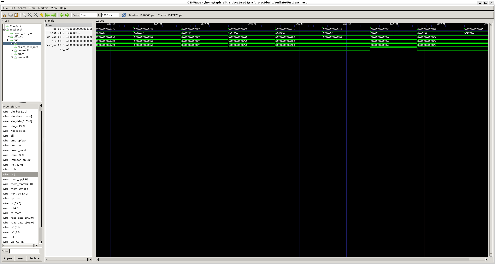

# 单周期CPU设计指导
!!! danger "不要抄袭 不要抄袭 不要抄袭"  

!!! info "以下仅为辅助材料，仅供参考"  

[指令集手册](指令集手册.pdf)  
单周期CPU设计最大的困难在于理论的匮乏与例子的缺少，因此以下会补充一些单周期CPU设计相关的理论并以R-Type为例给出单周期CPU设计的方式  
## 单周期CPU相关理论
### RISCV指令集架构
sys1-proj要实现的指令类型有R/I/S/B/U/J Type共六类，每条指令都由32位的inst确定，这32位存储了指令的类型，数据信息，需要读或写的寄存器编号，例如
```asm
0x0000000000000010 (0x00628e33) add     t3, t0, t1
# 其中pc为0x0000000000000010 inst为0x00628e33
```
pc表示当前执行的位置，每条指令占用四位存储空间，除遇到B Type(分支跳转)或J Type(跳转)指令，其余每条指令执行完后切换下一条指令pc需要+4  
inst的内容是通过取指(Instuction Fetch)得到的，Instruction memory中以pc值为索引存储了所有我们需要的指令，在取指阶段，通过向imem_ift输入pc，instruction memory会返回对应的inst，这一过程是通过valid-ready协议达成的(不过在sys1中，我们只需知道向imem输入pc，会得到返回inst)，由于存储单元的问题，返回的inst是64位的，我们需要通过pc[2]选择高32位或低32位为我们需要的指令。  
指令集手册中写有每类指令与每条指令的构成，在Controller.sv中我们通过inst判断指令类型并输出对应选择器的选择信号控制Core执行。
如下图，对于一条R-type类型的ADD指令，指令类型如下确定  


```verilog
funct7 = inst[31:25] == 7'b0000000;
funct3 = inst[14:12] == 3'b000;
opcode = inst[6:0] == 7'b0110011;
```
opcode:决定指令Type(R Type,I Type...)
funct7(funct3):决定具体指令类型(ADD,SUB,...)
rs1,rs2(register source):源寄存器（对于ADD指令就是两个加数的值存储的寄存器）
rd(register destination):目的寄存器（对于ADD指令就是求得的和要存放的寄存器）
### CPU组成

CPU的数据通路图如上，本质上Core.sv中需要完成的就是线路的连接（需要把上图中所有的线都定义并连接起来），而Controller.sv即Control Logic，完成的是根据指令(inst)输出对应选择器的控制信号  
ALU.sv,Cmp.sv,Regfile.sv为封装的模块，对应图中的ALU，BranchComp，Reg[]，这些模块的设计非常简单，只需注意x0是恒为0的，因此regfile要禁止对x0的写操作  
IMEM,DMEM是repo给出的内存模块，只需将
```verilog  
imem_ift.r_request_bits.raddr  
imem_ift.r_reply_bits.rdata  
dmem_ift.r/w_request_bits.raddr/waddr  
dmem_ift.r/w_reply_bits.rdata/wdata  
dmem_ift.w_request_bits.wmask  
```
正确接线即可  
ImmGen,DataPkg,MaskGen模块要自行设计与实现，具体在[Data Package,Mask Generation,Data Trunc设计](#data-packagemask-generationdata-trunc)会详细解释  
cosim是仿真测试，将pc,inst,wdata等接入cosim用于测试代码的正确性(虽然给出的cosim连线很多，但事实上我们通常只关心pc,inst,wdata的正确性，因为只要这些都正确了，指令执行就基本正确了)
### 指令执行阶段
指令执行分为五个阶段，具体为：

- IF(Instruction Fetch)  
- ID(Instruction Decode)  
- EX(Execute)  
- MEM(Memory)  
- WB(Write Back)  
  
如果区分阶段，则数据通路图如下(以下是sys2-lab1的数据通路图)

四个Reg将通路图切分为五个阶段（该图仅供区分阶段参考用，实际连接使用[CPU组成](#cpu_2)部分给出的通路图）  
#### IF
Instruction Fetch阶段要完成取指操作，具体而言，就是将下一条指令从IMEM(Instruction Memory)中取出来，方法为，向imem.raddr传入pc，imem.rdata传出inst  
完成取指后要对pc进行更新，对于一般指令，pc需要+4，对于条件符合（Cmp.sv返回cmp_res为true）的B型指令和J型指令，需要将pc更新为ALU的计算结果（计算出的跳转地址）  
#### ID
Instruction Decode阶段要完成对取出的指令解码的操作，具体而言，就是判断取出的指令是什么类型的什么指令，rs1,rs2,rd是什么，需要哪些控制信号（在Controller.sv中完成）  
随后通过rs1,rs2(寄存器的编号)从Regfile中取出对应的值，如果Regfile编写正确，那么只需输入rs1,rs2，Regfile输出的read_data_1和read_data_2就是读出的值   
ImmGen设计在之后详细介绍  
#### EX
Execute阶段要完成执行操作，主要是ALU的运算操作，ALU要根据指令类型选择性地读入0/read_data_1/pc和0/read_data_2/imm，并根据控制信号选择计算的方式（加/减/与或非等），B型指令需要CMP执行比较操作，计算得到alu_res根据不同的指令有不同的用途（例如add指令要将alu_res写入rd寄存器，sd指令要将alu_res存入dmem，j指令要将alu_res赋值给pc）
#### MEM
Memory阶段要执行访存操作，也就是访问内存，从内存中取值或存入值，事实上，只有ld(lw,lb,...)和sd(sw,sb,...)指令参与访存阶段，因为其余指令涉及的都是寄存器的操作，这是计算机的存储结构决定的（寄存器->缓存->内存->磁盘）  
访存阶段要做的是向DMEM提供需要读或写的内存地址，如果是读(ld)DMEM会返回读取的值，如果是写(sd)则还需要向DMEM提供写入值  
#### WB
Write Back阶段执行写回操作，具体而言，就是根据指令类型执行写入操作，如add指令要将计算结果alu_res通过regfile写入rd寄存器，j指令要将计算结果alu_res赋值给pc，ld指令要将读出的dmem_ift.r_reply_bits.rdata（通过datatrunc处理后）写回regfile，sd指令没有写回
 
## R-Type数据通路与控制器设计
To be implemented

## Data Package,Mask Generation,Data Trunc设计  
To be implemented
## 调试与运行
1.语法错误  
常见语法错误  
illegal assignment to wire,perhaps intended var  
意思是在时序逻辑中对wire类型进行了赋值  
这是初学者很容易犯的错误  
wire类型是线路，只能通过assign  
而reg类型是寄存器，只能在时序逻辑中赋值  
虽然使用logic类型编译时会自动判断是wire还是reg(也推荐这样编写)，但变量一定是wire或reg类型，而不能同时是二者，因此对任意变量既使用assign又在时序逻辑中赋值一定是错误的  
2.`make wave`仿真测试  
关注重点：pc,inst,wb_val(WDATA)的DUT(Device Under Test)与SIM(Simulation)是否一致
在GTKWave中File>Write/Read Save File可以实现保存和读取功能，避免每次都要拖动信号才能观看波形  
例如出现以下报错
  
表示在执行li指令时，pc与inst错误，即没有正确的读入li指令，实际发生错误的是上一条j指令，观察波形如下  
 
仿真给出的00000354的下一条应该为0000035c但波形显示的是00000358，观察alu_res是正确的0000035c，next_pc也是正确的0000035c，那么说明问题在于正确的next_pc没有在is_j信号为1的情况下传递给pc  
事实上错误是由于
```verilog
    if((is_b&cmp_res))begin //应为is_j|((is_b&cmp_res)
        pc <= next_pc;
    end
    else begin
        pc <= pc + 4;
    end
```