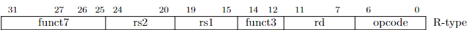
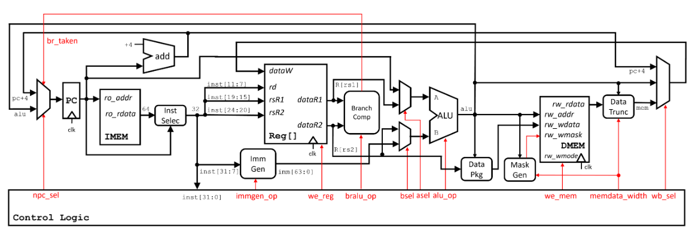
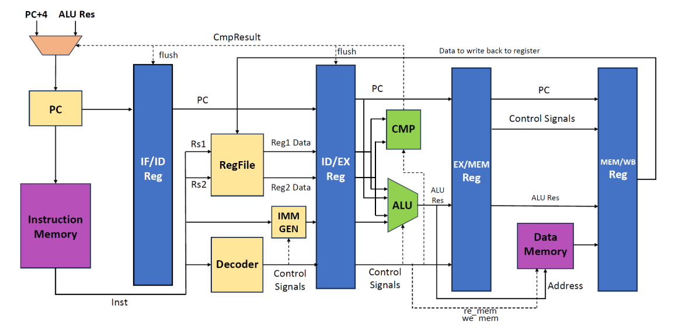

# 单周期CPU设计指导
!!! danger "不要抄袭 不要抄袭 不要抄袭"

[指令集手册](指令集手册.pdf)  
单周期CPU设计最大的困难在于理论的匮乏与例子的缺少，因此以下会补充一些单周期CPU设计相关的理论并以R-Type为例给出单周期CPU设计的方式  
## 单周期CPU相关理论
### RISCV指令集架构
sys1-proj要实现的指令类型有R/I/S/B/U/J Type共六类，每条指令都由32位的inst确定，这32位存储了指令的类型，数据信息，需要读或写的寄存器编号，例如
```asm
0x0000000000000010 (0x00628e33) add     t3, t0, t1
# 其中pc为0x0000000000000010 inst为0x00628e33
```
pc表示当前执行的位置，每条指令占用四位存储空间，除遇到B Type(分支跳转)或J Type(跳转)指令，其余每条指令执行完后切换下一条指令pc需要+4  
inst的内容是通过取指(Instuction Fetch)得到的，Instruction memory中按序存储了所有我们需要的指令，在取指阶段，通过向imem_ift输入pc，instruction memory会返回对应的inst，这一过程是通过valid-ready协议达成的(不过在sys1中，我们只需知道向imem输入pc，会得到返回inst)，由于存储单元的问题，返回的inst是64位的，我们需要通过pc[2]选择高32位或低32位为我们需要的指令。  
指令集手册中写有每类指令与每条指令的构成，在Controller.sv中我们通过inst判断指令类型并输出对应选择器的选择信号控制Core执行。
如下图，对于一条R-type类型的ADD指令


```verilog
funct7 = inst[31:25] == 7'b0000000;


opcode = inst[6:0] == 7'b0110011
```
opcode:决定指令Type(R Type,I Type...)
funct7(funct3):决定具体指令类型(ADD,SUB,...)
### CPU组成

CPU的数据通路图如上，本质上Core.sv中需要完成的就是线路的连接，而Controller.sv即Control Logic，完成的是根据指令(inst)输出对应选择器的控制信号  

To be implemented
### 指令执行阶段
指令执行分为五个阶段，具体为：

- IF(Instruction Fetch)  
- ID(Instruction Decode)  
- EX(Execute)  
- MEM(Memory)  
- WB(Write Back)  
  
如果区分阶段，则数据通路图如下(以下是sys2-lab1的数据通路图)

四个Reg将通路图切分为五个阶段，该图仅供区分阶段参考用，实际连接使用手册给出的通路图
## R-Type数据通路与控制器设计
To be implemented

## Data Package,Mask Generation,Data Trunc设计  
To be implemented
## 调试与运行
1.语法错误  
常见语法错误  
illegal assignment to wire,perhaps intended var
2.`make wave`仿真测试  
关注重点：pc,inst,wb_val(WDATA)的DUT(Device Under Test)与SIM(Simulation)是否一致
To be implemented