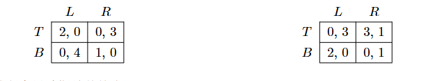
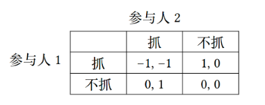
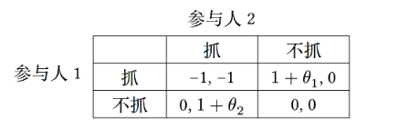
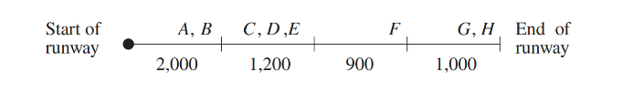

# 课程综合实践II（数据要素交易基础）
## HW1:博弈论与多臂老虎机算法基础
### 1.1 占优策略均衡与纳什均衡的关系
**证明如下关于占优策略均衡与纳什均衡的关系的结论：**
1. 如果每个参与人$i$都有一个占优于其它所有策略的策略$s_i^*$，那么$s^*=(s_1^*,...,s_n^*)$是纳什均衡；
2. 如果每个参与人$i$都有一个严格占优于其它所有策略的策略$s_i^*$，那么$s^*=(s_1^*,...,s_n^*)$是博弈的唯一纳什均衡。

[Answer]
定义 2.1 (纳什均衡定义 1) 给定一个博弈，一个策略组合$s^*=(s_1^*,...,s_n^*)$是一个纳什均衡，如果对于每个参与人$i$，有$u_i(s^∗) ⩾u_i(s_i, s_{−i}^∗)$
1.对策略$s^*$，任意改变某一个参与人$i$的策略为$s_i'^*$，得到新的策略$s'^*=(s_1^*,...s_{i-1}^*,s_i'^*,s_{i+1}^*,...,s_n^*)$
对$\forall i$，$s_i^*$是一个占优于其它所有策略的策略，即$u(s_i^*)⩾u(s_i'^*)$，从而对参与人$i$而言，总策略的效用$u_i(s^*)⩾u_i(s'^*)=u_i(s_i'^*,s_{-i}^*)$，由纳什均衡的定义，策略$s^*=(s_1^*,...,s_n^*)$是纳什均衡
2.假设除$s^*=(s_1^*,...,s_n^*)$外，还存在另一个纳什均衡$s'^*=(s_1'^*,...,s_n'^*)$，则$s'^*$与$s^*$至少有某一策略不同，不妨记为$s_j^*$与$s_j'^*$
由纳什均衡的定义，对$\forall i$，$u_i(s'^∗) ⩾u_i(s_i', s_{−i}'^∗)$，则显然$u_j(s'^∗) ⩾u_j(s_j', s_{−j}'^∗)$
对$\forall i$，$s_i^*$是一个严格占优于其它所有策略的策略，而$s_j^*$与$s_j'^*$是两个不同的策略，因此有$s_j^* > s_j'^*$，则$u_j(s'^∗) <u_j(s_j^*, s_{−j}'^∗)$
也即对$s'^*$,$\exists j,当s_j^* = s_j',u_j(s'^∗)<u_j(s_j', s_{−j}'^∗)$这与$s'^*$是纳什均衡矛盾，假设不成立
所以$s^*=(s_1^*,...,s_n^*)$是博弈的唯一纳什均衡

### 1.2 N人古诺竞争
**假设在古诺竞争中，一共有$J$家企业。当市场中所有企业总产量为$q$时，市场价格为$p(q) = a−bq$。且每个企业生产单位产品的成本都是同一个常数$c$，即企业$i$的产量为$q_i$时该企业的成本为$c_i(q_i) = c ·q_i$。假设$a > c ⩾0，b > 0$，**
1. 求纳什均衡下所有企业的总产量以及市场价格；
2. 讨论均衡价格随着$J$变化的情况，你有什么启示？
3. 讨论$J →∞$的均衡结果，你有什么启示？

[Answer]
1.某企业$i$的效用为$u_i(q_1,...,q_J)=(a-b(q_1+...+q_J))q_i-cq_i$
记$q_1+...+q_{i-1}+q_{i+1}+...+q_J=q_{-i}$
则企业$i$的效用为$u_i(q_i,q_{-i})=(a-b(q_i+q_{-i}))q_i-cq_i$
记企业$i$的最优反应为$R(q_{-i})$，则
$\frac{\partial u_i}{\partial q_i} = a-2bq_i-bq_{-i}-c = 0$
解得$q_i=R(q_{-i})=\frac{a-bq_{-i}-c}{2b}$
显然，在成本相同的情况下，均衡解中每个企业的产量是相同的，$q_{-i}=(J-1)q_i$
从而$q_i=\frac{a-c}{b(J+1)}$
总产量$q=Jq_i=\frac{J(a-c)}{(J+1)b}=\frac{a-c}{b}-\frac{a-c}{(J+1)b}$
市场价格$p(q) = a−bq=\frac{a+Jc}{J+1}=c+\frac{a-c}{J+1}$
2.均衡价格$p(q) =c+\frac{a-c}{J+1}$随$J$的上升而下降，并不断接近成本$c$,可知当市场中企业数量增多时，竞争加剧，市场价格下降，单个企业利润下降，这与预期是相符的
3.$J →∞$时，每个企业的产量$q_i=\frac{a-c}{b(J+1)}→0$，市场价格$p(q)=c+\frac{a-c}{J+1}→c$，总产量$q$不断增加，在无数竞争者的环境下，单个企业对市场的影响极小，而总产量不断上升，供大于求，市场价格不断下降，当降价至成本价后，效用为0，单个企业也不再愿意生产
企业数量$N$增加 → 每个企业的市场份额下降 → 单个企业对价格的影响力减弱，而总产量不断增加 → 市场价格不断降低 → 企业无法维持高价，只能接受更低的价格 → 利润下降 → 单个企业产量降低

### 1.3 公地悲剧
**假设有$I$个农场主，每个农场主均有权利在公共草地上放牧奶牛。一头奶牛产奶的数量取决于在草地上放牧的奶牛总量$N$：当$N<\overline{N}$时，$n_i$头奶牛产生的收入为$n_i\cdot v(N)$；而当$N \geq \overline{N} $时，$v(N)\equiv0$。假设每头奶牛的成本为$c$，且$v(0) > c,v'< 0,v''< 0$，所有农场主同时决定购买多少奶牛，所有奶牛均会在公共草地上放牧（注：假设奶牛的数量可以是小数，也就是无需考虑取整的问题）。**
1. 将上述情形表达为策略式博弈；
2. 求博弈的纳什均衡下所有农场主购买的总奶牛数（可以保留表达式的形式，不用求出具体解）；
3. 求所有农场主效用之和最大（社会最优）情况下的总奶牛数（可以保留表达式的形式，不用求出具体解），并与上一问的结果比较，你能从中得到什么启示？
 
[Answer]
1.$I$个农场主博弈，每个参与人的策略集合是$[0,+∞)$,各自有放牧奶牛数量的策略$n_1,...,n_I$
每个农场主$i$的效用：
$$
u_i(n_i)=
\begin{cases}
n_i (v(N) - c) & N < \overline{N}  \\
-n_i c          & N \geq \overline{N}
\end{cases}
$$
2.记$n_1+...+n_{i-1}+n_{i+1}+...+n_I=n_{-i}$
则农场主$i$的效用为$u_i(n_i)=n_i·(v(n_i+n_{-i})-c)$
记农场主$i$的最优反应为$R(n_{-i})$，则
$\frac{\partial u_i}{\partial n_i} = v(n_i+n_{-i})-c+n_i·v'(n_i+n_{-i}) = 0$
纳什均衡下，农场主是对称的，即$N=I·n_i$
即有$v(I·n_i)-c+n_i·v'(I·n_i) = 0$
从而纳什均衡条件为$v(N)+\frac{N}{I}·v'(N) = c$
3.所有农场主效用之和$u=\sum_{i=1}^Iu_i(n_i)=\sum_{i=1}^In_i·(v(N)-c)=N·(v(N)-c)$
社会最优时$\frac{du}{dN}=v(N)-c+Nv'(N)=0$
从而社会最优条件为$v(N)+Nv'(N)=c$
比较纳什均衡条件与社会最优条件，假设纳什均衡条件下的解为$N^*$，社会最优条件的解为$N^{**}$，$v(N^{**})+N^{**}v'(N^{**})=c$，那么$v(N^{**})+\frac{N^{**}}{I}v'(N^{**})>c$，而$v(N)$是递减的凹函数，$v(N^{*})+\frac{N^{*}}{I}v'(N^{*})=c \Rightarrow N^{*}>N^{**}$(构造辅助函数$\Phi(N)=v(N)+\alpha Nv'(N)$，易得$\Phi'(N)<0)$
即纳什均衡条件下的解$N^*>$社会最优条件的解$N^{**}$，说明纳什均衡条件下存在过度放牧的情况，增加奶牛降低总体收益但增加个人收益（负外部性），这导致了公地悲剧

### 1.4 贝叶斯纳什均衡
**考虑如下的不完全信息博弈：**
- **$I={1,2}$：$1$和$2$分别是行、列参与人**
- **$T_1={A,B},T_2={C}$:参与人$1$有两种类型，参与人$2$有一个类型**
- **$p(A,C)=\frac{1}{3},p(B,C)=\frac{2}{3}$**
- **每个参与人有两个可能的行动，下图所示矩阵给出了两种类型向量下的收益矩阵（左图为$t=(A,C)$时的博弈，右图为$t=(B,C)$时的博弈）：**

求解该博弈的所有贝叶斯纳什均衡.

[Answer]
设参与人$1$在类型A下的混合策略为$[x(T),(1-x)(B)]$，在类型B下的混合策略为$[y(T),(1-y)(B)]$，参与人$2$的混合策略为$[p(L),(1-p)(R)]$
首先检查是否存在纯策略纳什均衡：
- 若$p=0(R)$，类型A参与人$1$的最优反应是$B$，类型B参与人$1$的最优反应是$T$，因此这种情况下参与人$2$的最优反应是$p=1$，因此不是均衡
- 若$p=1(L)$，类型A参与人$1$的最优反应是$T$，类型B参与人$1$的最优反应是$B$，因此这种情况下参与人$2$的最优反应是$p=0$，因此不是均衡
  
因此我们知道参与人$2$均衡时不可能选择纯策略，因此一定会选择混合策略。根据混合策略的无差异原则有参与人$2$选择$L$与$R$无差异：
$$
\frac{1}{3}*4(1-x)+\frac{2}{3}*3y=\frac{1}{3}*3x+\frac{2}{3}*(y+(1-y))
$$
解得$x=\frac{2+6y}{7}$，接下来研究是否只要满足这一条件就可以是均衡，参与人$1$在类型为A,B时分别有效用函数：
$$
u_{1A}=2xp+(1-x)(1-p)= 3xp-x-p+1 \\
u_{1B}=3y(1-p)+2p(1-y)= -5yp+3y+2p
$$
求导可知，最优反应为
$$
x^*=
\begin{cases}
0 & p < \frac{1}{3}  \\
[0,1] & p = \frac{1}{3}, \\
1 & p > \frac{1}{3}
\end{cases}
y^*=
\begin{cases}
1 & p < \frac{3}{5}  \\
[0,1] & p = \frac{3}{5} \\
0 & p > \frac{3}{5}
\end{cases}
$$
将上式与$x=\frac{2+6y}{7}$联立，可得唯一解：
$p=\frac{3}{5},x=1,y=\frac{5}{6}$
综上，该博弈有唯一混合策略贝叶斯纳什均衡：
类型A参与人$1$永远选择$T$；
类型B参与人$1$以$\frac{5}{6}$的概率选择$T$，$\frac{1}{6}$的概率选择$B$；
参与人$2$以$\frac{3}{5}$的概率选择$L$，$\frac{2}{5}$的概率选择$R$

### 1.5 混合策略的不完全信息解释
**考虑以下抓钱博弈（grab the dollar）：桌子上放 1 块钱，桌子的两边坐着两个参与人，如果两人同时去抓钱，每人罚款 1 块；如果只有一人去抓，抓的人得到那块钱；如果没有人去抓，谁也得不到什么。因此，每个参与人的策略是决定抓还是不抓。**
**抓钱博弈描述的是下述现实情况：一个市场上只能有一个企业生存，有两个企业在同时决定是否进入。如果两个企业都选择进入，各亏损 100 万；如果只有一个企业进入，进入者盈利 100 万；如果没有企业进入，每个企业既不亏也不盈。**

1. 求抓钱博弈的纯策略纳什均衡；
2. 求抓钱博弈的混合策略纳什均衡；

[Answer]
1.根据最优反应的定义，如果参与人$1$选择抓，参与人$2$的最优反应是不抓，如果参与人$1$选择不抓，参与人$2$的最优反应是抓；如果参与人$2$选择抓，参与人$1$的最优反应是不抓，如果参与人$2$选择不抓，参与人$1$的最优反应是抓
因此上述博弈中存在两个纯策略纳什均衡（抓，不抓），（不抓，抓）
2.设参与人$1$的混合策略为$[x(抓),(1-x)(不抓))]$，参与人$2$的混合策略为$[y(抓),(1-y)(不抓)]$
根据无差异原则，参与人$1$选择抓与不抓的效用相同
$$
y*(-1)+(1-y)=0
$$
解得$y=\frac{1}{2}$
同理，参与人$2$选择抓与不抓的效用相同，由于二者是对称的，已得$x=\frac{1}{2}$
此时参与人$1$选择抓的收益为0，选择不抓的收益也为0，参与人$2$同理，因此这是一个纳什均衡
所以该博弈有混合策略纳什均衡：双方都以$\frac{1}{2}$的概率选择抓或不抓
   
**现在考虑同样的博弈但具有如下不完全信息：如果参与人$i$赢了，他的利润是$ 1 + θ_i$（而不是 $1$）。这里 $θ_i $是参与人的类型，参与人$ i $自己知道$ θ_i$，但另一个参与人不知道。假定 $θ_i $在 $[−ε, ε] $区间上均匀分布。**

**由于两个参与人的情况完全对称，故考虑如下对称贝叶斯纳什均衡（两个人的策略相同）形式：参与人$i(i = 1, 2) $的策略均为**
$$
s_i(θ_i)=
\begin{cases}
抓 & 如果\theta _i \ge \theta ^*  \\
不抓          & 如果\theta _i \lt \theta ^*
\end{cases}
$$

**即$ θ^∗$是两个参与人抓或不抓的类型分界阈值，其中$ θ^∗$是一个待计算确定的参数。**
3. 求$ θ^∗$；
4. 当$ ε →0$ 时，上述贝叶斯纳什均衡会收敛于什么？从中你能得到怎样的启示。

[Answer]
3.根据无差异原则，当$\theta _i =\theta^*$时，参与人$i$抓与不抓无差异
当参与人$i$选择抓，此时另一个参与人$j$选择抓的概率（根据均匀分布）为$P(\theta _j \ge \theta ^*)=\frac{ε-\theta ^*}{2ε}$，选择不抓的概率为$P(\theta _j \lt \theta ^*)=\frac{\theta ^*+ε}{2ε}$
此时参与人$i$抓的收益：
$$
u_{1抓}=(\frac{ε-\theta ^*}{2ε})*(-1)+\frac{\theta ^*+ε}{2ε}*(1+\theta _i)
$$
而参与人$i$不抓的收益
$$
u_{1不抓}=0
$$
由无差异原则，当$\theta _i =\theta^*$时
$$
(\frac{ε-\theta ^*}{2ε})*(-1)+\frac{\theta ^*+ε}{2ε}*(1+\theta ^*)=0
$$
解得$\theta ^*=0$
4.当$ ε →0$ 时，上述贝叶斯纳什均衡会收敛于完全信息的抓钱博弈，这与海萨尼提出的混合策略的纯化理论一致：完全信息博弈中的混合策略纳什均衡可以被解释为不完全信息博弈中纯策略贝叶斯纳什均衡的极限
在完全信息博弈中，参与者因为无差异而使用混合策略，引入不完全信息后，完全会根据私有信息选择纯策略，而当不完全信息消失（趋于0），贝叶斯纳什均衡会收敛到完全信息混合策略均衡

### 1.6 飞机跑道成本分配的沙普利值计算
机场跑道的维护费用通常是向在那个机场降落飞机的航空公司来收取的。但是轻型飞机所需的跑道长度比重型飞机所需的跑道长度短，这就带来了一个问题，如何在拥有不同类型飞机的航空公司之间确定公平的维护费用分摊。
定义一个成本博弈$ (N ; c)$（即每个联盟的效用是成本函数$ c$），这里$ N $是降落在这个机场上的所有飞机的集合，$c(S)$（对每个联盟$ S$）是能够允许联盟中所有飞机降落的最短跑道的维护费用。如果用沙普利值来确定费用的分摊，**证明：每段跑道的维护费用由使用那段跑道的飞机均摊。**
下图描绘了一个例子，其中标号为 $A, B, C, D, E, F, G$ 和$ H $的八架飞机每天都要在这个机场降落。每架飞机所需的跑道的整个长度由图中的区间来表示。例如，飞机$F$ 需要前三个跑道区间。每个跑道区间的每周维护费用标示在图的下面。例如，$c(A, D, E) = 3200$，$c(A) = 2000 $和$c(C, F, G) = 5100$。在这一例子中，$A$ 的沙普利值恰好等于$ 2000/8 = 250$，而$ F $的沙普利值等于 $2000/8 + 1200/6 + 900/3 = 750$。
你的任务是将这一性质推广到一般的情形下给出证明（**提示：使用沙普利值的性质和公式的特点**）。

[Answer]
定义一个成本博弈$ (N ; c)$（即每个联盟的效用是成本函数$ c$），这里$ N $是所有参与人构成的集合$N=\left\{1,...,n\right\}$，$c(S)$（对每个联盟$ S$）是满足联盟中所有参与人的最低成本（即$c(S)= max_{i \in S}c_i$），不妨设$0=c_0 \le c_1 \le ... \le c_n$，则参与人$i$的沙普利值$SV_i = \sum_{j=1}^i \frac{c_j-c_{j-1}}{n-j+1}$
证明：
利用
$$ SV_i = \frac{1}{n!} \sum_{S \subseteq N \setminus \{i\}} |S|!(n - |S| - 1)! (c(S \cup \{i\}) - c(S)) $$
1° 对包含$i+1,...,n$至少一个的组合，$c(S\cup\left\{i\right\})-c(S)=0$
2° 对最大包含$j$($1 \le j\lt i$)的排列，$c(S\cup\left\{i\right\})-c(S)=c_i - c_j$，这样的排列共$\sum_{k=0}^{j-1}C_{j-1}^k(k+1)!(n-k-2)!$个
3° $j=0$(即空集)时，$c(S\cup\left\{i\right\})-c(S)=c_i$，这样的排列共1个
对$j$从$0$到$i-1$求和，有（事实上，这就是ppt34页给出的公式）
$$
SV_i=\frac{c_i}{n}+\frac{1}{n!}\sum_{j=1}^{i-1}\sum_{k=0}^{j-1}C_{j-1}^k(k+1)!(n-k-2)!(c_i-c_j)
$$
其中
$$
\begin{aligned}
&\sum_{k=0}^{j-1}C_{j-1}^k(k+1)!(n-k-2)! \\
&\quad\stackrel{m=j-1-k}{=}(j-1)!\sum_{m=0}^{j-1}\frac{j-m}{m!}(n-j+m-1)! \\
&\quad=(j-1)!(jC_{n-1}^{j-1}(n-j-1)!-C_{n-1}^{j-2}(n-j)!) \\
&\quad=n!(\frac{1}{n-j}-\frac{1}{n-j+1})
\end{aligned}
$$
代入
$$
\begin{aligned}
&SV_i=\frac{c_i}{n}+\sum_{j=1}^{i-1}(\frac{1}{n-j}-\frac{1}{n-j+1})(c_i-c_j) \\
&\quad=\frac{c_i}{n}+(\frac{1}{n-1}-\frac{1}{n})(c_i-c_1)+...+(\frac{1}{n-i+1}-\frac{1}{n-i+2})(c_i-c_{i-1}) \\
&\quad=\frac{1}{n-i+1}c_i+(\frac{1}{n}-\frac{1}{n-1})c_1+...+(\frac{1}{n-i+2}-\frac{1}{n-i+1})c_{i-1} \\
&\quad=\frac{c_1-c_0}{n}+\frac{c_2-c_1}{n-1}+...+\frac{c_i-c_{i-1}}{n-i+1} \\
&\quad=\sum_{j=1}^i \frac{c_j-c_{j-1}}{n-j+1}
\end{aligned}
$$

### 1.7 $ε$-贪心算法的遗憾分析
**令$\epsilon _t=t^{-1/3}(K\log t)^{1/3}$，证明：$\epsilon$-贪心算法的遗憾界为$O(T^{2/3}(K\log T)^{1/3})$。**
提示：整体思路是先考虑求任一时刻$ t + 1 $的期望遗憾$\mathbb{E}[R_{t+1}]$，然后对这些遗憾求和，具体步骤如下：
1. 对于时刻$ t + 1$，注意在前$ t $时刻中期望出现$ ∑_{i=1}^t ε_i $次探索，则每个臂被选中的平均次数为$∑_{i=1}^t \frac{ε_i}{K}$，然后定义事件$E$为
$$
|\mu _{t+1}(a)-Q_{t+1}(a)|\le \sqrt{\frac{K\log t}{\sum _{i=1}^t\epsilon _i}},
$$
则接下来的步骤与课上讲的贪心算法分析类似；
2. 证明任一时刻$t+1$的期望遗憾$\mathbb{E}[R_{t+1}]$满足
$$
\mathbb{E}[R_{t+1}]\le 3(\frac{1}{t}K\log t)^{1/3}+O(t^{-2});
$$
注意其中需要用到$\epsilon _t$非增（即$\epsilon _t \ge \epsilon_{t+1}$）的条件；
3. 将上式从$1$到$T$求和并放缩得到遗憾界。

[Answer]
每一步既有利用又有探索
根据前一轮，计算单轮的遗憾
1.应用$Hoeffding$不等式，对每一个臂$a$有：
$$
\begin{aligned}
&P\left(|\mu_{t+1}(a) - Q_{t+1}(a)| \leq \sqrt{\frac{K \log t}{\sum_{i=1}^t \epsilon_i}}\right) \\
&\quad \geq 1 - 2 \exp\left(-2 n_a \frac{K \log t}{\sum_{i=1}^t \epsilon_i}\right) \\
&\quad = 1 - 2 \exp\left(-2 \sum_{i=1}^t \frac{\epsilon_i}{K} \cdot \frac{K \log t}{\sum_{i=1}^t \epsilon_i}\right) \\
&\quad = 1 - 2 \exp\left(-2 \log t\right) \\
&\quad = 1 - 2 t^{-2}
\end{aligned}
$$
2.对任意时刻$t+1$，有$\epsilon_{t+1}$的概率进行探索（exploration)，$1-\epsilon_{t+1}$的概率利用（exploitation)，其中探索部分$\epsilon _t$非增，奖励在区间[0,1]之间
$$
\begin{aligned}
&\mathbb{E}[R_{t+1}]=\mathbb{E}[R(t+1)|exploration]\cdot P(exploration)+\mathbb{E}[R(t+1)|exploitation]\cdot P(exploitation) \\
&\quad \le 1\cdot \epsilon_t+\mathbb{E}[R(t+1)|exploitation] \cdot 1
\end{aligned}
$$
利用：
引理：$(*)$
$$
\sum_{i=1}^t \epsilon_i \lt \int_1^t(\frac{K\log x}{x})^{1/3}dx \lt\int_1^t(x^{-1/3}(K\log x)^{1/3}+\frac{1}{2}x^{2/3}(K\log x)^{-2/3})dx=\frac{3}{2}t^{2/3}\left(K\log t\right)^{1/3}
$$
令$rad=\sqrt{\frac{K \log t}{\sum_{i=1}^t \epsilon_i}}$
$$
2rad=2\sqrt{\frac{K \log t}{\sum_{i=1}^t \epsilon_i}}\lt 2\left(\frac{K\log t}{t^{2/3}(K\log t)^{1/3}}\right)^{1/2}=2\epsilon_t
$$
使用第1步$Hoeffding$不等式的结果：
$$
\begin{aligned}
&\mathbb{E}[R_{t+1}(exploitation)]=\mathbb{E}[R_{t+1}(exploitation)|E]\cdot P(E)+\mathbb{E}[R_{t+1}(exploitation)|\overline{E}]\cdot P(\overline{E}) \\
&\quad \le 2rad\cdot 1+O(t^{-2}) \\
&\quad \lt 2\epsilon_t +O(t^{-2})
\end{aligned}
$$
结合探索与利用有：
$$
\mathbb{E}[R_{t+1}]\le \epsilon_t+\mathbb{E}[R(t+1)|exploitation]\le 3\epsilon_t+O(t^{-2})=3(\frac{1}{t}K\log t)^{1/3}+O(t^{-2})
$$
3.将上式从$1$到$T$求和并利用引理$(*)$
$$
\begin{aligned}
&\sum_{t=1}^T\mathbb{E}[R_{t+1}]\le \sum_{t=1}^T\left(3(\frac{1}{t}K\log t)^{1/3}+O(t^{-2})\right) \\
&\quad =3\sum_{t=1}^T\epsilon_t + O(1) \\
&\quad \le O(T^{2/3}\left(K\log T\right)^{1/3})
\end{aligned}
$$
从而$\epsilon$-贪心算法的遗憾界为$O(T^{2/3}(K\log T)^{1/3})$