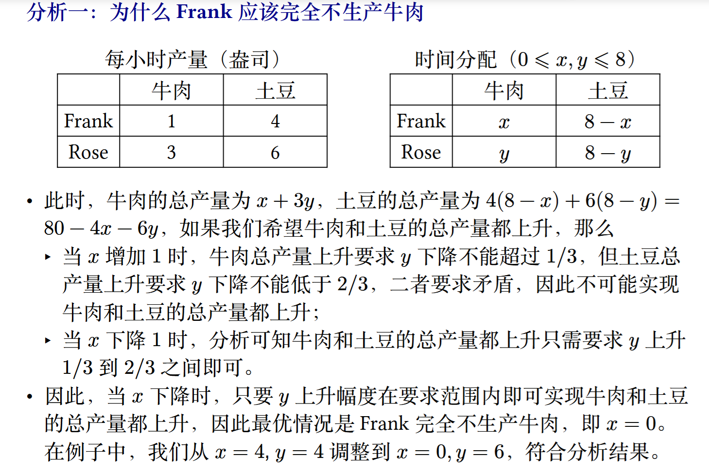
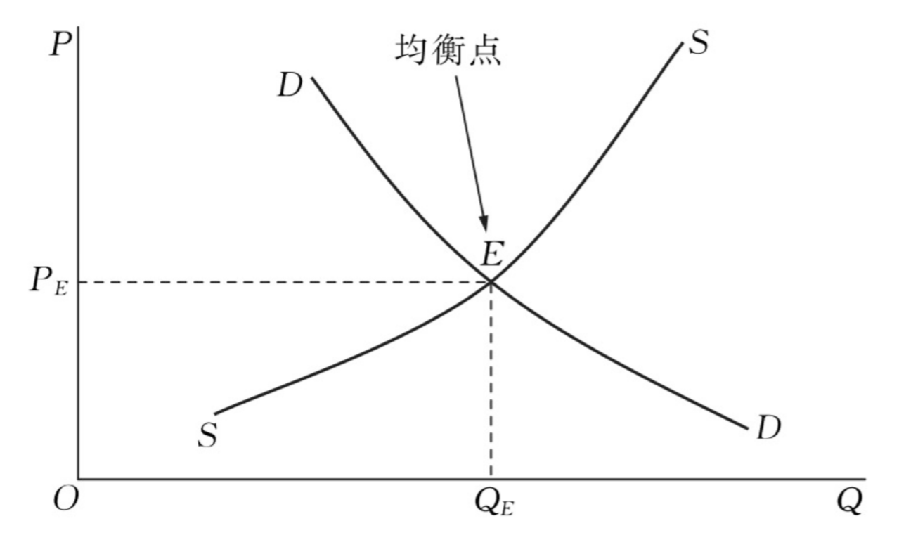
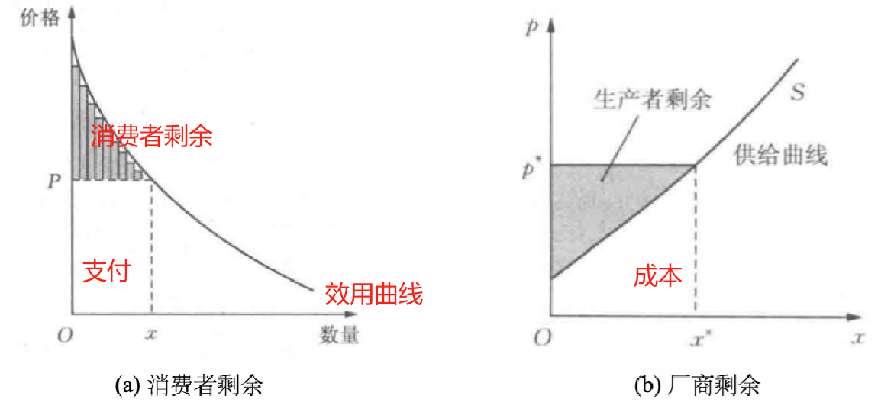
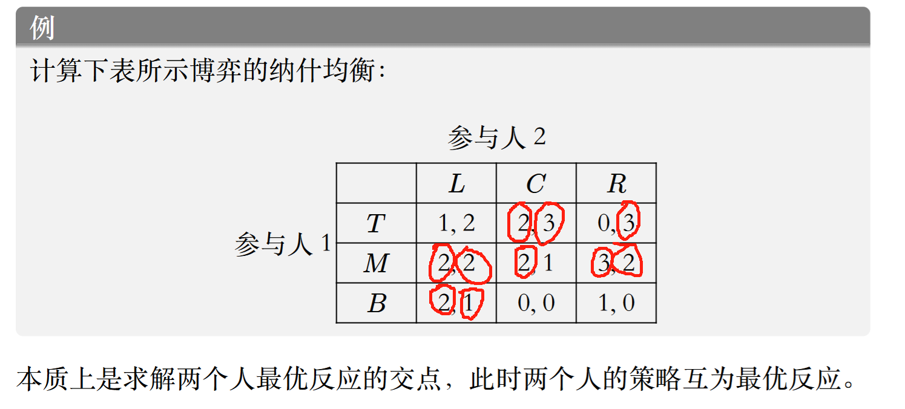
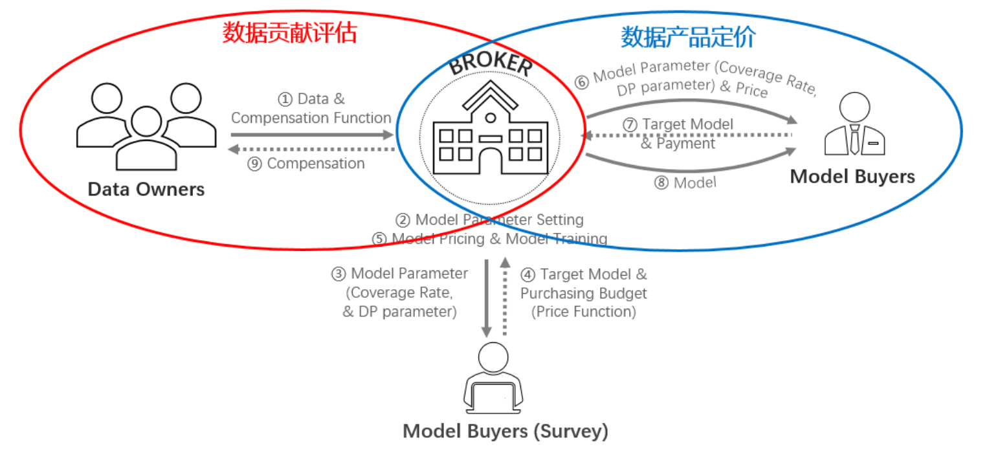
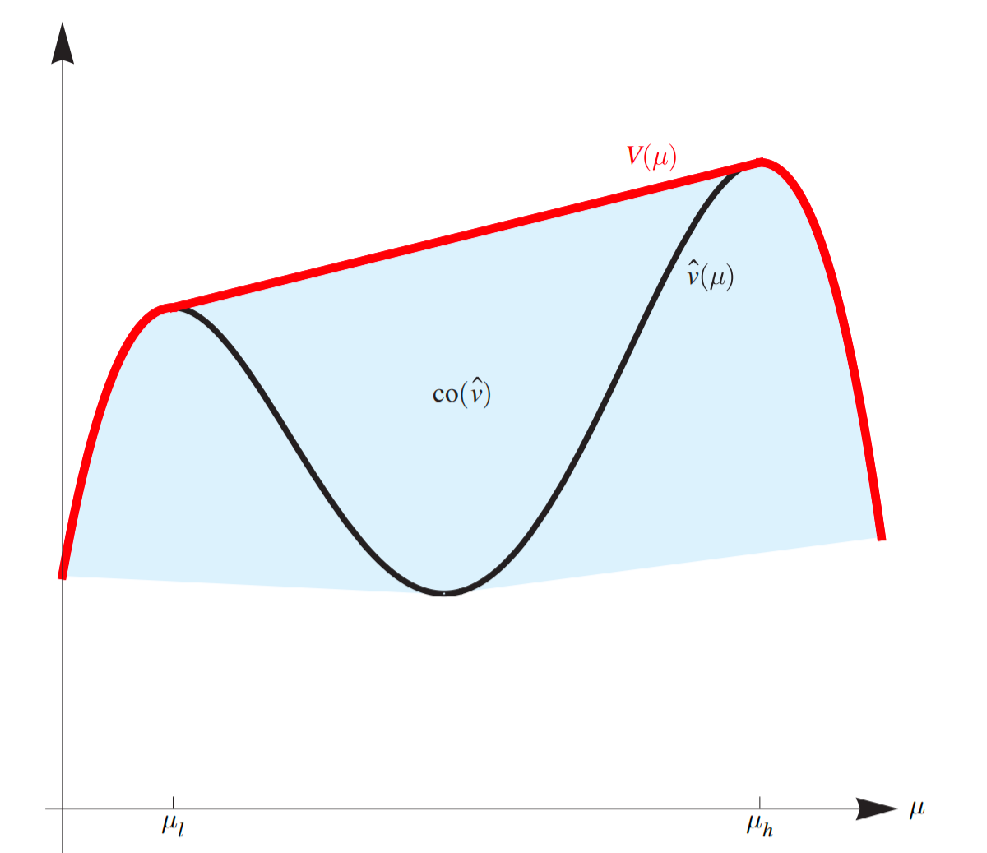
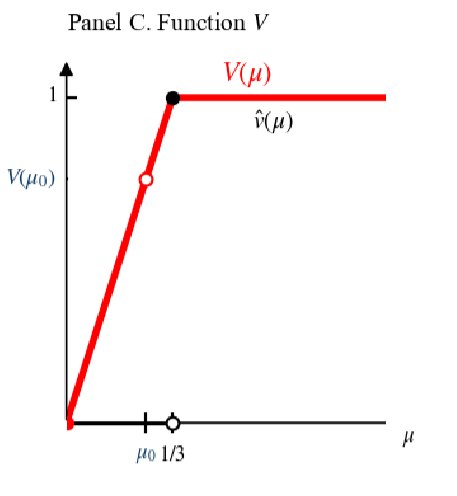

# 课程综合实践II——数据要素交易基础
## 考试重点
引言：基本概念（简答）  
安全：了解安全方法  
非合作博弈：纳什均衡计算  
合作博弈：三人沙普利值的计算  
多臂老虎机：概念与性质（MWU是无憾算法等结论）（简答）  
拍卖（不同于作业）：VCG,课件提问(拍卖与数据定价部分不考)  
版本化定价：无套利概念+去年作业题  
贝叶斯劝说  
最后一讲：选择一题  
## Lec 01:数据要素市场概述
### 生产要素
企业：生产并出售产品，雇佣并使用生产要素  
家庭：购买服务和商品，拥有并出售生产要素  
生产要素：劳动力、土地、资本（钱不是资本）、企业家才能（技术）  
**数据的特性：零成本复制性，价值不确定性**  
### 数据市场的经济学原理
数据的乘数效应：数据->产品->更多的数据  
数据定价  
绝对优势：生产者生产一种物品所需投入较少  
机会成本：为了得到某种东西而必须放弃的东西  
比较优势：如果一个生产者在生产 X 物品时放弃了较少的其他物品，即生产 X 物品的机会成本较小，就可以说他在生产该物品上具有比较优势；（比较机会成本，一个人不可能在两边都拥有比较优势）  
机会成本：为了得到某种东西而必须放弃的东西  
  
边际效用：增加一个单位的效用  
边际成本：增加一个单位所需要的成本（航空公司对等退票乘客收取的价格）  
Quiz1  
```text
A国生产1单位计算机，放弃26单位小麦，
B国生产1单位计算机，放弃20单位小麦，B国在生产计算机上的机会成本更低    
A国生产1单位小麦，放弃1/26单位计算机，
B国生产1单位小麦，放弃1/20单位小麦，A国在生产小麦上的机会成本更低    
1)B国在生产计算机上具有比较优势，A国在生产小麦上具有比较优势，
A国应该出口小麦，进口计算机，B国应该出口计算机，进口小麦  
2)1单位计算机和20-26单位小麦交换时合理的范围    
```
### 数据市场基本概念
分类：原始数据、查询服务、模型数据  
数据交易流程：数据收集、数据存储、数据产品化（关系型数据库、机器学习模型）、数据合规、数据定价、数据溯源、数据销毁  
### 数据市场设计要求
#### 产权问题
#### 定价问题
成本法（零成本复制性，价值不确定性）  
收益法（内在价值&工具价值）  
市场法  
#### 公平和隐私问题
## Lec 02:数据合规与安全
### 安全多方计算
百万富翁问题：保密比较财富  
香蕉与苹果的solution  
A构造n把锁，B仅有第j把锁的钥匙，A给定n把锁的标志位，B检查第j把锁的标志位，得到结果  
### 联邦学习
传统机器学习：拿草（数据）给羊（模型）吃（训练）  
联邦学习：羊到各个草场吃  
联邦学习：一种具备数据隐私保护的分布式机器学习技术，数据拥有方在不公开本地数据的前提下通过加密传输模型实现共同训练  
- 横向联邦学习：单一数据库用户量不足   
- 纵向联邦学习：单一数据库属性维度不足  
- 迁移联邦学习：数据库之间样本和属性重叠均较少  
### 数据脱敏
数据脱敏：根据制定的脱敏规则，针对敏感信息进行数据变形或遮蔽  

- 动态数据脱敏：不脱离生产环境的实时脱敏，访问时处理  
- 静态数据脱敏：脱离生产环境，脱敏后分发，脱敏后数据与生产环境相隔离  
  
脱敏方法  

- 无效化：截断、加密、隐藏、打*   
- 随机化  
- 数据替换  
- 对称加密  
- 平均值：重新随机分布  
- 偏移与取整  
  
### 差分隐私
“隐私”的数学模型  
对真实数据增加噪声扰动实现隐私的量化保护  
input one row的变化，攻击者无法根据output区分input的变化  
隐私度ε，**ε越小（趋近0），privacy越强，utility可用性越差**  
Laplace机制：query q的真实结果为q(D)，返回q(D) + η，η服从Laplace分布  
密度函数f(x|μ,b)，μ=0，f = Lap(b),方差2b²  
敏感度：|q(D)-q(D')|<=S(q),A(D) = q(D) + Lab(S(q)/ε)满足ε-差分隐私，即η=Lab(S(q)/ε)  
quiz2  
全局差分隐私：数据拥有者->可信的数据管理者->扰动  
本地差分隐私：数据拥有者添加噪声->不可信的数据管理者  
### 全同态加密
密文域的操作等效于明文域的对应操作，支持加法与乘法的操作  
可用不可见，但计算成本高  
### 零知识证明
证明者能够不向验证者提供任何有用的信息的情况下，使验证者相信某个论断是正确的  
洞穴开门的例子  
### 数据合规
Watermark：水印  
embedding:noise range partition(red&green domain)  
detection:difference都来源于同一个domain  
## Lec 03:非合作博弈论基础（一）
### 微观经济学基础
偏好：对可选方案的排序  
为偏好赋予常数，称为消费组合对消费者的效用  
效用函数就是将消费束映射到满意程度的函数u:R<sup>n</sup>->R,u(一斤苹果，-6元钱) = 0  
理性人假设：效用最大化（不理性人：行为经济学）  
贝叶斯公式  
效用函数：  

- 柯布-道格拉斯效用$ u(x1,x2)=x_1^{\alpha}x_2^{1-\alpha}，\alpha\in(0,1)$  
  边际效用递减,边际效用是指消费者对某种物品的消费量每增加一单位所增加的额外满足程度  
- 冯诺依曼-摩根斯坦效用$u(L)=pu(x)+(1-p)u(y)$,L:彩票,p:中奖概率  
  u是严格凹函数->风险厌恶，u是严格凸函数->风险偏好，u是线性函数->风险中性  
- 拟线性效用函数：$u(x,p)=u(x)-p$,通过价格p购买消费束x后的效用  

效用最大化问题：  
效用函数u(x1,x2),两种商品价格p1,p2,消费者收入为p  
$max u(x1,x2),s.t.p_1x_1,p_2x_2 <= p$,u关于x1,x2递增，因此u取最大值时等号成立  
令效用函数为柯布-道格拉斯效用函数，不难发现需求与价格之间呈反相关  
#### 市场出清
需求定律:商品的需求量与价格之间成反方向变动  
供给定律:商品价格与供给量成正方向变动  
  
市场出清：市场机制自发消除超额供给或超额需求  
竞争均衡：每个人各自的行动无法改变市场价格  
#### 社会福利
福利:资源配置有效性的衡量标准  
  
消费者剩余=买到的商品效用-支付，厂商剩余=出售的效用-成本  
支付 = 出售的效用，福利最大化：商品效用-成本最大化  
福利经济学第一定律：竞争市场中，市场供给达到均衡时，市场资源配置是福利最大化的（看不见的手）  
#### 市场失灵 
##### 垄断
垄断:一个产品只有一家厂商生产  
垄断厂商通过提高价格攫取更多的消费者剩余  
##### 外部性
一个人或一群人的行动和决策使另一个人或一群人受损或受益的情况，即社会成员从事经济活动时其成本与后果不完全由该行为人承担；负外部性：上游排污下游受损，正外部性：植树造林优化居民环境（公共物品）  
##### 信息不对称
柠檬市场（次品市场）  
好货与次货无法分辨->支付意愿下降->好货卖家不愿出售->退出市场->次货占领市场，即“劣币驱逐良币”->降低买卖双方福利->市场失灵  
解决方案：监管、保修（斯宾塞劳动力市场模型，学历的筛选作用），保险的逆向选择（买家选择购买），道德风险（已经购买保险）  
#### 数据
卖家垄断，零成本复制性：供给曲线失效（P=0,需求Q=0,P>0,Q=+∞），外部性（竞争厂家的购买），数据产权，信息不对称（买家不知道效用，卖家不确定买家）  
价格歧视  

- 一级（完全）价格歧视：完全掌握消费者偏好  
- 三级价格歧视：根据消费者特征收取不同价格（大数据杀熟，学生半价）  
- 二级价格歧视：按不同价格出售不同数量的商品（价目表）（大客户，信息甄别，版本化）  
  
### 博弈论基础
$max u(x) \rightarrow max u(x_i,x_{-i}),x_{-i} = (x_1,...,x_{i-1},x_{i+1},...,x_n)$  
垄断（单个），寡头垄断（少数厂商），伯川德竞争，价格=成本  
协议（垄断协议），书店构成卡特尔（反垄断法）
博弈的基本要素：多个人的决策，博弈的行为相互影响  
三元组G=(N,S,u),参与人N，策略：集合S，报酬函数u  
博弈的解/解概念  
博弈的分类  

- 非合作  
  - 完全信息/非完全信息  
  - 静态/动态  
- 合作  
  
### 占优策略均衡
严格劣策略：无论对方选择什么，自己选择这个策略都是最差的（被严格占优）  
出于个人理性的决策无法达到社会最优  
解决囚徒困境：强制力，机制设计，长期关系...  
**博弈论求解：重复剔除严格劣策略**  
如果没有严格劣策略->弱占优（在所有情况大于等于，在某些情况下大于）  
颤抖的手原则：考虑各情况都有概率取到  
重复剔除弱劣策略的顺序会影响结果（严格劣策略不影响）  
quiz3.1  

### 纳什均衡
稳定策略：没有人愿意偏离的策略，此时的策略对每个人来说是一个对给定策略的最佳应对  
离散策略求解：互为最优反应  
quiz3.2  
  
两个圆圈圈出的都是纳什均衡  
连续策略求解：古诺竞争（竞争产量）  
最优反应->偏导数为0（记得验证二阶导）  
纳什均衡：均衡策略无人改变，占优策略均衡：对对方任意策略都占优  
协调博弈：博弈双方协调各自的策略对双方都有利  
## Lec 04:非合作博弈论基础（二）
### 混合策略纳什均衡
稳定的策略带有随机，混合策略即为选择策略$s_i$的概率分布，纯策略：某一个策略概率为1  
策略型博弈的混合扩展，策略->概率分布，效用->期望（冯诺依曼-摩根斯坦效用）  
混合策略纳什均衡：效用（期望）最高的混合策略向量（概率分布）  
等价定义：只需要与纯策略相比（不偏向任何一个纯策略）  
**计算：最 


优反应，无差异原则（对应求导等于0，纯策略之间无差异）**  
推论：被严格占优的策略不可能属于混合策略的支撑集合（被赋予正概率）  
无差异但仍选取某一个固定策略概率是为了达到稳定状态（不然对方会修改策略）  
**note:无差异原则只是混合策略纳什均衡的必要条件，需要验证是否存在更高效用（纯策略）**  
纳什定理（混合策略纳什均衡的存在性）：每一个策略型博弈G，如果参与人数有限，纯策略数目有限，那么G至少有一个混合策略纳什均衡  
### 完全信息动态博弈
扩展式博弈，策略为向量（即使在某处停下）  
子博弈：子树  
完美信息博弈：每个参与人在行动时，都知道他位于博弈树的哪个节点上（e.g象棋&斗地主）  
子博弈完美均衡  
均衡精炼（选择某一些均衡）  
存在不是子博弈完美均衡的纳什均衡（全局均衡在某一个子博弈上不再完美均衡）  
因为威胁的存在所以某一均衡是纳什均衡，但这一威胁可能是不可置信的（不理性的）  
此时子博弈完美均衡是纳什均衡的精炼  
完全混合的纳什均衡是子博弈完美均衡（每个策略都有正概率，存在威胁）  
计算子博弈完美均衡：逆向归纳法  
每个有限完美信息扩展式博弈都至少有一个子博弈完美纯策略均衡  
产量领导模型（斯塔克尔伯格模型）：双层优化问题  
### 不完全信息博弈
行业博弈均衡计算：先验概率，劣策略/无差异原则  
**策略式博弈：五元组（添加参与人类型与先验分布p）**，先验分布p是给类型向量赋予一个概率  
效用与所有人的类型相关（可以考虑你和一个能力未知的人匹配打游戏），而策略只与自己的类型相关  
贝叶斯均衡：对每一个参与人i，每个类型ti，每个可能的纯策略si，都有效用最大  
三阶段  

- 自然赋予的类型（事前阶段ex ante）  
- 更新分布选择形同（事中阶段interim）  
- 得到收益（事后阶段ex post)  
  
使用无差异原则前要检验是否存在纯策略均衡  
2024-HW4-4.2  

## Lec 06:多臂老虎机算法基础与应用
### 随机多臂老虎机
机器学习：特性->标签学习映射  
基于识别的：回归，聚类  
基于监督的：多臂老虎机  
探索与利用  

- 完全反馈：看到所有臂的收益（股票）  
- 部分反馈：部分臂的奖励（定价）  
- 老虎机反馈：只能看到选择臂的奖励（新闻）  
  
遗憾分析  
伪遗憾，期望遗憾  
Hoeffding 不等式  
#### 贪心算法 
始终选择当前估计奖励最高的臂，并利用历史经验更新对每个臂的奖励估计值  
遗憾分析：$O(T^{\frac{2}{3}}(KlogT)^\frac{1}{3}$(K是臂的数量，所有的收益都在0，1之间)  
#### $ε$-贪心算法
以$1-ε$的概率选择当前估计奖励最高的臂，以$ε$的概率随机选择一个臂  
HW1.7
#### 上置信界算法（UCB）
首先将每一个候选臂都选择一遍，作为初始化；然后在后续的时间步中，选择奖励均值估计量的上置信界最大的臂  
该值越大则说明估计的不确定性越大，因此能过鼓励玩家尝试较少被选择的臂，避免陷入次优  
UCB 算法的遗憾界为$O(\sqrt{KT\log T})$
#### 汤普森采样算法
采用贝叶斯方法，为每个臂维护一个先验概率分布，表示对该臂奖励概率的信念。每次选择臂时，从每个臂的后验概率分布中进行采样，并选择采样值最高的臂。最后，根据获得的奖励更新所选臂的后验概率分布，从而在探索和利用之间取得平衡。  
使用Beta分布在获得奖励后调整概率分布  
TS 算法的遗憾界为$O(\sqrt{KT\log T})$
### 对抗性多臂老虎机
对手在已知概率分布的情况下选择一个代价向量  
玩家可以学到所有代价以调整策略（全反馈）  
定义遗憾：和每轮都选择**同一行动的最优的固定行动**的代价之差  
无憾：平均遗憾趋于0  
跟风算法（Follow-The-Leader,FTL）：在每一个时间点t，选择最小累计代价的行动i  
跟风算法不是无憾的  
随机化是无憾的必要条件（通俗而言，如果不随机，对手可以每次设置策略对应行动的代价为1）  
简单情况（存在一个完美的行动，其代价永远为 0，且代价只有可能为0或1）  
对每一步 𝑡 = 1, 2, ..., 𝑇 ，记录截至目前从没出现过代价 1 的行动，然后在这些行动中根据均匀分布随机选择一个行动  
无憾算法：乘性权重算法  
代价可以是[0,1]中的任意值，不存在完美策略，则维护权重函数：$w_{t+1}(i)=w_t(i)(1-\epsilon c_t(i))$  
遗憾上界$O(\sqrt{T\ln n}$  
Hedge算法，Exp3算法（老虎机反馈）  
### 多臂老虎机的应用
动态定价问题  
二分搜索：向上探索时过于激进  
改进算法：使用平方缩小  
改进算法的遗憾为1+2loglogN  

## Lec 05:合作博弈与数据估值
### 合作博弈
分摊美元博弈：公平、效率   
可转移效用的合作博弈（TU博弈）：参与人的子集成为联盟，v是联盟的特征函数，v(S)表示联盟S的价值  
解概念：一个将每个博弈都映射到一个可行的收入分配集合的函数  
如果对于任意的博弈解概念都是一个单点集，则称这一解概念为单点解  
### 核
定义：满足有效率的，联盟理性（对于任何联盟而言，他们在大联盟中分配到的收入一定不会比离开大联盟组成小联盟获得的收入少）的合作博弈的解概念
### 数据估值
Shapley值性质：有效率的，参与人对称的（两个不同参与人的加入为联盟增加的收入一致），解概念对称的（不同参与人i和j的解概念相同），零参与人（如果一个参与人对于任何联盟的加入都不会增加联盟的效用，那么他的收入为0）  
Shapley值定义：对所有可能的排列，求出分配向量的加权平均  
排列（n!），组合（2<sup>n-1</sup>）  
$$
v(S)=
\begin{cases}
0 & S=\varnothing  \\
17 & S=\left\{A\right\} \\
15 & S=\left\{B\right\} \\
18 & S=\left\{C\right\} \\
35 & S=\left\{A,B\right\} \\
36 & S=\left\{B,C\right\} \\
38 & S=\left\{A,C\right\} \\
56 & S=\left\{A,B,C\right\} 
\end{cases}
$$

| 排列 | A | B | C |
| :---: | :----: | :---: | :---: |
| ABC | 17 | 18 | 21 |
| ACB | 17 | 18 | 21 |
| BAC | 20 | 15 | 21 |
| BCA | 20 | 15 | 21 |
| CAB | 20 | 18 | 18 |
| CBA | 20 | 18 | 18 |
| avg | 19 | 17 | 20 |

留一法（leave-one-out,LOO）：数据Di的效用（控制变量）T=O(n)  
*Data Shapley:Di 对大小为 j 的联盟的边际贡献  
Beta Shapley:赋予权重，更重视较小联盟的边际贡献  
Data Banzhaf:降低输入顺序的影响  
T=O(2<sup>n</sup>)  
### Shapley值计算
排列采样：边际贡献、互补贡献  
动态Shapley值（增删某些数据的Shapley值变化）  
## Lec 07:拍卖与机制设计基础
### 拍卖理论基础

- posted price  
- auction:bid(投标)  
  - open-bid auction  
    - English auction(open ascending price)：二价（但存在相互依赖价值）  
    - Dutch auction(open descending price)：一价  
  - sealed-bid auction  
    - first-price auction(一价拍卖):支付自己的报价  
    - second-price auction(二价拍卖):支付第二高的报价  
    reserve price,entry fee  
  - bargaining(double-auction)  
  - reverse auction  
  - 多物品（频谱）/组合拍卖  
  
投标规则，交易规则，信息规则
#### 单物品密封拍卖
分配规则（某投标下获得物品的概率），支付规则（某投标下需要支付的价格）  
##### 二价拍卖
二价拍卖是诚实占优的  
社会福利：  
买家:$t_i-p,0,...,0$  
卖家:$p$  
福利：最高报价$t_i$  
二价拍卖的缺陷：谎报第二价格  
二价拍卖诚实的关键：报价与自己的估值无直接关联
大于等于三价拍卖都是不诚实的，以三价拍卖为例，竞拍者有动机夸大报价，因为支付的是第三高价而非自己的报价，竞拍者可以有意提高报价以确保获胜，只要第三高价小于估值就仍然可以盈利，不同于二价拍卖，因为在二价拍卖中，如果竞拍者提高报价可能支付高于自己估值的价值导致亏损  
##### 一价拍卖
对称递增均衡策略$β(t)=t/2$
##### 收入等价定理
假设竞拍者估价独立同分布，那么只要估价为 0 的竞拍者的期望支付为0，且拍卖规则为报价最高者得到物品，则拍卖的递增对称均衡都会使得卖家获得相等的期望收入。  
注：期望支付=均衡出价*概率，期望收入=期望支付的积分和（P20）  
### 机制设计基础
定义：对不完全信息博弈，一个机制是一个二元组(S,M)，S是参与人的纯策略集合，M是将纯策略向量映射到结果集合的概率分布的映射  
确定性：M映射到确定的结果集合O  
#### 显示原理
直接（显示）机制：策略=类型，报告估值  
激励相容：诚实报告，占优策略激励相容（dominant-strategy incentive compatib,DISC）（诚实策略是占优均衡），贝叶斯激励相容（BIC）（诚实策略是贝叶斯纳什均衡）  
显示原理：给定任意一个机制及其均衡策略（占优策略均衡或贝叶斯纳什均衡），都可以找到一个激励相容的直接机制，使得两个机制的结果一致  
例：将一价拍卖变诚实  
报价高获得物品但只需支付报价一半  
**机制设计者替代参与人做了求解均衡的工作**  
#### 迈尔森引理
一个拍卖机制是DSIC的，当且仅当其分配规则和支付规则(**x**,**p**)满足，**x**是单调不减（报价越高概率越高）；给定**x**，**p**的表达式唯一确定$p_i(b_i)=p_i(0)+b_i\cdot x_i(b_i)-\int_0^{b_i}x_i(s)ds$（迈尔森支付公式）（为了让别人诚实需要损失一定的利润，一价拍卖不诚实的原因）  
二价拍卖的验证 critical value  
对m个相同数据设计DSIC拍卖，m+1价拍卖  
迈尔森引理的证明：连不等式，同除z-y并令z->y  
### 福利最大化机制设计
福利最大化机制：拍卖机制选择的分配方案，使得社会福利达到最大，即所有赢家对分配到物品的估值之和最大
（迈尔森引理无法解决的情况：多维）  
VCG机制：假设诚实，分配规则：所有人收益最大化的分配$\omega^*=argmax_{\omega\in\Omega}\sum_{i=1}^nb_i(\omega)$，支付规则：不包含参与人i的最大福利-所有参与人（i也参与拍卖）的最大福利再剔除i（外部性，加入拍卖的影响）$p_i(b)=\sum_{j\neq i}b_j(\omega_{-i}^*)-\sum_{j\neq i}b_j(\omega^*)$，可能有多种分配方式，需要分别计算  
二价拍卖的例子  
VCG是DSIC（诚实）的；福利最大化的（事后有效率的/帕累托最优的：所有参与者真实信息（如估值）已知的情况下，资源的分配方式能够实现社会福利最大化，即没有任何其他分配方式能让至少一个人变得更好，而不让其他人变差）；支付非负的；事后个人理性（参与机制个人效用非负）  
缺陷：计算困难性，增加竞拍者导致卖家收益降低（削弱卖家的参与意愿）  
增加竞拍者可能降低VCG机制的收益，但增加竞拍者不会降低二价拍卖的收益   
## Lec 08:最优机制
卖家的收益最大化的拍卖机制
### 虚拟福利最大化
不同玩家的估值分布是独立的（但不一定是同分布的）
#### BIC迈尔森引理
诚实是贝叶斯纳什均衡  
用期望概率与期望支付替换DISC情况下的概率与支付  
#### IR个人理性
竞拍者估值为最低值时的期望支付小于等于0
#### 转化为虚拟福利最大化问题
虚拟估值$c_i(t_i)=t_i-\frac{1-F_i(t_i)}{f_i(t_i)}$
虚拟福利最大化时，拍卖机制能同时兼顾收益和效率
### 最优机制
最大化虚拟估值的加权平均  
正则化条件：虚拟估值$c_i(t_i)$是单调递增的  
给最大虚拟估值者赋概率1（如果虚拟估值都小于0，全赋概率0，不卖了）  
与二价拍卖的区别：$c^{-1}(0)$保留价，低于不卖（独立同分布）  
最优机制的条件：虚拟估值最大且大于等于0，$c_i(t_i)=max_{j\neq i}c_j(t_j)\ge 0$  
缺陷：估值分布难以检测，非对称模型报价最高的不一定获得物品（不符合事后有效），存在保留价物品不一定能卖出（不符合福利最大化，这是显然的，利润最大化和福利最大化是会有冲突的）  
多物品单位需求拍卖：虚拟估值大于保留价就卖  
### *拍卖与数据定价
机器学习模型：单位预测准确度的估值，模型预测的准确率（添加噪声）  
竞争比：无先验拍卖机制的收益与固定价格的最优收益的比，2.42  
差分隐私与近似诚实  
指数机制
## Lec 09:数据版本化定价
### 数据交易基本框架
### 数据定价基本方法
成本法、收益法、市场法
### 数据定价基本策略
数据定价基本要求：  

- 传统市场定价要求  
  - 效用最大化/帕累托最优/预算约束/社会福利最大化  
  - 平衡预算  
  - 个人理性  
  - 无嫉妒  
- 数据隐私性  
- 动态性（数据更新）  
- 无套利原则  
- 诚实性/激励相容  
- 公平分配  
- 高效  
  
个人理性，激励相容，平衡预算与社会福利最大化四者不可兼得  
现实中的定价策略：  

- 免费数据  
- 根据使用次数决定价格  
- 打包定价  
- 订阅制  
- 免费增值  
   
特点：需求导向  
免费增值的方式：版本化  

- 原始数据版本化：数据分块出售，根据数据关键性特征分级分类出售，添加噪声构造新版本  
- 查询数据版本化：为任意SQL查询定价  
- 机器学习模型版本化：添加噪声影响模型准确性，从而生成不同版本的模型  

问题：**套利**（利用市场价格差异无风险赚取利润）  
卖香蕉3美元一根，10美元三根  
先分三次借到三根香蕉（做空），捆绑出售再分三次还钱  
### 查询数据的版本化定价
信息无套利：如果某查询Q1的结果是另一个查询Q2结果的子集，那么Q1的价格低于Q2  
组合无套利：如果一次查询可以拆成两次完成，那么一次查询的价格不能大于两次查询的价格之和，否则买家可以通过两次查询绕过一次查询实现套利  
单调性：$\forall A\subseteq B,f(A)\le f(B)$
次可加性：$f(x+y)\le f(x)+f(y)$  
或$v(A\cup B)\le v(A)+v(B)$竞拍者对物品组合的估值不超过单独估值之和
### 机器学习模型的版本化定价
  
数据拥有者compensation function:隐私问题与收入分配  
模型购买者price function:数据产品的效用  
中间商:划分模型版本使得收入最大化，并实现公平分配、无套利、模型效用最大化  
Revenue Maximization：Q-NP问题，存在2-近似算法  
## Lec 10:贝叶斯劝说
### 例子
1.参与人：导师、企业  
2.策略：写推荐信，$A=\left\{雇，不雇\right\}  $
3.类型：学生$\Omega = \left\{ex,av\right\},\omega \in \Omega$
4.先验：$\mu_0(ex)=0.25,\mu_0(av)=0.75$  
5.效用：  

- 导师：$v(雇,\omega)=1,v(不雇,\omega)=0$  
- 企业：$v(雇,ex)=1,v(雇,av)=-0.5,v(不雇)=0$  
  
导师的策略(企业已知)  
$S=\left\{e,a\right\}$  
$\pi(e|ex),\pi(a|ex),\pi(e|av),\pi(a|av)$:对好/一般同学写好/一般推荐信的概率  
**诚实策略**：$\pi(e|ex)=1,\pi(a|ex)=0,\pi(e|av)=0,\pi(a|av)=1$  
企业：e->hiring,a->not $u=0.25$  
导师：$u=0.25$  
**完全不诚实**：$\pi(e|ex)=1,\pi(e|av)=1,\pi(a|ex)=0,\pi(a|av)=0$  
企业：
雇：$0.25*1-0.75-0.5=-0.125$  
不雇：$u=0$  
导师：$u=0$  
**部分诚实**：$\pi(e|ex)=1,\pi(e|av)=\frac{2}{3},\pi(a|ex)=0,\pi(a|av)=\frac{1}{3}$  
企业：  
$\mu_a(ex)=0,\mu_a(av)=1$（推荐信一般的情况下，学生类型的概率，后验分布$\mu(ex|a)$）  
$\mu_e(ex)=\frac{1}{3},\mu_e(av)=\frac{2}{3}$  
贝叶斯公式：$\mu(\omega|s)\stackrel{\Delta}{=}\mu_s(\omega)=\frac{\pi(s|\omega)\mu_0(\omega)}{\sum_{\omega' \in \Omega}\pi(s|\omega')\mu_0(\omega')}$  
雇|e：$\frac{1}{3}*1-\frac{2}{3}*0.5=0$，不雇:0  
不雇|a:$0$  
(雇和不雇无差异)  
$u=0$  
导师：$u=0.75$  
### 模型描述与问题转化
#### 一般模型
1.参与人：信号发送方、接收方  
2.策略：  

- 发送方：$(S,\pi(S|\omega))$->信号机制，其中$S$是信号实现空间，$s\in S$是信号实现  
- 接收方：$A\left\{a_1,...,a_n\right\}$  
  
3.效用函数：发送方$v(a,\omega)$，接收方$u(a,\omega)$  
4.类型和先验分布$\Omega=\left\{\omega_1,...,\omega_n\right\}$，$\mu_0 \in int(\Delta(\Omega))$（$\Omega$上概率分布的内点）  
行动顺序：  
1.发送方公开（承诺）一个信号机制$(S,\pi(S|\omega))$  
2.自然从$\mu_0(\omega)$抽取一个$\omega \in \Omega$  
3.导师根据信号机制$\pi(s|\omega)$，发送$s \in S$  
4.接收方收到$s$后，计算$\mu_s$，选择最优行动  
5.计算接收方$u(a,\omega)$，发送方$v(a,\omega)$  
目标：  
1.发送方发送信号是否可以使效用提升？什么样的情况会提升？  
2.最优的信号机制是什么？  
3.接收者是否愿意接收这样的信号？  
#### 问题转化
后验概率分布的分布$\tau$，有支撑集$\left\{\mu_e,\mu_a\right\}$，$\tau(\mu_e)=0.75=P(e),\tau(\mu_a)=0.25$  
期望$\mathbb{E}(\tau)=0.75(\frac{1}{3},\frac{2}{3})+0.25(0,1)=(0.25,0.75)=\mu_0$  
定义：
1.$\tau$由信号机制导致  
2.贝叶斯可行(Beyasian plausible):  
$$
\sum_{\mu}\tau(\mu)\cdot\mu=\mu_0
$$
定理:一个贝叶斯可行的后验概率分布的分布$\tau$$\iff$$\tau$由信号机制导致  
证明：$\Leftarrow:S=\left\{s_1,...,s_n\right\}$  
$\forall s\in S,\omega \in \Omega,\mu_s(\omega)=\frac{\pi(s|\omega)\cdot\mu_0(\omega)}{\sum_{\omega'}\pi(s|\omega')\cdot\mu_0(\omega')}$  
$\tau(\mu_s)=P(s)=\sum_{\omega'}\pi(s|\omega')\cdot\mu_0(\omega')$  
$\Rightarrow\sum_{s\in S}\tau(\mu_s)\cdot \mu_s=\sum_{s\in S}\pi(s|\omega)\cdot\mu_0(\omega)=\mu_0(\omega)$  
$\Rightarrow:\tau(\mu_s),\mu_0(\omega),\mu_s(\omega)\rightarrow\pi(s|\omega)$  
$(\tau(\mu_s)\cdot\mu_s(\omega)=\pi(s|\omega)\cdot\mu_0(\omega))$  
令$\pi(s|\omega)=\frac{\tau(\mu_s)\mu_s(\omega)}{\mu_0(\omega)}\rightarrow\sum_{s\in S}\frac{\tau(\mu_s)\mu_s(\omega)}{\mu_0(\omega)}=1$  
信号机制$\iff$贝叶斯可行的后验概率分布的分布$\iff$最优行动的分布$\iff$发送者期望效用  
问题转化：设计一个贝叶斯可行的后验概率分布的分布$\tau$使得接收者效用最大化  
### 最优信号机制
设后验概率分布为$\mu$时，接收方最优行动为$\hat{a}(\mu)$  
$\hat{v}(\mu)=E_{\mu}v(\hat{a}(\mu),\omega)$  
最优化的目标：$max E_{\tau}\hat{v}(\mu),s.t.\sum_{\mu}\tau(\mu)\cdot\mu=\mu_0$  
定理（信息设计的显示原理）：只需要考虑$S \subseteq A$，且一个$s\in S$对应一个最优$a\in A$的机制（导师发送的信号对应企业的最优行动），即信号可合并  
#### 最优信号机制的解
##### 凹包络
定义(函数$\hat{v}$)的凹包络$V(\mu)=sup\left\{z|(\mu,z)\in co(\hat{v})\right\}$。其中$co(\hat{v})$是$\hat{v}$图像的凸包（大于等于$\hat{v}$的最小凹函数）  
凸包：将某个集合补成凸集（任意两点连线在集合内）  
  
##### 导师写推荐信的解
$\mu(excellent)\ge\frac{1}{3}$时，$\hat{a}(\mu)=hiring$，导师的效用$\hat{v}(\mu)=1$，反之为$0$  
  
$\mu_1(ex)=0,\mu_1(av)=1,\tau(\mu_1)=\frac{1}{4}$  
$\mu_2(ex)=\frac{1}{3},\mu_2(av)=\frac{2}{3},\tau(\mu_2)=\frac{3}{4}$  
$\pi(1|ex)=\frac{\tau(\mu_1)\cdot\mu_1(ex)}{\mu_0(ex)}=0$  
$\pi(1|av)=\frac{\tau(\mu_1)\cdot\mu_1(av)}{\mu_0(av)}=\frac{1}{3}$  
$\pi(2|ex)=\frac{\tau(\mu_2)\cdot\mu_2(ex)}{\mu_0(ex)}=1$  
$\pi(2|av)=\frac{\tau(\mu_2)\cdot\mu_2(av)}{\mu_0(av)}=\frac{2}{3}$  
#### 接收者是否愿意接收信号
定理：在最优信号机制下，接收方的收益提高了  
证明：$(S,\pi(s|\omega)$，接收方看到$s$，更新$\mu_s(\omega)=\frac{\pi(s|\omega)\cdot\mu_0(\omega)}{\sum_{\omega'\in\Omega}\pi(s|\omega')\cdot\mu_0(\omega')}$  
$max_{a\in A}E_{\mu_s}u(a,\omega)=max_{a\in A}\sum_{\omega\in\Omega}\mu_s(\omega)\cdot u(a,\omega)$  
$$
\begin{aligned}
&\sum_{s\in S}P(s)\cdot max_{a\in A}E_{\mu_s}u(a,\omega)=\sum_{s\in S}max_{a\in A}\sum_{\omega\in\Omega}\pi(s|\omega)\mu_0(\omega)u(a,\omega) \\
&\quad \ge max_{a\in A}\sum_{s\in S}\sum_{\omega\in S}\pi(s|\omega)\cdot\mu_0(\omega)\cdot u(a,\omega) \\
&\quad =max_{a\in A}\sum_{\omega\in\Omega}(\sum_{s\in S}\pi(s|\omega))\cdot\mu_0(\omega)u(a,\omega) \\
&\quad =max_{a\in A}\sum_{\omega\in\Omega}\mu_0(\omega)u(a,\omega) \\
&\quad =max_{a\in A}E_{\mu_0}u(a,\omega)
\end{aligned}
$$  
卖出信息能够提升企业的效用（效用之差即为信息的价值）  
## Lec 11:信息定价机制设计(特邀讲座)
## Lec 12:隐私与外部性问题
### 隐私成本
内在成本：个人不愿意  
工具成本：公开隐私导致效用下降  
福利三角形  
### 外部性问题
买家：市场占有率，供求关系改变  
卖家：隐私数据均衡价格下降，使用泛滥  