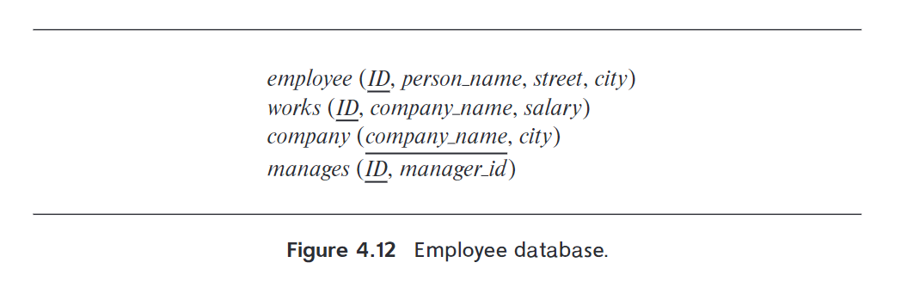
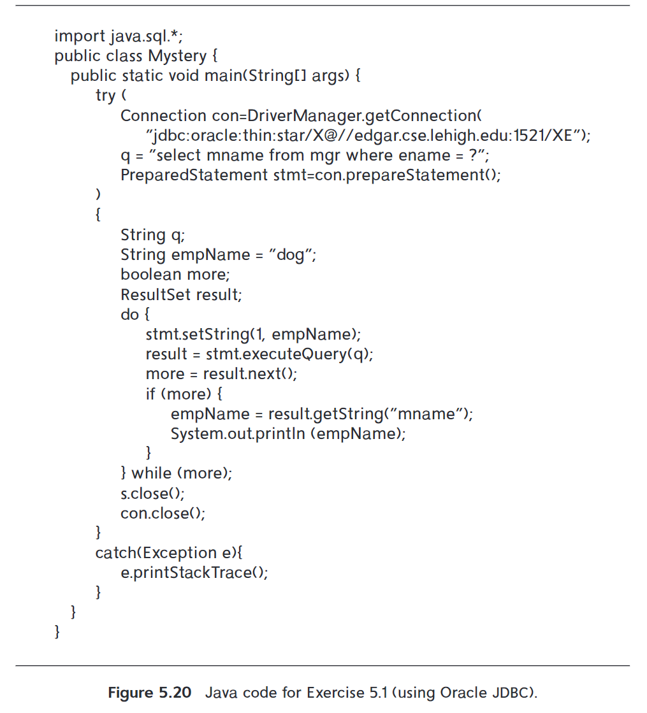
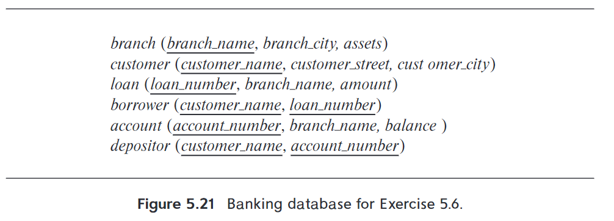

<span style="font-family: 'Times New Roman';">

# Chap 4 Intermediate SQL and Chap 5 Advanced SQL 
### 杨亿酬 3230105697   
#### 4.7 Consider the employee database of Figure 4.12. Give an SQL DDL definition of this database. Identify referential-integrity constraints that should hold, and include them in the DDL definition.
</span>

  
```sql
CREATE TABLE employee (
    ID INT PRIMARY KEY,           
    person_name VARCHAR(40),     
    street VARCHAR(40),          
    city VARCHAR(40)           
);
CREATE TABLE works (
    ID INT PRIMARY KEY,              
    company_name VARCHAR(40),       
    salary DECIMAL(10, 2), 
    FOREIGN KEY (ID) REFERENCES employee(ID) 
        ON DELETE CASCADE        
        ON UPDATE CASCADE,             
    FOREIGN KEY (company_name) REFERENCES company(company_name) 
        ON DELETE SET NULL           
        ON UPDATE CASCADE          
);
CREATE TABLE company (
    company_name VARCHAR(40) PRIMARY KEY,  
    city VARCHAR(40)                     
);
CREATE TABLE manages (
    ID INT PRIMARY KEY,                              
    manager_id INT,                         
    FOREIGN KEY (ID) REFERENCES employee(ID) 
        ON DELETE CASCADE               
        ON UPDATE CASCADE,           
);
```
<span style="font-family: 'Times New Roman';">
<div STYLE="page-break-after: always;"></div>

#### 4.18 For the database of Figure 4.12, write a query to find the ID of each employee with no manager. Note that an employee may simply have no manager listed or may have a null manager. Write your query using an outer join and then write it again using no outer join at all.
</span>

```sql
-- Using outer join
SELECT e.ID
FROM employee e LEFT OUTER JOIN manages m ON e.ID = m.ID
WHERE m.manager_id IS NULL;

-- No outer join
SELECT e.ID
FROM employee e
WHERE e.ID NOT IN (
    SELECT m.ID FROM manages m WHERE m.manager_id IS NOT NULL
);
```
<span style="font-family: 'Times New Roman';">

#### 4.20 Show how to define a view *tot_credits (year, num_credits)*, giving the total number of credits taken in each year.
</span>

```sql
CREATE VIEW tot_credits(year, num_credits) AS
(
    SELECT year,sum(credits)
    FROM takes NATURAL JOIN courses
    GROUP BY year;
)
```
<span style="font-family: 'Times New Roman';">

#### 5.1 Consider the following relations for a company database:
• emp (ename, dname, salary)
• mgr (ename, mname)
#### and the Java code in Figure 5.20, which uses the JDBC API. Assume that the userid, password, machine name, etc. are all okay. Describe in concise English what the Java program does. (That is, produce an English sentence like “It finds the manager of the toy department,” not a line-by-line description of what each Java statement does.)
</span>

  
<span style="font-family: 'Times New Roman';">

It finds the name of the manager of the employee whose name is "dog" and the name of the manager of the manager,etc. until the top manager who has no manager.  

#### 5.7 Consider the bank database of Figure 5.21. Write an SQL trigger to carry out the following action: On delete of an account, for each customer-owner of the account, check if the owner has any remaining accounts, and if she does not, delete her from the depositor relation.
</span>


```sql
create trigger remaining_accounts_trigger
after delete on account
reference old row as orow
for each row
when not exists(
    select customer_name from customer
    where customer_name = orow.customer_name
    )
begin
    delete from depositor 
    where customer_name = orow.customer_name
end;
```
