# 数据库系统

## Chap 1 Introduction

### 1.2 Definition
[Definition] Database:a collection of **interrelated**/integrated and persistent data  
[Definition] Database Management System(DBMS):A set of programs used to access,update and manage the database  
Properties of DBMS:  

- efficiency and scalability(可扩展性)  
- independency(physical/logical)  
- integrity(完整性) and security  
- concurrent(并发) access and robustness(鲁棒性)(recovery)  
  
### 1.4 Levels of data abstraction  

- Physical level:files  
- Logical level:relationship  
- View level:details of data viewed by the users(detail hidden) e.g. age for course selection  

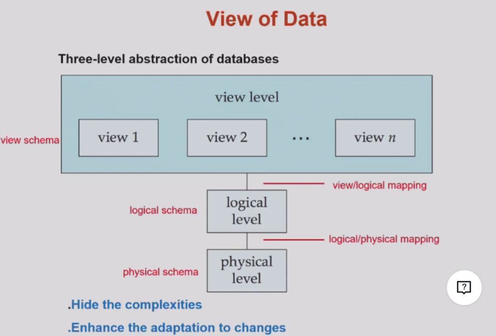  
**schemas(模式) and instances(实例)**  
schema:the structure on different level(Physical/Logical/Sub-schema)(表头)  
instance:the actual content  
  
**Independence**  

- Physical:change of logical schema rarely affects the physical schema(unless some data are missed)
- Logical:harder to achieve since the view schema are strongly influenced by the logical schema(change of logical scheme immediately change the data in the view scheme)  

### 1.5 Data models
[Definition] Data model:a collection of conceptual tools for describing——data structure/relationship/semantic(语义)/constraint  
Different types:  

- Entity(object)-Relationship model(E-R)  
- Relational model  
- Object-oriented model  
- Semistructured data model (XML)  
  
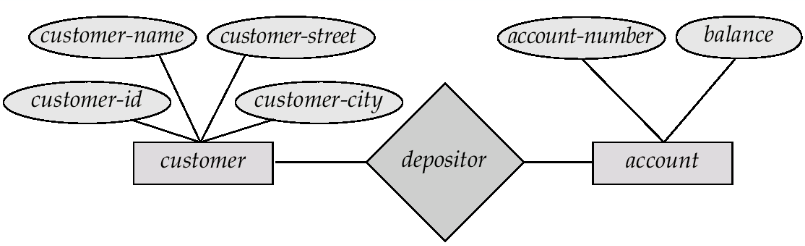

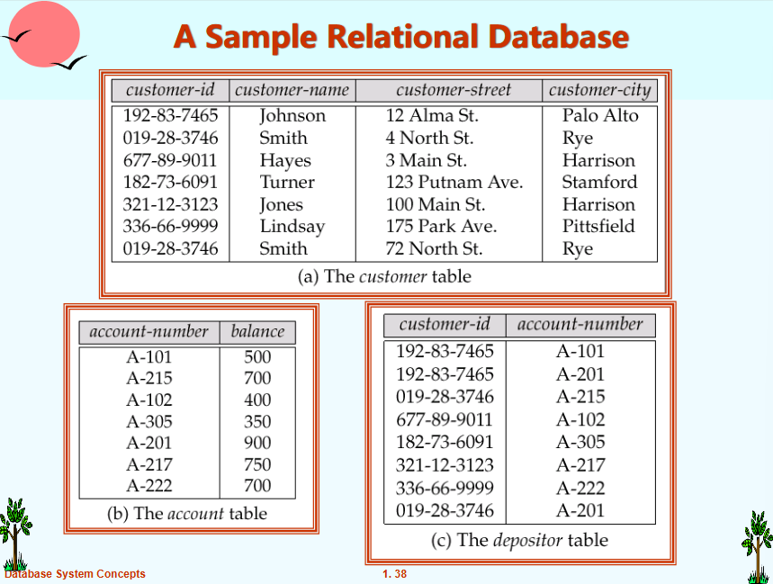

### 1.6 Database Language  

- Data definition language(DDL)  
- Data manipulation language(DML)  
- Data control language(DCL)  
  
(1)DDL  
generate tables stored in data dictionary  
```sql
CREATE TABLE account(
    account_number char(10),
    balance integer
);
```
[Definition] Data dictionary:metadata(the data of data) including——database schema,data structure,access methods and constraints,statistical info,authorization
(2)DML  
Insert/Delete/Update/Retrieve data  
query language
(3)SQL(DDL+DML+DCL)  
```sql
SELECT account.balance
FROM depositor,account
WHERE depositor.customer-id = '192-83-7465' and depositor.account-number = account.account-number
//不同表之间的对应
```

### 1.7 Database Users  

- naive users:interface interact  
- application programmer:SQL calls  
- sophisticated users:analytical processing/data mining  
- specialized users

### 1.8 Database Administrator(DBA)  
a good understanding of the enterprise's info resources and needs

### 1.9 Transaction(operation) Management(事务管理)  

atomicity,consistence,isolation,durability(ACID)  
concurrency-control manager(并发控制管理器)  

### 1.10 DBMS structure  
1.storage manager  
responsible for efficient storing,retrieving,updating data  

2.query processor
DDL interpreter,DML compiler,query processing  
query -> parser and translator -> relational algebra expression -> **optimizer** -> execution plan -> evaluation engine -> output  
Optimization:cost estimation  

Application architectures:  
two-tier:app -> db  
three-tier:browser -> web -> db  

## Chap 2 Relational Model  

### 2.1 Definition
[Definition] relation:a table with rows and columns  
[Comparison] relationship:an association among several entities  

### 2.2 Basic Structure  
given sets D<sub>1</sub>,...,D<sub>n</sub>  
a relation *r* is a subset of D<sub>1</sub> x ... x D<sub>n</sub>(Cartesian product)  
e.g.dept_name = {Biology,Finance,History,Music}  
building = {Watson,Painter,Packard}  
budget = {50000,80000,90000,120000}  
Then r = {(Biology,Watson,90000),(Finance,Painter,120000),(History,Painter,50000),(Music,Packard,80000)}is a relation over dept_name x building x budget(total 48 tuples)  
(1)Attribute Types  
domain:the set of allowed values(atomic) of each attribute(属性，表头的元素)  
non-atomic value:multivalued/composite(混合的) attribute  
e.g.tel:138xxx,139xxx(a string difficult to split)  
null:a member of every domain  
(2)Concepts  
relation schema:the structure of the relation  
e.g.(ID=string,name=string,salary=int)  
R=(A<sub>1</sub>,...,A<sub>n</sub>) is a relation schema where A<sub>i</sub> is an attribute  
relation instance:the snapshot of data in the relation  
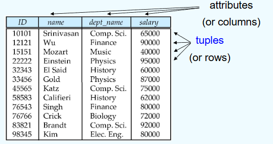  
(3)Relations are unordered
(4)Keys  
唯一区分一个对象的一个或一些属性  
superkey:a set of attribute sufficient enough to identify a unique tuple  
candidate key:minimal superkey(cannot delete anyone)  
primary key:candidate key defined by user  
(5)Foreign key  
Assume there exists relation r and s: r(A, B, C), s(B, D), we can say that attribute B in relation r is foreign key  
参照关系中外码的值必须在被参照关系中实际存在或为null(不能填不存在的值，如填入一个不存在的专业)  
(6)Schema Diagram(模式图)  
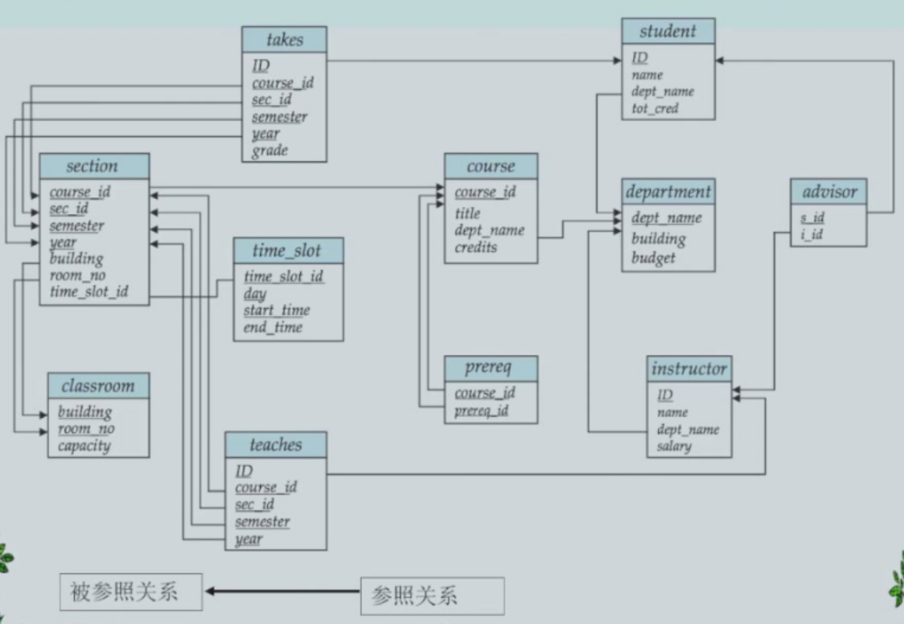  
(7)Query language:language in which user requests info from the db

### 2.3 Relational Algebra  
Six basic operations  
(1)Select $\sigma$  
$\sigma_{A=B \wedge D>5}(r)$
选择满足A=B且D>5的关系  
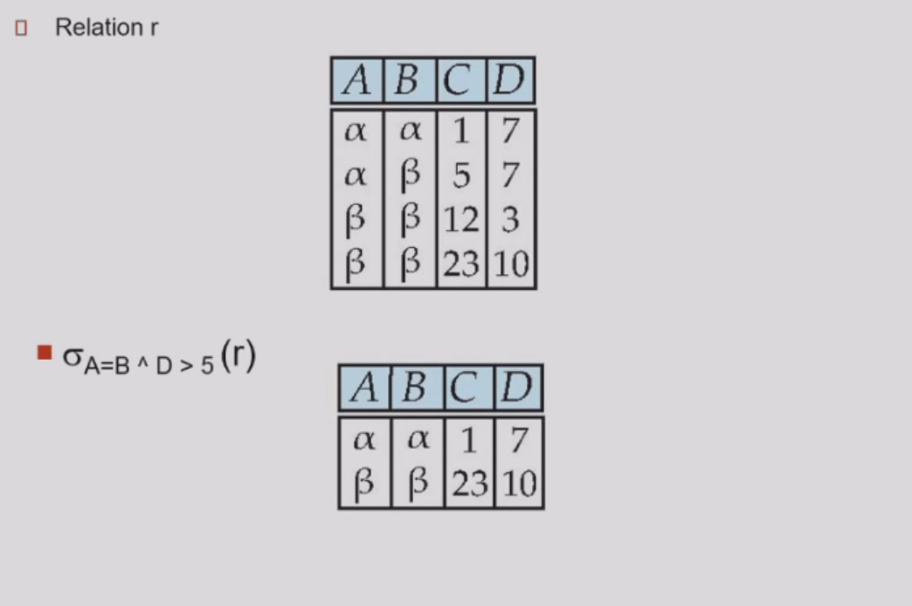
Notation:$\sigma_p(r)=\left\{t|t\in r \ and \ p(t)\right\}\ p:查询条件   $ 
e.g.$\sigma_{dept\_ name='Finance'}(department)$   
(2)Project $\Pi$ 投影 
Notation:$\Pi_{A_{1},...,A_{k}}(r)$
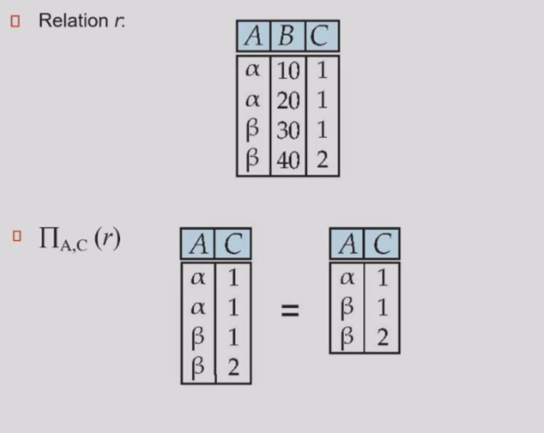  
投影A,C关系(注意去重)  
(3)Union $\cup$  
Notation:$r\cup s=\left\{t|t\in r \ or \ t \in s\right\}$
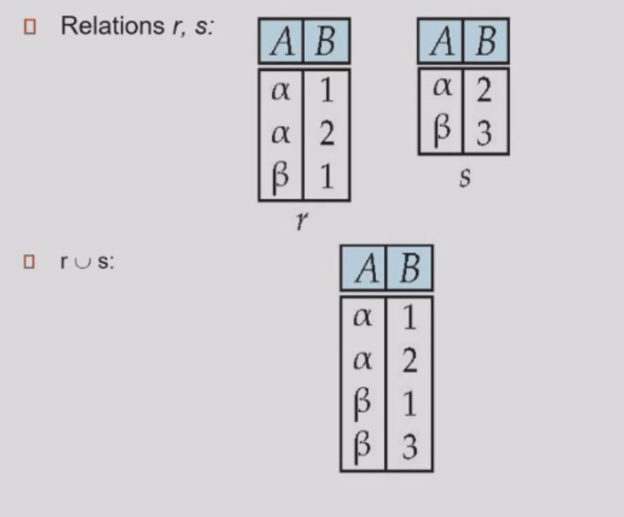  
可并条件：r,s有相同的arity(元数)(属性个数);属性的域必须是compatible(可容的)  
e.g.$人名\cup 公司名$
(4)Set difference $-$  
Notation:$r-s=\left\{t|t\in r \ and \ t \notin s\right\}$
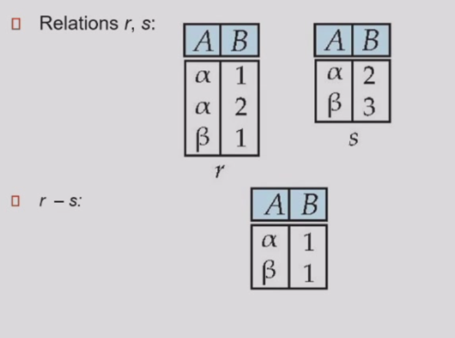  
可做差条件同Union  
(5)Cartesian product $\times$  
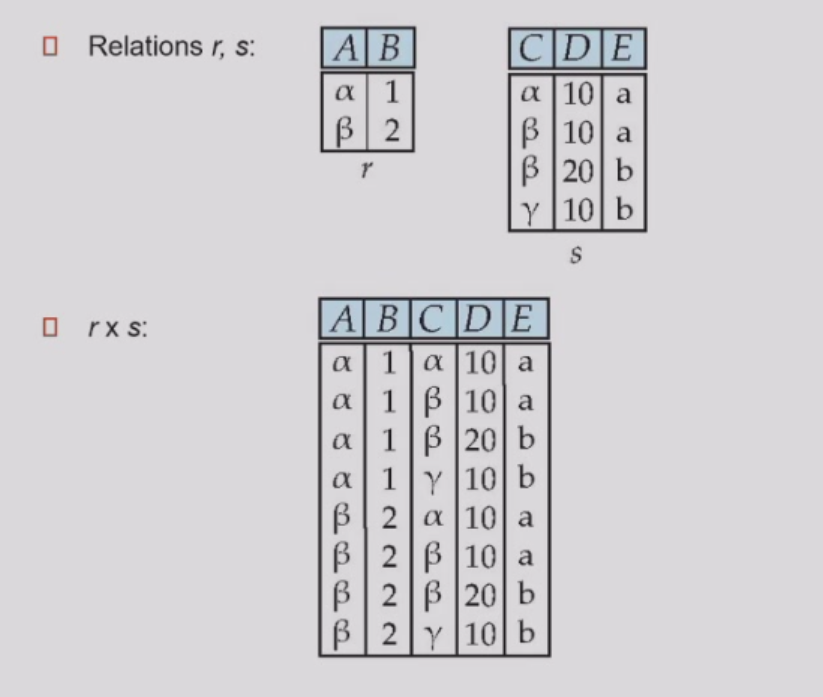  
Composition of operations:e.g.$\sigma_{A=C}(r\times s)$
(6)rename $\rho$
Notation:$\rho_{x}(E)$  
将E改名为x，E可以是关系代数的结果  
$\rho_{x(A_1,...,A_n}(E)$ 将n个属性分别改名  
查询表达式与查询优化  
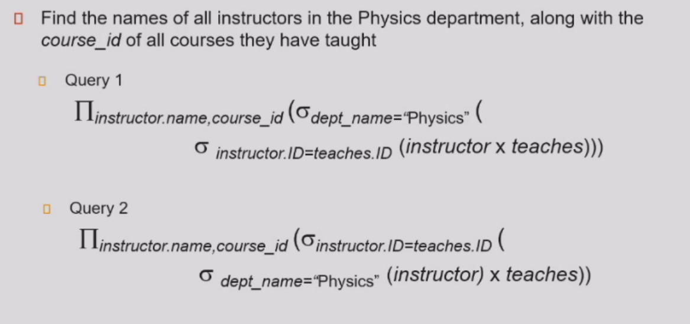  
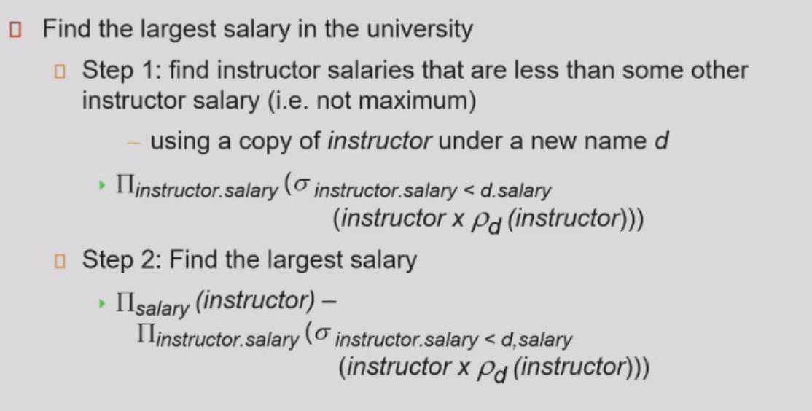  
Problem:六种基本关系操作没有统计功能  
Additional operations(不增加表达能力，只是方便书写)  
(7)Set intersection $\cap$  
$r \cap s = r-(r-s)$
(8)Natural join $r\bowtie s$
将r与s公共属性相同的连接在一起  
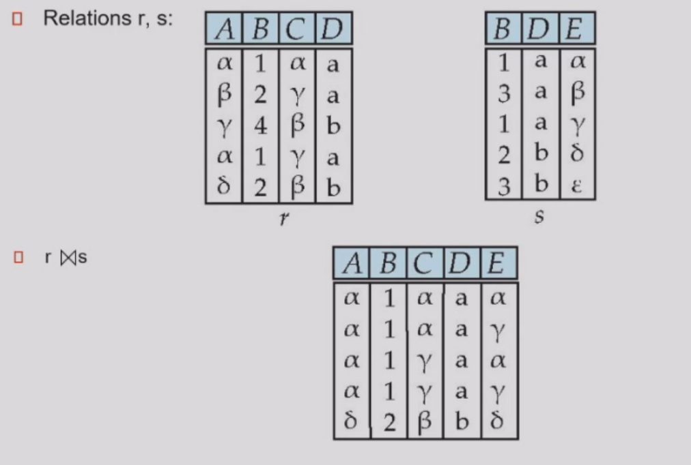  
满足交换律和结合律  
Theta join:条件连接  
$r\bowtie_{\theta} s = \sigma_{\theta}(r\times s)$  
(9)Outer join  
保留一边没有连接的信息，另一边缺少的属性置为null  
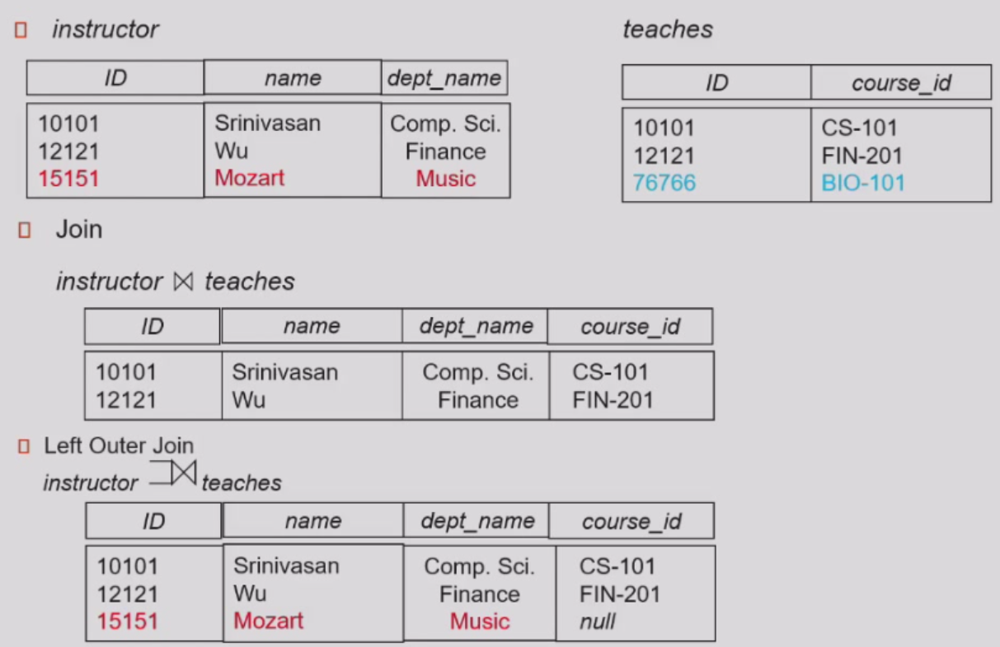
left/right/full outer join  
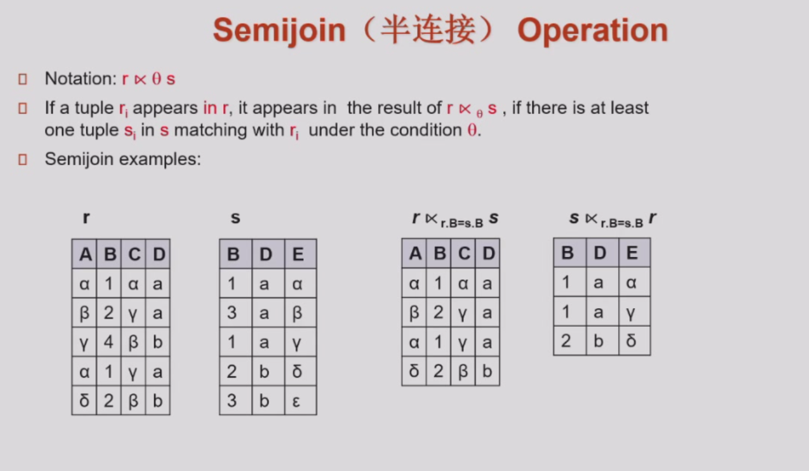  
等价于条件筛选  
(10)Assignment ⬅  
赋值操作，用于避免表达式过长  
(11)Division $\div$
$s \subseteq r$且满足$(r \div s) \times s \subseteq r$
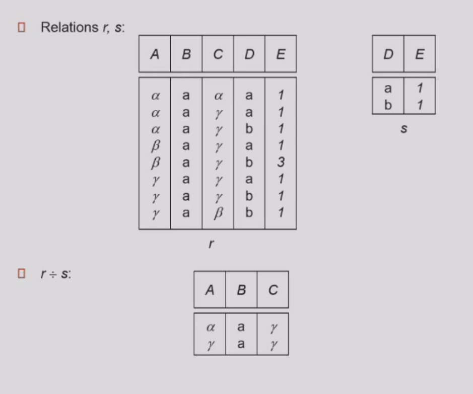

### 2.4 Extended Relational-Algebra-Operations  
增加表达能力的扩展关系代数  
(1)Generalized Projection  

(2)Aggregate Function 统计函数  
avg,min,max,sum,count(非空值的个数)  
$_{G_1,...,G_n}\mathcal{G}_{F_1(A_1)...F_n(A_n)}(E)$  
$G_i$表示分组属性($G_i$为空即将整个表看成一组),$F_i$表示统计函数  
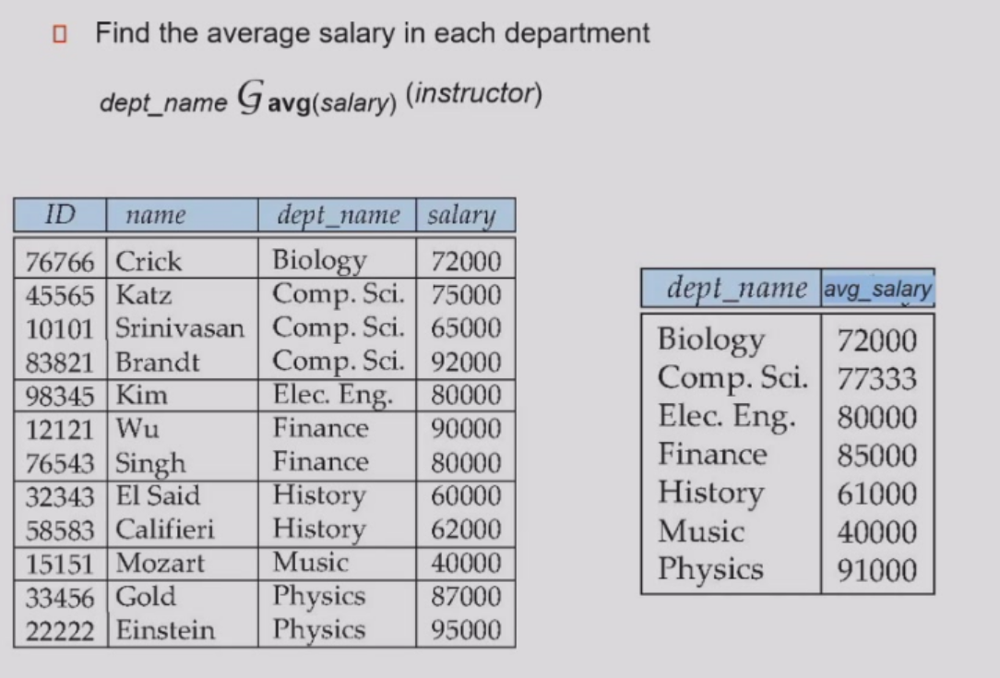
$as$用于重命名  

### 2.5 Modification

- Deletion  
- Insertion  
- Updating

### 2.6 Multiset  
Multiset(多重集) relational algebra retains duplicates,to match SQL semantics  
引入原因：去除重复元素代价过高  
设某一相同表达式在r中出现m次，在s中出现n次  

- selection:保留所有重复  
- projection:不去重  
- cross product:出现$m*n$次  
- union:$m+n$  
- intersection:$min(m,n)$  
- difference:$max(0,m-n)$  
  
## Chap 3 Introduction to SQL  
  
### 3.1 Data Definition Language(DDL)  
(1)Domain types in SQL
```sql  
char(n)  
varchar(n)
int 
smallint
numeric(p,d) -- precision of p digits, with d digits to the right of decimal point
real,double precision
float(n)
date -- 4 digit year,month,date
time 
timestamp/datetime
```  
(2)Create table  
```sql
create table instructor(
    ID char(5) ,-- primary key here is also valid
    name varchar(20) not null,
    dept_name varchar(20),
    salary numeric(8,2),
    primary key(ID),
    check(salary >= 0) -- null >= 0 = unknown 允许插入 
    -- where之后的条件一定为true
);
```
(3)Drop and Alter table  
```sql
drop table r; -- delete

alter table r add A,D;
alter table r add (A1 D1, ... , An Dn);  

alter table r drop A; -- not supported by many db

alter table r modify(ID char(10),salary not null);
```
(4)Create index
```sql
create (unique) index <i-name> on <table-name> (<attribute-list>);
-- primary key is indexed on default
create index ins_index on instructor(ID);

drop index <i-name>;
```
### 3.2 Basic Structure of select  
$\Pi_{A_1,...,A_n}(\sigma _{P}(r_1\times...\times r_m))$
```sql
select (distinct) A1,...,An
from r1,...,rm
where P
```
$_{A_1,A_2}\mathcal{G}_{sum(A_3)}(\sigma_P(r_1 \times ...\times r_m))$  
```sql
select A1,A2,sum(A3)  
from r1,...,rm
where P
group by A1,A2
```