# 数据库系统

## Chap 1 Introduction

### 1.2 Definition
[Definition] Database:a collection of **interrelated**/integrated and persistent data  
[Definition] Database Management System(DBMS):A set of programs used to access,update and manage the database  
Properties of DBMS:  

- efficiency and scalability(可扩展性)  
- independency(physical/logical)  
- integrity(完整性) and security  
- concurrent(并发) access and robustness(鲁棒性)(recovery)  
  
### 1.4 Levels of data abstraction  

- Physical level:files  
- Logical level:relationship  
- View level:details of data viewed by the users(detail hidden) e.g. age for course selection  

  
**schemas(模式) and instances(实例)**  
schema:the structure on different level(Physical/Logical/Sub-schema)(表头)  
instance:the actual content  
  
**Independence**  

- Physical:change of logical schema rarely affects the physical schema(unless some data are missed)
- Logical:harder to achieve since the view schema are strongly influenced by the logical schema(change of logical scheme immediately change the data in the view scheme)  

### 1.5 Data models
[Definition] Data model:a collection of conceptual tools for describing——data structure/relationship/semantic(语义)/constraint  
Different types:  

- Entity(object)-Relationship model(E-R)  
- Relational model  
- Object-oriented model  
- Semistructured data model (XML)  
  


### 1.6 Database Language  

- Data definition language(DDL)  
- Data manipulation language(DML)  
- Data control language(DCL)  
  
(1)DDL  
generate tables stored in data dictionary  
```sql
CREATE TABLE account(
    account_number char(10),
    balance integer
);
```
[Definition] Data dictionary:metadata(the data of data) including——database schema,data structure,access methods and constraints,statistical info,authorization
(2)DML  
Insert/Delete/Update/Retrieve data  
query language
(3)SQL(DDL+DML+DCL)  
```sql
SELECT account.balance
FROM depositor,account
WHERE depositor.customer-id = '192-83-7465' and depositor.account-number = account.account-number
//不同表之间的对应
```

### 1.7 Database Users  

- naive users:interface interact  
- application programmer:SQL calls  
- sophisticated users:analytical processing/data mining  
- specialized users

### 1.8 Database Administrator(DBA)  
a good understanding of the enterprise's info resources and needs

### 1.9 Transaction(operation) Management(事务管理)  

atomicity,consistence,isolation,durability(ACID)  
concurrency-control manager(并发控制管理器)  

### 1.10 DBMS structure  
1.storage manager  
responsible for efficient storing,retrieving,updating data  

2.query processor
DDL interpreter,DML compiler,query processing  
query -> parser and translator -> relational algebra expression -> **optimizer** -> execution plan -> evaluation engine -> output  
Optimization:cost estimation  

Application architectures:  
two-tier:app -> db  
three-tier:browser -> web -> db  

## Chap 2 Relational Model  

### 2.1 Definition
[Definition] relation:a table with rows and columns  
[Comparison] relationship:an association among several entities  

### 2.2 Basic Structure  
given sets D<sub>1</sub>,...,D<sub>n</sub>  
a relation *r* is a subset of D<sub>1</sub> x ... x D<sub>n</sub>(Cartesian product)  
e.g.dept_name = {Biology,Finance,History,Music}  
building = {Watson,Painter,Packard}  
budget = {50000,80000,90000,120000}  
Then r = {(Biology,Watson,90000),(Finance,Painter,120000),(History,Painter,50000),(Music,Packard,80000)}is a relation over dept_name x building x budget(total 48 tuples)  
(1)Attribute Types  
domain:the set of allowed values(atomic) of each attribute(属性，表头的元素)  
non-atomic value:multivalued/composite(混合的) attribute  
e.g.tel:138xxx,139xxx(a string difficult to split)  
null:a member of every domain  
(2)Concepts  
relation schema:the structure of the relation  
e.g.(ID=string,name=string,salary=int)  
R=(A<sub>1</sub>,...,A<sub>n</sub>) is a relation schema where A<sub>i</sub> is an attribute  
relation instance:the snapshot of data in the relation  
  
(3)Relations are unordered
(4)Keys  
唯一区分一个对象的一个或一些属性  
superkey:a set of attribute sufficient enough to identify a unique tuple  
candidate key:minimal superkey(cannot delete anyone)  
primary key:candidate key defined by user  
(5)Foreign key  
Assume there exists relation r and s: r(A, B, C), s(B, D), we can say that attribute B in relation r is foreign key  
参照关系中外码的值必须在被参照关系中实际存在或为null(不能填不存在的值，如填入一个不存在的专业)  
(6)Schema Diagram(模式图)  
  
(7)Query language:language in which user requests info from the db

### 2.3 Relational Algebra  
Six basic operations  
(1)Select $\sigma$  
$\sigma_{A=B \wedge D>5}(r)$
选择满足A=B且D>5的关系  

Notation:$\sigma_p(r)=\left\{t|t\in r \ and \ p(t)\right\}\ p:查询条件   $ 
e.g.$\sigma_{dept\_ name='Finance'}(department)$   
(2)Project $\Pi$ 投影 
Notation:$\Pi_{A_{1},...,A_{k}}(r)$
  
投影A,C关系(注意去重)  
(3)Union $\cup$  
Notation:$r\cup s=\left\{t|t\in r \ or \ t \in s\right\}$
  
可并条件：r,s有相同的arity(元数)(属性个数);属性的域必须是compatible(可容的)  
e.g.$人名\cup 公司名$
(4)Set difference $-$  
Notation:$r-s=\left\{t|t\in r \ and \ t \notin s\right\}$
  
可做差条件同Union  
(5)Cartesian product $\times$  
  
Composition of operations:e.g.$\sigma_{A=C}(r\times s)$
(6)rename $\rho$
Notation:$\rho_{x}(E)$  
将E改名为x，E可以是关系代数的结果  
$\rho_{x(A_1,...,A_n}(E)$ 将n个属性分别改名  
查询表达式与查询优化  
  
  
Problem:六种基本关系操作没有统计功能  
Additional operations(不增加表达能力，只是方便书写)  
(7)Set intersection $\cap$  
$r \cap s = r-(r-s)$
(8)Natural join $r\bowtie s$
将r与s公共属性相同的连接在一起  
  
满足交换律和结合律  
Theta join:条件连接  
$r\bowtie_{\theta} s = \sigma_{\theta}(r\times s)$  
(9)Outer join  
保留一边没有连接的信息，另一边缺少的属性置为null  

left/right/full outer join  
  
等价于条件筛选  
(10)Assignment ⬅  
赋值操作，用于避免表达式过长  
(11)Division $\div$
$s \subseteq r$且满足$(r \div s) \times s \subseteq r$


### 2.4 Extended Relational-Algebra-Operations  
增加表达能力的扩展关系代数  
(1)Generalized Projection  

(2)Aggregate Function 统计函数  
avg,min,max,sum,count(非空值的个数)  
$_{G_1,...,G_n}\mathcal{G}_{F_1(A_1)...F_n(A_n)}(E)$  
$G_i$表示分组属性($G_i$为空即将整个表看成一组),$F_i$表示统计函数  

$as$用于重命名  

### 2.5 Modification

- Deletion  
- Insertion  
- Updating

### 2.6 Multiset  
Multiset(多重集) relational algebra retains duplicates,to match SQL semantics  
引入原因：去除重复元素代价过高  
设某一相同表达式在r中出现m次，在s中出现n次  

- selection:保留所有重复  
- projection:不去重  
- cross product:出现$m*n$次  
- union:$m+n$  
- intersection:$min(m,n)$  
- difference:$max(0,m-n)$  
  
## Chap 3 Introduction to SQL  
  
### 3.1 Data Definition Language(DDL)  
(1)Domain types in SQL
```sql  
char(n)  
varchar(n)
int 
smallint
numeric(p,d) -- precision of p digits, with d digits to the right of decimal point
real,double precision
float(n)
date -- 4 digit year,month,date
time 
timestamp/datetime
```  
(2)Create table  
```sql
create table instructor(
    ID char(5) , -- primary key here is also valid
    name varchar(20) not null,
    dept_name varchar(20),
    salary numeric(8,2) default 0,
    primary key(ID), -- not null,cannot repeat
    foreign key(dept_name) references department, --引用另一表的primary key 
    check(salary >= 0) -- null >= 0 = unknown 允许插入 
    -- where之后的条件一定为true
);

insert into instructor values('10211','Smith','Biology',66000);
```
```sql
foreign key(dept_name) references department
on delete cascade(连锁反应，也删掉)|set null|restrict(不能删)|set default
on update cascade|set null|restrict|set default
```
(3)Drop and Alter table  
```sql
drop table r; -- delete

delete from r; -- delete all contents,but retain the table

alter table r add A,D;
alter table r add (A1 D1, ... , An Dn);  

alter table r drop A; -- not supported by many db

alter table r modify(ID char(10),salary not null);
```
(4)Create index
```sql
create (unique) index <i-name> on <table-name> (<attribute-list>);
-- primary key is indexed on default
create index ins_index on instructor(ID);

drop index <i-name>;
```
### 3.2 Basic Structure of select  
$\Pi_{A_1,...,A_n}(\sigma _{P}(r_1\times...\times r_m))$
```sql
select (distinct/all) A1,...,An -- distinct:no repetition
from r1,...,rm
where P
```
$_{A_1,A_2}\mathcal{G}_{sum(A_3)}(\sigma_P(r_1 \times ...\times r_m))$  
```sql
select A1,A2,sum(A3)  
from r1,...,rm
where P
group by A1,A2
```
Clause
```sql
select * from instructor,teaches; -- all the elements | Cartesian product
select salary/12 as monthly salary from instructor; 
-- algebra allowed -- as for rename(omitted sometimes)
select name from instructor where salary between 9000 and 10000;

select name,course_id from instructor,teaches 
where (instructor.ID,dept_name) = (teaches.ID,'Biology');
```
Join
```sql
select name,course_id from instructors,teaches where instructor.ID = teaches.ID
select name,course_id from instructors natural join teaches
```
```sql
-- A trap
course(course_id,title,dept_name,credits)
teaches(ID,course_id,sec_id,semester,year)
instructor(ID,name,dept_name,salary)
select name,title from instructor natural join teaches natural join course; 
-- wrong if course.dept_name != instructor.dept_name
select name,title from instructor natural join teaches,course
where teaches.course_id = course.course_id;

select name,title from instructor,teaches,course
where instructor.ID = teaches.ID and teaches.course_id = course.course_id;

select name,title from (instructor natural join teaches) join course using(course_id);
-- 一个属性等值连接
```
String
'%' matches substring(including null)  
'_' matches character  
```sql
select name from instructor where name like '%dar%' 
-- match 100%
like '100\%' escape '\'
```
Order
```sql
select distinct name from instructor order by name (desc/asc)
order by dept_name,name
```
Limit
```sql
select name from instructor order by salary desc limit 3;-- 前三
```
### 3.3 Set Operation
```sql
(select course_id from section where sem = 'Fall' and year = 2009)
union/intersect/except(minus) all -- Multiset
(select course_id from section where sem = 'Spring' and year = 2010)
```
a. Find each customer who has an account at every branch located in “Brook-
lyn”.

b. Find the total sum of all loan amounts in the bank.

c. Find the names of all branches that have assets greater than those of at
least one branch located in “Brooklyn”.
### 3.4 Aggregate Function
avg,min,max,sum(null = 0),count  
```sql
select avg(salary) from instructor where dept_name = 'Comp.Sci';
select count(*) from course; -- all the elements
```
```sql
select dept_name,ID,avg(salary) from instructor group by dept_name;
-- wrong!attributes in select clause outside aggregate function must
-- appear in group by list,hence ID in select is not allowed
```
```sql
select dept_name,avg(salary) from instructor group by dept_name 
having avg(salary) > 42000; -- fliter
-- where不能与聚合函数一起使用 
-- having必须与group by 一起使用
```
arithmetric expression
```sql
select dept_name from student group by dept_name
having count(distinct name) = count(id) -- 没有重名的系
```

### 3.5 Null Values  
null signifies the value unknown or the value does not exist  
5 + null = null  
null > 100 = null
```sql
select name from instructor where salary is null
```
unknown or true = true  
unknown or false/unknown = unknown  
true/unknown and unknown = unknown  
false and unknown = false   
not unknown = unknown  

### 3.6 Nested(嵌套) Subqueries
(1)Set membership
```sql
select distinct course_id 
from section 
where semester = 'Fall' and year = 2009 and
course_id (not) in (
    select course_id 
    from section where semester = 'Spring' and year = 2010);
```
(2)Set comparison
```sql
select name
from instructor
where salary > some/all (
    select salary from instructor where dept_name = 'Biology')
```
(3)Test for Empty Relations
```sql
select course_id
from section as S
where semester = 'Fall' and year = 2009 and 
exists(
    select * from section as T
    where semester = 'Spring' and year = 2010 and S.course_id = T.course_id);
-- 子查询非空
-- Correlated subquery
```
```sql
select distinct S.ID,S.name 
from student as S
where not exists(
    select course_id
    from course where dept_name = 'Biology'
    except
    (select T.course_id
    from takes as T where S.ID = T.ID)
);
-- 选择生物系的所有课程
-- 关系代数中的除法功能
```
(4)Test for Absence of Duplicate Tuples
```sql
select T.course_id from course as T
where unique(
    select R.course_id
    from section as R
    where T.course_id = R.course_id and R.year = 2009);
```

### *3.8 With Clause

### 3.9 Modification of Database
(1)Deletion
```sql
delete from instructor; -- 全部删除

delete from instructor
where dept_name in(
    select dept_name from department 
    where building = 'Watson'
);
```
(2)Insertion
```sql
insert into student
select ID,name,dept_name,0 from instructor  
```
(3)Update
```sql
update instructor
set salary = salary * 1.03 where salary > 100000;

update instructor
set salary = case when salary <= 100000 then salary * 1.05 else salary * 1.03 end; 
```

## Chap 4 Intermediate SQL 
### 4.1 Join Relations
inner join,left/right outer join,full outer join
```sql
select instructor.id,count(distinct course_id),count(takes.id)
from instructor natural left outer join teaches left outer join takes using(course_id,sec_id,semester,year)
group by instructor.id;
-- 不上课的老师count = null/0(但保留)
```

### 4.2 SQL Data Types and Schemas
#### User-defined types
```sql
create type Dollars as numeric(12,2) final -- 叶子类，不能再派生
-- 编译时发现类型间错误
```
#### Domains
```sql
create domain person_name char(20) not null -- constraints
create domain degree_level varchar(10)
constraint degree_level_test
check(value in 'Bachelors','Masters','Doctors')
```
#### Large object
blob(binary large object):tinyblob,blob,mediumblob,largeblob  
clob(character large object)  
when a query returns a large object,**a pointer** is returned.  

### 4.3 Integrity Constraints
#### Single Relation
not null,primary key,unique,check(P),foreign key
```sql
course table section(
    ...
    semester varchar(6),
    ...
    check(semester in('Fall','Spring','Summer','Winter'))
);
```
#### Referential
```sql
create table course(
    ...
    dept_name varchar(20),
    foreign key(dept_name) references department
        on delete cascade,
        on update cascade,
    ...
);
```
### Violation during transactions
```sql
create table person(
    mother char(10),
    foreign key(mother) references person
);
```
defer constraints checking to **transaction end**
### Complex Check Clause
```sql
check((course_id,sec_id,semester,year) 
in (select course_id,sec_id,semester,year from teaches));
```
### Assertion
```sql
create assertion credits_earned_constraints check
(not exists
    (select ID from students 
    where tot_cred <> 
          select sum(credits) from takes natural join course
          where student.ID = takes.ID
                and grade is not null
                and grade <> 'F'));
```
### 4.4 Views

- hide complexity  
- logic independence  
- authority management  
  
```sql
create view faculty as
(
    select ID,name,dept_name
    from instructor;
)

select name from faculty
where dept_name = 'Biology';

create view dept_total_salary(dept_name,total_salary)as
(
    select dept_name,sum(salary)
    from instructor
    group by dept_name;
)
```
view can be defined from other views(view expansion for sql server)
```sql
insert into faculty values('30765','Green','Music');
insert into instructor values('30765','Green','Music',null);
-- view is rarely updatable
```
#### *Materialized view
create a physical table containing all the tuples in the result of the query
```sql
create materialized view
```
maintain the view by updating the view whenever the underlying relations are updated  
#### Logical data independence
S(a,b,c) -> S1(a,b) & S2(a,c)(primary key a)  
How to realize data independence  
```sql
1.create table S1... S2...
2.insert into S1/S2 select a,b from S
3.drop table S
4.create view S(a,b,c) as select a,b,c from S1,S2

select * from S where ... -> select * from S1 natural join S2
insert into S value (1,2,3) ->
insert into S1 value (1,2)
insert into S2 value (2,3)
```
### 4.5 Indexes
Indices are data structures used to speed up access to records with specified values for index attributes(using B+ Tree)
```sql
create index studentID_index on student(ID)
```
### 4.6 Transactions
atomic:either fully executed or rolled back as if it never occurred  
ended by commit or rollback
```sql
set autocommit = 0 --关闭自动提交
update account set balance = balance - 100 where ano='1001';
-- roll back if power shut down 
update account set balance = balance + 100 where ano='1002';
commit;-- end of the transaction,start a new transaction
```
Transaction Boundaries:one ticket or multiple tickets  
根据业务需求定义  
booking and paying,one transaction or two  
长事务占用资源，rollback -> complement transaction  
### 4.7 ACID Properties

- Atomicity  
- Consistency  
- Isolation  
- Durability:after a transaction completes,the changes it has made to the db persist,even if the system failures.  
  
### 4.8 Authorization
forms of authorization of the db  

- select  
- insert  
- update  
- delete  

forms of authorization to modify the schema  

- create  
- aleration  
- drop  
- index  
- create view  
  
```sql
grant <privilege list> on <relation name or view name> to <user list>
grant select on instructor to U1,U2,U3  
grant select on department to public 
grant update(budget) on department to U1,U2
grant all privileges on department to U1

revoke <privilege list> on <relation name or view name> from <user list>

revoke select on branch from U1,U2,U3
```
#### Role
权限的集合
```sql
create role instructor;
grant instructor to Amit;-- 人名
grant select on takes to instructor;
create role dean;
grant instructor to dean;
grant dean to Satoshi;
```
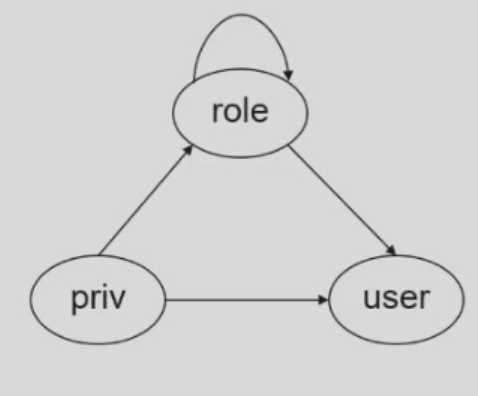
```sql
create view geo_instructor as
(select * from instructor where dept_name = 'Geograpy');
grant select on geo_instructor to geo_staff;

grant reference(dept_name) on department to Mariano;
-- 定义foreign key的权限 on delete/update restricted
grant select on department to Amit with grant option;-- 可以转授
revoke select on department from Amit,Satoshi cascade;-- 转授权全收回
revoke select on department from Amit,Satoshi restrict;
revoke grant option for select on department from Amit;
```

## Chap 5 Advanced SQL  
### 5.1 Accessing SQL from a programming language  

- API  
  ODBC(Open DataBase Connectivity):C,C++,C#  
  JDBC:Java  
- Embedded SQL
  C  
  SQLJ:Java  
  JPA:OR(Object Relation) mapping of Java

1.connectivity
2.create a statement object
3.send queries and fetch results  

#### JDBC
```Java
public static void JDBC()
{
    try{
        Connection conn = DriverManager.getConnection(url,userid,passwd);
        Statement stmt = conn.createStatement();
        //...actual work...
        stmt.close();
        conn.close();
    }
    catch(SQLException sqle){}
}
```
```Java
try{
    stmt.executeUpdate(
        "insert into instructor values(...)");
} catch (){}

ResultSet rset = stmt.executeQuery(
    "select dept_name,avg(salary)
     from instructor
     group by dept_name");
while(rset.next())
{
    Systems.out.println(rset.getString("dept_name") + " " + rset.getFloat(2));
}

int a = rset.getInt("a");
if(rset.wasNull()) Systems.out.println("Got null value");
```
##### Prepared Statement  
```java
PreparedStatement pStmt = conn.prepareStatement(
    "insert into instructor values(?,?,?,?)");
pStmt.setString(1,"88877");//向第一个参数传入
pStmt.setString(2,"Perry");
...
pStmt.executeUpdate();
```
##### SQL Injection  
```sql
select * from instructor where name = 'X' or 'Y' = 'Y';
-- 'X';update instructor set salary = salary + 10000000;
```
##### Metadata Features  
```java
ResultSetMetaData rsmd = rs.getMetaData();
for(int i = 1;i <= rsmd.getColumnCount();i++)
{
    System.out.println(rsmd.getColumnName(i));
    System.out.println(rsmd.getColumnTypeName(i));
}
DatabaseMetaData dbmd = conn.getMetaData();
ResultSet rs = dbmd.getColumns(null,"univdb","department","%");
```
##### Transaction Control
```java
conn.setAutoCommit(false);
conn.commit();
conn.rollback();
```
#### SQLJ
```java
#sql iterator deptlnfolter(String deptname,int avgSal);
//Define class automatically
deptlnfolter iter = null;
#sql iter = {select dept_name,avg(salary) as avgSal from instructor group by dept name};
//check while compiling
while(iter.next())
{
    String deptName = iter.dept_name();
    int avgSal = iter.avgSal();
    System.out.println(deptName + " " + avgSal);
}
iter.close();
```
#### ODBC  
```c
int ODBC()
{
    RETCODE error;
    HENV env;
    HDBC conn;
    SQLAllocEnv(&env);
    SQLAllocConnect(env,&conn);
    SQLConnect(conn,url,SQL_NTS,"avi",SQL_NTS,passwd,SQL_NTS);//Null Terminate String
    {
        char deptname[80];
        float salary;
        int lenOut1,lenOut2;
        HSTMT stmt;
        char* sqlquery = 
        "select dept_name,sum(salary)
         from instructor
         group by dept_name";
        SQLAllocStmt(conn,&stmt);
        error = SQLExecDirect(stmt,sqlquery,SQL_NTS);
        if(error == SQL_SUCCESS){
            SQLBindCol(stmt,1,SQL_C_CHAR,deptname,80,&lenOut1);//绑定
            SQLBindCol(stmt,2,SQL_C_FLOAT,&salary,0,&lenOut2);
            while(SQLFetch(stmt)==SQL_SUCCESS){ //transmit
                printf(" %s %g\n",deptname,salary);
            }
        }
        SQLFreeStmt(stmt,SQL_DROP);
    }
    SQLDisconnect(conn);
    SQLFreeConnect(conn);
    SQLFreeEnv(env);
}
```
##### Prepared Statement  
```c
SQLPrepare(stmt,<SQL String>);
SQLBindParameter(stmt,<parameter#>,...type info...)
retcode = SQLExecute(stmt);
SQLSetConnectionOption(conn,SQL_AUTOCOMMIT,0)
SQLTransact(conn,SQL_COMMIT)
```
#### Embedded SQL  
host language:C(EXEC SQL <>;),C++,Java(#SQL{};),...
```c
main(){
    EXEC SQL INCLUDE SQLCA;
    EXEC SQL BEGIN DECLARE SECTION
    char account_no[11];//end by '\0'
    char branch_name[16];
    int balance;
    EXEC SQL END DECLARE SECTION
    EXEC SQL CONNECT TO dank_db USER Adam USING Eve;
    scanf("%s %s %d",account_no,branch_name,balance);
    EXEC SQL insert into account values(:account_no,:branch_name,:balance);
    if(SQLCA.sqlcode !=0) printf("Error!\n");
    else printf("Success!\n");
}
EXEC SQL update account
         set balance = balance +:balance
         where account_number = :account_no;

EXEC SQL select balance into :balance:mask 
        //no bind needed
        //mask<0 null,mask>0截断
         from account 
         where account_number = :account_no;

EXEC SQL DECLARE account_cursor CURSOR for
    select account_number,balance
    from depositor natural join account
    where depositor.customer_name = :customer_name;
scanf("%s",customer_name);
EXEC SQL open account_cursor;//iterator
for(;;)
{
    EXEC SQL fetch account_cursor into :account_no,:balance;
    if(SQLCA.sqlcode)...
    if(balance < 1000)
        EXEC SQL update account set balance = "balance * 1.05" where current of account_cursor
    else ...
}
EXEC SQL close account_cursor;
```
Embedded SQL helps static type check and optimizer  
Dynamic SQL use a place holder('?') too
### 5.2 Functions and Procedures  
#### Procedual Constructs in SQL
module language:if-then-else,while
stored procedures:call  
语法检查，语义检查，转化关系代数表达式，查询优化
```sql
create function dept_count(dept_name varchar(20))
returns integer
begin 
    declare d_count integer;
    select count(*) into d_count
    from instructor
    where instructor.dept_name = dept_name
    return d_count;
end

select dept_name,budget
from department
where dept_count(dept_name) > 1;
```
```sql
create function instructors_of(dept_name char(20))
    returns table(ID varchar(5),
                  name varchar(20),
                  dept_name varchar(20),
                  salary numeric(8,2))
return table
    (select ID,name,dept_name,salary
    from instructor
    where instructor.dept_name =instructors_of.dept_name)

select * from table(instructors_of('Music'));
```
#### SQL Procedures
```sql
create procedure dept_count_proc
(in dept_name varchar(20),out d_count integer)
begin
    select count(*) into d_count
    from instructor
    where instructor.dept_name = dept_count_proc.dept_name
end

declare d_count integer;
call dept_count_proc('Physics',d_count);
```
```sql
declare n integer default 0;
while n<10 do
    set n = n + 1
end while

repeat
    set n = n - 1
until n = 0
end repeat

for r as
    select budget from department
    where dept_name = 'Music'
    -- 遍历行
do
    set n = n-r.budget
end for
```
#### External Language Functions/Procedures
```sql
create procedure dept_count_proc
(in dept_name varchar(20),out count integer)
language C
external name '/usr/avi/bin/dept_count_proc'
-- sandbox for security
```
### 5.3 Triggers
ECA:Event,Condition,Action
#### Row level triggers
```sql
create trigger account_trigger 
after update of account on balance 
referencing new row as nrow
referencing old row as orow
for each row
when nrow.balance - orow.balance >= 200000 or
     orow.balance - nrow.balance >= 50000
begin
    insert into account_log values(nrow.account_number,nrow.balance - orow.balance,current_time())
end;
```
```sql
create trigger timeslot_check1
after insert on section
referencing new row as nrow
for each row
when(nrow.time_slot_id not in(
        select time_slot_id
        from time_slot))
begin
    rollback
end;

create trigger timeslot_check2
after delete on timeslot
referencing old row as orow
for each row
when(orow.time_slot_id not in(
        select time_slot_id
        from time_slot)
    and orow.time_slot in(
        select time_slot_id
        from section)
    )
begin
    rollback
end;
```
```sql
create trigger setnull_trigger
before update of takes 
referencing new row as nrow
for each row
when(nrow.grade = '')
begin atomic
    set nrow.grade = null;
end;
```
#### Statement level triggers
```sql
create trigger grade_trigger 
after update of takes on grade
referencing new table as new_table
for each statement
when exists(select avg(grade)
            from new_table
            group by course_id,sec_id,semester,year
            having avg(grade)<60)
begin
    rollback
end
```

## Chap 6 Entity-Relationship Model  
### 6.1 Database Design Process 
requirement specification -> conceptual-design(E-R diagram) -> logical design(schema) -> physical-design  
### 6.2 E-R Diagram
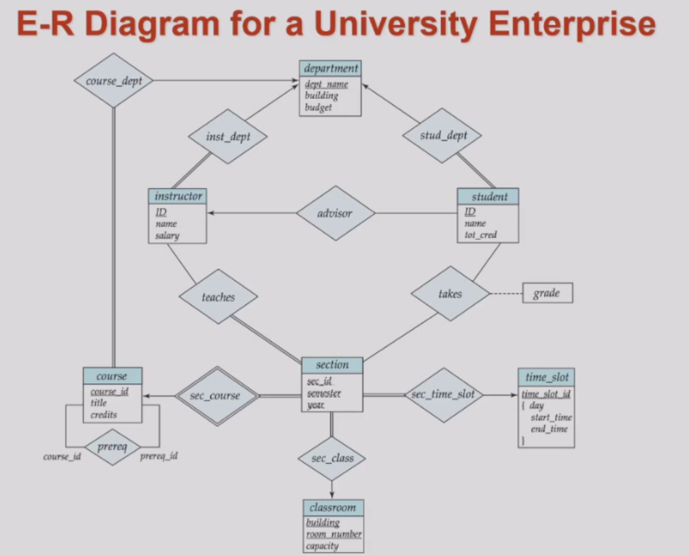 
方框:实体集Entity Set(加虚线partial key(discriminator) -> weak entity)  
weak entity依赖strong entity才能唯一标识自己  
菱形框:关系集Relationship Set(双线框(identifying relationship)连接weak entity与strong entity)  
箭头:对应关系(有箭头一对一无箭头一对多,两边无箭头多对多,双线total participation,必须有对应)  
E.g.一个department可以有多个instructor,指向department  
E.g.每个course都要在course_dept表中,双线连接course,course_dept  
Attribute:relationship带属性(grade)  
Role:prereq:实体内关系(例:前置课程)  
{}:多值属性  
E-R model原则:避免冗余(使用指针),明确关系(显示表示)    
Entity:an object that exists and distinguishable from other objects(name,ID)  
Relationship set:{(e1,e2,...,en),ei∈Ei}  
Degree of relationship set:多元联系(最多使用一个箭头) (尽量使用二元联系,三元联系可以转化为四个实体间的三个二元联系) 
Composite Attributes(复合类型):E.g.Name(first_name,family_name),Address  
Derived attribute(派生属性):可计算  
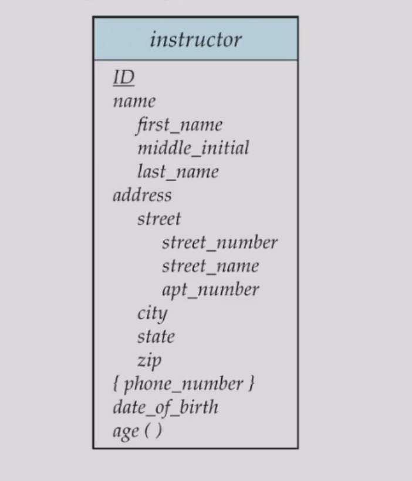  
Mapping Cardinality Constraints(one-to-one,one-to-many,many-to-many)
l..h:最少最多参与次数,*表示多个  
### 6.3 Reduction to Relational Schemas  
1.Strong entity -> schema with same attributes  
```sql
course(course_id,title,credits)
```
  Weak entity -> schema + strong entity primary key  
```sql
section(course_id,sec_id,semester,year)
```
2.many-to-many relationship set -> schema with the primary key of entity set
```sql
advisor(s_id,i_id)
```
  one to many relationship set -> schema -> add attribute to the entity(many side)
```sql
department(dept_name,building,budget)
instructor(ID,name,salary,   dept_name   )
```
3.Composite and Multivalued attributes
```sql
instructor(ID,first_name,middle_initial,last_name,
    street_number,street_name,apt_number,city,state,zip_code,
    date_of_birth,age)
inst_phone(ID,phone_number)

time_slot(time_slot_id)
time_slot_detail(time_slot_id,day,start_time,end_time)
-- section reference time_slot(foreign key)
-- Optimization
time_slot(time_slot_id,day,start_time,end_time)
section(sec_id,semester,year,  time_slot  )
-- Caveat:time_slot attribute of section cannot be a foreign key
-- Solution:using trigger
```
### 6.4 Design Issues
Common mistake:redundant attribute  
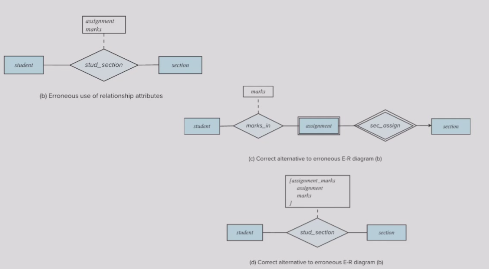  
Note:*takes* is still needed for the sake of the students haven't taken part in assignment  
1.use entity set vs. attributes(whether extra info is needed or multivalue)  
2.use entity set vs. relationship set  
takes vs. section_reg + registration + student_reg  
3.placement of relationship attributes
4.binary vs. non-binary relationship(conversion)  
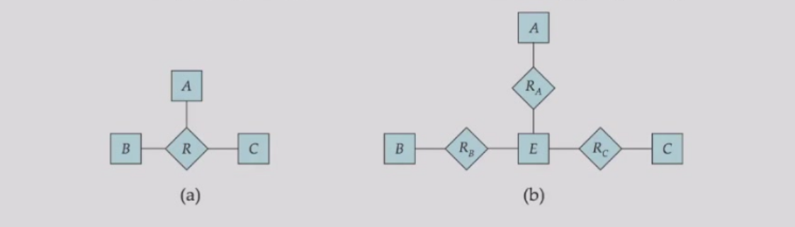  
### 6.5 Extended ER Features  
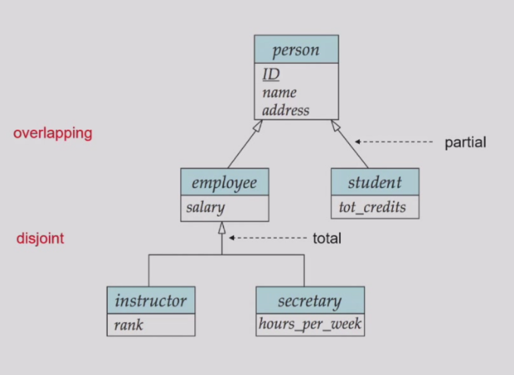  

- Specialization(top-down inheritance)
- Generalization(bottom-up)
overlapping:同属,存在person同属employee与student  
disjoint:不相交子集,不能同时是instructor与secretary  
partial/total:并集是否等于全集  
#### Reduction  
1.inherit from parent
2.inherited attributes in the schema  
3.type attribute to differentiate  

## Chap 7 Relational Database Design
### 7.1 First Normal Form
A relational schema R is in first normal form if the domains of all attributes of R are **atomic**.  
### 7.2 A lossy/lossless Decomposition
What is a 'good' relation?  
Pitfalls of 'bad' relation(combined schema)  

- Information repetition  
- Insertion anomalies  
- Update difficulty  
  
```sql
instructor(id,name,salary,dept_name)
department(dept_name,building,budget)
```
Denote as a functional dependency:  
id -> name,salary,dept_name  
dept_name -> building,salary  
We should treat every functional dependency "kindly".  
  
```sql
employee(ID,name,street,city,salary) ->
employee1(ID,name)
employee2(name,street,city,salary)
```
This is a lossy decomposition if some people share the same name.  
[Definition] A lossless decomposition is a composition that if we **natural join** the two sub schemas,we can get the original schema.  
The key reason of lossy is that `name` is not a key.  
More tuples means more uncertainly,thus less information.  
A decomposition of R into R1 and R2 is lossless if  
**R1 ∩ R2 -> R1 or R1 ∩ R2 -> R2(公共属性一定是某一个关系的key)** 
[Goal] Decompose R into a set of relations such that each relation is a 'good' form and the decomposition is lossless  
Normal Forms:1NF -> 2NF -> 3NF -> **BCNF** -> 4NF  

### 7.3 Functional dependencies  
[Definition] $\alpha,\beta \subseteq R,\alpha \rightarrow \beta $ if $t1[\alpha] = t2[\alpha] \Rightarrow t1[\beta] = t2[\beta]$  
K is a superkey(key) of R if $K \rightarrow R$
K is a candidate key iff $K \rightarrow R$ and for no $\alpha \subset K,\alpha \rightarrow R$
e.g. ID and name is a superkey of the schema student but not candidate key,because ID inself can determine a particular student  
$\alpha \rightarrow \beta $ is trivial if $\beta \subseteq \alpha$  
#### Closure(闭包) of functional dependencies  
If $A \rightarrow B$ and $B\rightarrow C$ then $A \rightarrow C$  
$F = \left\{A \rightarrow B,B \rightarrow C \right\}$
$F^+ = \left\{A \rightarrow B,B \rightarrow C, A \rightarrow C,AB \rightarrow B,AB\rightarrow C,...\right\}$
Find F+ by applying armstrong's axioms:  

- if $\beta \subseteq \alpha$,then $\alpha \rightarrow \beta$ reflexivity自反  
- if $\alpha \rightarrow \beta$,then $\gamma\alpha \rightarrow \gamma\beta$ augmentation增补  
- if $\alpha \rightarrow \beta$,$\beta \rightarrow \gamma$,then $\alpha \rightarrow \gamma$ transitivity传递  

Additional rules:  

- if $\alpha \rightarrow \beta$,$\alpha \rightarrow \gamma$,then $\alpha \rightarrow \beta\gamma$ union  
- if $\alpha \rightarrow \beta\gamma$,$\alpha \rightarrow \beta$,then $\alpha \rightarrow \gamma$ decomposition  
- if $\alpha \rightarrow \beta$,$\gamma\beta \rightarrow \delta$,then $\alpha\gamma \rightarrow \delta$ pseudotransitivity  
  
Exercise 1:Prove $\alpha\gamma \rightarrow \beta\gamma \leftrightarrow \alpha\gamma \rightarrow \beta$  
#### Closure of attribute sets  
[Definition]The closure of attribute a under F(a+) is the set of attributes that are functionally determined by a under F  
R(A,B,C,D) F = $\left\{A \rightarrow B,B \rightarrow C,B \rightarrow D \right\}$  
A+ = ABCD(can be a key)  
B+ = BCD  
C+ = C  
Algorithm:有向图  
K is a key(superkey) if K+ = R
K is a candidate key iff K+ = R and any $\alpha \subset K,\alpha^+ \neq R$  
Compute F+ by using closure of attricute sets  
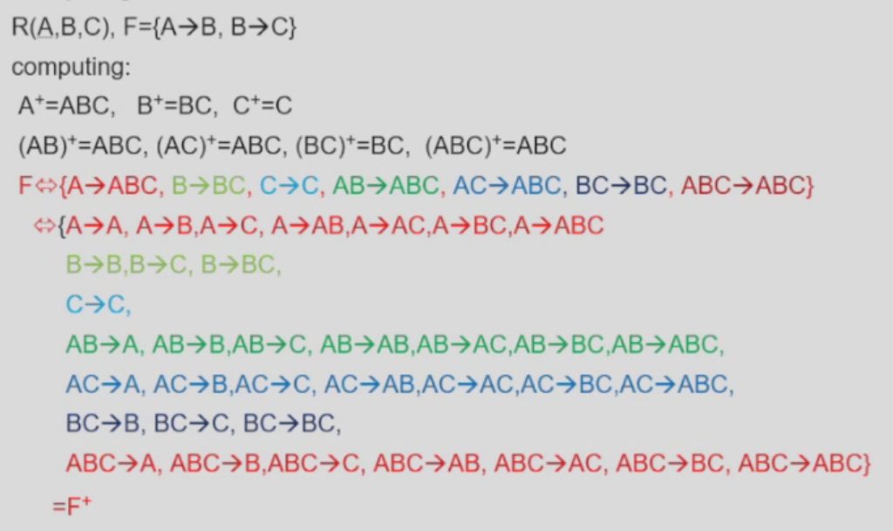  

### 7.4 Canonical Cover(正则覆盖)  
A simplicity of functional dependencies,making it have no redundant dependencies or redundant parts of dependencies  
[Definition] Fc is a canonical cover of F is $F \leftrightarrow F_c$ and no extraneous attribute  
Computing:函数依赖图  
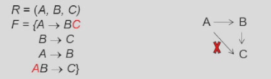  
### 7.5 Boyce-Codd Normal Form  
A relation schema is BCNF,if for any $\alpha \subseteq R,\beta \subseteq R$,at least one of the following holds:  

- $\alpha \rightarrow \beta$ is trivial  
- $\alpha$ is a superkey of R  
  
instr_dept(ID,name,salary,dept_name,building,budget) is not in BCNF because dept_name -> building,budget but dept_name is not a superkey  
任何一条非平凡的函数依赖左边都必须是key  
Decomposition a schema into BCNF  
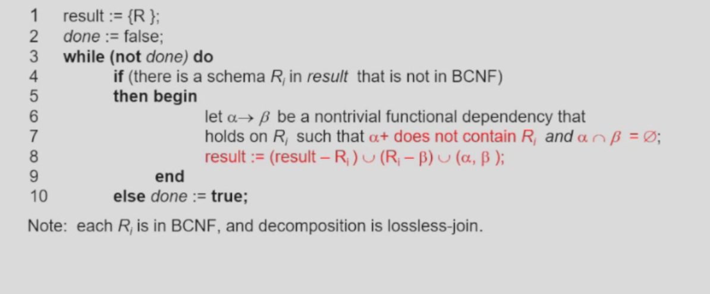  
$\alpha$ is reserved in the original(not BCNF) scheme and is also the key of the new schema  
E.g. R{A,B,C,D,E},F={A->B,B->CD,E->D}  
Candidate key:AE  
Let R1 = {A,B} R~ = {A,C,D,E} F~ = {A->CD,E->D}  
Let R2 = {A,C} R~ = {A,D,E} F~ = {A->D,E->D}  
Let R3 = {A,D} R4 = {A,E}  
答案不唯一，建议从叶向根分解  
F1 = {A->B},F2 = {A->C},F3 = {A->D},F4 = {AE->AE}不是依赖保持的  
如E->D不能由F1,F2,F3,F4推出  

### 7.6 Third Normal Form  
[Definition] **Dependency Preservation(依赖保持)**：
如果通过检验单一关系上的函数依赖，就能确保所有的函数依赖成立，那么这样的分解是依赖保持的  
或者说，原来R上的每一个函数依赖，都可以在分解后的单一关系上得到验证或者推导得到  
A decomposition is dependecy preserved if $(F1\cup...\cup Fn)^{+}=F^{+}$  
对某一个R，BCNF与依赖保持可能无法同时保证  
A relation schema is 3NF,if for any $\alpha \subseteq R,\beta \subseteq R$,at least one of the following holds:  

- $\alpha \rightarrow \beta$ is trivial  
- $\alpha$ is a superkey of R  
- **Each attribute A in $\beta - \alpha$ is contained in a candidate key of R**  
  
E.g. R = {J,K,L},F = {JK -> L,L -> K}(candidate key = JK,JL)  
不是BCNF但是3NF(K包含于一个candidate key JK)  
任何一条非平凡的函数依赖，如果左边不是key，那么右边必须包含在某一个key里面  
3NF是对BCNF的最小放松  
[Algorithm] 
优先保证函数依赖，分解canonical cover中的每一条函数依赖  
如果分解出的关系模式都不包括candidate key则将某一个candidate key单独作为一个关系模式  
E.g. R{A,B,C,D,E},F={A->B,B->CD,E->D}  
Candidate key:AE  
R1 = {A,B},R2 = {B,C,D},R3 = {E,D},R4 = {A,E}  
如果某一个关系模式包含在另一个关系模式中，去除多余的关系模式  

### *7.7 Multivalued dependencies and Fourth Normal Form
classes(course,teacher,book)(course:teacher = 1:n,course:book = 1:n,teachers and books are independent)  
|course | teacher | book|
|-------|---------|-----|
|DB|A|DB Concept|
|DB|A|DB System|
|DB|H|DB Concept|
|DB|H|DB System|
|DB|S|DB Concept|
|DB|S|DB System|
|OS|A|OS Concept|
|OS|A|OS System|
|OS|J|OS Concept|
|OS|J|OS System|  

key = {course,teacher,book}  
Redundant and Insertion anomalies(insert DB,T)  
Decompose:teaches(course,teacher),text(course,book)  
[Definition] MVDs:$\alpha,\beta \subseteq R,\alpha \rightarrow\rightarrow \beta $ if $t1[\alpha] = t2[\alpha]$ then exists $t3,t4$ such that  
$
t1[\alpha] = t2[\alpha] = t3[\alpha] = t4[\alpha],
t3[\beta] = t1[\beta],
t4[\beta] = t2[\beta],
t3[R-\alpha-\beta] = t2[R-\alpha-\beta],
t4[R-\alpha-\beta] = t1[R-\alpha-\beta]
$ (independent)  
$\alpha \rightarrow\rightarrow \beta $ is trivial if $\beta \subseteq \alpha $ or $a \cup b = R$  
If $\alpha \rightarrow \beta $,then $\alpha \rightarrow\rightarrow \beta $单值决定是多值决定的特例  
D = {all functional and multivalued dependencies}  
D+ is the closure of D  
A relation schema is 4NF,if for any $\alpha \subseteq R,\beta \subseteq R$,at least one of the following holds:  

- $\alpha \rightarrow\rightarrow \beta$ is trivial  
- $\alpha$ is a superkey of R  

If a relation is in 4NF,it is in BCNF($F^+ \subset D^+$)  
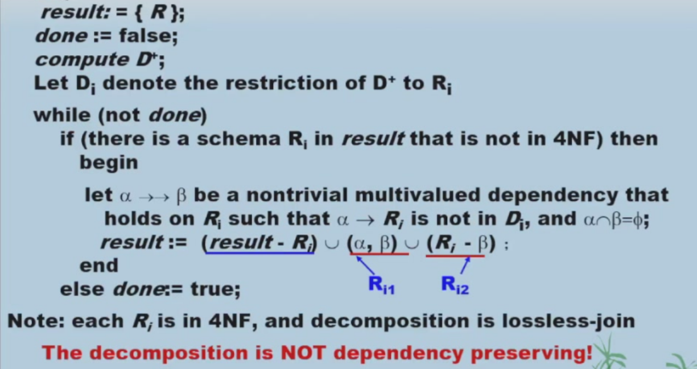  

## Chap 12 Physical Storage Systems  
### 12.1 Physical Storage Media
volatile/non-volatile storage:易失/非易失存储  
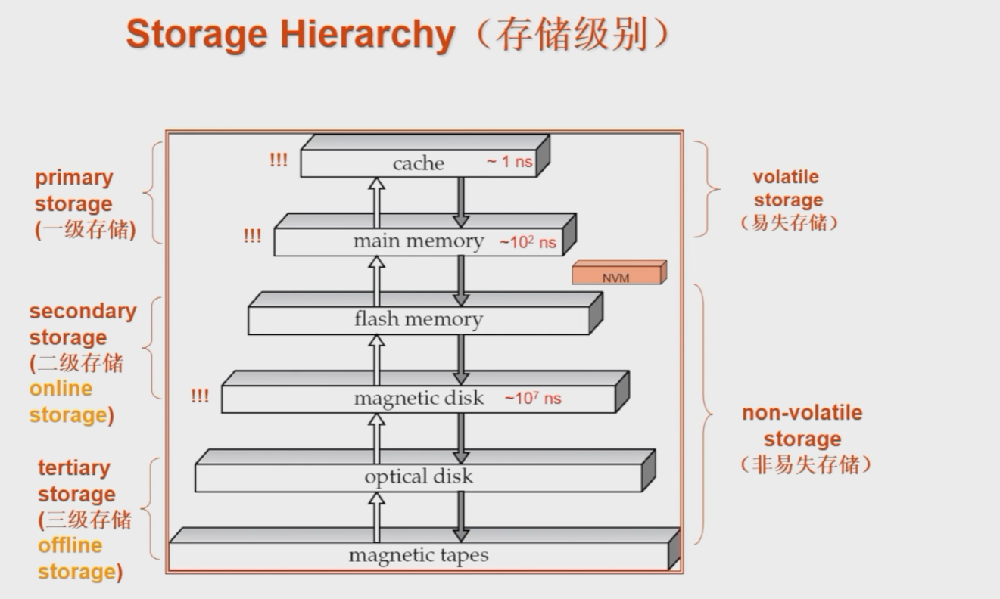  

- primary storage:fastest but volatile(cache,main memory)  
- NVM(Non-Volatile Memory):耐用性差  
- secondary storage(on-line storage):non-volatile,moderately fast(flash memory,magnetic disks)  
- tertiary(第三级) storage(off-line storage):non-volatile,slow  
   
### 12.2 Magnetic Disks
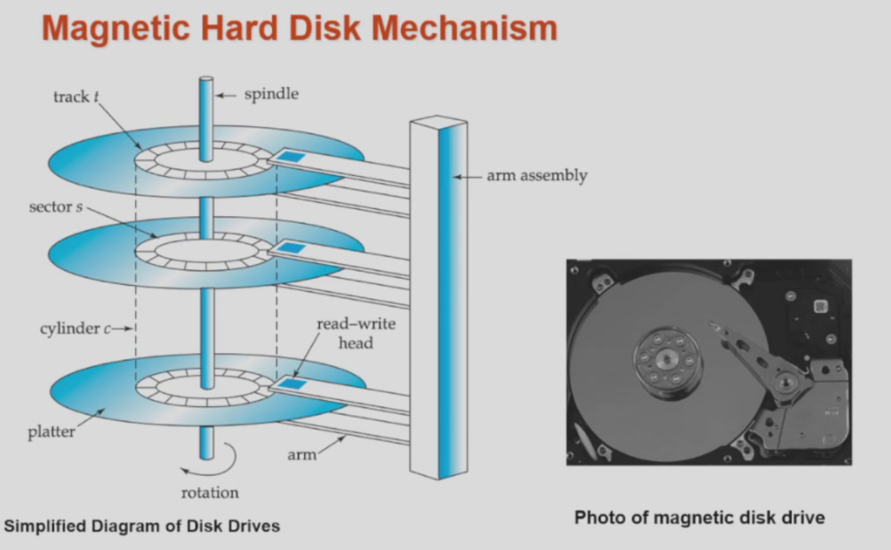  
Magnetic Hard Disk Mechanism:机械运动  
大文件的存储方式:每个盘片存储一部分，并行读  

- Read-write head  
- Surface of platter(平盘) divided into circular **tracks(磁道)**  
- Each track is divided into sectors(扇区)  
- Disk arm swings to read/write a sector  
- Head-disk assemblies:multiple disk platters on a single spindle(轴)  
- Cylinder(柱面)  
  
Disk controller(磁盘控制器):interface between the computer system and the disk drive hardware  
checksums:校验码(写时计算，写完后读出校验)  

### 12.3 Performance measurement  

- Access Time
  seek time(寻道时间):4-10ms  
  rotational latency:4-11ms  
- Data transfer rate:25-100M/s  
- Disk block:4-16KB  
- Sequential access pattern  
- Random access pattern  
- I/O operations(number of random block reads) per second(IOPS,每秒I/O操作数):50-200IOPS -> 尽量减少随机访问次数  
- Mean time to failure(MTTF):3-5yr
  
### 12.4 Optimization of Disk-Block Access  

- Buffering:in-memory buffer  
- Read-ahead(Prefetch):read extra blocks in anticipation  
- Disk-arm-scheduling:reorder block requests  
  elevator algorithm  
  file organization:defragment  
- Non-volatile write buffers:battery backed up RAM(备电)/flash memory  
- Log disk:a disk devoted to writing a sequential log of block updates  

### 12.5 Flash memory & NVM  

- NAND flash:cheaper than NOR flash  
- SSD(Solid State Disks):block-oriented disk interfaces  
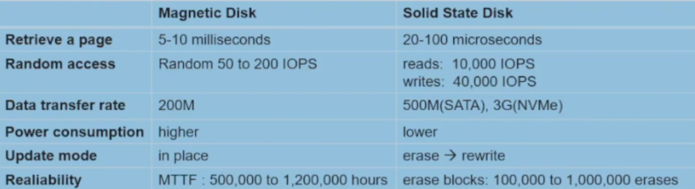  
Erase:2-5ms,256KB-1MB  
Remapping by using Flash translation table  
wear leveling(磨损均衡)  
NVM:write buffer/log disk(未商业化)  
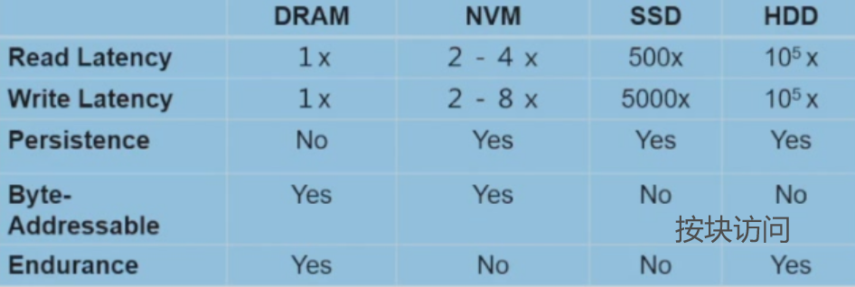  

## Chap 13 Data Storage Structures  
### 13.1 File Organization  
The database is stored as a collection of files  
Each file is a sequence of records and each records is a sequence of fields  
#### Fixed-length record  
store record *i* starting from byte *n * (i-1)*,where *n* is the size of each record  
Delete of record *i*:  

- move records i+1,...,n to i,...,n-1  
- move record n to i  
- do not remove records,but link all free records on a free list  
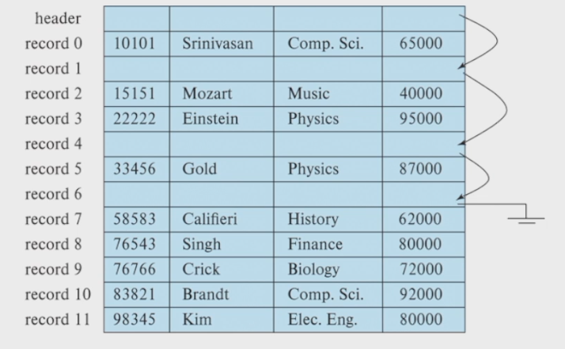  
#### Variable-length record  
variable length for one or more fields(varchar);null-value  
represented by fixed size(offset,length),actual data stored after  
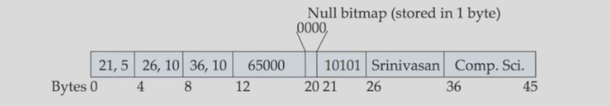  
null bitmap:represent null value(0 for not null,1 for null)  
##### Slotted Page Structure  
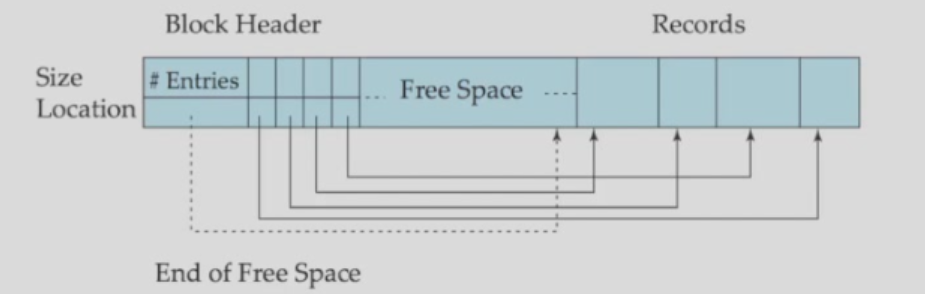  
两头挤压  
Slotted page header:  

- number of record entries  
- end of free space  
- location and size of each record  
  
record pointers point to the entry for the record in header  

### 13.2 Organization of Records in Files  
- Heap:no-order,place anywhere where there is space  
- Sequential  
- B+ tree  
- Hashing  

#### Heap  
Free-space map  
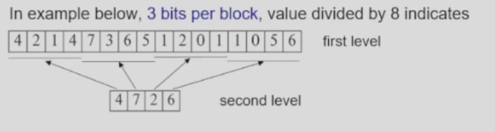
first level:'4' represents:4/8 free  
second level:'4' represents the max free fraction of the relevant block  
#### Sequential 
order by a search-key  
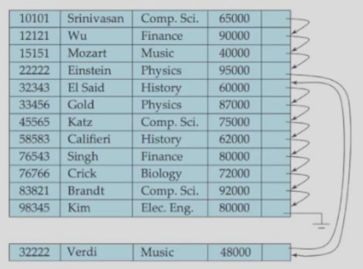  
delete and insert by using pointers  
need to reorganize the file from time to time  
sequential storage are often combined with B+ tree  
#### Multitable Clustering(多表聚类)  
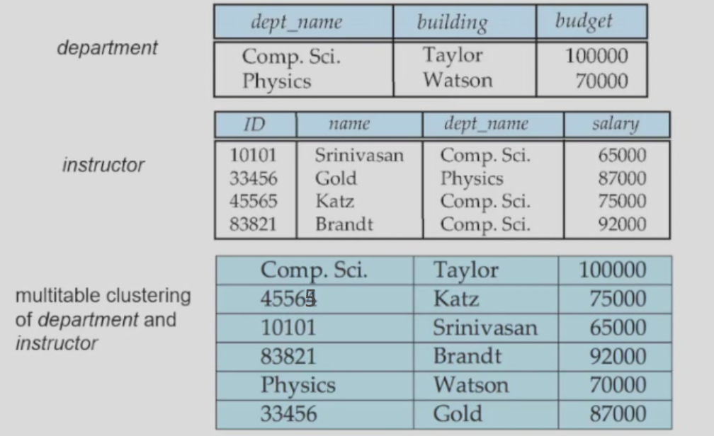  
good for queries involving join  
bad for queries involving only department  
#### Table Partitioning  
Reduce costs of some operations  
Support parallel accessing  
Allow different partitions to be stored on different storage devices  

### 13.3 Data Dictionary Storage  
Data Dictionary(system catalog) stores metadata,including:  

- relation info  
- user and account info(e.g. password)  
- statistical and descriptive data(e.g. number of tuples of each relation)  
- file organization info(sequential?hash?,physical location)  
- indices info  

### 13.4 Data Buffer
Buffer Manager:allocating buffer space in main memory  
```c
access block:
if block already in buffer:return addr
else 
    1. buffer manager allocates space in the buffer:
    (1)replacing some other blocks if required
    (2)replaced blocks written back to disk
    2. reads the block from disk to the buffer
```
Replacement algorithm  

- LRU(see Computer System III Cache)  
- Toss-immediate:free the space as soon as the final tuple of that block has been processed  
- MRU:pin the block currently being accessed,unpin it after the final tuple of the block been processed(近期被访问过的数据不太可能再被访问,more common in database management)
- *An approximation of LRU:Clock  
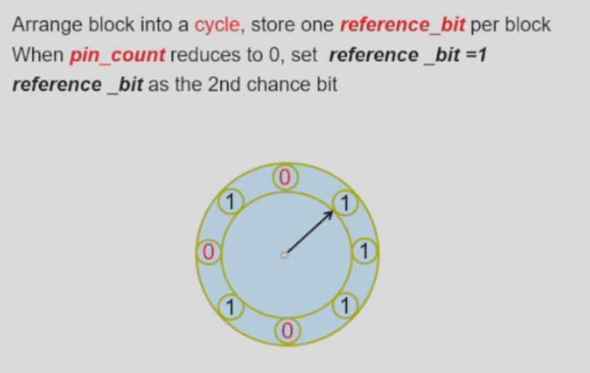  
pin_count:number of processes accessing it currently  
reference_bit:

- set '1' is pin_count == 0  
- set '0' is reference_bit is '1'(LRU)  
- throw if reference_bit == 0(轮转一圈还没有被访问过)  

## Chap 14 Indexing  
### 14.1 Basic Concept  
Search key:attribute to sets of attributes used to look up record in a file  
index file consists of records(index entries) of the form:search key,pointer  
two basic kinds of indices:ordered indices,hash indices  
access types:point query(records of a specific value),range query  
performance measurement:access time,insertion time,deletion time,space overhead  
### 14.2 Ordered Indices  

- primary index(主索引):the order of the search key is in the same order of the file(clustering index聚集索引)  
  最高效,只有一种  
- secondary index(辅助索引):the order of search key is not in the same order of the file  
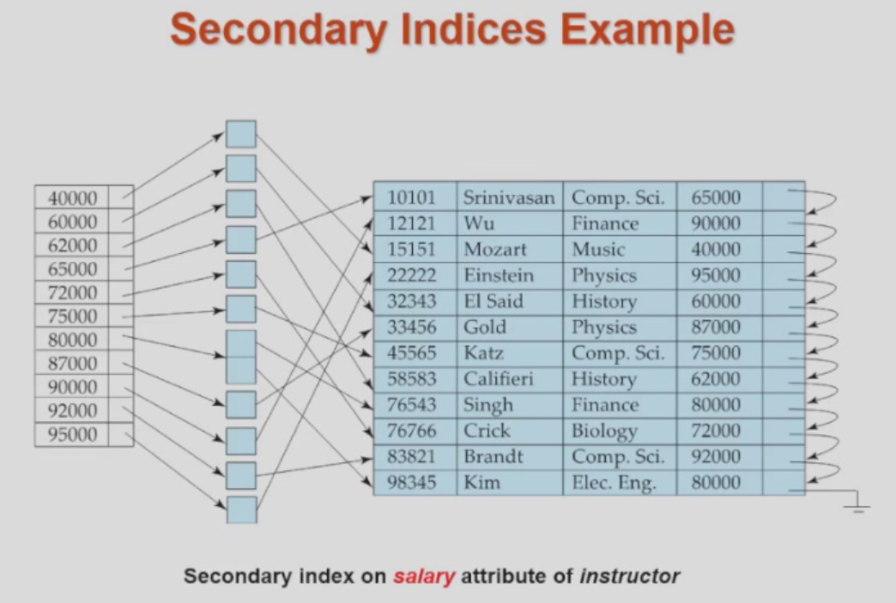   

- dense index:index record appears for every search-key value in the file  
- sparse index:contains index values for only some search-key values  
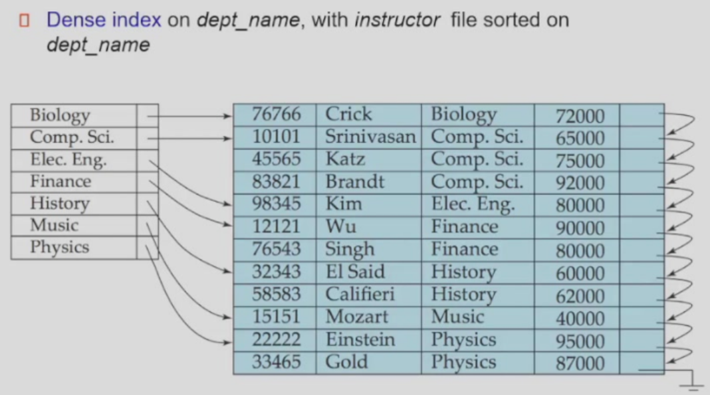  
locate a record with search-key value K by  
(1)find index record with largest search-key value < K  
(2)sequentially starting at the record to which the index record points  
no sparse index for secondary index  
### 14.3 B+ Tree Index  
basic concept see [ADS Lecture 2](https://tapir-elithril.github.io/Notebook/fa24/ads/note/#b-tree)  
Assume a block in 4Kb in disk,each index is 10 bytes and each pointer is 4 bytes  
The maximum number of child is $\frac{4096 - 4}{10 + 4} + 1 = 293$ ~ 147  
If there a K search keys,the tree height is no more than$\lceil log_{\lceil n/2\rceil}(K)\rceil$ ~ $\lceil log_{\lceil n/2\rceil}(K/2)\rceil + 1$ 
range query is supported by linked list in the leaf level  
scan from the head of the linked list  
#### height and size estimation  
```sql
person(pid     char(18) primary key,
       name    char(8),
       age     smallint, -- 2bytes
       address char(40));
block size:4K
1000000 person
```
**height estimation**  
person record size = 18+8+2+40 = 68  
records per block 4096/68 = 60
blocks for storing 1000000/60 = 16667  
B+ tree fan-out $n = \frac{4096 - 4}{18 + 4} + 1 = 187$ ~ 94(inner pointers)  
leaf:93 ~ 186  
2 levels: min = 2 * 93 = 186,max = 187 * 186 = 34782  
3 levels: min = 2 * 94 * 93 = 17484,max = 187 * 187 * 186 = 6504234  
4 levels: min = 2 * 94 * 94 * 93 = 1643496,max = 187 * 187 * 187 * 186 = 1216291758  
ANS:3 levels  
**size estimation**  
min:  
leaf = 1000000/186 = 5377  
second level = 5377/187 = 29  
root = 1  
total node number = 5377 + 29 + 1 = 5407  
max:  
leaf = 1000000/93 = 10752(取下界)  
second level = 10752/94 = 114  
root = 1  
total node number = 10752 + 114 + 1 = 10867  
删除时有时可以不修改父节点的索引,父节点的索引不一定一定要出现在叶子中  
#### B+ Tree File Organization  
Leaf nodes in a B+ tree file organization stores records directly instead of pointers  
#### Other issues  
**Record relocation and secondary indices**  
If a record moves,all secondary indices should be updated  
[Solution] use primary-index search key instead of record pointer in secondary index,存放primary key(通常不变)而不直接存放record  
#### Index strings  
variable length string as keys  
prefix compression:keep enough characters to distinguish entries in subtrees(e.g.silb for "silas" and "silberschatz")  
#### Bulk loading and Bottom-up build  
Assume we already have 1000000 records,build a B+ Tree for indexing  
Insert one by one ?  
alterative1:insert in sequential order  
alterative2:Bottom-up construction  

- sort index entries  
- create B+ Tree layer by layer,start with leaf level  
- written to disk using sequential I/O operations  
  parallel operation see [ADS Lecture 15](https://tapir-elithril.github.io/Notebook/fa24/ads/note/#parallel-operation)  
disk estimated cost:1 seek + <number_of_blocks> block transfer  

Bulk insertion  

- build a new B+ Tree using bottom-up algorithm  
- merge the two B+ Tree(merge sort)  
disk estimated cost:2 seeks + <original_number_of_leaf + new_number_of_blocks> block transfer  

**Multiple key access**  
```sql
select ID
from instructor 
where dept_name = "finance" and salary = 80000;
```
create a B+ Tree index on tuple(dept_name,salary)  
### 14.4 Indexing in main memory  
in the leaf level,how to locate if we have 186 branches?  
binary search is not efficient since memory is loaded to cache in the unit of blocks  
use large node size to optimize disk access  
for structure data within a node,use a tree instead of an array to optimize cache access  
### 14.5 Indexing on flash  
Write-optimized tree structures(LSM Tree & Buffer Tree)  
#### LSM Tree  
Log Structured Merge Tree:  
Records inserted first into in-memory tree(L0 tree)  
move to disk(L1 tree) when in-memory tree's full,merging using bottom-up algorithm  
merge to L2 tree if L1's full,...  
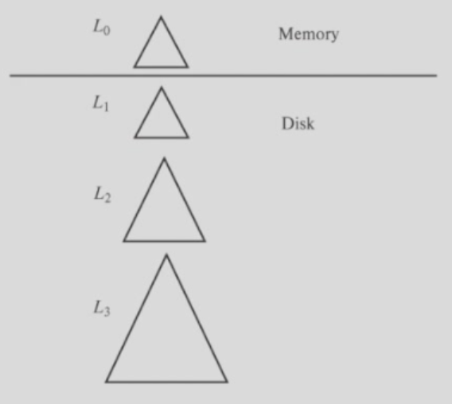  
**stepped merge**  
k trees of each level on disk,when all k indices exists,merge them into one index of the next level(reduce write cost but more expensive query)  
optimization of point lookups:**Bloom filter(布隆过滤器)**  
Every tree correspond to a filter,search the tree only when the filter returns a positive result(hash function)  
#### Buffer Tree  
each internal node of B+ Tree has a buffer to store inserts  
inserts all moved to lower level only when the buffer's full  
less overhead on queries ,reduce per record I/O but more random I/O than LSM  
#### Bitmap indices  
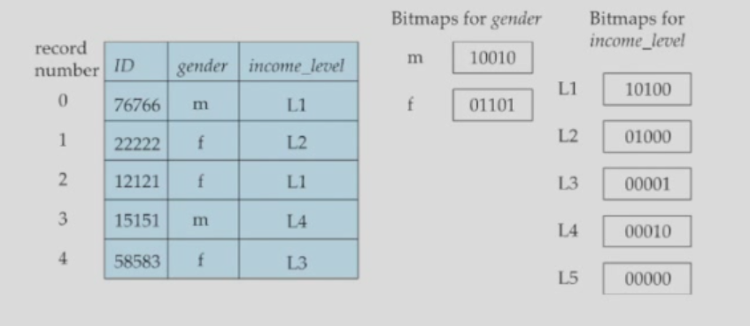  
10010:record no.0 & 3 are male  
easy &|~,counting by an array of integer to number of '1's(e.g. 254 -> 6,255 -> 7)
### 14.6 SQL definition
```sql
create index <index_name> on <table>(<attribute_list>);
create index cust-strt-city-index on customer(customer-city,customer-street);
create unique index uni-acnt-index on account(account-number);
drop index <index_name>;
```
## Chap 15 Query Processing

## Chap 16 Query Optimization

## Chap 17 Transactions

## Chap 18 Concurrency Control

## Chap 19 Recovery System