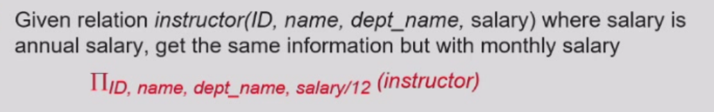

# 数据库系统

## Chap 1 Introduction

### 1.2 Definition
[Definition] Database:a collection of **interrelated**/integrated and persistent data  
[Definition] Database Management System(DBMS):A set of programs used to access,update and manage the database  
Properties of DBMS:  

- efficiency and scalability(可扩展性)  
- independency(physical/logical)  
- integrity(完整性) and security  
- concurrent(并发) access and robustness(鲁棒性)(recovery)  
  
### 1.4 Levels of data abstraction  

- Physical level:files  
- Logical level:relationship  
- View level:details of data viewed by the users(detail hidden) e.g. age for course selection  

  
**schemas(模式) and instances(实例)**  
schema:the structure on different level(Physical/Logical/Sub-schema)(表头)  
instance:the actual content  
  
**Independence**  

- Physical:change of logical schema rarely affects the physical schema(unless some data are missed)
- Logical:harder to achieve since the view schema are strongly influenced by the logical schema(change of logical scheme immediately change the data in the view scheme)  

### 1.5 Data models
[Definition] Data model:a collection of conceptual tools for describing——data structure/relationship/semantic(语义)/constraint  
Different types:  

- Entity(object)-Relationship model(E-R)  
- Relational model  
- Object-oriented model  
- Semistructured data model (XML)  
  


### 1.6 Database Language  

- Data definition language(DDL)  
- Data manipulation language(DML)  
- Data control language(DCL)  
  
(1)DDL  
generate tables stored in data dictionary  
```sql
CREATE TABLE account(
    account_number char(10),
    balance integer
);
```
[Definition] Data dictionary:metadata(the data of data) including——database schema,data structure,access methods and constraints,statistical info,authorization
(2)DML  
Insert/Delete/Update/Retrieve data  
query language
(3)SQL(DDL+DML+DCL)  
```sql
SELECT account.balance
FROM depositor,account
WHERE depositor.customer-id = '192-83-7465' and depositor.account-number = account.account-number
//不同表之间的对应
```

### 1.7 Database Users  

- naive users:interface interact  
- application programmer:SQL calls  
- sophisticated users:analytical processing/data mining  
- specialized users

### 1.8 Database Administrator(DBA)  
a good understanding of the enterprise's info resources and needs

### 1.9 Transaction(operation) Management(事务管理)  

atomicity,consistence,isolation,durability(ACID)  
concurrency-control manager(并发控制管理器)  

### 1.10 DBMS structure  
1.storage manager  
responsible for efficient storing,retrieving,updating data  

2.query processor
DDL interpreter,DML compiler,query processing  
query -> parser and translator -> relational algebra expression -> **optimizer** -> execution plan -> evaluation engine -> output  
Optimization:cost estimation  

Application architectures:  
two-tier:app -> db  
three-tier:browser -> web -> db  

## Chap 2 Relational Model  

### 2.1 Definition
[Definition] relation:a table with rows and columns  
[Comparison] relationship:an association among several entities  

### 2.2 Basic Structure  
given sets D<sub>1</sub>,...,D<sub>n</sub>  
a relation *r* is a subset of D<sub>1</sub> x ... x D<sub>n</sub>(Cartesian product)  
e.g.dept_name = {Biology,Finance,History,Music}  
building = {Watson,Painter,Packard}  
budget = {50000,80000,90000,120000}  
Then r = {(Biology,Watson,90000),(Finance,Painter,120000),(History,Painter,50000),(Music,Packard,80000)}is a relation over dept_name x building x budget(total 48 tuples)  
(1)Attribute Types  
domain:the set of allowed values(atomic) of each attribute(属性，表头的元素)  
non-atomic value:multivalued/composite(混合的) attribute  
e.g.tel:138xxx,139xxx(a string difficult to split)  
null:a member of every domain  
(2)Concepts  
relation schema:the structure of the relation  
e.g.(ID=string,name=string,salary=int)  
R=(A<sub>1</sub>,...,A<sub>n</sub>) is a relation schema where A<sub>i</sub> is an attribute  
relation instance:the snapshot of data in the relation  
  
(3)Relations are unordered
(4)Keys  
唯一区分一个对象的一个或一些属性  
superkey:a set of attribute sufficient enough to identify a unique tuple  
candidate key:minimal superkey(cannot delete anyone)  
primary key:candidate key defined by user  
(5)Foreign key  
Assume there exists relation r and s: r(A, B, C), s(B, D), we can say that attribute B in relation r is foreign key  
参照关系中外码的值必须在被参照关系中实际存在或为null(不能填不存在的值，如填入一个不存在的专业)  
(6)Schema Diagram(模式图)  
  
(7)Query language:language in which user requests info from the db

### 2.3 Relational Algebra  
Six basic operations  
(1)Select $\sigma$  
$\sigma_{A=B \wedge D>5}(r)$
选择满足A=B且D>5的关系  

Notation:$\sigma_p(r)=\left\{t|t\in r \ and \ p(t)\right\}\ p:查询条件   $ 
e.g.$\sigma_{dept\_ name='Finance'}(department)$   
(2)Project $\Pi$ 投影 
Notation:$\Pi_{A_{1},...,A_{k}}(r)$
  
投影A,C关系(注意去重)  
(3)Union $\cup$  
Notation:$r\cup s=\left\{t|t\in r \ or \ t \in s\right\}$
  
可并条件：r,s有相同的arity(元数)(属性个数);属性的域必须是compatible(可容的)  
e.g.$人名\cup 公司名$
(4)Set difference $-$  
Notation:$r-s=\left\{t|t\in r \ and \ t \notin s\right\}$
  
可做差条件同Union  
(5)Cartesian product $\times$  
  
Composition of operations:e.g.$\sigma_{A=C}(r\times s)$
(6)rename $\rho$
Notation:$\rho_{x}(E)$  
将E改名为x，E可以是关系代数的结果  
$\rho_{x(A_1,...,A_n}(E)$ 将n个属性分别改名  
查询表达式与查询优化  
  
  
Problem:六种基本关系操作没有统计功能  
Additional operations(不增加表达能力，只是方便书写)  
(7)Set intersection $\cap$  
$r \cap s = r-(r-s)$
(8)Natural join $r\bowtie s$
将r与s公共属性相同的连接在一起  
  
满足交换律和结合律  
Theta join:条件连接  
$r\bowtie_{\theta} s = \sigma_{\theta}(r\times s)$  
(9)Outer join  
保留一边没有连接的信息，另一边缺少的属性置为null  

left/right/full outer join  
  
等价于条件筛选  
(10)Assignment ⬅  
赋值操作，用于避免表达式过长  
(11)Division $\div$
$s \subseteq r$且满足$(r \div s) \times s \subseteq r$


### 2.4 Extended Relational-Algebra-Operations  
增加表达能力的扩展关系代数  
(1)Generalized Projection  

(2)Aggregate Function 统计函数  
avg,min,max,sum,count(非空值的个数)  
$_{G_1,...,G_n}\mathcal{G}_{F_1(A_1)...F_n(A_n)}(E)$  
$G_i$表示分组属性($G_i$为空即将整个表看成一组),$F_i$表示统计函数  

$as$用于重命名  

### 2.5 Modification

- Deletion  
- Insertion  
- Updating

### 2.6 Multiset  
Multiset(多重集) relational algebra retains duplicates,to match SQL semantics  
引入原因：去除重复元素代价过高  
设某一相同表达式在r中出现m次，在s中出现n次  

- selection:保留所有重复  
- projection:不去重  
- cross product:出现$m*n$次  
- union:$m+n$  
- intersection:$min(m,n)$  
- difference:$max(0,m-n)$  
  
## Chap 3 Introduction to SQL  
  
### 3.1 Data Definition Language(DDL)  
(1)Domain types in SQL
```sql  
char(n)  
varchar(n)
int 
smallint
numeric(p,d) -- precision of p digits, with d digits to the right of decimal point
real,double precision
float(n)
date -- 4 digit year,month,date
time 
timestamp/datetime
```  
(2)Create table  
```sql
create table instructor(
    ID char(5) , -- primary key here is also valid
    name varchar(20) not null,
    dept_name varchar(20),
    salary numeric(8,2) default 0,
    primary key(ID), -- not null,cannot repeat
    foreign key(dept_name) references department, --引用另一表的primary key 
    check(salary >= 0) -- null >= 0 = unknown 允许插入 
    -- where之后的条件一定为true
);

insert into instructor values('10211','Smith','Biology',66000);
```
```sql
foreign key(dept_name) references department
on delete cascade(连锁反应，也删掉)|set null|restrict(不能删)|set default
on update cascade|set null|restrict|set default
```
(3)Drop and Alter table  
```sql
drop table r; -- delete

delete from r; -- delete all contents,but retain the table

alter table r add A,D;
alter table r add (A1 D1, ... , An Dn);  

alter table r drop A; -- not supported by many db

alter table r modify(ID char(10),salary not null);
```
(4)Create index
```sql
create (unique) index <i-name> on <table-name> (<attribute-list>);
-- primary key is indexed on default
create index ins_index on instructor(ID);

drop index <i-name>;
```
### 3.2 Basic Structure of select  
$\Pi_{A_1,...,A_n}(\sigma _{P}(r_1\times...\times r_m))$
```sql
select (distinct/all) A1,...,An -- distinct:no repetition
from r1,...,rm
where P
```
$_{A_1,A_2}\mathcal{G}_{sum(A_3)}(\sigma_P(r_1 \times ...\times r_m))$  
```sql
select A1,A2,sum(A3)  
from r1,...,rm
where P
group by A1,A2
```
Clause
```sql
select * from instructor,teaches; -- all the elements | Cartesian product
select salary/12 as monthly salary from instructor; 
-- algebra allowed -- as for rename(omitted sometimes)
select name from instructor where salary between 9000 and 10000;

select name,course_id from instructor,teaches 
where (instructor.ID,dept_name) = (teaches.ID,'Biology');
```
Join
```sql
select name,course_id from instructors,teaches where instructor.ID = teaches.ID
select name,course_id from instructors natural join teaches
```
```sql
-- A trap
course(course_id,title,dept_name,credits)
teaches(ID,course_id,sec_id,semester,year)
instructor(ID,name,dept_name,salary)
select name,title from instructor natural join teaches natural join course; 
-- wrong if course.dept_name != instructor.dept_name
select name,title from instructor natural join teaches,course
where teaches.course_id = course.course_id;

select name,title from instructor,teaches,course
where instructor.ID = teaches.ID and teaches.course_id = course.course_id;

select name,title from (instructor natural join teaches) join course using(course_id);
-- 一个属性等值连接
```
String
'%' matches substring(including null)  
'_' matches character  
```sql
select name from instructor where name like '%dar%' 
-- match 100%
like '100\%' escape '\'
```
Order
```sql
select distinct name from instructor order by name (desc/asc)
order by dept_name,name
```
Limit
```sql
select name from instructor order by salary desc limit 3;-- 前三
```
### 3.3 Set Operation
```sql
(select course_id from section where sem = 'Fall' and year = 2009)
union/intersect/except(minus) all -- Multiset
(select course_id from section where sem = 'Spring' and year = 2010)
```
a. Find each customer who has an account at every branch located in “Brook-
lyn”.

b. Find the total sum of all loan amounts in the bank.

c. Find the names of all branches that have assets greater than those of at
least one branch located in “Brooklyn”.
### 3.4 Aggregate Function
avg,min,max,sum(null = 0),count  
```sql
select avg(salary) from instructor where dept_name = 'Comp.Sci';
select count(*) from course; -- all the elements
```
```sql
select dept_name,ID,avg(salary) from instructor group by dept_name;
-- wrong!attributes in select clause outside aggregate function must
-- appear in group by list,hence ID in select is not allowed
```
```sql
select dept_name,avg(salary) from instructor group by dept_name 
having avg(salary) > 42000; -- fliter
-- where不能与聚合函数一起使用 
-- having必须与group by 一起使用
```
arithmetric expression
```sql
select dept_name from student group by dept_name
having count(distinct name) = count(id) -- 没有重名的系
```

### 3.5 Null Values  
null signifies the value unknown or the value does not exist  
5 + null = null  
null > 100 = null
```sql
select name from instructor where salary is null
```
unknown or true = true  
unknown or false/unknown = unknown  
true/unknown and unknown = unknown  
false and unknown = false   
not unknown = unknown  

### 3.6 Nested(嵌套) Subqueries
(1)Set membership
```sql
select distinct course_id 
from section 
where semester = 'Fall' and year = 2009 and
course_id (not) in (
    select course_id 
    from section where semester = 'Spring' and year = 2010);
```
(2)Set comparison
```sql
select name
from instructor
where salary > some/all (
    select salary from instructor where dept_name = 'Biology')
```
(3)Test for Empty Relations
```sql
select course_id
from section as S
where semester = 'Fall' and year = 2009 and 
exists(
    select * from section as T
    where semester = 'Spring' and year = 2010 and S.course_id = T.course_id);
-- 子查询非空
-- Correlated subquery
```
```sql
select distinct S.ID,S.name 
from student as S
where not exists(
    select course_id
    from course where dept_name = 'Biology'
    except
    (select T.course_id
    from takes as T where S.ID = T.ID)
);
-- 选择生物系的所有课程
-- 关系代数中的除法功能
```
(4)Test for Absence of Duplicate Tuples
```sql
select T.course_id from course as T
where unique(
    select R.course_id
    from section as R
    where T.course_id = R.course_id and R.year = 2009);
```

### *3.8 With Clause

### 3.9 Modification of Database
(1)Deletion
```sql
delete from instructor; -- 全部删除

delete from instructor
where dept_name in(
    select dept_name from department 
    where building = 'Watson'
);
```
(2)Insertion
```sql
insert into student
select ID,name,dept_name,0 from instructor  
```
(3)Update
```sql
update instructor
set salary = salary * 1.03 where salary > 100000;

update instructor
set salary = case when salary <= 100000 then salary * 1.05 else salary * 1.03 end; 
```

## Chap 4 Intermediate SQL 
### 4.1 Join Relations
inner join,left/right outer join,full outer join
```sql
select instructor.id,count(distinct course_id),count(takes.id)
from instructor natural left outer join teaches left outer join takes using(course_id,sec_id,semester,year)
group by instructor.id;
-- 不上课的老师count = null/0(但保留)
```

### 4.2 SQL Data Types and Schemas
#### User-defined types
```sql
create type Dollars as numeric(12,2) final -- 叶子类，不能再派生
-- 编译时发现类型间错误
```
#### Domains
```sql
create domain person_name char(20) not null -- constraints
create domain degree_level varchar(10)
constraint degree_level_test
check(value in 'Bachelors','Masters','Doctors')
```
#### Large object
blob(binary large object):tinyblob,blob,mediumblob,largeblob  
clob(character large object)  
when a query returns a large object,**a pointer** is returned.  

### 4.3 Integrity Constraints
#### Single Relation
not null,primary key,unique,check(P),foreign key
```sql
course table section(
    ...
    semester varchar(6),
    ...
    check(semester in('Fall','Spring','Summer','Winter'))
);
```
#### Referential
```sql
create table course(
    ...
    dept_name varchar(20),
    foreign key(dept_name) references department
        on delete cascade,
        on update cascade,
    ...
);
```
### Violation during transactions
```sql
create table person(
    mother char(10),
    foreign key(mother) references person
);
```
defer constraints checking to **transaction end**
### Complex Check Clause
```sql
check((course_id,sec_id,semester,year) 
in (select course_id,sec_id,semester,year from teaches));
```
### Assertion
```sql
create assertion credits_earned_constraints check
(not exists
    (select ID from students 
    where tot_cred <> 
          select sum(credits) from takes natural join course
          where student.ID = takes.ID
                and grade is not null
                and grade <> 'F'));
```
### 4.4 Views

- hide complexity  
- logic independence  
- authority management  
  
```sql
create view faculty as
    select ID,name,dept_name
    from instructor;

select name from faculty
where dept_name = 'Biology';

create view dept_total_salary(dept_name,total_salary)as
    select dept_name,sum(salary)
    from instructor
    group by dept_name;
```
view can be defined from other views(view expansion for sql server)
```sql
insert into faculty values('30765','Green','Music');
insert into instructor values('30765','Green','Music',null);
-- view is rarely updatable
```
#### *Materialized view
create a physical table containing all the tuples in the result of the query
```sql
create materialized view
```
maintain the view by updating the view whenever the underlying relations are updated  
#### Logical data independence
S(a,b,c) -> S1(a,b) & S2(a,c)(primary key a)  
How to realize data independence  
```sql
1.create table S1... S2...
2.insert into S1/S2 select a,b from S
3.drop table S
4.create view S(a,b,c) as select a,b,c from S1,S2

select * from S where ... -> select * from S1 natural join S2
insert into S value (1,2,3) ->
insert into S1 value (1,2)
insert into S2 value (2,3)
```
### 4.5 Indexes
Indices are data structures used to speed up access to records with specified values for index attributes(using B+ Tree)
```sql
create index studentID_index on student(ID)
```
### 4.6 Transactions
atomic:either fully executed or rolled back as if it never occurred  
ended by commit or rollback
```sql
set autocommit = 0 --关闭自动提交
update account set balance = balance - 100 where ano='1001';
-- roll back if power shut down 
update account set balance = balance + 100 where ano='1002';
commit;-- end of the transaction,start a new transaction
```
Transaction Boundaries:one ticket or multiple tickets  
根据业务需求定义  
booking and paying,one transaction or two  
长事务占用资源，rollback -> complement transaction  
### 4.7 ACID Properties

- Atomicity  
- Consistency  
- Isolation  
- Durability:after a transaction completes,the changes it has made to the db persist,even if the system failures.  
  
### 4.8 Authorization
forms of authorization of the db  

- select  
- insert  
- update  
- delete  

forms of authorization to modify the schema  

- create  
- aleration  
- drop  
- index  
- create view  
  
```sql
grant <privilege list> on <relation name or view name> to <user list>
grant select on instructor to U1,U2,U3  
grant select on department to public 
grant update(budget) on department to U1,U2
grant all privileges on department to U1

revoke <privilege list> on <relation name or view name> from <user list>
revoke select on branch from U1,U2,U3
```
#### Role
权限的集合
```sql
create role instructor;
grant instructor to Amit;-- 人名
grant select on takes to instructor;
create role dean;
grant instructor to dean;
grant dean to Satoshi;
```

```sql
create view geo_instructor as
(select * from instructor where dept_name = 'Geograpy');
grant select on geo_instructor to geo_staff;

grant reference(dept_name) on department to Mariano;
-- 定义foreign key的权限 on delete/update restricted
grant select on department to Amit with grant option;-- 可以转授
revoke select on department from Amit,Satoshi cascade;-- 转授权全收回
revoke select on department from Amit,Satoshi restrict;
revoke grant option for select on department from Amit;
```

## Chap 5 Advanced SQL