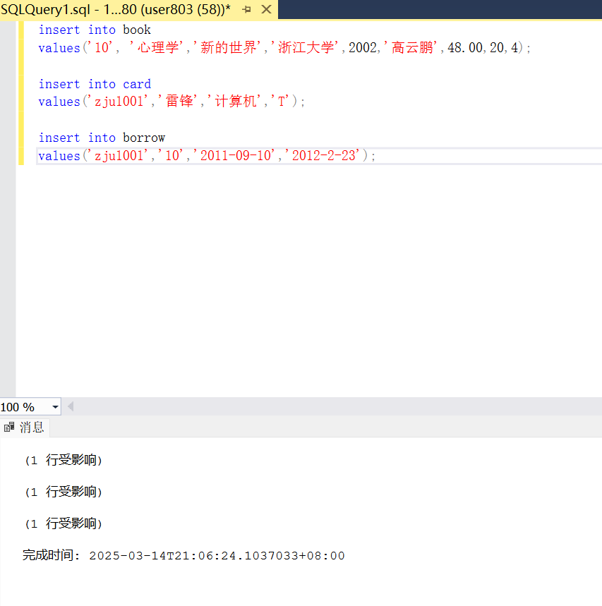
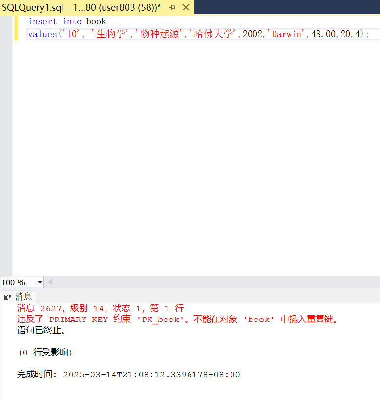
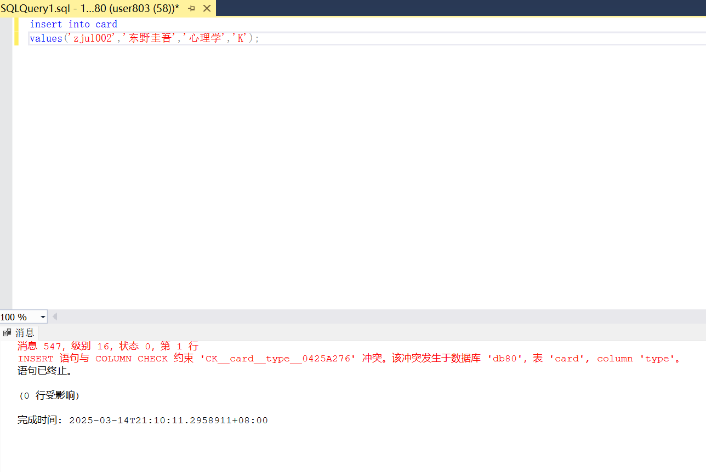
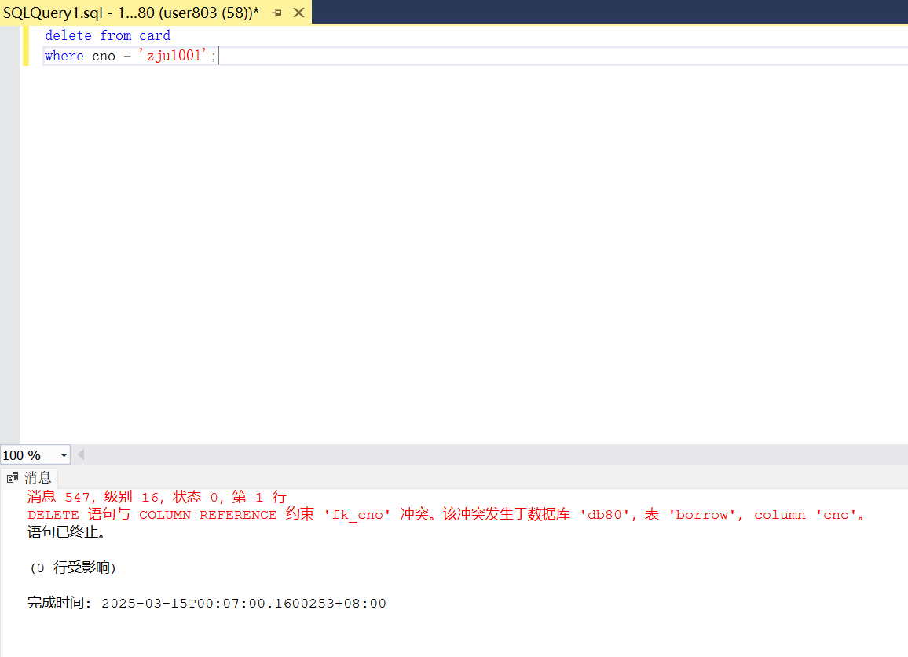
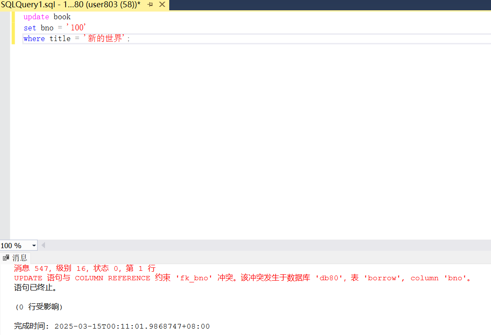
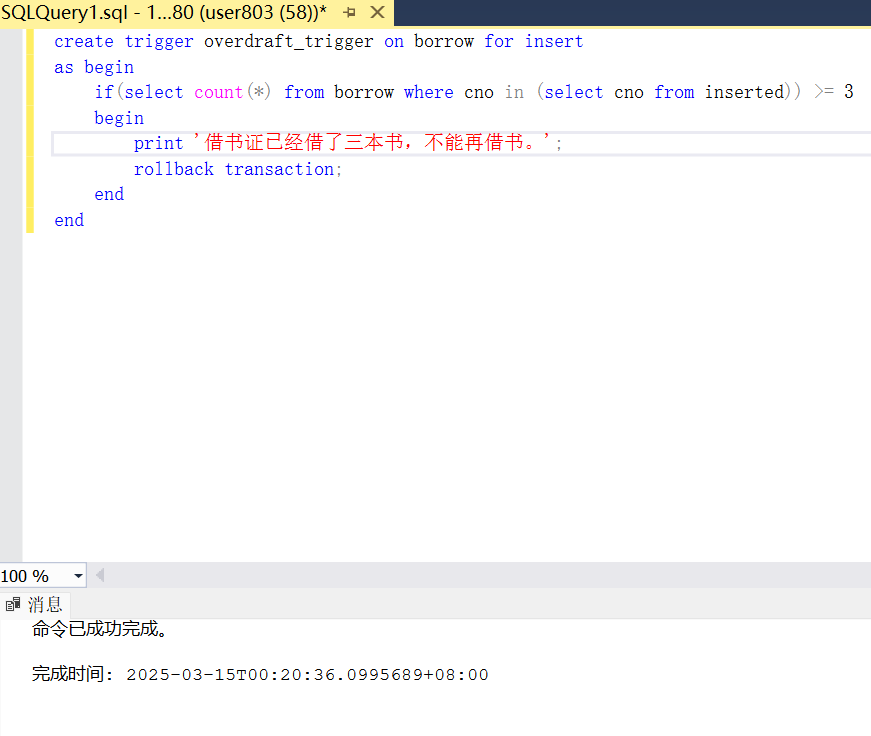

<br/><br/><br/><br/><br/><br/><br/><br/><br/><br/><br/><br/><br/><br/><br/>
<div align=center>
    <font size=20 face=黑体>
数据库系统<br/><br/> Lab3
    </font>
    <font size=5 face=楷体>
<br/><br/>
杨亿酬 3230105697<br/>
2025-3-14
    </font>
</div>

<div STYLE="page-break-after: always;"></div>

### 1.实验目的  

- 熟悉通过SQL进行数据完整性控制的方法。
  
### 2.实验内容
(1)创建book表  
主键bno 已在lab2中完成  
(2)创建card表  
主键cno 已在lab2中完成  
(3)创建borrow表  
外键：bno，cno，分别对应book和card的bno和cno，同时外键 bno 级联删除，cno 级联更新  
```sql
alter table borrow
add constraint fk_bno foreign key(bno) references book(bno)
on delete cascade;

alter table borrow
add constraint fk_cno foreign key(cno) references card(cno)
on update cascade;
```
(4)插入基本数据
Book表('10', '心理学','新的世界','浙江大学',2002,'高云鹏',48.00,20,4);  
Card表('zju1001','雷锋','计算机','T');  
Borrow表('zju1001','10','2011-09-10','2012-2-23');  
```sql
insert into book
values('10', '心理学','新的世界','浙江大学',2002,'高云鹏',48.00,20,4);

insert into card
values('zju1001','雷锋','计算机','T');

insert into borrow
values('zju1001','10','2011-09-10','2012-2-23');
```
  
(5)向book表，再次插入一条记录， 看看数据库的提示，提出可行的修改方案。
('10', '生物学','物种起源','哈佛大学',2002,'Darwin',48.00,20,4)
```sql
insert into book
values('10', '生物学','物种起源','哈佛大学',2002,'Darwin',48.00,20,4);
```
  
主键bno不能重复，修改：将bno修改为不重复的值  
(6)向card表添加一条记录，看看数据库的提示，并提出可行的修改方案。
('zju1002','东野圭吾','心理学','K')
```sql
insert into card
values('zju1002','东野圭吾','心理学','K');
```
  
类型'K'不符合定义的'T','G','U','O'  
修改：将插入值的类型更改为'T','G','U','O'中的一种；或添加'K'类型的定义  
(7)删除card表中的某条记录，观察数据库的提示。
```sql
delete from card
where cno = 'zju1001';
```
  
cno是borrow表的外键，borrow表中存在`cno = 'zju1001'`的值  
因为没有规定外键关联值删除的方式所以不允许删除操作  
(8)更新Book表中'新的世界'bno 为'100'，观察数据库的提示。
```sql
update book
set bno = '100'
where title = '新的世界';
```
  
类似(7),bno是borrow表的外键，borrow表中存在`bno = '100'`的值  
因为没有规定外键关联值更新的方式所以不允许更新操作  
(9)编写触发器
   检查一个借书证不能同时借三本书（简化一点，认为借书记录中有记录即为借了书）。 参考：PPT4.35
```sql
create trigger overdraft_trigger on borrow for insert
as begin
    if(select count(*) from borrow where cno in (select cno from inserted)) >= 3
    begin
        print '借书证已经借了三本书，不能再借书。';
        rollback transaction; 
    end
end
```
  
(10)实验总结及思考  
本次实验测试了一些sql中不合法的操作，如插入未定义的类型，进行未定义的删除、更新，并尝试编写触发器。提高了对sql进阶语句的理解与认识。  
