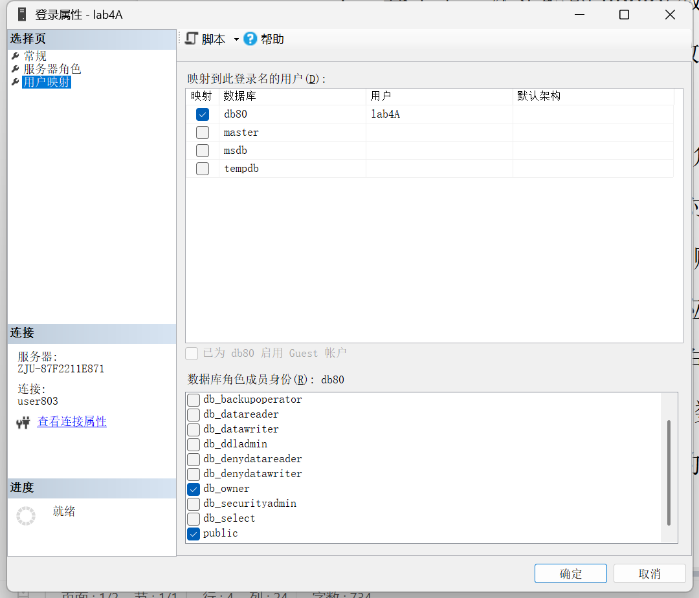
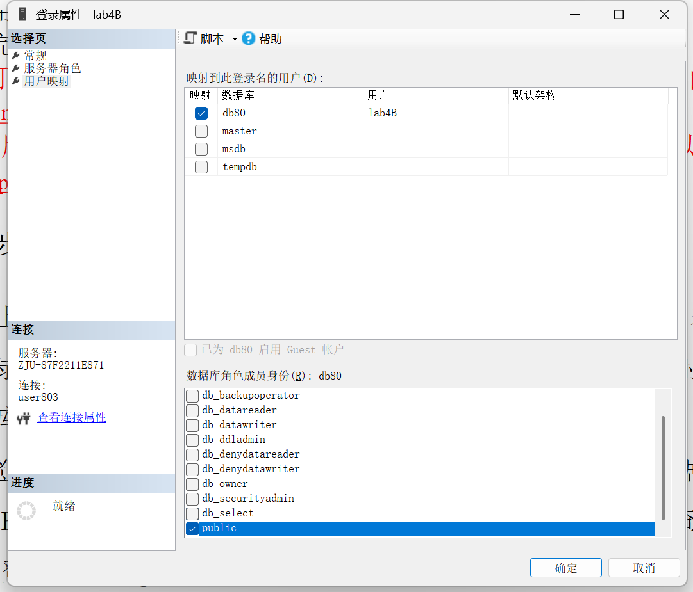
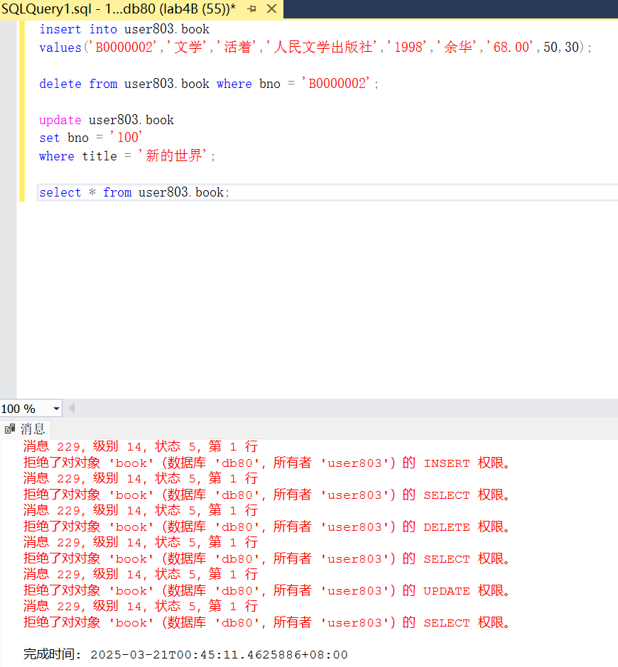
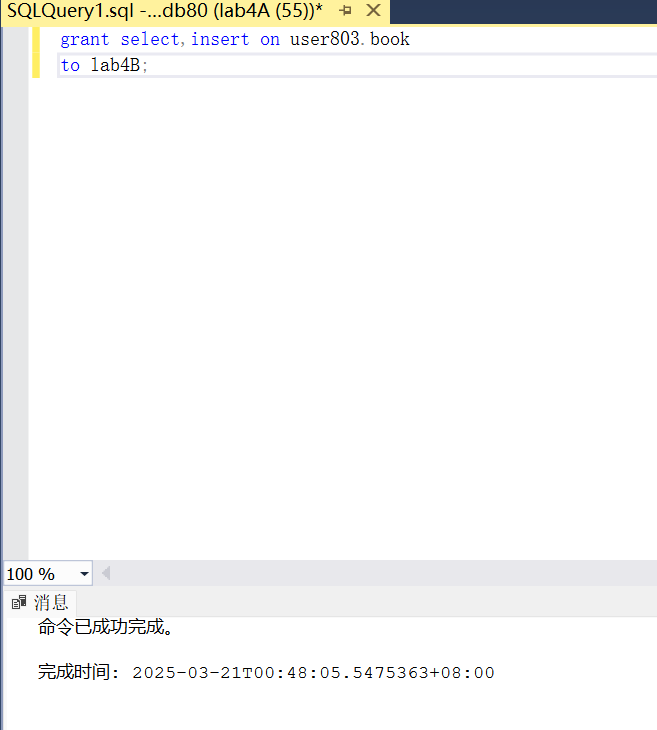
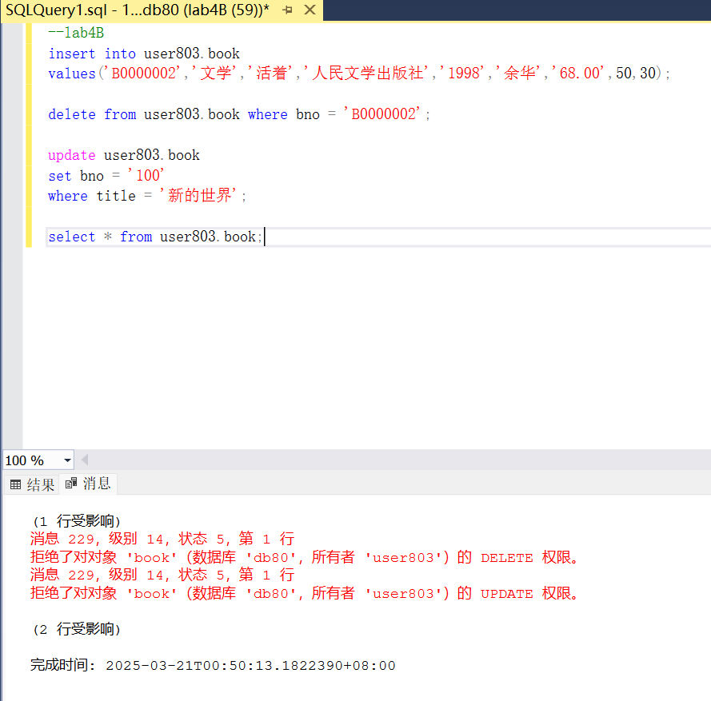
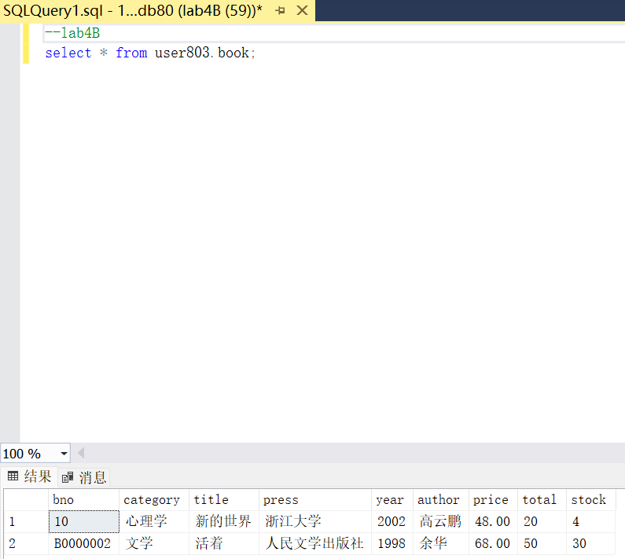
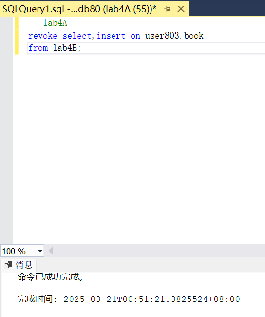
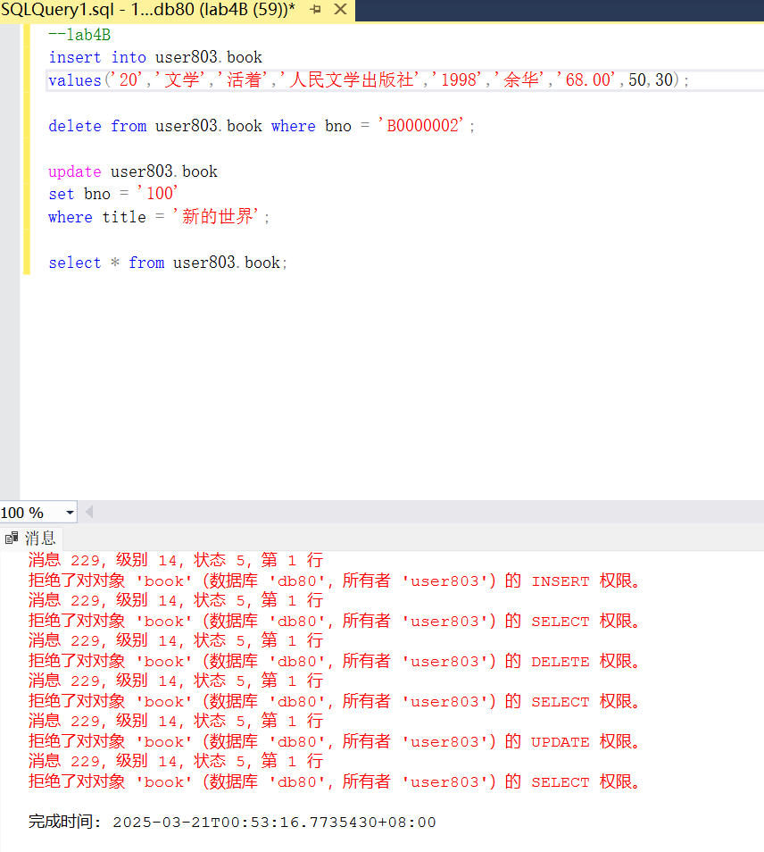
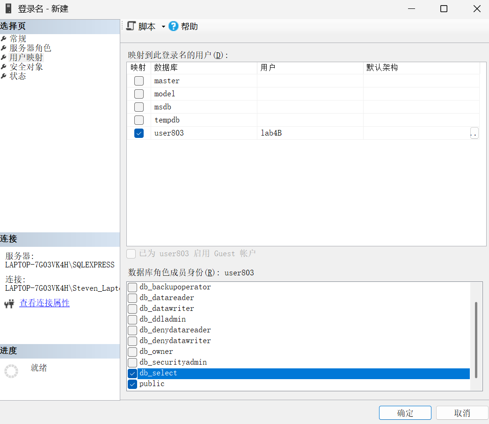
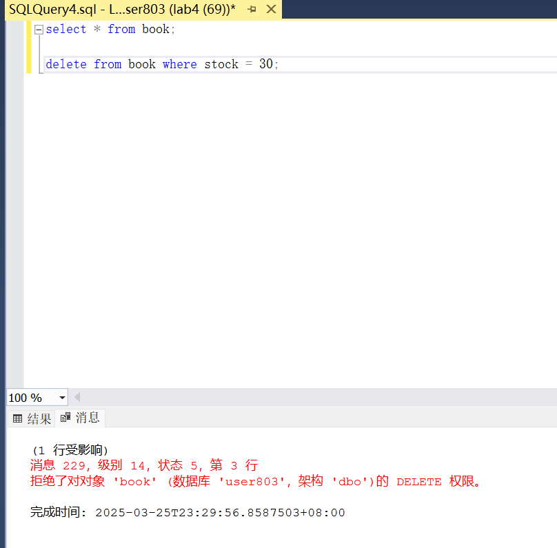

<br/><br/><br/><br/><br/><br/><br/><br/><br/><br/><br/><br/><br/><br/><br/>
<div align=center>
    <font size=20 face=黑体>
数据库系统<br/><br/> Lab4
    </font>
    <font size=5 face=楷体>
<br/><br/>
杨亿酬 3230105697<br/>
2025-3-21
    </font>
</div>

<div STYLE="page-break-after: always;"></div>

### 1.实验目的  

- 熟悉通过SQL进行数据完整性控制的方法。  
- 熟悉数据库中登录，用户，角色的概念和作用  
  
### 2.实验内容  
1.基于上一次实验的library数据库（可以用自己所属的db）和book表,创建一个登录账户A并同时绑定数据库用户A，以public和owner角色映射到library数据库上  
  
2.创建登录账户B，以public角色的数据库用户B映射到library数据库上，以账户B登录，测试B能否对book表进行CRUD（增、删、改、查）操作  
  
退出SSMS并以lab4B账户重新登录(密码lab4B)
```sql
insert into user803.book
values('B0000002','文学','活着','人民文学出版社','1998','余华','68.00',50,30);

delete from user803.book where bno = 'B0000002';

update user803.book
set bno = '100'
where title = '新的世界';

select * from user803.book;
```
  
3.用A登录，利用grant语句赋于B表查询和插入的权限  
```sql
grant select,insert on user803.book
to lab4B;
```
  
4.用B登录测试是否具有相应的权限  
  

5.用A登录，利用revoke语句收回book表的操作权限，再进行测试  
```sql
revoke select,insert on user803.book
from lab4B;
```
  
  
6.用Windows身份认证登录数据库，在library数据库下创建db_select角色，赋予用户B，测试用户B的查询权限  
使用本地sql_server，用windows身份认证登录  
```sql
create database user803;
``` 
```sql
CREATE ROLE db_select;
GRANT SELECT ON book TO db_select;
```
  
  
用户有select权限没有delete权限  
7.实验总结及思考  
Sql Server中可以通过角色映射赋予角色权限，owner可以通过grant,revoke语句为其余用户赋予或收回对表的操作权限。  
数据库的权限管理涉及数据库正常运作与数据安全，是不容忽视的重要环节。