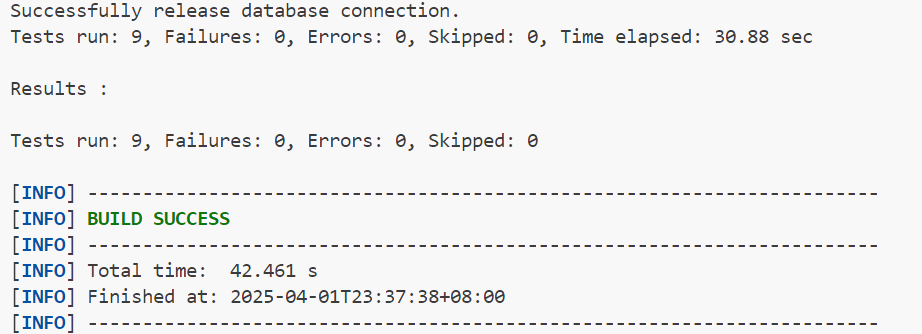
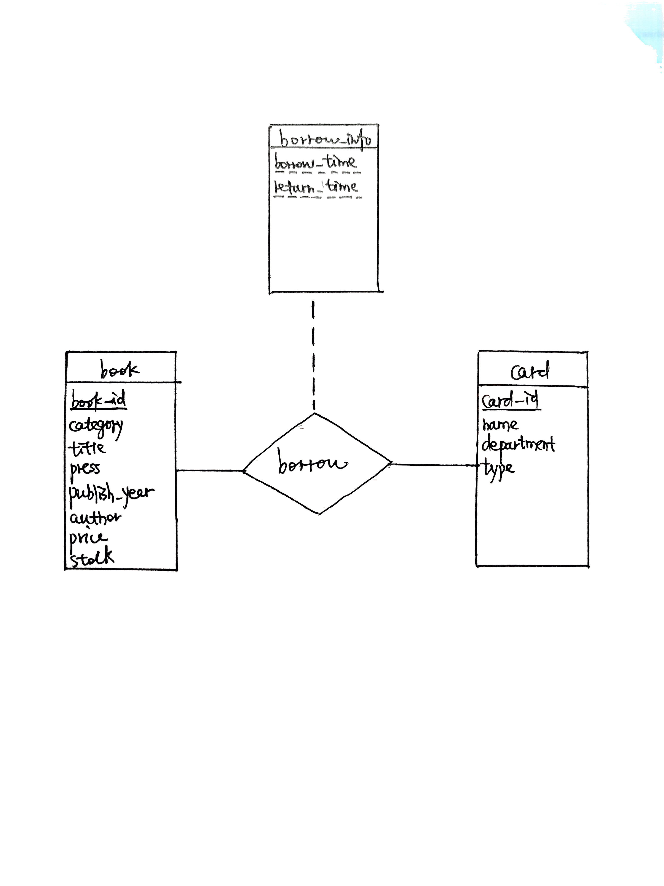

<br/><br/><br/><br/><br/><br/><br/><br/><br/><br/><br/><br/><br/><br/><br/>
<div align=center>
    <font size=20 face=黑体>
数据库系统<br/><br/> Lab5:图书管理系统
    </font>
    <font size=5 face=楷体>
<br/><br/>
杨亿酬 3230105697<br/>
2025-3-30 ~ 2025-4-1
    </font>
</div>

<div STYLE="page-break-after: always;"></div>

### 1.实验目的  
- 设计并实现一个精简的图书管理程序，要求具有图书入库、查询、借书、还书、借书证管理等功能。

### 2.实验需求
- 提供一个基于MySQL(或OpenGauss, SQL Server)的精简图书管理程序，该图书管理程序应具备较好的可扩展性、鲁棒性和安全性，并且在高并发场景下仍能正确运行。  
- 完成类LibraryManagementSystemImpl中各功能模块的函数，并通过所有测试样例。
  
### 3.实验环境  
- mysql  Ver 9.3.0 for Linux on x86_64 (MySQL Community Server - GPL)
- openjdk version "21.0.6" 2025-01-21
  OpenJDK Runtime Environment (build 21.0.6+7-Ubuntu-124.04.1)
  OpenJDK 64-Bit Server VM (build 21.0.6+7-Ubuntu-124.04.1, mixed mode, sharing)
- Apache Maven 3.8.7
- VSCODE Ubuntu 24.04.2 LTS 
Start MySQL by `sudo service mysql start` then `mysql -u root -p`
`mvn -Dtest=LibraryTest clean test` under `/librarymanagementsystem/`

<div STYLE="page-break-after: always;"></div>

### 4.系统各模块的设计思路和实现  
#### jdbc基本编写 
每个事务处理函数大致包括以下部分  
- 建立连接`Connection conn = connector.getConn();`
- 检查输入合法性(视具体函数检查内容不同)  
- 执行操作
- 获取结果更新
- 提交事务
  
检查输入,执行操作,获取结果更新使用sql语句,通过PreparedStatement防止sql注入,且有利于批量操作  
如存在输入不合法等异常应抛出,rollback整条事务并输出提示  

#### storeBook
```text
register a book to database.  
(1) book_id should be stored to book after successfully
    completing this operation.  
(2) you should not register this book if the book already
    exists in the library system.
``` 
1.连接数据库  
2.设置检查书目是否存在的PreparedStatement语句,`String check = "select book_id from book where category = ? and press = ? and author = ? and title = ? and publish_year = ?";`(book类的unique要求:unique (`category`, `press`, `author`, `title`, `publish_year`))  
`checkstmt = conn.prepareStatement(check);`将string转化为sql语句  
通过`checkstmt.set<TypeName>(<Index>,<Content>);`设置查询变量  
`res = checkstmt.executeQuery();`执行查询操作并获取返回结果  
```java
    if(res.next()) {
        throw new SQLException("Book already exists.");
    }
```
查询有结果,说明存在重复书籍,抛出异常,并撤回事务  
3.执行insert操作  
同样先设置PreparedStatement语句,`String insert = "insert into book(category, title, press, publish_year, author, price, stock) values(?, ?, ?, ?, ?, ?, ?)";`,转化为sql语句,设置变量并执行,获取结果  
4.book表要求每个实体有自增的primary key `book_id`,因此需要在执行查询时设置获取返回的自增key,`insertstmt = conn.prepareStatement(insert, Statement.RETURN_GENERATED_KEYS);`  
根据获取结果更新book_id,通过`getGeneratedKeys()`函数为插入的book设置book_id,如果没有获取到book_id抛出异常并rollback  
```java
    //update bookId by using the increment book_id
    //getGeneratedKeys for getting the increment primary key(column 1)
    try (ResultSet generatedKeys = insertstmt.getGeneratedKeys()) {
        if (generatedKeys.next()) {
            book.setBookId(generatedKeys.getInt(1));
        } else {
            throw new SQLException("Failed to get generated book_id.");
        }
    }
```
5.完成全部操作且没有异常,则`commit(conn);`提交事务  

#### incBookStock
```text
increase the book's inventory by bookId & deltaStock.  
(1) you need to check the correctness of book_id  
(2) deltaStock can be negative, but make sure that
    the result of book.stock + deltaStock is not negative!  
```
stock更新语句`update book set stock = stock + ? where book_id = ?`  
stock非负检查`select stock from book where book_id = ?`  
异常处理:  
(1)bookId不存在`if (rowsAffected == 0) throw new SQLException("Book not found.");`  
(2)stock为负`if (stock < 0) throw new SQLException("Stock cannot be negative.");`

#### storeBook(List)
```text
batch store books.
(1) you should not call the interface storeBook()  
    multiple times to achieve this function!!!
    hint: use {@link PreparedStatement#executeBatch()}
    and {@link PreparedStatement#addBatch()}
(2) if one of the books fails to import, all operations  
    should be rolled back using rollback() function provided
    by JDBC!!!  
(3) when binding params to SQL, you are required to avoid  
    the risk of SQL injection attack!!!  
```
bookId存在检查`select book_id from book where category = ? and press = ? and author = ? and title = ? and publish_year = ?`  
insert操作实现`insert into book(category, title, press, publish_year, author, price, stock) values (?, ?, ?, ?, ?, ?, ?);`  
`Batch`的使用:逐本检查加入Batch,全部完成后批量执行  
```java
for(Book book : books) {
    //check bookId exists...
    //insert book...
    insertstmt.addBatch();
}
int[] results = insertstmt.executeBatch();
```
逐个更新bookId  
```java
for (int i = 0; i < books.size(); i++) {
    Book book = books.get(i);//获取book对象
    if (results[i] == PreparedStatement.EXECUTE_FAILED) {
        //检查插入异常
        throw new SQLException("Batch insert failed for book: " + book.getTitle());
    }
    if (generatedKeys.next()) {
        //设置bookId
        book.setBookId(generatedKeys.getInt(1));
    }
}
```

#### removeBook
```text
remove this book from library system.
Note that if someone has not returned this book,the book should not be removed!
```
bookId存在检查`select book_id from book where book_id = ?`  
处于被借状态检查,return_time == 0表示未被归还
```java
String check_borrowed = "select return_time from borrow where book_id = ?";
ResultSet res2 = check_borrowed_stmt.executeQuery();
//book not returned
if (res2.next() && res2.getLong("return_time") == 0) {
    return new ApiResult(false, "Book is borrowed.");
}
```
删除操作`delete from book where book_id = ?`

#### modifyBookInfo
```text
modify a book's information by book_id.
Note that you should not modify its book_id and stock!
```
bookId存在检查,略  
book状态更新`update book set category = ?, title = ?, press = ?, publish_year = ?, author = ?, price = ? where book_id = ?`  
Note:根据测试用例，只需要不修改book_id与stock即可，不需要在book_id和stock不同时直接抛出异常  

#### querybook
```text
query books according to different query conditions.
(1) you should let the DBMS to filter records
    that do not satisfy the conditions instead of
    filter records in your API.
(2) when binding params to SQL, you also need to avoid
    the risk of SQL injection attack.
(3) [*] if all else is equal, sort by book_id in
    ascending order!
query results should be returned by ApiResult.payload and should be an instance of {@link queries.BookQueryResults}
```
查询语句构造`select * from book where 1=1 and ...`  
使用`1=1`配合`and`有效连接，通过`conditions.get...()`获取查询要求，最后利用`order by`与`sort order`调整结果顺序(默认顺序`book_id ASC`，多个顺序可以按序并存)，同样使用preparestatement避免sql注入  
添加变量`if (conditions.get...() != null) stmt.set<Type>(index++, conditions.get...());`  
查询结果构造与输出  
```java
while (res.next()) {//遍历查询结果
    Book book = new Book( //新建book对象存放查询结果
    //获取查询各项结果
        res.getString("category"),
        res.getString("title"),
        res.getString("press"),
        res.getInt("publish_year"),
        res.getString("author"),
        res.getDouble("price"),
        res.getInt("stock")
    );
    //将查询得到的book_id设置为结果的book_id
    book.setBookId(res.getInt("book_id"));
    books.add(book);
}
return new ApiResult(true, "Query succeed.",new BookQueryResults(books));
//返回BookQueryResults的实例
```

#### borrowBook
```text
a user borrows one book with the specific card.
the borrow operation will success iff there are enough books in stock & the user has not borrowed the book or has returned it.
```
库存非零检查`select stock from book where book_id = ? FOR UPDATE`  
card_id存在性检查`select card_id from card where card_id = ?`  
已借未还检查`select * from borrow where card_id = ? and book_id = ? and return_time = 0 FOR UPDATE`  
NOTE:确保一本书可被同一人重复借阅，只要上次借阅已经归还  
借书记录插入操作`insert into borrow(card_id, book_id, borrow_time, return_time) values (?, ?, ?, 0)`(使用borrow_time,return_time而非borrowTime,returnTime)  
借书完成，藏书量stock - 1 `update book set stock = stock - 1 where book_id = ?`  

#### returnBook
```text
A user return one book with specific card.
```
bookId存在检查,`select * from borrow where card_id = ? and book_id = ? and borrow_time = ?`  
NOTE:必须检查borrow_time，避免归还已经归还的书(borrow_time == 0)  
更新return_time`update borrow set return_time = ? where card_id = ? and book_id = ? and borrow_time = ?`  
NOTE:必须检查borrow_time,修改对应borrow_time的return_time，避免错误修改同一人此前相同的书籍借用记录  
还书完成，藏书量stock + 1，类似borrowBook  

#### showBorrowHistory  
```text
list all borrow histories for a specific card.
the returned records should be sorted by borrow_time DESC, book_id ASC
@param cardId show which card's borrow history
@return query results should be returned by ApiResult.payload
        and should be an instance of {@link queries.BorrowHistories}
```
根据BorrowHistories实例的要求，查询语句`select * from borrow join book on borrow.book_id = book.book_id where card_id = ? order by borrow_time DESC, book.book_id ASC` join连接两表，card_id作为查询参数  
查询结果构造与输出（类似querybook）  
`return new ApiResult(true, "Got borrow history",new BorrowHistories(historyItems));`  

#### registerCard
```text
create a new borrow card. do nothing and return failed if
the card already exists.

Note that card_id should be stored to card after successfully
completing this operation.
```
借书证存在检查`select card_id from card where department = ? and type = ? and name = ?`  
执行插入操作`insert into card(department, type, name) values (?, ?, ?)`  
设置自增的card_id  `card.setCardId(generatedKeys.getInt(1))`  

#### removeCard  
```text
simply remove a card.

Note that if there exists any un-returned books under this user,
this card should not be removed.
```
cardId存在性检查，略  
未归还书籍检查`select * from borrow where card_id = ? and return_time = 0`  
删除操作执行`delete from card where card_id = ?`  

#### showCards
```text
list all cards order by card_id.

@return query results should be returned by ApiResult.payload
        and should be an instance of {@link queries.CardList}
```
查询`select * from card order by card_id`  
查询结果构造与输出（类似querybook）  
`return new ApiResult(true, "Got cards record.",new CardList(cards));`返回CardList的实例  

#### parallelBorrowBookTest
要求：多线程同时借书，应有且仅有一个线程借书成功  
```java
conn.setTransactionIsolation(Connection.TRANSACTION_SERIALIZABLE);
conn.setAutoCommit(false);

String check_stock = "select stock from book where book_id = ? FOR UPDATE";
```
`setTransanctionIsolation()`设置事务隔离，`setAutoCommit(false);`关闭自动提交，`FOR UPDATE`语句实现行级锁定，阻止其他事务修改行  

### 5.系统验证测试  
通过全部9个测试输出SUCCESS  
  

### 6.遇到的问题及解决方法  
1.使用自增的book_id,card_id更新表项  
2.batch语句的使用，应`addBatch()`逐一插入再一次性操作  
3.修改书本信息时stock，book_id不正确时是否应该抛出异常  
4.querybook过程中多个排序顺序的问题  
5.borrowTime,returnTime,borrow_time,return_time的区分问题  
6.同一人对同一本书重复借阅的问题（归还后再借，未归还再借）  
7.并发借书的事务隔离与锁定  

### 7.思考题
#### 1.绘制该图书管理系统的E-R图。
  


#### 2.描述SQL注入攻击的原理(并简要举例)。在图书管理系统中，哪些模块可能会遭受SQL注入攻击？如何解决？  
原理：通过在应用程序的输入字段中插入恶意的SQL代码，从而欺骗数据库服务器执行非预期的SQL命令。  
例：某数据库后端登录系统如下  
```sql
SELECT * FROM users WHERE username = '$username' AND password = '$password';
```
用户输入
```sql
admin' --
```
`--`为sql语句的注释，则原登录系统语句如下  
```sql
SELECT * FROM users WHERE username = 'admin' --' AND password = '';
```
密码检查被注释，攻击者无需密码直接以admin身份登录  
图书管理系统中易受sql注入攻击的模块：  
登录模块（如上）  
批量存书：假设数据库批量存书系统后端如下  
```sql
INSERT INTO book (category, title, press, publish_year, author, price, stock) 
VALUES ('科技', '数据库原理', '清华出版社', 2020, '王强', 45.00, 10),
       ('文学', '红楼梦', '人民文学出版社', 2010, '曹雪芹', 59.80, 5),
       -- 更多图书数据...
```
攻击者提供的输入包含
```sql
('科技', '正常图书', '正常出版社', 2022, '正常作者', 30.00, 5),
('恶意', '恶意图书', '恶意出版社', 2022, '恶意作者', 0.00, 0); DROP TABLE book; --', '', 0, '', 0, 0)
```
导致book表被删除  
查询：假设数据库批量查询系统后端如下  
```sql
SELECT * FROM book WHERE book_id IN ('$column_number');
```
攻击者提交
```sql
1, 2, 3) OR 1=1 --
SELECT * FROM book WHERE book_id IN (1, 2, 3) OR 1=1 --)
```
返还全部图书信息  
解决方案：
1.使用参数化查询(PreparedStatement):严格控制用户输入的类型  
```sql
String sql = "SELECT * FROM book WHERE title = ?";
PreparedStatement stmt = connection.prepareStatement(sql);
stmt.setString(1, userInput);
```
2.输入验证：对用户输入进行白名单验证，限制输入长度和字符类型  
3.最小权限：严格控制用户权限，给予用户最小的登录权限  
4.使用防火墙，ORM框架等实现防注入  

#### 3. 在InnoDB的默认隔离级别(RR, Repeated Read)下，当出现并发访问时，如何保证借书结果的正确性？下面是一个在该场景下可能会出现非预期结果的例子：
**a. A启动事务，通过JDBC查询到余量1，代码逻辑判定借书成功，修改库存；**
**b. B启动事务，在A尚未提交事务时，通过JDBC同样查询到余量为1，此时代码逻辑同样判定借书成功，修改库存；**
**c. A、B分别提交事务，最后结果显示余量为-1，不符合预期。**
【提示】
● 了解InnoDB默认隔离级别(RR, Repeated Read)实现的原理，以及快照读和当前读的区别，能够帮助你解决这个问题。
● 在实际应用（例如电商系统）中，“秒杀”、“团购”是频繁出现的一些活动。“秒杀”活动通常伴随着高并发、访问量激增等特点。当并发请求数过多时，“秒杀”系统又是如何防止库存超卖的呢？可以作为课外拓展去了解一下。
● 测试用例LibraryTest::parallelBorrowBookTest()将会测试在该场景下你的程序是否能够执行得到预期的结果。  

[Answer]
**InnoDB默认隔离级别(RR, Repeated Read)实现原理**  
InnoDB通过多版本并发控制(MVCC)和间隙锁(Gap Lock)的组合来实现RR隔离级别  
- 事务首次读取时创建ReadView，这个ReadView会在整个事务期间持续使用
- 通过比较数据行的DB_TRX_ID(最近修改该行的事务ID)与ReadView来判断可见性：
    trx_id:生成ReadView时活跃的事务ID列表  
    如果DB_TRX_ID < min_trx_id：可见（事务已提交）
    如果DB_TRX_ID >= max_trx_id：不可见（事务在ReadView创建后开始）
    如果min_trx_id <= DB_TRX_ID < max_trx_id：
        在m_ids中：不可见（事务未提交）
        不在m_ids中：可见（事务已提交）
- 通过undo log链访问历史版本数据
间隙锁:锁定索引记录之间的间隙防止幻读  

**快照读与当前读**  
- 快照读：事务首次读操作会建立快照(ReadView)，后续读操作都基于这个快照，保证可重复读（通过ReadView和undo log实现，高并发，无阻塞）  
- 当前读：读取记录的最新提交版本（需要加锁，可能因为等待导致阻塞）  

**"秒杀"系统**  
- Redis 预减库存 + 异步队列  
  秒杀前将库存加载到 Redis。
  用户请求时，先通过 Redis 的原子操作（如 DECR）预减库存。
  成功预减后，将订单请求发送至 Kafka/RabbitMQ 异步处理  
- 分布式锁：确保分布式环境下同一时间只有一个请求能扣减库存  
- 秒杀令牌机制：控制参与秒杀的用户数  
  秒杀开始前，生成固定数量的令牌存入 Redis。
  用户需先获取令牌才能下单，无令牌则直接拒绝
- ...
  
**`parallelBorrowBook`并发访问的正确性保证**  
`setTransanctionIsolation()`设置事务隔离，`setAutoCommit(false);`关闭自动提交，`FOR UPDATE`语句实现行级锁定，阻止其他事务修改行  
