 

# 
DataBase System

  

# 
MiniSQL 总体设计报告

    

    
        姓名：<u>&emsp;&emsp;杨亿酬 刘奕嘉 钟剑&emsp;&emsp;</u>   
    

## 实验目的

- 设计并实现一个精简型单用户SQL引擎MiniSQL，允许用户通过字符界面输入SQL语句实现基本的增删改查操作，并能够通过索引来优化性能。
- 通过对MiniSQL的设计与实现，提高系统编程能力，加深对数据库管理系统底层设计的理解。

## Overview
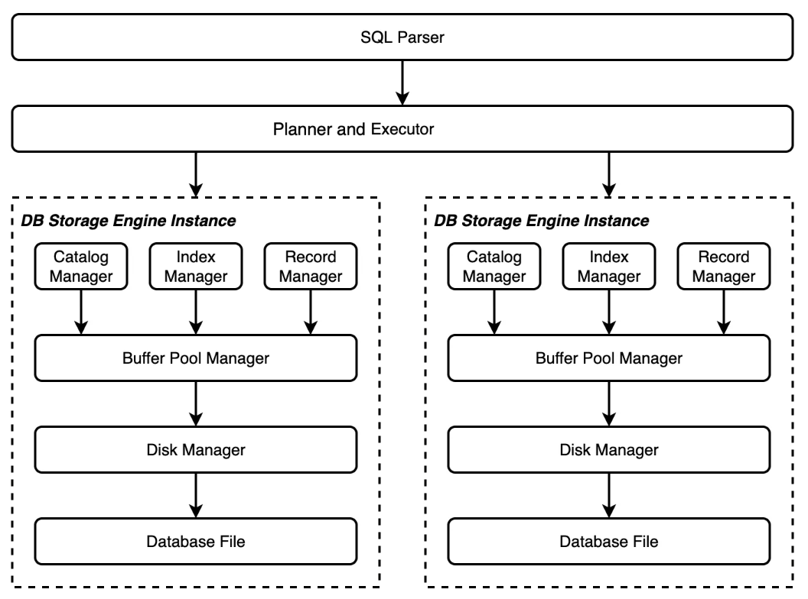
MiniSQL采用经典的三层数据库架构设计，包含：

1.SQL接口层：负责用户交互和SQL解析
2.查询处理层：执行查询优化和计划生成
3.存储引擎层：管理数据存储和事务处理

1.SQL解析
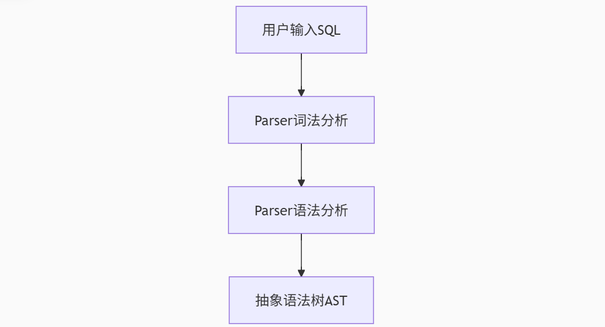  
2.核心部件协作
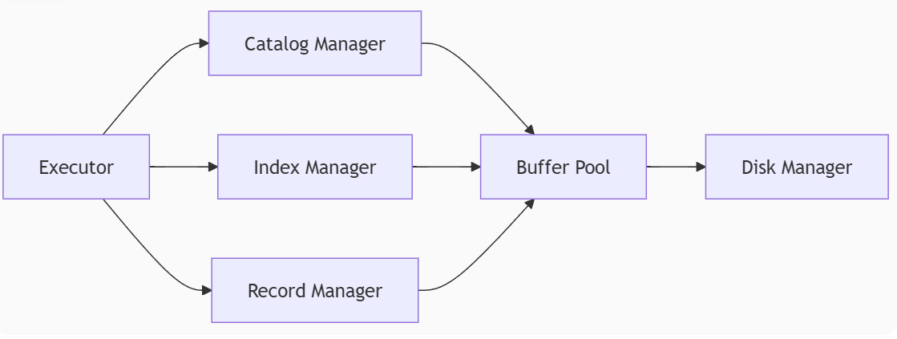  
查询执行流程包括：
解析SQL生成语法树
验证语义并生成执行计划
通过Catalog获取表信息
通过Index定位数据
Record Manager读取记录
结果集组装返回
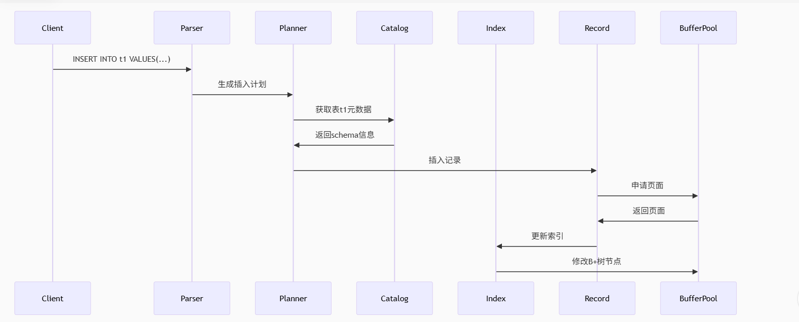

Recovery Manager与Lock Manager是两个独立的模块，实现了异常恢复与锁管理的基本功能，为数据库的进一步管理与优化提供了基础

## Disk and Buffer Pool Manager  
### 架构设计
DiskManager：负责磁盘文件管理和页分配回收
BitmapPage：使用位图管理数据页分配状态
BufferPoolManager：管理内存中的页缓存
LRUReplacer：实现LRU页面替换算法

采用位图机制管理空闲页
实现逻辑页号到物理页号的映射
支持脏页回写和页固定机制
使用LRU策略进行页面替换
## Record Manager
Record Manager负责管理数据表中所有的记录，它能够支持记录的插入、删除与查找操作，并对外提供相应的接口
### 核心组件
Column：表列的元数据
Row：表中的记录行
Schema：表结构定义
Field：行中的字段值
TableHeap：管理表的数据页
TableIterator：表记录迭代器

## Index Manager
Index Manager 负责数据表索引的实现和管理，包括：索引的创建和删除，索引键的等值查找，索引键的范围查找（返回对应的迭代器），以及插入和删除键值等操作，并对外提供相应的接口。
### B+树实现
节点设计：
- 内部节点：存储键和子节点指针
- 叶子节点：存储键和记录位置

关键操作：
- 查找、插入、删除
- 节点分裂与合并
- 键重分配
  
### 索引管理
支持unique索引
实现叶节点链表便于范围查询
与记录管理器协同工作

## Catalog Manager
Catalog Manager 负责管理和维护数据库的所有模式信息，包括：
- 数据库中所有表的定义信息，包括表的名称、表中字段（列）数、主键、定义在该表上的索引。
- 表中每个字段的定义信息，包括字段类型、是否唯一等。
- 数据库中所有索引的定义，包括所属表、索引建立在那个字段上等。
### 实现要点
元数据序列化与持久化
表与索引的创建/删除
模式信息缓存
## Planner and Executor 
### 执行流程
解析SQL生成语法树
验证语义并生成执行计划
执行计划并返回结果

### 关键特性
支持基本DML操作
实现条件过滤
提供事务支持接口
## Recovery Manager
Recovery Manager 负责管理和维护数据恢复的过程，包括：
- 日志结构的定义
- 检查点CheckPoint的定义
- 执行Redo、Undo等操作，处理插入、删除、更新，事务的开始、提交、回滚等日志，将数据库恢复到宕机之前的状态

### 关键算法
从CheckPoint开始Redo
对未提交事务执行Undo
保证故障恢复一致性
## Lock Manager
### 并发控制
实现行级锁
支持共享锁和排他锁
锁升级机制

### 死锁处理
等待图检测环
选择牺牲事务中止
两阶段锁协议

## 系统验证测试  
- 运行`minisql_test`进行模拟整体运行后：
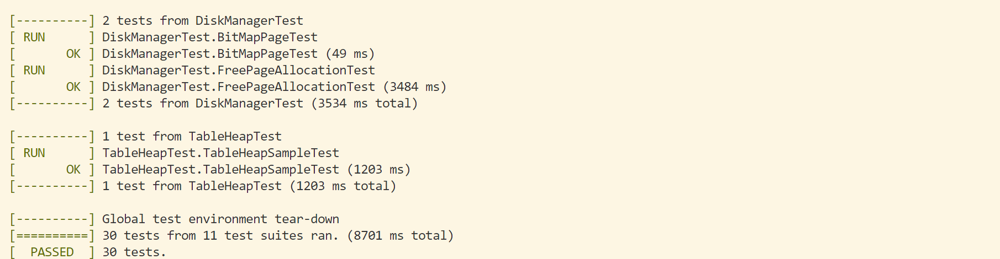

 

- 进行`main`函数整体运行；

  - 完成数据库与表格建立：
  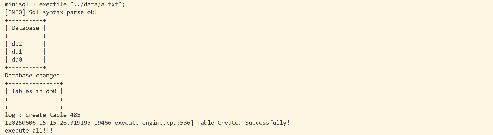
  - 数据插入：
  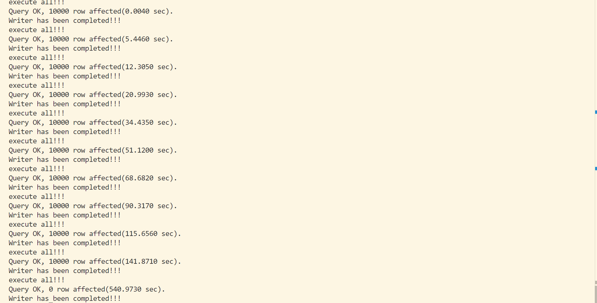 
  - 100000条数据查询：
  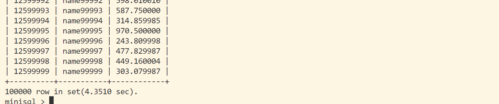
  - 主键查询与非主键查询：
  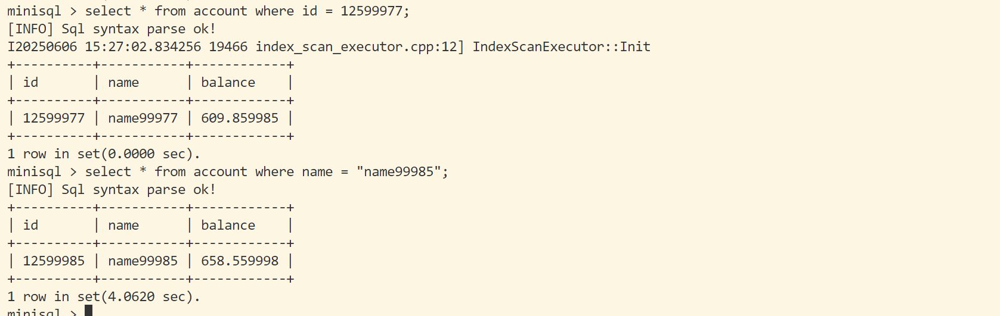
  - 多条件查询`select * from account where id < 12515000 and name > "name14500"`：
  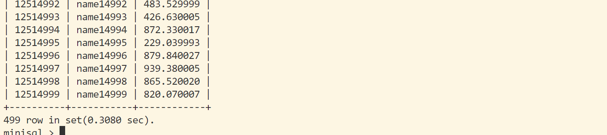
  - 唯一性约束：
  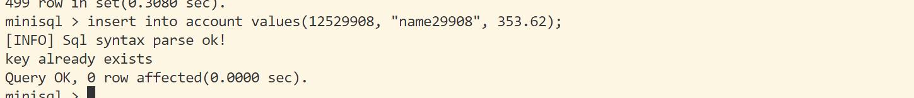
  - 索引建立与查询：
  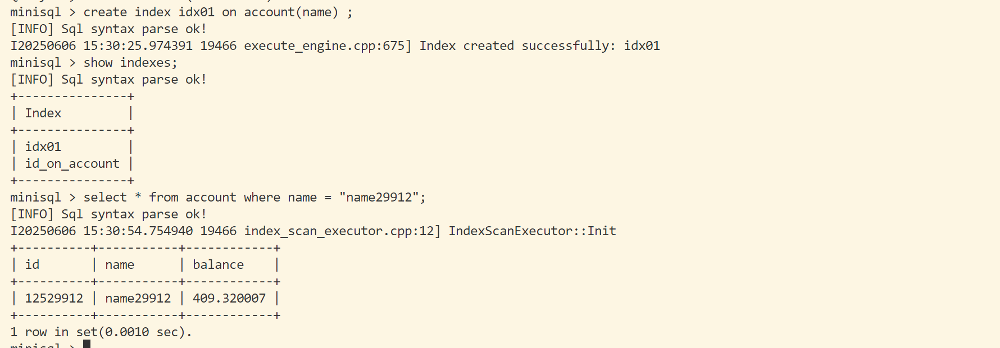
  - 数据更新：
  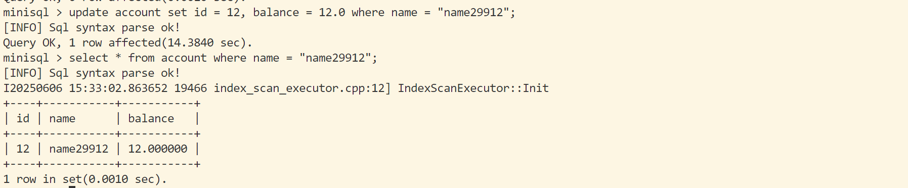
  - 数据删除：
  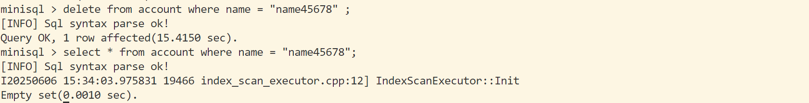
  - 删除索引：
  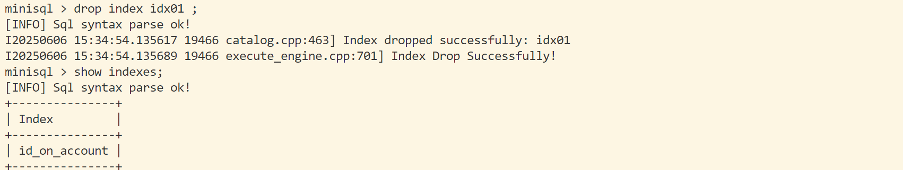
  - 表格内容整体删除：
  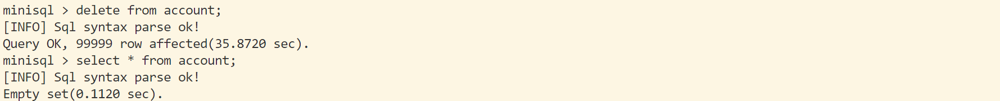
  - 删除表格：
  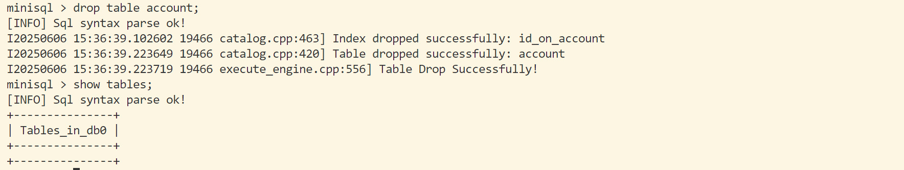
  - 删除数据库：
  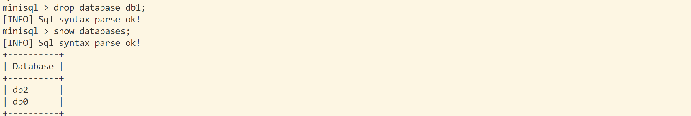
  - 退出后重新进入：
  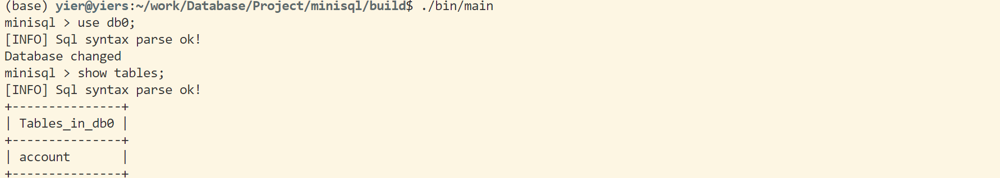
  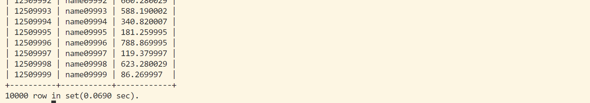
  