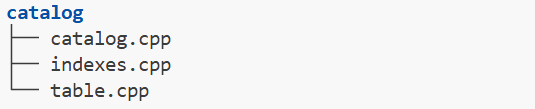
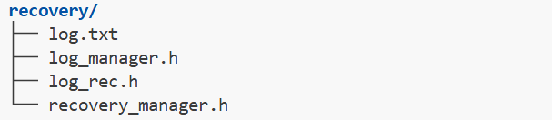
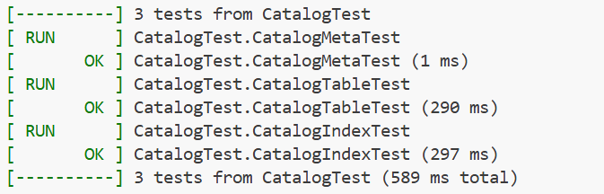
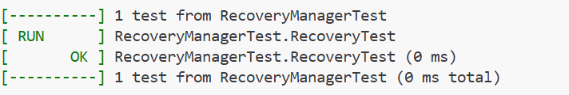

<br/>

<font face="Times">

<div align=center>

</div>

# <font size= 20><center>DataBase System</center></font>

<br/><br/>

# <font size= 20><center><font face="Times">MiniSQL 个人设计报告</font></center></font>

<br/><br/><br/><br/>

<div align=center>
    <font face="楷体" size="5">
        姓名：<u>&emsp;&emsp;杨&emsp;亿&emsp;酬&emsp;&emsp;</u><br/><br/><br/>
    </font>
</div>

<div STYLE="page-break-after: always;"></div>

## 一、 实验背景与目的


- 基于给定框架基础设计并实现一个精简型单用户SQL引擎MinSQL
- 在本次项目中，实现SQL引擎支持用户通过字符界面输入SQL语句实现简单的增、删、改、查操作
- 同时可以通过索引来进行查询的性能优化
- 在本次实验中， 设计并完成Index 与部分 Executor

</br></br>

## 二、 设计完成内容


- 在本次实验中，设计完成了：
  - `CATALOG`相关文件：
  
  - `RECOVERY MANAGER`相关文件：
  
  - 并参与工程过程中的测试与bug修复  

</br></br>

## 三、 具体模块设计

### `Catalog Manager`相关模块设计

</br>

#### 1、 **整体架构**
Catalog Manager 负责管理和维护数据库的所有模式信息，包括：  
● 数据库中所有表的定义信息，包括表的名称、表中字段（列）数、主键、定义在该表上的索引。  
● 表中每个字段的定义信息，包括字段类型、是否唯一等。  
● 数据库中所有索引的定义，包括所属表、索引建立在那个字段上等。  
这些模式信息在被创建、修改和删除后还应被持久化到数据库文件中。此外，Catalog Manager还需要为上层的执行器Executor提供公共接口以供执行器获取目录信息并生成执行计划。  

<div STYLE="page-break-after: always;"></div>

#### 2、 系统各模块的设计思路和实现  
##### IndexInfo::Init
1.初始化meta_data_  
2.初始化key_schema_(使用浅拷贝)  
3.CreateIndex创建索引  
##### GetSerializedSize()
依据SerializeTo,DeserializeFrom的实现，计算序列化大小(CatalogMeta,TableMetadata,IndexMetadata)  
以CatalogMeta为例  
```cpp
void CatalogMeta::SerializeTo(char *buf) const {
  MACH_WRITE_UINT32(buf, CATALOG_METADATA_MAGIC_NUM);
  buf += 4;
  MACH_WRITE_UINT32(buf, table_meta_pages_.size());
  buf += 4;
  MACH_WRITE_UINT32(buf, index_meta_pages_.size());
  buf += 4;
  for (auto iter : table_meta_pages_) {
    MACH_WRITE_TO(table_id_t, buf, iter.first);
    buf += 4;
    MACH_WRITE_TO(page_id_t, buf, iter.second);
    buf += 4;
  }
  for (auto iter : index_meta_pages_) {
    MACH_WRITE_TO(index_id_t, buf, iter.first);
    buf += 4;
    MACH_WRITE_TO(page_id_t, buf, iter.second);
    buf += 4;
  }
}
```
由上可见CatalogMeta中的数据包含:
4 bytes magic num + 4 bytes table_page num + 4 bytes index_page num  
+ table_page nums * (4 bytes table id + 4 bytes page id)  
+ index_page nums * (4 bytes index id + 4 bytes page id)  
```cpp
uint32_t CatalogMeta::GetSerializedSize() const {
  return 4 + 4 + 4 
  + table_meta_pages_.size() * (4 + 4) 
  + index_meta_pages_.size() * (4 + 4);
}
```

<div STYLE="page-break-after: always;"></div>

##### Catalog.cpp
###### CatalogManager Ctor
1.获取catalog_meta_page  
2.根据init新建或读取metadata  
    init == true  
    1)NewInstance()新建metadata  
    2)获取catalog_meta_page的Data并序列化  
    init == false  
    1)获取catalog_meta_page的Data并反序列化  
    2)GetTable/IndexMetaPages读取table与index metadata  
3.set next page id  
4.unpin fetched page  

###### CreateTable
1.create table_heap using DEEPCOPY SCHEMA  
2.create table metadata  
3.serialize to meta page  
4.update catalog meta  
5.create tableinfo  
6.update table_names,tables_ in catalog  
7.create index for unique attributes(primary key)  

###### CreateIndex
1.create index metadata  
2.serialize to meta page  
3.update catalog meta  
4.create indexinfo  
5.update index_names_,indexes_  
6.build up the tree(通过table_heap向bptree逐行插入，调用InsertEntry)  

###### GetTable(s)/GetIndex/GetTableIndexes
利用table_name遍历tables_,(批量)返回table_info  
利用table_name遍历index_names_,返回index_id,再利用index_name遍历indexes_返回index_info  
利用table_name遍历index_names_,批量返回index_id,利用index_id遍历indexes_批量返回index_info

###### DropTable/DropIndex
1.delete metadata page  
2.delete table_heap  
3.update catalog meta  
4.erase table_names,tables_/index_names_,indexes_  

###### FlushCatalogMetaPage  
1.get catalogmetapage  
2.serialize catalog_meta_  
3.unpin page(set dirty)  

###### LoadTable/LoadIndex  
1.get table/index metadata page  
2.deserialize table/index metadata
3.create table_heap/get table info  
4.create table_info/index_info  
5.update tables_,table_names_/index_names_,indexes_  
6.unpin page(set not dirty)  

<div STYLE="page-break-after: always;"></div>

## `Recovery Manager`相关模块设计
#### 1、 **整体架构**
Recovery Manager 负责管理和维护数据恢复的过程，包括：  
● 日志结构的定义  
● 检查点CheckPoint的定义  
● 执行Redo、Undo等操作，处理插入、删除、更新，事务的开始、提交、回滚等日志，将数据库恢复到宕机之前的状态  
出于实现复杂度的考虑，同时为了避免各模块耦合太强，前面模块的问题导致后面模块完全无法完成，同组成员的工作之间影响过深，我们将Recovery Manager模块单独拆了出来。另外为了减少重复的内容，我们不重复实现日志的序列化和反序列化操作，实现一个纯内存的数据恢复模块即可。  

#### 2、 系统各模块的设计思路和实现  
```cpp
    std::map<lsn_t, LogRecPtr> log_recs_{}; //日志信息
    lsn_t persist_lsn_{INVALID_LSN};        //已持久化的日志序号
    ATT active_txns_{};                     //活跃事务编号
    KvDatabase data_{};                     //数据

struct CheckPoint { //CheckPoint检查点结构
    lsn_t checkpoint_lsn_{INVALID_LSN};       //checkpoint所在日志序号
    ATT active_txns_{}; // txn_id -> last_lsn //checkpoint时活跃事务即其last_lsn_
    KvDatabase persist_data_{};               //checkpoint时数据库数据
};
```
按照recovery_manager_test.cpp的内容，应实现如下的事务恢复  
```text
0. <T0 Start>
1. <T0,A,2000,2050>
2. <T0,B,1000,->
3. <T1 Start>          
3. <CheckPoint{T0,T1}> Redo
4. <T1,C,-,600>        |   
5. <T1 Commit>         |   
6. <T0,C,600,700>      |   
                       |   
7. <T0 Abort>          |   Undo(A=2000,B=1000,C=600,D=-)
8. <T2 Start>          |   ↑
9. <T2,D,-,30000>      |   |
10.<T2,C,600,800>      ↓   |
                   Undo list{T2}(A=2000,B=1000,C=800,D=30000)
11.<T2,C,800,600>
12.<T2,D,->
13.<T2 Abort>
```
1.从checkpoint开始redo直至最新的事务，记录未完成的事务到undo list  
2.按照undo list最未完成事务的日志做补偿操作，并将补偿操作添加到日志中  

##### RedoPhase
Redo从checkpoint记录的已持久化的日志persist_lsn_开始到日志末尾的内容  
根据操作的类型对data_做增删改操作  
对Begin操作，在活跃事务中添加事务编号(undo list)  
对Commit操作，从活跃事务中移除事务编号  
对Abort操作，从当前操作起，通过prev_lsn与prev_log获得Abort事务的过去操作，对增删改做回滚直至Begin    
最后将persist_lsn_设置为日志末尾的lsn  
```cpp
    void RedoPhase() {
        for(std::map<lsn_t, LogRecPtr>::iterator it = log_recs_.upper_bound(persist_lsn_); it != log_recs_.end(); ++it)
        {
            LogRecPtr log = it->second;
            switch (log->type_) {
                case LogRecType::kInsert:
                    data_[log->kv_data.key] = log->kv_data.val; 
                    break;
                case LogRecType::kDelete:
                    data_.erase(log->kv_data.key);
                    break;
                case LogRecType::kUpdate:
                    data_[log->update_data.new_key] = log->update_data.new_val;
                    break;
                case LogRecType::kBegin:
                    active_txns_[log->txn_id_] = log->lsn_;
                    break;
                case LogRecType::kCommit:
                    active_txns_.erase(log->txn_id_);
                    break;
                case LogRecType::kAbort:{
                    lsn_t prev_lsn = log->prev_lsn_;
                    LogRecPtr prev_log = log_recs_[prev_lsn]; 
                    while (prev_log->type_ != LogRecType::kBegin) {
                        if (prev_log->type_ == LogRecType::kInsert) 
                            data_.erase(prev_log->kv_data.key); 
                        else if (prev_log->type_ == LogRecType::kDelete) 
                            data_[prev_log->kv_data.key] = prev_log->kv_data.val;
                        else if (prev_log->type_ == LogRecType::kUpdate) 
                            data_[prev_log->update_data.old_key] = prev_log->update_data.old_val;
                        prev_lsn = prev_log->prev_lsn_;
                        prev_log = log_recs_[prev_lsn]; 
                      }
                    active_txns_.erase(log->txn_id_); 
                    break;
                    }
            }
            persist_lsn_ = log->lsn_;
        }
    }
```

<div STYLE="page-break-after: always;"></div>

##### UndoPhase
根据RedoPhase获得的Undo list(active_txns_),对未提交事务的增删改操作做补偿操作,对Begin操作做Abort,并通过AppendLogRec添加记录  
```cpp
    void UndoPhase() {
        for(lsn_t undo_lsn_ = persist_lsn_; !active_txns_.empty(); undo_lsn_--)
        {
            LogRecPtr log = log_recs_[undo_lsn_];
            if(active_txns_.find(log->txn_id_) != active_txns_.end())
            {
                switch(log->type_) {
                    case LogRecType::kInsert:
                        data_.erase(log->kv_data.key);
                        AppendLogRec(CreateDeleteLog(log->txn_id_, log->kv_data.key, log->kv_data.val));
                        break;
                    case LogRecType::kDelete:
                        data_[log->kv_data.key] = log->kv_data.val;
                        AppendLogRec(CreateInsertLog(log->txn_id_, log->kv_data.key, log->kv_data.val));
                        break;
                    case LogRecType::kUpdate:
                        data_[log->update_data.old_key] = log->update_data.old_val; 
                        AppendLogRec(CreateUpdateLog(
                            log->txn_id_,
                            log->update_data.new_key, 
                            log->update_data.new_val,
                            log->update_data.old_key,
                            log->update_data.old_val
                        ));
                        break;
                    case LogRecType::kBegin:
                        AppendLogRec(CreateAbortLog(log->txn_id_));
                        active_txns_.erase(log->txn_id_); 
                        break;
                    case LogRecType::kCommit:
                        break;
                    case LogRecType::kAbort:
                        break;
                    case LogRecType::kInvalid:
                        break;
                    default:
                        break;
                }
            }
        }
    }
```

<div STYLE="page-break-after: always;"></div>

#### 3、 思考题
**本模块中，为了简化实验难度，我们将Recovery Manager模块独立出来。如果不独立出来，真正做到数据库在任何时候断电都能恢复，同时支持事务的回滚，Recovery Manager应该怎样设计呢？此外，CheckPoint机制应该怎样设计呢？**  

1.checkpoint机制：添加serialize与deserialize,便于LogManager写入CheckPoint信息  
```cpp
struct CheckPoint {
    lsn_t checkpoint_lsn_{INVALID_LSN};
    ATT active_txns_{}; // txn_id -> last_lsn
    KvDatabase persist_data_{};

    void SerializeTo(char *buf) const {
        // checkpoint_lsn_
        MACH_WRITE_TO(lsn_t, buf, checkpoint_lsn_);
        buf += sizeof(lsn_t);
        
        // active_txns_的大小
        uint32_t active_txns_size = static_cast<uint32_t>(active_txns_.size());
        MACH_WRITE_UINT32(buf, active_txns_size);
        buf += 4;
        
        // active_txns_条目
        for (const auto& [txn_id, last_lsn] : active_txns_) {
            MACH_WRITE_TO(txn_id_t, buf, txn_id);
            buf += sizeof(txn_id_t);
            MACH_WRITE_TO(lsn_t, buf, last_lsn);
            buf += sizeof(lsn_t);
        }
        
        // persist_data_的大小
        uint32_t data_size = static_cast<uint32_t>(persist_data_.size());
        MACH_WRITE_UINT32(buf, data_size);
        buf += 4;
        
        // persist_data_条目
        for (const auto& [key, val] : persist_data_) {
            key.SerializeTo(buf);
            buf += key.GetSerializedSize();
            val.SerializeTo(buf);
            buf += val.GetSerializedSize();
        }
    }

    static CheckPoint DeserializeFrom(char *buf) {
        CheckPoint checkpoint;
        
        // 读取checkpoint_lsn_
        checkpoint.checkpoint_lsn_ = MACH_READ_FROM(lsn_t, buf);
        buf += sizeof(lsn_t);
        
        // 读取active_txns_的大小
        uint32_t active_txns_size = MACH_READ_UINT32(buf);
        buf += 4;
        
        // 读取active_txns_条目
        for (uint32_t i = 0; i < active_txns_size; ++i) {
            txn_id_t txn_id = MACH_READ_FROM(txn_id_t, buf);
            buf += sizeof(txn_id_t);
            lsn_t last_lsn = MACH_READ_FROM(lsn_t, buf);
            buf += sizeof(lsn_t);
            checkpoint.active_txns_[txn_id] = last_lsn;
        }
        
        // 读取persist_data_的大小
        uint32_t data_size = MACH_READ_UINT32(buf);
        buf += 4;
        
        // 读取persist_data_条目
        for (uint32_t i = 0; i < data_size; ++i) {
            KeyType key = KeyType::DeserializeFrom(buf);
            buf += key.GetSerializedSize();
            ValType val = ValType::DeserializeFrom(buf);
            buf += val.GetSerializedSize();
            checkpoint.persist_data_.emplace(std::move(key), std::move(val));
        }
        return checkpoint;
    }

    size_t GetSerializedSize() const {
        size_t size = sizeof(lsn_t) + 4;
        
        // 活跃事务条目大小
        size += active_txns_.size() * (sizeof(txn_id_t) + sizeof(lsn_t));
        
        // 持久化数据大小
        size += 4; // data_size
        for (const auto& [key, val] : persist_data_) {
            size += key.GetSerializedSize() + val.GetSerializedSize();
        }
        return size;
    }
};

// 在RecoveryManager中补充CreateNewCheckpoint()函数
lsn_t CreateNewCheckpoint() {
    // 获取当前最新的LSN
    lsn_t current_lsn = log_manager_->GetNextLSN();
    
    // 创建新的Checkpoint
    CheckPoint checkpoint;
    checkpoint.checkpoint_lsn_ = current_lsn;
    
    // 获取所有活跃事务及其最后LSN
    auto active_txns = txn_manager_->GetActiveTransactions();
    for (auto txn : active_txns) {
        checkpoint.AddActiveTxn(txn->GetTransactionId(), txn->GetLastLSN());
    }
    
    // 获取需要持久化的数据
    
    // 序列化并写入磁盘
    size_t serialized_size = checkpoint.GetSerializedSize();
    char *buf = new char[serialized_size];
    checkpoint.SerializeTo(buf);
    disk_manager_->Write(buf, serialized_size);
    delete[] buf;
    
    return current_lsn;
}
```
2.LogManager在log buffer充满或timeout发生时将日志信息写入磁盘并清空log buffer  
```cpp
public:
    void AppendLog(LogRecPtr log_rec) {
        std::lock_guard<std::mutex> lock(latch_);
        log_buffer_.push_back(log_rec);
        if (log_buffer_.size() >= log_buffer_size_ || timeout()) {
            FlushLogBuffer();
        }
    }
    
    void FlushLogBuffer() {
        // 将log_buffer_中的日志写入磁盘
        disk_manager.write(log_buffer_);
        log_buffer_.clear();
        // 创建新的Checkpoint表示数据已经持久化
        recovery_manager.CreateNewCheckpoint();
    }
    
private:
    RecoveryManager recovery_manager;
    std::vector<LogRecPtr> log_buffer_;
    size_t log_buffer_size_;
    std::mutex latch_;
    DiskManager disk_manager;
    lsn_t persist_lsn;
};
```
3.在Executor中将每一条执行的操作写入log buffer(优先写日志,WAL)  
4.为了支持事务，在Executor支持事务Begin,Commit与Abort  
Begin要求为创建新事务并写入开始日志，事务通过txn_manager管理，txn_manager已经实现  
```cpp
dberr_t ExecuteEngine::ExecuteTrxBegin(pSyntaxNode ast, ExecuteContext *context) {
#ifdef ENABLE_EXECUTE_DEBUG
  LOG(INFO) << "ExecuteTrxBegin" << std::endl;
#endif
  // 检查当前是否已有活跃事务
  if (context->GetTransaction() != nullptr) {
    LOG(ERROR) << "Transaction already in progress" << endl;
    return DB_FAILED;
  }

  // 创建新事务
  txn_id_t txn_id = next_txn_id_++;
  Transaction *txn = new Transaction(txn_id);
  context->SetTransaction(txn);

  // 记录事务开始日志
  LogRecPtr begin_log = log_manager_->CreateBeginLog(txn_id);
  log_manager_->AppendLog(begin_log);

  // 将事务加入事务管理器
  txn_manager_->Begin(txn);

  LOG(INFO) << "Transaction " << txn_id << " started successfully" << endl;
  return DB_SUCCESS;
}
```
Commit要求将事务的全部操作刷盘，在lock_manager释放锁，在txn_manager提交事务  
```cpp
dberr_t ExecuteEngine::ExecuteTrxCommit(pSyntaxNode ast, ExecuteContext *context) {
#ifdef ENABLE_EXECUTE_DEBUG
  LOG(INFO) << "ExecuteTrxCommit" << std::endl;
#endif
  // 获取当前事务
  Transaction *txn = context->GetTransaction();
  if (txn == nullptr) {
    LOG(ERROR) << "No transaction to commit" << endl;
    return DB_FAILED;
  }

  // 记录事务提交日志
  LogRecPtr commit_log = log_manager_->CreateCommitLog(txn->GetTransactionId());
  log_manager_->AppendLog(commit_log);

  // 强制日志刷盘确保持久性
  log_manager_->FlushLogBuffer();

  // 释放所有锁
  lock_manager_->UnlockAll(txn);

  // 提交事务
  txn_manager_->Commit(txn);

  // 清理上下文
  context->SetTransaction(nullptr);
  delete txn;

  LOG(INFO) << "Transaction " << txn->GetTransactionId() << " committed successfully" << endl;
  return DB_SUCCESS;
}
```
Abort要求将事务的所有操作回滚，记录回滚日志，释放锁  
```cpp
dberr_t ExecuteEngine::ExecuteTrxRollback(pSyntaxNode ast, ExecuteContext *context) {
#ifdef ENABLE_EXECUTE_DEBUG
  LOG(INFO) << "ExecuteTrxRollback" << std::endl;
#endif
  // 获取当前事务
  Transaction *txn = context->GetTransaction();
  if (txn == nullptr) {
    LOG(ERROR) << "No transaction to rollback" << endl;
    return DB_FAILED;
  }

  // 记录事务回滚日志
  LogRecPtr abort_log = log_manager_->CreateAbortLog(txn->GetTransactionId());
  log_manager_->AppendLog(abort_log);

  // 执行回滚操作
  txn_manager_->Abort(txn);

  // 释放所有锁
  lock_manager_->UnlockAll(txn);

  // 清理上下文
  context->SetTransaction(nullptr);
  delete txn;

  LOG(INFO) << "Transaction " << txn->GetTransactionId() << " rolled back successfully" << endl;
  return DB_SUCCESS;
}
```
5.对quit操作，做强制刷盘与checkpoint的更新  
```cpp
dberr_t ExecuteEngine::ExecuteQuit(pSyntaxNode ast, ExecuteContext *context) {
#ifdef ENABLE_EXECUTE_DEBUG
  LOG(INFO) << "ExecuteQuit" << std::endl;
#endif
  // 检查是否有活跃事务
  if (context->GetTransaction() != nullptr) {
    LOG(WARNING) << "Active transaction found during quit, rolling back..." << endl;
    ExecuteTrxRollback(nullptr, context);  // 回滚当前事务
  }

  // 强制刷盘所有日志
  log_manager_->FlushLogBuffer();

  // 创建最终checkpoint
  recovery_manager_->CreateNewCheckpoint();

  // 确保checkpoint数据写入磁盘
  disk_manager_->Sync();

  LOG(INFO) << "Database shutdown." << endl;
  return DB_SUCCESS;
}
```
6.当数据库异常退出再启动时，在Catalog的构造函数打开日志，从最近的一个checkpoint开始redo与undo，全部完成后设置一个checkpoint  
```cpp
CatalogManager::CatalogManager(BufferPoolManager *buffer_pool_manager, LockManager *lock_manager,LogManager *log_manager, bool init)
    : buffer_pool_manager_(buffer_pool_manager), lock_manager_(lock_manager), log_manager_(log_manager) {

    // ...
    if(init == true)
        // ...
    else {
        //load existing metadata,table,index
        //...
        RecoveryManager recovery_manager = log_manager->GetRecoveryManager();
        recovery_manager.Init(last_checkpoint);
        recovery_manager.RedoPhase();
        recovery_manager.UndoPhase();
        last_checkpoint = recovery_manager.CreateNewCheckpoint();
        log_manager->FlushLogBuffer();
    }
}
```

完成以上部分后，断电后已被写入磁盘的日志都被正确redo与undo，在log buffer中的日志会丢失，保障了数据库的一致性  

## 四、 实验结果展示

- 运行`minisql_test`：
  
  

</br>

- 进行`main`函数整体运行结果见小组总体设计报告