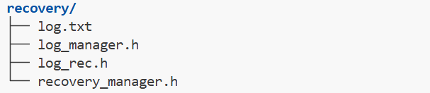
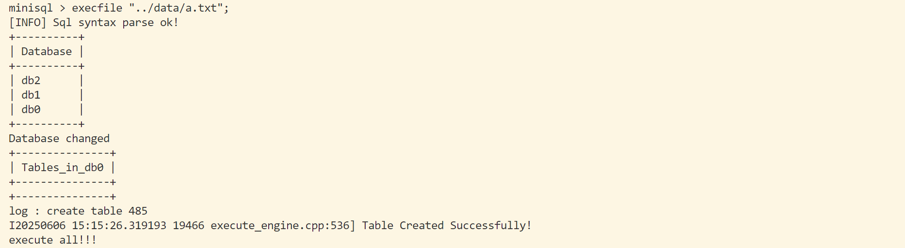
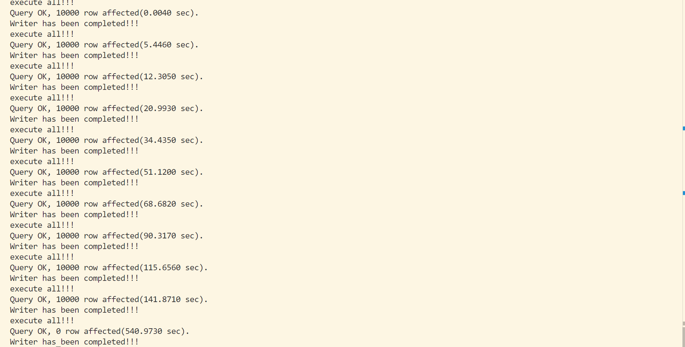
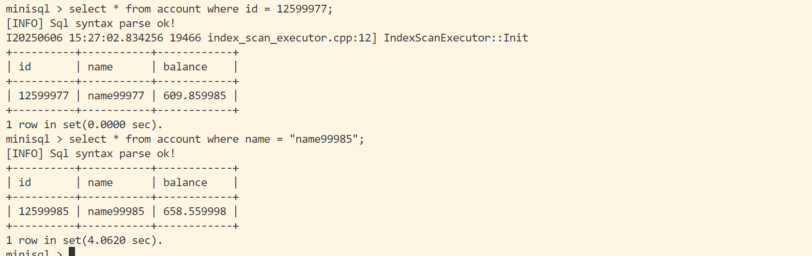
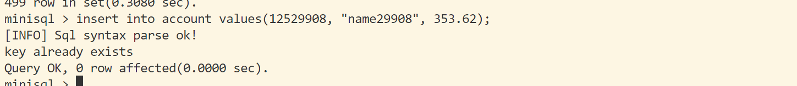
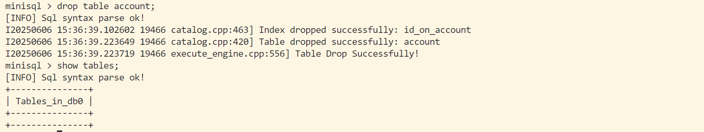
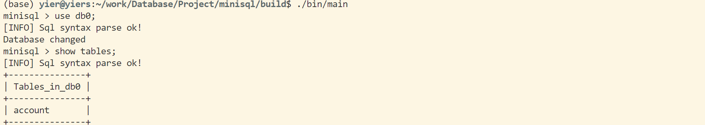

 

# 
DataBase System

  

# 
MiniSQL 个人设计报告

    

    
        姓名：<u>&emsp;&emsp;&emsp;钟&emsp;剑&emsp;&emsp;&emsp;</u>   
        日期：<u>&emsp;&emsp;6 月 4 日&emsp;&emsp;&emsp;</u>
    

## 一、 实验背景与目的

- 基于给定框架基础设计并实现一个精简型单用户SQL引擎MinSQL
- 在本次项目中，实现SQL引擎支持用户通过字符界面输入SQL语句实现简单的增、删、改、查操作
- 同时可以通过索引来进行查询的性能优化
- 在本次实验中， 设计并完成Index 与部分 Executor

  

## 二、 设计完成内容

- 在本次实验中，设计完成了：
  - `B+ tree`相关`index`,`page`模块,相关文件：
  
  
  - `executor_engine`执行相关模块，相关文件：
  
  - 并参与工程最后的调试与优化

  

## 三、 具体模块设计

### `B+ Tree`相关模块设计

 

#### 1、 **整体架构**

##### 节点数据页管理

- `b plus tree leaf page` 与 `b plus tree internal page`都继承自 `b plus tree page`。
- 每个`Page`段包含多个键值对`pair`(`key` , `value`)：
  - **对 `Internal Page`**:
  
    - 对一个内部节点，其中包含m个pair, 其中有 m-1 个 `key`，m 个 `pointer`即子节点页号，需要注意键与指针数量不同，因此第一个置为`invalid`
    - 而`middle key`指的正是这个`invalid`位置应该储存的`key`。当一个内部节点分裂，需要将这个位置的`key`移到父节点中存储； 而当此内部节点需要进行merge 或者 redistribute，则需要从父节点中取出`middle key`存回该节点。
  - **对 `Leaf Page`** :
  
    - 对一个叶子节点，其中包含m个pair, 其中有 m 个 `key`，m个 `RowId`(记录`key`对应row在table heap中的位置) 。
  
 

##### B+ 树整体结构

- 当需要建立一个索引时，需要先将索引加入`Index Root Page`中，然后籍此建立索引 B+ 树。
- 当用到某页时，需要从buffer pool中`fetch`，但使用完后需要进行`unpin`，避免引用计数一直不减少，无法回收页。

 

#### 2、 部分代码分析

> 由于具体代码较多，因此仅给出部分代码及函数名，详细可在源码中查看。

##### Internal Page

- `Lookup`函数：找到存有查找`key`的内部节点中对应的`index`
  - 为加快查找速度，通过二分查找法对需要的节点进行查找,使用`KeyManager`类中的比较函数来进行`Key`的序列化比较
  - 此函数用于查找所需key的叶子节点

- `InsertNodeAfter()`函数：将一个新的(key, value)插入到内部节点中的`old_value`之后
  - 通过将`old_value`之后的键值对整体后移，在空出的位置上放上需要插入的键值对
  - 同时需要将当前节点记录的键值对数量加一
  - 由于页相关函数都是对节点的基础操作单元化，因此在这里暂时不会进行插入后split检测

- `CopyNFrom()`函数：将N个键值对从传入地址移动到给定地址
  - 从传入地址开始，选择N个键值对，放置在给定地址后
  - 需要注意由于这里一般是对内部节点进行操作，因此需要对被移动节点的子节点(adopt_child)进行修改
  - 需要遍历将adopt child的父节点修改为目标内部节点

- `CopyLastFrom()`函数： 将一个pair移动到当前页的末尾
  - 将当前页的拥有键值对数量加一，同时将需要移动的键值对添加到当前页末尾
  - 同时由于移动了键值对，其指向的adopt child的父节点也需要进行进行调整，调整为当前页的page_id

- `MoveFirstToEndOf()`函数： 将当前页的首Pair移动到目标页末尾
  - 取得当前页的第一个pair，需要注意由于内部节点的第一个`key`为invalid，因此需要从从父节点中获得`middle key`
  - 直接让目标页调用`CopyLastFrom()`函数，将传入pair放在末尾
  - 最后需要删除当前页的第一个pair
  
- `CopyFirstFrom()`函数： 将一个pair移动到当前页的开头
  - 直接调用`InsertNodeAfter()`函数，由于是开头，因此将`old_value`设置为`INVALID_PAGE_ID`
  - 同时需要注意由于当前页开头的`key`为invalid，因此需要获得父节点的`middle key`，这样才能成为一个完整的内部节点

- `MoveLastToFrontOf()`函数：  将当前页的末尾Pair移动到目标页的开头
  - 将目标页的第一个`key`更新为`middle key`
  - 取得当前页的末尾value，并让目标页直接调用`CopyFirstFrom()`，使得`value`能够插入到目标页的开头
  - 删除当前页的第一个pair

- `MoveAllTo()`函数： 将当前页的所有键值对移动到目标页
  - 取得当前页键值对开始地址
  - 目标页直接调用`CopyNFrom`函数，将所有键值对放在自身键值对后
  - 同时需要注意这个函数用于进行内部节点的merge，因此需要从父节点获得`middle key`

- `MoveHalfTo()`函数： 将当前节点的一半键值对移动到目标节点
  - 用于内部节点的split
  - 需要将当前节点的$\lceil \frac{size}{2} \rceil$ 保留，同时将另一半移动到目标节点
  - 注意需要调整当前页记录的键值对数量

- `Remove()`函数： 根据传入的序号将对应的键值对从当前内部节点中删除
  - 从出入序号起，将后面的键值对依次向前移动
  - 同时将当前页记录的键值对数量减一
  
- `RemoveAndReturnOnlyChild()`: 删除内部节点中唯一的键值对

 

##### Leaf Page

- `KeyIndex()`函数： 用于查看`key`是否在当前叶节点中
  - 使用二分查找法进行查找
  - 找到需要的`key`在当前页中的`index`

- `Insert()`函数； 将一个键值对插入到给定的`key`之后
  - 首先调用`KeyIndex`找到给定`key`在页中的`index`
  - 接着将`index`后的键值对依次后移，同时在index位置插入键值对
  - 最后将当前页记录的键值对数量加一

- `Lookup`: 查看`key`是否位于当前叶节点中
  - 调用`KeyIndex`进行查找，如果index所处位置是正常范围
  - 并且与index位置上的key进行比较，判断是否位于当前节点
  - 用于判断是否是重复Key， 即唯一性判断

- `RemoveAndDeleteRecord()`: 删除传入key对应的键值对
  - 通过`KeyIndex`找到key对应的位置，将后面的键值对依次向前移动
  - 同时将当前节点记录的键值对数量减一

- `CopyNFrom()`： 从原地址移动N个键值对到目标地址
  - 直接进行移动，同时将目标页记录的键值对数量增加对应值

- `MoveHalfTo()`: 将当前节点的键值对移动到目标页
  - 将当前节点的$\lceil \frac{size}{2} \rceil$ 键值对保留，同时将另一半移动到目标节点
  - 让目标页调用`CopyNFrom`函数将对应数量的键值对放置在末尾
  - 将当前页记录的键值对数量减少

- 其余函数处理与Internal Page 相似，唯一不同的是，当进行键值对的移动时，叶子节点不需要对`middle key`进行处理，因为叶子节点本身就会包含所有的`key`信息

 

##### B Plus Tree 实现

- `FindLeafPage()`函数： 查找需要的叶子节点
  - 该函数有两种查找方式，取决于传入的bool型参数：
    - 查找传入key应该插入的叶子节点
    - 从当前根节点出发查找最左边的叶子节点
  - 通过不断迭代进行查询，最终一直迭代到叶子节点
  - 在这个迭代途中需要特别注意使用page的unpin

- `Insert()`函数； 将一个新的值插入B+树中
  - 如果当前树为空，那么新建根节点
  - 如果不为空，那么先向叶节点进行插入

- `InsertIntoLeaf()`函数； 将新的值插入合适叶子节点中
  - 首先调用`FindLeafPage`函数，从这棵树的根节点出发，找到新的值应该插入的节点，即包含符合这个新值范围的节点`leaf_to_insert`
  - 接着调用`lookup`函数判断当前节点中是否已经有了一个相同的值，确保index的唯一性，如果有那么插入失败
  - 在成功插入后，需要对当前叶子节点记录的键值对数量进行判断，如果数量达到最大，那么需要调用`Split`函数进行叶子节点的分裂
  - 同时如果进行了分裂，需要将新生成叶子节点的索引加入到父节点中，因此需要再调用`InsertIntoParent`进行处理

- `InsertIntoParent()`函数： 将新的节点信息插入到父节点中
  - 如果刚才发生分裂的是根节点，那么需要新建一个新的根节点，将分裂节点的信息保存到这个根结点中；同时需要更新原来分裂节点的信息
  - 如果不是根节点，那么让父节点调用`InsertNodeAfter`函数进行新节点信息的插入
  - 同时需要对父节点进行判断，当前的插入是否达到了最大值，如果达到了最大值需要继续进行递归执行更新

- `Split()`函数： 将一个满节点进行分裂
  - 分为分裂内部节点和叶子节点
  - 需要新建一个空的相同类型页，同时将$\lceil \frac{size}{2} \rceil$键值对留在当前节点，将$\lfloor \frac{size}{2} \rfloor$移动到新节点，这里直接调用`MoveHalfTo()`来进行实现
  - 同时如果是叶子节点，需要对当前节点和新建节点的`Next_Page_Id`进行调整

- `Redistribute()`函数： 如果两个节点键值对数量相加大于或等于$Max\_Size$，那么需要进行键值对的重分配
  - 根据传入的两个节点，与分配类型参数来判断当前分配方式
  - 如果分配类型为1，那么将`pre`的末尾键值对移动到`node`的开头
  - 如果分配类型为0，那么将`next`的开头键值对移动到`node`的末尾
  - 其中会直接调用`MoveFirstToEndOf`或者`MoveEndToFrontOf`来进行键值对移动

- `Coalesce()`函数： 如果两个节点键值对数量相加小于$Max\_Size$，那么需要将节点进行合并
  - 直接调用`MoveAllTo`函数将键值对进行整体移动
  - 接着调用内部节点的`Remove`函数来进行父节点中被移动节点的信息

- `CoalesceOrRedistribute()`函数： 当一个节点的节点数过少时，需要与兄弟进行重分配或者直接合并
  - 如果当前节点删除后，键值对数量 $< \frac{Max\_Size}{2}$,那么就需要与兄弟节点进行重分配或者合并
  - 首先判断当前节点键值对数量与前后节点键值对数量相加是否大于$Max\_Size$, 如果大于或等于那么需要调用`Redistribute`进行节点的移动
  - 如果小于$Max\_Size$, 那么则需要调用`Coalesce()`进行两个节点的合并

- `Remove()`函数： 需要删除某个`key`时，直接调用`Remove`进行删除
  - 首先通过`FindLeafPage`来找到对应`key`所在的叶子节点，接着直接调用`RemoveAndDeleteRecord`来删除这个键值对
  - 接着需要判断删除键值对后这个节点是否需要进行重分配和合并，如果当前键值对数量 $< \frac{Max\_Size}{2}$,那么就直接调用`CoalesceOrRedistribute`来进行处理
  - 另一种情况，如果删除的键值对是节点的第一个，那么则需要调整父节点的相关信息，同时由于内部节点性质（index为0的key是不存储信息的）,因此需要不断迭代向上找到真正存储信息的内部节点，进行修改

 

- 除此之外，完成叶节点链表迭代器实现

  

### `Executor`相关模块设计

- 此部分主要根据执行执行指令的语法树进行信息读取
  
  
  - 不同的指令语法树不同需要通过可视化图形进行查看来确定具体信息位置

- 通过找到信息后调用具体函数来进行执行操作，同时在命令行中输出相关信息

  

## 四、 实验结果展示

- 运行`minisql_test`进行模拟整体运行后：

 

- 进行`main`函数整体运行；

  - 完成数据库与表格建立：
  
  - 数据插入：
   
  - 100000条数据查询：
  
  - 主键查询与非主键查询：
  
  - 多条件查询`select * from account where id < 12515000 and name > "name14500"`：
  
  - 唯一性约束：
  
  - 索引建立与查询：
  
  - 数据更新：
  
  - 数据删除：
  
  - 删除索引：
  
  - 表格内容整体删除：
  
  - 删除表格：
  
  - 删除数据库：
  
  - 退出后重新进入：
  
  
  
  
  

