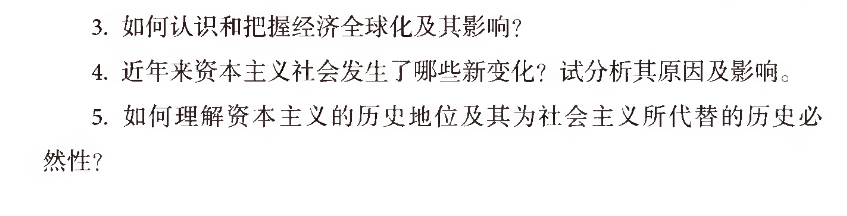

## 1.导论(10')
不要按讲义复习（智云重点）  
马克思主义是由马克思、恩格斯创立并为**后继者**所不断发展的科学理论体系
马克思主义哲学、马克思主义政治经济学和科学社会主义是其三个基本组成部分
马克思主义的基本立场:人民立场
马克思主义的基本观点，是关于自然、社会和人类思维发展一般规律的科学认识
马克思主义的基本方法，是建立在辩证唯物主义和历史唯物主义世界观和方法论基础上，指导我们正确认识世界和改造世界的思想方法和工作方法

关于费尔巴哈的提纲 德意志意识形态 资本论 共产党宣言
德法年鉴

~~~

1871年3月，巴黎工人起义并成 
立巴黎公社，马克思代表第一国际写出了著名的《法兰西内战》，高度 
赞扬了巴黎工人的伟大创举，科学总结了巴黎公社的历史经验。该书以 
及几年后他写的《哥达纲领批判》，进一步丰富了科学社会主义学说。 
1876—1878年，恩格斯写出了《反杜林论》，全面阐述了马克思主义理 
论体系

~~~

科学性、人民性、实践性、发展性

人民至上是马克思主义的政治立场

与时俱进的理论品质

科学性与革命性的统一

论述题1:物质和意识的辩证关系问题  

## 2.辩证唯物主义(45')
实践对认识的决定作用P78  
认识的本质与过程(唯物和唯心的区分)P80  
实践与认识的辩证运动及其规律P89  
真理的绝对性和相对性P93(反对绝对主义和相对主义)  

科学技术（正：推动生产力，**负**：剥削）

## 3.政治经济学

## 期末复习
平时占比60%，等级成绩
期末占比40%,斩杀线40分
闭卷考试  
40单选（40 * 1'）+3道论述题(3 * 20',每题两小问)  
均分31 + 16 + 17 + 12 = 76  
考试范围：导论-第5章  
序号  

积极与消极
### 辩证唯物主义
唯物辩证法 = 唯物论 + 辩证法
#### 唯物论（1.1）
##### 物质与意识的辩证关系原理
物质决定意识，意识对物质有能动的反作用
尊重客观规律，利用客观规律，发挥主观能动性  

#### 辩证法
##### 联系与发展

##### 三大规律
矛盾的对立统一：同一性与斗争性，普遍性与特殊性 -> 两点论（主次矛盾）与重点论（具体问题具体分析）相结合  
量质互变 -> 重视量的积累，把握机会促成质的变化  
否定之否定 -> 扬弃，前途是光明的道路是曲折的  

##### 五大范畴
原因与结果、必然性与偶然性、可能性与现实性、形式与内容、现象与本质

#### 认识论（1.2）
##### 实践与认识的辩证关系
实践是认识的来源,实践是认识的发展动力,实践是检验认识的唯一标准,实践是认识的最终目的

##### 认识过程
感性认识，理性认识

##### 真理的绝对性与相对性
绝对性：与谬误的区分，只有一个  
相对性：认识能力，实践水平差异，历史场景  
### 历史唯物主义（唯物史观）

#### 社会存在与社会意识的辩证关系
社会存在：自然环境、人口、生产方式  

#### 社会历史的基本矛盾/规律
生产力与生产关系、经济基础与上层建筑  

#### 人民群众是历史的创造者  
物质财富，精神财富，推动历史变革的决定性力量

### 政治经济学
价值规律（商品经济的基本规律）的内容及其作用  
内容：商品的价值量由生产商品的社会必要劳动时间决定,商品交换以价值量为基础，按照等价交换的原则进行。  
作用：
积极：自发地调节生产资料和劳动力在社会各生产部门之间的分配比例，自发地刺激生产力的发展，自发地调节社会收入的分配  
消极：导致社会资源浪费，阻碍技术的进步，导致收入两极分化  

8kg棉花：5/kg  
8kg面纱：10/kg  
机器磨损：8  
工资：20  
c：不变资本（技术）,v（工资）：可变资本,m：剩余价值（资本家的利润）  
剩余价值率m'  
$m'=\frac{m}{v} = \frac{80-68}{20} = 60\%$ 

资本的有机构成：$\frac{c}{v}$ 价值构成，技术构成  

有价值的一定有使用价值，但有使用价值的不一定有价值（天然物品）

货币职能：支付手段（与流通区分！！！） 买卖分离
工资的本质：劳动力的价值  
剩余价值
预付资本：生产资料，工人的必要劳动时间
资本的本质：可以带来剩余价值（利润）的价值  

价值的增殖过程
资本主义为什么会灭亡（经济危机爆发的原因）：提高资本有机过程，劳动力相对过剩，失业，购买力下降，生产过剩（主要表现），经济危机

