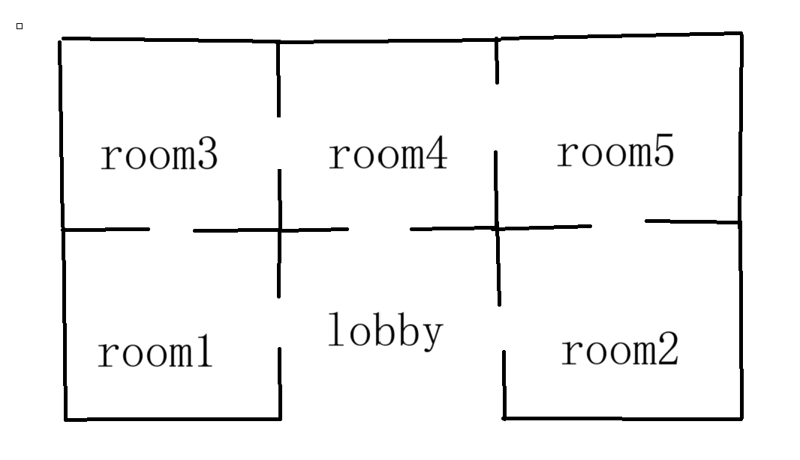

This program is a CLI game called *adventure*.  
In the game,a player explore the castle which consists of many rooms.The task of the player is to find the room where the princess is prisoned and take her to leave.  
There are many types of room each has distinct exits and there is a monster in the castle whose location is unknown.  
The game is over if the player encounters the monster.  
The game starts in the lobby and the only way to leave is via the lobby.  
  
The program is running under g++ (Ubuntu 11.4.0-1ubuntu1~22.04) 11.4.0  

Run the program by executing `make run`.  
  
The result will display in the terminal.

The maze figure is as follows:


sample interaction:  
```text
> Game start!
> Type 'help' if you don't know what to do.
> Welcome to the Lobby. There are 3 exits: west, east and up.
> Enter your command:
go west
> Moving to west
> Welcome to the Room 1. There are 2 exits: east and up.
> Enter your command:
go up
> Moving to up
> Welcome to the Room 3. There are 2 exits: east and down.
> Enter your command:
go east
> Moving to east
> Princess:Help me!
> You:Don't be afraid!
> Princess:Take me to the lobby.
> Welcome to the Room 4. There are 3 exits: west, east and down.
> Enter your command:
go down
> Moving to down
> You take the princess to the lobby!
> You win!
```
```text
> Game start!
> Type 'help' if you don't know what to do.
> Welcome to the Lobby. There are 3 exits: west, east and up.
> Enter your command:
go up
> Moving to up
> Princess:Help me!
> You:Don't be afraid!
> Princess:Take me to the lobby.
> Welcome to the Room 4. There are 3 exits: west, east and down.
> Enter your command:
go east
> Moving to east
> Whoops! Monster here!
> Game over!
```