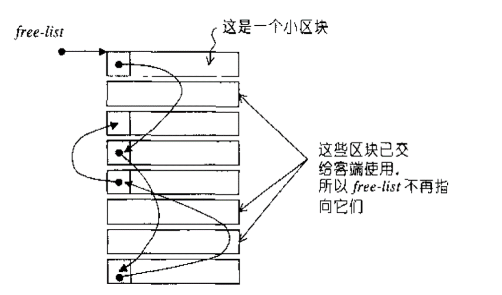

STL allocator + memory pool
**STL Allocator Interface**

An allocator is used by standard library containers as a template parameter :
```cpp
template < class T, class Alloc = allocator<T> > class vector;
template < class T, class Alloc = allocator<T> > class list;
```
What does an allocator class have? Typically, it possesses:
```cpp
typedef void _Not_user_specialized;
typedef _Ty value_type;
typedef value_type *pointer;
typedef const value_type *const_pointer;
typedef value_type& reference;
typedef const value_type& const_reference;
typedef size_t size_type;
typedef ptrdiff_t difference_type;
typedef true_type propagate_on_container_move_assignment;
typedef true_type is_always_equal;

pointer address(reference _Val) const _NOEXCEPT
const_pointer address(const_reference _Val) const _NOEXCEPT
void deallocate(pointer _Ptr, size_type _Count)
_DECLSPEC_ALLOCATOR pointer allocate(size_type _Count)
template<class _Uty> void destroy(_Uty *_Ptr)
template<class _Objty, class _Types>
void construct(_Objty *_Ptr, _Types&&... _Args)
```
**Memory Pool**

STL provides you a default std::allocator, but you can implement your own to replace it. For example, you can design a memory pool to speed up the dynamic allocation of a large number of small blocks (e.g., 8 bytes, 16 bytes, ...), and to reduce memory fragmentation.
  
Figure 1: Mem pool using block based allocation strategy.

The program is running under g++ (Ubuntu 13.3.0-6ubuntu2~24.04) 13.3.0

Run the program by executing `make run`.  

The result will display in the terminal.
