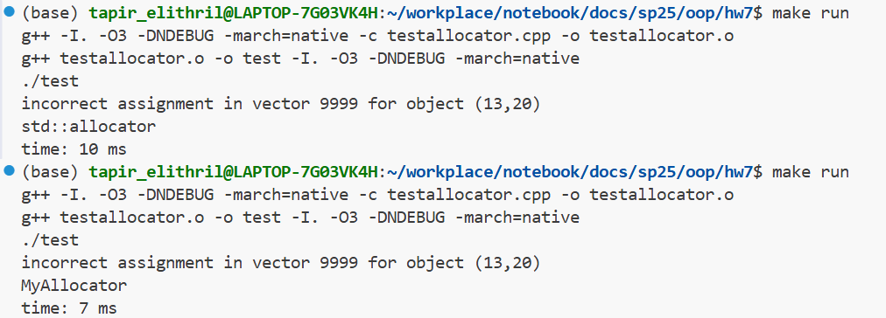

<br/><br/><br/><br/><br/><br/><br/><br/><br/><br/><br/><br/><br/><br/><br/>
<div align=center>
    <font size=20 face=黑体>
面向对象程序设计<br/><br/> 大作业:STL allocator & Memory pool
    </font>
    <font size=5 face=楷体>
<br/><br/>
杨亿酬 3230105697<br/>
2025-6-18 ~ 2025-6-21
    </font>
</div>

<div STYLE="page-break-after: always;"></div>

### 1.实验目的  
- 实现自定义的分配器以支持vector对象的操作  
- 通过memory pool，优化小对象分配的速度，减少内存的碎片化  

### 2.实验环境
g++ (Ubuntu 13.3.0-6ubuntu2~24.04) 13.3.0
  

<div STYLE="page-break-after: always;"></div>

### 3.编写思路
#### MyAllocator
`address`函数：返回Val的地址  
`allocate`函数：在初始化，push_back，resize时被调用，通过`MemoryPoolAllocator::allocate`尝试在内存池中分配空间  
`deallocate`函数：收回分配的空间，通过`MemoryPoolAllocator::deallocate`尝试从内存池中回收空间  
`destroy`函数：负责指针指向对象的析构  
`construct`函数：在已分配内存上构造对象，通过forward完美转发避免拷贝  
#### MemoryPool
内存池中维护了一个数组free list，分别用于管理256Bytes以下各大小对象的内存空间，数组中存放了一系列链表指针，指向内存块链表free list link  
```text
free list[0](16B) -> free list[1](32B)
    |
    ↓
free_list_link
    |
    ↓
free_list_link
```
`allocate`函数：根据要分配空间的大小，选择分配方式，<=256Bytes使用内存池，>256Bytes直接使用new  
对<=256Bytes的对象，先将其大小按16字节对齐，随后到对应的free list link中申请空间，修改free list link的头指针  
如果free list link为空，则通过`refill`分配初始块到free list link中  
`deallocate`函数：根据要分配回收空间的大小，选择回收方式，<=256Bytes使用内存池，>256Bytes直接使用delete  
对<=256Bytes的对象，先找到对应的free list link,将free list的指针移到ptr所指的位置（释放ptr所指的空间）并返回即可  

<div STYLE="page-break-after: always;"></div>

### 4.系统测试
使用release模式优化后，测试结果如下  
  
可以看到，应用内存池后相比于STL有一定的速度提升，但多次测试发现这一提升有一定的随机性，可能是由于随机分配大小与系统状态等因素  