# 面向对象程序设计  
翁恺班的笔记，补充了陈翔班课程的部分内容

## Using Objects Week 1(ChenXiang)  
### The string class  
```cpp
#include<string>
string str;
string str = "Hello";
cin >> str;
cout << str;
```
```c
char charr1[20];
char charr2[20] = "jaguar";

string str1; //fixed value('\0') in str1(different from C)
string str2 = "panther";

charr1 = charr2; //illegal(in C,we have to use strcpy)
str1 = str2; //legal
```
```cpp
string str3;
str3 = str1 + str2;
str1 += str2;
str1 += "a string literal";
```
constructors(ctors)  
```cpp
string(const char *cp,int len);
string(const string& s2,int pos);
string(const string& s2,int pos,int len);

substr(int pos,int len);

assign(...);
insert(const string&,int len);
insert(int pos,const string& s);
erase(...);
append(...);
replace(...);
replace(int pos,int len,const string& s);
```
### File I/O  
```cpp
#include <ifstream> //read from file
#include <ofstream> //write to file

ofstream file1("C:\\test.txt");
file1 << "Hello World" << std::endl;
ifstream file2("C:\\test.txt");
std::string str;
file2 >> str;
```

## A Quick Tour of C++ Week 2(ChenXiang)

## STL Week 3(ChenXiang)
Standard Template Library  
[Definition]Part of the ISO Standard C++ Library,Data Structure and Algorithms  

- Containers:class templates,data structures  
- Algorithms  
- Iterators:uniform access of manners  
  
### Containers

- Sequential:array(static),vector(dynamic),deque(double-ended queue),(forward_)list  
- Associative:set(key),map(key-value),multiset,multimap
- Unordered associative  
- Adaptors:stack,(priority_)queue  
  
#### vector

- Constructor,destructor  
- Element access:at,operator[],front,back,data,...  
- Iterators:begin,end,cbegin,cend,...  
- Capacity:empty,size,reserve,capacity,...  
- Modifiers:clear,insert,erase,push_back,...  

```cpp
vector<int> v;
v[100] = 1; //Whoops!
//use push_back() or resize()
```
  
#### list
(doubly-linked)
`push_back`,`list<string>::iterator p;`

#### map  
`map<string,float> price;`
multi-map:one key corresponds to multiple values

#### stack  
adaptor:转换器  

### Algorithms  

- [first,last)
- for_each,find,count,...  
- copy,fill,transform,replace,rotate,...  
- sort,partial_sort,nth_element,...
- set_difference,set_union,...  
- accumulate,partial_sum,...  

### Iterators  
STL<parameters>::iterator xxx  

- input iterator  
- output iterator  
- forward iterator:++p,p++,*p,==,!=,=(forward list,unordered_map,unordered_set)  
- bidirectional iterator:...,--p,p--(list,set,map)  
- random access iterator:p+=i,p-=i,p+i,p-1,p[i],<,>,<=,>=,p2-p1(vector,deque)  
- 不支持迭代器：stack,queue  

begin(),end()  
end()常不能达到，用!=stl.end()作为结束条件  
```cpp
list<int> L;
list<int>::iterator li;
li = L.begin();
++li;
*li = 10;
L.erase(li);
++li; //ERROR
//可以使用li = L.erase(li)获得一个新的iterator
```
### Typedefs
`auto`:编译器推断  
`using`  
`typedef map<Name,list<PhoneNum>> PB;`  

## Defining Class Week 3
```cpp
void print(Point *p)
void move(Point *p,int dx,int dy)
```
Q1:All the functions take a pointer to Point as the first parameter,why?If we take it as a global var,is it OK?  
ANS:No,because we need to tell the function **which** struct to deal with  
Solution:put the functions into the struct -> member functions class  
`::`所有格resolver
```cpp
void S::f() //function f in class S
{
    ::f(); //global function f,instead of recursively call
    ::a++; //global a
    a--;   //local a
}
```
How does the compiler kknow its members when executing member functions?  
`this` is a pointer points to the object  

### Object
Object = Attributes + Service = Data(private) + Operations(Public)  
UML:name,attribute,service(operations)  
class≈struct(class默认访问权限为private而struct为public)  
任何class都需要分在.h与.cpp两个文件中，.h提供声明供他人使用，.cpp提供private实体  
**One** class definition **per** header.h  
Only declarations are allowed in .h  

- extern var  
- function prototypes  
- class/struct definition 
  
### include  

- \#include "xx.h"：优先搜索.cpp文件所在目录再到指定位置搜索
- \#include<xx.h>：指定位置搜索
  自带头文件
  环境变量
  -I
- \#include<xx>：与<xx.h>相同
  
### Constructor
What will happen if we forget to initialize?  
Without initialization,we won't get fixed value.  
```cpp
struct Point
{
    int x;
    int y;
    Point(int x,int y) // 构造函数
    {
        this->x = x;
        this->y = y;
    }
};

int main()
{
    Point p(1,2);
    Point p2{1,2};
}
```
构造函数名字与结构名相同，没有返回类型  
没有参数的构造函数：default  
成员变量的赋值  

- 在结构体中赋值  
- 在构造函数头中添加初始化列表`Point(int xx,int yy):x(xx),y(yy)` 成员变量名(初始化值)
- 在构造函数中赋值  
- 以上三种按序进行

```cpp
struct Y
{
    float f;
    int i;
    Y(int a);
    //如果定义了其他构造函数，编译器不会自动生成默认构造函数
    //除非显示说明Y() = default;
}
Y y1[] = {Y(1),Y(2),Y(3)}; //OK
Y y2[2] = {Y(1)}; //ERROR
Y y3[7]; //ERROR
Y y4; //ERROR
```
### Destructor
```cpp
struct Y{
    ~Y();//cannot have any parameter
};
~Y(){
    //auto
    ...
}
```
What happens with `goto` and `switch`?  
Not allowed.  

## Inside Object Week 4
what to do and how to do
### Access Control
  
- public  
- friend:授权（所有）私有成员，被以下接收  
  自由函数  
  类中的函数  
  整个类  
- private:私有的边界是类，不是对象  
  同一类的不同对象可以互相访问private成员  
  e.g.**拷贝构造**可以直接利用私有变量传参  
- protected:子类可以访问  

### Objects in different places
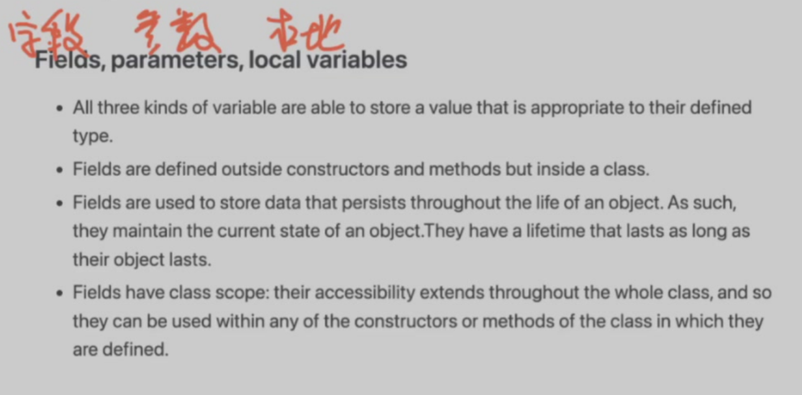  
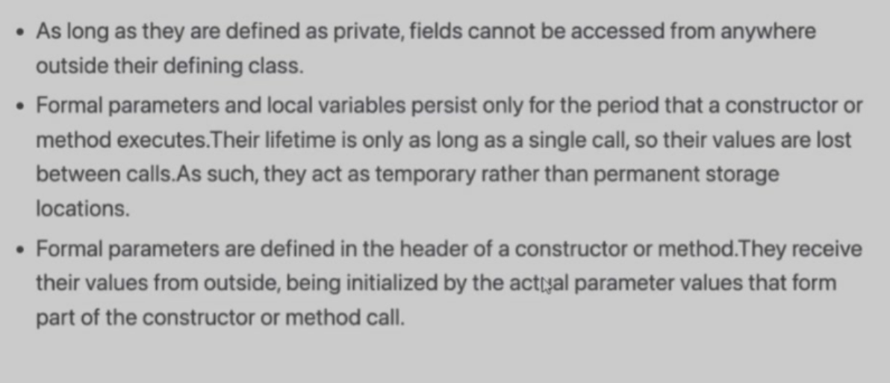  
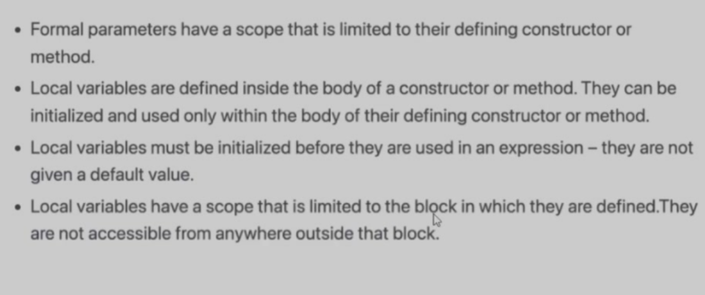  
任何一个对象都只属于一个具体的类  

### Static
Initialization Dependency:not guaranteed  
strong recommend:no global vars!  

- static storage  
- restricted access  
  
use static only inside **functions and classes**

- static free function:deprecated  
- static global vars:deprecated  
- static local vars:persistent storage  
- static member vars:shared  
- static member functions:shared  
  
static object:initialized when first called,destruct as a global var  
static member:不在class的存储空间中，被不同对象共享（被视为同一个）
```cpp
class M{
    static int m_h; //declaration,not belonging to the class
    int m_w; //declaration
};

int M::m_h;
static int M::m_h;//ERROR
```
static function:no `this`,不能访问任何非静态成员变量或函数  
不需要制造对象即可调用(<class name>::<static func/var>)，和任何对象都无关  
应用：提供制造类对象的方法，作为制造函数   
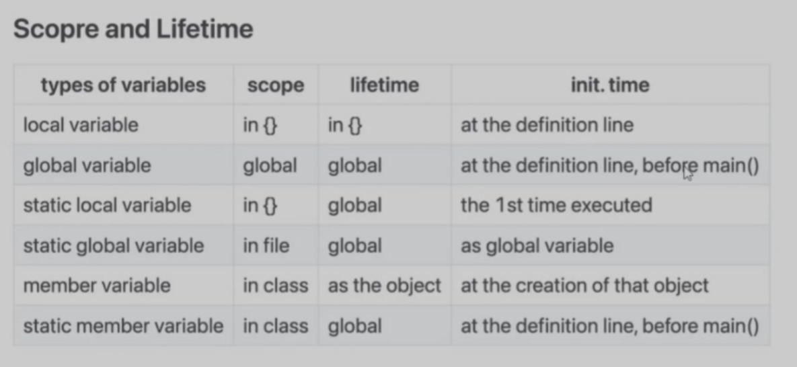  

!!! note "local vars的空间分配发生在进入函数时，编译器会在进入函数时算好所有本地变量需要的最大空间与地址"  

static local variable:在程序结束前析构，在函数内访问  
static member variable的构造与析构与global variable相同，在类内访问  

!!! danger "static变量/函数必须在类外(.cpp)中声明！  

### Constant object  
How can the object be protected from change?  
Solution:declare member functions const  
```cpp
int Data::set_date(int d){
    day = d;
}
int Data::get_date() const{
    day++;      //ERROR modify data member
    set_day(12);//ERROR call non-const member function
    return day;//OK
}
```
const修饰this  
静态成员变量不可能是const，因为没有this指针，只能在初始化列表初始化(const是无用的，const确保类对象不被修改，而static member不属于类)  
const and non-const member function can coexist(overload)  

## Memory model Week 4(ChenXiang)
### variables
```cpp
int i;//global vars
string str;
static int j;//static global vars
f()
{
    int k;//local vars
    static l;//static local vars
    int *p = malloc(sizeof(int));//allocated local vars
}
```

- Global data:global vars,static global vars,static local vars(i,j,l,str)  
- Stack:local vars(k)  
- Heap:dynamically allocated vars(*p)  
  
global vars:vars defined outside any functions and classes and can be shared between .cpp files(extern)  
  
static vars:inhibit to be accessed outside .cpp
  
static local vars:keep its state btw functions

static  

- restricted access scope  
- persistent storage  
  
### reference
`ps = &s`,`(*ps).length()`,`ps->length()`  
绑定别名(alias)(一次性不可计算的指针)，通过引用直接操作原始变量，共享存储，不是指针，不需要解引用  
```cpp
char p;
char* s = &p;//a pointer to a character,s points to the addr of p
char* s = p;//ERROR
*s = x;//把x的值赋值给s指向的变量，*是一个运算符
char& r = q;//a reference

int  x = 47;
int& y = x;
int& y = z;//ERROR,reference is permanent and cannot be changed
int& y;//ERROR,reference cannot be null
cout << "y = " << y << endl;//y = 47
y = 18;
cout << "x = " << x << endl;//x = 18
y = z;//copy the value of z to y(a.k.a x)
```
```cpp
void f(int&);
f(i * 3)//not allowed
//i * 3是右值，不能出现在赋值号左边，不能被reference接收
//reference只能接受一个左值
//右值：只能放在赋值号右边
//左值：即可以放到赋值号左边又可以放在赋值号右边*,[],.,->
int&* p;//illegal,reference没有实体，无法被指向
void f(int*& p);//legal,the reference of pointer
//no reference to reference
//no array of reference
```
```cpp
void f(int& x){
    x++;
}
int main()
{
    int y = 5;
    f(y);
    cout << y << endl; // 6
    //不再是值传递 f(y)能成功的修改y了
}
```
#### *右值引用
```cpp
T&& a = i * 6;//将亡值
T y = a * 2;
a = 100;
//延长临时变量的生命周期
```
### dynamic memory allocation
```cpp
new int;//malloc(向程序运行的进程申请空间)
new Stash;//construct object in heap
new int[10];

delete p;//free
delete[] p;
```
new and delete triggers and ensures the correctness of Ctor/Dtor(运算符)  
cannot delete twice but can delete nullptr  

!!! note "new 返回的是指针"  

```cpp
int* psome = new int[10];//长度不确定的数组
delete[] psome;
```
```cpp
int* p =new int;//heap上的空间分配：Magic number(4bytes) + bytes allocated '4'(4bytes) + p(4bytes)
int* a =new int[10];
Student* q = new Student();//可传参
Student* r = new Student[10];
delete p;//-8 bytes,check是否是magic number,如果不是则报错
a++;
delete[] a;//ERROR
delete q;//Destructor,then check magic number
delete r;//1 destructor,then delete 1 student(ERROR in some compilers)
delete[] r;//10 destructor
```
### constant
```cpp
const int x = 123;
x = 27; //illegal
x++;    //illegal

int y = x;       //legal,copy const to non-const
y = x;           //legal
const int z = y; //legal
```
`const` is an *internal linkage*

- Compile time constants    
- Run-time constants
```cpp
//compile time
const int class_size = 12;  //store in .text
int finalgrade[class_size]; //legal

//run time
int x;
cin >> x;

const int size = x;
double classaverage[size]; //error,static array length must be fixed when compiling!
```
```cpp
int a[] = {53,54,55};
int * const p = a;// p(pointer) is a const
*p = 20; //legal
p++;     //illegal

const int *p = a; // (*p)(the object pointer p points to) is a const
*p = 20; //illgal
p++;     //legal
//不能通过指针修改变量（变量本身能否修改取决于变量本身是否有const）
//观察const在*左边还是右边
```
```cpp
int i;
const int ci;
int* ip;
const int* cip;
ip = &i;
ip = &ci; //illegal,ci cannot be modified but ip can,this is not allowed
cip = &i;
cip = &ci;
*ip = 54; //always legal
*cip = 54;//never legal
```
String literals:in .text,read only
```cpp
(const)char* s = "Hello World!";
//sizeof(s) = 8
//s in stack,"Hello World!" in .text
char s[] = "Hello World!";
//in stack
//sizeof(s) = 14
```
```cpp
void f(const int* x)
{
    (*x)++;//illegal
}
//实际设计中常通过传指针替代传结构
//使用const修饰确保指针指向内容不被修改
```

## Inside Class Week 6  
### Overload
```cpp
class point{
    int x,y;
public:
    point():x(0),y(0){}
    point(int xx,int yy):x(xx),y(yy){};
};

int main()
{
    point p(1,2);
    point p2;
    point a[10];
}
```
函数名相同，参数表不同
```cpp
    point(int x,int y):x(0),y(0){}
    point(int xx,int yy):x(xx),y(yy){};
    //相同的参数表
```
```cpp
//auto-cast
void f(short);
void f(double);
f('a'); //ERROR
f(2);//ERROR
f(2L);//long ERROR
f(3.2);
```
const and non-const is an overload,non-const can be put to const.  

!!! danger "不同的返回类型不构成重载"  

```cpp
//*Delegating Ctors
class Info{
public:
    Info(){InitRest();}
    Info(int i):Info(){type = i;}
    Info(char e):Info(){name = e;}
}
//逐级代理
class class_c{
public:
    int max;
    int min;
    int middle;
    class_c(int my_max){
        max = my_max > 0 ? my_max : 10;
    }
    class_c(int my_max,int my_min):class_c(my_max){
        min = my_min > 0 && my_min < max ? my_min : 1;
    }
    class_c(int my_max,int my_min,int my_middle):class_c(my_max,my_min){
        //只能有一个代理构造，早于初始化列表，晚于定义初始化
        middle = my_middle < max && my_middle > min ? my_middle : 5;
    }
}
```
可以将代理构造的目标隐藏起来(private)  
不能循环代理  
### Default argument  
在成员函数的参数表中放入默认值  
```cpp
class point{
    int x,int y;
public:
    void k(int a,int x=0,int y=0) const {
        cout << x << endl;
    }
};

int main()
{
    const point p;
    p.k();//ERROR
    p.k(9);
    p.k(9,10);
    p.k(9,10,11);
}
```
`void k(int a,int x=0,int y)`:not allowed,default arguments written from right to left  
默认参数值写在声明(.h)中而不要写在定义(.cpp)中  
因为参数值是依据头文件由编译器填入的（与函数内部无关）  
### Inline functions
overhead(额外开销) for a function call:context_switch  
`inline`是C语言的特性  
```cpp
inline int f(int i){
    return i*2;
}
main(){
    int a = 4;
    int b = f(a);
    //Compiler does:b = a*2;
}
```
`inline`的代价:浪费空间  
需要在声明与定义repeat `inline`关键字  
不会在obj中产生任何代码(无法链接)  
```sh
g++ -c a.cpp #只编译不链接
objdump -t a.o |grep xx
```
需要将`inline`函数的body写在.h中，以供编译器'抄写'  
Better than `define`,`inline`会检查变量的类型.   
是否真的`inline`是由编译器根据函数大小或函数是否递归、循环、是否有静态变量自行决定的  

## Composition Week 7  
composition:construct new object with existing objects  
Reuse the implementation  
**ways of composition**  

- fully(Ctor and Dtor are automatically called)(Only C++)  
- by reference  
  logical relationship is not fully(e.g.supervisor & employee)  
  size-of is unknown beforehand  
  resource is to be allocated/connected at run time(exception)  
  
```cpp
class SavingsAccount{
public:
    SavingsAccount(
        const char* name,
        const char* address,
        int cents);
    ~SavingsAccount();
    void print();
private:
    Person m_saver;
    Currency m_balance;
};

class Employee{
    ...
private:
    Supervisor *m_supervisor;
};
```
Composition在内存的存储与定义类时的顺序有关  
传值构造
```cpp
class A{
    int i=0;
public:
    A(int ii):i(ii){cout << "A::A()" << endl;}//必须传值构造
    //A(int ii=0):i(ii){} //可作为默认构造
    ~A(){cout << "A::~A()" << endl;}
}

class B{
    int j=1;
    B(int i):j(i){cout << "B::B()" << endl;}
    ~B(){cout << "B::~B()" << endl;}
}

class C{
    A a;
    B b;
public:
    C():b(1),a(2){}//初始化列表顺序与构造顺序无关
}
```
使用初始化列表
```cpp
SavingsAccount::SavingsAccount(
    const char* name,
    const char* address,
    int cents):m_saver(name,address),m_balance(0,cents){}
    //参数构造m_saver,m_balance
void SavingsAccount::print(){
    m_saver.print();
    m_balance.print();
}

SavingsAccount::SavingsAccount(
    const char* name,
    const char* address,
    int cents){
    m_saver.set_name(name);
    m_saver.set_address(address);
    m_balance.set_balance(cents);
    //默认构造再赋值
    }
//
```
It is common to make embedded objects `private`.  
Example:clock display  

## Inheritance Week 8
Inheritance is to take the existing class,clone it,and then make additions and modifications to the clone.  
Reuse the interface  
OOP的三大特性：封装，继承，多态  
Example:DoME(Database of Multimedia Entertainment)  

- CD:title,artist,tracks,playingtime,got-it,comment  
- DVD:title,director,playingtime,got-it,comment  
- `list` and `print`  
  
可修改：可维护性  
不需要修改：可扩展性  
基类（父类）->派生类（子类）  
### What does it inherited?  

- private member vars.  
    inaccessible  
    exist in derived class(内存中先于子类的member vars，父类嵌入子类对象)  
- public member functions  
    are public mumber functions of derived class too  
- private member functions  
    inaccessible in derived class  
- protected members  
    fully and only accessible in derived class  
- static members  
    a change to all  

父类先被Ctor后被Dtor  
### Name hiding  
子类中重写父类overloaded函数中的一个，会导致其他重载函数隐藏  
Use `virtual` to affect function overloading(Polymorphism)  
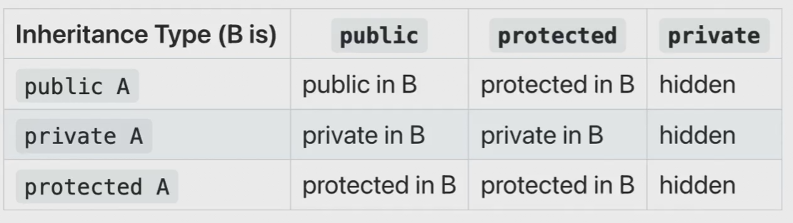  
private继承可以理解为composition  

## Polymorphism Week 9 - 10
Subtyping
```cpp
Vehicle *v1 = new Vehicle();
Vehicle *v2 = new Car();
Vehicle *v3 = new Bicycle();//通过v3,我们只认为他是一个vehicle
```
Parameter passing
```cpp
public class Database{
    public void addItem(const Item &item)
    {
        ...
    }
}
DVD dvd;
DVD cd;
Database.addItem(dvd);
Database.addItem(cd);
```
### casting
casting:类型转换  
```cpp
(int)6.3 = 6;
```
Up-casting:造型  
```cpp
Person *p = new Student();
//Student is still a student,we just not treat it as a student  
Manager pete("Pete","444-55-6666","Bakery");
Employee* ep =&pete;
Employee& er =pete;
ep->print(cout);//lose type information about the object  
```
UML图示  
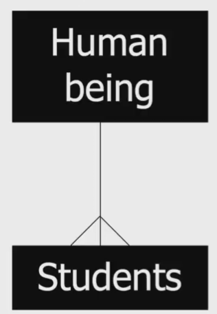  
### virtual
[Question] What's the point of saying it's a subclass object?  
[Example] Shapes:Rectangle,Circle & Ellipse  
Operations:render,resize,move  
Data:center  
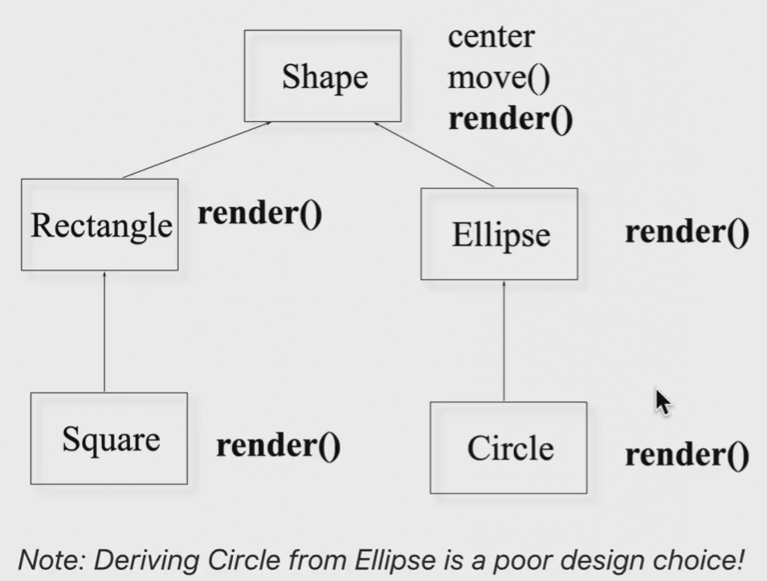  
`virtual` (together with pointer) calls the relevant subclass member function(dynamic binding)  
```cpp
    rectangle r;
    draw(&r);
    r.render();//static binding:compile time
    shape* p = &r;//p is a polymorphic variable
    //static(declared) type:shape,dynamic(run-time) type:rectangle
    p->render();
    //(*p -> vptr -> vtable[?])()
    //to select which function to call:binding
    //dynamic binding:run time

output:(without `virtual`)
shape::render()
rectangle::render()
shape::render()
```
binding:which function to call  
static binding:call the function as the code  
dynamic binding:call the function of the object   
virtual functions  

- non-virtual:compiler generates *static*  
- virtual
  can be transparently overridden(覆盖)  
  objects carry a pack of their virtual functions  
  compiler checks pack and *dynamically* call  

### How does `virtual` work?
note:the sizeof a class with no member var is '1'(not '0' which is unscientific)  
without `virtual`,sizeof(subclass) = sizeof(superclass) + 4 * number of member vars(unless sizeof(superclass) == 1)  
with `virtual`(no matter how many),a *vptr*(virtual pointer) is generated,which points to *vtable*(owned by the class)  
vtable consists all the function pointer in the class  
sizeof(vptr) = 8(in x64) or 4(in x86)  
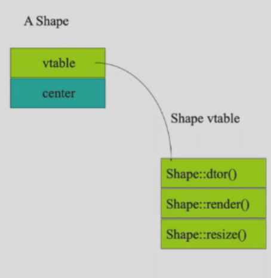  
```cpp
Rectangle r;
Shape s;
s = r;
Shape* p = &s;
p->render();//Shape::render()
p = &r;
p->render();//Rectangle::render()
```
[Question] What happens to vptr?  
vptr won't be transferred,because vptr is generated **in constructor**  

### Virtual destructors
Why?  
```cpp
Shape* p = new Ellipse(100.0F,200.0F);...
delete p;// p->~ then free()
//problem:which ~ to call
```
We consider every class has a virtual destructor  
Therefore,every class ought to have a vptr  

### Override  
Superclass and subclass define methods with the same signature(function prototype)  
Suppose D is derived from B,should D::f() and B::f() have the same input type and output type?  
```cpp
class expr {
public:
    virtual expr* newexpr();
    virtual expr& clone();
    virtual expr self();
};
class binaryexpr : public expr {
public:
    virtual binaryexpr* newexpr();//OK
    virtual binaryexpr& clone();//OK
    virtual binaryexpr self();//Error!Type not match,c++ prohibit this operation
    //note:virtual in subclass can be neglected
};
```
Name hiding still exists with virtual  
Only override on virtual functions!  
Shape is an abstruct class,we actually don't want a *shape* object to be created.  
```cpp
class shape {
public:
    virtual void render() = 0;
    //纯虚函数
}
```
某一个函数`virtual f() = 0`，表示类是抽象的，抽象类不能构造对象  
抽象类的子类可以是抽象类  
```cpp
    Mammal *M = new Mammal();
    Male m;
    *M = m;//对象切片

    Employee* b = new Manager(); //没有发生对象切片
```
### *Multiple Inheritance  
一个类有多个父类(only c++):菱形继承的问题，其余oop语言的单根结构（所有类都是object类的子类，容易实现容器）  
c++通过多继承制造容器  
虚继承：指针指向爷类  
虚继承解决多继承，多继承解决没有单根结构的问题，最终被模板取代  
多继承只有在多个父类只有一个是实际类的时候可以进行  

## Copy and Move Week 10  
### Copying  
get a copy of the existing object unconsciously  
E.g.
```cpp
void func(Currency p) {
    cout << "X = " << p.dollars();
}
...
Currency bucks(100, 0);
func(bucks);//bucks is copies into p
//Currency p = buck; or Currency p(buck);
//we actually do a construct
//but we can only call a default constructor(see howmany.cpp)
```
Copy Constructor:构造函数的参数是自己类的对象(const reference)  
`HowMany(const HowMany& r) {}`  
When will copy happen ?  

- `ClassType a = b;`  
- function call  
- function return  
  
When must we have a copy ctor ?  
When we have a pointer in member var(or other non-memory resources,e.g.句柄)  
why?See person.cpp   
default constructor:member-wise copy(依次调用成员拷贝构造)/binary copy(逐字节拷贝，无法正确处理指针)  
```cpp
Person copy_func(char *who) {
    Person local(who);
    local.print();
    return local;// copy ctor called unless NRVO applied
}
Person nocopy_func(char *who) {
    return Person(who);
}//no copy needed,RVO automatically applied
```
Compiler helps:RVO (Return Value Optimization) and NRVO (Named Return Value Optimization)  
Note:注意拷贝与赋值的区别  
1.try to create own copy ctor if needed  
2.declare a private copy ctor to avoid getting copied  
### Types of function parameters and return value  
```cpp
void f(Student i);//copy ctor,protect outside object
void f(Student *p);//indicate that we may modify the object
void f(Student& i);//better with const if won't modify
```
```cpp
Student f(); //create a new object
Student* f();
Student& f();
```
```cpp
char *foo() {
    char *p;
    p = new char[10]; //不要在函数中申请内存再交出去
    strcpy(p,"something");
    return p;
}
void bar() {
    char *p = foo();
    printf("%s",p);
    delete p; //What if someone forget,how can she know a delete is needed
}
```
```cpp
//a better version
char *foo(char *p) { //传入指针
    strcpy(p,"something");
    return p; //操作完成后传出去
}
void bar() {
    char p[10]; 
    char *p = foo(p);
    printf("%s",p);
    // delete p; //no longer needed
}
```
### *Moving
get all the info of the original object while destroying the original one  
参数为右值引用(&&)的拷贝构造  
```cpp
DynamicArray(DynamicArray&& rhs):m_size{rhs.m_size},m_array{rhs.m_array}
{
    rhs.m_size = 0;
    rhs.m_array = nullptr;
    cout << "Move constructor:dynamic array is moved! << endl;
}
```
only c++,for moving the object itself(not pointer)(`Student s`)  
使用std::move获得右值  
```cpp
vector<int> v1{1,2,3,4};
vector<int> v2 = v1;//copy ctor
vector<int> v3 = std::move(v1); //move ctor
//std::move将v1转化为右值，移动后v1消失
```
对象初始化
```cpp
string str("hello");
string str = "hello";
struct student {
    char *name;
    int age;
};
student s = {"dablelv",18};
student sarr[] = {{"dablelv",18},{"tommy",19}};
class test {
    int a;
    int b;
public:
    test(int i,int j);
};
test t{0,0};
test *pt = new test{1,2};
int *a = new int[3]{1,2,0};
//{} only in c++11
```
using
```cpp
class Base {
public:
    void f();
};
class Child : public Base {
public:
    using Base::f;
    void f(int i) {}
}
```

## Overloaded Operator Week 11  
[Recall] Overload的条件：函数的名称相同参数表不同（参数个数不同或类型不同且类型不会引起歧义）  
子类和父类的指针不构成overload(歧义)，const与non-const构成overload  
operators can be overloaded  
```c
+ - * / % ^ & | ~
= += -= *= /= %= ^= &= |=
<< >> <<= >>= 
== != < > <= >= 
! && || ++ --
, ->*(a.i) ->()(a.f(i)) []
new delete
new[] delete[] 
```
operators cannot be overloaded
```c
. .* :: ?:
sizeof typeid
static_cast dynamic_cast const_cast reinterpret_cast(类型转换)
```
Only existing operators can be overloaded(`**` cannot be overloaded)  
Operators must be overloaded on a class or *enumeration type`enum{__,__,__}`  
Overloaded must preserve the number of operands and precedence(优先级)  
```cpp
const String String::operator +(const String& that);
//example see a.cpp
```
How to overload?  
```cpp
A a1(1);
A a3 = a1 + 3;//3 is converted to A type
A a4 = 3 + a1;//ERROR
```

### As member function  
implicit first argument  
no type conversion performed on receiver  
### As global function
use `friend`  
Only one side need to be the class(`3+a1` is allowed)  
**Choose between member function and global function**  

- Unary operators(单步运算`-,~`) should be member  
- `= () [] -> ->*` must be member  
- assignment operators should be member  
- other binary operators are encouraged to be global  

!!! danger "期末大题，多个运算符的参数表与返回类型"  

### passing parameter
- read only(`+,>,...`)(not read only:赋值运算符`++,--,=,...`):pass it as `const reference`  
- member function that won't modify `this`,use const member function  
- global function that will change its left-hand-side,pass it as `reference`(but not `const reference`)  
  
### return value
左值运算符  
```cpp
a + b = 6; //非左值运算符
*p = 6;
a[i] = 6;
a.k = 6;
```
左值运算符应返回可写值，而非左值运算符返回不可写值(add `const` before `operator`)   

- if a new object is to generated,return a const object  
- logical operators return `bool`  

### prototypes of operators  
- `+-*/%^&|~`  
  `const T operatorX(const T& l,const T& r);`  
- `! && || < <= == >= >`  
  `bool operatorX(const T& l,const T& r);`  
- `[]`  
  `E& T::operator[](int index);`  

### `++` and `--`  
```cpp
class Integer {
public:
    ...
    const Integer& operator++(); //++i
    const Integer operator++(int); //i++(返回另一个对象,this中的i加1)
    //we often transfer '0' for int
    ...
}
const Integet& Integer::operator++() {
    *this += 1;
    return *this;
}
const Integet Integer::operator++(int) {
    Integer old(*this);
    ++(*this);
    return old;
}
```
### Relational operator  
use `== <` to implement `!= > <= >=`  
```cpp
bool Integer::operator==(const Integer& rhs)const {
    return i == rhs.i;
}
bool Integer::operator!=(const Integer& rhs)const {
    return !(*this == rhs);
}
bool Integer::operator<(const Integer& rhs)const {
    return i < rhs.i;
}
```
### []
```cpp
const int& Vector::operator[](const int ind) {
    return buf[ind];
}
Vector v(100);
v[10] = 45;
```
### stream extractor/inserter and manipulator  
```cpp
//global function not const
istream& operator>>(istream& is,T& obj) {
    is >> p.name >> p.age;
    return is;
}
cin >> a >> b >> c; 
ostream& operator<<(ostream& os,const T& obj) {
    os << p.name << p.age;
    return os;
}
cout << a << b << c;
```
```cpp
ostream& manip(ostream& out) {
    ...
    return out;
}
ostream& tab(ostream& out) {
    return out << "\t";
}
cout << "Hello" << tab << "World";
```
### copying & initialization  
```cpp
T& T::operator=(const T& rhs)
{
    if(this != &rhs){   //this is a must,in case `a=a` delete itself
        ...
    }
    return *this;
}
```
### value classes  
`explicit`:indicating that the ctor cannot be used for data conversions  
```cpp
class PathName {
    string name;
public:
    explicit PathName(const string&);
    ~PathName();
};
...
string abc("abc");
PathName xyz(abc);//OK
xyz = abc;//ERROR with explicit 
```
Conversion operators`X::operator T()`  
```cpp
class Rational {
public:
    operator double() const;//Rational to double
    //无返回类型
};
Rational::operator double() const {
    return numerator_/(double)denominator_;
}
Rational r(1,3);
double d = 1.3 * r;
```
note:`C(T)` and `operator C()` cannot be both accessible(compiler may confuse)  
Usually,we'd rather use `double todouble() const;`  
overloading and type conversion:c++ check each argument for a best match  

## Template Week 12
[Insights] similar code for different types  
Other oop language solution:common superclass  
```cpp
//a c implementation 
class Stack {
    void push(void *);
    void* pop();
    //Stack();
    Stack(int cap,int os);//capacity,object_size
private:
    //void **pBuf;
    void *pBuf;
    //cannot deal with pointer when copy  
};
pBuf = new char[cap * os];
Stack(100,sizeof(Student));
```
[Classification] reuse source code(generic泛型，use types as parameters in class or function definitions),function template函数模板,class template类模板  
### Function templates
```cpp
template <class T> // or typename
void swap(T& x,T& y) {
    T temp = x;
    x = y;
    y = temp;
}
```
Instantiation实例化  
```sh
nm -CU a.out
```
No instantiation is not used,c.f.function instantiated if not called  
`inline` functions are declarations,so is templates.  
Function with no `template` is found first  
Only exact type match on types is used for `template`,`template` does not support type conversion at all  
```cpp
int add(int a, int b)
{
    return a + b;
}
template <typename T>
T add(T a,T b)
{       
    return a + b;
}
cout << add(1.1,2.2f) << endl;//int add is called
//if no int add,ERROR
```
unique function match > unique function template match > overloading(conversion)  
```cpp
template <typename T>
T foo(void){
    /*...T is used inside function*/
    /*compiler don't know what is T because no parameter to infer*/
}
foo<int>();//tell the compiler what is T
foo<float>();
```
### Class templates
`stack<int>,list<Person>,queue<Job>`  
```cpp
template <typename T>
class Vector {
public:
    Vector(int);
    ~Vector();
    Vector(const Vector&);
    Vector& operator=(const Vector&);
    T& operator[](int);
private:
    T* m_elements;
    int m_size;
};

template <typename T>
T& Vector<T>::operator[](int i)//必考：T& Vector<?>
{
    return content[i];
}
```
Usage  
```cpp
Vector<int> v1[100];
Vector<Complex> v2[256];
v1[20] = 10;
v2[20] = v1[20]; //OK if int->Complex is defined
```
### parameters
```cpp
template <typename KEY,typename VALUE>
class HashTable{
    const VALUE& lookup(const KEY&) const;
    void install(const KEY&,const VALUE&);
    ...
};
```
`Vector< Vector<double *> >`,space between>> is recommended  
`Vector< int (*)(Vector<double>&,int )>`函数指针，相当于`Vector< int f(Vector<double>&,int )>`  
**Expression**  
```cpp
template <typename T,int bounds = 100>
class FixedVector {
public:
    FixedVector();
    // ...
    T& operator[](int);
private:
    T elements[bounds]; //fixed size array
    //bounds is no longer a variable after instantiation
    //not allowed otherwise,see vector.cpp
};

template <typename T,int bounds>
T& FixedVector<T,bounds>::operator[](int i){
    return elements[i];
}
FixedVector<int,10> v1;
FixedVector<int> v2; //default bounds
//no pointer,copy ctor & overloaded assignment is not needed
```
变长数组
```c
struct A {
    int size;
    int a[]
};
A *p = malloc(sizeof(int) * 101);
p->size = 100;
```
### Inheritance  
```cpp
template <typename A>
class Derived:public Base{}
template <typename A>
class Derived:public List<A>{}
class SupervisorGroup:public List<Employee*>{}//从模板实例出来的类得到继承
```
类不能从模板中得到继承，从模板得到继承的也是模板  
`friend`,`static members` are allowed  
IN GENERAL,put the definition and declaration for the template in the header file  
template SHOULD NOT have a `.cpp`  
compiler/linker can remove multiple definition of templates automatically  

## Exception Week 13
The basic philosophy of C++ is that "badly formed code will not be run"  
more strict type check than C  
Run-time error:可预见，不可避免，不一定发生  
### Try-catch
Why needed?  
Readability of code,Convenience of Modification  
No further code will be executed if an exception happened,and we won't come back after exception handled  
What is a good exception handle choice?  
1.return random object  
2.return special value  
3.die(`exit`)  
4.die gracefully(`assert`)  
### Exception handle chain  
```cpp
template<typename T>
T& Vector<T>::operator[](int indx) {
    if(indx < 0 || indx >= m_size)
        throw <<something>>; //something can be any type
    return m_elements[indx];
}
```
What to throw?  
```cpp
class VectorIndexError {
public:
    VectorIndexError(int v):m_badvalue(v) {}
    ~VectorIndexError(){}
    void diagnostic() {
        cerr << "index" << m_badvalue << "out of range!" << endl;
    }
private:
    int m_badvalue;
};
```
`throw VectorIndexError(indx);`:throw the object itself  
```cpp
int func() {
    Vector<int> v(12);
    v[3] = 5;
    int i = v[42]; // i won't get value;
    return i * 5; //won't be done
}
// return to where caller calls func
// caller gets the exception raise from func
```
```cpp
void outer() {
try {
    func();// throw VIE
    func2();
} catch (VectorIndexError& e) {
    e.diagnostic();
}
```
```cpp
void outer2() {
    String err("exception caught");
    try {
        func();
    } catch (VectorIndexError& e) {
        cout << err;
        throw; //propagate the exception
    }
}
```
```cpp
void outer3() {
    try {
        outer2();
    } catch(...) {
        //... catches all exceptions
        cout << "Exception stops here!";
    }
}
```
Basic steps:  
Is surrounding(`{}`) a try?  
- No:leave the scope(e.g. if)  
    - Is it a function body?  
        Yes:return to the caller(Dtor the objects except the Error object)  
        the Error object Dtor happens only after caught  
        No:Is surrounding(`{}`) a try?  
- Yes:try to match a catch  
    - Match?  
        Yes:do the clause  
        No:(try means a throw,attempt to find another try)Is surrounding(`{}`) a try?  

**handler selection**  
Handlers check in order of appearance,if exception "is a" object of the type in catch block  
```cpp
A:
B:public A
catch(A &a); //A and B will be caught here
catch(B &b); //meaningless 
```
### Standard library exceptions
#### new
`malloc()` returns NULL if failed  
`new` raises a `bad_alloc` exception  
```cpp
void func(){
    try {
        while(1)
            char *p = new char[1000000];
    } catch (bad alloc& e){
    }
}
```
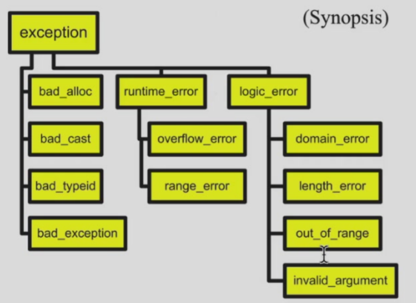  
#### Bad Exception  
Exception specification  
```cpp
void abc(int a) throw(MathErr)
/*c++ compiler doesn't know whether MathErr is handled properly
java compiler does*/
{
    ...
}
//If other exceptions thrown,compiler gives a bad exception  
void goodguy() throw (...){
//handles all exceptions
}
void goodguy() throw (){
//no exceptions
}
void average() {} //no checking
void lala() noexcept; 
//tell the compiler the function should not raise exceptions
```
### Design considerations
Exception should be used for errors
```cpp
try{
    for(; ;)
        p = list.next();
} catch (List::end_of_list) {
}
// a bad design,but python actually did it
```
Don't use exception for good conditions  
### More exceptions
#### Failure in ctor
`A* p = new A();` the space is allocated,but no pointer points to it(memory leak)  
`delete this` only for objects newed and a well-written dtor  
**two stages construction**  
Ctor cannot raise exception(only variable assignment)  
Every operation that need memory allocation should be done after ctor(Additional initialization including file,network connection & memory allocation in `Init()`)  

#### Failure in dtor
Stack unwinding:If dtor is called when handling other exceptions,and it throws an exception,call `terminate()` to terminate the programme  
```cpp
class Resource {
public:
    ~Resource() noexcept(false) { 
        throw std::runtime_error("Oops"); // dangerous!
    }
};

int main() {
    try {
        Resource res;
        throw std::runtime_error("First error"); // stack unwinding
        //two exceptions co-exists,c++ calls std::terminate()
    } catch (...) { 
        // never executed
    }
}
```

#### Design and usage
```cpp
struct X {};
struct Y : public X {};
try {
    throw Y();
} catch (X x){
    // copy ctor,loses of some info
}
//use reference instead!
```
```cpp
try {
    throw new Y();
} catch (Y* p) {
    //forget to delete 
}
//java can delete automatically,but in c++,try to avoid pointer in catch
```
**unexpected**  
```cpp
#include <exception>  
void my_handler(){
    std::cout << "Unexpected exception!\n";
    exit(1);
}
void f() throw(X,Y) {
    throw Z();
}
void main() {
    std::set_unexpected(my_handler);
    //unexpected exception go to `my_handler()`
    try {
        f();
    } catch(...){
        //won't execute
    }
}
```
**terminate**  
If an exception is thrown but not caught,`std::terminate()` will be called
```cpp
// an intercepted terminate
void my_terminate() {}
set_terminate(my_terminate);
```
#### Reminder
1.return special value is always an efficient way,don't give it up!  
2.Exception  
3.assert  

## Smart pointer Week 14
goals:reference counting(the object is pointed by how many pointers) for garbage collection     
Class `UCObject` holds the count,`UCPointer` is a smart pointer to a `UCObject`  
`UCPointer` is an object implemented using a template and overloads `operator->` and unary `operator*`  
```cpp
class String {
private:
    //char* s;
    UCObject *s; //has a reference count
public:
    string(const char* ss) {
        s = new char(strlen(ss) + 1);
        //strcpy(s,ss);
        s = ss;
    }
    ~string(){delete[] s;}
};
String abc("abcdef");
String def = abc; //copy ctor,point to "abcdef",reference count ++
abc = "Hello world"; //COW
```
### Reference counting
```cpp
//p = q
p -> decrement(); //check,if count == 0,delete this
p -> *q;
q -> increment();
```
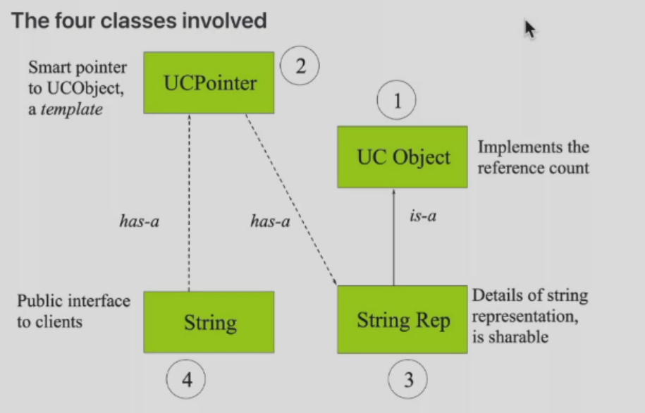  
```cpp
#include <assert.h>
class UCObject {
public:
    UCObject():m_refCount(0) {}
    virtual ~UCObject() {assert(m_refCount == 0);};
    UCObject(const UCObject&) : m_refCount(0) {} //new UCObject
    void incr() {m_refCount ++;}
    void decr();
    int refereces(){return m_refCount;}
private:
    int m_refCount;
};

inline void UCObject::decr() {
    m_refCount -= 1;
    if (m_refCount == 0)
        delete this;
}
```
```cpp
template <typename T> //we hope T is inherited from UCObject
class UCPointer {
private:
    T* m_pObj;
    void increment(){if(m_pObj) m_pObj->incr();}
    void decrement(){if(m_pObj) m_pObj->decr();}
public:
    UCPointer(T* r=0):m_pObj(r){increment();}
    ~UCPointer(){decrement();}
    UCPointer(const UCPointer<T>& p);
    UCPointer& operator=(const UCPointer<T> &);
    T* operator->() const;
    T& operator*() const {return *m_pObj;};
};

template<typename T>
UCPointer<T>::UCPointer(const UCPointer<T>& p) {
    m_pObj = p.m_pObj;
    increment();
}
template<typename T>
UCPointer<T>& UCPointer<T>::operator=(const UCPointer<T> &p){
    if(m_pObj != p.m_pObj) {
        decrement();
        m_pObj = p.m_pObj;
        increment();
    }
    return *this;
}
template<typename T>
T* UCPointer<T>::operator->() const {
    return m_pObj;
}
```
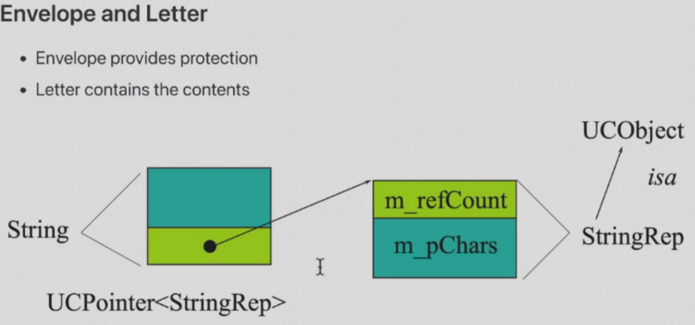  
```cpp
class String {
public:
    String(const char *);
    ...
private:
    UCPointer<StringRep> m_rep;
};
String::String(const char *s):m_rep(0) {
    m_rep = new StringRep(s);// ctor an object use the pointer
}
```
```cpp
class StringRep:public UCObject {
public:
    StringRep(const char *);
    ...
private:
    char *m_pChars;
    // no assignment op!
    void operator=(const StringRep&) {}
};
StringRep::StringRep(const char *s) {
    if(s) {
        int len = strlen(s) + 1;
        m_pChars = new char[len];
        strcpy(m_pChars,s);
    } else {
        m_pChars = new char[1];
        *m_pChars = '\0';
    }
}
```
In standard library,`std::auto_ptr` can be used as `UCPointer`  

## OOP Design Concept Week 15
### Coupling耦合
loose coupling:understand one class without reading others;change one class without affecting others  
Make the coupling between reusable parts(可重用) and other classes as loose as possible  
#### call-back
回调函数`addlistener(Listener *pl)`  
Ioc:注入反转,发出消息的类构造可接收对象，接收方构造接收子类，通过注册对象调用接收方代码
```cpp
class Listener { // 可接收对象
    virtual void action() = 0;
};
class Button { // 发出方
public:
    onpressed(){pl;} // 通过注册对象调用接收方代码
    addListener(Listener *pl);
private:
    Listener *pl;
};
class Actor(Button *pB) { // 接收方
    pB -> addListener(Actor::f()); //注册对象
    void f() {dance();}
};
class ActorListener: public Listener { // 接收子类
    void action();
};
```
#### message mech.
消息机制：  
[model1] 所以对象相互独立，但都注册在一个中央消息机制中，通过向中央发送交给另一对象的字符串实现信息传递（字符串匹配）  
[model2] 对消息机制划分角色，对象向中央注册函数  
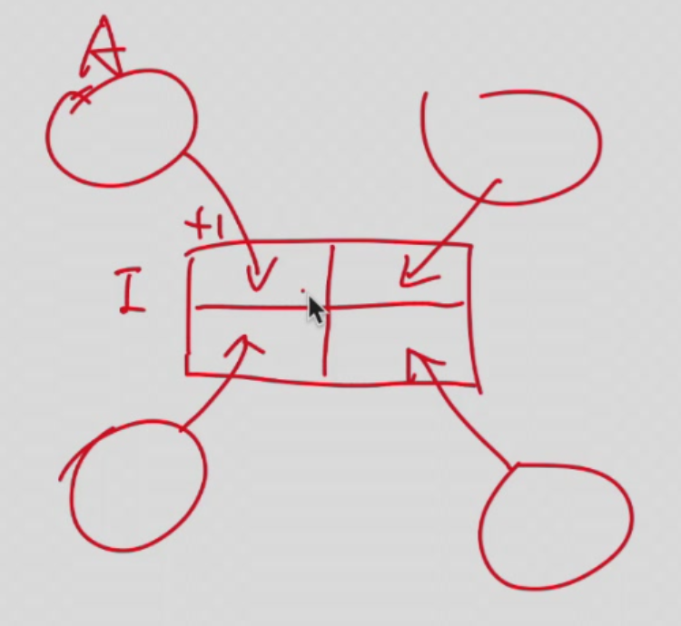  
### Cohesion内聚
[Definition] the number of diversity of tasks that a single unit is responsible for  
We aim for high cohesion  
### Code duplication  
bad design,hard maintenance 
### Responsibility-driven design  
Each class should be responsible for manipulating its own data  
**localizing change**  
When a change is needed,as few classes as possible should be affected  
### Refactoring重构
classes and methons should be refactoried to maintain high cohesion and low coupling  
Test before and after refactoring  
### extensibility  
可扩展性：如果有需求变更，代码**不经修改**就可以适应新的需求  
可维护性：如果有需求变更，代码**简单修改**就可以适应新的需求  
### Encapsulation  
having all the data member private:限制数据访问，避免非法状态，隐藏实现细节，提高安全性与可维护性，降低耦合  

## Stream Week 16
[Definition] common logical interface to a device,sequential,one-direction & 1D,produce and consume value at a certain position  
generic(iostream),file(fstream),string(sstream)  
extractor`>>`,insertor`<<`,manipulation(change the stream state,e.g.`endl`)  
### Kinds of stream
1.text stream  
text stream is a special kind of binary stream(everything in a computer is binary)  
(1)every character is readable  
(2)organized by line(`\n`)  
(3)perform some character translation(e.g. binary->text,`\n`,0d0a -> 0d by Linux kernel)  
2.binary stream  
no translation  
### Predefined streams  
`cin`,`cout`,`cerr`,`clog`  
`cerr`:unbuffered debugging output  
`clog`:buffered debugging output  
```cpp
cout << "Hello\n";
cerr << "Bye\n";
/*
    ./a.out >1   
    Bye
    cat 1
    Hello
    ./a.out 2>1  # direct cerr to 1
    Hello
    cat 1
    Bye
    ./a.out >1 2>2
    cat 1
    Hello
    cat 2
    Bye
    ./a.out >>1 2>>2 # 添加
    cat 1
    Hello
    Hello
    cat 2
    Bye
    Bye
*/
```
### Input Operation
```cpp
istream& operator>>(istream& is,T& obj) {
    return is;
}
```
`int get()`  
```cpp
int ch;
while((ch == cin.get())!= EOF)
    cout.put(ch);
```
`istream& get(char& ch)`(similar to `int get()`)  
`istream& getline(istream& is,string& str,char delim='\n');` free function  
compared,`cin.getline(char* ,int size)` is not preferred  
`cin.ignore(int limit=1,int delim=EOF)` skip over `limit` or to delimit  
`int gcount()`:how many characters read during the last operation  
`void pushback(char)` on cin:push a character back to stream  
`char peek()`:examine next character without reading it (get & pushback)  
### Output Operation
```cpp
ostream& operator<<(ostream& os,const T& obj) {
    return os;
}
```
`put(char)`:prints a single character  
`flush()`:force c++ buffer written(whether OS & disk is written cannot be determined)  
### Manipulator
`#include<iomanip>`  
```cpp
int n;
cout << "enter a number in hexdecimal" << flush;
cin >> hex >> n; //按16进制读,all cin holds the state afterwards until we meet a dec
cout << setprecision(2) << 1000.243 << endl;//精度
cout << setw(20) << "OK!";//宽度
```
`dec`,`hex`,`oct`,`endl`,`flush`,`setw(int)`,`setfill(char)`(左填充),`setbase(int)`(其他进制),`ws`(跳过空格),`setprecision(int)`  
**stream flags**  
`ios::skipws`,`ios::left`,`ios::internal`(pad between sign and value),`ios::dec`,`ios::showbase`,`ios::showpoint`,`ios::uppercase`,`ios::showpos`  
`setiosflags(flags)`(按位或),`resetiosflags(flags)`(置0),`setf(flags),unsetf(flags)`  
```cpp
#include<iostream>
#include<iomanip>
main() {
    cout.setf(ios::showpos|ios::scientific);
    cout << "123" << " " << "456.78" << endl;// +123 +40567800e+02
    cout << resetiosflags(ios::showpos) << 123; // 123
    return 0;
}
```
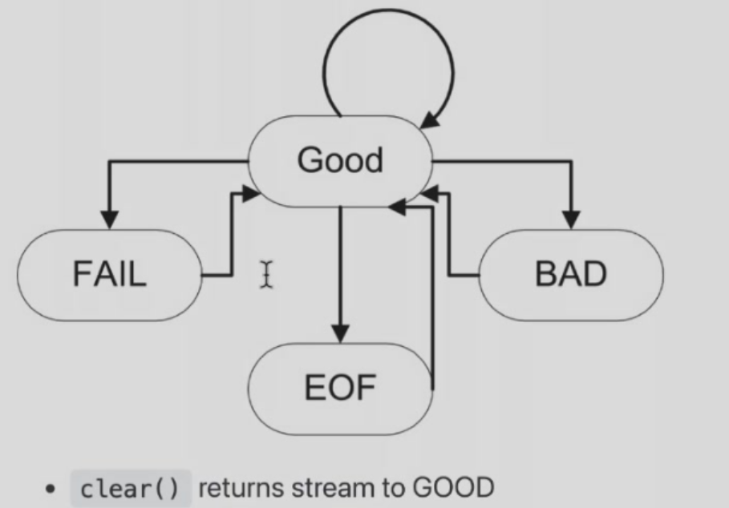  
FAIL:操作/数据问题,ignore,clear to GOOD  
BAD:用户  
checking status:`good()`,`eof()`,`fail()`,`bad()`  
```cpp
int main() 
int n;
cout << "Enter a value for n,then [Enter]" << flush;
while(cin.good()) {
    cin >> n;
    if(cin) { //an overload to int
        cin.ignore(INT_MAX,'\n'); //clear the current line
        break;
    }
    if(cin.fail()) {
        cin.clear();
        cin.ignore(INTMAX,'\n');
        cout << "Try again" << flush;
    }
}
```
### File Stream  
In C,`fopen(filename,rt)` for read text mode  
In C++,we have  
`ios::app`(append),`ios::ate`(position at the end),`ios::binary`,`ios::in`,`ios::out`  
```cpp
int main(int argc,char* argv[]) { //argv[0]:program name,argv[1]:source filename,argv[2]:target filename  
    //correct usage: ./copy source.txt target.txt
    if(argc != 3) {
        cerr << "Usage: copy file1 file2" << endl;
        exit(1);
    }
    ifstream in(argv[1]);
    if(!in) {
        cerr << "Unable to open file" << argv[1];
        exit(2);  
    }
    ofstream out(argv[2]);
    if(!out) {
        cerr << "Unable to open file" << argv[2];
        exit(2);  
    }
    char c;
    while(in >> c)
        out << c;
}
```
`open(filename,mode)`  
```cpp
ifstream inputS;
inputS.open("somefile",ios::in);
if(!inputS) {
    cerr << "Unable to open somefile"; 
    ...
```
### Cast Operators运算符
1.`static_cast`:compile time cast(int -> float,parent pointer/reference -> child,void* -> T*)  
```cpp
int main() {
    int a=10;
    double b = static_cast<double>(a);
    class Base{};
    class Derived:public Base{};
    Derived* d;
    Base* baseptr = static_cast<Base*>(&d);
    void* voidptr = &a;
    int* intptr = static_cast<int*>(voidptr);  
}
```
必须有转换规则  
2.`dynamic_cast`:for Polymorphism(recall up-casting)  
```cpp
class Base {
    virtual void foo() {}
};
class Derived: public Base {};
int main() {
    Base* baseptr = new Derived();
    Derived* derivedptr = dynamic_cast<Derived*>(baseptr);//runtime check
    if(derivedptr)
        std::cout << "Cast succeed" << endl;
    else 
        std::cout << "Cast failed" << endl;
    delete baseptr;
}
```
必须有继承关系  
3.`const_cast`:change const/volatile(易变，不能优化，必须与内存做交换) attribute  
```cpp
int main() {
    const int a = 10;
    int* b = const_cast<int*>(&a);//remove const
    *b = 20;
}
```
4.`reinterpret_cast`:any type conversion(maybe dangerous),no type check  
```cpp
int main() {
    int a = 65;
    char* chptr = reinterpret_cast<char*>(&a);
    std::cout << *chptr << endl;// 'A' in ASCII
}
```
仅考察123的使用场景

## Final Exam
不考察：右值引用，移动构造，成员变量构造初始化，代理构造  
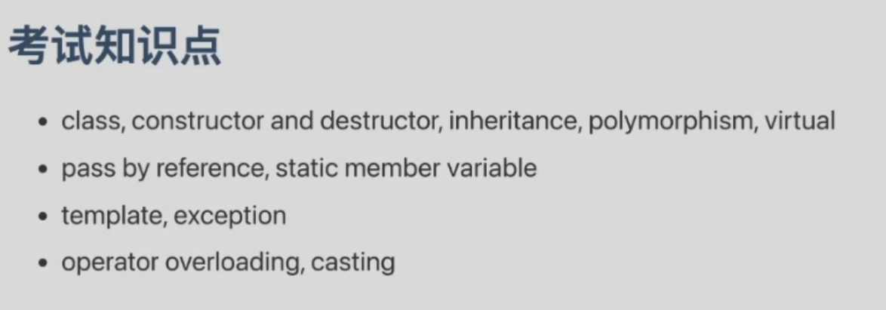  
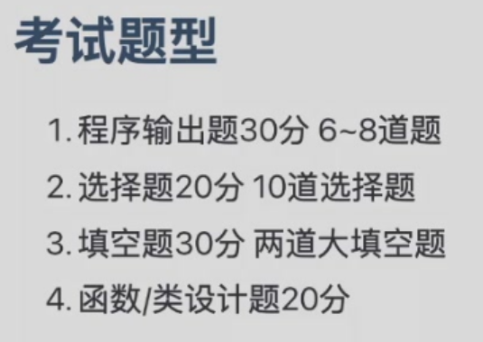  
写输出，选择，改错  
填空题:exception,overload,template...
设计题:不编译，不运行  
 
## Supplement

### namespace
命名空间：划分全局类名避免名字冲突，不同命名空间可以定义相同的变量名  
```cpp
namespace space1{
    string name = "randomstar";
    void foo();
    class cat(){
        public:
        void meow();
    };
} //no ',' or ';' here!
namespace space2{
    string name = "ToyamaKasumi";
    void foo();
}
namespace space2{
    void g();
}
int main()
{
    cout << space1::name << endl;
    using namespace space2;
    cout << name << endl;
    space1::foo();
    using space1::foo();
    using space1::cat;
    foo();
    cat c;
    c.meow();
    using namespace space1;
    using namespace space2;
    foo(); //ERROR
}
```
### typeid
```cpp
#include<typeinfo>
A *ap = new B;
std::cout << typeid(*ap).name() << std::endl;
//output:B if virtual A else A
```

[错题集](https://k5ms77k0o1.feishu.cn/wiki/wikcnH7YKB6KFCwCXgRdXk2MZAf)  