# 计算机系统III
体系结构 by Rui Chang  
OS by Yajin Zhou  
## 体系结构  
### Fundamentals of computer system Week1
Classes of computers(by Flynn)  

- SISD(single instruction single data stream):only in theory  
- SIMD(multiple):commonly used  
- MISD:only in theory  
- MIMD:current CPU  
  
Classes of computers(in textbook)  

- desktop/personal  
- server:服务器 security  
- embedded:嵌入式 immediate response  
- personal mobile  
- supercomputer(peak performance + electricity -> cooling)  
  
**Performance**  
The performance(time) can be affected by:  

- Algorithm(time complexity)  
- Programming language,compiler,architecture  
- Processor and memory  
- I/O,OS  
  
**Measuring performance**  
- Single users on a PC  
    minimization of response time   
    minimization of execution time  
- Large data  
    maximization of TP  
- Response time  
- Execution time(CPU time)  
    comprises of user CPU (execution) time and system CPU time  
  
$Performance = \frac{1}{Execution Time}$  
If X is *n* times faster than Y,then $\frac{Performance_X}{Performance_Y} = \frac{Execution Time_Y}{Execution Time_X} = n$

#### 系统量化研究方法 Quantitative approach 
**CPU Performance** 
$CPU\ Execution\ Time = CPU\ Clock\ Cycles * Clock\ Period$  
$CPU\ Execution\ Time = \frac{CPU\ Clock\ Cycles}{Clock\ Rate(freq)}$  
Performance improvement by  

- reduce number of clock cycles  
- increase clock rate  
- trade off clock rate against cycle count  
  
Average cycles per instruction(CPI)  
$CPI = \frac{CPU\ Clock\ Cycles}{Instruction\ Count}$  
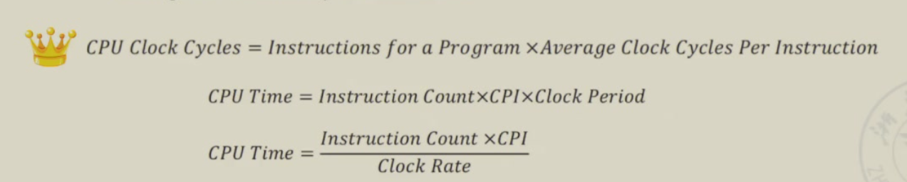  
$CPU\ time = \frac{Instructions}{Program}*\frac{Clock\ Cycles}{Instructions}*\frac{Seconds}{Clock\ Cycles}$  

#### Amdahl's Law(性能优化)  
$Improved\ Execution\ Time = \frac{Affected\ Execution\ Time}{Amount\ of\ Improvement} + Unaffected\ Execution\ Time$  
$T_{improved}=\frac{T_{affected}}{improvement\ factor} + T_{unaffected}$  

局部加速比:improvement factor  
$Speedup_{overall} = \frac{Performance\ for\ entire\ task_{using\ enhancement}}{Performance\ for\ entire\ task_{without\ enhancement}}= \frac{Total\ Execution\ Time_{without\ enhancement}}{Total\ Execution\ Time_{using\ enhancement}}$  

改进比例:$fraction = \frac{Time\ can\ be\ improved}{Total\ Execution\ Time}$ 
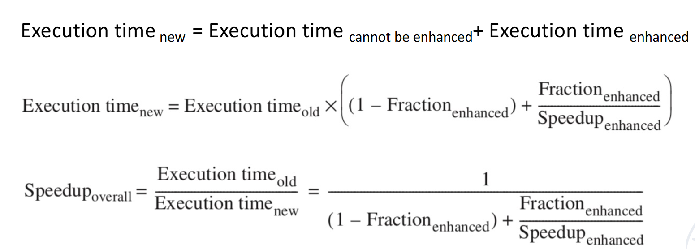
$Speedup_{overall} < \frac{1}{1-Fraction_{enhanced}}$

#### Great Architecture Ideas  

- Moore's law:number of transistors doubles every 18-24 months  
- Use abstraction to simplify design  
- Make the common case fast  
- Improve performance via parallelism  
- Improve performance via pipelining  
- Improve performance via prediction  
- Use a hierarchy(分级) of memories  
- Improve dependability(可靠性) via redundancy(备份)  
  
Below the program:  

- parallel nature of processors  
- hierarchical nature of memories  
- compiler decisions  

### Instruction-Level Parallelism(ILP) Week2 - 3 
Dependencies  

- Data dependence(RAW-read after write)
- Name dependence:rename
```asm
DIV F2,F6,F4
ADD F6,F0,F12
SUB F8,F6,F14
//anti-dependence(WAR)
DIV F2,F6,F4
ADD S,F0,F12
SUB F8,S,F14
```
```asm
DIV F2,F6,F4
ADD F6,F0,F12
SUB F2,F6,F14
//output-dependence(WAW)
DIV F2,F0,F4
ADD F6,F0,F12
SUB S,F6,F14
```
- Control dependence:Branch hazards  
  
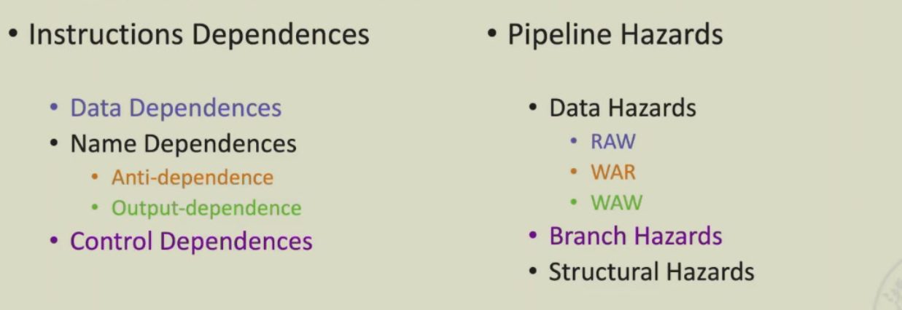  
  
Hazard  

- Structure hazard:add hardware
- Data hazard:Forwarding + stall/scheduling  
- Control hazard:branch prediction  
  
#### Branch prediction  

- static:任选
- dynamic:BTB

Delay slot:forbidden by RISC-V due to prediction  

Dynamic branch prediction  
1.Branch History Table(BHT):2-Bit predictor  
2.Instruction/Data-read/Data-write buffer(Branch-Target Buffer(BTB) in prediction)  
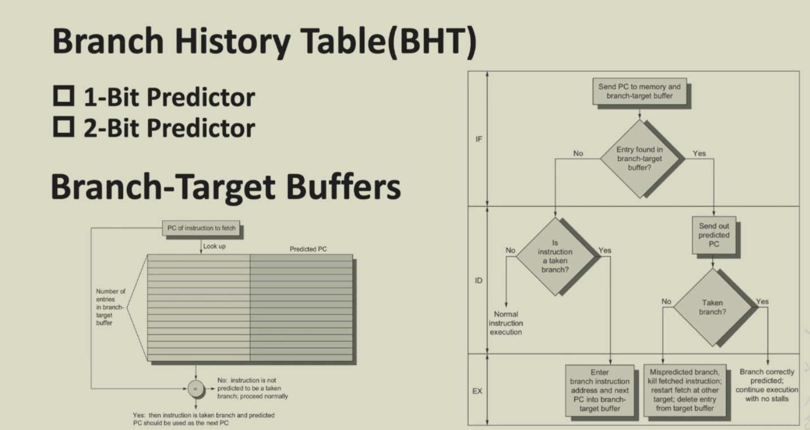  

#### Dynamic Scheduling  
simple pipelining has the limitation:  

In-order
```asm
DIV F4,F0,F2
SUB F10,F4,F6
ADD F12,F6,F14//waiting without data dependencies
```
##### Scoreboard  
Scoreboard algorithm is an approach to schedule the instructions.  

recall:hazard detection in ID  
split ID into two parts:IS(issue) & RO(read operands)  
IS:check structural hazards(in-order)  
RO:check data hazards(out of order)  
cannot flow to IS/RO if a certain hazard exists  
```asm
1.LD  F6,34(R2) //integer unit
//assume the first inst has been completed
2.LD  F2,45(R3) //integer unit structural hazard
3.MUL F0,F2,F4  //F2 F8 F0 F6 data hazard
4.SUB F8,F6,F2
5.DIV F10,F0,F6
6.ADD F6,F8,F2
```

info table design  

- Instruction status table  
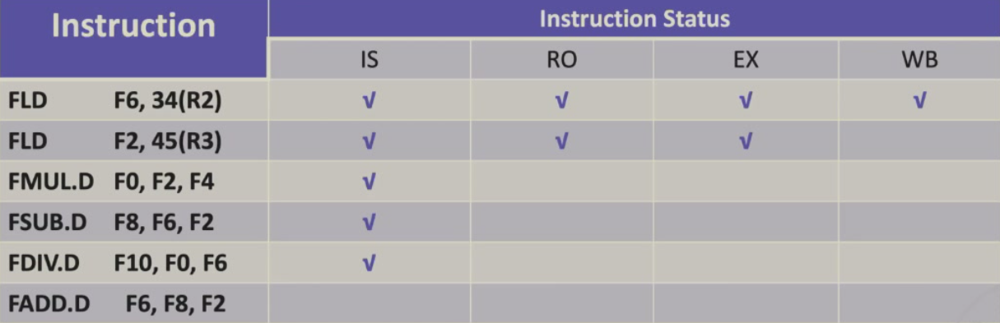
- Function component status table  
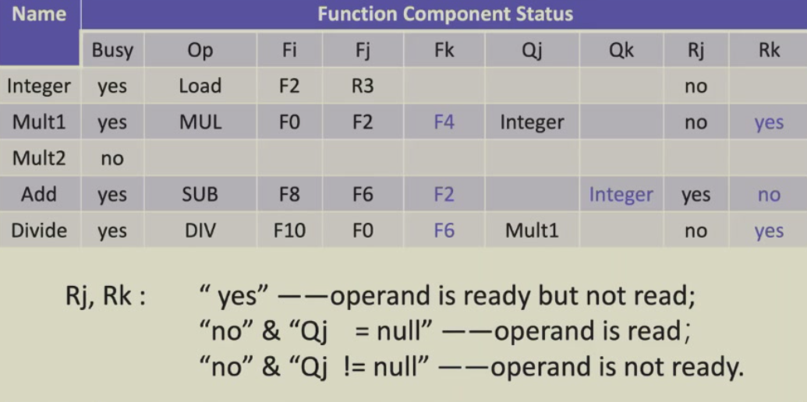
只有在某条指令执行WB后清空该指令使用的部件的一行，下一个要使用这一部件的指令才能进入IS阶段  
- Register status table
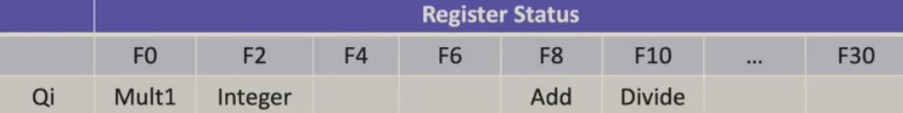
note that register status can be read from function component table,register status table is created just for convenience.  

In-class practice:
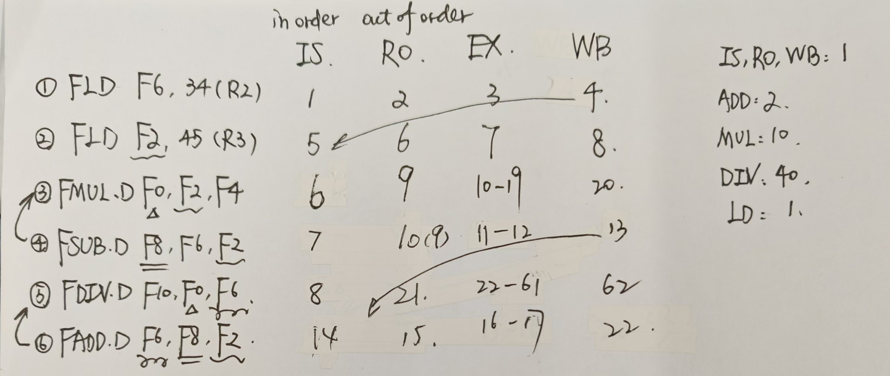

##### Tomasulo  
Tomasulo's approach is to introduce **register renaming** in hardware to minimize WAW and WAR hazards.  
```asm
1.LD  F6,34(R2) 
2.LD  F2,45(R3) 
3.MUL F0,F2,F4  
4.SUB F8,F6,F2
5.DIV F10,F0,F6
6.ADD F6,F8,F2
```
Reservation Station(RS保留站):防止因硬件冲突导致指令无法流入(上例中的4.SUB与6.ADD),在RS中执行乱序  
Command Data Bus(CDB):将指令需要的值替换为保留站的结果(6.ADD中F8的值即为adder RS的结果,保留站的名称替代了寄存器的名称),通过广播的方式使结果分布控制  
执行阶段简化为IS,EX,WB三阶段,没有解决顺序写回的问题  
IS:检查保留站是否还有空位 
EX:保留站中乱序执行,如果操作数未全部ready则等待,操作数已经ready的先执行  
WB:CDB同时将结果写入寄存器和需要的RS  
Register status Qi记录寄存器与RS的对应关系  
Instruction status table,Function component status table,Register status table(Field Qi) are still needed.

Limitation:

- Structual complexity  
- performance limited by Common Data Bus  
- correctness not guaranteed  
  
The limitations on ILP approaches directly led to the movement to multicore.

In-class practice:
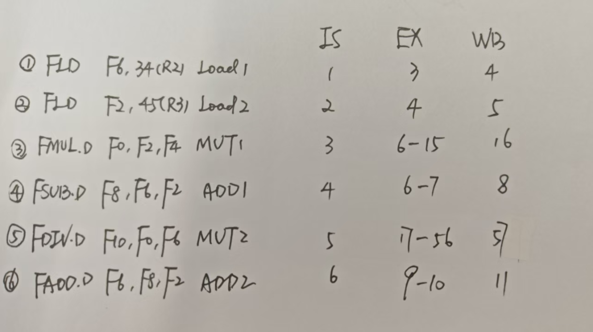

Instructions come out in order:Waiting sofa(buffer)

#### Hardware-Based Speculation 硬件前瞻
Reorder buffer(ROB) before writing back to registers  
Why reorder?  
For debug and consistency  
extend the stages of every instruction into:IS,EX,WB,Commit  
Commit:In-order write back —— the key of speculation  

- Function component status table:ROB No. in column dest in  
- ROB table:the current stages of the relevant instructions  
- Register status table:ROB row shows the registers to be written and the corresponding ROB No.
  
In-class practice:前三列同Tomasulo  
Commit列:5,6,17,18,58,59  

!!! danger "60个周期的表格变化，每个格子会填会算"  

- Precise exception  
- easily extend to other(e.g. integer)units  
- complex hardware(CDB)  
  
#### Exploiting ILP Using Multiple Issue and Static Scheduling  

- n-issue Superscalar  
- VLIW  
- Super pipeline  
  
Dynamic scheduling is more dependent on hardware,while static scheduling may not.  

Multi-issue based on dynamic scheduling:
双流入流出Tomasulo:  
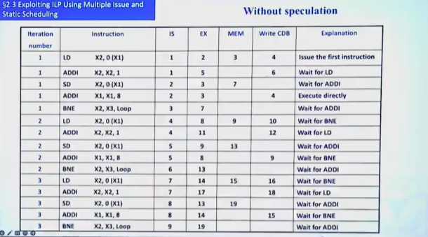  
bottleneck:data-dependent branches & ALU
With Speculation:  
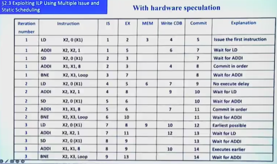  
前瞻执行：不需要等待分支结果，因为不一定要提交  
Branches are a critical performance limiter(especially with data-dependent ones),but speculation helps.  
##### VLIW
operation slots  
parallel execution in EX  
```asm
Loop:fld    f0,0(x1)
     fadd.d f4,f0,f2
     fsd    f4,0(x1)
     addi   x1,x1,-8
     bne    x1,x2,Loop
```
指令乱序/循环展开

- code length increases  
- lockstep mechanism  
- machine code incompability  

##### Superpipeline
IF IS RF EX (DF DS TC) WB

### Memory Hierarchy(Cache) Week4 - 5  
#### Introduction

- Registers  
- Cache  
- Memory  
- Storage  
  
  
- Mechanical memory  
- Electronic memory  
  SRAM:static random access memory(Cache)
  DRAM:dynamic ~(Main memory)
    DDR2(double data rate上升沿和下降沿都能传数据),DDR3,DDRSDRAM
  Flash
  ROM:read-only memory
    PROM,EPROM
- Optical memory
  
Temporal/Spatial locality时空局部性  

Cache:a safe place for hiding or storing things.  

hit/miss:whether the processor can or cannot find a requested data in the cache  
hit rate/miss rate/hit time/miss penalty  

Block run:A fixed-size collection of data containing the data we need retrieved from the memory  
Spatial locality:likely need other data within the same block soon  

#### Technology Trend
SRAM
DRAM
SDRAM(Synchronous DRAM)
DDR SDRAM
HBM:High Bandwidth Memory DRAM
SSD
HDD/TAPE

#### Memory Hierarchy
##### Cache Miss
Latency:the time to retrieve the first word of the book  
Bandwidth:the time to retrieve the rest of the book  

Miss causes  

- Compulsory:first reference(cache is empty)  
- Capacity:blocks discarded and later retrieved  
- Conflict:program makes repeated references to multiple addresses from different blocks that map to the same location in the cache  

desktop users:average latency  
server:memory bandwidth(multiple users)  
embedded:power and battery life/real-time response/small memory  

Everything is a cache.  
Registers -> L1-Cache -> L2-Cache -> Memory -> Disk  

Cache Size = Block Size * Sets + Related info(Indexes)

#### Cache Design
Using a FSM to control a simple cache  
next-state function determines the state transition  
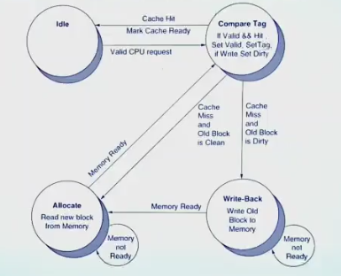  
write through写直达:write back to both cache and memory

##### 1.Where can a block be placed in the upper level?(Block placement)
###### Direct mapped
(Block address) modulo (Number of blocks in the cache):循环分配  
e.g.Cache number = 8(0-7)   
Memory 1,9,17,25 -> Cache 1  
[Problem]low space usage & high conflict probability  
###### Fully associative
Block can go anywhere in cache  
###### n-way Set associative
Each memory block maps to a cache group(n cache blocks in each group) and put memory block into certain cache block in casual  
for most caches:n <= 4

##### 2.How is a block found if it is in the upper level?(Block Identification)
Every block has an address tag that stores the main memory address of the data stored in the block 
valid bit  
index selects the set/block
direct map:tag + set index + offset  
hit if valid_bit == 1'b1 && tag == mem_addr  

##### Cache Size calculation  
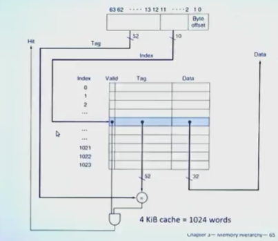  
The size of the block is One word(4 bytes)  
64-bit addresses  
2<sup>n</sup>blocks(n bits for the index)  
block size = 2<sup>m</sup>words  
tag = 64-(n+m+Byteoffset) = 64 - (10 + 0 + 2) = 52  
Byteoffset = log<sub>2</sub>block size(in bytes) = 2  
cache size = 2<sup>n</sup> * (block size + tag size + valid size) = 2<sup>10</sup> * (2<sup>0</sup> * 32(bits/word) + 52 + 1) = 85Kib.  

E.g.How many total bits are required for a direct-mapped cache with 16KiB of data and four-word blocks,assuming a 64-bit address?
ANS:16KiB = 4096words = 2<sup>12</sup>words  
block size is 4 words = 2<sup>2</sup>words,m=2  
2<sup>12</sup>/2<sup>2</sup> = 1024blocks,n=10  
data = 4 * 32(bits/word) = 128 bits(16Bytes * 8)  
tag = 64-(n+m+2) = 50 bits  
note:64-bit address = 50-bit tag + 10-bit index + 2-bit word offset + 2-bit Byte offset 映射到缓存块  
Cache Size = 2<sup>n</sup>*(block size + tag size + valid size)
= 2<sup>10</sup> * (128 + 50 + 1) = 179Kib = 22.375KiB
  
E.g.Consider a cache with 64 blocks and a block size of 16 bytes. To what block number does byte address 1201 map?  
1201 / 16 = 75(1200-1215 in the same block)  
75 modulo 64 = 11  

##### 3.Which block should be replaced on a cache/main memory miss?(Block Replacement)  
No selection is needed for direct map  
Handle cache miss:  
1.send PC to memory(PC - 4)  
2.main memory perform and wait  
3.write the cache entry  
4.restart inst execution(refetch)  
In set-associative and fully-associative,N blocks to choose for replacement.  
###### Random
###### LRU
Least-Recently Used(LRU):assumed more recently accessed blocks more likely to be referenced again  
use extra bits to keep track of accesses
###### FIFO  
First In,First Out(FIFO)  
###### OPT(In theory)  
Replace the one with the latest use in the future  
Thrashing:Loop access sequence causes no hit for FIFO/LRU  
**Block Size** affects the performance greatly  
###### Stack replacement algorithm  
B<sub>t</sub>(n) represents the set of access sequences contained in a cache block of size n at time t.  
B<sub>t</sub>(n) is the subset of B<sub>t</sub>(n+1).  
**LRU** is a stack replacement algorithm.  
**FIFO** is **not** a stack replacement algorithm.(Belady)  
Least-Recently Used is pushed to the bottom of the stack  
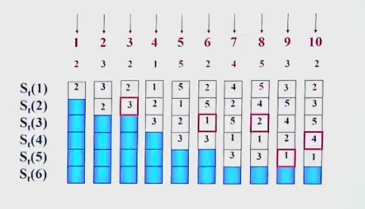  
###### Implementation  
Comparison pair flip-flop  
e.g.three cache blocks(A,B,C)  
take pair AB,AC,BC  
T<sub>AB</sub>:A is accessed later than B  
T<sub>AB</sub>,T<sub>AC</sub>,T<sub>BC</sub> represents the sequence of access by applying triggers and gates  
**huge block number**:Layered comparison  

##### 4.What happens on a write?(Write Strategy)
When data is written into the cache,is the data also written to main memory?  
Write Through  

- can always discard cached data  
- only a valid bit  
- memory always have the latest data  
  
Write Back

- can't discard  
- valid bit and dirty bit(cache与memory不一致)  
- much lower bandwidth
  
**Write hit**
write buffer(write through)
**Write miss**

- write allocate
  block is loaded into the cache(write back)  
- write around
  block is only written to main memory(not stored in the cache) 

**Read allocate**
memory -> cache  
read from cache
**Read through**  
E.g.Assume a fully-associative write-back cache(empty)  
What are the number of hits and misses using no-write allocate vs. write allocate?  
**no-write allocate**  
```asm
write Mem[100];  //miss ,not write to cache
write Mem[100];  //miss ,not write to cache
read Mem[200];   //miss ,read into cache
write Mem[200];  //hit
write Mem[100];  //miss ,not write to cache
```
**write allocate**  
```asm
write Mem[100];  //miss write to cache
write Mem[100];  //hit
read Mem[200];   //miss ,read into cache
write Mem[200];  //hit
write Mem[100];  //hit
```
#### Virtual Memory  
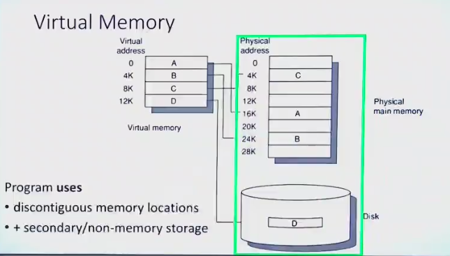
#### Memory System Performance
Memory Stall  
Average Memory Access Time(AMAT)
$AMAT = (HitTime + MissRate * MissPenalty)$
E.g.Impact on performance  

#### *CPU Vulnerability
##### Meltdown  
利用Intel CPU乱序执行，利用内存响应时间越界访问  
##### Spectre 
利用Cache预取指令获取私密信息  

### Cache Optimization presentation Week 6

## OS  
### Main Memory Week7 - 10
#### Partition
using physical memory  
multi-programming:partition  
protection,fast-execution,fast context switch  
Once process starts,partition cannot be moved  
Solution:logical address(offset within the partition相对地址)  
Simple implementation:base and limit(length) registers(privileged)  
between base and base + limit:segmentation  
limit check for protection  

- built-in protection  
- fast execution(hardware)  
- fast context switch(only change base and limit)  
- norelocation of program address  
- partition can be suspended and moved at any time  
  
##### Memory allocation strategy
**fixed**    
same size causing **Internal Fragmentation**(分配的用不完)  
**variable**
**External Fragmentation**(有空process但放不进)  
first-fit,best-fit,worst-fit  

#### Segmentation
.text,.data,... have different authority,can they be put into the same partition?    
No,we map one process to n partitions(each is called a segmentation)  
[Problem] Insufficient base and limit registers  
[Solution] Segment table:an array where each entry has base and limit and perm(permission)  
Every process has a segment table  
Only a base register is needed to point to the segment table  
Every entry represents a segmentation  
logical address now is a pair:<segment_number,offset>  
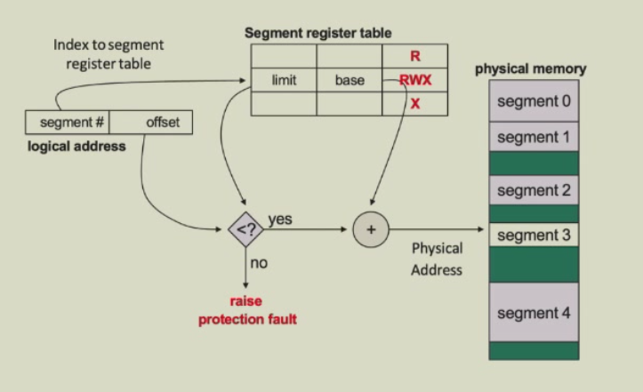  
limit can be changed,therefore it is a variable allocation,no internal fragmentation but **external fragmentation**  
Segmentation is used effectively in Unix(before paging because of small amount of additional hardware)  
**address binding**  
source code(symbolic) -> compiler(relocatable) -> linker(absolute)  
Memory-Management Unit(MMU):a translator from logical addr to physical addr  

#### Paging  
basic idea:cut the process,making it noncontiguous(avoids external segmentation)  
divide **physical** addr into fixed-sized blocks called **frames**(帧)  
divide **logical**(virtual) addr into blocks of same size called **pages**  
Set up a mapping to translate logical to physical addr,this mapping is called **page table**(index page,value frame)(not stored in the pages)  
**Internal fragmentation**  
fixed length partition  
page size:2048,program size:72766(35 pages + 1086bytes)  
internal fragementation = 2048 - 1086 = 962  
Nowadays,the page size is getting bigger because we allow waste in memory(memory is cheaper)  
frame table:which frame is free,how many frames have been allocated,... helps OS manage physical address  
logical addr = <Page_number(p),Page_offset(d)>  
m-n bits for page_number,n bits for page_offset  
m = 32 or 64,n = log<sub>2</sub>(page_size)  
x86:2<sup>32</sup> = 4GB  
##### Implementation  
Page-table base register(PTBR),Page-table length register(PTLR)  
[Problem] Access page table to find frame number needs one memory access while actually read the data in memory needs another memory access  
[Solution] cache the translation to avoid one memory access(TLB:Translation Look-aside Buffer)  
hardware implementation:associative memory  
tag TLB entries with address-space identifier(ASID)that uniquely identifies a process when context-switch  
Associative memory supports parallel search  
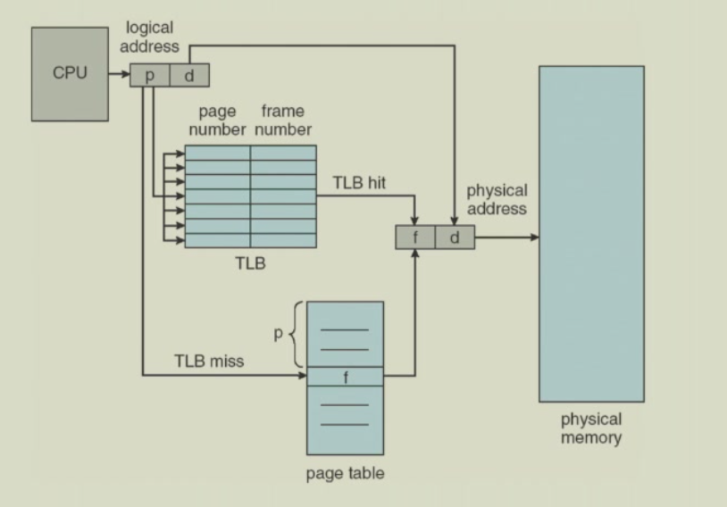  
**Effective Access Time**
EAT = hit_ratio * memory_access_time + (1 - hit_ratio) * 2 * memory_access_time  
In modern design,hit_ratio is approximately 99.9%  
Increase the page size helps improve the hit ratio(memory_access_size = TLB_size * page_size)  
**Memory Protection**  
present(valid) bit and permission bits in page table  
**Page Sharing**  
Run a program multiple times:.text can be shared but .data cannot be shared  
##### Structure  
[Question] 32-bit logical address space & 4KB page size,what is the page table size?  
4GB/4KB = 1M entries(page table lines)  
1M * 4B = 4MB(must be physically contiguous because another table needed for mapping if page table is splited)  
If we have 1K processes,simply page tables occupies the whole memory  
[Insights] Many indices are invalid  
[Solution] break down page table into pages  
Page size is 4KB,how many entries can fit in one page?  
one entry is 4B,thus we have 1K entries/page    
1M entries can be broken down to 1K pages,indexed by 1K entries,put into another page(4KB)  
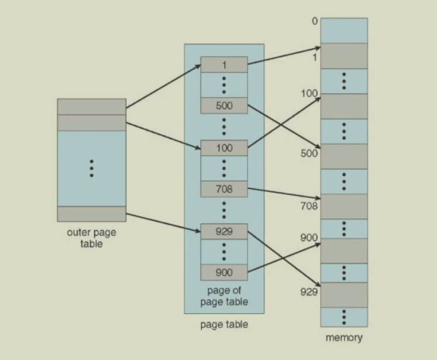  
[Advantages] Pages don't need to be contiguous,and no page allocated if invalid in the first level  
logical addr = <page_directory_number(first_level),page_table_number(second_level),offset>
12-bits offset:4K(Page size)(stored in the last-level pages)  
10-bits page_directory_number and 10-bits page_table_number:1K entries per table  
If page size is 64KB,we have 16-bits offset,14-bits page_table_number and 2-bits page_directory_number  
Page Table in Linux:page table base register CR3(arm:TTBR,RISCV:SATP,x86:PDBR)(store **physical addr**,otherwise another table for mapping is needed)
64-bit logical address space:16EB(4G * 4GB)  
Page table entry:8B page table size:4KB  
Entry number/page = 512  
3-level page:12 + 9*3 = 39bits(512GB Phone)  
4-level page:48bits(256TB Server)  
5-level page:57bits(128PB AI)  
PTE,PMD,PUD(upper),P4D,PGD(global directory)  
##### Hashed page table  
virtual page number is hashed into frame number  
using linked list if two page number has the same hash value  
high collision probability & need contiguous addr  
##### Inverted page table  
[Insights] physical addr space << virtual addr space  
[Solution] index by physical addr  
Each entry has a pid and virtual page number  
need traverse the whole page table & no memory sharing  
##### Swapping  
[Definition] extends physical memory with backing disks(用硬盘换内存)  
Context switch becomes veryvery slow  
Swapping is unfriendly to SSD/flash memory  
Android terminates apps if low free memory  
Intel IA-32 Page Address Extensions(PAE):page table entries to 64bits,but 2-bits for a 4 entry table  
Intel IA-64 6 segmentations  
ARM:no segmentations  
##### Practice  
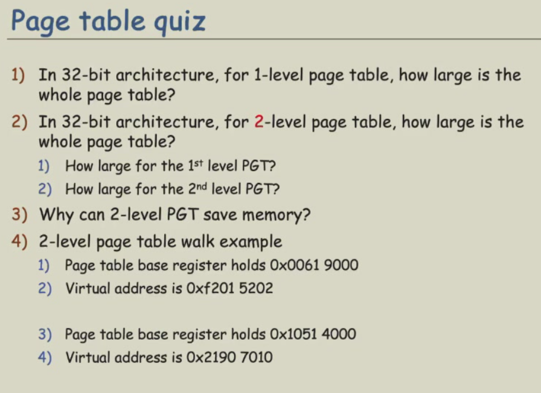  
1)4GB/4KB = 1M entries,1M * 4B = 4MB  
2)1ST:4KB,2ND:1K * 4KB = 4MB  
3)Pages don't need to be contiguous,and no page allocated if invalid in the first level  
4)10-bits page_directory_number,10-bits page_table_number,12-bits offset  
0xf2015202 = 0b1111001000|0000010101|001000000010(968,21)  
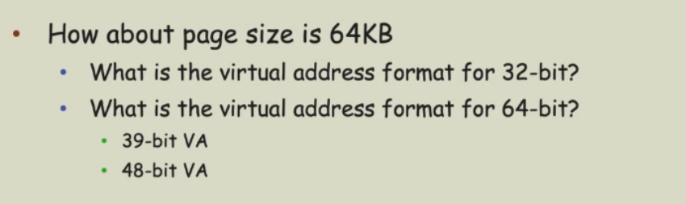  
32-bits:2+14+16  
39-bit VA:10+13+16(减少一级)  
48-bit VA:6+13+13+16  
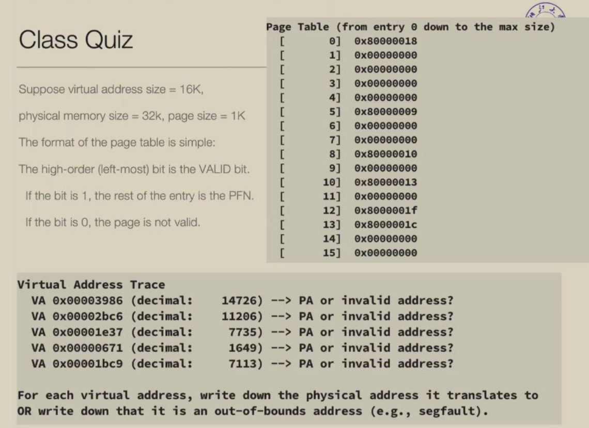  
offset:log<sub>2</sub>(page_size) = 10
page_number:32-10 = 22
0x00003986:0b0000000000000000001110|0110000110  
page_number:14 invalid  
0x00002bc6:0b0000000000000000001010|1111000110  
page_number:10 offset:0x000003c6  
addr = 0x13 << 10 + 0x000003c6(低10位)  

#### Virtual Memory  
[Insights]Code needs to be loaded to memory in execution,but the entire program is rarely needed at the same time  
[Solution]partially-loaded program  
demand paging:brings a page into physical memory only when accessed  
lasy swap:never swap a page unless accessed  
pre-paging:predict pages may be accessed later  
invalid -> page fault  
##### Page fault
(1)invalid reference -> exception  
(2)valid reference but not in memory -> swap in  
page fault handling  

- get an empty physical frame  
- swap page into frame via disk operation(maintained by free-frame list)  
- set page table entry to indicate the page in memory  
- restart the instruction  
  
tell OS to map by `syscall`(brk,mmap),not actually allocation until demand  
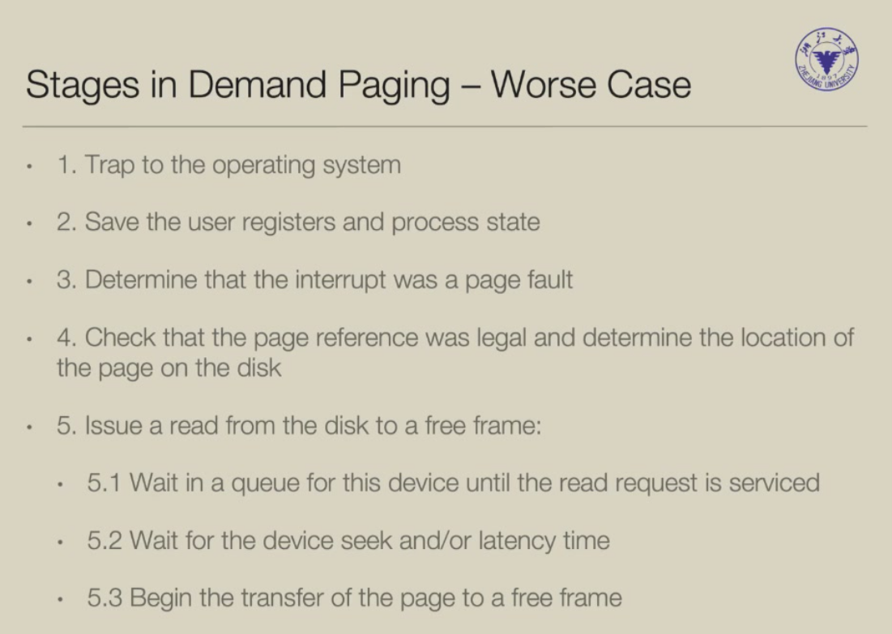  
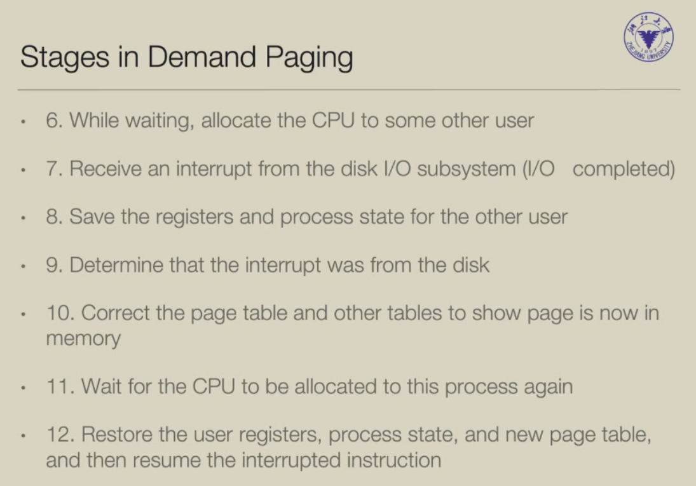  
allocate free frames using **zero-fill-on-demand**  
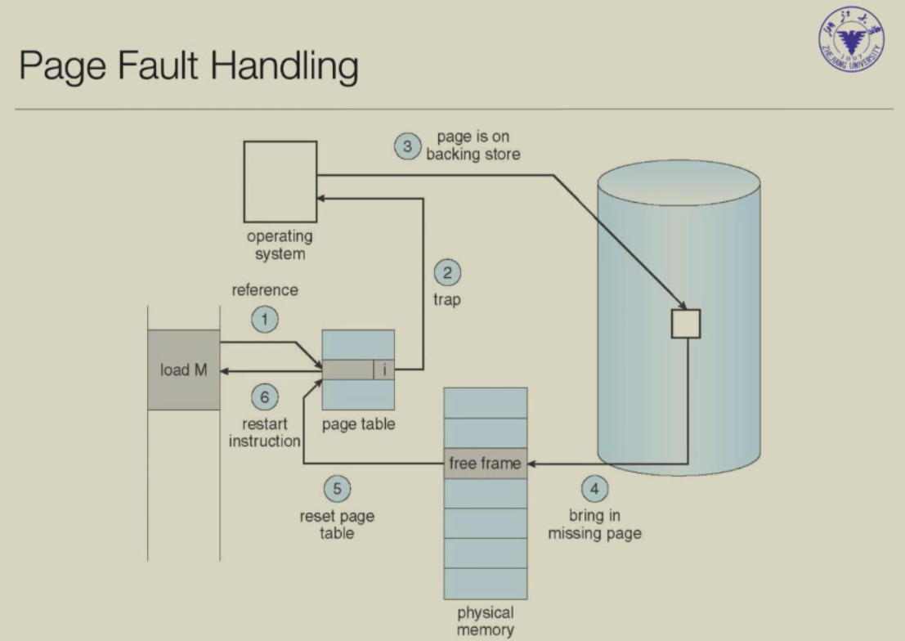  
EAT:page fault rate:p  
EAT = (1-p) * memory access time + p * (page fault overhead + swap out + swap in + instruction restart overhead)  
Copy-on-Write(COW):allows the parent and child processes(fork()) to initially share the same pages in memory as long as no process modify(write) it.  
If either process writes the COW page,OS copies the page and set the page writable  
Page replacement:no free page when needed  
[Solution] swap out some pages to swap分区  
[Question] How to select victim page to avoid thrashing?  
Dirty bit:whether the page is modified after loaded?  
We can directly replace the pages if not dirty  
page fault handling with replacement  

- find the location of the desired page on disk  
- find the free page  
  if there is a free page,use it  
  if there is none,pick a victim frame
    if the frame's dirty,write to the disk  
- update the page table  
- restart the instruction  
 
potentially **2 page I/O** for one page fault  
Page replacement algorithm:FIFO,optimal,LRU,LFU,MFU  
For FIFO,adding more frames may cause more page faults(Belady's anomaly)(not stack replacement)  
(Enhanced) Second-Chance Algorithm:take order pair(reference,modify(dirty))(0,0 > 0,1 > 1,0 > 1,1)  
Page-Buffering Algorithm:always keep a pool of free frames  
##### Allocation  
Fixed(Local) allocation per process  
Global allocation  
Reclaiming pages  
memory below minimum threshold:choose process to kill according to OOM scores  
Major page fault:page is referenced but not in memory  
Minor pape fault:mapping does not exist,but page in memory  
  shared library  
  reclaimed and not freed yet  
Non-Uniform Memory Access(NUMA):speed of access to memory varies(multi-core and multi-core-correspond-memory)  
allocating memory "close to" the CPU by scheduler  
##### Thrashing
[Definition] a process does not have enough pages,causing higher page fault rate,page fault to get page,existing existing frame,but quickly need replaced frame back,thereby **a process is busy swapping pages in and out**  
Why does thrashing occur?total size of locality > total memory size  
[Solution] 
1.using local or priority page replacement(one process thrashing does not affect others)  
2.provide a process with as many frames as it needs  
**Working-set Model**  
Working-set window(Δ):a fixed number of page references
working set of process p<sub>i</sub>(WSS<sub>i</sub>):total number of pages referenced in the most recent Δ  
total working sets:D = ΣWSS<sub>i</sub>,monitor the total working set by suspending and swapping out to make D < m  
[Challenge] keep track of the working set  
[Solution] page-fault frequency(PFF) to check the pressure of process memory,swap out a process is PFF is too high  
##### Kernel Memory Allocation  
allocated from a free-memory pool  
for device I/O,kernel memory needs to be physically contiguous  
**Buddy System**:memory is allocated in units of the size of power of 2  
split the unit into two buddies until a proper sized chunk is available  
E.g.256KB is available,21KB is requested  
256KB -> 128KB -> 64KB -> 32KB = 21KB_round_up  
**Slab Allocator**:a slab contains one or more pages,divided into equal-sized objects  
a cache in a slab allocator consists of one or more slabs  
fast small kernel object allocation and small internal fragmentation,object fields may be reusable,no need to initialize again  
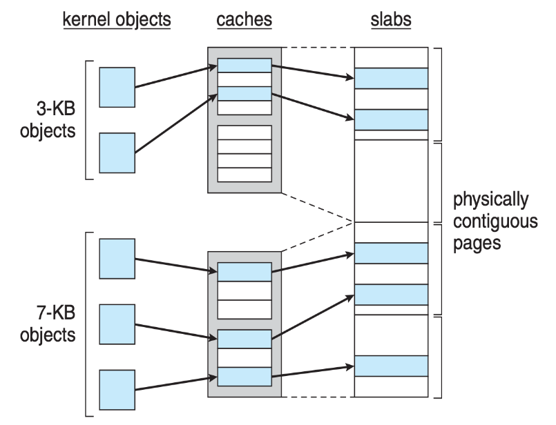  
kmem_cache -> slabs_full/partial/empty -> slab -> page -> object  
`kmalloc()` -> small object using slab/huge object using buddy system:ensuring contiguous PA  
`vmalloc()`(similar to `malloc()` in user space):huge space requirement but no need contiguous PA   
##### Other considerations  
**Prepaging**
**Page Size**(and reason)  

- Fragmentation:small page size  
- Page table size:large  
- Number of page faults:large  
- TLB(page table entry cache) size:large
- Locality:small  
- I/O overhead:large(every page fault needs an I/O)  
- always a power of 2  
- growing over time  
  
**TLB Reach**:the amount of memory accessible from the TLB  
TLB Reach = TLB size * page size  
**Program structure**  
int[128,128],each row is stored in one page,and only one entry in the TLB  
```c
for(j = 0; j < 128 ; j++)
  for(i = 0; i < 128; i++)
128*128 = 16384 page faults
for(i = 0; i < 128 ; i++)
  for(j = 0; j < 128; j++)
128 page faults
```
**I/O interlock**:pages that are used for copying a file from a device must be locked from being selected for eviction  
#### *Free Space Management  
In virtual memory space,  
[Mechanism] splitting and coalescing(合并)  
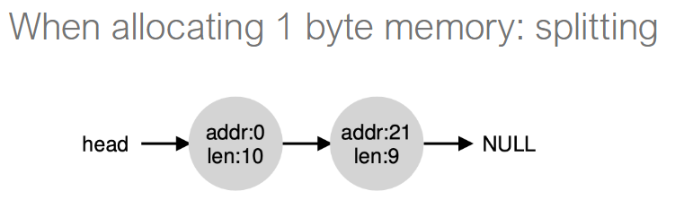  
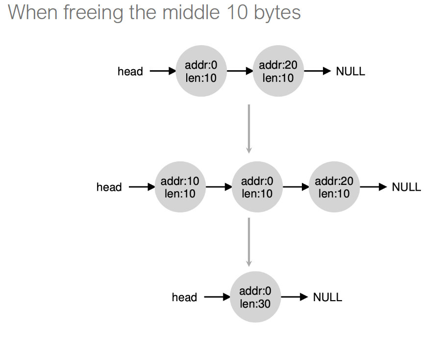  
[Problem] the storage of the linked list  
[Solution] reuse the freed space    
```c
typedef struct __header_t {
  int size;
  int magic;
} header_t;

typedef struct __node_t {
  int size;
  struct __node_t* next;
} node_t;

void free(void *ptr) {
  header_t *hptr = (void*)ptr - sizeof(header_t);
  ...
}
```
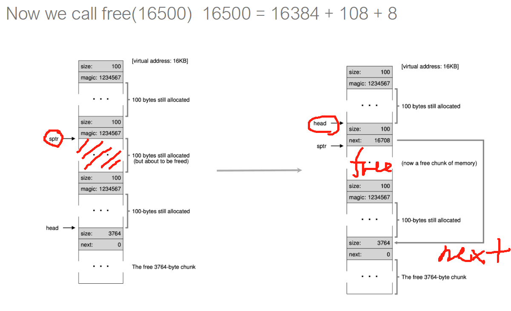
16500:a space addr pointer
[Question] What is 16500 does not point correctly,e.g.,16508(where size and magic can be cotrolled by user)堆喷  

[Virtual_Memory_Quiz(2024final)](notebook/docs/sp25/sys3/virtual_memory_quiz.pdf)  

??? success "answer"

    CDAC

    a.VA 15 = 10(VPN) + 5(OFFSET)  
      PA 12 = 7(PFN) + 5(OFFSET)  

    b.Virtual Address 0x17f5:0b00101(pde index)|11111(pte index)|10101(PA offset)  
    pde content from PDBR(108),pte content from pde content(84)  
    Value:0x1c from pte content & PA offset(78,21)  
    PA:0b1001110(78),0b10101(21)->0b100111010101->0x9d5  

### File System Week10 - 12
#### File System Interface
[Definition] file is a contiguous logical addr space for storing info  
proc file system - use file system **interface** to retrieve system info(not real data in storage),an alterative of syscalls,using read,open and write  
File attributes:name,identifier(tag),type,location,size,protection(permission,e.g.777,access control list(ACL)),time/user identification,checksum,...  
File operations:

- create:space for file allocated;entry allocated in the directory  
- open:return a handler for other operations  
```c
fd = open(path,...);//file descriptor
//per process mapping[fd,file]
read(fd,...);
```
- read/write:maintain a pointer  
- seek:reposition the pointer within the file  
- delete:release space,hardlink(delete a file until all the pointers relate to it are deleted),truncate(delete a file but maintains its attributes)  
- copy:create and read/write  
  
Open files:**open-file table**(info about all opened files,per-process(position,access right;differ in processes) & system-wide(location on disk))  
Info:file position(per-process),file-open count,disk location,access right  
*lock:shared lock & exclusive lock  
file types:magic number(.exe,.o,.c,.txt,...)  

#### File structure  

- no structure:linux  
- simple record structure:database  
- complex structure:word document,relocatable program file  
  
Access methods:  
sequential access:tape  
direct access(random access):access an element of arbitary position in (roughly) equal time  
other method:multiple layers of index points to blocks  

- directory structure:a collection of nodes containing info about all files  
- disk structure:subdivided into partitions(分区),each volume(partition) tracks file system info in the volume's table  
  raw disks(no partition,no file system):preferred in database  

Directory operations  

- create
  LinkAT FileName,INode  
- delete  
- list  
- search  
- group(locally group files by properties,e.g. all java project)  
  
##### Single-Level Directory
A single directory for all users  
[Problem]  
two users can't have same file name  
hard to group files  
##### Two-Level Directory
Separate directory for each user  
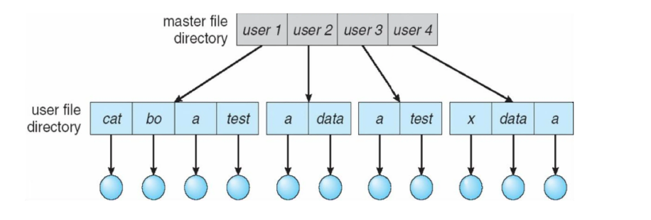  
[Problem]  
no file sharing  
##### Tree-Structured Directory
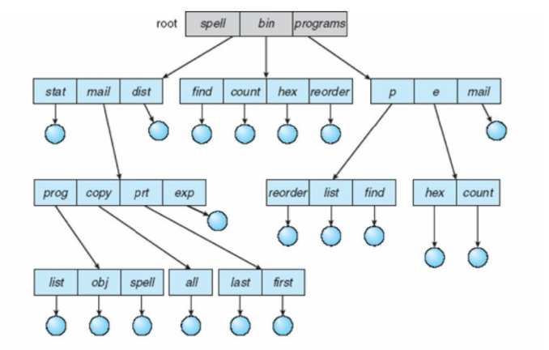  
efficient searching,grouping and naming  
File can be accessed using **absolute** or **relative** path name  
absolute path name: /home/alice/..  
relative path(`pwd`):<current_directory>/...
Delete:  
Option I:`rm` directory cannot delete unless it's empty  
Option II:`rm -rf` delete all files,directories and sub-directories  
##### Acyclic-Graph Directory  
allow links to a directory entry/files for aliasing(renaming)  
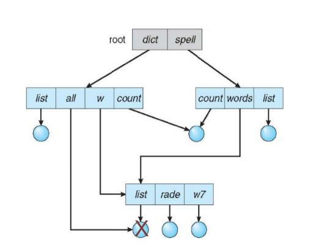  
[Problem] Dangling pointer(悬挂指针)  
Delete /dict/all,then /dict/w/list & /spell/words are dangling pointers  
[Solution]  
backpointer:record all the pointers to the entry  
reference counter:count # of links to it,only delete when counter = 0  
```c
//dangling pointers
char *ptr = malloc(size);
char* ptr1 = ptr;
free(ptr);
ptr = null;
//ptr1 is a dangling pointer
```
[Advantage] Shared files  
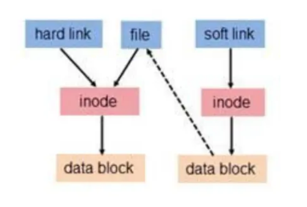  
metadata in `inode`  
link:多个文件路径指向同一文件  
hardlink:多个文件名指向同一个`inode`  
softlink(symbolic link):datablock存放真正link的路径(快捷方式)  
```sh
/home/
  file
  file1
  file2
Directory:Name  inode
          file  500
          file1 500
          file2 501 block#1000(/home/file)
```
`file1` automatically removed if `rm /home/file`  
softlink need multiple searches and may cause broken link(linked file not exist)  
hardlink deletes the datablock only when the links are all deleted  
softlink can link files cross-filesystem  
**cycles in graph structure**  
garbage collection & cycle detection algorithm  
##### Mounting  
A file system must be mounted(挂载) before it can be accessed,e.g.插入U盘  
a mounted file system makes the old directory at the mount point invisible  
##### File Sharing
protection by user ID & group ID  
NFS(Network File System)  
#### ACL
ACL(Access Control List)  
fine-grained control(精细控制防止过度授权) but list management is a big deal  
**UNIX Access Control**  
默认没有设置ACL但是支持  
user types:owner(RWX),group(RW),others(X)  
```sh
chmod 761 game
# 7 for owner,6 for group,1 for others
```
**fork()**
```c
int main(int argc,char* argv[]) {
  int fd = open("./file.txt",O_RDONLY);
  lseek(fd,5,SEEK_SET);

  int rc = fork();
  if(rc == 0) {
    printf("child: fd %d\n",fd);
    rc = lseek(fd,10,SEEK_SET);
    printf("child: offset %d\n",rc);
  }
  else if (rc > 0) {
    (void) wait(NULL);
    printf("parent: fd %d\n",fd);
    printf("parent: offset %d\n",(int)lseek(fd,0,SEEK_CUR));//5?
    //10 actually
  }
  return 0;
}
```
Per-process access table but not a deep copy for file descriptors(they point to the same handle)  
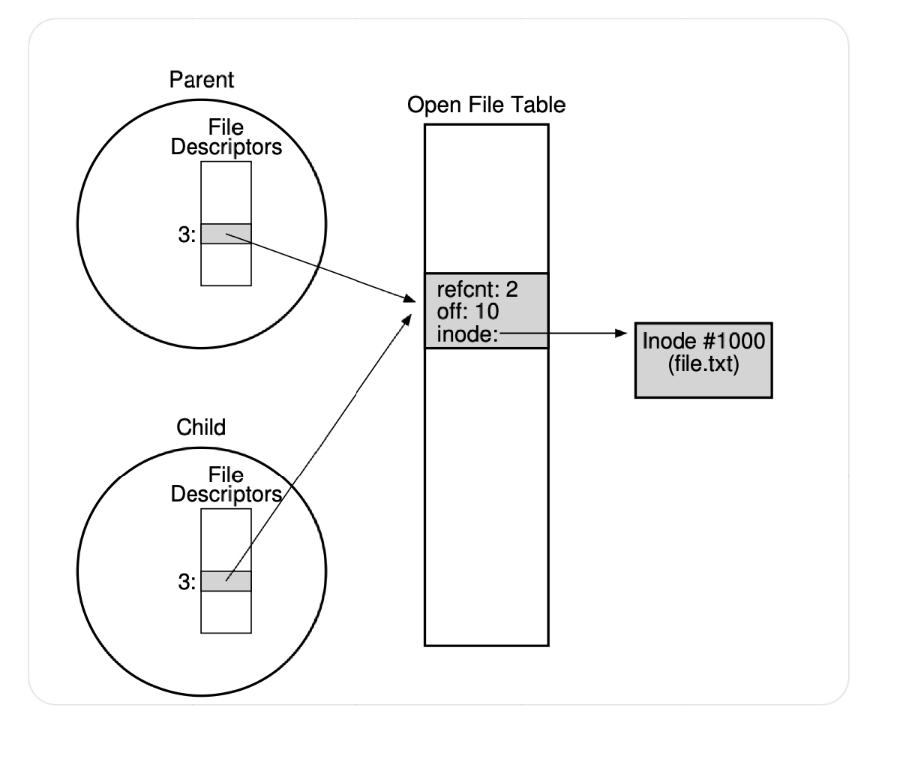  
```c
  if(rc == 0) {
    close(fd);//file descriptor leak
    int fd = open("./file.txt",O_RDONLY);
    /*
    a good way is to close parent process' file descriptor 
    before operations in child
    /*
    ...
  }
```
#### File and Directory  
File:linear array of bytes,each has an inode number  
Directory:a list of user-readable name to inode number mapping,each entry points to file or other directory  
**create**  
```c
int fd = open("foo",O_CREAT | O_WRONLY | O_TRUNC);
/*
O_CREAT:create if not exists
O_WRONLY:can only write
O_TRUNC:truncate it to zero bytes if the file exists
*/
```
```sh
echo hello > foo
cat foo
# hello
strace cat foo #查看系统调用 open("foo",O_RDONLY) = 3
# read(3,"hello\n",131072) = 6
# write(1,"hello\n",6hello) = 6 
# read(3,",131072) = 0
```
**seek**  
```c
off_t lseek(int fildes, off_t offset, int whence);
/*
whence == SEEK_SET,offset = offset_bytes
whence == SEEK_CUR,offset = current_location + offset_bytes
whence == SEEK_END,offset = size_of_file + offset_bytes
*/
```
**write**  
```c
int fd = open("foo",O_CREAT | O_WRONLY | O_TRUNC);
assert(fd > -1);
int rc = write(fd,buffer,size);
assert (rc == size);
rc = fsync(fd);//forces all dirty data to disk
assert(rc == 0);
```
**stat**  
```c
stat foo
// File: 'foo'
// Size: 6 Blocks: 8 IO Block: 4096 ...
// ...
```
**remove**  
```sh
strace rm foo
# unlinkat(AT_FDCWD, "foo", 0) = 0
```
`rm`:unlink the file and check the Reference count of the inode  
free the inode until the reference count == 0  
**mkdir**  
```sh
strace mkdir foo
# mkdir("foo", 0777) = 0
ls -al
# drwxrwxr-x 2 os os 4096 <time> .
# drwxrwxr-x 3 os os 4096 <time> ..
```
Empty directory has two entries('.' for current,'..' for upper level)  
**read directory**  
```c
int main(int argc,char* argv[]) {
  DIR *dp = opendir(".");
  assert(dp != NULL);
  struct dirent *d;
  while((d = readdir(dp)) != NULL) 
    printf("%d %s\n",(int)d->d_ino,d->name);
  closedir(dp);
  return 0;
}
/*
struct dirent {
  char d_name[256];
  ino_t d_ino;
  off_t d_off;
  ...
}
*/
```
**link**  
`link()` system call:takes two arguments,an old pathname and a new one  
```sh
ln file file2 # link(hardlink)
ls -i file file2
# same inode number
```
```sh
echo hello > file
ln -s file file2 # Symbolic link(softlink)
# filepath in datablock of file2  
rm file
cat file2
# No such file or directory  
```
**TOCTTOU**  
*Time of Check to Time of Use
```c
if (access("file", W_OK) != 0) //check
  exit(1);
//schedule ?
//symlink("/etc/password","file");
fd = open("file", O_WRONLY);
write(fd, buffer, sizeof(buffer)); //use
```
`O_NOFOLLOW`:fail if pathname is symbolic link  
#### File System Implementation  
File system resides on secondary storage(disks)  
disk driver provides interface to read/write disk blocks  
file system provides user interface to storage,mapping logical to physical  
file control block(inode)  
##### Layered File System  
0.I/O control--device drivers  
1.basic file system  
2.file-organization module  
3.logical file system
##### Implementation  
**on-disk structure**(storage)  

- file control block:perm,dates,ACL,size,data block/pointer to data block(same data inside and other data stored in other place and pointed by a pointer)  
- boot control block:contains info to boot OS(per volume)  
- volume control block(superblock):volume details,including total block number,block size,free blocks & pointers,free FCB & pointers(per volume)  
  FCB count is fixed when formatting the disk for high efficiency  
  expand if FCB is full  
- directory structure(per file system)  
  
**in-memory structure**(access)  

- mount table  
- in-memory directory structure cache  
- system-wide open-file table:copy of FCB  
- per-process open-file table:pointers to entries in system-wide open-file table and other info  
- I/O memory buffers  
  
**creation**  
1.FCB allocation  
2.link inode & name
3.directory update  
In UNIX,directories are treated equally as files,which is different from Windows  
**open**  
1.search system-wide open-file table:already opened?  
  It it is,create a per-process open-file table pointing to the existing system-wide open-file table  
  If not,search the directory for the file name,place the FCB in system-wide open-file table once found  
2.make an entry in per-process open-file table with pointers to the entry in the system-wide open-file table(FCB in system-wide)  
3.increment the open count in the system-wide open-file table  
4.return a pointer `fd` to the entry in per-process open-file table  
**close**  
1.remove per-process open-file entry  
2.decrement open count  
3.all processes close file -> copy info to disk,remove system-wide open-file table  
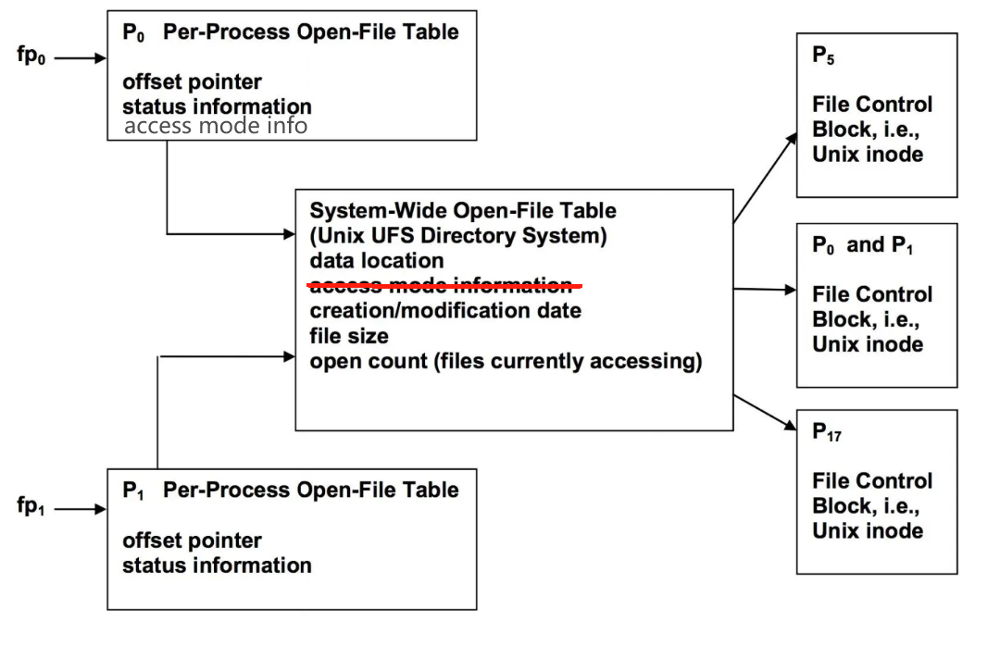  
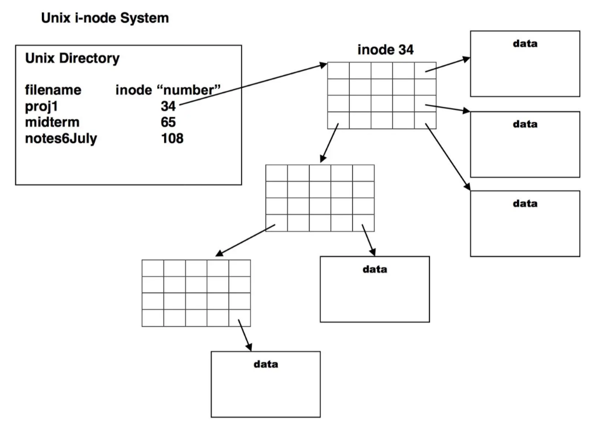  
**mount**  
Boot block:series of sequential blocks containing bootloader  
In-memory mount table:mount points,type of file system mounted,access path,(UNIX)a pointer to the superblock(global metadata,fixed location on disk)  
**Virtual File System**  
VFS:an object-oriented way for implementing file systems  
VFS object types:superblock,inode,dentry(associates name to inode),file  
**Directory**  
Linear list of file names;hash table(faster search but collsion)  
##### Disk Block Allocation  

- contiguous allocation:best performance in most cases,simple to implement  
  not flexible:file size hard to change,causing external fragmentation  
  extent-based contiguous allocation:extent is a set of contiguous blocks but extents are not necessarily adjacent  
- linked:each file is a linked list of disk blocks  
  blocks can be scattered,no external fragmentation  
  many I/Os and seeks for locating  
  Improvement:cluster the blocks,but causing internal fragmentation  
- indexed:each file has its index blocks of pointers to its data blocks  
  random access avaliable,no external fragmentation  
  but storing index requires space,a waste for small files  
  index block allocation:multiple-level  
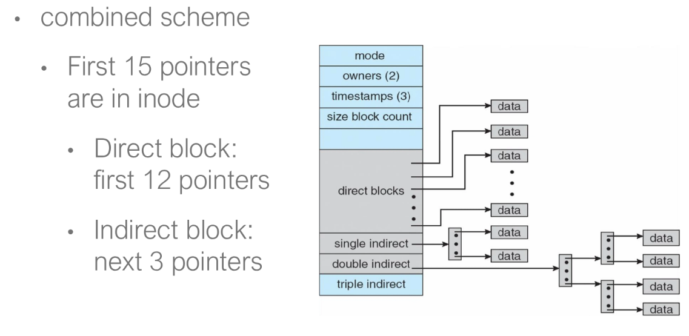  
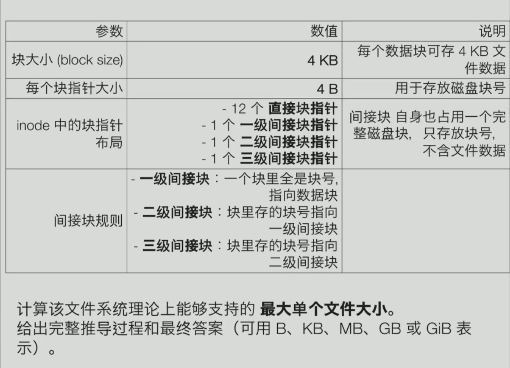  
quiz answer:4TB  

##### Free Space Management  

- Bitmap:one bit for each block,but require extra space for bitmap storage  
- Linked list:no waste of space but difficult for getting contiguous space  
  note:usually no need to traverse the list  
- Grouping:use indexes to group free blocks  
  store addr of n-1 free blocks in the first free block and a pointer to next index block  
- Counting:a link of clusters  

##### File System Performance  
• disk allocation and directory algorithms  
• types of data kept in file’s directory entry  
• pre-allocation or as-needed allocation of metadata structures  
• fixed-size or varying-size data structures  
Performance Improvement:  
1.keep data and metadata close together,because every operation to data operates metadata  
2.use cache  
Page cache:caches pages for MMIO(Memory-mapped I/O(fd -> VA))  
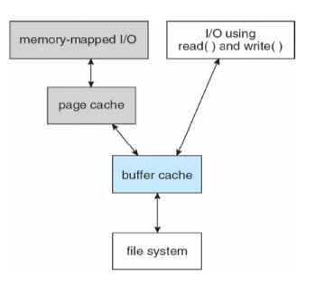  
unified buffer cache uses the same page cache to cache both memory-mapped pages and disk I/O to avoid double caching  
3.use asynchronous writes:buffered or cached,periodically/fsync() to disk  
4.optimize sequential access  
free behind:remove the previous page from the buffer  
read-ahead:read multiple pages ahead  
**Read often slower than write** because of asynchronous writes,no asynchronous read  
##### Recovery  
1.backup  
2.Log structured file systems:metadata for updates sequentially written to a **circular log**,then commit to write to disk,recommit if failed  
only ensure the consistency,not guarantee that data will not be lost  
#### Example  
Assume we have 64 blocks,each block size 4K  
56/64 for data  
5/64 for inode(suppose inode are 256bytes,4Kb block can hold 16 inodes),80 files  
1/64 for bitmap for free inodes  
1/64 for bitmap for free data regions  
1/64 for superblock:info about the file system(inode block number,data block number,inode table begin addr,data region begin addr & a magic number)  
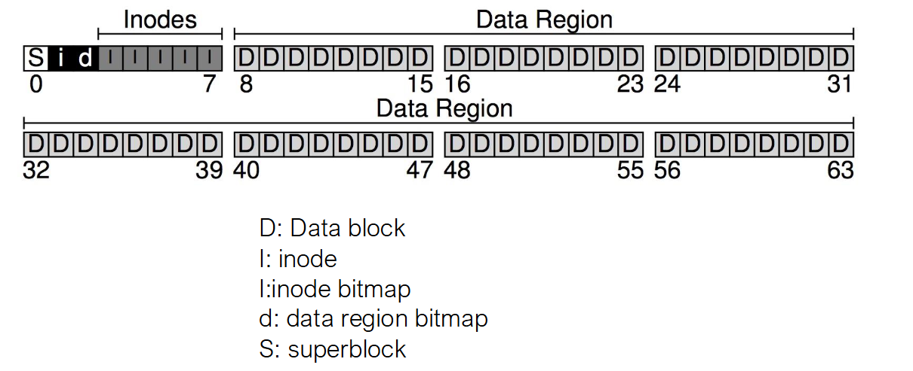  
inode_number addr = inode_number * sizeof(inode) + 4k(superblock) + 8k(bitmap)  
##### Directory organization  
a mapping of inode & name,strlen(length of name),reclen(ROUNDUP(strlen))  
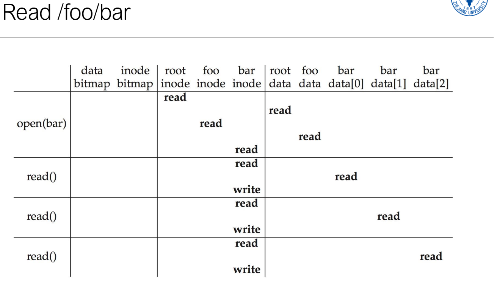  
给定相对路径，按绝对路径读  
write in open() for updating time,etc in inode  
First search system-wide open-file table.If found,we don't need to find the file  
After opening the file,put the entry into the per-process open-file table  
  
#### *Crash Consistency  
Crash scenarios:write inode,bitmap & data block  
[Case1] Only data block is written  
[Case2] Only inode is written(inode points to garbage):inconsistency between inode and bitmap  
[Case3] Only bitmap is written:a space leak  
[Case4] inode & bitmap written:block has garbage data  
[Case5] inode & data block  
[Case6] bitmap & data block:data belonging unknown  
[Solution1] checker  
[Solution2] journaling(writing ahead logging)  
1.write inode,bitmap & data to log(a.k.a journal)  
2.Transaction begin(TxB) -> Transaction end(TxE)  
3.After the transaction is safely on the disk,overwrite the old data(checkpointing)  
checkpoint:write from log to disk
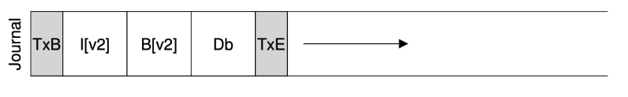  
crash when writing to journal  
[Solution1] issue one operation at a time  
[Solution2] split write to two steps  
**Recovery**  
[Case1] crash when writing to log  
no TxE,data lost but no inconsistency  
[Case2] after transaction committed but before checkpoint  
redo logging  
[Case3] during checkpointing  
redo  
Journal structure:circular  
[Problem] writing each data block twice  
[Solution] Metadata journaling  
[Option1] write data after the transaction finishes  
[Option2] write the data block first(no garbage pointer)  
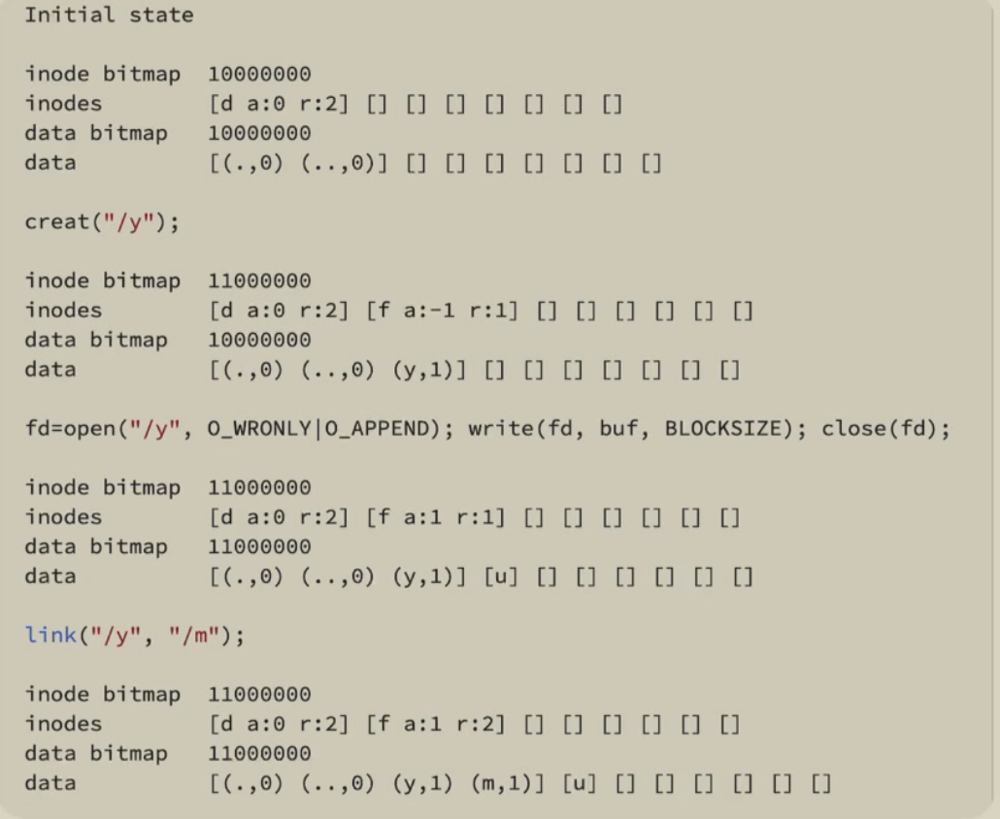  
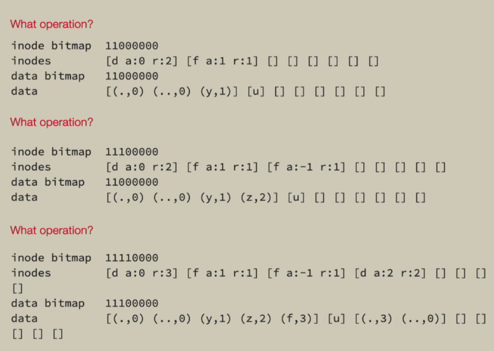  
quiz answer:unlink("/m");creat("/z");mkdir();

### Mass Storage Week13
See [databaseChap12]  
sector,track,cylinder  
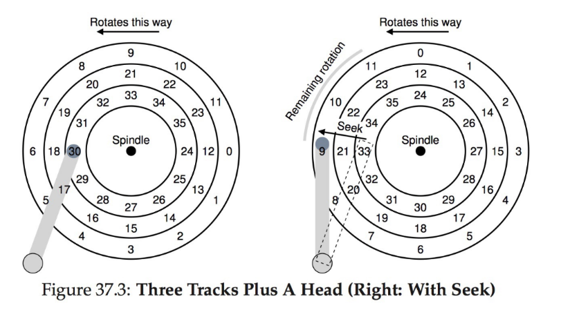  
#### Magnetic Disk  
positioning time(random-access time) = seek time + rotational latency  
performance:transfer rate(Gb/sec)  
average access time = average seek time + average latency  
average I/O time = average access time + (data to transer/transfer rate) + controller overhead  
#### Non-volatile memory devices  
solid-state disk(SSDs) more reliable than HDDs  
1.read and written in pages increment but can't overwrite in place(must be erased)  
2.can only be erased a limited number of times  
3.lifespan measured by drive writes per day(DWPD)  
**NAND Flash Controller Algorithm**  
flash translation layer(FTL) table  
garbage collection:free invalid page space  
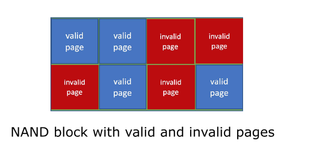  
#### Disk Attachment

- host-attached storage:hard disk,RAID,CD,DVD,tape,...
  using I/O bus    
- network-attached storage(NAS)  
  over TCP/UDP on IP network  
- storage area network(SAN)  
  high speed interconnection and efficient protocols(than TCP/IP)  

#### Disk scheduling
##### FCFS
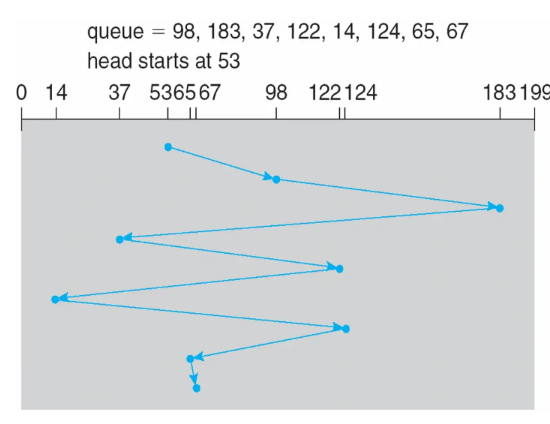  
##### SSTF
shortest seek time first(not optimal,compare to SJF),starvation exists  
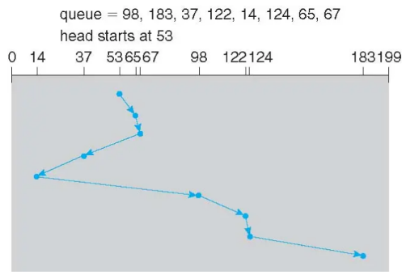  
##### SCAN(Elevator)
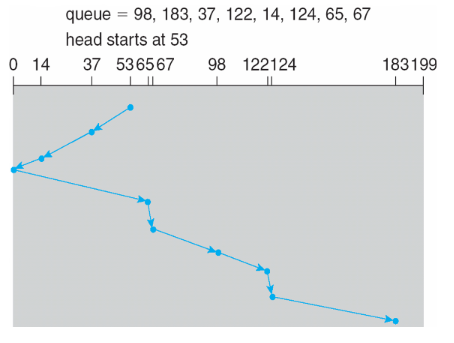  
##### C-SCAN
Circular-SCAN
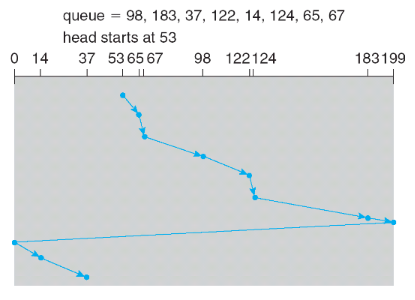  
##### LOOK/C-LOOK
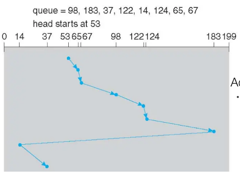  

#### Disk Management
Physical formatting:divide disk into sectors  
Logical formatting:OS partition disk into groups of cylinders,each treated as a logical disk  
root partition:only contains the OS,mounted at boot time  
boot block:point to bootloader(codes of how to load kernel)  
**swap space management**  
扩展物理内存(DRAM),暂存不活跃的page用于交换  
Swap partition交换分区  

##### RAID
Redundant array of inexpensive disks  
RAID 0:split evenly on two or more disks  
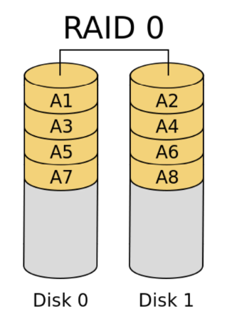  
RAID 1:exact copy/mirror  
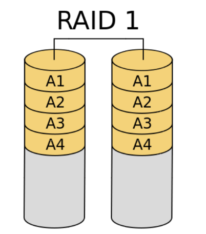  
RAID 2:stripe data at the bit-level,use Hamming code  
RAID 4:block-level striping with a dedicated parity disk  
RAID 5:block-level striping with parity data distributed across all disks  
RAID 6:adding additional parity block  
detect/recover from disk failures,does not prevent or detect data corruption  
ZFS adds additional checks(checksum) to detect errors  

### I/O Week13 - 14
#### I/O hardware
I/O devices:storage,communication,human-interface  
bus:interconnection  
port:device connection part  
controller  
access by polling(CPU周期性检查,very high network load,busy-wait) or interrupt(from I/O,context switch)  
direct I/O Instruction:`In/Out <Device.no>`(x86)  
MMIO:VA Space -> I/O device  
#### Interrupts
[type] protection error(invalid access),page fault,system calls  
Multi-CPU can process interrupts concurrently,even use a CPU to handle interrupts dedicatedly,CPU affinity(lock on global data if accessed by multiple cores)  
APIC(Advanced programming interrupt controller)  
#### DMA
[Definition] Direct Memory Access:transfer data directly between I/O & memory(bypass the CPU) using DMA controller **in the device**  
[Problem] Device may change physical address directly  
[Solution] IOMMU:Device address -> Physical address  
[Problem] IOMMU can only control page size granularity  
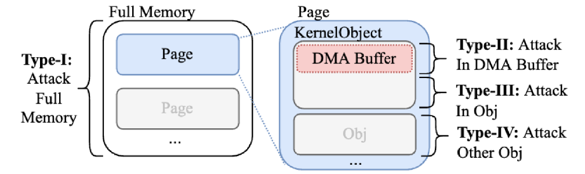  
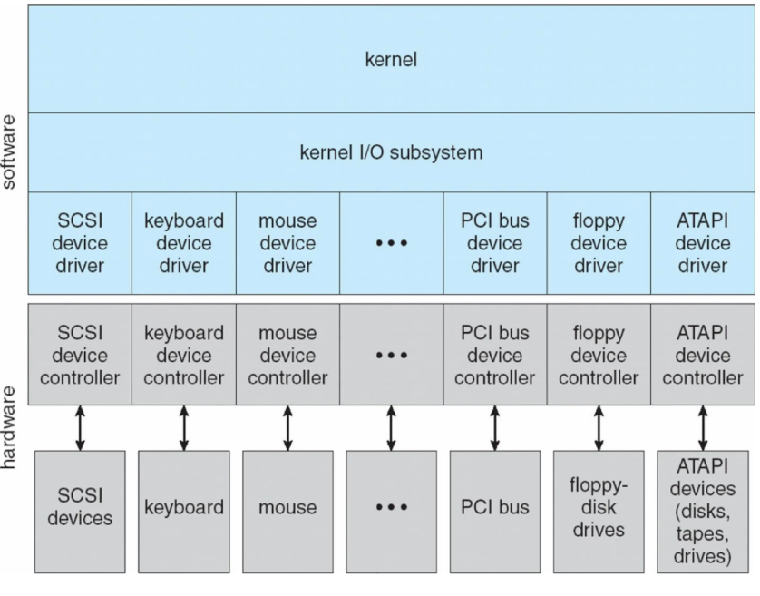  
#### I/O Devices  
character-stream:sequential,block:random-access(read,write,seek),memory-mapped file access,network socket  
direct manipulation(操作) of I/O device is not allowed(e.g. 监听password)  

- Synchronous I/O  
  blocking:process suspended until I/O completed  
  non-blocking:I/O return as much data as avaliable,use select to find data if ready then use read or write to transfer data  
- Asynchronous I/O:process runs while I/O executes,I/O signals process when completed(data already in buffer,`read()` not needed)  

#### Kernel I/O Subsystem
scheduling:queue I/O requests via per-device queue  
buffering:store data in memory while transferring between devices because of speed unmatch,device transfer size unmatch or maintain copy semantics(e.g,`write(fd,buf,...)`)  
cache:hold a copy of data for fast access  
spooling:hold output 打印机  
device reservation:exclusive access to device  
name to device representation:major/minor(编号) in UNIX  
##### Error Handling
recover by retrying or advanced handling  
return error code  
##### I/O Protection  
direct I/O Instruction:define all I/O instructions to be privileged  
MMIO:security check in MMU(user mode cannot access I/O VA)  
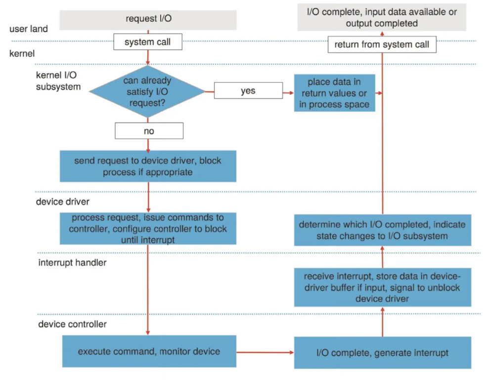  
#### Performance 
[Improvement] reduce context switches,reduce data copying,reduce interrupts by using large transfers,small controllers,polling,use DMA,smarter hardware,move user-mode processes to kernel threads(reduce context switches and essures non-blocking)  
`sendfile()`,SG-DMA copy  
zero-copy in practice:2 context switch + 2 DMA copy (no CPU copy)  
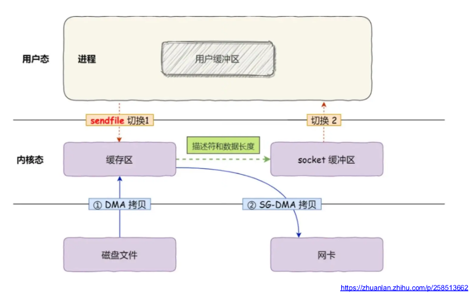  
#### Page Cache
in memory,before read from disk  
not work for big file(data written in cache but never read)  
[File_System_Quiz](notebook/docs/sp25/sys3/file_system_quiz.pdf)

## 体系结构
### DLP,TLP Week14 - 15
#### SIMD:Vector processor  
SIMD:single instruction multiple data 单指令流多数据流  
$D = A * (B + C)$,A,B,C,D are vectors of length N  
1.horizontal processing method  
$d_i = a_i * (b_i + c_i)$  
data related:N times,function switching:2N times(static pipeline needs drain排空)  
2.vertical processing method  
$K = B + C$  
$D = A * K$  
data related:1 time,function switching:2 times  
[Problem] what if N is very big;multiplication has to wait for all add operations complete  
3.vertical and horizontal(grouping) processing method  
N is very big,each group can put *n* instructions  
N = s * n + r  
data related:s+1 times,function switching:2(s+1) times  
##### CRAY-1  
64 instructions per group,12 single-function pipeline  
Vi conflict  
```asm
V0 = V1 + V2
V3 = V0 * V4

V0 = V1 + V2
V3 = V1 * V4 # V1 may not be entirely stored in memory  

V3 = V1 * V2
V5 = V4 * V6 # hardware conflict
```
instruction types:  

- Vk = Vi op Vj  
- Vk = Si op Vj  
- Vk <- Memory  
- Memory <- Vi  
- Memory:6 beats  
- Add:6 beats  
- Multiply:7 beats  
- Every data transfer:1 beat  
  
##### Performance improvement  
1.multiple functional units  
2.vector chaining technology向量链接  
$D = A * (B + C)$,N <= 64  
V0 = B,V1 = C  
```asm
V3 <- memory
V2 = V0 + V1
V4 = V2 * V3 # RAW but no functional/hardware conflict,using chaining!
```
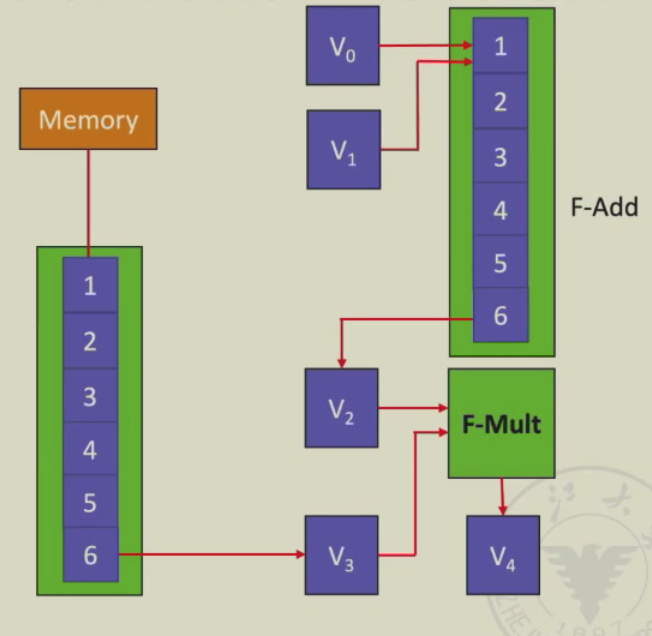  
once the first output of V4 come out,every clock cycle another output of V4 come out  
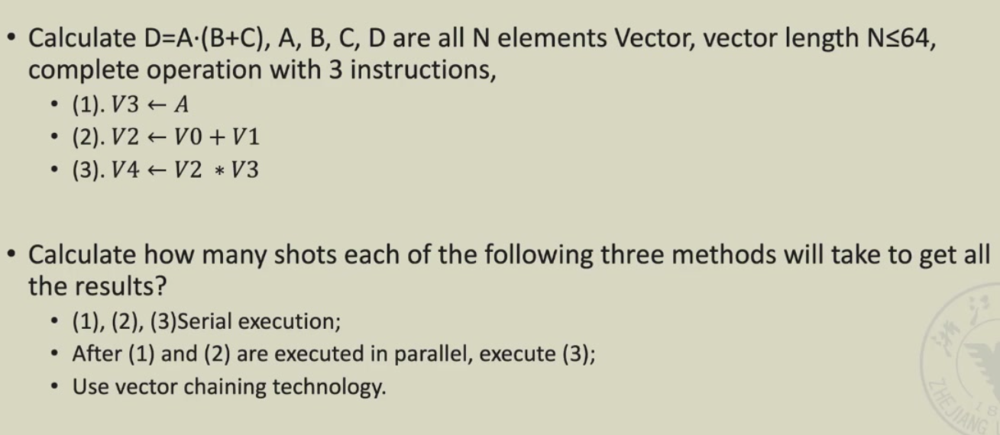  
(1)((1 + 6 + 1) + N - 1) + ((1 + 6 + 1) + N - 1) + ((1 + 7 + 1) + N - 1) = 3N + 22  
(2)((1 + 6 + 1) + N - 1) + ((1 + 7 + 1) + N - 1) = 2N + 15  
(3)(1 + 6 + 1) + (1 + 7 + 1) + N - 1 = N + 16  
3.Segmented vector  
4.Multi-processor system  
RISC-V(scalar) -> RV64V  
#### Array Processor阵列机  
Distributed memory:each processor has its own memory(ICN,dynamic network connecting the processors)  
Centralized shared memory:N processors and K memories interconnect by ICN  
[Question] connection path:direct or indirect  
interconnection network:static or dynamic  
[Goal] any two PEs can achieve info transfer in a few steps  
single-stage/multi-stage interconnection network  
##### Single-state interconnection network  
**Cube**:N inputs and outputs are encoded with n-bit($n = log_2N$) binary code $P_{n-1}...P_i...P_1P_0$  
$Cube_i(P_{n-1}...P_i...P_1P_0) = P_{n-1}...\overline{P_i}...P_1P_0$  
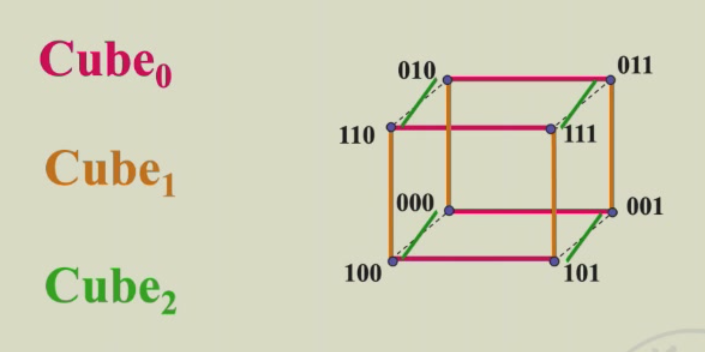  
The 3D cube can transfer data between any two processing elements at most 3 times  
if N is bigger,then we have at most $log_2N$ times(hyper cube)  
**PM2I**(Plus Minus $2^i$):$PM2_{+i}(j) = (j + 2^i)mod N$,$PM2_{-i}(j) = (j - 2^i)mod N$,2n functions,2n-1 different functions(i = n - 1)  
transfer data between any two processing elements at most n - 1 times  
**Shuffle exchange**  
$shuffle(P_{n-1}...P_i...P_1P_0) = P_{n-2}...P_{i-1}...P_1P_0P_{n-1}$  
exchange:$Cube_0$  
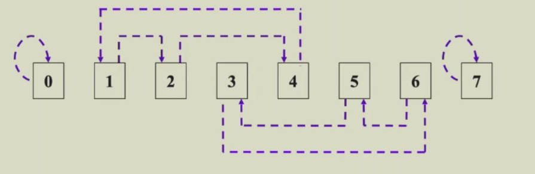  
If N is bigger,from all '0' to all '1', we need n shuffles and n - 1 exchanges  
**Other static networks**  

- Linear array  
- Circular array  
- Loop with chord array  
  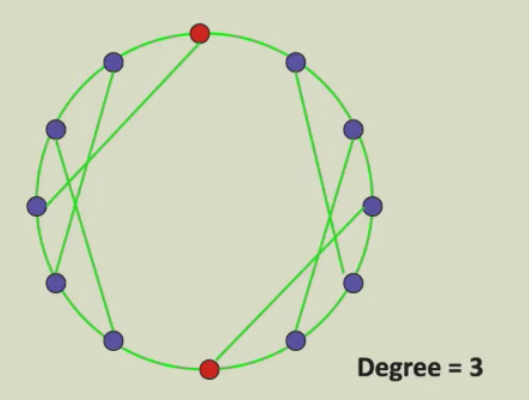  
- Tree array  
  tree with loop,binary fat tree  
  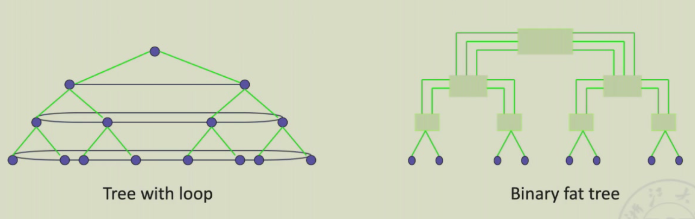  
- Star array  
- Grid:格  
- 2D torus  
  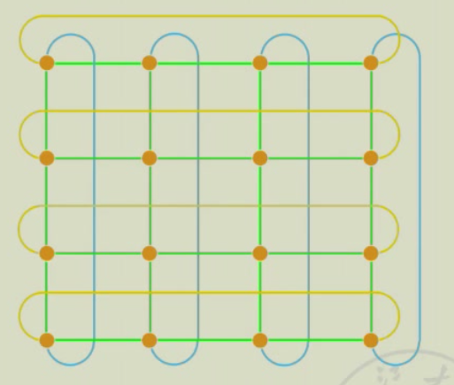  
- Hypercube  
- Cube with loop  
  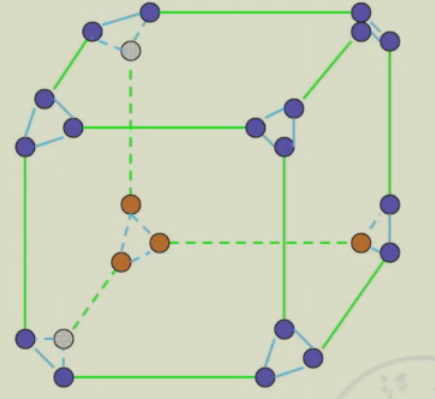  

##### Network Charactistics  
Dynamic networks  

- buses:time-division characteristics,only one pair of nodes are transmitting data at the same time  
- crossbar switches  
  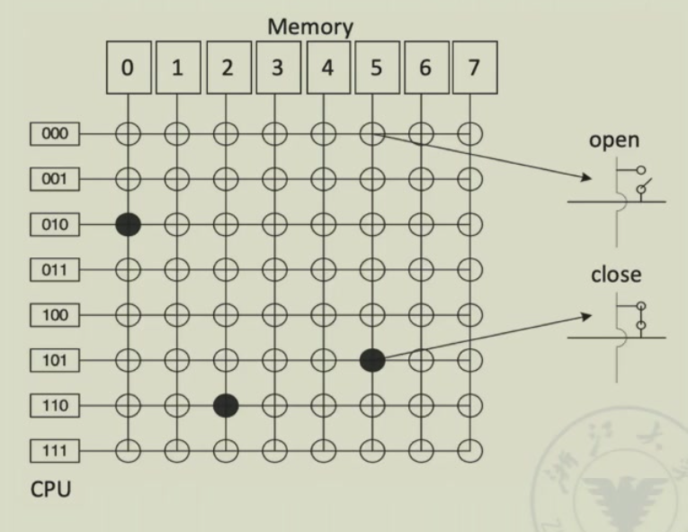  
- multi-stage interconnection network(Switch unit:m input and m output switches)  
  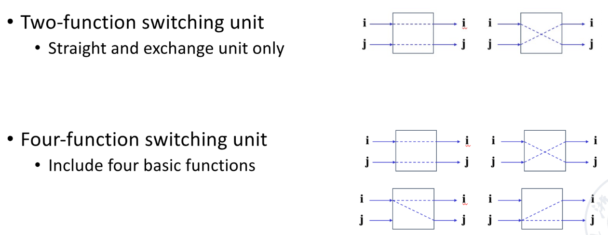  
  switch function  
  switch control method  
  topology  

**cube**  
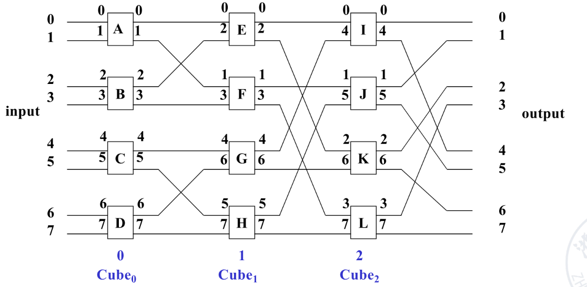  
Each switch can be chosen direct connection or exchange connection,8 different connections in total  
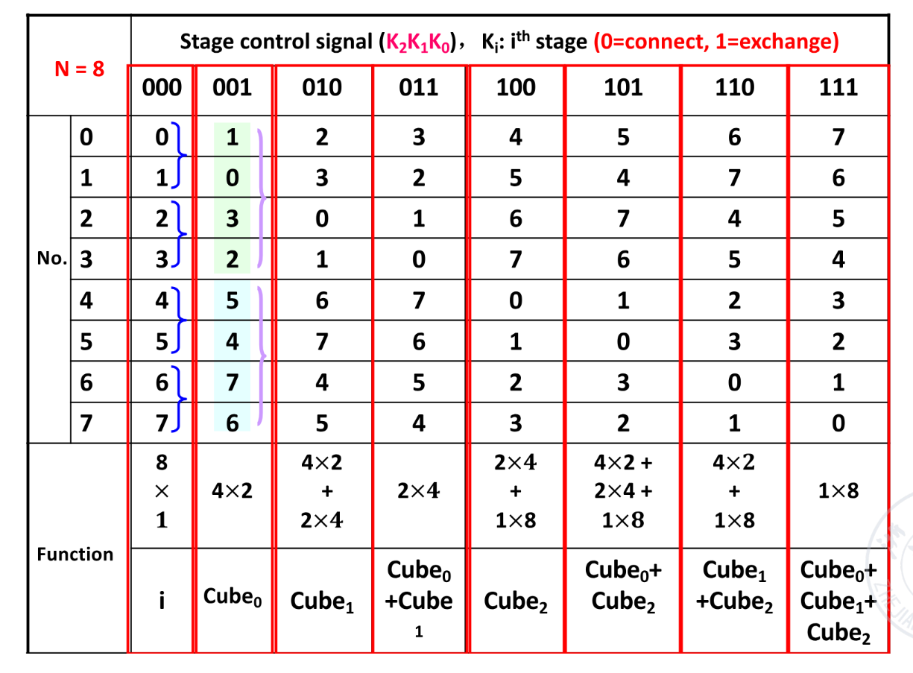  
hint:the binary representation of connect/exchange corresponds to the function  
Example:
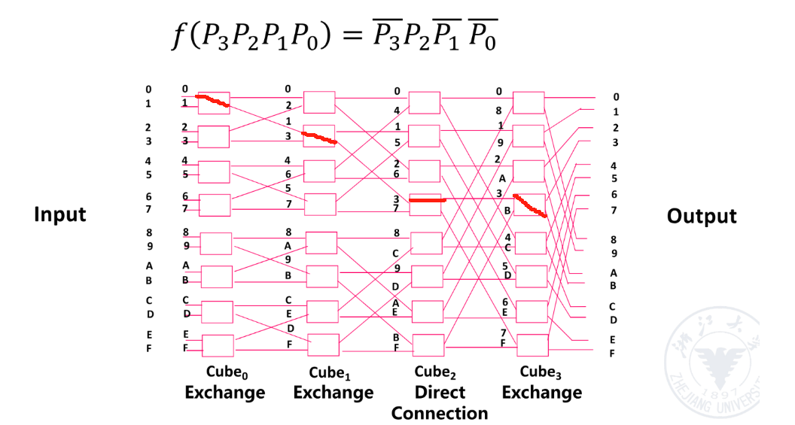  

!!! Practice 
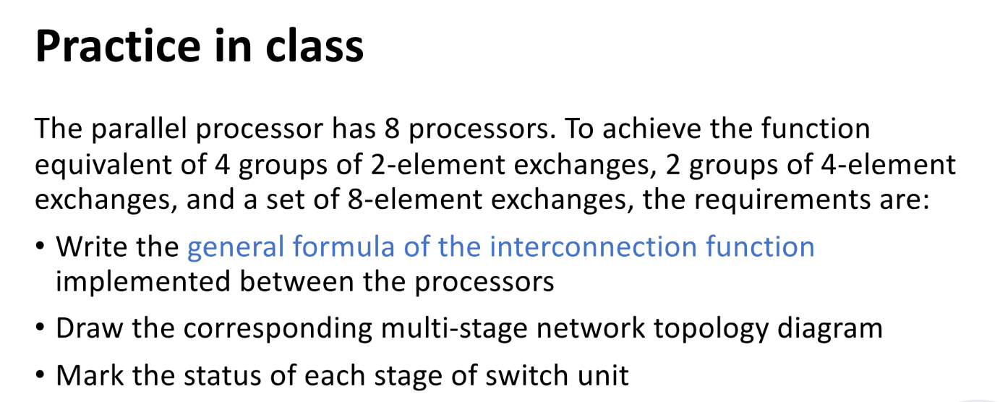  
**shuffle**  
Multi-level shuffle exchange network(a.k.a Omega network)  

- switch function has 4 functions  
- topological structure is inverse to the cube structure  
  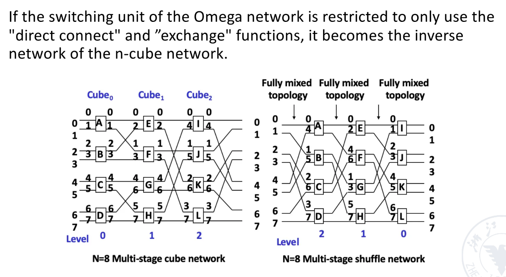  
  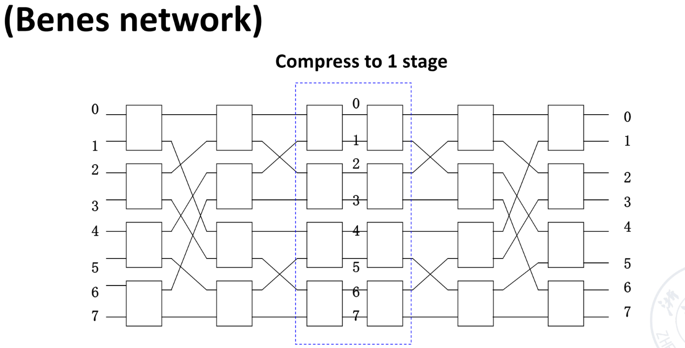  

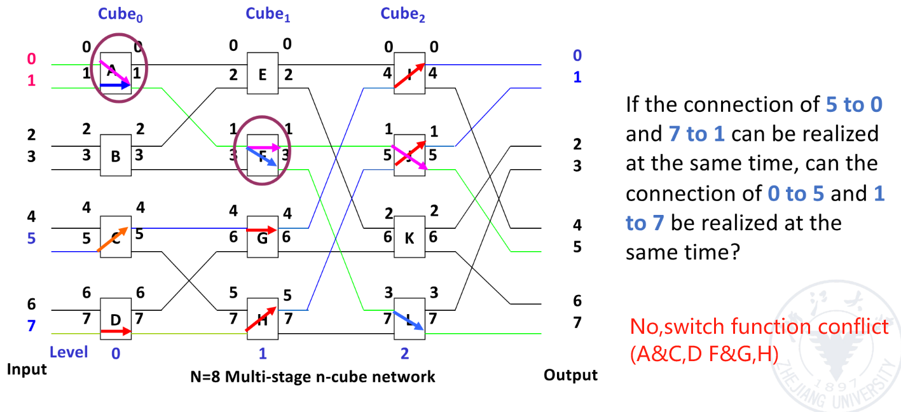  
#### DLP in GPU
SIMD exploit parallelism for:matrix,media  
Graphical Processing Unit(GPU)  
heterogenous(异源) execution model  
forms of GPU parallelism:CUDA(Compute Unified Device Architecture) thread  
Single instruction multiple thread  
Multithreaded SIMD processors:SIMT  
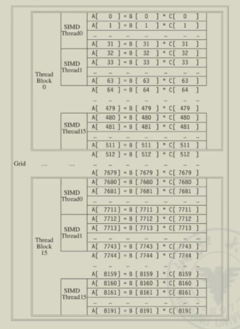  
GPU memory is shared by all grids  
Local memory is shared by all threads of SIMD instructions within a thread block  
Private memory is private to a single CUDA Thread  
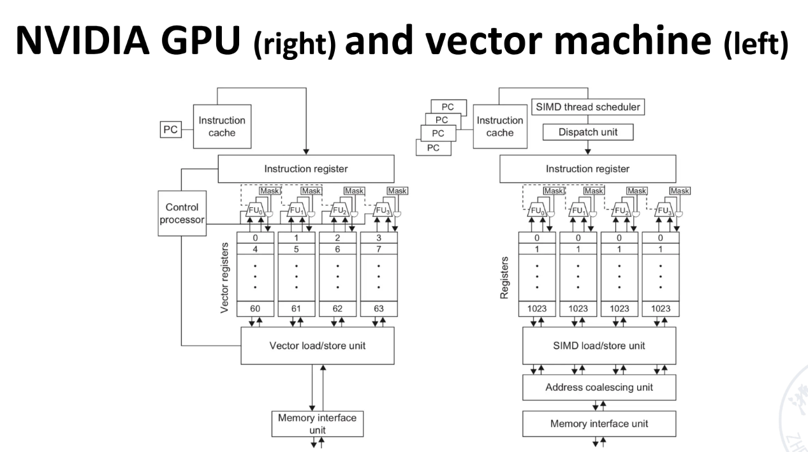  
#### LLP
LLP:Loop-Level Parallelism  
Loop-carried dependence:**focuses on determining whether data accesses in later iterations are dependent on data values produced in eariler iterations**  
```c
for(i=999;i>=0;i--)
  x[i] = x[i] + s;//no loop-carried dependencence  

for(i=0;i<100;i++) {
  A[i+1] = A[i] + C[i];  //S1->S1
  B[i+1] = B[i] + A[i+1];//S1->S2,S2->S2
  //loop-carried dependence
}

for(i=0;i<100;i++) {
  A[i] = A[i] + B[i];  //S1
  B[i+1] = C[i] + D[i];//S2
  //S1 uses value computed by S2 in previous iteration
  //S2 in i-1 -> S1 in i
  //but dependence is not circular,S2 can be done in parallel
}

//rewrite to erase loop-carried dependence
A[0] = A[0] + B[0];
for(i=1;i<100;i++) {
  B[i] = C[i-1] + D[i-1]; //生产者
  A[i] = A[i] + B[i];     //消费者
  //data access depends on the value produced in the same iteration
  //no loop-carried dependence
}
B[100] = C[99] + D[99];
```
```c
for(i=0;i<100;i++) {
  Y[i] = X[i]/c;
  X[i] = X[i] + c;//name dependence
  Z[i] = Y[i] + c;//RAW
  Y[i] = c - Y[i];
}
//rewrite:
for(i=0;i<100;i++) {
  T[i] = X[i]/c;
  P[i] = X[i] + c;
  Z[i] = T[i] + c;
  Y[i] = c - T[i];
}
```
!!! TODO:practice
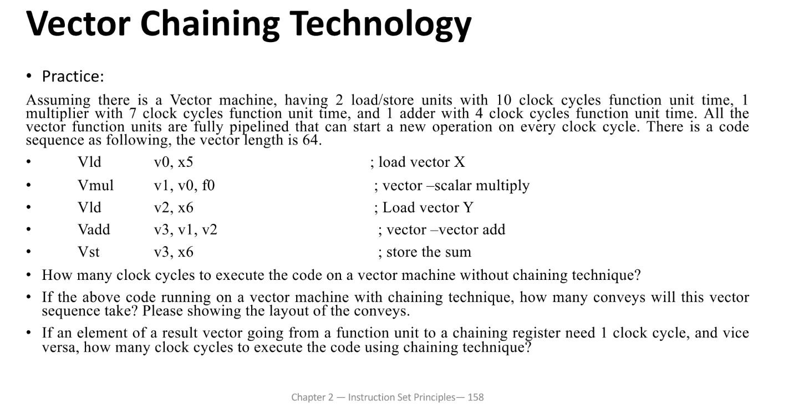  
#### MIMD:Thread-level Parallelism  
MIMD:multiple instructions multiple data
multi-processor:shared memory  
multi-computer:message passing  
NORMA(no-remote memory access)  
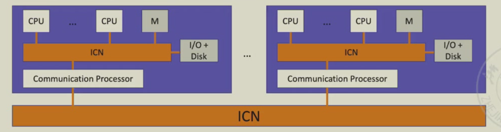  
##### Uniform-Memory Access(UMA)  
集中共享，紧耦合的共享资源，a.k.a SMP(Symmetiric(Shared-memory) Multi-Processors)  
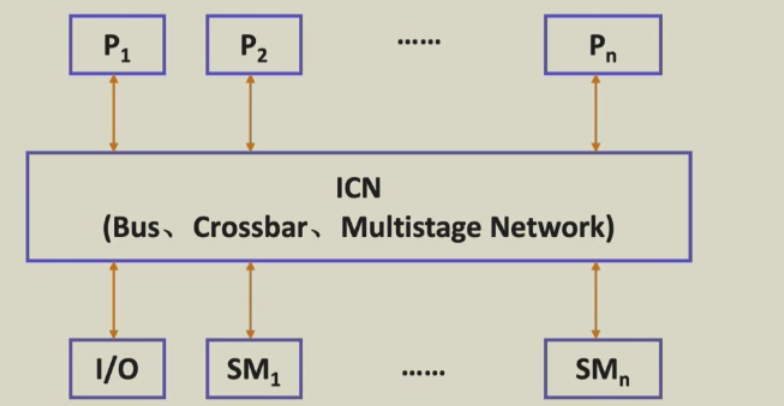  
each CPU owns its cache and small private memory  
##### Non-Uniform-Memory Access(NUMA)  
分布式，a.k.a DSP(Distributed Shared-memory Processors)  
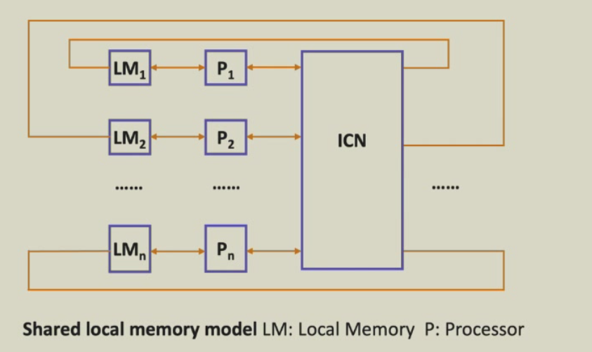  
NC-NUMA:Non-Cache Non-Uniform Memory Access  
CC-NUMA:Coherent Cache Non-Uniform Memory Access  
##### Cache-Only Memory Access(COMA)  
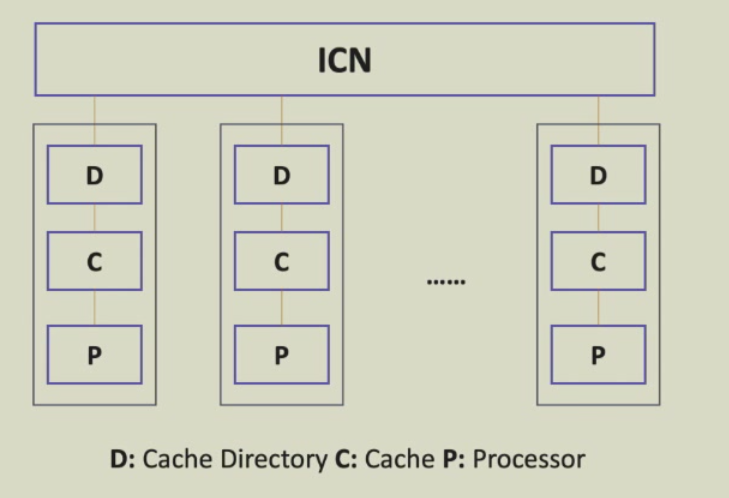  
COMA is a special case of NUMA  
Coherent Cache by applying cache-coherence protocol  
##### Massively Parallel Processors(MPP)  
Multiple processors(standard **CPUs**) connected by custom network  
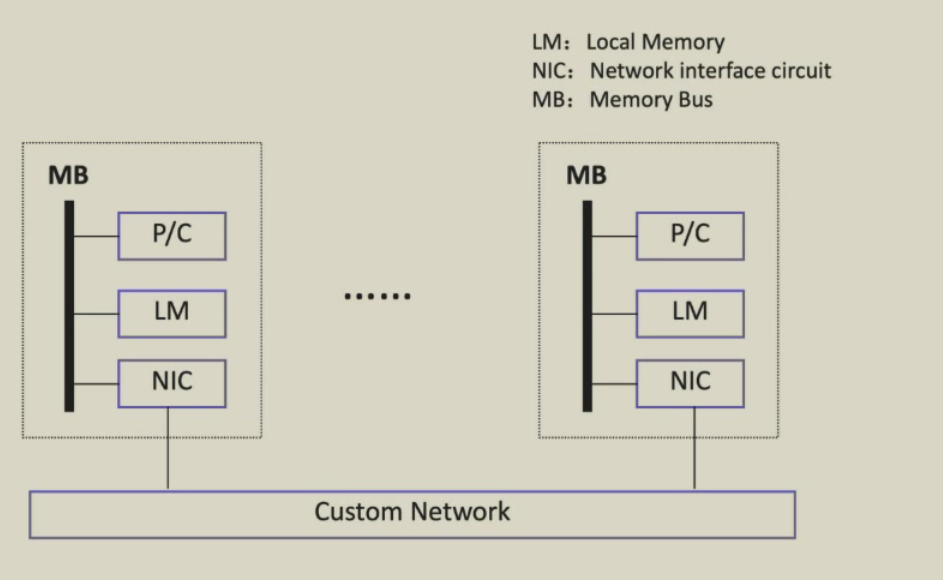  
##### Clusters of Workstations(COW)  
a large number of **PCs** or workstations connected by commercial network  
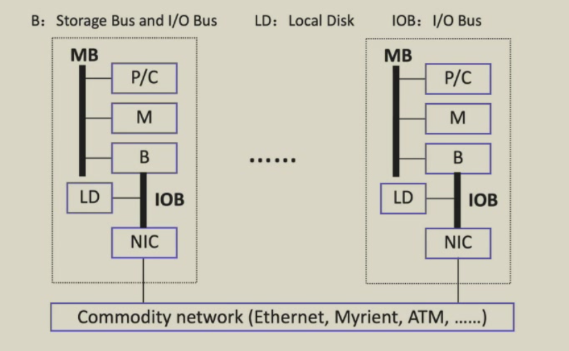  
#### Performance evalutation
hurdle:limited parallelism avaliable in programs,relatively high cost of communications  
Recall Amdahl's Law:  
$Speedup_{overall} = \frac{Execution\ time_{old}}{Execution\ time_{new}}= \frac{1}{(1-Fraction_{enhanced}) + \frac{Fraction_{enhanced}}{SpeedUp_{enhanced}}}$  
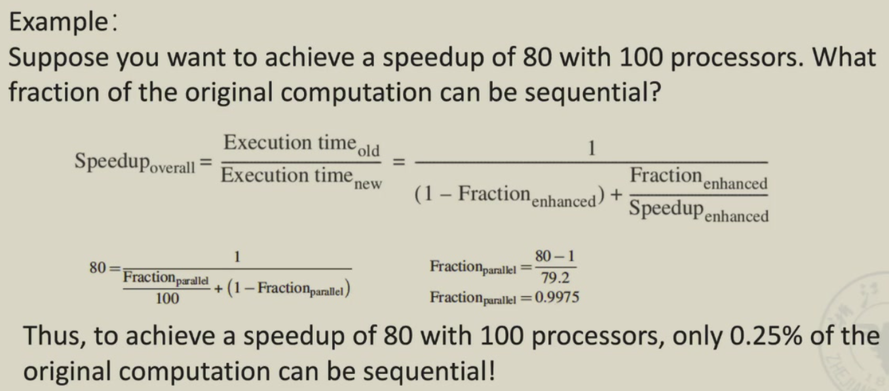  
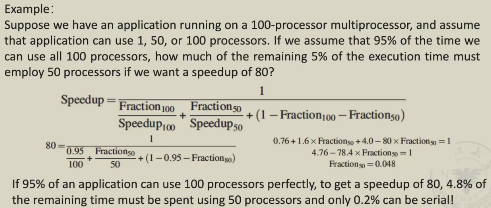  
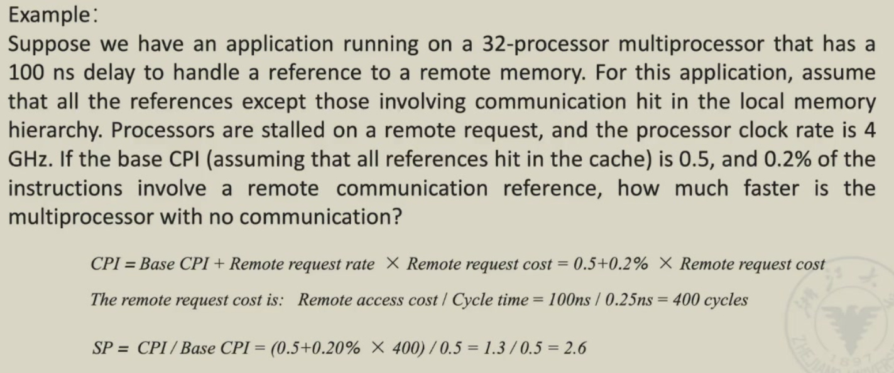  
#### Cache Coherence  
An example  

|time|event|cacheA|cacheB|memory|
|-------|-------|-------|-------|-------|
|0||||0|
|1|Aread|0||0|
|2|Bread|0|0|0|
|3|Astore|1|0|1|

memory consistency:a processor writes location A followed by B,any processor that sees the new value of B must also see the new value of A读写顺序  
using **memory consistency model**  
relaxed consistency model:allows out-of-order execution,using synchronization  
R->W,R->R are often relaxed  
cache coherence:all reads by any processor must return the most recently written value,writes to the same location by any two processors are seen in the same order by all processors  
causing by migration & replication  
using **cache coherence protocol**  
##### Bus snooping protocol(UMA)  
监听:broadcast invalid info/update data on the bus to invalidate/update other copies  
write through & write back  
write invalidate protocol(using write back)  
|processor|buss|cacheA|cacheB|memory|
|-------|-------|-------|-------|-------|
|||||0|
|Aread|cache miss|0||0|
|Bread|cache miss|0|0|0|
|Awrite|invalidation|1|X|0|
|Bread|cache miss|1|1|1|

**MSI protocol**  
- Invalid  
- Shared  
- Modified(Exclusive)  
  
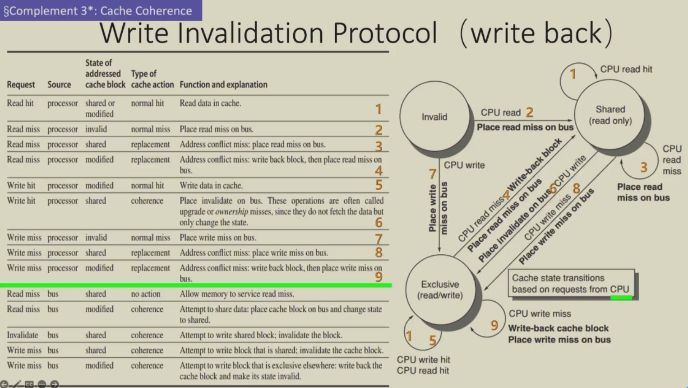  
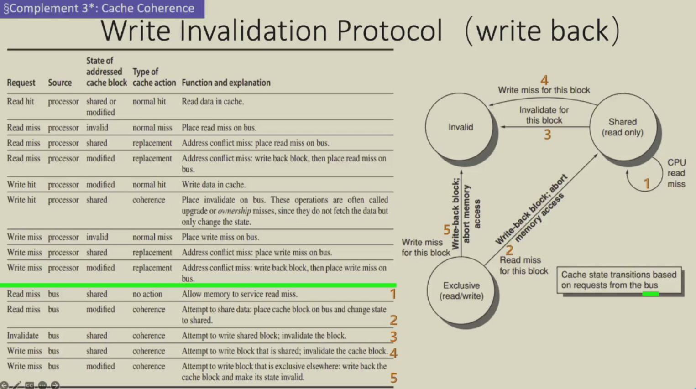  
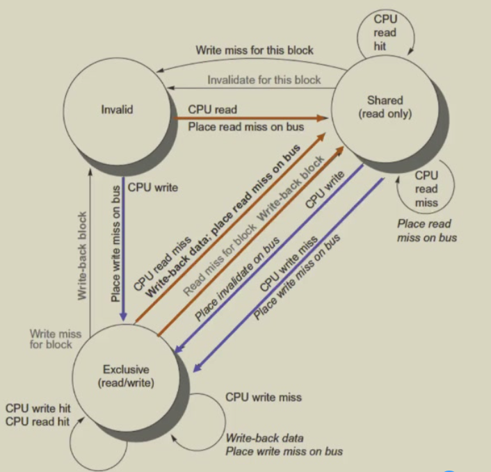  

!!! TODO:practice  
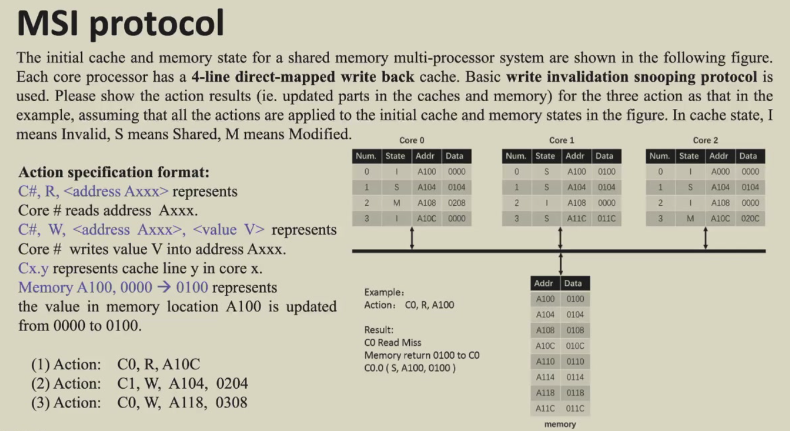  
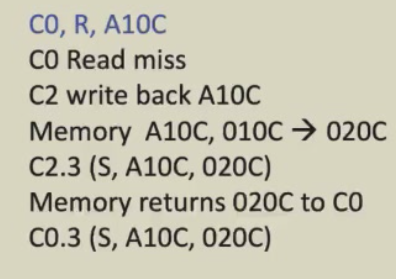  
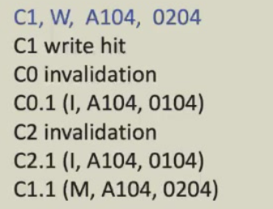  
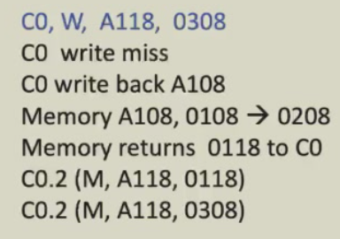  
**MESI protocol**  
exclusive -> shared if read by others  
exclusive -> modified if written  
True exclusive,no copy in other cores,no invalidation will happen(no broadcast is needed)  
##### Directory based protocol(NUMA)  
directory for recording which processors in the system have copies of certain blocks in the cache,sends invalid signal to processors that have copies through the directory when one cache writes  

## Final Review Week16

### 体系结构  
#### 量化研究方法
选择题 CPI,CPU time的计算  
Amdahl's Law:计算SpeedUp  
#### ILP
Data Dependencies  
Name Dependencies  
(RAW,WAR,WAW)  
Control Dependencies  
是否存在冒险的区分  
##### Scoreboard
ID -> IS(in-order) + RO(out-of-order)  
##### Tomasulo
Reservation station,command bus  
##### Hardware-based Speculation
using Reorder buffer(ROB) before writing back to registers  
#### Cache 
Block placement(fully associative,set associative,direct mapped)  
Which one has a lower cache miss rate?  
Block identification(tag/block)  
Given cache size,associative method,calculate the tag bit number,...(see homework)  
Block replacement(Random,LRU,FIFO)  
Write strategy(Write Back,Write Through(with write buffer))  
What happens if write hit or write miss?(combined with cache coherence protocol)  
$AMAT = (HitTime + MissRate * MissPenalty)$  
给定CPI，MissPenalty，MissRate计算AMAT，CPUTime等  
#### Multiple issue & static scheduling  
选择题，区分Superpipeline,superscalar,VLIW  
#### DLP
SIMD  
各自的特点
##### Vector Processor
CRAY-1
##### Array Processor
interconnect network
#### TLP
MIMD  
UMA(SMP),NUMA(DSP)区别，适用场景  
memory consistency不涉及，只考察与Coherence的区别  
MSI protocol(snooping)  
状态机  
MESI(+Exclusive)  

### OS  
#### Main Memory
Paritition,Segmentation  
Fragmentation(internal,external)  
Paging to avoid external fragmentation  
Address translation  
PTBR(page-table base register) contains **physical** address  
TLB acceleration:page cache in CPU  
Effective Access Time(EAT)  
pages must physical contigious  
page directory number,page table number,page offset(calculation!)  
Hashed page table,inverted page table  
##### Demand paging  
Page Fault  
Page replacement(FIFO,optimal,LRU,LFU,MFU)  
几次缺页
##### Page size
TLB reach
#### Mass Storage
Disk scheduling(FCFS,SSTF,SCAN,C-SCAN,C-LOOK)计算各个算法下磁头移动的距离  
#### I/O System 
Polling & Interrupt  
#### File System
File attributes
Open files(per-process table,system-wide table)  
Directory:link&unlink 
Protection:permission(ACL,Unix)  
##### File System Implementation
FCB(file metadata)  
note:file name is stored in directory metadata,not FCB!  
on-disk structure,directory structure  
multi-level pointer(计算max file size)  
例：最多读3次(single indirect)  
disk block allocation:contiguous,linked-list,indexed  
