# 人工智能芯片与系统
## Lecture 1：Introduction
### Amdahl's Law  
f:parallelizable fraction of a program  
N:number of processors  
$$
Speedup=\frac{1}{1-f+\frac f N}
$$
### Roofline model
Arithmetic intensity(AI):AI=total flops/total memory bytes  
AI describes per memory byte float compute number  
high AI:compute-bound(matrix multiplication),low AI:memory-bound(vector addition)  
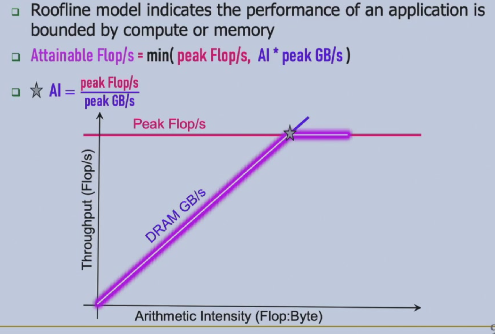  
peak flop/s:fused multiply-add + vectorization code  
memory model:Cache > HBM > DRAM  
Real Gflop/s $\le$ AI * DRAM GB/s
### Little's Law  
$L=\lambda * W$(buffer size = throughput * latency)  
throughput:12GB/s,latency:100ns,buffer size = 100ns * 12GB/s=120B  
## Lecture 2: Reorder buffer
## Lecture 3: Out-of-order CPU + Tomasulo
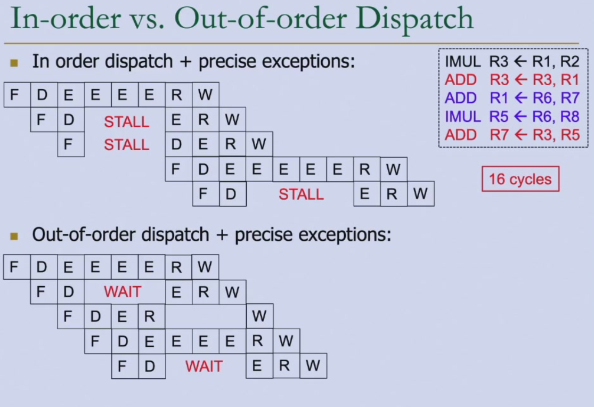  
note that in in-order dispatch(upper-case),instruction 3 has to wait until instruction 2 to come out of ID phase.Before that,it cannot get into ID phase.  
also,instruction 4 can get into IF phase only after instruction 3 come out of IF phase    
## Lecture 4: CPU Superscalar + SIMD
## Lecture 5: Memory
small capacity,large bandwidth,small latency:SRAM HBM DDR SSD DISK:large capacity,small bandwidth,large latency  
fast,expensive:Flip-Flop SRAM DRAM SSD(flash memory):slow,cheap  
SRAM(cache):buffering data on chips,allow random access with low capacity  
application:cache in CPU,shared memory in GPU,on-chip buffer in AI accelerator  
HBM(High Bandwidth Memory) DRAM(very high bandwidth with high price and low flexibility,low capacity) vs. DDR DRAM  
HBM is vertically stacked with very many joints(接口/电气连接点) between layers for large bandwidth,but difficult for highly stacking,causing low capacity  
## Lecture 6: GPU architecture
CPU vs. GPU:  
- few complex cores vs. lots of small cores  
- large cache vs. small cache  
- large and slow memory vs. small and fast memory  

CPU(sequential or modestly parallel) -> GPU(massively parallel) -> CPU  
hardware execution model for GPU,CUDA(Compute Unified Device Architecture) programming model for **thread block**  
GPU memory capacity does not scale well because HBM is physically stacked and tightly coupled with the GPU, making it expensive and difficult to increase capacity without redesigning the entire module.  
### Programming model
thread->thread block->grid
SPMD:single programme multiple data  
```c
for(i=0;i<N;i++)
    C[i] = A[i] + B[i];

//SISD
//SIMD:vector instruction
VLD A->V1
VLD B->V2
VADD V1+V2->V3
VST V3->C
//SPMD
```
```c
//CUDA
float serialFunction(...);
__global__ void kernel(...);

main()
cudaMalloc((void**)&d_in, #bytes);
cudaMemcpy(d_in, h_in, #bytes, cudaMemcpyHostToDevice);
kernel<<< #blocks, #threads >>>(args);
cudaFree(d_in);
```
```c
//CPU
void vecadd(float* A,float* B,float* C,int N){
    //1.allocate GPU memory
    float *A_d, *B_d, *C_d;
    cudaMalloc((void**) &A_d, N*sizeof(float));
    cudaMalloc((void**) &B_d, N*sizeof(float));
    cudaMalloc((void**) &C_d, N*sizeof(float));
    //2.copy data to GPU memory
    cudaMemcpy(A_d, A, N*sizeof(float), cudaMemcpyHostToDevice);
    cudaMemcpy(B_d, B, N*sizeof(float), cudaMemcpyHostToDevice);
    //3.perform computation on GPU
    const unsigned int numThreadsPerBlock = 512;
    const unsigned int numBlocks = (N + numThreadsPerBlock - 1)/numThreadsPerBlock; // size of input is not a multiple of number of threads per block
    vecadd_kernel<<<numBlocks, numThreadsPerBlock>>>(A_d,B_d,C_d,N);
    //4.copy data from GPU memory
    cudaMemcpy(C, C_d, N*sizeof(float), cudaMemcpyDeviceToHost);
    //5.deallocate GPU memory
    cudaFree(A_d);
    cudaFree(B_d);
    cudaFree(C_d);
}
//GPU
__global__ void vecadd_kernel(float* A,float* B,float* C, N) {
    int i = blockDim.x*blockIdx.x+threadIdx.x;
    if(i<N){ //size of input is not a multiple of number of threads per block
        C[i] = A[i] + B[i];
    }
}
```
locate the thread:`girdDim.x, blockDim.x, blockIdx.x, threadIdx.x`  
```c
//CPU
void add_matrix(float* a,float* b,float* c,int N) {
    int index;
    for(int i=0;i<N;++i)
        for(int j=0;j<N;++j){
            index = i + j * N;
            c[index] = a[index] + b[index];
        }
}
int main(){
    add_matrix(a,b,c,N);
}
//GPU
__global__ add_matrix(float* a,float* b,float* c,int N){
    int i = blockIdx.x * blockDim.x + threadIdx.x;
    int j = blockIdx.y * blockDim.y + threadIdx.y;
    int index = i + j * N;
    if(i<N && j<N)
        c[index] = a[index] + b[index];
}
int main(){
    dim3 dimBlock(blocksize, blocksize);
    dim3 dimGrid(N/dimBlock.x,N/dimBlock.y);
    add_matrix<<<dimGrid, dimBlock>>>(a,b,c,N);
}
```
warp:32 consecutive threads.A thread block is divided into warps for SIMT execution  
Why warps and SIMT?Reduce GPU scheduling overhead  
thread block:logic scheduling unit defined by programmer  
warp:execution unit determined in GPU hardware  
SIMD(vector) is a single sequential instruction stream  
SIMT is multiple instruction streams of scalar instructions  
SIMT can treat each thread separately and can group threads into warps flexibly  
```c
//divergence-free execution
compute(threadIdx.x);
if(threadIdx.x<32) //remember 32 threads per warp
    Do_this(threadIdx.x * 2);
else
    Do_that((threadIdx.x%32)*2+1);
```
## Lecture 7: GPU optimization
### GPU memories
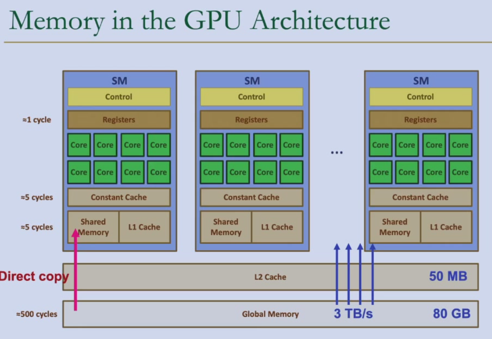  
```c
                        int LocalVar;
                        int LocalArr[N];
__device__ __shared__   int SharedVar;
__device                int GlobalVar;
__device__ __constant__ int ConstantVar;
```
#### DRAM subsystem
Bank operation  
Long global memory access latency
### Multi-threading
FGMT(Fine-Grained Multi-Threading) helps hide long latency operations(memory access)  
occupancy:ratio of active warps to maximum number of warps per core  
other warps execute instructions(activate more warps) when certain warps are waiting for memory access
### Memory Coalescing
only one DRAM transaction is needed if threads in the same warp access consecutive memory locations in the same burst  
we want to satisfy warps,this is vertical to CPU  
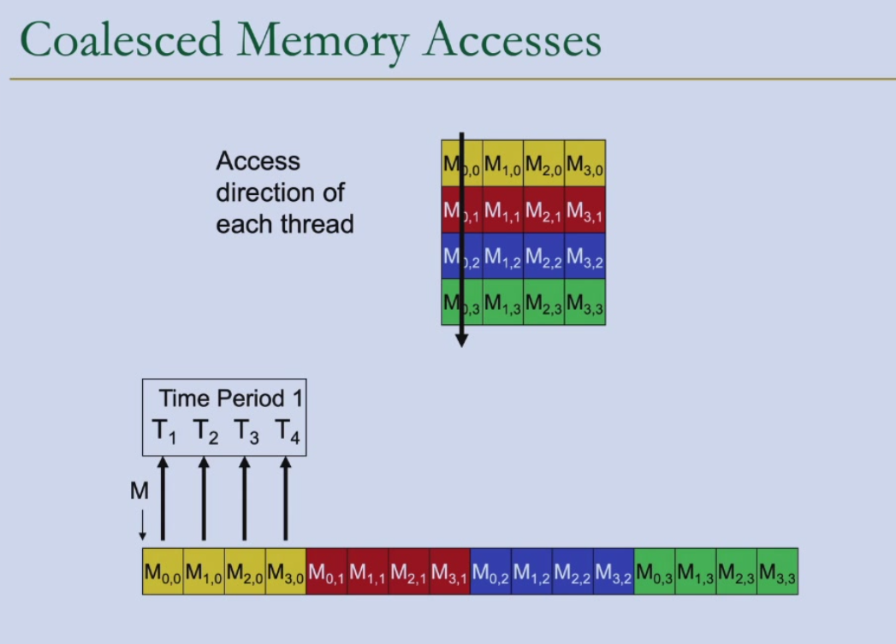  
对一个warp的前四个线程
M0,0->M3,0:thread 0：[0,0],thread 1:[1,0],thread 2:[2,0],thread 3:[3,0],addr = 0,4,8,12,not consecutive  
M0,0->M0,3:thread 0：[0,0],thread 1:[0,1],thread 2:[0,2],thread 3:[0,3],addr = 0,1,2,3,consecutive  
在 C/C++/CUDA（行优先）中：threadIdx.x 对应 col 索引 → Coalesced  
在 C/C++/CUDA 中：threadIdx.x 对应 row 索引 → Uncoalesced  
### Shared memory
shared memory is an interleaved/banked memory  
32 banks in NVIDIA GPUs  
bank conflict free if 32 threads and 32 banks correspond each other one-to-one(though random accessing)  
reducing bank conflict:  
- **padding**  
- randomzied mapping  
- hash functions  

data reuse:tiliing  
cut data into tiles and load into shared memory,threads can access shared memory with only one DRAM access 
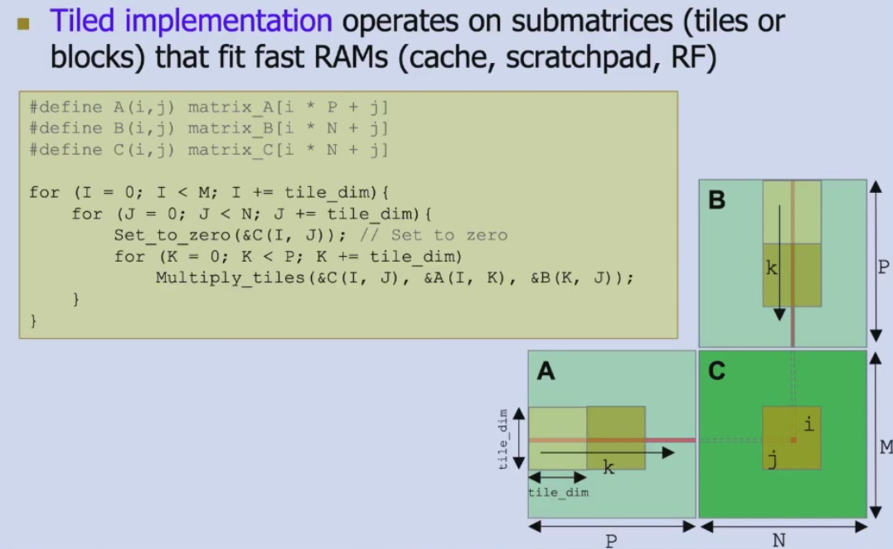  
GPU matrix multiplication  
```c
__global__ void mm_kernel(float* A,float* B,float* C,unsigned int N) {
    unsigned int row = blockIdx.y*blockDim.y+threadIdx.y;
    unsigned int col = blockIdx.x*blockDim.x+threadIdx.x;

    float sum = 0.0f;
    for(unsigned int i = 0;i < N; ++i) {
        sum += A[row*N + i]*B[i*N + col];
    }
    C[row*N + col] = sum;
}

//tiled matrix multiplication
__shared__ float A_s[TILE_DIM][TILE_DIM];
__shared__ float B_s[TILE_DIM][TILE_DIM];

unsigned int row = blockIdx.y*blockDim.y+threadIdx.y;
unsigned int col = blockIdx.x*blockDim.x+threadIdx.x;

float sum = 0.0f;

for(unsigned int tile = 0;tile < N/TILE_DIM; ++tile) {
    //Load tile to shared memory
    A_s[threadIdx.y][threadIdx.x] = A[row*N + tile*TILE_DIM + threadIdx.x];
    B_s[threadIdx.y][threadIdx.x] = B[(tile*TILE_DIM + threadIdx.y)*N + col];
    __syncthreads(); // wait to finish loading before computing

    // compute with tile
    for(unsigned int i = 0; i < TILE_DIM; ++i) {
        sum += A_s[threadIdx.y][i]*B_s[i][threadIdx.x];
    }
    __syncthreads(); // wait to finish computing before loading
}
C[row*N + col] = sum;
```
### SIMT Divergency
branch divergence  
divergence-free execution  
### atomic operation
`int atomicAdd(int*, int)`,pointer to memory + value to add  
prevent data races in histogram computation/synchronization  
### CPU-GPU transfer
overlap of data transfers and kernel execution  
```c
int number_of_streams = 32;
cudaStream_t stream[number_of_streams];
for(int i = 0;i < number_of_streams; ++i)
    cudaStreamCreate(&stream[i]);

for(int i = 0;i < number_of_streams; ++i)
    cudaMemcpyAsync(inputDevPtr + i * size,hostPtr + i * size, size, cudaMemcpyHostToDevice, stream[i]);

for(int i = 0;i < number_of_streams; ++i)
    Mykernel<<<num_blocks / number_of_streams, num_threads, 0, stream[i]>>>(outputDevPtr + i * size, inputDevPtr + i * size, size);

for(int i = 0;i < number_of_streams; ++i)
    cudaMemcpyAsync(hostPtr + i * size,outputDevPtr + i * size, size, cudaMemcpyHostToDevice, stream[i]);

cudaDeviceSynchronize();

for(int i = 0; i< number_of_streams; ++i)
    cudaStreamDestroy(Stream[i]);
```
## Lecture 8: Cache Basics
## Lecture 9-10: Cache Coherence and Consistence
## Lecture 11: AI chips:common patterns
AI(DL) accelerator vs. GPU vs. CPU  
通用性:ASIC << AI accelerator < FPGA < GPU < CPU  
能效（单位能量计算量）:ASIC > AI accelerator > FPGA >> GPU > CPU  
可迭代性:ASIC < AI accelerator < FPGA < GPU < CPU  
延时（做出决定/开跑的时间）:GPU >> CPU > AI accelerator > FPGA > ASIC
深度学习算法特性：计算特性（固定重复计算）、访存特性（数据访问的局部性，数据访问和后续计算的关系）  
### DL
#### Conv
卷积层的计算特性：矩阵 * 向量（1 filter）/矩阵（2 filters）  
访存特性：时空局部性，一维局部性  
#### Activation function
ReLU,Leaky ReLU  
计算特性：向量运算，访存特性：向量顺序访问  
#### Pooling
计算特性：二维空间reduce  
访存特性：时空局部性  
#### Fully Connected Layer
Flatten & fully connect  
计算特性：矩阵乘向量  
访存特性：顺序访问&activation  
#### Transformer
Attention Mechanism see NLP  
计算特性：矩阵乘法  
访存特性：顺序访问  
Feed Forward:同上  
### 加速器设计
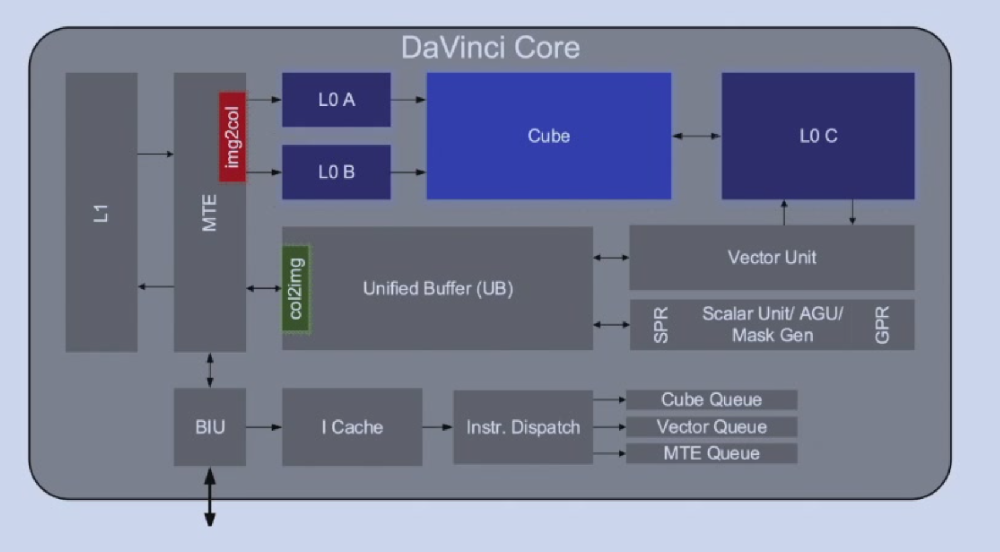  
#### 并行计算模块
Cube + Vector unit,scalar unit  
aggressive custom computing unit  
#### 简化控制模块
多instruction queue管理，每个instruction queue顺序issue  
Instr. dispatch -> cube/vector/MTE queue  
指令间并行不属于优化重点  
#### Global Buffer
L1,L0A,L0B,L0C,Unified Buffer(UB):分块使用、降低单位访存功耗，牺牲可编程性  
stride -> set change  
buffer vs. cache:能耗低、芯片面积小、手动管理
#### 量化
quantization see NLP  
GPU:FP8,FP16  
TPU:INT8,Ascend:INT8(8-bit/16-bit)  
#### 专用编程语言DSA  
转为高吞吐服务，不关心单一操作延迟，需要手动定义buffer，移动数据  
```c
DDR uint32_t a[32] = {0,1,2,...,31};
DDR uint32_t b[32] = {0,1,2,...,31};
DDR uint32_t c[32];
Unified_Buffer uint32_t a_ub[32];
Unified_Buffer uint32_t b_ub[32];
Unified_Buffer uint32_t c_ub[32];
Dma_Mov(a_ub,a);
Dma_Mov(b_ub,b);
Vector_add(c_ub,a_ub,b_ub);
Dma_Mov(c,c_ub);
```
解决难编程问题：算子库  
## Lecture 12: AI processors
### 深度学习加速器设计
#### 减少内存访问
DRAM latency 200x ALU  
solution:global buffer  
#### 减少global buffer访问
SRAM latency > FP32 multiply  
global buffer access -> register utilization(data reuse)  
TPU:weight stationary  
output stationary  
input stationary  
->row stationary:global buffer filter一行  
#### 增加计算
计算模块的设计原则：尽可能多定制计算单元  
例：16*16矩阵乘法  
c代码:16* 16* 16=4096 cycles;2rd,1/16wb each cycle(with cache)  
vector:`C[i][j]=A[i][:]*B[:][j]`,16* 16=256 cycles;2*16rd,1wb each cycle  
matrix:`C[:][:]=A[:][:]*B[:][:]`,1 cycles;2* 16* 16rd,16* 16wb,算力密度高但通用性极弱  
### 常见AI加速器
#### 华为Ascend
晟腾310推理芯片，910训练芯片  
DaVinci Core:Cube(矩阵),Vector,Scalar  
Cube:C=A*B(16 *16矩阵)，Accumulator,L0A/B/C buffer,A/B DFF,Accum DFF  
Vector:L0C -> Unified Buffer,Vector  
Scalar:Scalar unit,unified buffer or scalar buffer,GPR,SPR  
Cube极致算力高；Buffer访问、管理效率高；硬核随路计算指令  
难编程；生态不完善  
#### Google TPU
v1:inference  
systolic array:regular array of processing elements(PE) for loop  
e.g. IF ID ADD-SUB-MUL MEM WB  
2x2 systolic array(3x3=9 PEs,right=left,down=upper,cell=cell+upper*left) for matrix mul  
T=O(n)  
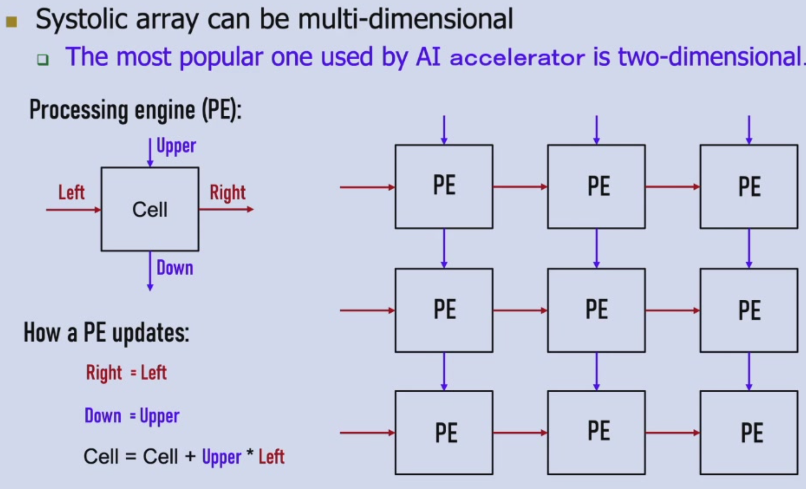  
v2:support training(buffers -> single vector memory,fixed activation pipeline -> general purpose vector unit,MMU connected to vector memory -> vector unit,DDR3 -> HBM)  
v3:support training + more computing power(2 matrix multiplication units)  
v4:training,v4i:inference  
v5/v6:TPU interconnect  
推理加速器可以提高10倍以上能耗比，因为模型可以储存在aichip上，训练时不能显著提高，因为训练加速器不能将模型和中间结果都存在aichip上  
大厂对训练极度谨慎，只有推理可以进行各类优化  
## Lecture 13: AI Chip + Runtime + Framework
### 寒武纪Cambricon
[goal] increase power ratio and programmability    
single-core DLP(Deep Learning Processor)-S:  
- control unit:simple control+register renaming  
    - IFU:address generator unit,inst cache,refill buffer,inst queue(out-of-order and SYNC between queue,in-order in queue)  
    - IDU:decoder,ALU,Issue Queue(control,compute,memory)  
- compute unit  
    - VFU(Vector Fuction Unit)  
    - MFU(Matrix)  
    - Quantization  
- SRAM unit  
    - WRMA(weight)  
    - NRAM(neuron)  
    - DMA  

tensor dataflow:DRAM->NRAM->VFU(->MFU->VFU)->NRAM->DRAM  
weight dataflow:DRAM->WRAM->MFU  
execution flow:  
1. IFU read from DRAM by DMA;IDU decode and send to DMA,VFU,MFU  
2. DMA read tensor,read neuron from DRAM to NRAM,read weight to WRAM  
3. VFU read nueron from NRAM,preprocess and send to MFU  
4. MFU read nueron from VFU,weight from WRAM,compute matrix and send to VFU  
5. VFU postprocess nueron  
6. VFU write back NRAM  
7. DMA write from NRAM to DRAM  

DLP ISA:Matrix(MLOAD,MSTORE,MMOVE片上传输;MMV,VMM,MMS,OP,MAM,MSM),Vector(VLOAD,VSTORE,VMOVE;VAV,VSV,VMV,VDV,VEXP,VLOG,IP,RV,VMAX,VMIN;VGT,VE,VAND,VOR,VNOT,VGTM),Scalar(SLOAD,SSTORE,SMOVE;);JUMP,CB(conditional branch);  
multi-core DLP-M:  
- DLP-M <- DLP-C(cluster) <- DLP-S  
    - DLP-C:4 DLP-S，SMEM(shared memory),GDMA&CDMA(outside and inside communication)  

homogeneous同构 architecture(Huawei and Nvidia易编程) vs. heterogeneous异构 architecture(Cambricon,fast inside DLP-C,slower between DLP-C，shared memory减少HBM访问)  
### Runtime
#### 算子基本概念
[Definition] A layer between AI framework(mindspore,tensorflow,pytorch,...) and AI chips  
CANN:Compute Architecture for Neural Network,CUDA:Compute Unified Device Architecture  
NN operator library:Conv,Batchnorm,Scale,ReLU,Pad,...  
1. NN tasks are composed of NN operators  
2. AI chips are difficult to program  
[goal] performance and usability  
operator library:NN,BLAS(Basic Linear Algebra Subprograms),DVPP(Digital Video Pre-Processor),AIPP(AI Pre-Processing),HCCL(Huawei Collective Communication Library)  
[Definition] tensor:a container that stores operator input and output data  
```c
TensorDesc tensordesc = {name,shape,dtype,format}
```
shape:  
|tensor|shape|
|-------|-------|
|1|(0,|
|[1,2,3]|(3,|
|[ [1,2],[3,4] ]|(2,2)|
|[ [ [1,2],[3,4] ],[ [5,6],[7,8] ] ]|(2,2,2)|

`shape = (4,20,20,3)`:4 photos,20*20 pixels,3 channels  
format 4D:[Batch,Height,Width,Channels] = NHWC  
#### 算子开发方式
TBE(Tensor Boost Engine) operator:DSL & TIK(Tensor Iterator Kernel),AI CPU operator
晟腾CANN:SPMD编程范式 Ascend C  
where is tensor?device memory  
#### CANN平台
计算图引擎GE:图准备，图拆分，图优化，图编译，图加载，图执行  
图优化：  
重复计算->单次计算直接调取结果  
算子融合：每个算子都从内存读取再计算完成放回  
[insight] Conv2D,BatchNorm,Relu均为顺序读写 -> new operator:Conv2D_BatchNorm_Relu    
UB融合：  
1. task和data在片上上下文切换  
2. 新的算子所需数据从主存搬运到unified buffer  
3. vector读取UB中的数据进行算子1，2，3，...的计算，结果存回UB  
4. 结果从UB搬出到主存  

应用：attention  
[Problem] 中间结果读写HBM;softmax串行执行  
[Solution] flashattention:tiling  
### Framework
模型训练和推理框架：mindspore,pytorch,tensorflow,...  
将算法中的常用操作封装成组件，提高开发效率和性能  
Mindspore:自动并行；二阶优化；动静态图结合；AI+科学计算  
二阶优化：二阶矩阵近似表达->矩阵降频->矩阵降维->高性能算子加速  
动态图：调试调优，静态图：执行部署，`set_context`灵活切换  
科学计算：NVIDIA cuBLAS、cuFFT基础数学库  
## Lecture 14: Parallel Training
AI system:computing,storage,networking,compiling  
NN training:  
1. randomly initialized weight  
2. iterate mini-batch learning:forward pass,backward pass,weight update  

forward pass:a minibatch of n(n>1) samples->matrix-matrix multiplication $W*X=Y$  
compute loss  
backward pass:layer weight gradient  
back propogation:  
- weight gradient $dW=dY*X^\top$  
- activation gradient $dX = W^\top * dY$    

weight update:SGD,momentum,adam $W+dW=W$  
[problem] Read After Write(RAW):dependency of weight w  
distributed training:larger models,larger dataset & accelerator memory size limitation(80GB/GPU)  
### data parallelism
each worker has a copy of model and is responsible for computing a portion of data  
forward:cut X  
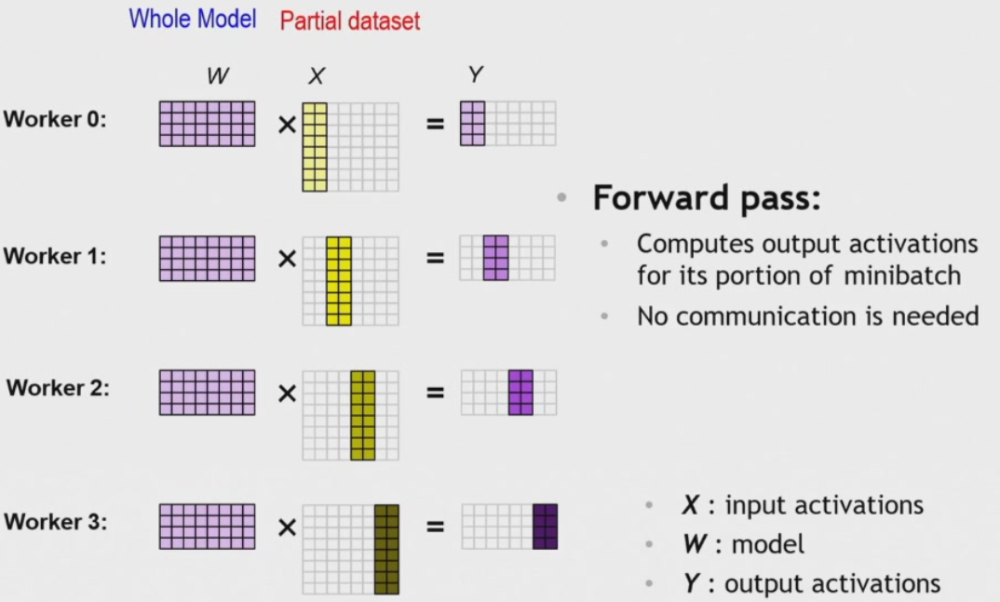  
backward:computes gradient for its portion of minibatch  
weight update:  
1. each of N workers accumulates gradients:summing 1/N gradients  
2. each worker updates its model with combined gradients from N workers  

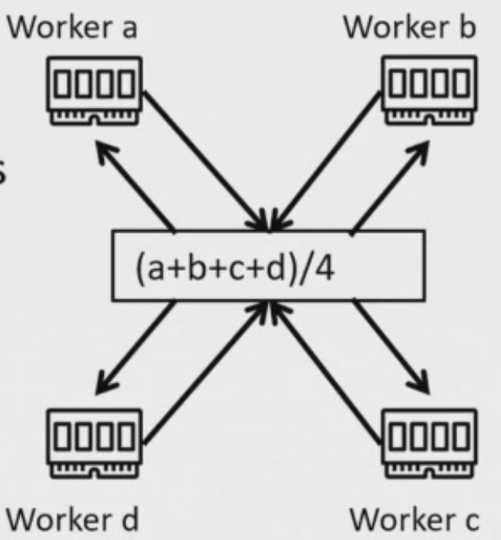  
#### AllReduce
network:scale up & scale out  
scale up:GPU内部高速互联,scale out:机器间互联，如以太网络  
'Ring' AllReduce:1D torus/ring,each worker communicates with 2 neighbors  
2(N-1) steps,a worker send/receive 1/N of all bytes  
1. Reduce_scatter:N-1 rounds,M/N data per round  
2. Allgather:N-1 rounds,M/N data per round  
N = number of GPUs,M = data size  
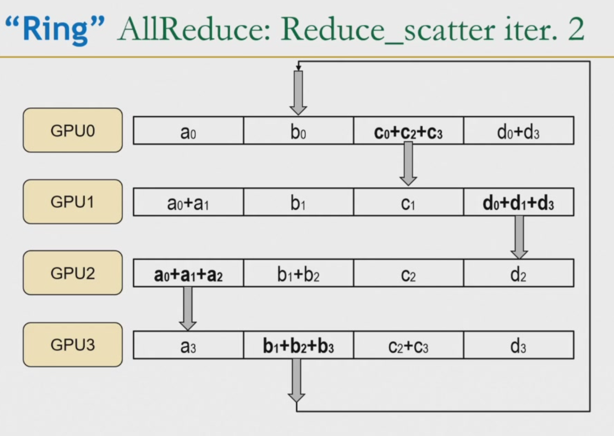  
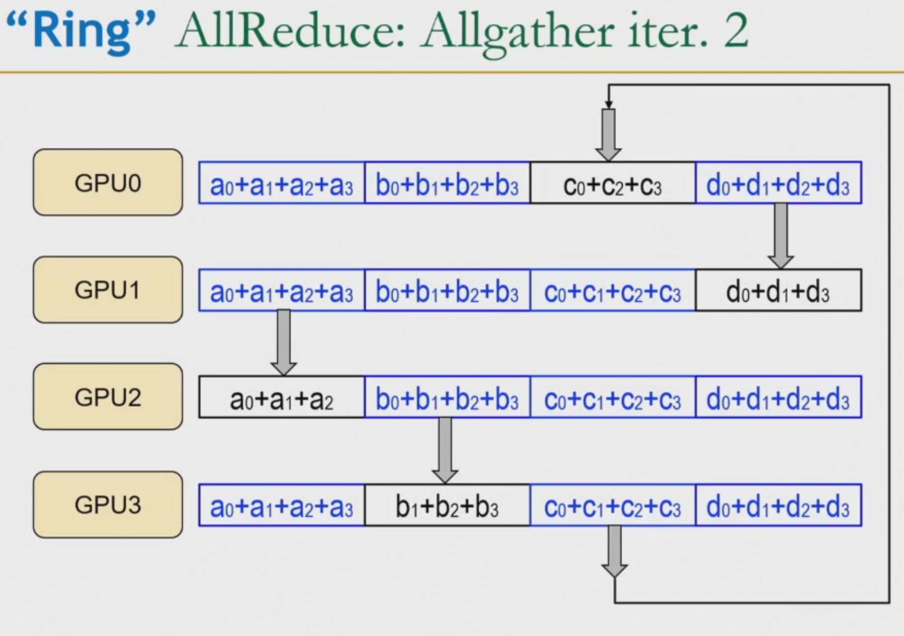  
*'In switch' AllReduce:each worker communicates with the switch  
#### challenges 
workload(epoches) increasing with batch size  
strong scaling:increase GPU number while maintaining minibatch size -> strong system  
weak scaling:increase GPU number while increasing minibatch size -> a little weaker strong system  
### model parallelism
#### inter layer pipeline
a worker is responsible for its portion of layers,e.g. worker 0 for layer 1,2;worker 1 for layer 3,4    
forward:worker0->1->2,loss,backward:worker2->1->0  
idle bubbles:67%(N-1/N idle slots)  
solution:subminibatches,cut minibatch into 2 subminibatches,after worker0 finishes computing the first subminibatch,worker1 can compute the first subminibatch while worker0 computes the second subminibatch  
idle bubbles:50%  
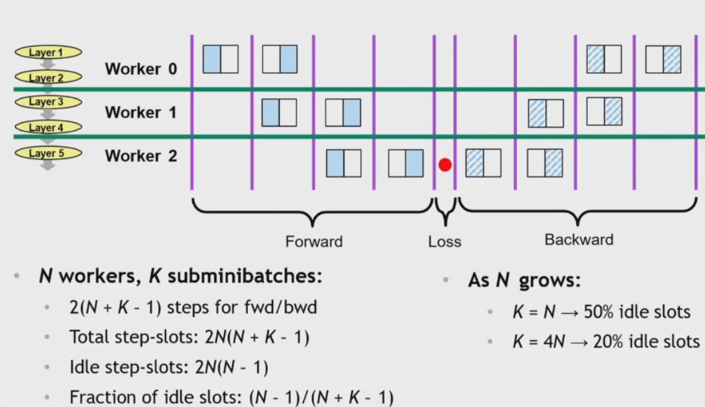  
N workers,K subminibatches:  
total step-slots:2N(N+K-1)  
idle step-slots:2N(N-1)  
fraction of idle slots:(N-1)/(N+K-1)   
challenges:overlap communication is hard;load balancing workload is difficult;idle slots reduce scaling efficiency  
#### intra layer(tensor parallelism)
a worker is responsible for its portion of each layer,e.g worker 0 for layer1.1,layer2.1,layer3.1;worker 1 for layer 1.2,layer2.2,layer3.2    
partition a given layer's weights addresses idle slots,load imbalance but causes more communication costs  
row-wise partitioning:an Allgather is needed between every two forward layers because each worker receives a portion of input w,all of input x and computes a portion of output y and the output y together is the next layer's x    
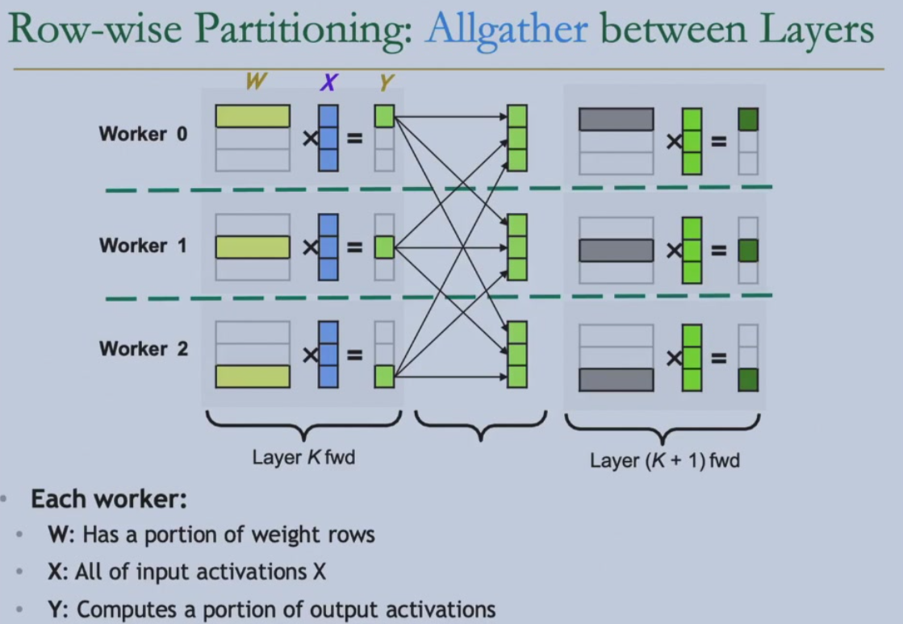  
column-wise partitioning:a ReduceScatter is needed between every two forward layers  
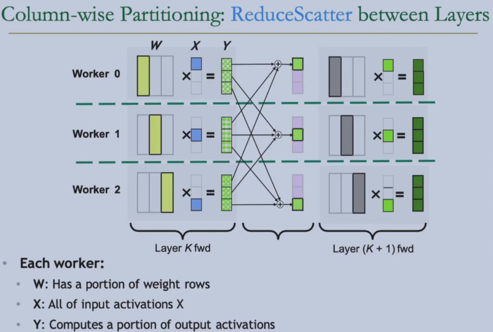  
reducing synchronization by alternating partitioning:row-wise partitioning then column-wise paritioning,no communication is needed for two layers,only a communication **AllReduce** after the two layers,reduce half of the communication  
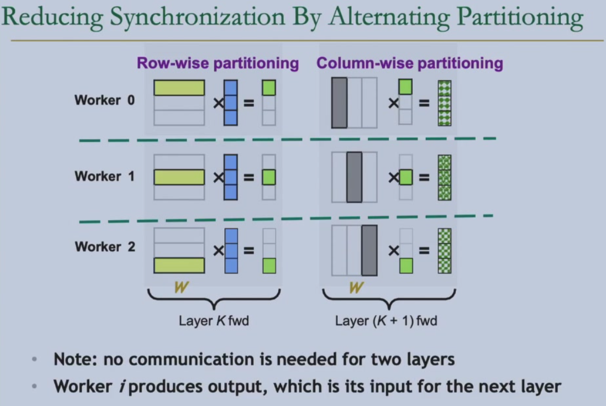  
backward is the inverse of forward:row -> column,column -> row,Allgather -> ReduceScatter,ReduceScatter -> Allgather  
Application:Transormer Block(Attention,MLP)  
## *Lecture 15: Flash Attention
### Storage
ZeRO:Zero Redundancy Optimizer(See NLP:Lecture 8:DeepSpeed-Zero)  
batch size limitation:how to choose parallel strategy?  
1K NPU/GPU -> small batch size -> tensor parallelism(tp)  
### flash attention
normal attention is bounded by IO,low GPU utilization  
flash attention:reduce IO,overlap of dropout,softmax,tensor core  
naive attention $O=softmax(QK^\top)V,Q_{S\times D},K_{S\times D}$  
- $O(S^2)$  
- repeated reads/writes from GPU memory  
- fp16 is low precision for softmax->safe softmax  
- softmax is not a streaming algorithm->online softmax  

softmax:$(\frac{e^{x_i}}{\sum_{j=1}^Ne^{x_j}})_{j=1}^N$  
safe softmax:$m = max_{j=1}^N(x_j),(\frac{e^{x_i-m}}{\sum_{j=1}^Ne^{x_j-m}})_{j=1}^N$  
3-pass for max,sum and result respectively  
```c
for i=1,...,N do
    m_i = max(m_{i-1}, x_i)
for i=1,...,N do 
    sum_i = sum_{i-1} + exp(x_i-mN)
for i=1,...,N do
    a_i = exp(x_i-mN) / sum_N
```
2-pass online softmax  
```c
for i=1,...,N do
    m_i = max(m_{i-1},x_i)
    sum_i = \sum_{j=0}^i exp(x_j-mi) = \sum_{j=0}^{i-1} exp(x_j-mi) + exp(x_i-mi) = sum_{i-1} * exp(m_{i-1-mi}) + exp(x_i-mi)
for i=1,...,N do
    a_i = exp(x_i-mN) / sum_N
```
#### *flash attention-1
- tiling:block size weight computation  
    - inter-tile:batch size and heads parallelism->low parallelism  
    - intra-tile:outer-loop:K,V;inner-loop:Q->extra access to HBM from O  
- recomputation:recompute the part needed during the backward pass instead of storing the full attention matrix  

#### flash attention-2
- inter-tile:batch size and Q parallelism->high parallelism  
- intra-tile:outer-loop:Q;inner-loop:K,V->no extra access to HBM  

#### flash attention-3
[problem] serial execution of GEMM,softmax and HBM  
[solution] warp specialization and intra-warpgroup overlapping  
warp spcialization:producer(DMA)-consumer model,overlap of memory access and computation  
intra-warpgroup overlapping:overlap softmax and GEMM  

#### flash attention-4
deeper warp specialization for Blackwell GPU  

### Ratel:Optimizing Holistic Data Movement to Fine-tune 100B Model on a Consumer GPU
## Lecture 16:Overview
