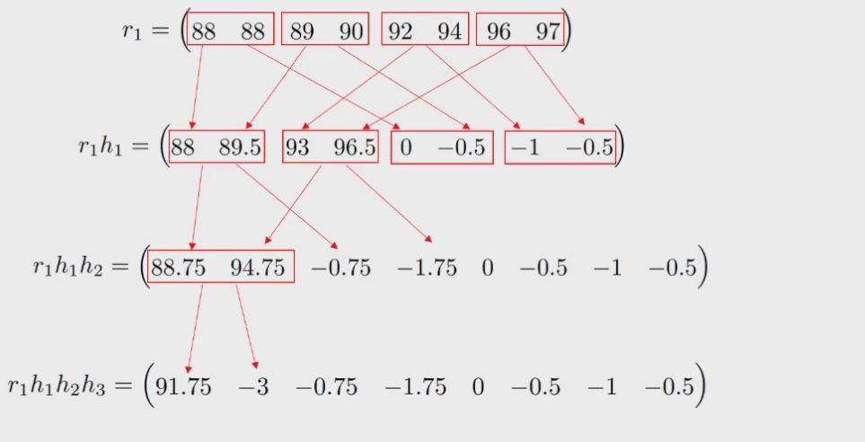
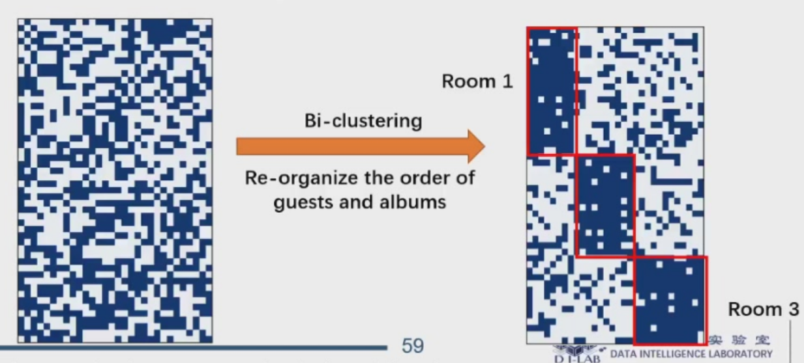
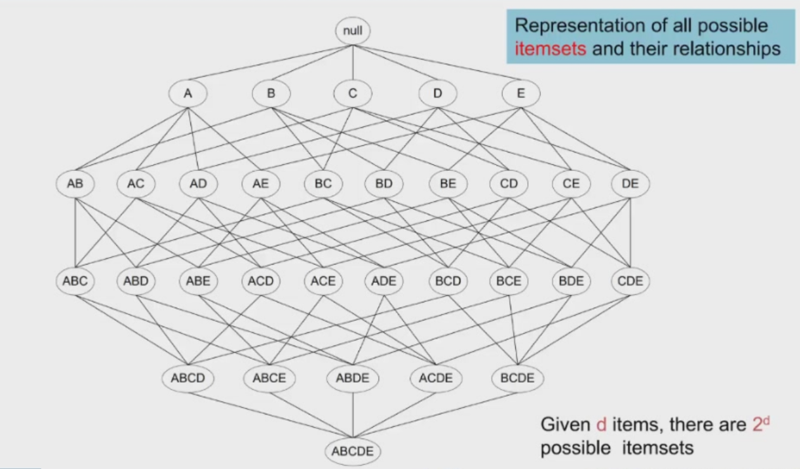
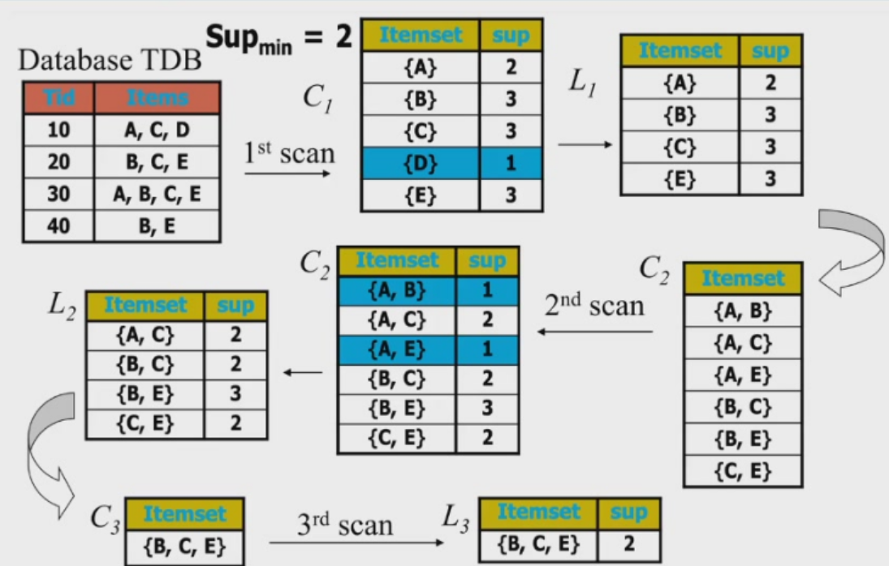
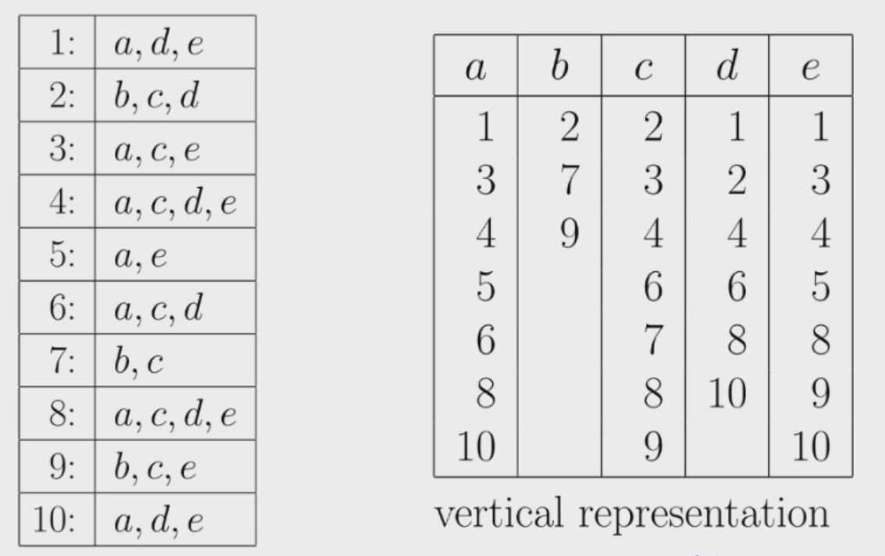
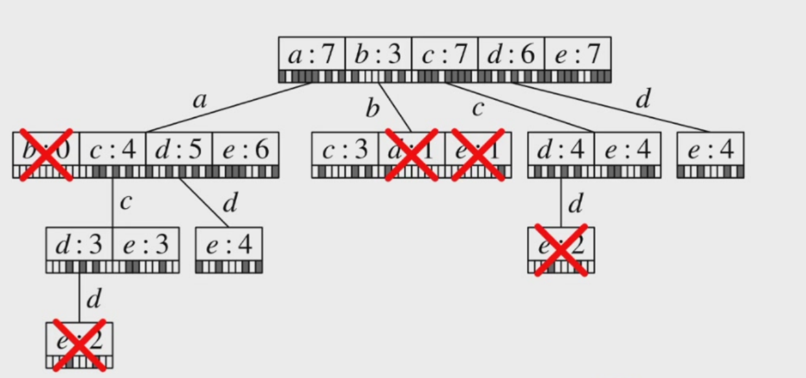
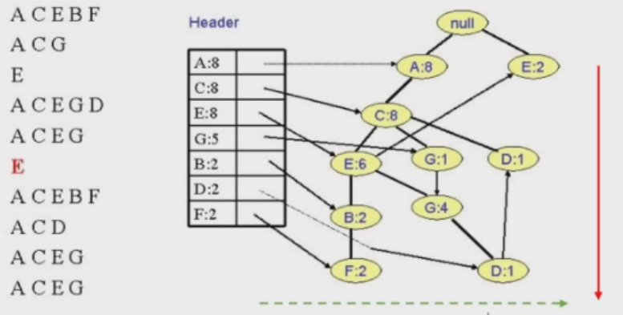
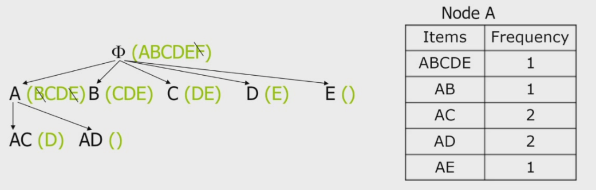
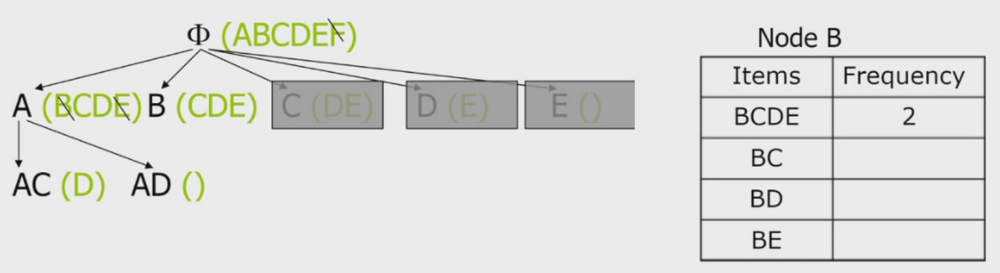

# 数据挖掘导论
## Lecture 1:Introduction
[Definition] knowledge discovery from data  
1.extraction of implicit,previously unknown and potentially useful info from data  
2.exploration and analysis,by automatic or semi-automatic means,of large quantities of data to find meaningful patterns  
input data -> data mining -> output data -> information pattern  
data types:relational table,set data,sequence data,time series,multimedia data,spatial-temporal data,graph data  
patterns:association rule,prediction(classification & regression),clustering,ranking(PageRank),recommendation(collaborative filtering,user-based & item-based)  
- structured data:relational record,matrix data  
attribute types:numerical,string,category(nominal(hair_color),binary,ordinal(size)),discrete vs. continuous  
- semi-structured data:emails,HTML,JSON  
- unstructured:textual,audio,image,video  

central tendency:mean,median,mode(众数)  
distribution:symmetric,positively skewed(mode < median < mean,e.g.居民收入),negatively skewed(mode > median > mean,e.g.人口寿命)  
disperation:variance($\sigma^2$ for population总体) and standard deviation($s^2$,unbiased estimation,for sample样本)  
boxplot,histogram,scatter  
Pearson corelation coefficient  

feature data visualization,high-dimensional data visualization with t-SNE,map mesh,hybrid visualizaion,tag cloud,graph  

similarity:L1/L2-distance,Minkowski distance(L-h),edit distance(string),Jaccard(set),DTW(Dynamic Time Wrapping for time series)  
## Lecture 2:Data Preprocessing and Data Warehouse
### Data Preprocessing
#### Data Cleaning
Missing Data,Inconsistent Data,Noisy Data  
HoloClean:ML  
RetClean:Retrieval-Based Data cleaning via LLM  
#### Data Integration
schema integration集成:provide uniform access to data avaliable in multiple,autonomous,heterogeneous and distributed data sources  
entity resolution实体解析:识别和合并来自同一个现实世界实体的不同数据记录  
redundancy handling  
#### Data Reduction
[Definition] Obtain a reduced representation of the dataset that is much smaller in volume but yet produces (almost) the same analytical result  
##### Dimensionality Reduction
PCA,LDA  
##### Numerosity Reduction
sampling:random/stratified(分层)  
#### Data Compression/Transformation
wavelet transform:无损变换，可逆  
  
grid index:外卖配送  
normalization:  
- min-max scaling $x'=\frac{x-min}{max-min}$  
- Z-score:$x'=\frac{x-\mu}{\sigma}$  
- log-based for term freq:$w_{t,d}=1 + \log t_{f,d}, if\ t_{f,d}>0$

### Data Warehouse
[Definition] 用于存储和管理来自多个异构数据源的历史数据、专为分析查询和商业智能优化的大型中央存储系统  
OLTP(online transaction processing) vs. OLAP(online analytical processing)  
[Features] subject oriented,integrated,time-variant,non-volatile(无损，cannot be deleted or changed)  
DataLake:centralized repository that allows you to store all your structured and unstructured data at any scale  
DataLake is schema on the read(analyze when use,for data scientists),DataWarehouse is schema on the write(analyze before storage,for business analytics)  
DataCube:data be modeled and viewed in multiple dimensions  
#### OLAP operations
aggregator:count(),sum(),min(),max(),avg(),median(),mode(),rank()  
roll-up & drill-down:increase/decrease data aggregation or removes/add detail level    
slicing:set one of the dimensions to reduce the number of cube dimensions  
dicing:reduce the set of data by a selection criterion  
pivoting:change the structure of the cube,view differently  
#### Implementation
View materialization:lazy,periodic or event-based/forced  
cube = a lattice of cuboids  
indexing:bitmap  
ClickHouse  
parallel read,join optimization  
## Lecture 3:Classification
semantic analysis,image classification,action recognition  
classification vs. regression  
weakly-supervised learning:low-quality label supervised learning  
self-supervised:crop and resize;masked autoencoding  
kNN,decision tree,Bayes classification,SVM  
linear regression,logistic regression,model ensemble  
## Lecture 4: Clustering
basic clustering see Machine Learning Lecture 25  
### soft clustering
each point can belong to multiple classes  
fuzzy C-means clustering:增加每个点属于某个类的隶属度权重$w_{ij}$,某个点属于所有超过一定隶属度的类别  
### Gaussian mixture model
fit data with mixture of Gaussian distributions(EM Algorithm)  
### Spectral clustering
1. similarity graph(data-pair distance computation)  
2. k eigenvectors and feature vector of Laplacian matrix   
3. run k-means on these features  
### Bi-clustering
$M_{ij}=1$ if guest i likes album j  
  
## Lecture 5: Outlier detection
[causes] data from different class or underlying mechanism,e.g. rare disease,fraud;natrual variation;data measurement or collection errors   
applications:spam/fraud;surveillance;detour;time series;point;contextual  
### statistical methods
$z=\frac{x-\mu}{\sigma}$  
Grubbs' Test:显著性水平检验  
### graphical methods
box plot  
scatter plot  
### density-based methods
max Local Outlier Factor(LOF)  
### isolation tree
distance from a point to root when partitioning a decision tree  
### credit-card fraud detection
autoencoder(regression model):encoder,code and decoder  
### spam email detection
binary classification with ML  
### trajectory detour detection
offline classification model:distance-based feature,time-based feature + logistic regression  
### prompt engineering
role assignment,specific task,clear constraints,format requirements  
step-by-step mastery,CoT  
sytle mirroring(few-shot prompting)  
error correction  
## Lecture 6: Frequent Pattern Mining 
frequent item set mining(find the items that are bought together)  
frequent attraction set mining
DNA sequence mining  
frequent travel route mining  
frequent co-location mining  
frequent subgraph mining  
### Apriori Algorithm
[goal] find the set of items appear together for at least xx times  
item set lattice  
  
K-item set:{beer,diaper} is 2-item set  
support:frequency of an item set(fraction)   
frequent item set:support of the item set > minSup  
Observation 1:If an item set is frequent,its subsets are frequent  
Observation 2:If an item set is infrequent,its supersets are infrequent  
candidates in the i-th level generated from the frequent candidates in the i-1-th level,e.g. ABCD = ABC join ABD  
pruning:if a candidate is not frequent,prune all its supersets in the next level  
  
[problem] a database scan for every level  
Association Rule Mining:Association rule:X->Y,means if X is purchased,so is Y  
confidence = P(Y|X)  
association rule:confidence of X->Y >= minConf  
### Eclat Algorithm
vertical representation
  
depth-first search  
  
### FP-Tree and FP-Growth  
avoid repeat scan of database  
stage 1:using FP-Tree to represent the database using a compressed representation  
stage 2:use divide-and-conquer to mine the frequent item sets  
  
F-list:A-C-E-G-B-D-F  
minSup = 5 -> candidates end with B,D,F are pruned  
patterns end with G,E,C,A -> conditional patterns -> frequent patterns  
### Closed and Maximal pattern mining 
closed item set:an item set is closed if 1)it is frequent and 2)none of its superset has the same support  
maximal item set:an item set is maximal if 1)it is frequent and 2)none of its superset is frequent  
MaxMiner Algorithm  
  
  
### Frequent Subgraph Mining
Graph Isomorphism同构 determination  
Apriori-based Graph Mining:vertex based/edge based  
### agent skill
skill/skill.md,references/,scripts/,assets/  
skill.md:metadata, main instructions  
按需加载技能具体指令，节省token，避免干扰  
reference/:FAQ,API,在skill.md中写明什么时候加载 reference/中的文件  
scripts/:python,bash,在skill.md中写明调用脚本的指令与脚本说明  
assets/:模板，图片等静态资源
## Lecture 7: Data Mining Development Trend
## Lecture 8: Project Presentation
